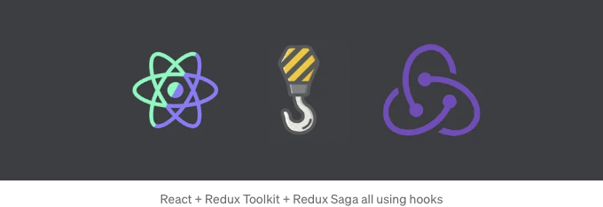

React 애플리케이션에서 Redux Saga와 함께 Redux Toolkit을 구현하는 방법은 다음과 같습니다.



React 애플리케이션을 개발할 때 특정 기능에 대해 무엇을 사용해야 할지 고민하는 경우가 많습니다. 그러나 "데이터 저장"에 관한 문제가 있을 때는 "Context API" 또는 "Redux"를 선택해야 합니다.

따라서 몇 가지 질문을 스스로에게 해보아야 합니다...

<!-- ui-log 수평형 -->
<ins class="adsbygoogle"
  style="display:block"
  data-ad-client="ca-pub-4877378276818686"
  data-ad-slot="9743150776"
  data-ad-format="auto"
  data-full-width-responsive="true"></ins>
<component is="script">
(adsbygoogle = window.adsbygoogle || []).push({});
</component>

- API를 사용할 수 있나요?
- 이 API에서 너무 많은 데이터를 소비하고 있나요?
- 이 API에 너무 많은 엔티티가 있나요?

위 질문에 대답이 "네"이면 "Redux"를 사용하게 됩니다. 그렇지 않으면 "Context API"를 사용하시게 됩니다.

# 1 — 개요

## A — Redux란 무엇인가요?

<!-- ui-log 수평형 -->
<ins class="adsbygoogle"
  style="display:block"
  data-ad-client="ca-pub-4877378276818686"
  data-ad-slot="9743150776"
  data-ad-format="auto"
  data-full-width-responsive="true"></ins>
<component is="script">
(adsbygoogle = window.adsbygoogle || []).push({});
</component>

Redux는 주로 React와 함께 사용되는 JavaScript 애플리케이션을 위한 상태 관리 라이브러리입니다. Redux는 예측 가능한 상태 컨테이너를 제공하여 응용 프로그램 상태를 단일 중앙 위치에서 쉽게 관리할 수 있도록 합니다. Redux는 불변성과 단방향 데이터 흐름의 원칙에 기반을 두고 있어 응용 프로그램 상태의 변경 사항을 시간이 지남에 따라 이해하기 쉽게 합니다. Redux를 사용하면 액션을 디스패치하여 상태를 업데이트하고, 이러한 액션은 리듀서라고 불리는 순수 함수에 의해 처리되어 액션 유형 및 페이로드에 기반한 새로운 상태를 반환합니다. Redux는 또한 비동기 작업 및 기타 고급 사용 사례를 처리하기 위한 미들웨어를 제공합니다. 총론적으로 Redux는 복잡한 애플리케이션 상태의 관리를 간소화하고 확장 가능하고 유지보수하기 쉬운 애플리케이션을 구축할 수 있도록 도와줍니다.

그래서... 우리는 Redux Toolkit을 사용하고 있어요.

## B— Redux Toolkit이란?

Redux Toolkit에는 사전 구성된 Redux 스토어가 포함되어 있으며, 필요한 미들웨어 및 리듀서 설정과 DevTools 지원을 포함하고 있습니다. 또한 Redux 슬라이스를 생성하는 강력한 유틸리티 세트를 제공합니다. 슬라이스를 사용하면 리덕스 상태 및 로직의 작은 자기 포함 모듈인 리듀서 함수와 액션 생성자를 더 간결하고 직관적인 구문으로 정의할 수 있습니다. 총론적으로 Redux Toolkit은 리덕스를 사용하는 간소화된 관점 있는 방법을 제공하여 개발자가 더 나은 코드를 더 적은 노력으로 작성하고 유지보수할 수 있도록 도와줍니다.

<!-- ui-log 수평형 -->
<ins class="adsbygoogle"
  style="display:block"
  data-ad-client="ca-pub-4877378276818686"
  data-ad-slot="9743150776"
  data-ad-format="auto"
  data-full-width-responsive="true"></ins>
<component is="script">
(adsbygoogle = window.adsbygoogle || []).push({});
</component>

## C — 비동기 작업

Redux 상태를 관리하는 것은 간단한 작업이지만, REST API를 소비하는 것은 Redux 구조 내에서 고려해야 합니다.

Redux Toolkit은 비동기 코드를 처리하는 유틸리티 함수 세트를 제공하며, Redux 썩 함수를 정의하는 데 사용하는 createAsyncThunk과 Redux 내에서 정규화된 데이터를 관리하는 데 사용하는 createEntityAdapter이 포함되어 있습니다.

## D — Redux Thunk 대 Redux Saga

<!-- ui-log 수평형 -->
<ins class="adsbygoogle"
  style="display:block"
  data-ad-client="ca-pub-4877378276818686"
  data-ad-slot="9743150776"
  data-ad-format="auto"
  data-full-width-responsive="true"></ins>
<component is="script">
(adsbygoogle = window.adsbygoogle || []).push({});
</component>

Redux Thunk와 Redux Saga는 Redux를 위한 미들웨어 라이브러리로, Redux 애플리케이션에서 비동기 논리를 관리하는 접근 방식을 제공합니다.

- Redux Thunk는 함수 대신 액션 객체를 반환하는 액션 생성자를 작성할 수 있게 해주는 간단한 미들웨어 라이브러리입니다. 이 함수는 API 호출과 같은 비동기 작업을 수행하고 작업이 완료되면 액션을 디스패치할 수 있습니다. 이 함수는 또한 작업 결과에 따라 추가적인 액션을 디스패치할 수 있습니다. 이 접근 방식은 쉽게 배울 수 있으며 대부분의 일반적인 사용 사례에 사용할 수 있습니다. Redux Thunk는 구성이 간단하며 최소한의 구성으로 사용할 수 있습니다.
- Redux Saga는 반면에 Redux에서 비동기 작업을 관리하기 위한 강력하고 유연한 미들웨어 라이브러리입니다. 이를 사용하면 "사가"라고 불리는 단계들의 시퀀스로 복잡한 비동기 로직을 정의할 수 있습니다. 사가는 더 복잡한 시나리오인 경합 조건, 재시도 및 취소와 같은 것들을 다루는 데 사용할 수 있습니다. Redux Saga는 제너레이터 함수를 사용하여 사가를 정의하는데, 이를 통해 더 복잡한 로직을 더 읽기 쉽고 직관적으로 표현할 수 있습니다. 그러나 Redux Thunk와 비교해 배우고 효과적으로 사용하는 것이 더 어려울 수 있습니다.

종합하면, Redux Thunk는 Redux에서 비동기 작업을 관리하기 위한 더 간단하고 사용하기 쉬운 미들웨어 라이브러리이며, Redux Saga는 더 복잡한 시나리오를 처리하기 위한 강력하고 유연한 접근 방식을 제공합니다. 이 둘 사이의 선택은 대부분 애플리케이션의 복잡성과 처리해야 하는 특정 사용 사례에 달려 있습니다.

이전에 언급했듯이, 이 글에서는 Redux Toolkit과 함께 Redux Saga를 어떻게 구현하는지를 단계별로 보여드릴 것입니다. 사용된 사가 함수들은 간단한 방식으로 설명될 것입니다.

<!-- ui-log 수평형 -->
<ins class="adsbygoogle"
  style="display:block"
  data-ad-client="ca-pub-4877378276818686"
  data-ad-slot="9743150776"
  data-ad-format="auto"
  data-full-width-responsive="true"></ins>
<component is="script">
(adsbygoogle = window.adsbygoogle || []).push({});
</component>

# 2 — 코딩 시작

## A — React 프로젝트 생성

예를 들어 redux-with-saga라는 React 프로젝트를 생성해 봅시다:

```js
# 자바스크립트 프로젝트
$ npx create-react-app redux-with-saga

# 타입스크립트 프로젝트
$ npx create-react-app redux-with-saga --template typescript
```

<!-- ui-log 수평형 -->
<ins class="adsbygoogle"
  style="display:block"
  data-ad-client="ca-pub-4877378276818686"
  data-ad-slot="9743150776"
  data-ad-format="auto"
  data-full-width-responsive="true"></ins>
<component is="script">
(adsbygoogle = window.adsbygoogle || []).push({});
</component>

## B — 패키지 추가

다음 패키지를 추가하고 있습니다:

```js
$ npm install react-redux @reduxjs/toolkit redux-saga
# 또는
$ yarn add react-redux @reduxjs/toolkit redux-saga
```

## C — Redux 스토어 구성

<!-- ui-log 수평형 -->
<ins class="adsbygoogle"
  style="display:block"
  data-ad-client="ca-pub-4877378276818686"
  data-ad-slot="9743150776"
  data-ad-format="auto"
  data-full-width-responsive="true"></ins>
<component is="script">
(adsbygoogle = window.adsbygoogle || []).push({});
</component>

패키지 설치가 완료되면 src/ 폴더 내에 "store" 또는 "redux" 또는 리덕스 구현을 가리키는 다른 이름의 새 폴더를 만듭니다:

"redux" 폴더 안에 index.ts/js 파일을 만들어 리덕스를 구성합니다:

```js
import createSagaMiddleware from "@redux-saga/core";
import { configureStore } from "@reduxjs/toolkit";

const sagaMiddleware = createSagaMiddleware();

const store = configureStore({
  reducer: {},
  middleware: [sagaMiddleware],
});

export default store;
```

## 설명:

<!-- ui-log 수평형 -->
<ins class="adsbygoogle"
  style="display:block"
  data-ad-client="ca-pub-4877378276818686"
  data-ad-slot="9743150776"
  data-ad-format="auto"
  data-full-width-responsive="true"></ins>
<component is="script">
(adsbygoogle = window.adsbygoogle || []).push({});
</component>

- createSagaMiddleware — Redux 미들웨어 인스턴스를 생성하고 Sagas를 Redux Store에 연결합니다.
- configureStore — @reduxjs/toolkit 패키지에서 제공하는 함수로, 합리적인 기본값과 내장 미들웨어가 포함된 Redux 스토어를 생성하는 과정을 간단화합니다.

reducer 키는 단일 글로벌 reducer(object)에 결합된 모든 애플리케이션 reducer를 포함하는 객체입니다. 현재는 아직 reducer가 없기 때문에 빈 개체를 전달합니다.

middleware 키는 리덕스 구성에 사용될 미들웨어 목록을 나타냅니다.

마지막으로 스토어를 내보냅니다.

<!-- ui-log 수평형 -->
<ins class="adsbygoogle"
  style="display:block"
  data-ad-client="ca-pub-4877378276818686"
  data-ad-slot="9743150776"
  data-ad-format="auto"
  data-full-width-responsive="true"></ins>
<component is="script">
(adsbygoogle = window.adsbygoogle || []).push({});
</component>

## D — 우리 React 앱 내에서 저장소 구성 사용하기

```js
import React from 'react';
import ReactDOM from 'react-dom/client';
import { Provider } from 'react-redux';
import App from './App';
import store from './redux';

const root = ReactDOM.createRoot(
  document.getElementById('root') as HTMLElement
);
root.render(
  <React.StrictMode>
    <Provider store={store}>
      <App />
    </Provider>
  </React.StrictMode>
);
```

Provider 컴포넌트는 react-redux 패키지에서 내보낸 React 엘리먼트로, App 컴포넌트를 자식으로 사용하고 store 구성을 store라는 prop으로 가져옵니다.

이 아이디어는 저장소가 응용 프로그램 내의 모든 컴포넌트에서 접근 가능하게 하는 것입니다. 하지만... 만약 Provider 엘리먼트를 App 컴포넌트 내부로 옮긴다면 어떻게 될까요? 이 경우, 모든 컴포넌트가 redux 저장소를 사용할 수 있지만 App 컴포넌트는 제외됩니다. 왜냐하면 Provider 컴포넌트의 "children" 중 하나로 간주되지 않기 때문입니다. 이렇게 간단한 문제입니다...

<!-- ui-log 수평형 -->
<ins class="adsbygoogle"
  style="display:block"
  data-ad-client="ca-pub-4877378276818686"
  data-ad-slot="9743150776"
  data-ad-format="auto"
  data-full-width-responsive="true"></ins>
<component is="script">
(adsbygoogle = window.adsbygoogle || []).push({});
</component>

## E — 루트 리듀서 생성

보통 Redux 스토어 설정을 끝냈지만... 우리는 더 많은 리듀서를 추가할수록 redux/index.ts/js 파일이 점점 커지는 것을 원치 않을 거예요. 그래서... redux/root-reducer.ts/js라는 별도의 파일을 생성하려고 합니다.

```js
import userReducer from "./users/slice";

export type StateType = {
  // 여기에 리듀서 유형을 작성하세요
};

const rootReducers = {
  // 여기에 리듀서들을 작성하세요
};

export default rootReducers;
```

모든 애플리케이션 리듀서를 하나로 결합한 객체인 루트 리듀서를 포함한 별도의 파일을 생성하는 것은 더 깔끔하고 명확하게 유지하는 가장 좋은 방법으로 여겨집니다.

<!-- ui-log 수평형 -->
<ins class="adsbygoogle"
  style="display:block"
  data-ad-client="ca-pub-4877378276818686"
  data-ad-slot="9743150776"
  data-ad-format="auto"
  data-full-width-responsive="true"></ins>
<component is="script">
(adsbygoogle = window.adsbygoogle || []).push({});
</component>

StateType은 전역 상태의 타입을 나타내는 Typescript 타입입니다.

이제 index.ts/js 파일로 돌아가서 구성에서 reducer 키에 root reducer를 전달해줍니다:

```js
import createSagaMiddleware from "@redux-saga/core";
import { configureStore } from "@reduxjs/toolkit";
import rootReducers from "./root-reducers";

const sagaMiddleware = createSagaMiddleware();

const store = configureStore({
  // 아래 줄을 업데이트하세요
  reducer: rootReducers,
  middleware: [sagaMiddleware],
});

export default store;
```

## F — 슬라이스 만들기

<!-- ui-log 수평형 -->
<ins class="adsbygoogle"
  style="display:block"
  data-ad-client="ca-pub-4877378276818686"
  data-ad-slot="9743150776"
  data-ad-format="auto"
  data-full-width-responsive="true"></ins>
<component is="script">
(adsbygoogle = window.adsbygoogle || []).push({});
</component>

REST API의 사용자 엔드포인트를 사용한다고 가정해 봅시다. 이를 위해 항상 코드를 깔끔하게 유지하고 싶어서 3개의 파일을 생성합니다.

- types.ts/js
- slice.ts/js
- sagas.ts/js

## types file

프로젝트 전반에 걸쳐 사용자 엔터티에 사용할 수 있는 모든 유형을 정의합니다.

<!-- ui-log 수평형 -->
<ins class="adsbygoogle"
  style="display:block"
  data-ad-client="ca-pub-4877378276818686"
  data-ad-slot="9743150776"
  data-ad-format="auto"
  data-full-width-responsive="true"></ins>
<component is="script">
(adsbygoogle = window.adsbygoogle || []).push({});
</component>

```js
// 사용자 유형 정의
export type UserType = {
  id: string;
  name: string;
  lastname: string;
  email: string;
  active: boolean;
  createdAt: Date;
  updatedAt: Date;
}

// 단일 ID를 사용하여 사용자 상태를 가져오는 서브 상태를 나타내는 이 유형
export type IUserState = {
  data: UserType | null;
  isLoading: boolean;
  errors: string;
}

// 사용자 전역 상태
export type UsersStateType = {
  user: IUserState,
  // 나중에 다음과 같은 다른 서브 상태를 추가할 수 있습니다:
  // list,
  // create,
  // update,
  // remove
}

// (1)
export const USERS = "users";
export type USERS = typeof USERS; // TypeScript 라인

// (2)
export const GET_USER_BY_ID = `${USERS}/getUserAction`;
export type GET_USER_BY_ID = typeof GET_USER_BY_ID; // TypeScript 라인
```

(1) — 'users' 텍스트를 취하는 USERS 상수를 만들고, 상수 USERS와 동일한 이름을 가진 유형을 만들어 해당 유형을 const USERS의 유형으로 지정합니다. 이를 통해 TypeScript에게 말하는 것입니다. 유형이 USERS로 지정된 모든 것은 "users" 값을만 수락해야 합니다. "users2"와 같이 "users"를 잘못 입력하면 TypeScript가 변수가 값으로 "users"만 허용한다는 오류를 보여줄 것입니다.

이 기법을 사용하면 프로젝트가 커지면 코딩이 더 안전해질 것이며 "usres"와 같이 "users"를 잘못 입력할 수도 있습니다. 그래서 TypeScript가 경고를 표시해줄 것입니다.

(2)도 마찬가지입니다 — GET_USER_BY_ID```

<!-- ui-log 수평형 -->
<ins class="adsbygoogle"
  style="display:block"
  data-ad-client="ca-pub-4877378276818686"
  data-ad-slot="9743150776"
  data-ad-format="auto"
  data-full-width-responsive="true"></ins>
<component is="script">
(adsbygoogle = window.adsbygoogle || []).push({});
</component>

## 슬라이스 파일

```js
import { createSlice, PayloadAction } from "@reduxjs/toolkit";
import { USERS, UsersStateType, UserType } from "./types";

const usersInitialState: UsersStateType = {
  user: {
    data: null,
    isLoading: false,
    errors: "",
  }
}

export const usersSlice = createSlice({
  name: USERS,
  initialState: usersInitialState,
  reducers: {
    /* 이 액션은 사가 미들웨어를 트리거하고
       로더를 true로 설정하고 오류 메시지를 재설정합니다.
    */
    getUserAction: (state: UsersStateType, { payload: id }: PayloadAction<string>) => {
    state.user.isLoading = true;
    state.user.errors = '';
    },
    getUserSuccessAction: (state: UsersStateType, { payload: user }: PayloadAction<UserType>) => {
    state.user.isLoading = false;
    state.user.data = user;
    },
    getUserErrorAction: (state: UsersStateType, { payload: error }: PayloadAction<string>) => {
    state.user.isLoading = false;
    state.user.errors = error;
    },
  }
}

/* getUserSuccessAction 및 getUserErrorAction은 사가 내부에서 사용됩니다.
   React 컴포넌트에서는 getUserAction만 사용됩니다.
*/

export {
  getUserAction,
  getUserSuccessAction,
  getUserErrorAction
} = usersSlice.actions;
export default usersSlice.reducer;
```

사용자 리듀서를 내보낸 후에는 루트 리듀서 파일에 추가하고 상태 유형을 업데이트해야합니다:

```js
import userReducer from "./users/slice";
import { UsersStateType } from "./users/types";
import usersReducer from "./users/slice";

export type StateType = {
  users: UsersStateType;
};

const rootReducers = {
  users: usersReducer,
};

export default rootReducers;
```

<!-- ui-log 수평형 -->
<ins class="adsbygoogle"
  style="display:block"
  data-ad-client="ca-pub-4877378276818686"
  data-ad-slot="9743150776"
  data-ad-format="auto"
  data-full-width-responsive="true"></ins>
<component is="script">
(adsbygoogle = window.adsbygoogle || []).push({});
</component>

## 사가 파일

```js
import { PayloadAction } from "@reduxjs/toolkit";
import { AxiosResponse } from "axios";
import { put, takeLatest } from "redux-saga/effects";
import { UserType, GET_USER_BY_ID } from "./types";
import { getUserErrorAction, getUserSuccessAction } from "./slice";

// 제너레이터 함수
function* getUserSaga({ payload: id }: PayloadAction<string>) {
  try {
    // axios 호출을 함수로 내보낼 수도 있습니다.
    const response: AxiosResponse<UserType> = yield axios.get(`your-server-url:port/api/users/${id}`);
    yield put(getUserSuccessAction(response.data));
  } catch (error) {
    yield put(getUserErrorAction(error));
  }
}

// 제너레이터 함수
export function* watchGetUser() {
  yield takeLatest(GET_USER_BY_ID, getUserSaga);
}
```

## 제너레이터 함수란?

JavaScript에서 제너레이터 함수는 실행 중에 일시 중지되고 재개될 수 있는 특별한 종류의 함수입니다. 제너레이터 함수가 호출되면 이터레이터 객체가 반환되며, 이를 사용하여 함수의 실행을 제어할 수 있습니다.

<!-- ui-log 수평형 -->
<ins class="adsbygoogle"
  style="display:block"
  data-ad-client="ca-pub-4877378276818686"
  data-ad-slot="9743150776"
  data-ad-format="auto"
  data-full-width-responsive="true"></ins>
<component is="script">
(adsbygoogle = window.adsbygoogle || []).push({});
</component>

제너레이터 함수는 일반 함수 구문과 구분되는 function* 구문을 사용하여 정의됩니다. 제너레이터 함수 내에서는 실행을 일시 중지하고 호출자에게 값을 반환하기 위해 yield 키워드가 사용됩니다. 제너레이터 함수가 다시 실행되면 중단한 곳부터 실행을 계속합니다.

다음은 간단한 제너레이터 함수의 예시입니다:

```js
function* myGenerator() {
  yield 1;
  yield 2;
  yield 3;
}

const gen = myGenerator();

console.log(gen.next()); // { value: 1, done: false }
console.log(gen.next()); // { value: 2, done: false }
console.log(gen.next()); // { value: 3, done: false }
console.log(gen.next()); // { value: undefined, done: true }
```

자세한 내용은 여기에서 제너레이터 함수에 대해 더 읽어보세요.

<!-- ui-log 수평형 -->
<ins class="adsbygoogle"
  style="display:block"
  data-ad-client="ca-pub-4877378276818686"
  data-ad-slot="9743150776"
  data-ad-format="auto"
  data-full-width-responsive="true"></ins>
<component is="script">
(adsbygoogle = window.adsbygoogle || []).push({});
</component>

yield — yield 키워드는 Redux Saga의 기본 요소로, Saga가 사용하는 제너레이터 함수가 디스패치된 액션에 대한 응답으로 실행을 일시 중지하고 다시 시작할 수 있도록 허용합니다. 제너레이터 함수가 yield 문을 만나면, 얻어진 값을 검색하는 데 사용할 수 있는 이터레이터를 반환합니다. 그러면 값은 Saga 미들웨어의 다른 부분에서 처리될 수 있습니다.

Redux Saga에서는 yield가 자주 다른 함수와 함께 사용됩니다. 예를 들어, call, put, select 등의 함수와 함께 사용됩니다. 예를 들어, call 함수는 비동기 함수를 호출하고 그 결과를 반환하는 데 사용됩니다.

put — put 함수는 액션을 Redux 스토어로 디스패치하는 데 사용됩니다.

takeLatest — Redux에서 takeLatest는 redux-saga 미들웨어에서 제공하는 함수로, 비동기 액션을 더욱 제어할 수 있는 방법을 제공합니다. Redux 스토어에 액션이 디스패치되면 takeLatest는 이전 진행 중인 작업을 취소하고 가장 최근 것만 실행합니다.

<!-- ui-log 수평형 -->
<ins class="adsbygoogle"
  style="display:block"
  data-ad-client="ca-pub-4877378276818686"
  data-ad-slot="9743150776"
  data-ad-format="auto"
  data-full-width-responsive="true"></ins>
<component is="script">
(adsbygoogle = window.adsbygoogle || []).push({});
</component>

takeLatest를 사용하려면 특정 액션을 청취하는 다른 제너레이터 함수를 정의해야 합니다.

위의 코드에서 watchGetUser는 GET_USER_BY_ID 액션을 청취하는 제너레이터 함수입니다. 이 액션이 디스패치되면 getUserSaga 제너레이터 함수가 호출됩니다. getUserSaga는 API를 호출하고 API 호출이 성공 또는 실패할 때 put 효과를 사용하여 getUserSuccessAction 또는 getUserErrorAction 액션을 디스패치합니다.

takeLatest를 사용하는 장점은 이전 요청이 아직 진행 중이더라도 최신 요청만 처리된다는 것입니다. 이는 경합 조건을 피하고 응용 프로그램 상태가 항상 최신 데이터와 동기화되도록 하는 데 도움이 됩니다.

이제 watchGetUser 제너레이터 함수를 리덕스 프로세스에 추가할 수 있습니다. 따라서 ... 루트 리듀서 파일과 동일한 수준에 root-sagas.ts/js라는 새 파일을 만듭니다:

<!-- ui-log 수평형 -->
<ins class="adsbygoogle"
  style="display:block"
  data-ad-client="ca-pub-4877378276818686"
  data-ad-slot="9743150776"
  data-ad-format="auto"
  data-full-width-responsive="true"></ins>
<component is="script">
(adsbygoogle = window.adsbygoogle || []).push({});
</component>

```js
import { all, fork } from "redux-saga/effects";
import { watchGetUser } from "./users/sagas";

const rootSaga = function* () {
  yield all([
    fork(watchGetUser),
    // Other forks
  ]);
};

export default rootSaga;
```

rootSaga를 내보낸 후에는 리덕스 구성 파일에 추가해야 합니다. 따라서 index.ts/js 파일에서:

```js
import createSagaMiddleware from "@redux-saga/core";
import { configureStore } from "@reduxjs/toolkit";
import rootReducers from "./root-reducers";
// 추가된 import
import rootSaga from "./root-sagas";

const sagaMiddleware = createSagaMiddleware();

const store = configureStore({
  reducer: rootReducers,
  middleware: [sagaMiddleware],
});

// 추가된 줄
sagaMiddleware.run(rootSaga);

export default store;
```

index 파일에서 수정된 내용을 기준으로 root-sagas 파일까지 되돌아가보겠습니다:
```

<!-- ui-log 수평형 -->
<ins class="adsbygoogle"
  style="display:block"
  data-ad-client="ca-pub-4877378276818686"
  data-ad-slot="9743150776"
  data-ad-format="auto"
  data-full-width-responsive="true"></ins>
<component is="script">
(adsbygoogle = window.adsbygoogle || []).push({});
</component>

모든 / fork — Redux Saga에서 fork 및 all 함수는 동시에 발생하는 사가들을 생성하고 관리하는 데 사용됩니다.

fork는 부모 Saga와 동시에 실행되는 새로운 하위 Saga를 만드는 데 사용됩니다.

all 함수는 여러 개의 사가를 병렬로 실행하고 그 중 모두 완료되기를 기다린 후 부모 Saga의 실행을 계속합니다.

다른 사가가 있다면:

<!-- ui-log 수평형 -->
<ins class="adsbygoogle"
  style="display:block"
  data-ad-client="ca-pub-4877378276818686"
  data-ad-slot="9743150776"
  data-ad-format="auto"
  data-full-width-responsive="true"></ins>
<component is="script">
(adsbygoogle = window.adsbygoogle || []).push({});
</component>

```js
import { all, fork } from "redux-saga/effects";
import { watchGetUser } from "./users/sagas";

const rootSaga = function* () {
  yield all([
    fork(watchGetUser),
    // 아래에 감시자가 있는 경우
    // fork(watchGetUsersList),
  ]);
};

export default rootSaga;
```

watchGetUser와 watchGetUsersList는 두 개의 사가이며, all을 사용하여 시작됩니다. all 함수는 두 사가가 완료될 때까지 부모 사가인 rootSaga의 실행을 계속합니다.

fork와 all을 사용함으로써 Redux Saga에서 동시에 작업하는 사가를 생성하고 관리할 수 있습니다. 이를 통해 여러 작업을 병렬로 실행하여 애플리케이션을 더 반응적이고 효율적으로 만들 수 있습니다.

run — Redux Saga에서 run 함수는 미들웨어를 시작하고 루트 사가를 실행하는 데 사용됩니다. run 함수는 루트 사가 함수인 하나의 인수를 사용합니다. 미들웨어 인스턴스의 run 함수에 루트 사가 함수를 전달하여 사가를 시작하고 발송된 액션에 대해 청취할 수 있게 합니다.
```

<!-- ui-log 수평형 -->
<ins class="adsbygoogle"
  style="display:block"
  data-ad-client="ca-pub-4877378276818686"
  data-ad-slot="9743150776"
  data-ad-format="auto"
  data-full-width-responsive="true"></ins>
<component is="script">
(adsbygoogle = window.adsbygoogle || []).push({});
</component>

Middleware를 run 함수를 사용하여 시작하면 루트 Saga가 실행되고 그 안에 있는 제너레이터 함수가 시작됩니다. 그런 다음 미들웨어는 전달된 액션을 수신하고 해당 Saga 제너레이터 함수에게 yield 키워드를 사용하여 전달합니다.

만일 전달된 액션이 Saga에서 정의된 패턴과 일치하면, 미들웨어는 Saga를 yield 문에서 일시 중단하고 Saga 내의 코드를 실행합니다. Saga가 실행을 완료하면, 미들웨어는 제너레이터 함수를 재개하고 남은 전달된 액션을 계속 처리합니다.

## G — React 컴포넌트에서 Redux 액션 사용

Redux 구성과 사가 미들웨어, 타입, 슬라이스 및 사가 파일을 생성한 후, 이제 상태를 사용하고 트리거 액션을 디스패치하는 시간입니다.

<!-- ui-log 수평형 -->
<ins class="adsbygoogle"
  style="display:block"
  data-ad-client="ca-pub-4877378276818686"
  data-ad-slot="9743150776"
  data-ad-format="auto"
  data-full-width-responsive="true"></ins>
<component is="script">
(adsbygoogle = window.adsbygoogle || []).push({});
</component>

프로필 페이지를 나타내는 컴포넌트를 가지고 있다고 가정해 봅시다.

```js
import React, { useEffect } from "react";
import { useDispatch, useSelector } from "react-redux";
import { useParams } from "react-router-dom";
import { getUserAction } from "../redux/users/slice";
import { StateType } from "../redux/root-reducer";

const ProfilePage: React.FC = () => {

  const { data, isLoading } = useSelector((state: StateType) => state.users);

  const { id } = useParams();

  const dispatch = useDispatch();

  useEffect(() => {
    dispatch(getUserAction(id));
  }, [id]);

  return (
    <div>
      {
        isLoading
        ?
        (<span>Loading...</span>)
        :
        data
          ?
          (<div>안녕, 나는 {data.name}이야</div>)
          :
          (<span>사용자를 찾을 수 없어요!</span>)
      }
    </div>
  )
}
```

useSelector — useSelector은 react-redux 라이브러리에서 제공하는 React 훅으로, 컴포넌트가 Redux 스토어에서 데이터를 읽을 수 있게 해줍니다. 이 함수는 컴포넌트가 관심 있는 스토어 부분을 반환하는 함수를 인수로 받습니다.

스토어가 변경될 때, useSelector은 선택된 데이터의 이전 값과 새 값을 비교하고, 두 값이 다르면 컴포넌트를 다시 렌더링합니다. 이를 통해 컴포넌트를 수동으로 구독하거나 컴포넌트에서 상태를 관리할 필요 없이 스토어와 동기화된 상태를 유지할 수 있습니다.

<!-- ui-log 수평형 -->
<ins class="adsbygoogle"
  style="display:block"
  data-ad-client="ca-pub-4877378276818686"
  data-ad-slot="9743150776"
  data-ad-format="auto"
  data-full-width-responsive="true"></ins>
<component is="script">
(adsbygoogle = window.adsbygoogle || []).push({});
</component>

useSelector을 사용해서는 저장소에서 데이터를 읽어야 하며 동작을 디스패치하거나 저장소를 직접 수정해서는 안 됩니다.

useDispatch — Redux에서 useDispatch는 react-redux 라이브러리에서 제공하는 React 훅으로, 컴포넌트가 Redux 저장소에 동작을 디스패치할 수 있게 해줍니다. 컴포넌트 내에서 저장소에 변경을 일으킬 수 있는 방법을 제공합니다. Redux 저장소에서 제공하는 dispatch 함수에 대한 참조를 얻는 데 사용됩니다. 그러면 컴포넌트는 저장소를 변경하는 작업을 일으키기 위해 액션 객체와 함께 dispatch를 호출할 수 있습니다.

useDispatch는 동작을 디스패치하는 데만 사용해야 하며 저장소에서 데이터를 읽는 데는 사용해서는 안 됩니다.

useDispatch와 useSelector를 함께 사용하는 것은 Redux 애플리케이션에서 흔한 패턴입니다. 이를 통해 컴포넌트가 저장소에서 데이터를 읽고 동작을 디스패치하여 수정할 수 있게 됩니다.

<!-- ui-log 수평형 -->
<ins class="adsbygoogle"
  style="display:block"
  data-ad-client="ca-pub-4877378276818686"
  data-ad-slot="9743150776"
  data-ad-format="auto"
  data-full-width-responsive="true"></ins>
<component is="script">
(adsbygoogle = window.adsbygoogle || []).push({});
</component>

# 결론

과거에는 Redux 라이브러리를 사용하여 데이터를 저장했었습니다. 하지만 redux-toolkit을 사용하면 예전보다 더 쉽고 더 간단한 코드로 작성할 수 있습니다. Redux 구조를 만드는 여러 방법이 있으니, 예를 들어 대용량 파일을 방지하기 위해 작은 슬라이스로 분할하는 등 여러 방법을 찾아보세요.

이 글을 읽어주셔서 즐거우셨기를 바라며, “간단하고 설명된 컨셉”으로 가득 차 있기를 바라겠습니다. 아직 이해하기 어려운 부분이 있거나 더 명확하지 않은 부분이 있다면 댓글 부분에 알려주시거나 제안 사항이 있으시다면 언제든지 알려주세요.

행복한 코딩 되세요!

<!-- ui-log 수평형 -->
<ins class="adsbygoogle"
  style="display:block"
  data-ad-client="ca-pub-4877378276818686"
  data-ad-slot="9743150776"
  data-ad-format="auto"
  data-full-width-responsive="true"></ins>
<component is="script">
(adsbygoogle = window.adsbygoogle || []).push({});
</component>

참고 자료:

- https://create-react-app.dev/docs/
- https://developer.mozilla.org/en-US/docs/Web/JavaScript/Reference/Statements/function*
- https://reactrouter.com/en/main/hooks/use-params
- https://redux-saga.js.org/docs/api/
- https://redux-toolkit.js.org/