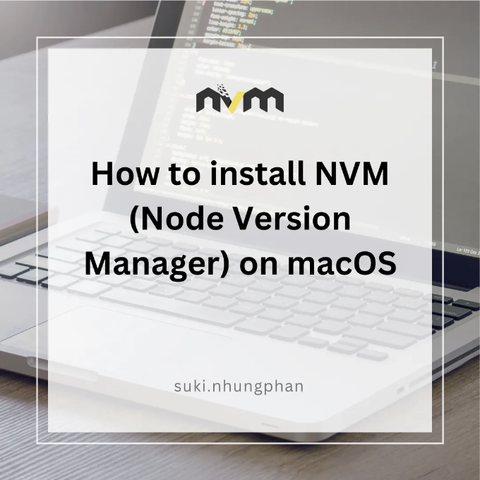

안녕하세요, 저는 프론트엔드 개발자인 Suki에요. 제 개인 프로젝트를 작업 중에, 프로젝트가 노드 버전 18을 요구하는 상황에 직면했는데, 제 컴퓨터는 기본 노드 버전 21을 사용하고 있었어요. 특정 노드 버전을 설정하기 위해 NVM을 사용한 해결책을 구현했고, 이 블로그에서 그 방법을 공유하고 싶어요.

macOS에 NVM(Node Version Manager)을 설치하려면 다음 단계를 따를 수 있어요:

- Homebrew 설치:

<!-- ui-log 수평형 -->
<ins class="adsbygoogle"
  style="display:block"
  data-ad-client="ca-pub-4877378276818686"
  data-ad-slot="9743150776"
  data-ad-format="auto"
  data-full-width-responsive="true"></ins>
<component is="script">
(adsbygoogle = window.adsbygoogle || []).push({});
</component>

만약 Homebrew를 설치하지 않은 경우에는 터미널을 열고 다음 명령어를 실행하여 설치할 수 있어요:

```js
/bin/bash -c "$(curl -fsSL https://raw.githubusercontent.com/Homebrew/install/HEAD/install.sh)"
```

2. Homebrew를 사용하여 NVM 설치하기:

Homebrew를 통해 NVM을 설치하세요. Homebrew가 설치되면 터미널에서 다음 명령어를 실행하세요.

<!-- ui-log 수평형 -->
<ins class="adsbygoogle"
  style="display:block"
  data-ad-client="ca-pub-4877378276818686"
  data-ad-slot="9743150776"
  data-ad-format="auto"
  data-full-width-responsive="true"></ins>
<component is="script">
(adsbygoogle = window.adsbygoogle || []).push({});
</component>

```js
brew install nvm
```

3. 셸 프로필에서 NVM 소스화하기

셸 프로필 파일(예: ~/.bashrc, ~/.zshrc 또는 ~/.bash_profile)에 다음 라인을 추가하세요:

```js
export NVM_DIR=~/.nvm
[ -s "$NVM_DIR/nvm.sh" ] && \. "$NVM_DIR/nvm.sh"  # 이 명령어는 nvm을 로드합니다
[ -s "$NVM_DIR/bash_completion" ] && \. "$NVM_DIR/bash_completion"  # 이 명령어는 nvm bash_completion을 로드합니다
```

<!-- ui-log 수평형 -->
<ins class="adsbygoogle"
  style="display:block"
  data-ad-client="ca-pub-4877378276818686"
  data-ad-slot="9743150776"
  data-ad-format="auto"
  data-full-width-responsive="true"></ins>
<component is="script">
(adsbygoogle = window.adsbygoogle || []).push({});
</component>

그런 다음 터미널을 다시 시작하거나 변경 사항을 적용하려면 source ~/.your_shell_profile을 실행하세요.

4. 설치 확인

NVM이 설치되었는지 확인하려면 다음을 실행합니다:

```js
nvm --version
```

<!-- ui-log 수평형 -->
<ins class="adsbygoogle"
  style="display:block"
  data-ad-client="ca-pub-4877378276818686"
  data-ad-slot="9743150776"
  data-ad-format="auto"
  data-full-width-responsive="true"></ins>
<component is="script">
(adsbygoogle = window.adsbygoogle || []).push({});
</component>

5. NVM을 사용하여 Node.js 설치하기

이제 NVM을 사용하여 Node.js를 설치할 수 있습니다. 예를 들어, 최신 LTS 버전을 설치하려면 다음을 실행하십시오:

```js
nvm install --lts
```

특정 Node 버전을 설치하려면 다음을 실행하십시오:

<!-- ui-log 수평형 -->
<ins class="adsbygoogle"
  style="display:block"
  data-ad-client="ca-pub-4877378276818686"
  data-ad-slot="9743150776"
  data-ad-format="auto"
  data-full-width-responsive="true"></ins>
<component is="script">
(adsbygoogle = window.adsbygoogle || []).push({});
</component>

```js
nvm install 18
```

다음으로, 설치된 버전을 구현하려면 다음을 실행하세요:

```js
nvm use 18
```

셸 프로필을 변경한 후 변경 사항을 적용하려면 터미널을 다시 시작해야 합니다. 설치 후 NVM을 사용하여 Node.js 버전을 쉽게 전환할 수 있습니다.

<!-- ui-log 수평형 -->
<ins class="adsbygoogle"
  style="display:block"
  data-ad-client="ca-pub-4877378276818686"
  data-ad-slot="9743150776"
  data-ad-format="auto"
  data-full-width-responsive="true"></ins>
<component is="script">
(adsbygoogle = window.adsbygoogle || []).push({});
</component>

이 문서가 도움이 되길 바라요! 읽어 주셔서 감사합니다. 코딩을 즐기세요. ❤️😊