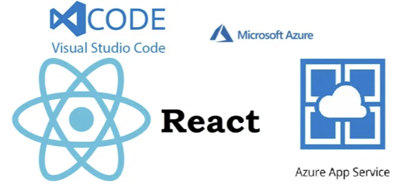

스페인어 기사

안녕하세요, 이 안내서는 Visual Studio Code에서 React 앱을 Azure App Service로 수동으로 배포하는 방법에 대해 알려드립니다. 딱 8단계만으로 배워보세요.

## 요구 사항:

<!-- ui-log 수평형 -->
<ins class="adsbygoogle"
  style="display:block"
  data-ad-client="ca-pub-4877378276818686"
  data-ad-slot="9743150776"
  data-ad-format="auto"
  data-full-width-responsive="true"></ins>
<component is="script">
(adsbygoogle = window.adsbygoogle || []).push({});
</component>

- Azure 구독을 통해 무료로 Azure를 시작할 수 있습니다.
- Visual Studio Code
- Node.js LTS 버전
- Git

## 시작해 봅시다:

단계 0: 새로운 React 앱 생성하기

터미널을 열고 다음 명령을 실행하여 새 React 앱을 생성하세요.

<!-- ui-log 수평형 -->
<ins class="adsbygoogle"
  style="display:block"
  data-ad-client="ca-pub-4877378276818686"
  data-ad-slot="9743150776"
  data-ad-format="auto"
  data-full-width-responsive="true"></ins>
<component is="script">
(adsbygoogle = window.adsbygoogle || []).push({});
</component>

```js
npx create-react-app testreactinaas
```


원하는 이름으로 testreactinaas를 대체하세요.

단계 1: 로컬에서 React 앱을 테스트하세요: 로컬 서버에서 실행하기

<!-- ui-log 수평형 -->
<ins class="adsbygoogle"
  style="display:block"
  data-ad-client="ca-pub-4877378276818686"
  data-ad-slot="9743150776"
  data-ad-format="auto"
  data-full-width-responsive="true"></ins>
<component is="script">
(adsbygoogle = window.adsbygoogle || []).push({});
</component>

터미널이나 명령 프롬프트를 열고 다음 명령을 실행해보세요:

```js
cd testreactinaas
npm start
```

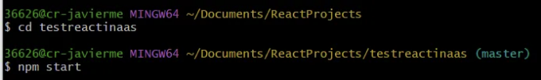

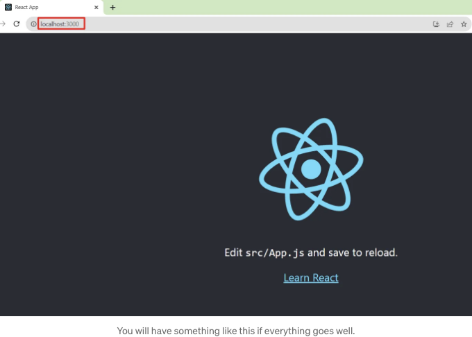

<!-- ui-log 수평형 -->
<ins class="adsbygoogle"
  style="display:block"
  data-ad-client="ca-pub-4877378276818686"
  data-ad-slot="9743150776"
  data-ad-format="auto"
  data-full-width-responsive="true"></ins>
<component is="script">
(adsbygoogle = window.adsbygoogle || []).push({});
</component>

기본적으로 앱은 http://localhost:3000/ 에서 사용할 수 있습니다.

단계 2: 앱 빌드하기, 앱을 배포할 준비가 되면 빌드할 수 있습니다.

터미널이나 명령 프롬프트를 열고 다음을 실행하십시오:

```js
npm run build
```

<!-- ui-log 수평형 -->
<ins class="adsbygoogle"
  style="display:block"
  data-ad-client="ca-pub-4877378276818686"
  data-ad-slot="9743150776"
  data-ad-format="auto"
  data-full-width-responsive="true"></ins>
<component is="script">
(adsbygoogle = window.adsbygoogle || []).push({});
</component>


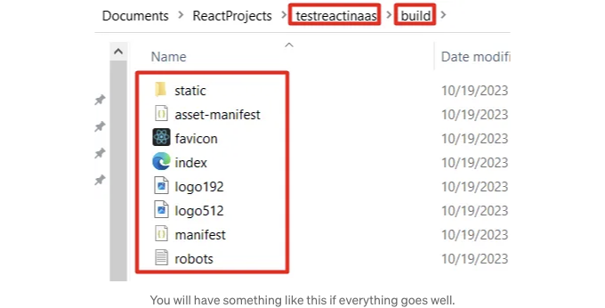

Step 3: React 프로젝트용 Azure App Service 프로비저닝


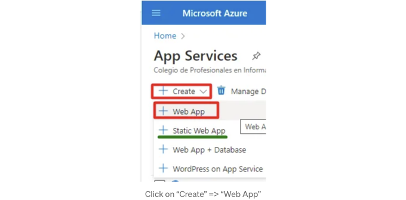

<!-- ui-log 수평형 -->
<ins class="adsbygoogle"
  style="display:block"
  data-ad-client="ca-pub-4877378276818686"
  data-ad-slot="9743150776"
  data-ad-format="auto"
  data-full-width-responsive="true"></ins>
<component is="script">
(adsbygoogle = window.adsbygoogle || []).push({});
</component>

## 단계 4: 웹 앱에 대한 기본 구성

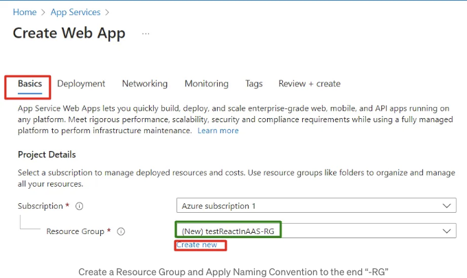

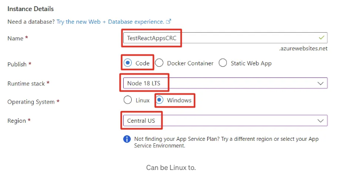

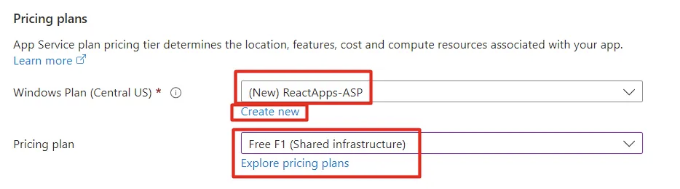

<!-- ui-log 수평형 -->
<ins class="adsbygoogle"
  style="display:block"
  data-ad-client="ca-pub-4877378276818686"
  data-ad-slot="9743150776"
  data-ad-format="auto"
  data-full-width-responsive="true"></ins>
<component is="script">
(adsbygoogle = window.adsbygoogle || []).push({});
</component>

테스트를 위해 F1 요금제를 선택해보세요. 필요에 따라 다른 것을 선택해도 괜찮아요.

단계 5: 웹 앱에 대한 태그 구성하기

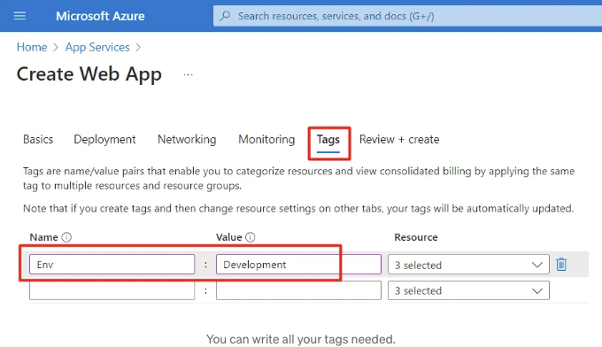

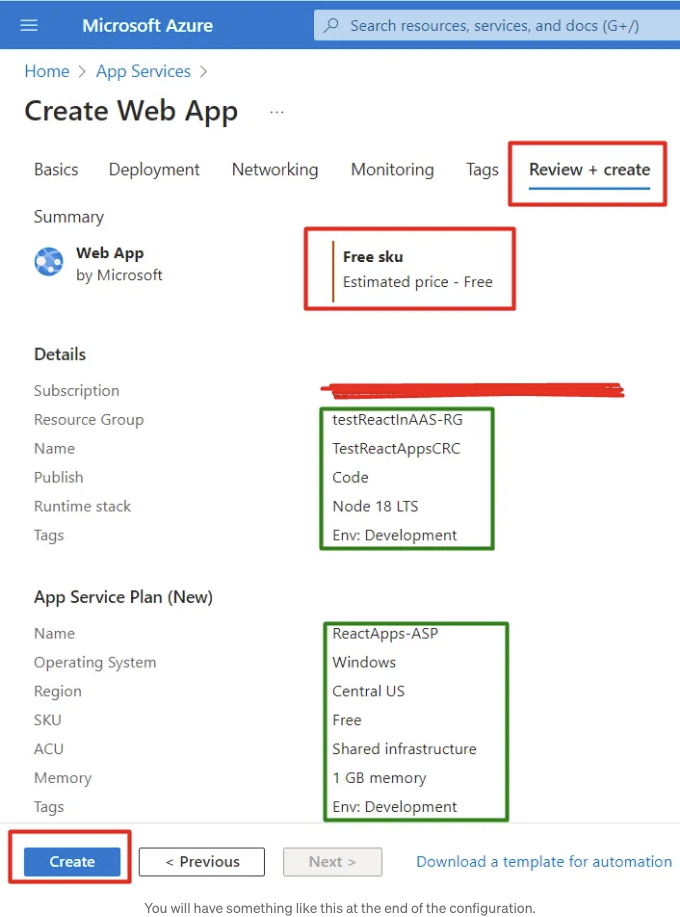

<!-- ui-log 수평형 -->
<ins class="adsbygoogle"
  style="display:block"
  data-ad-client="ca-pub-4877378276818686"
  data-ad-slot="9743150776"
  data-ad-format="auto"
  data-full-width-responsive="true"></ins>
<component is="script">
(adsbygoogle = window.adsbygoogle || []).push({});
</component>

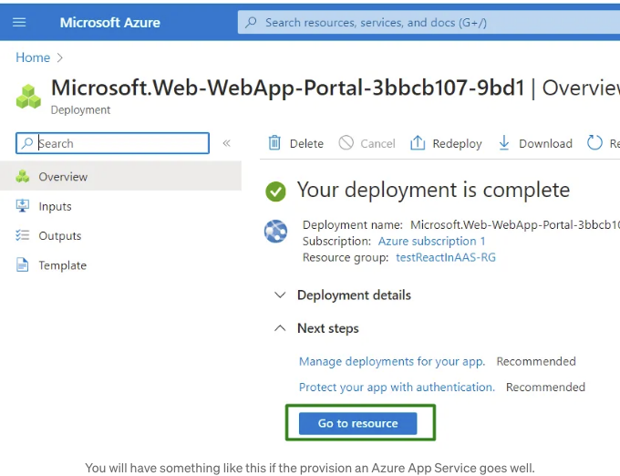

단계 6: Visual Studio Code에서 프로젝트를 엽니다. 그런 다음 다음 확장 프로그램을 설치하세요.

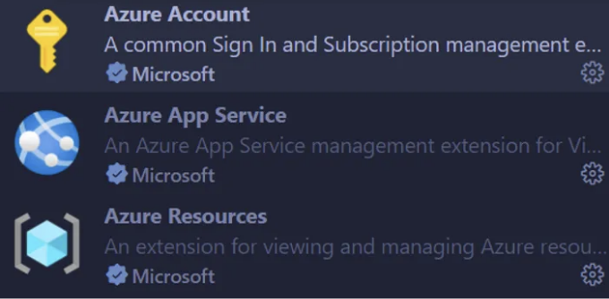

Azure Account

<!-- ui-log 수평형 -->
<ins class="adsbygoogle"
  style="display:block"
  data-ad-client="ca-pub-4877378276818686"
  data-ad-slot="9743150776"
  data-ad-format="auto"
  data-full-width-responsive="true"></ins>
<component is="script">
(adsbygoogle = window.adsbygoogle || []).push({});
</component>

Azure App Service

Azure 자원

단계 7: Azure 계정에 로그인하세요

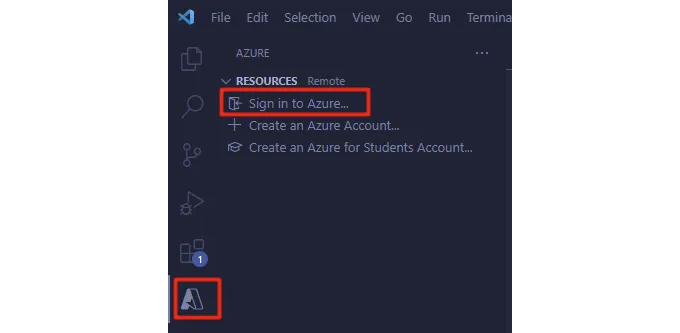

<!-- ui-log 수평형 -->
<ins class="adsbygoogle"
  style="display:block"
  data-ad-client="ca-pub-4877378276818686"
  data-ad-slot="9743150776"
  data-ad-format="auto"
  data-full-width-responsive="true"></ins>
<component is="script">
(adsbygoogle = window.adsbygoogle || []).push({});
</component>

자격 증명을 완료하시고 나면, Azure에서 리소스를 볼 수 있게 되며 특히 5단계에서 생성한 앱 서비스를 확인할 수 있습니다.

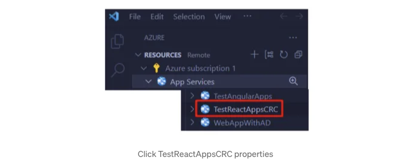


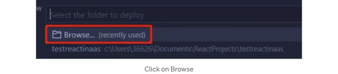

<!-- ui-log 수평형 -->
<ins class="adsbygoogle"
  style="display:block"
  data-ad-client="ca-pub-4877378276818686"
  data-ad-slot="9743150776"
  data-ad-format="auto"
  data-full-width-responsive="true"></ins>
<component is="script">
(adsbygoogle = window.adsbygoogle || []).push({});
</component>


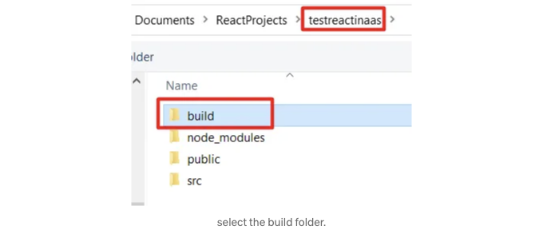

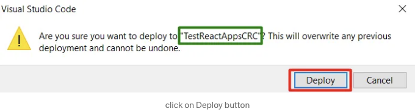


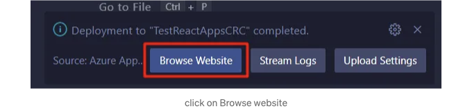

<!-- ui-log 수평형 -->
<ins class="adsbygoogle"
  style="display:block"
  data-ad-client="ca-pub-4877378276818686"
  data-ad-slot="9743150776"
  data-ad-format="auto"
  data-full-width-responsive="true"></ins>
<component is="script">
(adsbygoogle = window.adsbygoogle || []).push({});
</component>

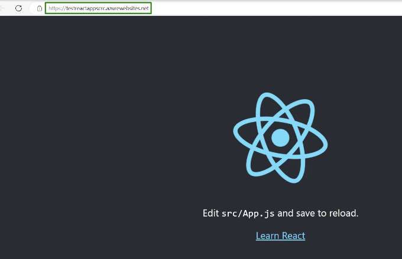

모든 것이 잘 보입니다. React 앱이 성공적으로 Azure App Services에 배포되었습니다.

참고: Azure 계정 보안 우선순위: 친절한 알림

반드시 시행해야 하는 중요한 실천 방법 중 하나는 배포 및 관리 작업을 완료한 후 Azure 계정에서 로그아웃하는 것입니다.

<!-- ui-log 수평형 -->
<ins class="adsbygoogle"
  style="display:block"
  data-ad-client="ca-pub-4877378276818686"
  data-ad-slot="9743150776"
  data-ad-format="auto"
  data-full-width-responsive="true"></ins>
<component is="script">
(adsbygoogle = window.adsbygoogle || []).push({});
</component>

부디 제게 피드백을 주시면 성장할 수 있습니다. 정말 감사합니다.

영어 실력에 관련된 실수가 있을 시 죄송합니다. 제 두 번째 언어를 배우고 있기 때문입니다.