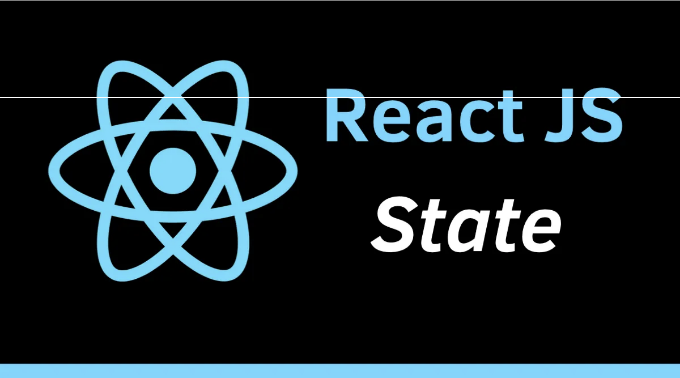

리액트에서 한 컴포넌트에서 다른 컴포넌트로 상태 데이터를 전달하는 것은 일반적인 작업입니다. 상태는 동적이고 인터랙티브한 애플리케이션을 구축하는 데 필수적인 요소입니다. 하지만 컴포넌트 간에 상태를 효과적으로 전달하는 것은 도전적일 수 있습니다. 이 블로그에서는 리액트에서 다른 컴포넌트로 상태를 전달하는 다양한 방법과 각 접근 방법의 장점과 단점을 살펴볼 것입니다. 경험 많은 리액트 개발자이든 막 시작한 단계이든, 이 안내서는 리액트에서 상태 데이터를 전달하는 방법에 대해 확실한 이해를 제공해줄 것입니다.

리액트에서 다른 컴포넌트로 상태를 전달하는 주요 방법 중 하나는 props를 통해 전달하는 것입니다. Props는 읽기 전용 데이터로, 부모 컴포넌트에서 자식 컴포넌트로 전달됩니다. 상태 데이터를 props로 전달하려면 상태를 부모 컴포넌트에서 정의하고 자식 컴포넌트로 속성으로 전달해야 합니다.

부모 컴포넌트에서 상태를 정의하고 다음과 같이 자식 컴포넌트로 전달합니다:

<!-- ui-log 수평형 -->
<ins class="adsbygoogle"
  style="display:block"
  data-ad-client="ca-pub-4877378276818686"
  data-ad-slot="9743150776"
  data-ad-format="auto"
  data-full-width-responsive="true"></ins>
<component is="script">
(adsbygoogle = window.adsbygoogle || []).push({});
</component>

```javascript
class ParentComponent extends React.Component {
  state = {
    data: “Hello World”
  };
  render() {
    return (
      <ChildComponent data={this.state.data} />
    );
  }
}
```
자식 구성 요소에서는 props에 다음과 같이 액세스합니다:

```javascript
function ChildComponent(props) {
  return <div>{props.data}</div>;
}
```

다른 구성 요소에 상태를 전달하는 또 다른 방법은 context를 통해입니다. 
Context를 사용하면 각 구성 요소 수준에서 수동으로 props를 전달하지 않고 
전체 구성 요소 트리를 통해 데이터를 공유할 수 있습니다. 
이는 전역적으로 사용할 데이터에 유용할 수 있습니다.

부모 구성 요소에서 context를 만들고 다음과 같이 자식 구성 요소에 전달합니다:

```javascript
const MyContext = React.createContext();
class ParentComponent extends React.Component {
  state = {
    data: "Hello World"
  };
  render() {
    return (
      <MyContext.Provider value={this.state.data}>
        <ChildComponent />
      </MyContext.Provider>
    );
  }
}
```

<!-- ui-log 수평형 -->
<ins class="adsbygoogle"
  style="display:block"
  data-ad-client="ca-pub-4877378276818686"
  data-ad-slot="9743150776"
  data-ad-format="auto"
  data-full-width-responsive="true"></ins>
<component is="script">
(adsbygoogle = window.adsbygoogle || []).push({});
</component>

자식 컴포넌트에서는 다음과 같이 컨텍스트에 액세스합니다:

```js
function ChildComponent() {
 const data = useContext(MyContext);
 return <div>{data}</div>;
}
마지막으로, 다른 컴포넌트로 상태를 콜백 함수를 통해 전달하는 것도 가능합니다. 
이 방법은 자식 컴포넌트의 상태를 업데이트하고 그 값을 부모 컴포넌트로 다시 전달해야 할 때 유용합니다.
```

부모 컴포넌트에서는 콜백 함수를 정의하고 해당 함수를 다음과 같이 자식 컴포넌트로 전달합니다:

```js
class ParentComponent extends React.Component {
 state = {
 data: “Hello World”
 };
 handleDataChange = (data) => {
 this.setState({ data });
 };
 render() {
 return (
 <ChildComponent data={this.state.data} onDataChange={this.handleDataChange} />
 );
 }
}
자식 컴포넌트에서는 다음과 같이 콜백 함수를 호출하고 업데이트된 데이터를 전달합니다:
```

<!-- ui-log 수평형 -->
<ins class="adsbygoogle"
  style="display:block"
  data-ad-client="ca-pub-4877378276818686"
  data-ad-slot="9743150776"
  data-ad-format="auto"
  data-full-width-responsive="true"></ins>
<component is="script">
(adsbygoogle = window.adsbygoogle || []).push({});
</component>

마크다운 형식으로 변경하려면 다음과 같이 하면 됩니다.

```js
function ChildComponent(props) {
 const handleClick = () => {
 props.onDataChange(“Hello React”);
 };
 return <div onClick={handleClick}>{props.data}</div>;
}
```

다른 컴포넌트에 상태를 전달하는 여러 가지 방법이 있습니다. props, context, 콜백 함수를 사용하는 React에서 각 방법은 장단점이 있습니다. 사용 사례에 따라 적절한 방법을 선택하는 것이 중요합니다.