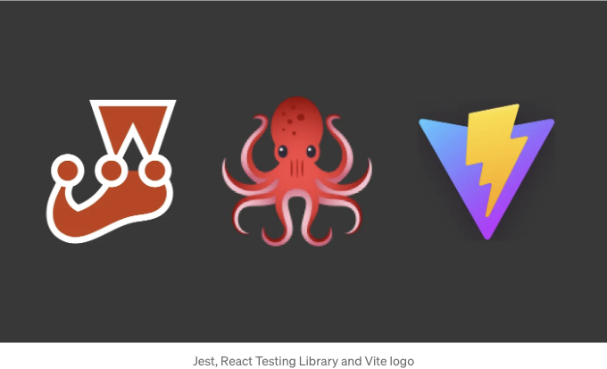

Create Vite App으로 만든 React 프로젝트에는 기본적으로 테스트가 포함되어 있지 않으므로 제대로 구성해야 합니다. 이 단계들을 자세히 살펴보겠습니다.

시작하기 전에 아래 링크를 통해 변경 사항에 접근할 수 있습니다: [링크](https://github.com/ozcanzaferayan/vite-jest-integration/commit/68af95d37849d7cfc6fbd5b005b6e8481896e287)

# 지시사항

<!-- ui-log 수평형 -->
<ins class="adsbygoogle"
  style="display:block"
  data-ad-client="ca-pub-4877378276818686"
  data-ad-slot="9743150776"
  data-ad-format="auto"
  data-full-width-responsive="true"></ins>
<component is="script">
(adsbygoogle = window.adsbygoogle || []).push({});
</component>

1- 다소 복잡한 테스트를 위해 App.jsx를 아래와 같이 변경하세요

```js
// App.jsx
import "./App.css";
import React, { useEffect, useState } from "react";

function App() {
  const [todos, setTodos] = useState([]);

  useEffect(() => {
    fetch("https://jsonplaceholder.typicode.com/todos")
      .then((response) => response.json())
      .then((json) => setTodos(json));
  }, []);

  return (
    <>
      {todos.map((todo) => (
        <div key={todo.id}>
          <h1>{todo.title}</h1>
          <p>{todo.completed}</p>
        </div>
      ))}
    </>
  );
}

export default App;
```

2- App.jsx 파일 옆에 App.test.js 및 App.snapshot.test.js 파일을 추가하세요:

```js
// App.test.js
import { render, screen } from "@testing-library/react";
import App from "./App";

describe("App", () => {
  let originalFetch;

  beforeEach(() => {
    originalFetch = global.fetch;
    global.fetch = jest.fn(() =>
      Promise.resolve({
        json: () =>
          Promise.resolve([
            {
              userId: 1,
              id: 1,
              title: "Kaliteye hoşgeldiniz",
              completed: false,
            },
          ]),
      })
    );
  });

  afterEach(() => {
    global.fetch = originalFetch;
  });

  it("renders App component", async () => {
    render(<App />);
    const linkElement = await screen.findByText(/Kaliteye hoşgeldiniz/i);
    expect(linkElement).toBeInTheDocument();
  });
});
```

<!-- ui-log 수평형 -->
<ins class="adsbygoogle"
  style="display:block"
  data-ad-client="ca-pub-4877378276818686"
  data-ad-slot="9743150776"
  data-ad-format="auto"
  data-full-width-responsive="true"></ins>
<component is="script">
(adsbygoogle = window.adsbygoogle || []).push({});
</component>

```js
// App.snapshot.test.js
import renderer from "react-test-renderer";

import App from "./App";

test("renders learn react link", () => {
  const tree = renderer.create(<App />).toJSON();
  expect(tree).toMatchInlineSnapshot();
});
```

3- 다음과 같이 .eslintrc.cjs를 변경하십시오.

```js
module.exports = {
  extends: ["react-app", "react-app/jest"],
};
```

4- package에 jest를 추가하고 package.json에 추가하십시오. 

<!-- ui-log 수평형 -->
<ins class="adsbygoogle"
  style="display:block"
  data-ad-client="ca-pub-4877378276818686"
  data-ad-slot="9743150776"
  data-ad-format="auto"
  data-full-width-responsive="true"></ins>
<component is="script">
(adsbygoogle = window.adsbygoogle || []).push({});
</component>

```js
yarn add -D jest
```

```js
  "scripts": {
    "dev": "vite",
    "build": "vite build",
    "lint": "eslint src --ext js,jsx --report-unused-disable-directives --max-warnings 0",
    "preview": "vite preview",
    "test": "jest"
  },
```

5- JSX 지원을 위해 babel 프리셋 추가하고 프로젝트에 .babelrc 파일을 추가하세요

```js
yarn add -D @babel/preset-env @babel/preset-react
```

<!-- ui-log 수평형 -->
<ins class="adsbygoogle"
  style="display:block"
  data-ad-client="ca-pub-4877378276818686"
  data-ad-slot="9743150776"
  data-ad-format="auto"
  data-full-width-responsive="true"></ins>
<component is="script">
(adsbygoogle = window.adsbygoogle || []).push({});
</component>

```json
{
  "presets": [
    "@babel/preset-env",
    ["@babel/preset-react", { "runtime": "automatic" }]
  ]
}
```

6- React Testing Library 의존성 추가

```js
yarn add -D @testing-library/react @testing-library/jest-dom
```

8- SVG 및 CSS 파일 지원을 위해 jest-svg-transformer와 identity-obj-proxy를 추가하세요. 그런 다음 package.json의 jest 구성 내부에 moduleMapper를 추가하세요.

<!-- ui-log 수평형 -->
<ins class="adsbygoogle"
  style="display:block"
  data-ad-client="ca-pub-4877378276818686"
  data-ad-slot="9743150776"
  data-ad-format="auto"
  data-full-width-responsive="true"></ins>
<component is="script">
(adsbygoogle = window.adsbygoogle || []).push({});
</component>

```js
yarn add -D jest-svg-transformer identity-obj-proxy
```

```js
  "jest": {
    "moduleNameMapper": {
      "^.+\\.svg$": "jest-svg-transformer",
      "^.+\\.(css|less|scss)$": "identity-obj-proxy"
    }
  }
```

9- 웹 환경 API를 지원하기 위해 jest-environment-jsdom을 jest 구성에 추가하세요:

```js
yarn add -D jest-environment-jsdom
```

<!-- ui-log 수평형 -->
<ins class="adsbygoogle"
  style="display:block"
  data-ad-client="ca-pub-4877378276818686"
  data-ad-slot="9743150776"
  data-ad-format="auto"
  data-full-width-responsive="true"></ins>
<component is="script">
(adsbygoogle = window.adsbygoogle || []).push({});
</component>

```js
"jest": {
    "testEnvironment": "jsdom",
    "moduleNameMapper": {
        "^.+\\.svg$": "jest-svg-transformer",
        "^.+\\.(css|less|scss)$": "identity-obj-proxy"
    },
    "setupFilesAfterEnv": [
        "<rootDir>/setupTests.js"
    ]
}
```

10- 또한 @testing-library/jest-dom 패키지를 추가하고 setupTests.js를 구성하십시오.

```js
yarn add -D jest-environment-jsdom
```

<!-- ui-log 수평형 -->
<ins class="adsbygoogle"
  style="display:block"
  data-ad-client="ca-pub-4877378276818686"
  data-ad-slot="9743150776"
  data-ad-format="auto"
  data-full-width-responsive="true"></ins>
<component is="script">
(adsbygoogle = window.adsbygoogle || []).push({});
</component>

```javascript
// setupTests.js
import "@testing-library/jest-dom";
```

11- 이제 스냅샷 테스트를 위해 react-test-renderer를 추가해주세요.

```javascript
yarn add -D react-test-renderer
```

12- 이제 `yarn test`로 테스트를 시작할 수 있어요.

<!-- ui-log 수평형 -->
<ins class="adsbygoogle"
  style="display:block"
  data-ad-client="ca-pub-4877378276818686"
  data-ad-slot="9743150776"
  data-ad-format="auto"
  data-full-width-responsive="true"></ins>
<component is="script">
(adsbygoogle = window.adsbygoogle || []).push({});
</component>

```js
yarn test
```

# 결론

Jest와 React Testing Library를 추가하는 것은 때로는 어렵고 복잡할 수 있습니다. 그러나 이러한 단계를 따라 프로젝트에 추가할 수 있습니다.

이 글의 일부 내용이 누락되거나 잘못된 부분이 있다면 언제든지 연락해주세요. 다음 포스트에서 다시 만나요...

<!-- ui-log 수평형 -->
<ins class="adsbygoogle"
  style="display:block"
  data-ad-client="ca-pub-4877378276818686"
  data-ad-slot="9743150776"
  data-ad-format="auto"
  data-full-width-responsive="true"></ins>
<component is="script">
(adsbygoogle = window.adsbygoogle || []).push({});
</component>

