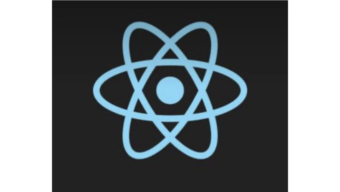
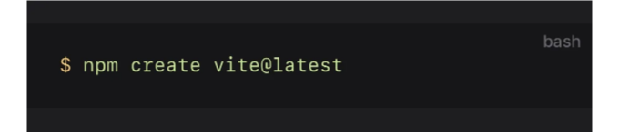
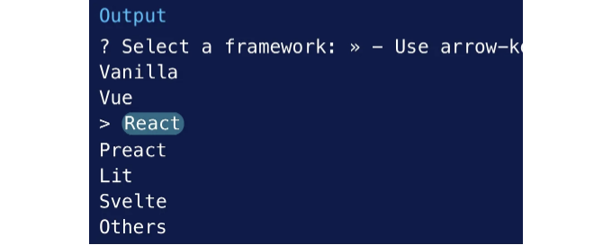
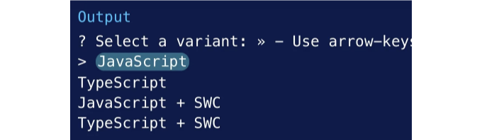
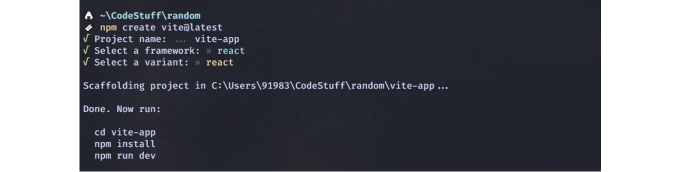
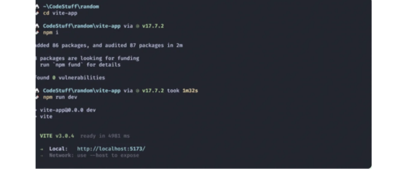

안녕히 가라 CRA👋

Vite를 사용하여 React 프로젝트를 설정하는 방법에 대해 유용한 단계를 안내해드리겠습니다.

일단 Vite는 프랑스어로 "빠르게"라는 뜻입니다. Vite는 더 빠르지만 CRA의 모든 기능을 갖추고 있습니다. React 프로젝트를 Vite로 올바르게 설정하려면 아래 단계를 따라주세요.

<!-- ui-log 수평형 -->
<ins class="adsbygoogle"
  style="display:block"
  data-ad-client="ca-pub-4877378276818686"
  data-ad-slot="9743150776"
  data-ad-format="auto"
  data-full-width-responsive="true"></ins>
<component is="script">
(adsbygoogle = window.adsbygoogle || []).push({});
</component>

# 1. 폴더 만들기

데스크톱 파일로 이동한 다음 문서로 이동하세요. 📁 폴더를 만들고 코드(텍스트 편집기)로 열어보세요.

# 2. 터미널 열기

좋아하는 텍스트 편집기를 열어주세요. 만약 VS(Visual Studio) 코드를 사용하고 있다면 터미널을 열어주세요. 만약 VScode를 사용하지 않는다면 bash나 명령 프롬프트를 열어주세요.

<!-- ui-log 수평형 -->
<ins class="adsbygoogle"
  style="display:block"
  data-ad-client="ca-pub-4877378276818686"
  data-ad-slot="9743150776"
  data-ad-format="auto"
  data-full-width-responsive="true"></ins>
<component is="script">
(adsbygoogle = window.adsbygoogle || []).push({});
</component>

# 3. Vite 프로젝트 생성하기

명령줄에서 Vite를 사용하여 새로운 React 프로젝트를 만들어보세요. npm 패키지 매니저를 사용하여 스크립트를 설치하고 실행하세요.



터미널에서는 다음과 같이 입력하세요: npm create vite@latest "프로젝트 이름".

<!-- ui-log 수평형 -->
<ins class="adsbygoogle"
  style="display:block"
  data-ad-client="ca-pub-4877378276818686"
  data-ad-slot="9743150776"
  data-ad-format="auto"
  data-full-width-responsive="true"></ins>
<component is="script">
(adsbygoogle = window.adsbygoogle || []).push({});
</component>

예를 들어, 패키지 매니저를 설치하려고 합니다. npm create vite@latest my-first-vite를 입력하겠습니다. "My-first-vite"는 프로젝트 이름이며, 스크립트를 생성하고 실행할 것입니다.

- "프레임워크 선택"이 표시됩니다



Vite를 사용하면 사용할 프레임워크를 선택할 수 있습니다. 그리고 React를 선택하려면 키보드 화살표 키를 사용하면 됩니다.

<!-- ui-log 수평형 -->
<ins class="adsbygoogle"
  style="display:block"
  data-ad-client="ca-pub-4877378276818686"
  data-ad-slot="9743150776"
  data-ad-format="auto"
  data-full-width-responsive="true"></ins>
<component is="script">
(adsbygoogle = window.adsbygoogle || []).push({});
</component>

리액트 프레임워크를 선택한 후에 Vite는 프로젝트에서 작업하고 싶은 언어를 선택하라는 메시지를 표시합니다.



터미널에는 이와 같은 출력이 표시됩니다. JavaScript를 클릭하지만 사용자는 원하는 언어를 선택할 수 있습니다.



<!-- ui-log 수평형 -->
<ins class="adsbygoogle"
  style="display:block"
  data-ad-client="ca-pub-4877378276818686"
  data-ad-slot="9743150776"
  data-ad-format="auto"
  data-full-width-responsive="true"></ins>
<component is="script">
(adsbygoogle = window.adsbygoogle || []).push({});
</component>

에디터에서 텍스트가 표시되었나요? 그럼 폴더를 확인해서 패키지가 설치되어 있는지 확인해보세요. Vite는 프로젝트를 위한 모든 뼈대를 빠르게 생성해줄 거에요. 설치되지 않았다면 단계를 신중히 따르지 않았을 수도 있지만, 설치되어 있다면 축하해요.

## 4. 디렉터리 변경

Vite에서 생성한 프로젝트의 디렉터리를 변경해보세요. 명령어 실행이 끝나면, 폴더로 이동해주세요.

## 5. npm 설치

<!-- ui-log 수평형 -->
<ins class="adsbygoogle"
  style="display:block"
  data-ad-client="ca-pub-4877378276818686"
  data-ad-slot="9743150776"
  data-ad-format="auto"
  data-full-width-responsive="true"></ins>
<component is="script">
(adsbygoogle = window.adsbygoogle || []).push({});
</component>

프로젝트를 진행하기 위해서는 node-modules가 설치되어 있어야 합니다.

다음 명령어를 실행하세요:

npm install 또는 npm i

이 명령어를 실행한 후에는 프로젝트에 node-module이 설치됩니다. 그런 다음 Vite를 통해 설치된 패키지 종속성을 확인할 수 있으며, 다음 명령을 실행하세요:

<!-- ui-log 수평형 -->
<ins class="adsbygoogle"
  style="display:block"
  data-ad-client="ca-pub-4877378276818686"
  data-ad-slot="9743150776"
  data-ad-format="auto"
  data-full-width-responsive="true"></ins>
<component is="script">
(adsbygoogle = window.adsbygoogle || []).push({});
</component>

터미널에서 npm run dev을 입력하세요. 네트워크 연결이 좋아야 빠르게 설정할 수 있어요.

여기 있어요! Local: http://localhost:5173/을 클릭하세요. 브라우저에서 Vite 기본 템플릿이 나타날 거에요.



서버를 클릭하면 브라우저에 이 출력물이 표시될 거에요.

<!-- ui-log 수평형 -->
<ins class="adsbygoogle"
  style="display:block"
  data-ad-client="ca-pub-4877378276818686"
  data-ad-slot="9743150776"
  data-ad-format="auto"
  data-full-width-responsive="true"></ins>
<component is="script">
(adsbygoogle = window.adsbygoogle || []).push({});
</component>


여기! 이제 Vite를 즐길 수 있어요.

만약 localhost:5173을 사용하고 싶지 않다면, 쉽게 조정할 수 있어요.

프로젝트에서 Vite.config.js 파일을 찾아봐주세요.

<!-- ui-log 수평형 -->
<ins class="adsbygoogle"
  style="display:block"
  data-ad-client="ca-pub-4877378276818686"
  data-ad-slot="9743150776"
  data-ad-format="auto"
  data-full-width-responsive="true"></ins>
<component is="script">
(adsbygoogle = window.adsbygoogle || []).push({});
</component>

```js
import { defineConfig } from ‘vite’
import react from ‘@vitejs/plugin-react’

// https://vitejs.dev/config/
export default defineConfig({
   plugins: [react()],
});
```

먼저 이런 모습을 보게 될 거에요. 그런 다음 코드 뒷부분에 server: { port: 3000, },를 추가하시면 됩니다.

아래처럼:

```js
import { defineConfig } from ‘vite’
import react from ‘@vitejs/plugin-react’

// https://vitejs.dev/config/
export default defineConfig({
 plugins: [react()],
 server: {
    port: 3000,
 },
});
```

<!-- ui-log 수평형 -->
<ins class="adsbygoogle"
  style="display:block"
  data-ad-client="ca-pub-4877378276818686"
  data-ad-slot="9743150776"
  data-ad-format="auto"
  data-full-width-responsive="true"></ins>
<component is="script">
(adsbygoogle = window.adsbygoogle || []).push({});
</component>

터미널에 다음 명령어를 입력해 주세요: npm run dev

이후에는 5173이 아닌 localhost:3000/이 나타납니다.

# 결론

제가 작성한 이 글이 실제로 도움이 되었으면 좋겠고, React와 함께 작업할 때 Vite가 얼마나 빠른지 보여주었으면 좋겠습니다.