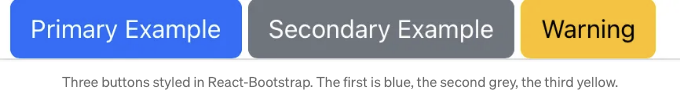
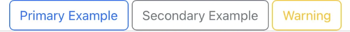
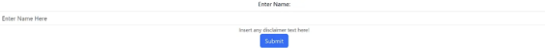
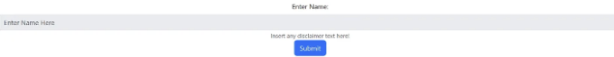
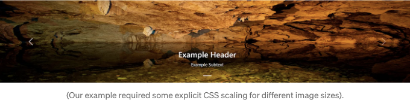
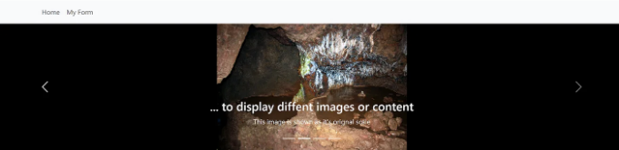
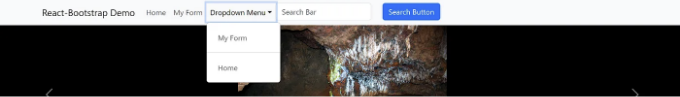
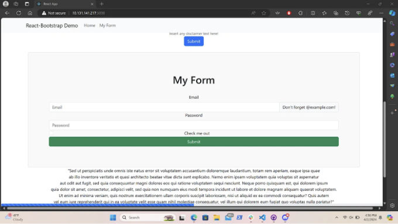
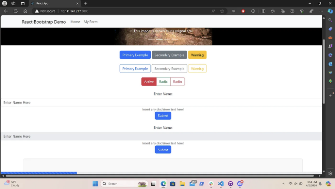
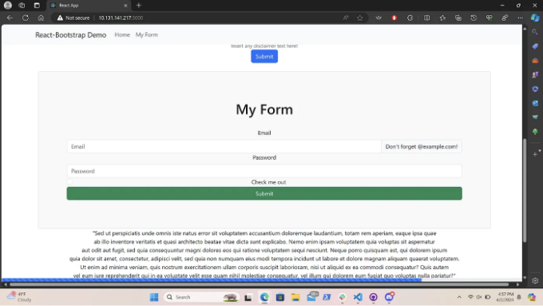

안녕하세요! 이번 튜토리얼에서는 React-Bootstrap 스타일링을 활용하여 기본 React 앱을 만드는 방법을 보여드릴 거예요. 이를 통해 웹사이트 방문자에게 환영받는 느낌을 전달할 수 있어요!

# 소개

React-Bootstrap은 React를 위한 프론트엔드 스타일링 플러그인으로, 몇 줄의 코드로 미리 스타일이 적용된 컴포넌트를 쉽게 가져와 활용할 수 있게 해줘요. React-Bootstrap의 간단하고 직관적인 라이브러리는 개발하기 쉽고 미적으로 매력적인 프로젝트를 만들 수 있도록 도와줍니다. 이 프레임워크는 많은 전통적 JavaScript 프로젝트에서 사용되는 오픈 소스 Bootstrap CSS 프레임워크의 구조를 크게 따르고 있어요. (더 많은 정보는 여기에서 전통적 Bootstrap 링크에서 확인할 수 있어요).

<!-- ui-log 수평형 -->
<ins class="adsbygoogle"
  style="display:block"
  data-ad-client="ca-pub-4877378276818686"
  data-ad-slot="9743150776"
  data-ad-format="auto"
  data-full-width-responsive="true"></ins>
<component is="script">
(adsbygoogle = window.adsbygoogle || []).push({});
</component>

# 설정

이 설정 튜토리얼은 현재 컴퓨터에 npm이 설치되어 있는 것으로 가정합니다. 그렇지 않은 경우 공식 npm 문서를 참조할 수 있습니다. 이 시점부터는 npm을 사용하여 react-bootstrap 패키지를 설치해야만 스타일 지침과 내장 기능을 활용할 수 있습니다.

npx와 react가 설치되어 있다고 가정하면 선택한 코드 편집기 또는 IDE를 열어야 합니다 (본 문서에서는 구문 강조 기능이 설치된 Visual Studio Code를 사용할 예정입니다).

먼저, 코드 편집기에서 새 터미널을 엽니다. 프레임워크의 기능을 테스트하기 위해 새로운 React 프로젝트를 생성해볼까요? 다음 명령을 입력하세요:

<!-- ui-log 수평형 -->
<ins class="adsbygoogle"
  style="display:block"
  data-ad-client="ca-pub-4877378276818686"
  data-ad-slot="9743150776"
  data-ad-format="auto"
  data-full-width-responsive="true"></ins>
<component is="script">
(adsbygoogle = window.adsbygoogle || []).push({});
</component>

```js
npx create-react-app react-bootstrap-demo
```

이제 새로 만든 프로젝트 폴더를 편집기에서 열어야 합니다. 동일한 터미널에서 이 디렉토리로 이동하고 다음 명령을 입력하여 React Bootstrap을 위한 노드 모듈을 설치하세요:

```js
cd react-bootstrap-demo\
npm install react-bootstrap bootstrap
```

이 단계에서 프레임워크를 프로젝트에 실제로 가져올 수 있습니다. 'index.js' 파일을 편집하고 파일의 시작 부분에 다음을 추가하세요:```

<!-- ui-log 수평형 -->
<ins class="adsbygoogle"
  style="display:block"
  data-ad-client="ca-pub-4877378276818686"
  data-ad-slot="9743150776"
  data-ad-format="auto"
  data-full-width-responsive="true"></ins>
<component is="script">
(adsbygoogle = window.adsbygoogle || []).push({});
</component>

```js
import 'bootstrap/dist/css/bootstrap.min.css';
```

(이 import 문을 App.js와 같은 랜딩 페이지 컴포넌트에 추가하는 것이 좋습니다).

# 버튼 및 폼

가장 먼저, 우리의 예제 애플리케이션에는 거의 모든 웹사이트와 웹 앱에서 사용되는 컴포넌트가 추가될 것입니다: 버튼! 이 컴포넌트는 이미 표준 HTML을 통해 간단하게 통합할 수 있지만 CSS를 향상시키기 위해 전용 클래스나 ID를 추가해야 합니다. React Bootstrap을 통해 색상, 외곽선, 크기 조절을 쉽게 할 수 있으며 많은 양의 텍스트 없이 인라인으로 처리할 수 있습니다. 첫 번째 단계는 import 문입니다:```  

<!-- ui-log 수평형 -->
<ins class="adsbygoogle"
  style="display:block"
  data-ad-client="ca-pub-4877378276818686"
  data-ad-slot="9743150776"
  data-ad-format="auto"
  data-full-width-responsive="true"></ins>
<component is="script">
(adsbygoogle = window.adsbygoogle || []).push({});
</component>

```js
import Button from 'react-bootstrap/Button';
```

다음으로, 반환된 HTML에 Button의 인스턴스를 삽입해야 합니다. 버튼 사이에 공간을 두기 위해 따옴표로 묶은 대괄호를 권장합니다. 그런 다음 버튼의 variant를 애플리케이션의 스킴에 맞게 변경해야 합니다. Variants로는 primary, secondary, success, warning, danger, info 등이 있습니다.

```js
<Button variant="primary">Primary Example</Button>{' '}
<Button variant="secondary">Secondary Example</Button>{' '}
<Button variant="warning">Warning Example</Button><br/>
```


```

<!-- ui-log 수평형 -->
<ins class="adsbygoogle"
  style="display:block"
  data-ad-client="ca-pub-4877378276818686"
  data-ad-slot="9743150776"
  data-ad-format="auto"
  data-full-width-responsive="true"></ins>
<component is="script">
(adsbygoogle = window.adsbygoogle || []).push({});
</component>

앞서 언급된 변형 디자이너들은 응용프로그램에 다채로운 색상을 제공하고 있어요. 그런데 만약 버튼의 외곽선만을 원하고, 마우스가 호버되었을 때 색상이 나타나게 하고 싶다면 어떨까요? 이는 변형 유형을 'outline'로 수정하여 다음과 같이 구현할 수 있어요:

```js
<Button variant="outline-primary">Primary Example</Button>{' '}
<Button variant="outline-secondary">Secondary Example</Button>{' '}
<Button variant="outline-warning">Warning Example</Button><br/>
```



가장 최근에 클릭된 것을 나타내는 버튼 세트가 필요하다면 어떨까요? React 상태와 라디오 버튼을 사용하여 이를 수행할 수 있어요. 이를 위해 몇 가지 추가적인 import 문이 필요합니다:

<!-- ui-log 수평형 -->
<ins class="adsbygoogle"
  style="display:block"
  data-ad-client="ca-pub-4877378276818686"
  data-ad-slot="9743150776"
  data-ad-format="auto"
  data-full-width-responsive="true"></ins>
<component is="script">
(adsbygoogle = window.adsbygoogle || []).push({});
</component>

```js
import Button from 'react-bootstrap/Button';
import { useState } from 'react';
import ButtonGroup from 'react-bootstrap/ButtonGroup';
import ToggleButton from 'react-bootstrap/ToggleButton';
```

이러한 것들은 각 버튼의 상태를 추적하고, 버튼을 그룹화하며, 스타일 변경을 보여주기 위해 토글하는 데 도움이 될 것입니다. 그런 다음, React 버튼 구성 요소 내에 다음 내용을 포함하세요:

```js
const [radioValue, setRadioValue] = useState('1');

const radios = [
    { name: 'Active', value: '1' },
    { name: 'Radio', value: '2' },
    { name: 'Radio', value: '3' },
];
```

radioValue와 setRadioValue를 사용하여 각 버튼의 값을 추적하고 필요할 때 변경할 수 있습니다. radios 변수를 사용하여 다음 예제에서 각 버튼을 매핑할 수 있습니다:```

<!-- ui-log 수평형 -->
<ins class="adsbygoogle"
  style="display:block"
  data-ad-client="ca-pub-4877378276818686"
  data-ad-slot="9743150776"
  data-ad-format="auto"
  data-full-width-responsive="true"></ins>
<component is="script">
(adsbygoogle = window.adsbygoogle || []).push({});
</component>

```js
<ButtonGroup>
    {radios.map((radio, idx) => (
    <ToggleButton
        key={idx}
        id={`radio-${idx}`}
        type="radio"
        variant={idx % 2 ? 'outline-success' : 'outline-danger'}
        name="radio"
        value={radio.value}
        checked={radioValue === radio.value}
        onChange={(e) => setRadioValue(e.currentTarget.value)}
    >
        {radio.name}
    </ToggleButton>
    ))}
</ButtonGroup>
```

이 코드 조각은 각 버튼을 반복하는 것으로, 이름이 'radio'이고 idx가 각 버튼의 'value'인 경우입니다. 이렇게 하면 각 버튼마다 고유한 id가 제공됩니다. 버튼의 변형은 중간 버튼과 구별하기 위해 첫 번째와 세 번째 버튼에 다른 스타일을 적용하여 모두 고유한 라디오 버튼 그룹임을 보여줍니다. 'checked'는 현재 '1' 값을 갖는 버튼을 평가하고 'onChange'는 새 버튼을 클릭할 때 라디오 버튼의 값을 '1'로 변경합니다. 아래에 있는 것이 라디오 버튼이 보여야 하는 모습입니다:


좋아요! 이제 첫 번째 컴포넌트를 실용적인 애플리케이션에 통합해 봅시다. 전통적인 HTML 폼 컨테이너는 사용자 데이터를 수집하고 정보를 서버로 보내는 데 여러 가지 요소를 포함합니다. React Bootstrap 폼도 약간의 구문 조정을 통해 거의 동일하게 작동합니다. 시작하려면 다음과 같이 추가 컴포넌트 클래스를 가져와야 합니다:```

<!-- ui-log 수평형 -->
<ins class="adsbygoogle"
  style="display:block"
  data-ad-client="ca-pub-4877378276818686"
  data-ad-slot="9743150776"
  data-ad-format="auto"
  data-full-width-responsive="true"></ins>
<component is="script">
(adsbygoogle = window.adsbygoogle || []).push({});
</component>

```js
import Form from 'react-bootstrap/Form';
```

다음으로, 컴포넌트 내에서 `Form` 요소의 인스턴스를 생성해야합니다:

```js
<Form>       
</Form>
```

이것은 사용자의 텍스트 입력 필드, 버튼 및 드롭다운 메뉴와 같은 모든 요소를 보유할 것입니다. 다음으로, 단일 텍스트 입력란과 폼을 제출하는 버튼을 추가할 것입니다:

<!-- ui-log 수평형 -->
<ins class="adsbygoogle"
  style="display:block"
  data-ad-client="ca-pub-4877378276818686"
  data-ad-slot="9743150776"
  data-ad-format="auto"
  data-full-width-responsive="true"></ins>
<component is="script">
(adsbygoogle = window.adsbygoogle || []).push({});
</component>

```js
<Form>
<Form.Group controlId="formBasicName">
       <Form.Label>이름을 입력하세요:</Form.Label>
       <Form.Control type="text" placeholder="여기에 이름을 입력해주세요" />
       <Form.Text className="text-muted">
             여기에 어떤 면책 조항 텍스트를 넣어주세요!
       </Form.Text>
</Form.Group>
      <Button variant="primary" type="submit">
       제출
      </Button>
</Form>
```



`Form.Control` 요소의 목적은 주어진 `Form.Group` 내에서 그 다음에 나오는 요소들을 직접 렌더링하여 `input`과 같은 표준 HTML 컨테이너를 대체하는 것입니다. 특정 필드를 어떤 이유로 인해 비활성화해야 하는 경우, 비활성화될 예정인 그룹을 단순히 아래와 같이 `fieldset` 컨테이너로 감싸기만 하면 됩니다:

```js
<Form>
<fieldset disabled>
       <Form.Group controlId="formBasicName">
             <Form.Label>이름을 입력하세요:</Form.Label>
                  <Form.Control type="text" placeholder="여기에 이름을 입력해주세요" />
                 <Form.Text className="text-muted">
                   여기에 어떤 면책 조항 텍스트를 넣어주세요!
                 </Form.Text>
          </Form.Group>
   </fieldset>
      <Button variant="primary" type="submit">
       제출
      </Button>
</Form>
```

<!-- ui-log 수평형 -->
<ins class="adsbygoogle"
  style="display:block"
  data-ad-client="ca-pub-4877378276818686"
  data-ad-slot="9743150776"
  data-ad-format="auto"
  data-full-width-responsive="true"></ins>
<component is="script">
(adsbygoogle = window.adsbygoogle || []).push({});
</component>



# 'Carousel' 컴포넌트

이제 React에서 캐러셀 컴포넌트를 사용하는 방법을 배우게 될 거에요. 이 컴포넌트는 이미지 슬라이드 덱과 유사하게 작동하며 사용자가 각 슬라이드마다 헤더 텍스트와 함께 이미지 간을 전환할 수 있어요.

이 새로운 컴포넌트를 더 잘 구성하기 위해 독립적인 .jsx 파일로 분리하는 것이 좋아요. 저희는 이를 'Carousel.jsx'로 간단히 명명하고 CSS 파일인 'Carousel.module.css'에서 추가 스타일링 규칙을 가져왔어요. React Bootstrap으로부터의 모든 컴포넌트와 마찬가지로 첫 번째 단계는 이를 import 하는 것이에요:

<!-- ui-log 수평형 -->
<ins class="adsbygoogle"
  style="display:block"
  data-ad-client="ca-pub-4877378276818686"
  data-ad-slot="9743150776"
  data-ad-format="auto"
  data-full-width-responsive="true"></ins>
<component is="script">
(adsbygoogle = window.adsbygoogle || []).push({});
</component>

```js
import Carousel from 'react-bootstrap/Carousel';
```

`Form` 컴포넌트 작업 방식과 비슷하게 캐러셀 내에 표시 및 조작할 모든 항목은 부모 `Carousel` 태그 안에 중첩되어 있어야 합니다.

```js
<Carousel>     
</Carousel>
```

캐러셀에 "슬라이드"를 추가하려면 `Carousel.Item` 태그를 추가해야 합니다. 일반적으로 이 안에 이미지 및 이미지 위에 배치할 텍스트 두 부분이 포함됩니다. 아이템 내에 `img` 태그와 `Carousel.Caption` 태그를 추가하여 첫 번째 슬라이드를 만드세요!

<!-- ui-log 수평형 -->
<ins class="adsbygoogle"
  style="display:block"
  data-ad-client="ca-pub-4877378276818686"
  data-ad-slot="9743150776"
  data-ad-format="auto"
  data-full-width-responsive="true"></ins>
<component is="script">
(adsbygoogle = window.adsbygoogle || []).push({});
</component>

```js
<카루셀>
      <카루셀.항목>
        <이미지 src = 'https://upload.wikimedia.org/wikipedia/commons/5/5d/Green_Grotto_Caves_-_Jamaica.jpg' alt='동굴1'></이미지>
        <카루셀.캡션>
          <h3>예시 헤더</h3>
          <p>예시 서브텍스트</p>
        </카루셀.캡션>
      </카루셀.항목>
    </카루셀>
```

아래에 표시된 결과와 유사한 결과로 이어져야 합니다:



코드 스니펫의 캡션 태그에 나타나는 것처럼 헤더 및 서브헤더 텍스트에 여러 가지 변형을 추가하여 추가할 수 있습니다. 이 예제는 태그를 새로운 구성 요소로 래핑하여 웹 앱에 세련된 기능을 추가할 때 React Bootstrap이 제공하는 간단함을 입증합니다. 이제 프레임워크에서 더 복잡한 기능을 살펴보겠습니다.

<!-- ui-log 수평형 -->
<ins class="adsbygoogle"
  style="display:block"
  data-ad-client="ca-pub-4877378276818686"
  data-ad-slot="9743150776"
  data-ad-format="auto"
  data-full-width-responsive="true"></ins>
<component is="script">
(adsbygoogle = window.adsbygoogle || []).push({});
</component>

# 'Navbar' 구성요소

웹 앱 내 모든 페이지에서 공유되는 구성 요소가 있으면 어떨까요? 이것은 내비게이션 바가 위치할 완벽한 장소가 됩니다. 이전에 논의한 구성 요소들과 마찬가지로, 첫 번째 단계는 필요한 import 문을 추가하는 것입니다:

```js
import Container from 'react-bootstrap/Container';
import Nav from 'react-bootstrap/Nav';
import Navbar from 'react-bootstrap/Navbar';
import { Link } from 'react-router-dom';
```

이를 통해 각 항목이 다른 페이지나 구성 요소로 이동하는 클릭 가능한 링크가 되는 내비게이션 바를 쉽게 만들 수 있습니다. 이 내비게이션 바를 앱 전체에서 공유하려면 이를 별도의 React 파일에 중첩시켜야 합니다 ('Navbar.jsx' 파일이 우리의 것입니다). 여기서 "react-router-dom" 패키지를 사용하고 있는데, 이를 통해 사용자가 Link 구성 요소를 클릭하고 페이지 일부가 새로 고쳐지는 동안 페이지를 다시로드하지 않을 수 있습니다. 패키지의 전체 구성을 보려면 설명서나 src 폴더의 index.js 및 App.js를 참고하세요.

<!-- ui-log 수평형 -->
<ins class="adsbygoogle"
  style="display:block"
  data-ad-client="ca-pub-4877378276818686"
  data-ad-slot="9743150776"
  data-ad-format="auto"
  data-full-width-responsive="true"></ins>
<component is="script">
(adsbygoogle = window.adsbygoogle || []).push({});
</component>

내비게이션 바에 표시할 모든 항목은 다음과 같이 `Navbar` 컴포넌트 내에 중첩되어야 합니다:

```js
<Navbar expand="lg" className="bg-body-tertiary" sticky="top">
</Navbar>
```

추가된 'expand', 'className', 'sticky' 태그는 전통적인 전체 너비의 내비게이션 바를 화면 상단에 부착하면서 애플리케이션 전반에 걸쳐 탐색할 수 있도록 합니다. 내비게이션 바 내 모든 항목을 한 행에 정렬하는 것이 안전하고 전통적이므로 모든 자식 요소를 보유하는 `Container` 태그도 추가해야 합니다.

간단하게 시작해서 내비게이션 바에 링크를 구현해 보겠습니다:

<!-- ui-log 수평형 -->
<ins class="adsbygoogle"
  style="display:block"
  data-ad-client="ca-pub-4877378276818686"
  data-ad-slot="9743150776"
  data-ad-format="auto"
  data-full-width-responsive="true"></ins>
<component is="script">
(adsbygoogle = window.adsbygoogle || []).push({});
</component>

```js
<Navbar expand="lg" className="bg-body-tertiary" sticky="top">
      <Container>
        <Nav>
          <Nav.Link as={Link} to="/">홈</Nav.Link>
          <Nav.Link as={Link} to="/myform">내 폼</Nav.Link>
        </Nav>
      </Container>
</Navbar>
```



이 예제는 쉽게 이해할 수 있습니다. 그러나 이 컴포넌트가 제공하는 다른 기능은 무엇일까요? '브랜드', '드롭다운'과 같은 나란히 구현된 컴포넌트에 대한 다중 하위 요소가 있습니다. 내비게이션 바 뒤로 콘텐츠가 축소되도록 하려면 `Navbar.Toggle` 및 `Navbar.Collapse` 컴포넌트를 삽입할 수도 있습니다.

이러한 항목들을 함께 사용하여 사용자 정의 내비게이션 바를 만들어보겠습니다. 앱의 브랜드, 간단한 링크, 링크가 포함된 드롭다운 메뉴 및 검색 기능으로 작동하는 폼 요소를 표시할 것입니다. 먼저 일부 추가로 가져와야 할 구성 요소가 필요합니다:```

<!-- ui-log 수평형 -->
<ins class="adsbygoogle"
  style="display:block"
  data-ad-client="ca-pub-4877378276818686"
  data-ad-slot="9743150776"
  data-ad-format="auto"
  data-full-width-responsive="true"></ins>
<component is="script">
(adsbygoogle = window.adsbygoogle || []).push({});
</component>

```js
import NavDropdown from 'react-bootstrap/NavDropdown';
import Form from 'react-bootstrap/Form';
import Button from 'react-bootstrap/Button';
Row from 'react-bootstrap/Row';
import Col from 'react-bootstrap/Col';
```

만약 이것들을 네비게이션 바에 넣는다면, 최종 결과물은 다음과 같을 것입니다:

```js
<Navbar expand="lg" className="bg-body-tertiary" sticky="top">
      <Container>
        <Navbar.Brand>React-Bootstrap 데모</Navbar.Brand>
        <Navbar.Toggle aria-controls="basic-navbar-nav" />
        <Navbar.Collapse id="basic-navbar-nav">
          <Nav>
            <Nav.Link as={Link} to="/">홈</Nav.Link>
            <Nav.Link as={Link} to="/myform">내 폼</Nav.Link>
            <NavDropdown title="드롭다운 메뉴">
              <NavDropdown.Item>
              <Nav.Link as={Link} to="/myform">내 폼</Nav.Link>
              </NavDropdown.Item>
              <NavDropdown.Divider />
              <NavDropdown.Item>
              <Nav.Link as={Link} to="/">홈</Nav.Link>
              </NavDropdown.Item>
            </NavDropdown>
            <Form inline>
              <Row>
                <Col xs="auto">
                  <Form.Control type="text" placeholder="검색 바"/>
                </Col>
                <Col xs="auto">
                  <Button type="submit">검색 버튼</Button>
                </Col>
              </Row>
            </Form>
          </Nav>
        </Navbar.Collapse>
      </Container>
</Navbar>
```

처음에는 복잡해 보일 수 있지만, 개별 항목 기능과 링크로 분해하면 이것이 어떻게 출력되는지 이해하는 데 도움이 됩니다:```

<!-- ui-log 수평형 -->
<ins class="adsbygoogle"
  style="display:block"
  data-ad-client="ca-pub-4877378276818686"
  data-ad-slot="9743150776"
  data-ad-format="auto"
  data-full-width-responsive="true"></ins>
<component is="script">
(adsbygoogle = window.adsbygoogle || []).push({});
</component>



여기에서 React Bootstrap을 React Router와 함께 사용하려면, "as" 속성에 Link 구성 요소를 전달해야 하며, "to" 속성의 URL은 React Router에 의해 결정된 상대 경로가 됩니다.

이 예제에서 사용된 구성 요소에 대한 추가 정보 링크는 게시물의 끝에 위치하게 될 것입니다.

# 페이지에 '진행 표시 막대' 구현하기

<!-- ui-log 수평형 -->
<ins class="adsbygoogle"
  style="display:block"
  data-ad-client="ca-pub-4877378276818686"
  data-ad-slot="9743150776"
  data-ad-format="auto"
  data-full-width-responsive="true"></ins>
<component is="script">
(adsbygoogle = window.adsbygoogle || []).push({});
</component>

이제 사이트에 매력적인 추가 사례로 더 엄밀한 예제를 살펴보겠습니다. 이를 위해 프레임워크 내에서 프로그래스 바 구성 요소를 살펴볼 것입니다. 이전 컴포넌트 가져오기와 동일하게, 문서 상단에 다음을 추가해야 합니다:

```js
import ProgressBar from 'react-bootstrap/ProgressBar';
```

프로그래스 바의 "progress" 부분은 일정한 숫자 값에 의해 정의될 것입니다. 이 값은 정적으로 설정되거나 변수에 기반을 둘 수 있습니다. 먼저, 고정된 값 사용 시 어떻게 나타나는지 살펴보겠습니다:

```js
const scrollPos = 50;

return <ProgressBar className={styles.progressBar} now={scrollPos} animated/>;
```

<!-- ui-log 수평형 -->
<ins class="adsbygoogle"
  style="display:block"
  data-ad-client="ca-pub-4877378276818686"
  data-ad-slot="9743150776"
  data-ad-format="auto"
  data-full-width-responsive="true"></ins>
<component is="script">
(adsbygoogle = window.adsbygoogle || []).push({});
</component>



여기를 보면 페이지의 스크롤 위치에 관계없이 진행 막대의 상태가 '진행 수준'에 고정됨을 알 수 있습니다. 그렇다면 이 기능에 동적 속성을 부여해 볼까요?

먼저 페이지를 스크롤하는 동안 진행 막대가 화면에 고정되도록 해야 합니다. 아래와 같이 새 .css 파일에 명시적인 속성을 추가하여 이를 권장합니다.

```js
.progressBar {
    position: fixed;
    width: 100vw;
    bottom: 0;
    z-index: 10;
}
```

<!-- ui-log 수평형 -->
<ins class="adsbygoogle"
  style="display:block"
  data-ad-client="ca-pub-4877378276818686"
  data-ad-slot="9743150776"
  data-ad-format="auto"
  data-full-width-responsive="true"></ins>
<component is="script">
(adsbygoogle = window.adsbygoogle || []).push({});
</component>

다음으로, 주어진 웹페이지의 스크롤 위치를 기반으로 이벤트 리스너를 설정하기 위해 일반 리액트의 ‘useEffect’ 훅을 활용할 것입니다. 이제 import 문은 다음과 같이 수정되어야 합니다:

```js
import { useEffect, useState } from 'react';
import ProgressBar from 'react-bootstrap/ProgressBar';
import styles from '../Common/ScrollProgressBar.module.css'
```

그 다음으로는 좌표 변수를 기반으로한 웹페이지의 상태를 추적해야 합니다. 컴포넌트 함수 내에 다음을 추가하세요:

```js
const [y, setY] = useState(window.scrollY)
const [scrollPos, setScrollPos] = useState()
```

<!-- ui-log 수평형 -->
<ins class="adsbygoogle"
  style="display:block"
  data-ad-client="ca-pub-4877378276818686"
  data-ad-slot="9743150776"
  data-ad-format="auto"
  data-full-width-responsive="true"></ins>
<component is="script">
(adsbygoogle = window.adsbygoogle || []).push({});
</component>

마침내 프로그래스 바 내의 값 변경을 위해 useEffect() 함수를 'scroll' 작업을 기반으로 구현해야 합니다. 아래와 같이 약간 복잡합니다:

```js
  // 창 스크롤 이벤트 리스너 설정
  useEffect(() => {
    const scrollEventLis = () => setY(window.scrollY)
    window.addEventListener('scroll', scrollEventLis)
    return () => {
      window.removeEventListener('scroll', scrollEventLis)
    }
  }, [])


  useEffect(() => {
    const e = document.getElementsByTagName("body")[0];
    setScrollPos(y/(e.clientHeight-window.innerHeight)*100)
  },[y])


  return <ProgressBar className={styles.progressBar} now={scrollPos} animated/>;
}
```

이 결과로 사용자가 페이지를 스크롤한 위치에 따라 자동으로 조절되는 프로그래스 바가 생성됩니다:



<!-- ui-log 수평형 -->
<ins class="adsbygoogle"
  style="display:block"
  data-ad-client="ca-pub-4877378276818686"
  data-ad-slot="9743150776"
  data-ad-format="auto"
  data-full-width-responsive="true"></ins>
<component is="script">
(adsbygoogle = window.adsbygoogle || []).push({});
</component>



참고: 이러한 컴포넌트를 구현한 최종 결과물에 대해 궁금하다면, 이 게시물 전체에 표시된 웹 앱에 대한 리포지토리 링크를 제공해드립니다:

csci5117s24/the-flask-fusion-force-tech-share (github.com)

# 결론

<!-- ui-log 수평형 -->
<ins class="adsbygoogle"
  style="display:block"
  data-ad-client="ca-pub-4877378276818686"
  data-ad-slot="9743150776"
  data-ad-format="auto"
  data-full-width-responsive="true"></ins>
<component is="script">
(adsbygoogle = window.adsbygoogle || []).push({});
</component>

이전에 표시된 예제들은 React Bootstrap 프레임워크의 일부 기본 기능을 보여주기 위해 제공되었습니다. 일반적으로, 이 프레임워크는 개발자가 명시적인 CSS로 작성해야 하는 번거로운 작업을 통합하여 웹 응용 프로그램에 아름다운 구성 요소를 통합할 수 있도록 합니다. 이러한 기능은 웹 응용 프로그램에서 스타일링 구성 요소를 활용하는 데 훨씬 간편함을 제공하지만 전체 앱을 빌드하는 데 이르지는 않습니다. 이제부터는 기능성 웹 앱을 만들기 위해 다른 기사들과 웹 개발 기술을 알아보는 시간을 할애해야 합니다. 이 글의 마지막에는 사용자 경험을 향상시키고 주어진 애플리케이션을 유지하는 데 권장되는 기술 목록이 포함될 것입니다.

추가 자료:

React-Bootstrap 메인 웹사이트: https://react-bootstrap.netlify.app/

React 라우터 기능: https://reactrouter.com/en/main/start/tutorial

<!-- ui-log 수평형 -->
<ins class="adsbygoogle"
  style="display:block"
  data-ad-client="ca-pub-4877378276818686"
  data-ad-slot="9743150776"
  data-ad-format="auto"
  data-full-width-responsive="true"></ins>
<component is="script">
(adsbygoogle = window.adsbygoogle || []).push({});
</component>

부가적인 리액트 부트스트랩 컴포넌트: [https://react-bootstrap.netlify.app/docs/components/accordion/](https://react-bootstrap.netlify.app/docs/components/accordion/)