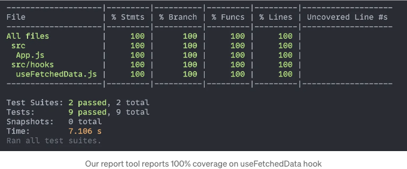

저는 마지막으로 무언가를 쓴 지 오래되었고, 커스텀 React 훅을 테스트하는 방법에 대해 작성해보는 것이 좋을 것 같다고 생각했습니다.

이에 관한 전용 저장소를 만들어두었으니, 지금 가셔서 코드를 확인하거나 먼저 블로그 글을 읽어보세요.

이 앱은 간단합니다. API에 요청을 보내고 받은 항목 목록을 렌더링합니다. 약속이 진행 중이면 로딩 표시를 하고, 에러가 발생하면 에러를 보여줍니다.

<!-- ui-log 수평형 -->
<ins class="adsbygoogle"
  style="display:block"
  data-ad-client="ca-pub-4877378276818686"
  data-ad-slot="9743150776"
  data-ad-format="auto"
  data-full-width-responsive="true"></ins>
<component is="script">
(adsbygoogle = window.adsbygoogle || []).push({});
</component>

```js
function App() {
  const { data, error, loading } = useFetchedData();

  return (
    <div className="App">
      {loading && <p>Loading...</p>}

      {error && <p>Error: {error.message}</p>}

      {data && (
        <ul>
          {data.map((post) => (
            <li key={post.id}>{post.title}</li>
          ))}
        </ul>
      )}
    </div>
  );
}
```

우리는 만든 useFetchedData 커스텀 훅에서 모든 값을 가져옵니다. 이 훅이 무엇을 하는지 그리고 무엇을 반환하는지 살펴봅시다.

```js
const useFetchedData = () => {
  const [data, setData] = useState(null);
  const [error, setError] = useState(null);
  const [loading, setLoading] = useState(true);

  useEffect(() => {
    const abortController = new AbortController();

    const fetchData = async () => {
      try {
        const response = await fetch(API_URL, {
          signal: abortController.signal,
        });

        const json = await response.json();
        setData(json);
      } catch (error) {
        setError(error);
      } finally {
        setLoading(false);
      }
    };

    fetchData();

    return () => {
      abortController.abort();
    };
  }, []);

  return { data, error, loading };
};
```

## 코드 간단한 설명

<!-- ui-log 수평형 -->
<ins class="adsbygoogle"
  style="display:block"
  data-ad-client="ca-pub-4877378276818686"
  data-ad-slot="9743150776"
  data-ad-format="auto"
  data-full-width-responsive="true"></ins>
<component is="script">
(adsbygoogle = window.adsbygoogle || []).push({});
</component>

우선, 상태 변수의 초기값을 포함하는 객체를 반환합니다.

useEffect에서는 API에 요청을 보내고 데이터를 받아서 data 상태 변수에 저장한 후 로딩 변수를 업데이트합니다. 이로 인해 컴포넌트가 다시 렌더링되며 업데이트된 값이 포함된 새 객체를 반환합니다.

또한 오류가 발생할 경우 error 상태 변수에 오류를 저장하고 로딩 변수를 false로 업데이트합니다.

또한 useEffect 훅에 정리 함수를 추가하여 컴포넌트가 언마운트될 때 요청을 중단합니다.

<!-- ui-log 수평형 -->
<ins class="adsbygoogle"
  style="display:block"
  data-ad-client="ca-pub-4877378276818686"
  data-ad-slot="9743150776"
  data-ad-format="auto"
  data-full-width-responsive="true"></ins>
<component is="script">
(adsbygoogle = window.adsbygoogle || []).push({});
</component>

## 초기 상태 변수를 테스트합니다

```js
import { renderHook } from "@testing-library/react";
import useFetchedData from "./useFetchedData";

// 다음 테스트에 이 mock이 필요합니다
global.fetch = jest.fn();

describe("useFetchedData", () => {
  it("데이터, 에러 및 로딩에 대한 초기 값이 반환되어야 합니다", async () => {
    const { result } = renderHook(() => useFetchedData());
    const { data, error, loading } = result.current;

    expect(data).toBe(null);
    expect(error).toBe(null);
    expect(loading).toBe(true);
  });
});
```

이 테스트에서는 비동기 요청이 완료되기 전에 커스텀 훅의 초기 값들을 테스트하려고 합니다. @testing-library/react의 renderHook을 사용하여 훅을 렌더링하고, 그 후에 상태 변수들의 값을 접근할 수 있습니다. 그런 다음 초기 값들이 올바른지 확인하는 단언을 추가합니다.

## 요청이 성공적으로 완료되었을 때 테스트

<!-- ui-log 수평형 -->
<ins class="adsbygoogle"
  style="display:block"
  data-ad-client="ca-pub-4877378276818686"
  data-ad-slot="9743150776"
  data-ad-format="auto"
  data-full-width-responsive="true"></ins>
<component is="script">
(adsbygoogle = window.adsbygoogle || []).push({});
</component>

```js
describe("데이터를 성공적으로 가져왔을 때", () => {
  let mockedData;

  beforeEach(() => {
    mockedData = [
      {
        body: "가짜 본문",
        id: 1,
        title: "가짜 제목",
        userId: 1,
      },
    ];

    global.fetch.mockResolvedValue({
      json: jest.fn().mockResolvedValue(mockedData),
    });
  });

  it("데이터를 반환해야 합니다", async () => {
    const { result } = renderHook(() => useFetchedData());

    await waitFor(() =>
      expect(result.current).toEqual({
        data: mockedData,
        error: null,
        loading: false,
      })
    );
  });
});
```

테스트를 조직화하기 위해 기존에 있던 describe 블록에 하나 더 추가하여 더 명확히 할 수 있습니다. beforeEach에서 fetch 함수를 가로채 가짜 데이터를 반환하도록 설정합니다. 그런 다음 후크를 렌더링하고 프로미스가 해결될 때까지 기다리기 위해 waitFor을 사용합니다. 그런 다음 데이터가 우리가 예상한 것과 일치하는지 확인합니다.

그것이 행복한 상황이었습니다, 이제 API가 오류를 응답할 때 우리의 슬픈 상황인 세 번째 테스트를 추가해 보겠습니다. 😢 즉, API가 오류로 응답할 때입니다.

## loading 속성 테스트하기```

<!-- ui-log 수평형 -->
<ins class="adsbygoogle"
  style="display:block"
  data-ad-client="ca-pub-4877378276818686"
  data-ad-slot="9743150776"
  data-ad-format="auto"
  data-full-width-responsive="true"></ins>
<component is="script">
(adsbygoogle = window.adsbygoogle || []).push({});
</component>

```js
describe("로딩 속성", () => {
  it("초기값은 true이고 나중에 false로 변경되어야 합니다", async () => {
    const { result } = renderHook(() => useFetchedData());
    const { loading } = result.current;

    // 리렌더링 전에 로딩의 초기값이 true임을 검증합니다
    expect(loading).toBe(true);

    await waitFor(() => {
      const { loading } = result.current;

      expect(loading).toBe(false);
    });
  });
});
```

다시 한 번, renderHook을 사용하여 훅을 렌더링하고, 리렌더링이 발생하기 전에 로딩 속성의 초기값이 true인지 확인합니다. 그런 다음 waitFor 내부에 두 번째 검증을 감싸어서 리렌더링 이후에 확인하도록 합니다.

## 에러 시나리오를 테스트하는 부분

```js
describe("데이터를 성공적으로 가져오지 못했을 때", () => {
  const mockedError = new Error("모의 에러");

  beforeEach(() => {
    // fetch가 rejected 값을 반환하도록 모의화하여
    // 코드의 catch 블록에 대한 일부 커버리지를 추가합니다
    fetch.mockRejectedValue(mockedError);
  });

  it("에러를 반환해야 합니다", async () => {
    const { result } = renderHook(() => useFetchedData());

    await waitFor(() => {
      const { error } = result.current;
      expect(error).toBe(mockedError);
    });
  });
});
```

<!-- ui-log 수평형 -->
<ins class="adsbygoogle"
  style="display:block"
  data-ad-client="ca-pub-4877378276818686"
  data-ad-slot="9743150776"
  data-ad-format="auto"
  data-full-width-responsive="true"></ins>
<component is="script">
(adsbygoogle = window.adsbygoogle || []).push({});
</component>

행복한 경로와는 조금 다르지만, 지금은 Jest의 mockRejectedValue를 사용하여 fetch 함수를 가짜로 만들어 모의 오류가 포함된 거부된 Promise를 반환합니다. 그런 다음 훅을 렌더링하고, 맞죠, 우리는 waitFor 내부에 어설션을 감싸서 약속이 거부되고 그 결과로 우리의 어설션이 통과할 때까지 기다립니다.

## 커버리지와 일반적인 테스트에 대한 간단한 메모

이 시점에서 우리의 테스트 커버리지 도구는 우리가 100%의 커버리지를 가지고 있다고 보고합니다. 이게 진실일까요?



<!-- ui-log 수평형 -->
<ins class="adsbygoogle"
  style="display:block"
  data-ad-client="ca-pub-4877378276818686"
  data-ad-slot="9743150776"
  data-ad-format="auto"
  data-full-width-responsive="true"></ins>
<component is="script">
(adsbygoogle = window.adsbygoogle || []).push({});
</component>

기술적으로는 맞지만 커버리지는 우리의 테스트에서 직접적으로 나오는 것은 아닙니다. RTL은 각 테스트 후에 클린업 함수를 실행하고, 이 함수는 useEffect에서 가지고 있는 클린업 함수를 실행합니다. 그렇게 되면 다음 코드가 커버되죠:

```js
return () => {
  abortController.abort();
};
```

이 경우에는 라이브러리의 기본 동작이 우리의 코드를 커버하는 것이죠. 하지만 현실적인 시나리오에서는 특정 부분의 테스트를 추가하지 않아도 100% 커버리지를 얻을 수 있는 경우가 있습니다. 예를 들어 다음 코드를 고려해 보세요:

```js
import saveToDadatabase from "./saveToDatabase";

const processData = (data) => {
  data.processed = true;

  saveToDadatabase(data);

  return data;
};
```

<!-- ui-log 수평형 -->
<ins class="adsbygoogle"
  style="display:block"
  data-ad-client="ca-pub-4877378276818686"
  data-ad-slot="9743150776"
  data-ad-format="auto"
  data-full-width-responsive="true"></ins>
<component is="script">
(adsbygoogle = window.adsbygoogle || []).push({});
</component>

우리는 데이터베이스에 데이터를 저장하는 것 외에도 전달한 데이터를 반환하는 processData 함수를 갖고 있습니다. 이제 이 파일에 대한 다음 테스트를 고려해보세요:

```js
import { processData } from "./processData";

describe("processData", () => {
  it("should return processed data", () => {
    const data = {
      body: "mock body",
    };

    const processedData = processData(data);

    expect(processedData).toEqual({
      body: "mock body",
      processed: true,
    });
  });
});
```

위의 테스트는 processData 함수에 데이터 객체를 전달하면 processed 속성이 추가되어 true로 설정된 상태로 반환된다는 것을 확인합니다. 정확한 시나리오에서는 코드 커버리지가 100%가 될 것이며, saveToDatabase(data) 호출을 제거해도 테스트는 통과할 것입니다! 😱

나는 모든 것을 다루었는지 확인하기 위해 자신에게 하는 좋은 질문은 "만약 이 코드 줄을 제거한다면 어떤 테스트가 실패할 것인가?"입니다. 그렇지 않으면 해당 코드 줄을 다루는 더 많은 테스트를 추가하여 더 구체적으로 다뤄야 함을 알 수 있습니다.

<!-- ui-log 수평형 -->
<ins class="adsbygoogle"
  style="display:block"
  data-ad-client="ca-pub-4877378276818686"
  data-ad-slot="9743150776"
  data-ad-format="auto"
  data-full-width-responsive="true"></ins>
<component is="script">
(adsbygoogle = window.adsbygoogle || []).push({});
</component>

어쨌든, 우리가 조금 색다른 방향으로 떠났지만 언급할 가치가 있다고 생각해요. useEffect에서 클린업 함수를 다루는 추가 테스트를 추가해볼까요?

## 클린업 함수 테스트

```js
describe("언마운트 시 fetch 요청을 중단해야 합니다", () => {
  const mockedAbortController = {
    abort: jest.fn(),
  };

  beforeEach(() => {
    global.AbortController = jest.fn(() => mockedAbortController);
  });

  it("fetch 요청을 중단해야 합니다", async () => {
    const { unmount } = renderHook(() => useFetchedData());
    unmount();

    expect(mockedAbortController.abort).toHaveBeenCalled();
  });
});
```

여기서도 똑같은 패턴을 보시고 계실 거에요. beforeEach에서 무언가를 mocking한 다음 호출되었는지 확인하는 것이죠.

<!-- ui-log 수평형 -->
<ins class="adsbygoogle"
  style="display:block"
  data-ad-client="ca-pub-4877378276818686"
  data-ad-slot="9743150776"
  data-ad-format="auto"
  data-full-width-responsive="true"></ins>
<component is="script">
(adsbygoogle = window.adsbygoogle || []).push({});
</component>

저는 주로 가능한 한 it 블록 대신 beforeEach에서 함수를 모킹하는 것을 좋아합니다. 그러면 일반적으로 당신의 어서션들을 훨씬 더 간결하게 할 수 있어요.

여기서 새로운 점은 renderHook이 반환하는 unmount 함수를 사용한다는 것인데, 이 함수는 우리의 컴포넌트를 언마운트하고 useEffect의 클린업 함수를 실행합니다.

## 마지막으로

끝까지 왔네요!

<!-- ui-log 수평형 -->
<ins class="adsbygoogle"
  style="display:block"
  data-ad-client="ca-pub-4877378276818686"
  data-ad-slot="9743150776"
  data-ad-format="auto"
  data-full-width-responsive="true"></ins>
<component is="script">
(adsbygoogle = window.adsbygoogle || []).push({});
</component>

저장소를 복제해서 직접 시도해볼 수 있어요. 앱.js 파일에 대한 테스트도 찾을 수 있을 거예요.

도움이 되었으면 좋겠고, 언제나 피드백을 공유해주세요 🙂