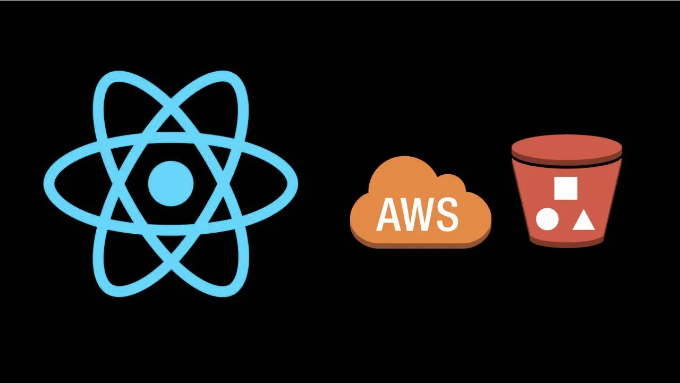
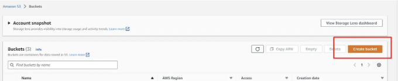
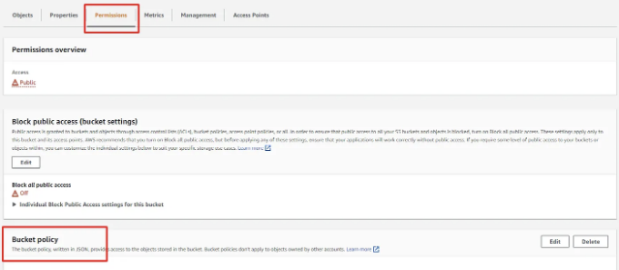

아마존 Simple Storage Solution (S3)은 개발자들을 위한 클라우드 기반 저장 솔루션이며 대량의 데이터를 저장하고 검색할 수 있습니다. 높은 확장성과 오랜 지속성으로 웹 애플리케이션에서 파일을 저장하고 관리하는 우수한 선택입니다. 이 튜토리얼에서는 React JS를 사용하여 파일을 S3 버킷에 업로드하는 방법을 살펴볼 것입니다.

# 요구 사항

- aws-sdk

<!-- ui-log 수평형 -->
<ins class="adsbygoogle"
  style="display:block"
  data-ad-client="ca-pub-4877378276818686"
  data-ad-slot="9743150776"
  data-ad-format="auto"
  data-full-width-responsive="true"></ins>
<component is="script">
(adsbygoogle = window.adsbygoogle || []).push({});
</component>

단계 1: S3 버킷 설정하기

Amazon S3를 사용하려면 먼저 AWS 계정에 S3 버킷을 생성해야 합니다. AWS 관리 콘솔로 이동하여 S3 서비스로 들어가면 이 작업을 수행할 수 있습니다. 새 버킷을 만들려면 “버킷 만들기” 버튼을 클릭하세요. 데이터를 저장할 지역을 선택하고 고유한 이름을 부여하세요. 또한 액세스 권한 및 버전 관리와 같은 버킷 설정을 수정할 수 있습니다.



단계 2: 버킷 공개하기

<!-- ui-log 수평형 -->
<ins class="adsbygoogle"
  style="display:block"
  data-ad-client="ca-pub-4877378276818686"
  data-ad-slot="9743150776"
  data-ad-format="auto"
  data-full-width-responsive="true"></ins>
<component is="script">
(adsbygoogle = window.adsbygoogle || []).push({});
</component>

이제 파일을 공개적으로 접근 가능하게 하기 위해 버킷 정책을 편집해야 합니다. 버킷을 열고 권한 탭으로 이동하여 버킷 정책의 편집 버튼을 클릭하고 아래 JSON을 붙여넣어주세요.



참고: "bucket-name"을 귀하의 버킷 이름으로 대체해 주세요.

단계 3: CORS 정책 편집

<!-- ui-log 수평형 -->
<ins class="adsbygoogle"
  style="display:block"
  data-ad-client="ca-pub-4877378276818686"
  data-ad-slot="9743150776"
  data-ad-format="auto"
  data-full-width-responsive="true"></ins>
<component is="script">
(adsbygoogle = window.adsbygoogle || []).push({});
</component>

허가 탭 바닥에 Cross-origin resource sharing (CORS)를 찾을 수 있어요. 프론트엔드에서 파일 업로드를 가능하게 하려면 아래 JSON을 붙여넣기해야 해요. 그렇지 않으면 파일을 업로드할 때 CORS 오류가 발생할 거예요.

단계 4: AWS SDK for JavaScript 설치하기

AWS SDK for JavaScript를 설치하면 React JS 애플리케이션이 S3와 통신할 수 있어요.

```js
npm install aws-sdk
```

<!-- ui-log 수평형 -->
<ins class="adsbygoogle"
  style="display:block"
  data-ad-client="ca-pub-4877378276818686"
  data-ad-slot="9743150776"
  data-ad-format="auto"
  data-full-width-responsive="true"></ins>
<component is="script">
(adsbygoogle = window.adsbygoogle || []).push({});
</component>

5단계: React JS에서 파일 업로더 만들기

사용자가 파일을 S3에 업로드할 수 있도록 하려면 React JS 애플리케이션에 파일 입력란을 추가해야 합니다. 아래 코드를 애플리케이션에 붙여넣으세요.

위 코드에서 파일을 선택하고 handleFileChange은 기본적으로 useState 훅을 사용하여 생성한 파일 상태에 파일을 저장합니다.

6단계: aws-sdk 가져오기

<!-- ui-log 수평형 -->
<ins class="adsbygoogle"
  style="display:block"
  data-ad-client="ca-pub-4877378276818686"
  data-ad-slot="9743150776"
  data-ad-format="auto"
  data-full-width-responsive="true"></ins>
<component is="script">
(adsbygoogle = window.adsbygoogle || []).push({});
</component>

위의 코드에 AWS SDK를 가져오세요.

```js
import AWS from 'aws-sdk';
```

7단계: AWS 자격 증명 구성 및 파일을 S3에 업로드

이제 AWS 자격 증명을 포함하고 S3에 파일을 업로드하는 함수를 만들겠습니다. 함수의 이름은 uploadFile이며, 위의 코드에서 생성된 업로드 버튼을 클릭하면 트리거됩니다.

<!-- ui-log 수평형 -->
<ins class="adsbygoogle"
  style="display:block"
  data-ad-client="ca-pub-4877378276818686"
  data-ad-slot="9743150776"
  data-ad-format="auto"
  data-full-width-responsive="true"></ins>
<component is="script">
(adsbygoogle = window.adsbygoogle || []).push({});
</component>

이 문자열들을 다음과 같이 대체해야 해요

- bucket-name: 버킷 이름
- region: 버킷 지역
- youraccesskeyhere: 액세스 키
- yoursecretaccesskeyhere: 시크릿 액세스 키

그러면 최종 코드는 이렇습니다.

참고: 코드에 시크릿 키와 액세스 키를 추가했지만, 코드에 포함하는 것은 좋지 않아요. .env 파일에 저장하고 그것들에 접근하는 것이 좋아요.

<!-- ui-log 수평형 -->
<ins class="adsbygoogle"
  style="display:block"
  data-ad-client="ca-pub-4877378276818686"
  data-ad-slot="9743150776"
  data-ad-format="auto"
  data-full-width-responsive="true"></ins>
<component is="script">
(adsbygoogle = window.adsbygoogle || []).push({});
</component>

어떠한 쿼리가 있으면 LinkedIn을 통해 연락 주세요.

아래에는 샘플 GitHub 저장소와 codesandbox에서의 데모를 찾을 수 있습니다.