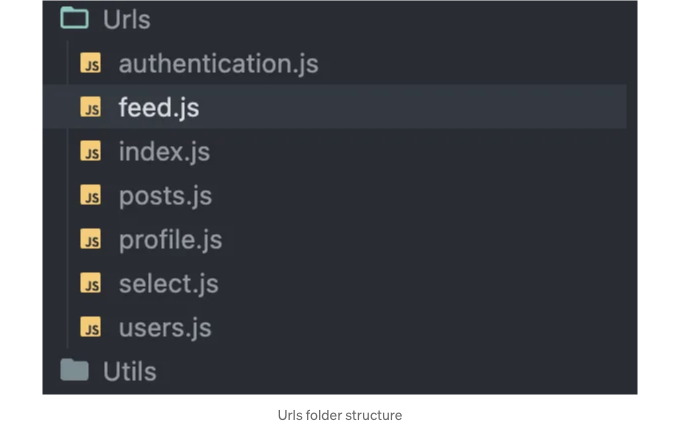
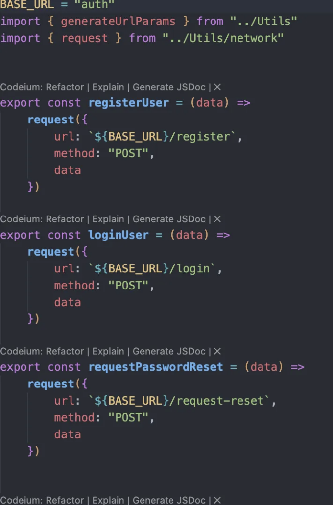

```markdown


React Query는 React 애플리케이션 내에서 데이터를 관리하기 위해 설계된 강력한 라이브러리입니다. 데이터 가져오기, 캐싱, 서버와의 동기화와 같은 작업을 간편하게 처리하며, 우아한 솔루션을 제공합니다. 반면 Axios는 JavaScript 애플리케이션에서 API 요청을 처리하기 위해 널리 사용되는 HTTP 클라이언트입니다. React Query와 Axios를 결합하여 손쉽게 구현하고 유지보수할 수 있는 강력한 데이터 관리 솔루션을 만들 수 있습니다.

본 문서에서는 React Query를 Axios와 통합하는 과정을 안내합니다. 우리는 데이터 관리 접근 방식을 간소화하기 위해 일부 사용자 정의 후크와 함께 Axios인 request processor를 활용할 것입니다. 각 단계는 예제와 함께 제시되어 있어 쉽게 따라할 수 있고 애플리케이션에 솔루션을 구현할 수 있습니다. 이 문서는 React Query 라이브러리의 최신 개선 사항과 요구 사항을 반영하도록 업데이트되었습니다.

# 단계 1: Axios 클라이언트 및 request processor 설정하기
```

<!-- ui-log 수평형 -->
<ins class="adsbygoogle"
  style="display:block"
  data-ad-client="ca-pub-4877378276818686"
  data-ad-slot="9743150776"
  data-ad-format="auto"
  data-full-width-responsive="true"></ins>
<component is="script">
(adsbygoogle = window.adsbygoogle || []).push({});
</component>

React Query 코드를 구현하기 전에 프로젝트 구조를 설정하는 것이 중요합니다. Utils 폴더를 만들어 프로젝트 구조를 조직화하세요. 이 폴더 안에 Network.js 파일을 생성해 요청 처리기를 구현하세요. 요청 처리기를 설정하는 단계는 다음과 같습니다:

```js
import axios from "axios";
import { BASE_URL } from "./constants";

const client = axios.create({
    baseURL: BASE_URL
})

export const request = async (options) => {
    let token
    const state = store.getState()
    const userState = state?.user?.currentUser
    if (userState === null) {
        token = ""
    }
    else {
        const { accessToken } = userState
        token = accessToken
    }
    // 인가 헤더 설정
    token !== "" && (client.defaults.headers.common.Authorization = `Bearer ${token}`);

    const onSuccess = (response) => {
        return response?.data?.data;
    };

    const onError = (error) => {
        return Promise.reject(error.response?.data);
    };

    return client(options).then(onSuccess).catch(onError);
};
```

이 코드는 여러 중요한 기능을 수행합니다. 지정된 baseURL로 Axios 클라이언트를 설정하고 요청 처리기를 구축합니다. Redux를 상태 관리에 사용하고 Redux 상태에 토큰이 저장된 경우, 이 코드는 state.getStore()를 사용해 액세스 토큰을 추출하는 데 도움을 줍니다. 또는 토큰을 쿠키나 기타 원하는 방식으로 저장할 수도 있습니다.

요청 함수는 이 설정에서 중심적인 역할을 하며 헤더 설정, 요청 생성, 견고한 오류 처리, 반환된 데이터 형식 변환에 도움을 줍니다. 또한 특정 프로젝트 요구 사항에 따라 맞춤화할 수 있는 여지가 있습니다.

<!-- ui-log 수평형 -->
<ins class="adsbygoogle"
  style="display:block"
  data-ad-client="ca-pub-4877378276818686"
  data-ad-slot="9743150776"
  data-ad-format="auto"
  data-full-width-responsive="true"></ins>
<component is="script">
(adsbygoogle = window.adsbygoogle || []).push({});
</component>

요청 기능이 준비되면 React Query 내에서 사용자 정의 훅을 만들어 API 요청을 간편하게 처리하고 데이터를 추가로 변환할 수 있습니다. 구체적으로, 사용자 정의 useApiSend 및 useApiGet 훅을 만들어 외부 및 내부 요청에 사용할 수 있습니다. 

```js
import { 
  useQuery,
  useMutation, 
  useQueryClient
 } from "@tanstack/react-query"


export const useApiGet = (key, fn, options) => useQuery({
    queryKey: key,
    queryFn: fn,
    ...options
})

export const useApiSend = (fn, success, error, invalidateKey, options) => {
    const queryClient = useQueryClient();

    return useMutation({
        mutationFn: fn,
        onSuccess: (data) => {
            invalidateKey &&
                invalidateKey.forEach((key) => {
                    queryClient.invalidateQueries(key);
                });
            success && success(data);
        },
        onError: error,
        retry: 2,
        ...options, 
    });
};
```

useApiGet 코드 스니펫에서는 쿼리 키를 받아들이는 것을 볼 수 있습니다. 이 키는 쿼리를 무효화하거나 쿼리와 관련된 특정 작업을 수행할 수 있습니다. 또한 쿼리 함수 매개변수를 통해 요청 처리기 동작을 반환하는 함수를 받습니다. 마지막으로 options 매개변수는 쿼리에 설정하려는 React Query 옵션으로 구성되어 있습니다. 이 설정은 구현하면 명료하고 간단해집니다. 

마찬가지로 useApiSend는 POST, PUT, PATCH, DELETE 등의 외부 요청을 용이하게 처리합니다. useApiGet과 유사하게 fn(함수), 성공 시 작업을 정의하는 success 매개변수, 오류 처리를 담당하는 error 매개변수, 무효화를 위한 쿼리 키 및 React Query 옵션과 같은 매개변수를 받습니다.

<!-- ui-log 수평형 -->
<ins class="adsbygoogle"
  style="display:block"
  data-ad-client="ca-pub-4877378276818686"
  data-ad-slot="9743150776"
  data-ad-format="auto"
  data-full-width-responsive="true"></ins>
<component is="script">
(adsbygoogle = window.adsbygoogle || []).push({});
</component>

# 단계 2: useApiGet 사용하기

우리의 커스텀 후크 주방에서 새롭게 만들어진 useApiGet 커스텀 훅을 활용하여 GET 요청을 수행해 봅시다! 😏 먼저 API 요청을 위한 URL을 반환하는 함수들을 담기 위해 Urls라는 폴더를 만드는 것이 좋습니다. 예를 들어, 서버로부터 포스트 피드를 가져오고 싶다면, API 엔드포인트는 일반적으로 컨트롤러에 따라 구성됩니다. 최고의 방법론으로는 이 폴더의 파일들을 컨트롤러의 이름에 따라 지어주는 것이 좋습니다. 왜냐하면 컨트롤러 내 모든 URL들은 엔드포인트의 시작 이름이 동일하기 때문입니다.





<!-- ui-log 수평형 -->
<ins class="adsbygoogle"
  style="display:block"
  data-ad-client="ca-pub-4877378276818686"
  data-ad-slot="9743150776"
  data-ad-format="auto"
  data-full-width-responsive="true"></ins>
<component is="script">
(adsbygoogle = window.adsbygoogle || []).push({});
</component>

위의 이미지는 URL 파일을 구조화하는 방법을 설명하기 위한 것입니다. 이제 토론으로 돌아가 봅시다. "feeds" 엔드포인트에 대한 GET 요청을 만들어보겠습니다.

```js
// feed URL 정의

import { request } from "../Utils"
export const getFeeds = () =>
    request({
        url: `/feed`,
        method: "GET",
    })
```

```js
// 서버로부터 피드를 가져오는 홈페이지
import { getFeeds } from '../../../Urls';

const {
        data,
        isLoading,
        error,
        isError,
        isLoadingError,
        refetch } = useApiGet(
            ["feeds"],
            getFeeds,
            {
                enabled: true,
                refetchOnWindowFocus: true,
                retry: 1
            }
        );


    if (isLoading)
        return <ScreenLoader />;

    if (isError || isLoadingError)
        return <ErrorPage
            error={error?.message}
return (
  <div>
    {data?.map((item,index))=> <PostCard item={item} key={index}/>}
  </div>
)
```

위의 코드는 useApiGet을 사용하여 GET 요청을 하는 간단한 설명을 제공합니다.

<!-- ui-log 수평형 -->
<ins class="adsbygoogle"
  style="display:block"
  data-ad-client="ca-pub-4877378276818686"
  data-ad-slot="9743150776"
  data-ad-format="auto"
  data-full-width-responsive="true"></ins>
<component is="script">
(adsbygoogle = window.adsbygoogle || []).push({});
</component>

# 단계 3: 데이터 변이

데이터를 가져오는 것 외에도 서버로 데이터를 보내는 것이 아주 중요합니다. 어떻게 진행할 수 있는지 알아보겠습니다. GET 요청을 처리하는 것과 유사하게, POST 요청을 처리하는 함수를 정의해야 합니다. 이제 POST 요청을 만들어 봅시다.

```js
// create post function

import { request } from "../Utils"

export const createPost = (data) =>
    request({
        url: `/posts`,
        method: "POST",
        data
    })
```

```js
export const AddPost =()=>{
  const [post, setPost] = useState()
  const { mutate, isPending } = useApiSend(
        createPost,
        () => {
            Toast.show({
                type: "success",
                text1: "게시물이 성공적으로 추가되었습니다."
            })
        },
        (e) => {
            Toast.show({
                type: "error",
                text1: `게시물을 추가할 수 없습니다. ${e.message}`
            })
        }
    )Ï
}

const onSubmit =()=>{
   mutate({
      content:post
    })
}
if(isPending){
    return <ScreenLoader/>
}

return (
    <div>
       <input placeholder="게시물 입력" value={post} onChange={(value)=> setPost(value)}/>
       <button onClick={onSubmit}>게시물 추가</button>
    </div>
)
```  

<!-- ui-log 수평형 -->
<ins class="adsbygoogle"
  style="display:block"
  data-ad-client="ca-pub-4877378276818686"
  data-ad-slot="9743150776"
  data-ad-format="auto"
  data-full-width-responsive="true"></ins>
<component is="script">
(adsbygoogle = window.adsbygoogle || []).push({});
</component>

여기서는 POST 요청을 만들고 있어요. 먼저 createPost 함수를 정의하여 URL, 메소드 및 데이터를 요청 처리기에 전달하여 요청을 수행합니다. 또한 axios.post, axios.get, axios.patch 등의 Axios 함수를 활용하고 요구 사항에 맞게 더 맞춤화된 API 훅을 만들 수 있어요. useApiSend 훅은 React Query의 useMutation과 유사한 모든 메소드와 변수를 노출하며 요청을 수행하고 로딩 및 오류 상태를 관리하는 데 도움이 되도록 만들어졌어요.

# 모두 함께 적용해 봅시다:

이 기사에서는 React Query를 효과적으로 활용하여 요청 처리기로 Axios를 사용하고 사용자 정의 훅과 Axios 클라이언트를 함께 사용하는 방법을 보여 드렸어요. 데이터를 가져오고 변경하는 예제를 제공하였으며 React 애플리케이션에 모든 것을 매끄럽게 통합하는 방법을 설명했어요.

React Query를 Axios와 함께 활용함으로써 사용자 친화적이고 유지 보수 가능한 견고한 데이터 관리 솔루션을 구축할 수 있어요. 데이터 가져오기, 캐싱 및 서버와의 동기화를 관리하는 간단하고 우아한 접근 방식을 제공해줘요.

<!-- ui-log 수평형 -->
<ins class="adsbygoogle"
  style="display:block"
  data-ad-client="ca-pub-4877378276818686"
  data-ad-slot="9743150776"
  data-ad-format="auto"
  data-full-width-responsive="true"></ins>
<component is="script">
(adsbygoogle = window.adsbygoogle || []).push({});
</component>

감사합니다! 또 봐요!