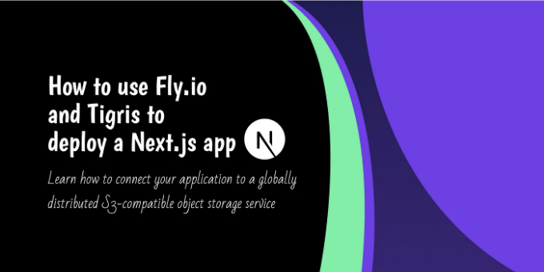
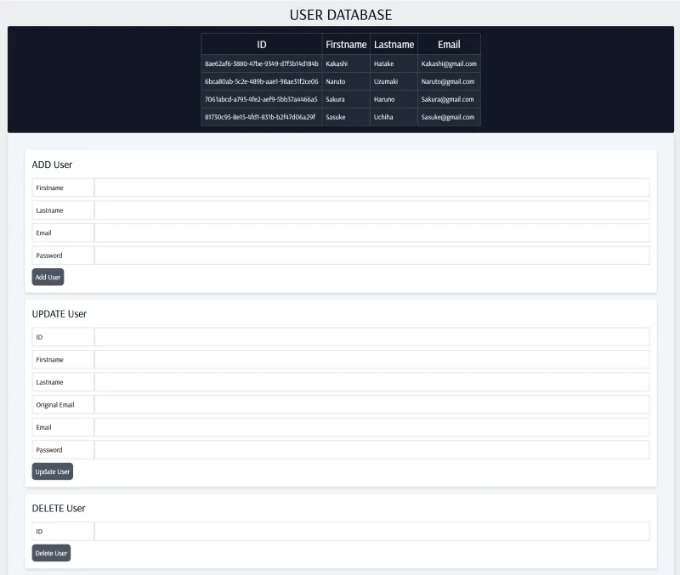
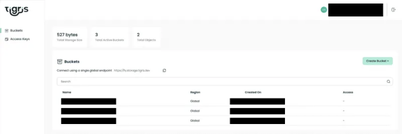
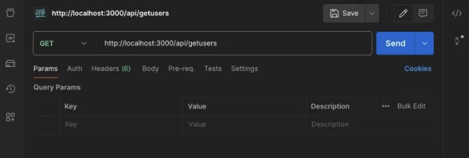
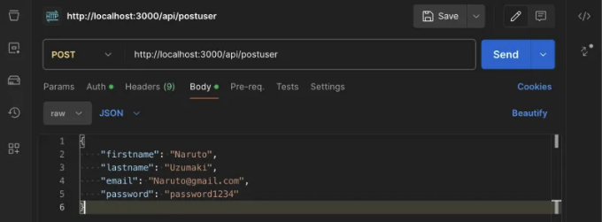
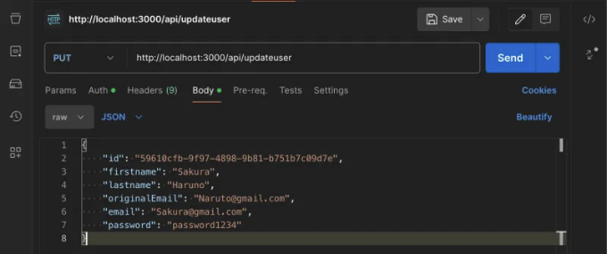
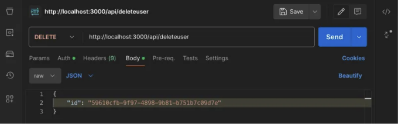

# 소개

오늘은 앱 배포 플랫폼인 fly.io와 글로벌으로 분산된 S3 호환 객체 저장 서비스 Tigris에 대해 배워볼 것입니다. 두 플랫폼은 밀접하게 연결되어 있어 프로젝트에 적합한 선택지입니다. fly.io로부터 앱 배포 경험과 Tigris로부터 객체 저장 기능을 얻을 수 있습니다. 앱 배포는 매우 직관적이기 때문에 대신에 Tigris가 사용하는 버킷 저장소에 대해 간단히 소개해보겠습니다.

Amazon S3 버킷은 AWS(Amazon Web Services)의 Simple Storage Service (S3) 플랫폼을 통해 접근할 수 있는 퍼블릭 클라우드 저장소 자원입니다. 전 세계에 분산되어 있는 S3 호환 객체 저장 서비스 Tigris가 사용하는 저지연 저장소는 그 중요한 기능입니다. 이는 Tigris에서 Amazon의 S3 버킷에 접근하여 저장소 요구 사항을 충족할 수 있다는 것을 의미합니다. Tigris는 Fly.io와 완전히 통합되어 있으며, Fly.io의 하드웨어에서 작동하는 flyctl과 완전히 통합되어 있습니다. Fly.io의 명령줄 인터페이스인 flyctl을 통해 계정 생성부터 애플리케이션 배포까지 플랫폼을 다룰 수 있습니다.

<!-- ui-log 수평형 -->
<ins class="adsbygoogle"
  style="display:block"
  data-ad-client="ca-pub-4877378276818686"
  data-ad-slot="9743150776"
  data-ad-format="auto"
  data-full-width-responsive="true"></ins>
<component is="script">
(adsbygoogle = window.adsbygoogle || []).push({});
</component>

이 플랫폼의 기초를 배우기 위해 사용자 데이터베이스 애플리케이션을 만들 것입니다. 이해하기 쉽습니다. 사실, 우리는 읽기, 추가, 수정 및 삭제와 같은 전체 CRUD 요청을 수행할 수 있어야 합니다. Next.js가 주요 프레임워크가 될 것이며, 별도의 서버를 생성하지 않고도 풀 스택 앱을 구축할 수 있도록 해줍니다.



fly.io와 tigris에 대해 더 알아보고, 두 플랫폼에 계정을 생성해야 합니다. 어쨌든, 설명은 여기까지하고 다음 섹션에서 계정을 작성하고 앱을 만들기 시작합시다.

이 프로젝트에서 온라인으로 코드베이스를 찾을 수 있습니다: [https://github.com/andrewbaisden/fly-tigris-user-database](https://github.com/andrewbaisden/fly-tigris-user-database).


<!-- ui-log 수평형 -->
<ins class="adsbygoogle"
  style="display:block"
  data-ad-client="ca-pub-4877378276818686"
  data-ad-slot="9743150776"
  data-ad-format="auto"
  data-full-width-responsive="true"></ins>
<component is="script">
(adsbygoogle = window.adsbygoogle || []).push({});
</component>

# fly.io와 Tigris에서 계정 만들기

두 플랫폼 모두 시작하려면 다음 단계를 따라주세요.

- 먼저, Tigris를 활용하려면 Fly.io 계정이 필요하므로 fly.io에 계정을 만들어야 합니다.
- 그 다음으로, 컴퓨터에 flyctl 명령줄 도구를 설치해야 합니다. 이 도구는 애플리케이션을 배포할 때 계정을 설정하는 데 필수적입니다.

자, 다음 단계로 넘어가서 프로젝트를 설정하고 Tigris 버킷 스토리지를 만들어봅시다.

<!-- ui-log 수평형 -->
<ins class="adsbygoogle"
  style="display:block"
  data-ad-client="ca-pub-4877378276818686"
  data-ad-slot="9743150776"
  data-ad-format="auto"
  data-full-width-responsive="true"></ins>
<component is="script">
(adsbygoogle = window.adsbygoogle || []).push({});
</component>

# 사용자 데이터베이스 프로젝트 설정하기

프로젝트를 생성할 컴퓨터 디렉토리로 이동한 후 fly-tigris-user-database라는 폴더를 만들고 해당 폴더로 이동하세요. 그런 다음 해당 폴더 내에서 Next.js 프로젝트를 설정하기 위한 명령을 실행하세요:

이 프로젝트에서는 Tailwind CSS와 App 라우터에 대해 'yes'로 선택해야 합니다. 이것들이 프로젝트에 필요하기 때문입니다.

```js
npx create-next-app .
```

<!-- ui-log 수평형 -->
<ins class="adsbygoogle"
  style="display:block"
  data-ad-client="ca-pub-4877378276818686"
  data-ad-slot="9743150776"
  data-ad-format="auto"
  data-full-width-responsive="true"></ins>
<component is="script">
(adsbygoogle = window.adsbygoogle || []).push({});
</component>

우리가 설치해야 할 패키지는 @aws-sdk/client-s3 하나 뿐이에요. 이 패키지는 우리의 버킷에 연결하기 위해 필요합니다. 다음 명령어로 설치하세요:

```js
npm install @aws-sdk/client-s3
```

좋아요, 이제 방금 만든 프로젝트를 위한 버킷을 생성할 시간이에요. 여기 https://www.tigrisdata.com/docs/get-started/에서 공식 문서를 참고해주세요.

다음 명령어를 실행해 버킷을 생성하세요:

<!-- ui-log 수평형 -->
<ins class="adsbygoogle"
  style="display:block"
  data-ad-client="ca-pub-4877378276818686"
  data-ad-slot="9743150776"
  data-ad-format="auto"
  data-full-width-responsive="true"></ins>
<component is="script">
(adsbygoogle = window.adsbygoogle || []).push({});
</component>

```js
플라이 스토리지 생성
```

이제 설정 화면에서 버킷의 이름을 선택하세요. 이름은 고유해야 하므로 다른 사람이 선택한 이름을 사용할 수 없을 거에요. 이제 가장 중요한 단계인데요, 여기 예시처럼 AWS 및 버킷 비밀을 가지고 있어야 해요:

```js
AWS_ACCESS_KEY_ID: 당신의 키
AWS_ENDPOINT_URL_S3: https://fly.storage.tigris.dev
AWS_REGION: auto
AWS_SECRET_ACCESS_KEY: 당신의 비밀 액세스
BUCKET_NAME: 당신의 버킷 이름
```

당신의 Next.js 프로젝트 루트에 .env.local 파일을 생성하고, 이 비밀 환경 변수를 모두 복사해서 붙여넣으세요. 아직 끝나지 않았어요. 이 환경 변수들이 우리의 Next.js 애플리케이션 안에서 제대로 작동하려면, 그들의 이름을 공개적으로 만들어야 해요. 아래 예시를 참고하고 .env.local 파일을 수정해주세요. 또한 맨 위에 로컬호스트를 위한 별도의 환경 변수를 생성해주세요. 코드베이스를 fly.io에 업로드할 때 NEXT_PUBLIC_SECRET_HOST 환경 변수를 온라인 경로로 변경할 거에요.

<!-- ui-log 수평형 -->
<ins class="adsbygoogle"
  style="display:block"
  data-ad-client="ca-pub-4877378276818686"
  data-ad-slot="9743150776"
  data-ad-format="auto"
  data-full-width-responsive="true"></ins>
<component is="script">
(adsbygoogle = window.adsbygoogle || []).push({});
</component>

```js
NEXT_PUBLIC_SECRET_HOST: http://localhost:3000

NEXT_PUBLIC_SECRET_AWS_ACCESS_KEY_ID: 당신의 키
NEXT_PUBLIC_SECRET_AWS_ENDPOINT_URL_S3: https://fly.storage.tigris.dev
NEXT_PUBLIC_SECRET_AWS_REGION: auto
NEXT_PUBLIC_SECRET_AWS_SECRET_ACCESS_KEY: 당신의 시크릿 액세스
NEXT_PUBLIC_SECRET_BUCKET_NAME: 당신의 버킷 이름
```

현재 티그리스 문서 페이지에 들어가서 대시보드 버튼을 클릭하고 계정에 로그인하면 다음의 예시처럼 새로 생성한 버킷을 볼 수 있어요:



좋아요, 첫 번째 단계를 마쳤어요. 온라인으로 앱 데이터를 저장할 버킷이 있으니 다음 섹션에서 애플리케이션을 만드는 것을 시작할 수 있습니다.```

<!-- ui-log 수평형 -->
<ins class="adsbygoogle"
  style="display:block"
  data-ad-client="ca-pub-4877378276818686"
  data-ad-slot="9743150776"
  data-ad-format="auto"
  data-full-width-responsive="true"></ins>
<component is="script">
(adsbygoogle = window.adsbygoogle || []).push({});
</component>

# 사용자 데이터베이스 애플리케이션 구축하기

안녕하세요! 여기서는 두 가지 섹션으로 나눠서 진행할 거예요. 먼저 서버를 구축하고 실행하여 CRUD 엔드포인트를 테스트할 거에요. 그런 다음, 프론트 엔드를 마무리하겠습니다.

## 사용자 데이터베이스 서버 만들기

먼저 백엔드 아키텍처를 만들어봅시다. CRUD 요청마다 1개씩 4개의 엔드포인트를 만들 것이에요. 또한 사용자를 객체 저장소에서 가져오는 몇 가지 함수가 있는 도우미 파일이 필요합니다. 프로젝트의 루트 디렉토리로 이동하지 않았다면 아래 명령을 실행하여 모든 파일과 폴더를 빠르게 설정해주세요:

<!-- ui-log 수평형 -->
<ins class="adsbygoogle"
  style="display:block"
  data-ad-client="ca-pub-4877378276818686"
  data-ad-slot="9743150776"
  data-ad-format="auto"
  data-full-width-responsive="true"></ins>
<component is="script">
(adsbygoogle = window.adsbygoogle || []).push({});
</component>

```js
cd src/app
mkdir api
mkdir api/deleteuser api/getusers api/postuser api/updateuser
touch api/deleteuser/route.js
touch api/getusers/route.js
touch api/postuser/route.js
touch api/updateuser/route.js
mkdir helpers
touch helpers/getUsers.js
```

빠르게 진행되었네요! 이제 5개 파일에 코드를 추가하기만 하면 백엔드 API가 테스트 준비가 끝납니다.

먼저 helpers 파일을 수정해봅시다. helpers/getUsers.js 파일에 이 코드를 넣어주세요. 앞서 말했듯이 이 파일에는 사용자를 가져오고, 이메일 또는 ID에 따라 사용자를 가져오는 함수가 들어 있습니다:

```js
import {
  S3Client,
  ListObjectsV2Command,
  GetObjectCommand,
} from '@aws-sdk/client-s3';

const streamToString = (stream) =>
  new Promise((resolve, reject) => {
    const chunks = [];
    stream.on('data', (chunk) => chunks.push(chunk));
    stream.on('error', reject);
    stream.on('end', () => resolve(Buffer.concat(chunks).toString('utf8')));
  });
export async function fetchAllUsersFromS3() {
  try {
    const s3 = new S3Client({
      region: process.env.NEXT_PUBLIC_SECRET_AWS_REGION,
      endpoint: process.env.NEXT_PUBLIC_SECRET_AWS_ENDPOINT_URL_S3,
      credentials: {
        accessKeyId: process.env.NEXT_PUBLIC_SECRET_AWS_ACCESS_KEY_ID,
        secretAccessKey: process.env.NEXT_PUBLIC_SECRET_AWS_SECRET_ACCESS_KEY,
      },
    });
    const commandDetails = new ListObjectsV2Command({
      Bucket: process.env.NEXT_PUBLIC_SECRET_BUCKET_NAME,
      MaxKeys: 10,
    });
    const { Contents } = await s3.send(commandDetails);
    console.log('List Result', Contents);
    if (!Contents) {
      console.log('no users');
    } else {
      const users = await Promise.all(
        Contents.map(async (item) => {
          const getObject = new GetObjectCommand({
            Bucket: process.env.NEXT_PUBLIC_SECRET_BUCKET_NAME,
            Key: item.Key,
          });
          const { Body } = await s3.send(getObject);
          const data = await streamToString(Body);
          const userObject = JSON.parse(data);
          console.log('Data', data);
          return userObject;
        })
      );
      return users;
    }
  } catch (e) {
    console.error(e);
    throw e;
  }
}
export async function getUserById(users, userId) {
  if (!users) {
    console.log('no users');
  } else {
    return users.find((user) => user.id === userId);
  }
}
export async function getUserByIdEmail(users, email) {
  if (!users) {
    console.log('no users');
  } else {
    return users.find(
      (user) => user.email.toLowerCase() === email.toLowerCase()
    );
  }
}
```

<!-- ui-log 수평형 -->
<ins class="adsbygoogle"
  style="display:block"
  data-ad-client="ca-pub-4877378276818686"
  data-ad-slot="9743150776"
  data-ad-format="auto"
  data-full-width-responsive="true"></ins>
<component is="script">
(adsbygoogle = window.adsbygoogle || []).push({});
</component>

알겠어요, 이제는 경로만 남았네요. 사용자들을 Tigris 버킷에서 모두 가져올 GET 경로를 만들어 볼 거에요. 그러니 getusers/route.js 파일에 이 코드를 넣어보세요:

```js
import {
  S3Client,
  ListObjectsV2Command,
  GetObjectCommand,
} from '@aws-sdk/client-s3';

export async function GET() {
  const streamToString = (stream) =>
    new Promise((resolve, reject) => {
      const chunks = [];
      stream.on('data', (chunk) => chunks.push(chunk));
      stream.on('error', reject);
      stream.on('end', () => resolve(Buffer.concat(chunks).toString('utf8')));
    });

  try {
    const s3 = new S3Client({
      region: process.env.NEXT_PUBLIC_SECRET_AWS_REGION,
      endpoint: process.env.NEXT_PUBLIC_SECRET_AWS_ENDPOINT_URL_S3,
      credentials: {
        accessKeyId: process.env.NEXT_PUBLIC_SECRET_AWS_ACCESS_KEY_ID,
        secretAccessKey: process.env.NEXT_PUBLIC_SECRET_AWS_SECRET_ACCESS_KEY,
      },
    });

    const listParams = {
      Bucket: process.env.NEXT_PUBLIC_SECRET_BUCKET_NAME,
      MaxKeys: 10,
    };
    const list = new ListObjectsV2Command(listParams);
    const { Contents } = await s3.send(list);

    console.log('List Result', Contents);

    if (!Contents || Contents.length === 0) {
      console.log('No users found');
      return new Response(JSON.stringify({ error: 'No users found' }), {
        status: 404,
      });
    }

    const users = await Promise.all(
      Contents.map(async (item) => {
        const getObjectParams = {
          Bucket: process.env.NEXT_PUBLIC_SECRET_BUCKET_NAME,
          Key: item.Key,
        };
        const getObject = new GetObjectCommand(getObjectParams);
        const { Body } = await s3.send(getObject);
        const data = await streamToString(Body);

        console.log('Backend API GET Data:', data);
        return JSON.parse(data);
      })
    );

    return new Response(JSON.stringify(users), { status: 200 });

  } catch (e) {
    console.error('Error:', e);
    return new Response(
      JSON.stringify({ error: e.message || 'Unknown error' }), { status: 500 }
    );
  }
}
```

다음은 POST 경로에요. 여기서는 데이터를 Tigris 버킷에 보내는 작업을 할 거에요. 그 코드를 postuser/route.js 파일에 넣어보세요:

```js
import { fetchAllUsersFromS3, getUserByIdEmail } from '../../helpers/getUsers';
import { S3Client, PutObjectCommand } from '@aws-sdk/client-s3';

export async function POST(req) {
  try {
    const { firstname, lastname, email, password } = await req.json();
    const id = crypto.randomUUID();
    const data = { firstname, lastname, email, password, id };

    console.log('Request body data', data);

    const allUsers = await fetchAllUsersFromS3();
    console.log('all users', allUsers);

    const existingUser = await getUserByIdEmail(allUsers, email);
    console.log(existingUser, email);

    if (existingUser) {
      return Response.json({
        error: 'Email address already in use',
      });
    }

    const s3 = new S3Client({
      region: process.env.NEXT_PUBLIC_SECRET_AWS_REGION,
      endpoint: process.env.NEXT_PUBLIC_SECRET_AWS_ENDPOINT_URL_S3,
      credentials: {
        accessKeyId: process.env.NEXT_PUBLIC_SECRET_AWS_ACCESS_KEY_ID,
        secretAccessKey: process.env.NEXT_PUBLIC_SECRET_AWS_SECRET_ACCESS_KEY,
      },
    });

    const commandDetails = new PutObjectCommand({
      Body: JSON.stringify(data),
      Bucket: process.env.NEXT_PUBLIC_SECRET_BUCKET_NAME,
      Key: email,
    });

    await s3.send(commandDetails);

    return Response.json({ message: 'User added' });

  } catch (e) {
    console.error(e);
    return Response.json({ error: 'Failed to create user' });
  }
}
```

<!-- ui-log 수평형 -->
<ins class="adsbygoogle"
  style="display:block"
  data-ad-client="ca-pub-4877378276818686"
  data-ad-slot="9743150776"
  data-ad-format="auto"
  data-full-width-responsive="true"></ins>
<component is="script">
(adsbygoogle = window.adsbygoogle || []).push({});
</component>

이어서 UPDATE 루트를 따라가면 이 코드를 통해 버킷 내의 데이터를 업데이트할 수 있습니다. 이 코드는 updateuser/route.js에 들어갑니다:

```js
import { getUserById, fetchAllUsersFromS3 } from '../../helpers/getUsers';

import {
  S3Client,
  DeleteObjectCommand,
  PutObjectCommand,
} from '@aws-sdk/client-s3';
export async function PUT(req) {
  try {
    const { firstname, lastname, email, originalEmail, id } = await req.json();
    console.log('request data', firstname, lastname, email, originalEmail, id);
    const allUsers = await fetchAllUsersFromS3();
    console.log('all users', allUsers);
    const userToUpdate = await getUserById(allUsers, id);
    console.log('user to update', userToUpdate);
    const user = allUsers.find((user) => user.id === id);
    const userEmail = user ? user.email : null;
    console.log('User Email', userEmail);
    if (!userToUpdate) {
      return Response.json({ error: 'User not found' });
    }
    if (!originalEmail || !email) {
      return Response.json({
        error: 'Both originalEmail and email are required for update',
      });
    }
    const data = { firstname, lastname, email, id };
    console.log('Updated data', data);
    const s3 = new S3Client({
      region: process.env.NEXT_PUBLIC_SECRET_AWS_REGION,
      endpoint: process.env.NEXT_PUBLIC_SECRET_AWS_ENDPOINT_URL_S3,
      credentials: {
        accessKeyId: process.env.NEXT_PUBLIC_SECRET_AWS_ACCESS_KEY_ID,
        secretAccessKey: process.env.NEXT_PUBLIC_SECRET_AWS_SECRET_ACCESS_KEY,
      },
    });
    console.log('Original email', originalEmail);
    console.log('New email', email);
    if (userEmail === originalEmail) {
      console.log('The emails are the same so its a match');
      const deleteCommand = new DeleteObjectCommand({
        Bucket: process.env.NEXT_PUBLIC_SECRET_BUCKET_NAME,
        Key: originalEmail,
      });
      await s3.send(deleteCommand);
      const putCommand = new PutObjectCommand({
        Body: JSON.stringify(data),
        Bucket: process.env.NEXT_PUBLIC_SECRET_BUCKET_NAME,
        Key: email,
      });
      await s3.send(putCommand);
      return Response.json({ message: 'User updated successfully' });
    } else {
      console.log('Error: The emails do not match');
      return Response.json({ error: 'Failed to update user' });
    }
  } catch (e) {
    console.error(e);
  }
}
```

남은 것은 DELETE 루트인데, 이것은 버킷에서 데이터를 제거하는 데 사용됩니다. deleteuser/route.js에 다음 코드를 추가하세요:

```js
import { S3Client, DeleteObjectCommand } from '@aws-sdk/client-s3';

import { fetchAllUsersFromS3, getUserById } from '../../helpers/getUsers';
export async function DELETE(req) {
  try {
    const id = await req.json();
    console.log('Id', id.id);
    const allUsers = await fetchAllUsersFromS3();
    console.log('all users', allUsers);
    const userToDelete = await getUserById(allUsers, id.id);
    console.log('user to delete', userToDelete);
    if (!userToDelete) {
      return Response.json({ error: 'User not found' });
    }
    const userEmail = userToDelete.email;
    const s3 = new S3Client({
      region: process.env.NEXT_PUBLIC_SECRET_AWS_REGION,
      endpoint: process.env.NEXT_PUBLIC_SECRET_AWS_ENDPOINT_URL_S3,
      credentials: {
        accessKeyId: process.env.NEXT_PUBLIC_SECRET_AWS_ACCESS_KEY_ID,
        secretAccessKey: process.env.NEXT_PUBLIC_SECRET_AWS_SECRET_ACCESS_KEY,
      },
    });
    const deleteCommand = new DeleteObjectCommand({
      Bucket: process.env.NEXT_PUBLIC_SECRET_BUCKET_NAME,
      Key: userEmail,
    });
    await s3.send(deleteCommand);
    return Response.json({ message: 'User deleted successfully' });
  } catch (e) {
    console.error(e);
    return Response.json({ error: 'Failed to delete user' });
  }
}
```

<!-- ui-log 수평형 -->
<ins class="adsbygoogle"
  style="display:block"
  data-ad-client="ca-pub-4877378276818686"
  data-ad-slot="9743150776"
  data-ad-format="auto"
  data-full-width-responsive="true"></ins>
<component is="script">
(adsbygoogle = window.adsbygoogle || []).push({});
</component>

테이블 태그를 마크다운 형식으로 변경해 주세요.

<!-- ui-log 수평형 -->
<ins class="adsbygoogle"
  style="display:block"
  data-ad-client="ca-pub-4877378276818686"
  data-ad-slot="9743150776"
  data-ad-format="auto"
  data-full-width-responsive="true"></ins>
<component is="script">
(adsbygoogle = window.adsbygoogle || []).push({});
</component>

```markdown


GET requests are pretty easy. Just go to http://localhost:3000/api/getusers.

Doing POST Requests


```

<!-- ui-log 수평형 -->
<ins class="adsbygoogle"
  style="display:block"
  data-ad-client="ca-pub-4877378276818686"
  data-ad-slot="9743150776"
  data-ad-format="auto"
  data-full-width-responsive="true"></ins>
<component is="script">
(adsbygoogle = window.adsbygoogle || []).push({});
</component>

POST 요청은 여기서 할 수 있습니다 http://localhost:3000/api/postuser.

PUT 요청 수행하기



PUT 요청은 이 경로로 이동하세요 http://localhost:3000/api/updateuser. 중요한 점은 ID에 해당하는 원래 이메일 주소를 꼭 입력해야 합니다. 그렇지 않으면 작동하지 않습니다. 그리고 프론트 엔드에서도 이것을 기억해 주세요, 왜냐하면 기본 오류 처리만 구현되어 있기 때문입니다.

<!-- ui-log 수평형 -->
<ins class="adsbygoogle"
  style="display:block"
  data-ad-client="ca-pub-4877378276818686"
  data-ad-slot="9743150776"
  data-ad-format="auto"
  data-full-width-responsive="true"></ins>
<component is="script">
(adsbygoogle = window.adsbygoogle || []).push({});
</component>

DELETE 요청 보내기



DELETE 요청은 http://localhost:3000/api/deleteuser에서 할 수 있습니다.

좋아요, 이제 백엔드는 완벽하게 작동해야 합니다. 이제 프론트엔드만 남았네요. 그러면 온라인에서 앱을 fly.io에 배포할 수 있습니다.

<!-- ui-log 수평형 -->
<ins class="adsbygoogle"
  style="display:block"
  data-ad-client="ca-pub-4877378276818686"
  data-ad-slot="9743150776"
  data-ad-format="auto"
  data-full-width-responsive="true"></ins>
<component is="script">
(adsbygoogle = window.adsbygoogle || []).push({});
</component>

## 사용자 데이터베이스 UI 만들기

이제 프론트엔드 작업에서는 4개의 사용자 정의 훅을 만들기만 하면 됩니다. 각각이 자명합니다. 이러한 훅은 CRUD 요청을 수행하며 그게 전부입니다. 그 외에도 몇 가지 파일을 수정하여 Tailwind CSS 스타일이 작동하도록 만든 다음 프론트엔드 구성 요소를 마무리하면 됩니다. 제작 단계의 애플리케이션에서는 UI와 로직을위한 모든 컴포넌트를 만드는 것이 현명하지만,이 튜토리얼에서는 모든 메인 코드를 하나의 파일에 넣어 따로 컴포넌트를 구축하는 데 오랜 시간을 소비하지 않아도 되게 합니다.

시작하기 전에 루트 프로젝트 폴더에서 이 스크립트를 실행하여 사용자 정의 훅을위한 프로젝트 폴더 구조를 설정할 수 있습니다:

```js
cd src/app
mkdir hooks
touch hooks/useDelete.js
touch hooks/useFetch.js
touch hooks/usePost.js
touch hooks/useUpdate.js
```

<!-- ui-log 수평형 -->
<ins class="adsbygoogle"
  style="display:block"
  data-ad-client="ca-pub-4877378276818686"
  data-ad-slot="9743150776"
  data-ad-format="auto"
  data-full-width-responsive="true"></ins>
<component is="script">
(adsbygoogle = window.adsbygoogle || []).push({});
</component>

지금 폴더는 끝났으니, 코드베이스를 완성하기 전에 Tailwind CSS 및 스타일링을 위한 설정을 빨리 해봅시다.

글로벌.css 파일의 모든 코드를 다음으로 교체하십시오. 이 코드는 단순히 배경색을 설정합니다:

```js
@tailwind base;
@tailwind components;
@tailwind utilities;

body {
  background: #eeeff1;
  font-size: 16px;
  color: #0e0e0e;
}
```

이제 layout.js에서도 동일한 작업을 수행하겠습니다. 단지 Arsenal 폰트를 사용할 예정입니다:

<!-- ui-log 수평형 -->
<ins class="adsbygoogle"
  style="display:block"
  data-ad-client="ca-pub-4877378276818686"
  data-ad-slot="9743150776"
  data-ad-format="auto"
  data-full-width-responsive="true"></ins>
<component is="script">
(adsbygoogle = window.adsbygoogle || []).push({});
</component>

```js
import { Arsenal } from 'next/font/google';
import './globals.css';

const arsenal = Arsenal({
  weight: '400',
  subsets: ['latin'],
});

export const metadata = {
  title: 'Create Next App',
  description: 'Generated by create next app',
};

export default function RootLayout({ children }) {
  return (
    <html lang="en">
      <body className={arsenal.className}>{children}</body>
    </html>
  );
}
```

그럼 다음으로, 이 훅을 마무리하겠습니다. 먼저 useFetch.js에 다음 코드를 추가하세요:

```js
import { useState, useEffect } from 'react';

export function useFetch(url) {
  const [data, setData] = useState([]);
  const [error, setError] = useState(null);
  const [isLoading, setIsLoading] = useState(null);
  useEffect(() => {
    const fetchData = async () => {
      try {
        const json = await fetch(url).then((r) => r.json());
        setIsLoading(false);
        setData(json);
      } catch (error) {
        setError(error);
        setIsLoading(false);
      }
    };
    fetchData();
    const pollInterval = setInterval(() => {
      fetchData();
    }, 5000);
    return () => {
      clearInterval(pollInterval);
    };
  }, [url]);
  return { data, error, isLoading };
}
```

이제 usePost에 이 코드를 추가하세요:
```

<!-- ui-log 수평형 -->
<ins class="adsbygoogle"
  style="display:block"
  data-ad-client="ca-pub-4877378276818686"
  data-ad-slot="9743150776"
  data-ad-format="auto"
  data-full-width-responsive="true"></ins>
<component is="script">
(adsbygoogle = window.adsbygoogle || []).push({});
</component>

```js
import { useState } from 'react';

export function usePost() {
  const [isLoading, setIsLoading] = useState(false);
  const [error, setError] = useState(null);
  const [response, setResponse] = useState(null);
  const postRequest = async (url, formData) => {
    setIsLoading(true);
    setError(null);
    setResponse(null);
    try {
      const response = await fetch(url, {
        method: 'POST',
        headers: {
          'Content-Type': 'application/json',
        },
        body: JSON.stringify(formData),
      });
      const responseData = await response.json();
      if (response.ok) {
        setResponse(responseData);
      } else {
        setError(responseData);
      }
    } catch (error) {
      setError(error);
    } finally {
      setIsLoading(false);
    }
  };
  return { isLoading, error, response, postRequest };
}
```

다음은 useUpdate.js이며, 아래 코드를 받습니다:

```js
import { useState } from 'react';

export function useUpdate() {
  const [isLoading, setIsLoading] = useState(false);
  const [error, setError] = useState(null);
  const [response, setResponse] = useState(null);
  const updateRequest = async (url, formData) => {
    setIsLoading(true);
    setError(null);
    setResponse(null);
    try {
      const response = await fetch(url, {
        method: 'PUT',
        headers: {
          'Content-Type': 'application/json',
        },
        body: JSON.stringify(formData),
      });
      const responseData = await response.json();
      if (response.ok) {
        setResponse(responseData);
      } else {
        setError(responseData);
      }
    } catch (error) {
      setError(error);
    } finally {
      setIsLoading(false);
    }
  };
  return { isLoading, error, response, updateRequest };
}
```

마지막으로 useDelete.js가 있습니다. 여기에 있는 코드입니다:```

<!-- ui-log 수평형 -->
<ins class="adsbygoogle"
  style="display:block"
  data-ad-client="ca-pub-4877378276818686"
  data-ad-slot="9743150776"
  data-ad-format="auto"
  data-full-width-responsive="true"></ins>
<component is="script">
(adsbygoogle = window.adsbygoogle || []).push({});
</component>

```js
import { useState } from 'react';

export function useDelete() {
  const [isLoading, setIsLoading] = useState(false);
  const [error, setError] = useState(null);
  const [response, setResponse] = useState(null);
  
  const deleteRequest = async (url, formData) => {
    setIsLoading(true);
    setError(null);
    setResponse(null);
    
    try {
      const response = await fetch(url, {
        method: 'DELETE',
        headers: {
          'Content-Type': 'application/json',
        },
        body: JSON.stringify(formData),
      });
      
      const responseData = await response.json();
      
      if (response.ok) {
        setResponse(responseData);
      } else {
        setError(responseData);
      }
    } catch (error) {
      setError(error);
    } finally {
      setIsLoading(false);
    }
  };
  
  return { isLoading, error, response, deleteRequest };
}
```

마침내, 이 페이지.js 파일이 이 방대한 코드 스니펫을 받게 될 것입니다. 이 빠른 튜토리얼에서는 여러 개의 컴포넌트 파일을 사용하지 않기 때문입니다:

```js
'use client';
import { useState, useEffect } from 'react';
import { useFetch } from './hooks/useFetch';
import { usePost } from './hooks/usePost';
import { useUpdate } from './hooks/useUpdate';
import { useDelete } from './hooks/useDelete';

export default function Home() {
// GET API HOST URL
// 예시 fly.io 온라인: https://fly-your-app-online.fly.dev/
// 로컬 버전: http://localhost:3000/
const API = 'http://localhost:3000/';
// POST form input 상태
const [firstname, setFirstname] = useState('');
const [lastname, setlastname] = useState('');
const [email, setEmail] = useState('');
const [password, setPassword] = useState('');
// UPDATE/PUT form input 상태
const [updateId, setUpdateId] = useState('');
const [updateFirstname, setUpdateFirstname] = useState('');
const [updateLastname, setUpdateLastname] = useState('');
const [updateEmail, setUpdateEmail] = useState('');
const [originalemail, setOriginalemail] = useState('');
const [updatePassword, setUpdatePassword] = useState('');
// DELETE form input 상태
const [deleteId, setDeleteId] = useState('');
// GET 라우트
const { data, error, isLoading } = useFetch(`${API}/api/getusers`);
if (error) return <div>오류가 발생했습니다.</div>;
if (isLoading) return <div>로딩 중...</div>;

useEffect(() => {
console.log('클라이언트 API GET 데이터:', data);
}, [data]);

const { postRequest } = usePost();
const { updateRequest } = useUpdate();
const { deleteRequest } = useDelete();

// CRUD 메시지 상자 상태
const useToggleMessage = (initialState = 'hidden') => {
const [message, setMessage] = useState(initialState);
const toggleMessage = () => {
setMessage('');
setTimeout(() => {
setMessage('hidden');
}, 3000);
};
return [message, toggleMessage];
};
const [addUserMessage, setAddUserMessage] = useToggleMessage();
const [updateUserMessage, setUpdateUserMessage] = useToggleMessage();
const [deleteUserMessage, setDeleteUserMessage] = useToggleMessage();

const handlePostForm = async (e) => {
e.preventDefault();
if (
firstname === '' ||
lastname === '' ||
email === '' ||
password === ''
) {
console.log('양식에 모든 필드를 작성해야합니다');
} else {
try {
const user = {
firstname: firstname,
lastname: lastname,
email: email,
password: password,
};
// POST 라우트
postRequest(`${API}/api/postuser`, user);
console.log(`사용자 ${user}`);
setFirstname('');
setlastname('');
setEmail('');
setPassword('');
setAddUserMessage();
} catch (error) {
console.log(error);
}
}
};
const handleUpdateForm = async (e) => {
e.preventDefault();
if (
updateId === '' ||
updateFirstname === '' ||
updateLastname === '' ||
originalemail === '' ||
updateEmail === '' ||
updatePassword === ''
) {
console.log('양식에 모든 필드를 작성해야합니다');
} else {
try {
const user = {
id: updateId,
firstname: updateFirstname,
lastname: updateLastname,
originalEmail: originalemail,
email: updateEmail,
password: updatePassword,
};
console.log(`사용자: ${user}`);
// UPDATE 라우트
updateRequest(`${API}/api/updateuser`, user);
setUpdateId('');
setUpdateFirstname('');
setUpdateLastname('');
setOriginalemail('');
setUpdateEmail('');
setUpdatePassword('');
setUpdateUserMessage();
} catch (error) {
console.log(error);
}
}
};
const handleDeleteForm = async (e) => {
e.preventDefault();
if (deleteId === '') {
console.log('양식에 id를 제출해야합니다');
} else {
try {
const userId = {
id: deleteId,
};
console.log('사용자 ID', userId);
// DELETE 라우트
deleteRequest(`${API}/api/deleteuser`, userId);
console.log(`사용자 ${deleteId} 삭제됨`);
console.log(`사용자 ID ${userId}`);
setDeleteId('');
setDeleteUserMessage();
} catch (error) {
console.log(error);
}
}
};
return (
<div className="container mx-auto mt-4">
<h1 className="text-4xl mb-2 text-center uppercase">사용자 데이터베이스</h1>
<div className="bg-gray-900 text-white p-4 rounded flex justify-center">
### ID | Firstname | Lastname | Email  
|---|---|---|---   
            {data === 0 ? (
              <tbody></tbody>
              ) : (
                <tbody>
                 {data.map((user) => (
                  <tr key={user.id}>
                     <td className="border border-slate-600 p-2 bg-gray-800 hover:bg-gray-600">
                        {user.id}
                     </td>
                     <td className="border border-slate-600 p-2 bg-gray-800 hover:bg-gray-600">
                        {user.firstname}
                     </td>
                     <td className="border border-slate-600 p-2 bg-gray-800 hover:bg-gray-600">
                       {user.lastname}
                     </td>
                     <td className="border border-slate-600 p-2 bg-gray-800 hover:bg-gray-600">
                       {user.email}
                     </td>
                  </tr>
                 ))}
                </tbody>
            )}
###  
</div>
<div className="bg-slate-100 rounded p-10 drop-shadow-lg">
<div className="bg-white p-4 rounded drop-shadow-md">
<h1 className="text-2xl mb-4">사용자 추가</h1>
  <form onSubmit={(e) => handlePostForm(e)}>
    <div className="flex flex-wrap items-center mb-2">
      <label className="p-2 w-36 border-solid border-2">
        Firstname
      </label>
      <input
        type="text"
        value={firstname}
        onChange={(e) => setFirstname(e.target.value)}
        className="grow p-2 border border-2"
        required
      />
    </div>
    <div className="flex flex-wrap items-center mb-2">
      <label className="p-2 w-36 border-solid border-2">Lastname</label>
      <input
        type="text"
        value={lastname}
        onChange={(e) => setlastname(e.target.value)}
        className="grow p-2 border border-2"
        required
      />
    </div>
    <div className="flex flex-wrap items-center mb-2">
      <label className="p-2 w-36 border-solid border-2">Email</label>
      <input
        type="email"
        value={email}
        onChange={(e) => setEmail(e.target.value)}
        className="grow p-2 border border-2"
        required
      />
    </div>
    <div className="flex flex-wrap items-center mb-2">
      <label className="p-2 w-36 border-solid border-2">Password</label>
      <input
        type="password"
        value={password}
        onChange={(e) => setPassword(e.target.value)}
        className="grow p-2 border border-2"
        required
      />
    </div>
    <div>
      <button
        type="submit"
        className="bg-slate-600 hover:bg-slate-400 p-2 text-white cursor-pointer font-bold rounded-lg"
      >
        사용자 추가
      </button>
    </div>
    <div>
      <p className={`bg-amber-100 p-2 mt-4 rounded ${addUserMessage}`}>
        사용자 추가됨
      </p>
    </div>
  </form>
</div>

<div className="bg-white p-4 rounded drop-shadow-md mb-4 mt-4">
  <h1 className="text-2xl mb-4">사용자 업데이트</h1>
  <form onSubmit={(e) => handleUpdateForm(e)}>
    <div className="flex flex-wrap items-center mb-2">
    <label className="p-2 w-36 border-solid border-2">ID</

<!-- ui-log 수평형 -->
<ins class="adsbygoogle"
  style="display:block"
  data-ad-client="ca-pub-4877378276818686"
  data-ad-slot="9743150776"
  data-ad-format="auto"
  data-full-width-responsive="true"></ins>
<component is="script">
(adsbygoogle = window.adsbygoogle || []).push({});
</component>

앱이 정상적으로 작동하도록 완료했으므로 이제 마지막 단게에서 온라인으로 배포해야 합니다.

## fly.io로 앱 배포하기

배포는 마지막 단계이며 여기 https://fly.io/docs/apps/launch/ 에서 문서를 읽을 수 있습니다. 명령어는 fly launch 그리고 fly deploy 여러분의 앱을 온라인으로 가져오기 위한 것입니다.

앱을 fly.io에서 Secrets 페이지에 환경 변수를 추가하는 것을 잊지 마세요 .env.local 파일에. 앱을 온라인으로 배포할 때 메인 page.js 파일 내의 frontend routes를 위한 API HOST URL을 업데이트하세요. 사용 예시 코드는 여기서 확인할 수 있습니다:

<!-- ui-log 수평형 -->
<ins class="adsbygoogle"
  style="display:block"
  data-ad-client="ca-pub-4877378276818686"
  data-ad-slot="9743150776"
  data-ad-format="auto"
  data-full-width-responsive="true"></ins>
<component is="script">
(adsbygoogle = window.adsbygoogle || []).push({});
</component>

```js
// API 호스트 URL 가져오기
// 예시 fly.io 온라인: https://fly-your-app-online.fly.dev/
// 로컬 버전: http://localhost:3000/
const API = 'http://localhost:3000/';
```

이제 배포도 완료되었고, 우리 애플리케이션을 온라인으로 액세스할 수 있습니다!

# 결론

오늘은 Next.js를 사용하여 풀스택 애플리케이션을 구축하고 fly.io 앱 호스팅 플랫폼에 온라인으로 배포하는 방법을 배웠습니다. 또한 사용자 데이터를 AWS 버킷에 저장하기 위해 Tigris를 활용했습니다. 두 플랫폼의 조합은 앱을 온라인으로 만드는 데 매우 유용하고 강력한 플랫폼으로 만듭니다. 두 플랫폼은 각각 많은 다양한 기능을 제공하므로 이를 활용하여 프로젝트에 어떻게 유용할지 살펴보는 것이 좋습니다.```

<!-- ui-log 수평형 -->
<ins class="adsbygoogle"
  style="display:block"
  data-ad-client="ca-pub-4877378276818686"
  data-ad-slot="9743150776"
  data-ad-format="auto"
  data-full-width-responsive="true"></ins>
<component is="script">
(adsbygoogle = window.adsbygoogle || []).push({});
</component>

# 친절하게 말하자면 🚀

In Plain English 커뮤니티에 참여해 주셔서 감사합니다! 가기 전에:

- 필자를 클랩하고 팔로우해주세요 👏
- 팔로우하기: X | LinkedIn | YouTube | Discord | Newsletter
- 다른 플랫폼 방문하기: Stackademic | CoFeed | Venture | Cubed
- 더 많은 컨텐츠: PlainEnglish.io