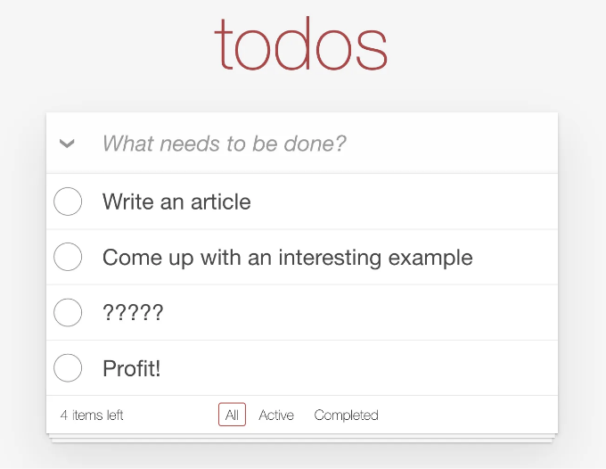
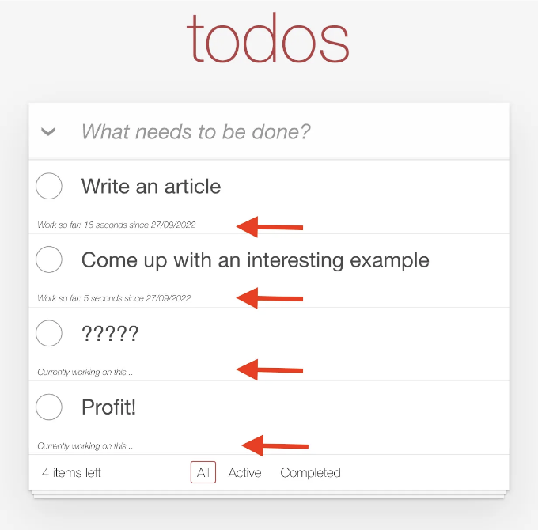
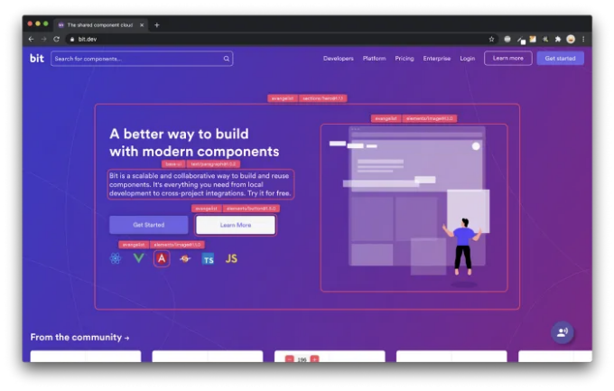

## Replicache은 웹 개발의 미래입니까? 그게 좋았나요? 함께 알아봐요!

웹 애플리케이션을 개발할 때 우리가 자주 마주하는 것은 기다리는 시간입니다.

무엇을 개발하고 있으며 클라이언트로부터 데이터를 보내는지에 따라 다릅니다. 일반적으로 데이터를 클라이언트로부터 보내면 대기해야 하며 이 대기 시간은 사용자에게 시각적인 인디케이터(진행 표시줄, 로딩 아이콘, 회전하는 바퀴 등)로 나타납니다.

<!-- ui-log 수평형 -->
<ins class="adsbygoogle"
  style="display:block"
  data-ad-client="ca-pub-4877378276818686"
  data-ad-slot="9743150776"
  data-ad-format="auto"
  data-full-width-responsive="true"></ins>
<component is="script">
(adsbygoogle = window.adsbygoogle || []).push({});
</component>

반면에 Replicache는 모든 대기 시간을 다룰 필요 없이 완전한 웹 애플리케이션을 구축할 수 있다고 주장합니다.

그것뿐만 아니라, 추가 혜택으로, Replicache 기반 애플리케이션이 다른 사용자가 하는 작업에 따라 UI가 업데이트되는 협업 활동에 적합하다고 합니다.

본문에서는 Replicache를 시도해 보고, 여러분이 다음 앱에 필요한지 여부를 스스로 판단하실 수 있도록 하겠습니다.

# Replicache란 무엇일까요?

<!-- ui-log 수평형 -->
<ins class="adsbygoogle"
  style="display:block"
  data-ad-client="ca-pub-4877378276818686"
  data-ad-slot="9743150776"
  data-ad-format="auto"
  data-full-width-responsive="true"></ins>
<component is="script">
(adsbygoogle = window.adsbygoogle || []).push({});
</component>

Replicache는 데이터 모델과 UI를 백엔드와 연결하여 데이터 트랜잭션을 처리하는 프레임워크입니다.

이 "처리"는 사용자가 취한 모든 조치 이후 UI가 벌어지는 모든 일에 완전히 인식하도록 하는 것을 의미하며, 아마도 소켓을 통해 이를 수행한다고 추측할 수밖에 없습니다.

즉, 이는 HTTP를 통해 일반적으로 할 수 있는 것보다 데이터 전송 및 업데이트를 단순화하여 훨씬 빠르게 처리합니다. 따라서 어떠한 대기 표시기가 필요 없어집니다.

새로운 레코드를 저장하는 것과 같은 동작들은 즉시 발생하며 레코드 목록을 관리하거나 새로운 레코드를 표시하는 UI가 자동으로 알림을 받습니다. 따라서 해당 업데이트를 수신해야 하는 모든 사용자가 업데이트를 받게 됩니다.

<!-- ui-log 수평형 -->
<ins class="adsbygoogle"
  style="display:block"
  data-ad-client="ca-pub-4877378276818686"
  data-ad-slot="9743150776"
  data-ad-format="auto"
  data-full-width-responsive="true"></ins>
<component is="script">
(adsbygoogle = window.adsbygoogle || []).push({});
</component>

## Replicache 사용이 얼마나 쉬운가요?

음, 이건 조금 까다로운 문제네요. 이 기사에서는 Replicache의 코드와 기존 앱에 새로운 기능을 추가하는 방법을 안내해 드릴 거에요.

그렇다고 해서 즉시 업데이트의 전제가 환상적으로 들린다고 해도, 이를 실현하기 위해서는 일반 웹 앱에는 없는 인프라가 필요하달까요. 이 말은 즉, Replicache를 기존 애플리케이션에 통합하고 싶다고 생각한다면, 비즈니스 로직을 전부 리팩토링해야 한다는 얘기죠.

반면에, 처음부터 시작하려는 것이라면, 그들의 템플릿 중 하나로 시작하는 것이 좋은 아이디어일 수도 있어요.

<!-- ui-log 수평형 -->
<ins class="adsbygoogle"
  style="display:block"
  data-ad-client="ca-pub-4877378276818686"
  data-ad-slot="9743150776"
  data-ad-format="auto"
  data-full-width-responsive="true"></ins>
<component is="script">
(adsbygoogle = window.adsbygoogle || []).push({});
</component>

그러면 기본 인프라가 갖추어지니, 이후 어떤 방향으로 앱을 성장시키든 원하는 대로 할 수 있게 될 거에요.

곧 알게 되겠지만, 트랜잭션과 뮤테이터의 개념을 논리에 통합해야 하고, 이미 이에 대해 다뤄보지 않았다면, 백엔드 코드에 영향을 줄 수 있어요.

기존 Replicache 기반 애플리케이션에 새로운 기능을 추가하는 것이 어떨지 살펴봐요.

# Replicache로 시작하기

<!-- ui-log 수평형 -->
<ins class="adsbygoogle"
  style="display:block"
  data-ad-client="ca-pub-4877378276818686"
  data-ad-slot="9743150776"
  data-ad-format="auto"
  data-full-width-responsive="true"></ins>
<component is="script">
(adsbygoogle = window.adsbygoogle || []).push({});
</component>

이 예제에서는 사전 빌드된 할 일 앱을 사용할 것이고, 그를 위해 필요한 것은 다음 한 줄의 코드뿐입니다: npx degit rocicorp/replicache-todo my-todo-app

폴더가 생성되고 파일이 준비되면, 다음 단계는 새 폴더 내에서 기존의 npm install을 사용하여 종속성을 설치하는 것입니다.

표준 단계를 완료했다면, 다음 단계는 라이센스 키를 가져오는 것입니다. 걱정하지 마세요. 사이트를 통해 가입하거나 무언가를 해야하는 건 아닙니다. 아주 큰 회사를 위한 대규모 앱을 만들려는 게 아니라면, 무료로 Replicache를 사용할 수 있습니다.

우리의 경우, 다음 명령을 실행하기만 하면 됩니다: npx replicache get-license

<!-- ui-log 수평형 -->
<ins class="adsbygoogle"
  style="display:block"
  data-ad-client="ca-pub-4877378276818686"
  data-ad-slot="9743150776"
  data-ad-format="auto"
  data-full-width-responsive="true"></ins>
<component is="script">
(adsbygoogle = window.adsbygoogle || []).push({});
</component>

해당 명령을 실행하면 이름, 회사 이름 및 이메일과 같은 몇 가지 질문을 하게 될 거예요. 그리고 결과적으로 실제 라이선스 키를 받게 될 거에요.

이 값을 NEXT_PUBLIC_REPLICACHE_LICENSE_KEY 라는 환경 변수로 내보내셔야 해요. 앱을 시작하기 전에 export 명령을 사용하여 이 값을 내보낼 수도 있고, 또는 앱의 루트에 .env 파일을 만들어 Next가 이를 읽도록 할 수도 있어요 (기본적으로 이를 읽어들입니다).

지금까지 다음과 같이 보이는 작동하는 할 일 앱이 준비되었어요:

<!-- ui-log 수평형 -->
<ins class="adsbygoogle"
  style="display:block"
  data-ad-client="ca-pub-4877378276818686"
  data-ad-slot="9743150776"
  data-ad-format="auto"
  data-full-width-responsive="true"></ins>
<component is="script">
(adsbygoogle = window.adsbygoogle || []).push({});
</component>

이 앱을 사용하면 다음을 할 수 있어요:

- 새로운 작업 만들기
- "완료"로 표시하기
- 그리고 작업 삭제하기

또한 상태별로 필터링할 수도 있어요. 그렇다면, 한 가지 작업에 얼마나 시간을 썼는지 추적하는 기능도 추가할 예정이에요.

최종 결과물은 다음과 같을 거예요:

<!-- ui-log 수평형 -->
<ins class="adsbygoogle"
  style="display:block"
  data-ad-client="ca-pub-4877378276818686"
  data-ad-slot="9743150776"
  data-ad-format="auto"
  data-full-width-responsive="true"></ins>
<component is="script">
(adsbygoogle = window.adsbygoogle || []).push({});
</component>

그럼 코딩해 볼까요?

## 데이터 모델 업데이트

첫 번째로 할 일은 데이터 모델을 업데이트하는 것입니다. TypeScript를 사용하는 앱이기도 하고, 이제 SQL 데이터베이스를 다루는 것처럼 생각해야 하기 때문입니다. 모델 구조를 변경하려면 모델 정의를 업데이트해야 합니다. 데이터를 다루는 모든 작업을 할 때마다 해당 작업을 트랜잭션으로 둘러싸야 하기 때문입니다.

<!-- ui-log 수평형 -->
<ins class="adsbygoogle"
  style="display:block"
  data-ad-client="ca-pub-4877378276818686"
  data-ad-slot="9743150776"
  data-ad-format="auto"
  data-full-width-responsive="true"></ins>
<component is="script">
(adsbygoogle = window.adsbygoogle || []).push({});
</component>

우리가 변경하려는 모델은 src/todo.ts 파일에 있습니다. 그리고 기본적으로 두 가지 유형이 정의되어 있습니다: Todo 및 TodoUpdate

작업에 소요된 시간을 기록하기 위해 작업을 시작하고 일시 중지하는 모든 시간을 기록해야 합니다. UI에서는 추가할 Play/Pause 버튼을 통해 이 작업을 수행할 수 있지만, 데이터 모델은 현재 이를 지원하지 않습니다.

따라서 Todo 유형을 수정하여 시작/일시 중지 이벤트 목록을 추가해야 합니다. 또한 위의 스크린샷에 표시된 "...부터..." 부분을 활성화하기 위해 처음 작업 이벤트를 나타내는 필드를 추가할 것입니다.

이 모든 것을 고려하면, 새 데이터 모델은 다음과 같이 보입니다:

<!-- ui-log 수평형 -->
<ins class="adsbygoogle"
  style="display:block"
  data-ad-client="ca-pub-4877378276818686"
  data-ad-slot="9743150776"
  data-ad-format="auto"
  data-full-width-responsive="true"></ins>
<component is="script">
(adsbygoogle = window.adsbygoogle || []).push({});
</component>

할 일 유형에 추가한 내용은 다음과 같습니다:

- workingOnIt은 이 작업을 진행 중인지 여부를 빠르게 이해하기 위해 사용할 불리언 속성입니다.
- workingWindows는 이전에 언급한 시작/일시정지 이벤트 목록이 될 것입니다.
- startedOn은 이 작업을 처음으로 시작한 시간을 가지고 있을 것입니다.
- currentWorkingOn은 현재 작업 창의 시작 타임스탬프를 포함할 것입니다. 다시 일시정지하면 이 값을 새 창의 init 속성으로 사용할 것입니다.

물론, WorkingWindow 유형은 특정 작업 기간의 시작과 종료 타임스탬프만 포함하게 됩니다.

이제 일 처리 관련 UI 변경 사항을 구현해야 할 차례입니다.

<!-- ui-log 수평형 -->
<ins class="adsbygoogle"
  style="display:block"
  data-ad-client="ca-pub-4877378276818686"
  data-ad-slot="9743150776"
  data-ad-format="auto"
  data-full-width-responsive="true"></ins>
<component is="script">
(adsbygoogle = window.adsbygoogle || []).push({});
</component>

텍스트를 좋아하셨나요? IT 산업에서 20년 동안의 지혜를 모두와 함께 공유하는 무료 뉴스레터에 가입해보세요. "The Rambling of an old developer"에 가입하세요!

# UI 업데이트

구현할 실제 로직에 대해 들어가기 전에, 우리의 로직에서 정확히 필요한 것을 결정할 UI를 살펴봅시다.

이미지를 통해 UI가 어떻게 변화하는지 보여드립니다. 우리는 각 작업 아래에 메시지를 추가해야 하지만, "X" 옆에 "재생" 및 "일시정지" 버튼도 추가해야 합니다.

<!-- ui-log 수평형 -->
<ins class="adsbygoogle"
  style="display:block"
  data-ad-client="ca-pub-4877378276818686"
  data-ad-slot="9743150776"
  data-ad-format="auto"
  data-full-width-responsive="true"></ins>
<component is="script">
(adsbygoogle = window.adsbygoogle || []).push({});
</component>

모든 작업은 src/components/todo-item.tsx 파일에서 이루어질 것입니다. 이 파일의 전체 소스 코드를 보려면 여기를 클릭하세요. 다음에는 필요한 코드가 포함된 추출물이 있습니다:

10번째 줄을 보면, 새로운 "재생/일시정지" 버튼은 workingOnIt 속성을 사용하여 사용할 클래스를 결정합니다.

그리고 13번째 줄에서는 workingOnIt 플래그가 true 또는 false로 설정되어 있는지에 따라 메시지를 추가합니다.

이제 더 많은 함수가 추가되었습니다: workingTime 및 toggleWorkingOnIt. 첫 번째 함수는 간단히 작업의 workingWindows를 반복하고 init과 end 사이의 시간 차이를 더합니다. 이것은 순수 VanillaJS이며 전체 소스 코드를 여기에서 읽을 수 있습니다.

<!-- ui-log 수평형 -->
<ins class="adsbygoogle"
  style="display:block"
  data-ad-client="ca-pub-4877378276818686"
  data-ad-slot="9743150776"
  data-ad-format="auto"
  data-full-width-responsive="true"></ins>
<component is="script">
(adsbygoogle = window.adsbygoogle || []).push({});
</component>

하지만 중요한 건 토글 기능입니다. 왜냐하면 이 기능은 데이터를 업데이트하기 때문에 Replicache와 상호 작용합니다.

요렇게 생겼어요:

그게 다에요. 한 줄 뿐이에요. onWorkingOnIt 함수를 호출하고, 업데이트하려는 속성을 포함하는 객체를 전달해요.

그런데, onWorkingOnIt 함수는 어디서 온 걸까요?

<!-- ui-log 수평형 -->
<ins class="adsbygoogle"
  style="display:block"
  data-ad-client="ca-pub-4877378276818686"
  data-ad-slot="9743150776"
  data-ad-format="auto"
  data-full-width-responsive="true"></ins>
<component is="script">
(adsbygoogle = window.adsbygoogle || []).push({});
</component>

비즈니스 로직을 살펴보겠습니다.

## Replicache를 기반으로 한 로직 작성

onWorkingOnIt이라는 함수는 우리 컴포넌트의 프롭으로 받게 되는데, 이 프롭은 src/app.tsx 파일에서 전달됩니다. 해당 파일에서는 몇 가지 함수를 정의하고 이후에 컴포넌트 트리를 통해 전달됩니다.

그러니까, 이 함수가 어떻게 생겼는지 살펴보죠:

<!-- ui-log 수평형 -->
<ins class="adsbygoogle"
  style="display:block"
  data-ad-client="ca-pub-4877378276818686"
  data-ad-slot="9743150776"
  data-ad-format="auto"
  data-full-width-responsive="true"></ins>
<component is="script">
(adsbygoogle = window.adsbygoogle || []).push({});
</component>

항상 전체 소스 코드를 여기에서 확인할 수 있어요.

이 함수는 두 가지 중 하나를 할 수 있어요: 작업을 시작하거나 작업을 일시 중지할 수 있어요.

만약 작업을 시작한다면, 먼저 startedOn 속성이 설정되어 있는지 확인할 거예요. 설정되어 있지 않다면, 설정하고 넘어갈 거예요. 저는 isStarted 뮤테이터 메서드를 호출했어요. 다음에 메서드들을 자세히 살펴볼 테지만, 데이터를 쿼리하는 메서드라는 것만 알아두세요.

작업 중인 task의 currentWorkingOn 속성에 현재 타임스탬프를 저장하고 있어요. 그 값은 나중에 작업을 중지할 때 사용될 거예요.

<!-- ui-log 수평형 -->
<ins class="adsbygoogle"
  style="display:block"
  data-ad-client="ca-pub-4877378276818686"
  data-ad-slot="9743150776"
  data-ad-format="auto"
  data-full-width-responsive="true"></ins>
<component is="script">
(adsbygoogle = window.adsbygoogle || []).push({});
</component>

이제 작업을 일시 중단하면 어떻게 될까요? 이전에 현재 작업 중이었던 값으로 새로운 작업 창을 만들어야 하며, 작업 창 목록에 추가해야 합니다.

문제는 무엇인가요? 우리가 가진 토글 함수는 그 정보를 받지 않기 때문에 대신 데이터를 질의해야 합니다. 11번째와 12번째 줄이 그 역할을 합니다.

마지막으로 우리는 updateTodo를 호출하여 19번째 줄에서 데이터를 업데이트합니다.

## Mutators 작성

<!-- ui-log 수평형 -->
<ins class="adsbygoogle"
  style="display:block"
  data-ad-client="ca-pub-4877378276818686"
  data-ad-slot="9743150776"
  data-ad-format="auto"
  data-full-width-responsive="true"></ins>
<component is="script">
(adsbygoogle = window.adsbygoogle || []).push({});
</component>

토글 함수가 모든 흥미로운 일을 처리하지만, 데이터 저장 레이어와 상호 작용해야 할 때 Replicache의 마법을 처리해야 합니다.

우리는 뮤테이터 함수를 통해 그것을 수행하며, 이 함수들은 모두 src/mutators.ts 파일 안에 위치해 있어요.

내 경우에는 다음과 같은 3개의 새로운 읽기 전용 함수를 추가하고 있어요:

이들은 거의 동일한 일을 합니다. tx.get 메서드를 통해 실제 Todo를 가져와 필요한 속성을 반환합니다. 나머지 뮤테이터 함수들을 여기서 확인할 수 있어요.

<!-- ui-log 수평형 -->
<ins class="adsbygoogle"
  style="display:block"
  data-ad-client="ca-pub-4877378276818686"
  data-ad-slot="9743150776"
  data-ad-format="auto"
  data-full-width-responsive="true"></ins>
<component is="script">
(adsbygoogle = window.adsbygoogle || []).push({});
</component>

데이터를 조회하거나 업데이트해야 한다면 여기에서 뮤테이터를 정의해야 합니다.

그리고 최종 결과는 다음과 같습니다:

예제에서 일부 부분을 건너 뛴 것처럼 보일 수 있지만 실제로 그렇지 않습니다. Replicache를 사용한 작동하는 애플리케이션을 한 번 만들면 이 예제의 Todo 앱처럼 더 많은 논리를 추가하는 것은 매우 쉽습니다!

<!-- ui-log 수평형 -->
<ins class="adsbygoogle"
  style="display:block"
  data-ad-client="ca-pub-4877378276818686"
  data-ad-slot="9743150776"
  data-ad-format="auto"
  data-full-width-responsive="true"></ins>
<component is="script">
(adsbygoogle = window.adsbygoogle || []).push({});
</component>

그리고 결과는 놀랍군요.

어떻게 생각하셨나요? 다음 앱에서 시도해 보실 건가요?

# 레고처럼 재사용 가능한 컴포넌트로 앱 개발하기

<!-- ui-log 수평형 -->
<ins class="adsbygoogle"
  style="display:block"
  data-ad-client="ca-pub-4877378276818686"
  data-ad-slot="9743150776"
  data-ad-format="auto"
  data-full-width-responsive="true"></ins>
<component is="script">
(adsbygoogle = window.adsbygoogle || []).push({});
</component>

Bit의 오픈 소스 도구는 25만 명 이상의 개발자들이 컴포넌트를 사용하여 앱을 만들 수 있게 도와줍니다.

아무 UI, 기능 또는 페이지를 재사용 가능한 컴포넌트로 변환하고 애플리케이션 간에 공유하세요. 협업이 쉬워지고 더 빠르게 빌드할 수 있습니다.

→ 더 알아보기

앱을 컴포넌트로 분할하여 앱 개발을 더 쉽게 만들고, 원하는 워크플로에 대한 최상의 경험을 즐기세요.

<!-- ui-log 수평형 -->
<ins class="adsbygoogle"
  style="display:block"
  data-ad-client="ca-pub-4877378276818686"
  data-ad-slot="9743150776"
  data-ad-format="auto"
  data-full-width-responsive="true"></ins>
<component is="script">
(adsbygoogle = window.adsbygoogle || []).push({});
</component>

## → 마이크로 프론트엔드

## → 디자인 시스템

## → 코드 공유 및 재사용

## → 모노 레포

<!-- ui-log 수평형 -->
<ins class="adsbygoogle"
  style="display:block"
  data-ad-client="ca-pub-4877378276818686"
  data-ad-slot="9743150776"
  data-ad-format="auto"
  data-full-width-responsive="true"></ins>
<component is="script">
(adsbygoogle = window.adsbygoogle || []).push({});
</component>

# 더 알아보기