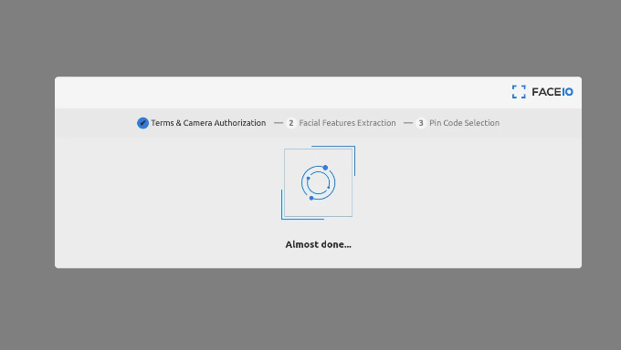
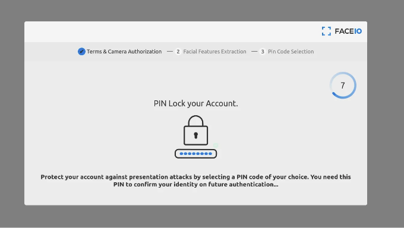
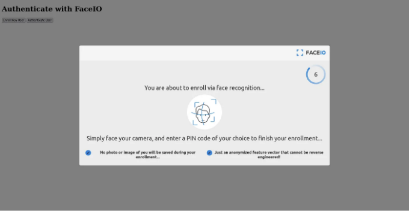

## 얼굴 승인 기능으로 앱 보안 강화하기


인증은 웹사이트에서 가장 중요한 부분입니다. 올바르게 처리되지 않으면 상상할 수 없는 상황에 이를 수 있습니다. 최근 기술 발전으로 인해 가장 효율적인 웹 애플리케이션을 구축하기 위해 다양한 기술 스택과 프레임워크가 만들어졌습니다. 그러나 개발자들은 인증 시스템을 개선하거나 웹 인증 도메인에서 새롭고 혁신적인 것을 구축하는 데 매우 적은 관심을 기울입니다.

인공지능 및 기계 학습 기술의 발전으로 얼굴 인식이 쉽게 구현되고 매우 신뢰할 수 있어졌습니다. 요즘 대부분의 스마트폰은 기기 잠금을 해제하기 위해 광학 기반 얼굴 인식 기술을 사용합니다. 그러나 웹 개발 분야에서는 사용자를 인증할 수단으로 얼굴 인식을 채택하는 것을 볼 수 없습니다.

<!-- ui-log 수평형 -->
<ins class="adsbygoogle"
  style="display:block"
  data-ad-client="ca-pub-4877378276818686"
  data-ad-slot="9743150776"
  data-ad-format="auto"
  data-full-width-responsive="true"></ins>
<component is="script">
(adsbygoogle = window.adsbygoogle || []).push({});
</component>

이 글에서는 전통적인 인증 시스템의 문제점, 이 문제를 얼굴 인식을 활용해 해결하는 방법 및 ReactJS와 TailwindCSS를 사용하여 동일한 시스템을 구현하는 단계별 가이드에 대해 논의하고 있어요.

# 현재 인증 시스템의 문제점

현재 이메일 및 비밀번호 기반의 인증이 웹에서 가장 인기 있는 방법입니다. 그러나 이 시스템의 주요 단점은 각 웹 사이트별로 고유한 비밀번호를 기억해야 한다는 점이에요. 비밀번호를 잊어버리면 비밀번호 재설정을 위해 이메일 주소가 필요합니다. 이메일을 잃어버리면 계정을 복구하는 것이 거의 불가능해요.

모든 이러한 문제를 해결하기 위해 oAuth가 등장했습니다. oAuth는 oAuth 제공 업체를 사용하여 웹 사이트에 가입하는 프로토콜이에요. 여러 웹사이트에서 'Google', 'Facebook', 'GitHub' 등을 통해 로그인할 수 있는 옵션을 볼 수 있어요. 이것이 oAuth의 예시에요. 사용자로서, 당신은 하나의 계정만 관리하고 다른 웹사이트에서 정보를 사용할 권한을 부여할 수 있습니다. 개발자로서, 당신은 oAuth 제공 업체가 올바른 정보를 제공할 것이라고 믿어야 합니다.

<!-- ui-log 수평형 -->
<ins class="adsbygoogle"
  style="display:block"
  data-ad-client="ca-pub-4877378276818686"
  data-ad-slot="9743150776"
  data-ad-format="auto"
  data-full-width-responsive="true"></ins>
<component is="script">
(adsbygoogle = window.adsbygoogle || []).push({});
</component>

최근에는 비밀번호 없는 로그인 또는 매직 링크 인증이 매우 인기가 있습니다. 이 시스템에서는 웹 사이트에 이메일 주소를 입력해야 합니다. 그런 다음 로그인 링크가 포함된 이메일을 받게 됩니다. 이 링크를 클릭하면 해당 웹 사이트에서 인증되어 가입됩니다. 이는 로그인하기 매우 쉬운 시스템으로, 비밀번호를 기억할 필요가 없습니다.

위의 모든 예제에서 익숙한 패턴을 찾을 수 있습니다. 모든 이러한 인증 프로세스에서 이메일이 필요합니다. 위 시스템 모두에서 이메일이 매우 중요하며, 이메일을 어떤 방식으로든 잃게 되면 모든 계정을 컨트롤할 수 없게 됩니다. 이것은 인증 시스템에서의 주요 문제입니다. 하지만 문제에는 해결책이 있듯, 이 문제에도 일부 해결책이 있습니다. 다음 섹션에서 이에 대해 논의해 보겠습니다.

# 얼굴 인증이 문제를 해결하는 방법

인증 스택에서 이메일을 제거하기 위해 지문 인증 및 얼굴 인식과 같은 옵션이 있습니다.

<!-- ui-log 수평형 -->
<ins class="adsbygoogle"
  style="display:block"
  data-ad-client="ca-pub-4877378276818686"
  data-ad-slot="9743150776"
  data-ad-format="auto"
  data-full-width-responsive="true"></ins>
<component is="script">
(adsbygoogle = window.adsbygoogle || []).push({});
</component>

지문 인증의 문제는 특수 하드웨어가 필요하다는 것입니다. 대부분의 컴퓨터 하드웨어에는 지문 판독기가 기본으로 탑재되어 있지 않습니다. 디바이스 지문 판독기와 상호작용하기 위한 웹의 네이티브 표준 API가 없기 때문에, 지문 인증이 가까운 미래에 실현 가능할 것으로 보입니다.

인공지능과 기계학습의 신속한 발전으로 얼굴 인식은 그리 어렵지 않습니다. 오픈소스 기계학습 라이브러리의 존재로 개발자들은 웹 애플리케이션에 기능적인 AI를 빠르게 개발할 수 있습니다.

하지만 이를 위해서는 기계 학습에 대한 몇몇 경험이 필요합니다. 이러한 경험이 없다면, faceIO와 같은 기계 학습 SaaS를 사용하여 웹사이트를 위한 얼굴 인식 인증 시스템을 쉽게 만들 수 있습니다.

이 튜토리얼에서는 FaceIO 라이브러리를 사용하여 웹 애플리케이션에서 얼굴 인증을 실습합니다. 따라서 따라오려면 FaceIO의 무료 계정을 만드세요.

<!-- ui-log 수평형 -->
<ins class="adsbygoogle"
  style="display:block"
  data-ad-client="ca-pub-4877378276818686"
  data-ad-slot="9743150776"
  data-ad-format="auto"
  data-full-width-responsive="true"></ins>
<component is="script">
(adsbygoogle = window.adsbygoogle || []).push({});
</component>

# 테일윈드 CSS를 사용한 Reactjs 프로젝트 생성하기

이 튜토리얼에서는 vite를 사용하여 ReactJs 프로젝트를 생성합니다. 터미널을 열고 다음 명령을 실행하여 vite를 사용하여 React 프로젝트를 스캐폴딩하십시오.

```js
npm create vite@latest my-project — — template react
```

이제 터미널 프롬프트를 따라 프로젝트를 스캐폴드하십시오. 이 단계를 완료한 후, 즐겨 사용하는 코드 편집기에서이 프로젝트를 엽니다. 프로젝트 구조는 다음과 같아야합니다.

<!-- ui-log 수평형 -->
<ins class="adsbygoogle"
  style="display:block"
  data-ad-client="ca-pub-4877378276818686"
  data-ad-slot="9743150776"
  data-ad-format="auto"
  data-full-width-responsive="true"></ins>
<component is="script">
(adsbygoogle = window.adsbygoogle || []).push({});
</component>

```js
.
├── index.html
├── package.json
├── package-lock.json
├── public
│ └── vite.svg
├── src
│ ├── App.css
│ ├── App.jsx
│ ├── assets
│ │ └── react.svg
│ └── main.jsx
└── vite.config.js
```

이제, vite 프로젝트에서 Tailwind CSS를 설치하려면 다음 단계를 주의 깊게 따라주세요.

```js
npm install -D tailwindcss postcss autoprefixer
npx tailwindcss init -p
```

이제 tailwind.config.cjs 파일을 열고 프로젝트 소스 경로를 추가하세요.

<!-- ui-log 수평형 -->
<ins class="adsbygoogle"
  style="display:block"
  data-ad-client="ca-pub-4877378276818686"
  data-ad-slot="9743150776"
  data-ad-format="auto"
  data-full-width-responsive="true"></ins>
<component is="script">
(adsbygoogle = window.adsbygoogle || []).push({});
</component>

src/App.css 파일 내에 tailwind CSS 지시문을 추가하세요.

이제 React 및 vite 프로젝트에 tailwind CSS를 성공적으로 설치했습니다. 다음 섹션에서 프로젝트에 얼굴 인증을 통합하는 방법에 중점을 두겠습니다.

# React 애플리케이션에 FaceIO 인증 추가

FaceIO의 멋진 점은 매우 쉽게 사용할 수 있는 JavaScript 라이브러리를 제공한다는 것입니다. 이 라이브러리에는 등록(enroll) 및 인증(authenticate)이라는 두 가지 주요 함수가 포함되어 있습니다. 그러나 이러한 함수에 대해 논의하기 전에 먼저 FaceIO 라이브러리를 React 애플리케이션에 링크해야 합니다.

<!-- ui-log 수평형 -->
<ins class="adsbygoogle"
  style="display:block"
  data-ad-client="ca-pub-4877378276818686"
  data-ad-slot="9743150776"
  data-ad-format="auto"
  data-full-width-responsive="true"></ins>
<component is="script">
(adsbygoogle = window.adsbygoogle || []).push({});
</component>

프로젝트의 index.html 파일을 열고 FaceIO CDN을 프로젝트에 링크하세요.

FaceIO CDN을 성공적으로 연결한 후에는 App.jsx 파일을 열어서 App 컴포넌트 내의 모든 보일러플레이트 코드를 삭제하세요. 우리의 FaceIO 라이브러리를 초기화하기 위해 useEffect 리액트 후크를 추가합니다. 이 후크 내부의 코드는 컴포넌트가 초기화될 때 한 번만 실행됩니다.

faceIO 객체를 인스턴스화할 때 ID를 인수로 사용하는 것을 보실 수 있습니다. FaceIO 계정을 등록하면 해당 ID에 액세스할 수 있습니다.

모든 설정이 완료되었으니 이제 FaceIO를 사용하여 사용자를 인증하는 데 집중해봅시다.

<!-- ui-log 수평형 -->
<ins class="adsbygoogle"
  style="display:block"
  data-ad-client="ca-pub-4877378276818686"
  data-ad-slot="9743150776"
  data-ad-format="auto"
  data-full-width-responsive="true"></ins>
<component is="script">
(adsbygoogle = window.adsbygoogle || []).push({});
</component>

## FaceIO를 사용하여 새 사용자 등록하기

FaceIO는 새 사용자를 등록하는 매우 간단한 인터페이스를 제공합니다. 새 사용자를 등록하려면 enroll 함수를 사용합니다. FaceIO는 웹캠 권한이 필요하므로 권한 대화 상자가 나타날 때 권한을 수락해야 합니다.

enroll 함수에는 2개의 별칭이 있습니다. enroll 대신 register 및 record 함수를 사용하여 대체할 수 있습니다.

이 함수를 브라우저에서 실행하면 faceIO 위젯이 시작됩니다. 처음에는 사용자의 얼굴을 스캔하는 데 동의를 요청하고, 그런 다음 웹캠 권한을 수락하도록 요청합니다. 모든 요구 사항이 충족되면 faceIO 위젯이 카메라를 열고 얼굴을 스캔합니다. 이렇게 하여 얼굴 데이터가 부동 소수점 수의 배열로 변환됩니다.

<!-- ui-log 수평형 -->
<ins class="adsbygoogle"
  style="display:block"
  data-ad-client="ca-pub-4877378276818686"
  data-ad-slot="9743150776"
  data-ad-format="auto"
  data-full-width-responsive="true"></ins>
<component is="script">
(adsbygoogle = window.adsbygoogle || []).push({});
</component>



얼굴 데이터를 수집한 후, faceIO에서 PIN 코드를 입력하도록 하고 있습니다. 이 PIN 코드는 얼굴이 매우 유사한 사용자를 구별하는 데 사용됩니다. 이는 무언가 문제가 발생했을 때 두 단계 인증으로 생각할 수 있습니다.



이제 react 애플리케이션에 faceIO 등록을 추가해봅시다. 우리는 앱을 매우 간단하게 유지합니다. 따라서 'register'라는 버튼을 만들어서 누군가 그 버튼을 클릭하면, enroll 함수를 실행하여 새 사용자를 등록합니다.

<!-- ui-log 수평형 -->
<ins class="adsbygoogle"
  style="display:block"
  data-ad-client="ca-pub-4877378276818686"
  data-ad-slot="9743150776"
  data-ad-format="auto"
  data-full-width-responsive="true"></ins>
<component is="script">
(adsbygoogle = window.adsbygoogle || []).push({});
</component>

레지스터 버튼을 추가하고 버튼 클릭 시 자바스크립트 핸들러를 추가한 후 App.jsx 파일은 다음과 같이 보입니다.

위 코드에서 코드를 try-catch 블록으로 래핑했음을 볼 수 있습니다. 무언가 잘못된 경우, FaceIO에서 오류를 throw합니다. 오류 메시지는 매우 유용하며 공식 문서에서 오류 코드의 완전한 목록을 얻을 수 있습니다.

enroll 함수는 선택적 매개변수 객체만 허용합니다. 이 선택적 매개변수는 사용자 등록 프로세스를 구성하는 속성을 허용합니다. 위 예시에서, 저는 enrolling 함수의 선택적 매개변수 내부에 locale 및 payload 속성을 정의했습니다. locale 속성은 사용자의 기본 상호작용 언어를 나타냅니다. 여기서는 언어를 자동으로 감지하기 위해 auto를 제공합니다.

payload 내부에서 사용자의 JSON 직렬화 가능한 고유 값도 추가할 수 있습니다. 이 예시에서는 사용자의 이메일을 payload로 추가했습니다. 나중에 사용자가 로그인할 때, FaceIO 반환 객체에서 이메일 payload에 액세스할 수 있습니다.

<!-- ui-log 수평형 -->
<ins class="adsbygoogle"
  style="display:block"
  data-ad-client="ca-pub-4877378276818686"
  data-ad-slot="9743150776"
  data-ad-format="auto"
  data-full-width-responsive="true"></ins>
<component is="script">
(adsbygoogle = window.adsbygoogle || []).push({});
</component>

FaceIO의 Enroll 함수는 프로미스를 반환합니다. 따라서 예제에서는 자바스크립트의 async/await 기능을 사용하고 있습니다. async/await를 선호하지 않는 경우 .then을 대신 사용할 수도 있습니다.

프로미스가 완료되면 userInfo 객체가 반환됩니다. 이 객체를 사용하여 사용자의 고유 얼굴 ID에 액세스할 수 있습니다. 또한 userInfo 객체는 사용자의 가능한 나이와 성별을 얻을 수 있는 details 속성도 제공합니다.

# FaceIO를 사용하여 등록된 사용자 인증하기

사용자를 성공적으로 등록한 후에는 등록된 사용자를 인증하는 시간입니다. 이를 위해 Pixlab은 authenticate 함수를 제공합니다. 이 authenticate 함수는 auth, recognize 및 identify 3가지 별칭도 가지고 있습니다.

<!-- ui-log 수평형 -->
<ins class="adsbygoogle"
  style="display:block"
  data-ad-client="ca-pub-4877378276818686"
  data-ad-slot="9743150776"
  data-ad-format="auto"
  data-full-width-responsive="true"></ins>
<component is="script">
(adsbygoogle = window.adsbygoogle || []).push({});
</component>

인증 기능은 사용자가 인식할 수있는 단일 프레임만 필요합니다. 따라서 대역폭을 매우 효율적으로 사용합니다. 성공적으로 인증되면 userData 객체가 반환됩니다. 이 userData에는 등록 시 지정한 페이로드와 사용자의 얼굴이 포함되어 있습니다.



App.jsx 파일 안에서 우리는 Log-in이라는 또 다른 버튼을 만듭니다. 사용자가이 버튼을 클릭하면 handleLogIn 도우미 함수를 호출합니다. 이 기능은 궁극적으로 "authenticate" 함수를 호출하는 것에 책임이 있습니다. 이것들을 모두 코드로 살펴봅시다.

handleLogIn 함수 내에서 try-catch 블록을 사용하여 인증이 실패할 경우 오류를 잡습니다. 인증 함수가 프라미스를 반환하기 때문에 프라미스가 완료되면 값을 얻기 위해 async-await 방법을 사용했습니다.

<!-- ui-log 수평형 -->
<ins class="adsbygoogle"
  style="display:block"
  data-ad-client="ca-pub-4877378276818686"
  data-ad-slot="9743150776"
  data-ad-format="auto"
  data-full-width-responsive="true"></ins>
<component is="script">
(adsbygoogle = window.adsbygoogle || []).push({});
</component>

인증 함수는 faceIO 인증 위젯을 사용자 정의하기 위해 일부 선택적 매개변수를 받습니다. 주로 권한 시간 초과, idleTimeout 및 replyTimeout 매개변수를 사용하여 시간 초과를 사용자 정의할 수 있습니다. 컴파일이 완료된 후에는 우리의 웹 애플리케이션이 이렇게 보일 것입니다.

# FaceIO REST API

FaceIO에 계정을 만들 때 API 키가 할당됩니다. 이 API 키는 faceIO 콘솔에서 찾을 수 있습니다. 이 API 키를 사용하여 페이스IO 백엔드와 RESTful API를 통해 상호 작용할 수 있습니다. REST API의 기본 URL은 `https://api.faceio.net/`입니다.

현재 FaceIO REST API는 3가지 기능을 지원합니다. 사용자의 얼굴 삭제, 얼굴 ID에 추가 페이로드 설정하기 및 얼굴 ID에 핀 코드 설정하기입니다. 이러한 API 엔드포인트를 안전한 환경이나 백엔드 서버에서 사용하도록 하십시오. 이러한 API를 클라이언트 측에서 실행하지 마십시오.

<!-- ui-log 수평형 -->
<ins class="adsbygoogle"
  style="display:block"
  data-ad-client="ca-pub-4877378276818686"
  data-ad-slot="9743150776"
  data-ad-format="auto"
  data-full-width-responsive="true"></ins>
<component is="script">
(adsbygoogle = window.adsbygoogle || []).push({});
</component>

## 얼굴 ID 삭제하기

얼굴 ID를 삭제하려면 https://api.faceio.net/deletefacialid 엔드포인트로 GET 요청을 보내어야 합니다. 이 엔드포인트에는 두 개의 요청 매개변수가 있습니다. 하나는 API 키를 받아들이는 key이고, 다른 하나는 삭제하려는 얼굴 ID를 받아들이는 fid입니다.

```js
curl — request GET \
— url 'https://api.faceio.net/deletefacialid?key=APIkey&fid=FaceID'
```

FaceIO는 응답으로 상태 코드와 삭제된 데이터와 함께 페이로드가 성공적으로 삭제되었는지를 알려주는 `payload` 부울 값을 반환합니다.

<!-- ui-log 수평형 -->
<ins class="adsbygoogle"
  style="display:block"
  data-ad-client="ca-pub-4877378276818686"
  data-ad-slot="9743150776"
  data-ad-format="auto"
  data-full-width-responsive="true"></ins>
<component is="script">
(adsbygoogle = window.adsbygoogle || []).push({});
</component>

## 페이로드를 FaceID로 설정하기

이 API 엔드포인트를 사용하여 기존의 FaceID에 페이로드를 설정할 수 있습니다. 요청된 URL은 https://api.faceio.net/setfacialidpayload 입니다. 이 엔드포인트는 3개의 요청 매개변수가 필요합니다. 키는 API 키이고, fid는 페이셜 ID이며 해당 ID에 페이로드를 첨부하려는 것입니다. 페이로드는 사용자 정의 페이로드 데이터를 정의하는 데 사용됩니다.

```js
curl — request POST \
— url 'https://api.faceio.net/setfacialidpayload?key=APIkey&fid=FaceID&payload=%22name%3AHrishikesh%22'
```

응답으로, FaceIO는 상태 코드 및 페이로드 부울을 반환하는데, 이는 페이로드와 함께 데이터가 성공적으로 삭제되었는지 여부를 알려줍니다.

<!-- ui-log 수평형 -->
<ins class="adsbygoogle"
  style="display:block"
  data-ad-client="ca-pub-4877378276818686"
  data-ad-slot="9743150776"
  data-ad-format="auto"
  data-full-width-responsive="true"></ins>
<component is="script">
(adsbygoogle = window.adsbygoogle || []).push({});
</component>

## 핀 코드를 얼굴ID로 설정하기

얼굴ID 등록 단계에서는 두 개의 매우 비슷한 얼굴을 구별하기 위해 핀 코드가 필요하다고 이야기했습니다. 만약 핀 코드를 수정하고 싶다면, https://api.faceio.net/setfacialidpincode 엔드포인트를 사용하여 간단히 변경할 수 있습니다.

이전 엔드포인트와 마찬가지로, 3개의 매개변수가 필요합니다. 하나는 API 키이고, 다음으로는 얼굴ID, 마지막으로 핀 코드입니다. 엔드포인트로의 curl 요청은 아래와 같습니다.

```js
curl — request POST \
— url 'https://api.faceio.net/setfacialidpincode?key=APIkey&fid=FaceID&pin=12345'
```

<!-- ui-log 수평형 -->
<ins class="adsbygoogle"
  style="display:block"
  data-ad-client="ca-pub-4877378276818686"
  data-ad-slot="9743150776"
  data-ad-format="auto"
  data-full-width-responsive="true"></ins>
<component is="script">
(adsbygoogle = window.adsbygoogle || []).push({});
</component>

# FaceIO 웹훅

웹훅은 서버 간의 통신 방법으로 사용됩니다. FaceIO는 백엔드 서버를 업데이트하는 데 사용할 수 있는 풍부한 웹훅 경험을 제공합니다. FaceIO는 3가지 이벤트에 대해 웹훅을 보냅니다. 새 사용자가 시스템에 등록되면 등록(enroll) 웹훅을 보내고, faceIO를 사용하여 이미 등록된 사용자가 인증되면(auth) 웹훅을 보내며, 앞서 설명한 REST API를 사용하여 faceID가 삭제될 때(deletion) 웹훅을 보냅니다.

각 웹훅 요청은 faceIO 서버로부터의 POST 요청이며 JSON 객체입니다. 요청 본문은 다음과 같습니다.

각 필드의 이름은 해당 값이 담고 있는 내용에 대해 명확하게 설명하고 있습니다.

<!-- ui-log 수평형 -->
<ins class="adsbygoogle"
  style="display:block"
  data-ad-client="ca-pub-4877378276818686"
  data-ad-slot="9743150776"
  data-ad-format="auto"
  data-full-width-responsive="true"></ins>
<component is="script">
(adsbygoogle = window.adsbygoogle || []).push({});
</component>

faceIO 서버와 웹훅을 구성하는 방법을 알아봅시다.

- 먼저 FACEIO 콘솔을 통해 계정에 연결하세요.
- 콘솔 메인 뷰에서 애플리케이션 관리자를 방문하세요.
- 웹훅을 설정할 대상 애플리케이션을 선택하세요.
- 대상 애플리케이션이 선택되면 이벤트를 수신할 웹훅 엔드포인트 URL을 입력하고 수정 내용을 저장하세요.
- 설정이 완료되었습니다. 이벤트가 트리거되면 FACEIO가 구성한 URL로 HTTP POST 요청을 보냅니다.

# 결론

이는 React 애플리케이션에 얼굴 인증을 추가하는 깊이 있는 안내서입니다. 이 안내서가 마음에 드시고 faceIO에 대해 더 알고 싶다면 공식 문서 페이지를 방문해주세요. 또한 궁금한 점이 있다면 FAQ 페이지도 확인할 수 있습니다. 제 글이 마음에 든다면 웹사이트에서 더 많은 글을 읽을 수 있으며 Twitter에서 @hrishikshpathak으로 확인할 수 있습니다.