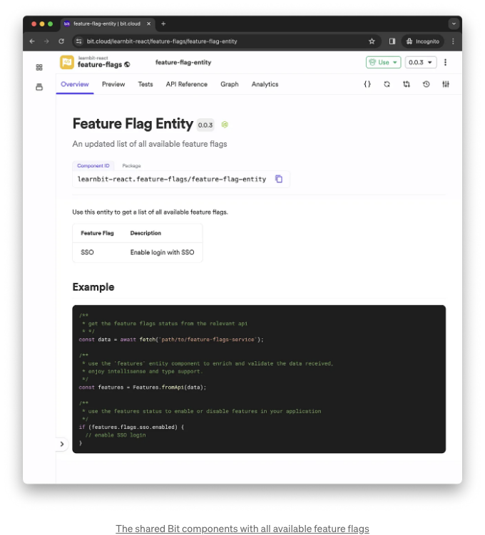
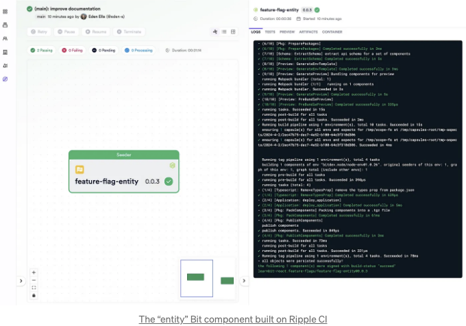
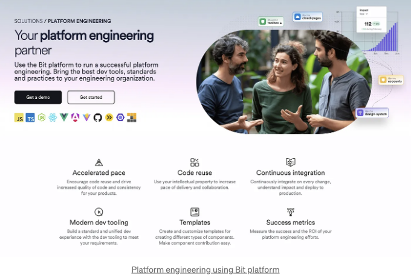

## Bit 및 Bit Platform을 사용한 기능 플래그 구현: 단계별 안내

기능 플래그는 어떤 플랫폼 엔지니어링에서도 중요한 요소입니다. 코드를 직접 수정하지 않고 기능을 관리하고 배포할 수 있는 유연한 방법을 제공합니다.

기능 토글은 세 가지 유형으로 분류될 수 있습니다:

- 릴리스 토글은 기능 릴리스 타이밍을 제어합니다. 팀이 코드를 본 브랜치에 병합할 수 있지만 즉시 사용자에게 릴리스하지 않도록합니다.
- 실험 토글 또는 A/B 테스트 토글은 팀이 일부 사용자 중 일부분을 사용하여 새로운 기능을 테스트할 수 있도록합니다.
- Ops 토글은 운영 팀이 새로운 코드를 배포하지 않고 기능을 켜거나 끌 수 있도록 하는 것으로 종종 운영 측면을 관리하는 데 사용됩니다.

<!-- ui-log 수평형 -->
<ins class="adsbygoogle"
  style="display:block"
  data-ad-client="ca-pub-4877378276818686"
  data-ad-slot="9743150776"
  data-ad-format="auto"
  data-full-width-responsive="true"></ins>
<component is="script">
(adsbygoogle = window.adsbygoogle || []).push({});
</component>

루스리 커플드된 Bit 구성 요소로 구축된 매우 조립 가능한 소프트웨어는 어떤 정밀도에서든 기능 토글을 구현하는 것을 훨씬 쉽게 만듭니다.

Bit 구성 요소와 기능 토글을 통합할 때, 앞서 언급한 세 가지 유형은 다음과 같이 번역됩니다:

- 특정한 Bit 구성 요소를 사용하는 대신 사용하지 않기.
- 다른 대체 구성 요소로 Bit 구성 요소를 교체하기.
- Bit 구성 요소의 최신 버전을 특정 사용자 그룹에만 제공하고 다른 사용자들은 이전 버전을 계속 사용하기.

# 동기화된 개발과 향상된 타입 지원을 위해 기능 플래그 구성 요소 공유

<!-- ui-log 수평형 -->
<ins class="adsbygoogle"
  style="display:block"
  data-ad-client="ca-pub-4877378276818686"
  data-ad-slot="9743150776"
  data-ad-format="auto"
  data-full-width-responsive="true"></ins>
<component is="script">
(adsbygoogle = window.adsbygoogle || []).push({});
</component>

먼저 "엔티티 컴포넌트"를 생성하겠습니다. 이는 조직 내 모든 관련 팀과 프로젝트에서 공유하는 비트 컴포넌트가 될 것입니다.



이는 모든 가능한 기능 플래그, 상태 및 유형에 대한 중앙 레코드 역할을 하며, 소프트웨어의 다른 부분이 각 플래그의 상태에 적절하게 대응할 수 있도록 돕습니다.

```js
bit create entity feature-flag-entity
```

<!-- ui-log 수평형 -->
<ins class="adsbygoogle"
  style="display:block"
  data-ad-client="ca-pub-4877378276818686"
  data-ad-slot="9743150776"
  data-ad-format="auto"
  data-full-width-responsive="true"></ins>
<component is="script">
(adsbygoogle = window.adsbygoogle || []).push({});
</component>

우리의 기능 플래그 엔터티에는 SSO 인증 메커니즘을 포함할 것입니다. 활성화된 속성은 서버가 토글을 제어하기 때문에 정의되지 않은 상태로 남겨두어야 합니다.

```js
/** 
  * 팀을 동기화시키고 개발 경험을 향상시키기 위해 사용 가능한 기능 플래그 나열
  */
const availableFeatureFlags = {
  sso: {
    description: 'SSO로 로그인 활성화',
    enabled: undefined,
  },
};

export class Features {
  constructor(public readonly flags: FeatureFlags) {}
  // ...
  static readonly availableFlags = availableFeatureFlags;

  /**
   * 동적 데이터로 기능 플래그 엔터티를 보강합니다.
   * 서버로부터 반환된 데이터에 따라 특정 사용자/특정 시간에 기능이 활성화되었는지 확인합니다.
   */
  static fromApi(flagsObj: FeatureFlags) {
    
    const configuredFeatureFlags = {};

    for (let flagObjName in flagsObj) {
      configuredFeatureFlags[flagObjName] = {
        ...Features.availableFlags[flagObjName],
        enabled: flagsObj[flagObjName].enabled,
      };
    }

    return new Features(configuredFeatureFlags);
  }
}
```

이 Bit 컴포넌트를 릴리스하기 위해 다음을 실행하겠습니다:

```js
bit tag -m "사용 가능한 기능 플래그에 SSO 추가"
bit export
```

<!-- ui-log 수평형 -->
<ins class="adsbygoogle"
  style="display:block"
  data-ad-client="ca-pub-4877378276818686"
  data-ad-slot="9743150776"
  data-ad-format="auto"
  data-full-width-responsive="true"></ins>
<component is="script">
(adsbygoogle = window.adsbygoogle || []).push({});
</component>

위 컴포넌트는 Bit 플랫폼에서 구축되고 공유되었어요. 언제든지 서비스를 유지하는 팀이 Bit 컴포넌트를 가져와서 새로운 기능 플래그로 업데이트하고 새 버전을 릴리스할 수 있다는 점에 유의해 주세요.

Bit 플랫폼에서 Ripple CI를 사용하면 의존하는 컴포넌트가 자동으로 테스트되고 빌드되며 새 버전과 함께 릴리스됩니다. 이를 통해 모든 팀이 최신 변경 사항과 동기화되는 것이 보장됩니다.



# 기본 기능 플래그 서비스 구현

<!-- ui-log 수평형 -->
<ins class="adsbygoogle"
  style="display:block"
  data-ad-client="ca-pub-4877378276818686"
  data-ad-slot="9743150776"
  data-ad-format="auto"
  data-full-width-responsive="true"></ins>
<component is="script">
(adsbygoogle = window.adsbygoogle || []).push({});
</component>

간단히 말씀드리자면, 우리는 특징 플래그가 활성화되었는지 여부를 다른 서비스와 프런트엔드 애플리케이션 사이에서 통신하는 기본 익스프레스 서비스를 만들 것입니다. 이 경우, 우리는 무작위로 SSO와 비SSO 사이를 전환할 것입니다:

```js
/**
* 사용 가능한 특징 플래그, 그들의 이름 및 유형과 동기화를 유지하려면 'features' 엔티티 컴포넌트를 사용하십시오
*/
import { Features } from '@my-org/my-scope.feature-flag-entity';

// ...

const enableFiftyPercentOfTheTime = () => Math.random() < 0.5;

router.get('/feature-flags', (req, res) => {
  const features = new Features({
    sso: {
      enabled: enableFiftyPercentOfTheTime(),
    },
  });

  res.send(features);
});
```

이 서비스를 비트 컴포넌트로 어떻게 구현하는지 알아보려면 공식 문서를 참조하세요.

# 특징 플래그 조건을 갖는 페이지 구현하기

<!-- ui-log 수평형 -->
<ins class="adsbygoogle"
  style="display:block"
  data-ad-client="ca-pub-4877378276818686"
  data-ad-slot="9743150776"
  data-ad-format="auto"
  data-full-width-responsive="true"></ins>
<component is="script">
(adsbygoogle = window.adsbygoogle || []).push({});
</component>

로그인 양식을 개발하는 팀은 이제 양식에서 SSO 기능 플래그를 사용할 수 있습니다.

예를 들어:

```js
/**
* 'features' 엔티티 컴포넌트를 사용하여 수신된 데이터를 향상시키고 유효성을 검사하세요,
* Intellisense 및 유형 지원을 즐기세요.
*/
import { Features } from '@learnbit-react.feature-flag-entity';

export const SignIn = ({ children }) => {
   // ...

   useEffect(() => {
     (async () => {
       try {
         const data = await fetch('path/to/feature-flags-service')
         // ...
         const features = Features.fromApi(data);
         
         })();
   }, []);

   return (
     <>
       /**
        * 대체 구현 방법을 보려면 다음 섹션을 참조해주세요!
        */
     </>
   );
};
``` 

이제 SSO 기능 플래그 조건으로 로그인 양식을 구현하는 여러 가지 대안이 있습니다.

<!-- ui-log 수평형 -->
<ins class="adsbygoogle"
  style="display:block"
  data-ad-client="ca-pub-4877378276818686"
  data-ad-slot="9743150776"
  data-ad-format="auto"
  data-full-width-responsive="true"></ins>
<component is="script">
(adsbygoogle = window.adsbygoogle || []).push({});
</component>

## 사인인 양식 업데이트하여 SSO 버튼을 조건에 따라 렌더링하기

이 방법을 선택한 경우, 사인인 양식을 개발하는 팀은 피처 플래그 서비스로부터 받은 데이터에 기반하여 OSS 옵션을 조건에 따라 렌더링하기로 결정했습니다:

```js
const ConditionalSso = () => {
  if (!features.flags.sso.enabled) return null;
  return (
    <>
      <Text>
        <Link href="#">SSO로 연결하기</Link>
      </Text>
      <Separator />
    </>
  );
}

export function SignInForm() {
  return (
    <div>
      // ...
      <div className={styles.linksSection}>
        <ConditionalSso />
        // ...
      </div>
    </div>
  );
}
```

## 페이지 업데이트하여 조건에 따라 컴포넌트를 교체하기

<!-- ui-log 수평형 -->
<ins class="adsbygoogle"
  style="display:block"
  data-ad-client="ca-pub-4877378276818686"
  data-ad-slot="9743150776"
  data-ad-format="auto"
  data-full-width-responsive="true"></ins>
<component is="script">
(adsbygoogle = window.adsbygoogle || []).push({});
</component>

이 대안에서 로그인 페이지를 개발하는 팀은 두 가지 다른 Bit 구성 요소 중 하나를 반환합니다. SSO가 포함된 하나와 SSO가 없는 다른 하나입니다. (이 특정 케이스에서 '확장 로그인 양식'은 아마도 기본 로그인 양식으로 구성될 것입니다):

```js
import { SignInForm } from '@my-org.my-scope/forms/sign-in';
import { ExtendedSignInForm} from '@my-org.my-scope/forms/extended-sign-in';

export function SignInPage() {
 if (features.flags.sso.enabled) return <ExtendedSignInForm />;
 return <SignInForm />
);
}
```

## 동일한 Bit 컴포넌트의 다른 버전을 조건에 따라 교체하는 페이지 업데이트

이 옵션은 동일한 Bit 구성 요소의 다른 버전을 사용합니다. 이 버전 중 하나는 아마도 프리 릴리스 태그를 포함할 것입니다. 예를 들어:

<!-- ui-log 수평형 -->
<ins class="adsbygoogle"
  style="display:block"
  data-ad-client="ca-pub-4877378276818686"
  data-ad-slot="9743150776"
  data-ad-format="auto"
  data-full-width-responsive="true"></ins>
<component is="script">
(adsbygoogle = window.adsbygoogle || []).push({});
</component>

```js
bit tag forms/sign-in --unmodified -m "SSO 옵션 추가" --increment prerelease --prerelease-id beta
```

그 결과로 다음과 같은 컴포넌트 ID가 생성됩니다: my-org.my-scope/forms/sign-in@0.0.2-beta.0 그리고 이에 대응하는 패키지 이름은 다음과 같습니다: @my-org/my-scope.forms.sign-in.

기존 프로젝트에서 이 두 버전을 사용하려면 먼저 package.json에 "의존성 별칭" 또는 "패키지 별칭"을 추가해야 합니다:

```js
{
 "dependencies": {
  "@my-org/my-scope.forms.sign-in": "0.0.1",
  "@my-org/my-scope.forms.sign-in-sso": "npm:@my-org/my-scope.forms/sign-in@0.0.2-beta.0",
}
```

<!-- ui-log 수평형 -->
<ins class="adsbygoogle"
  style="display:block"
  data-ad-client="ca-pub-4877378276818686"
  data-ad-slot="9743150776"
  data-ad-format="auto"
  data-full-width-responsive="true"></ins>
<component is="script">
(adsbygoogle = window.adsbygoogle || []).push({});
</component>

이제 동일한 파일에서 두 가지 버전을 모두 사용할 수 있습니다:

```js
import { SignInForm } from "@my-org/my-scope.forms.sign-in";
import { SignInForm as SignInFormWithSso } from "npm:@my-org/my-scope.forms.sign-in@0.0.2-beta.0"

export function SignInPage() {
 if (features.flags.sso.enabled) return <SignInFormWithSso />;
 return <SignInForm />
  );
}
```

예를 들어, 동일한 Bit 컴포넌트의 이 두 가지 버전을 살펴보세요. 하나는 안정 버전이며, 다른 하나는 프리 릴리스입니다:

Bit 플랫폼을 사용하여 플랫폼 엔지니어링에 대해 더 알아보려면 Bit 플랫폼을 참조하세요.

<!-- ui-log 수평형 -->
<ins class="adsbygoogle"
  style="display:block"
  data-ad-client="ca-pub-4877378276818686"
  data-ad-slot="9743150776"
  data-ad-format="auto"
  data-full-width-responsive="true"></ins>
<component is="script">
(adsbygoogle = window.adsbygoogle || []).push({});
</component>

