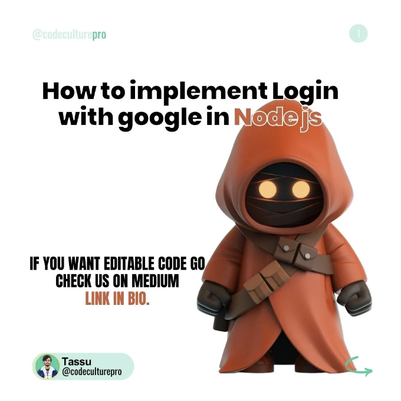

Google 로그인을 구현하기 위해서는 Google API 프로젝트를 설정해야 합니다. 아래 단계를 따라 주세요:

- Google 개발자 콘솔로 이동합니다 (https://console.developers.google.com/).
- 새 프로젝트를 생성하거나 기존 프로젝트를 선택합니다.
- 프로젝트에 "Google+ API"를 활성화합니다.
- "Credentials" 섹션으로 이동하고 "Credentials 생성"을 클릭합니다.
- 자격 증명 유형으로 "OAuth 클라이언트 ID"를 선택합니다.
- 애플리케이션 유형으로 "웹 애플리케이션"을 선택합니다.
- OAuth 클라이언트 ID에 이름을 입력합니다.
- 승인된 JavaScript 소스 (예: http://localhost:3000) 및 리디렉션 URI (예: http://localhost:3000/auth/google/callback)를 추가합니다.
- 클라이언트 ID 및 클라이언트 시크릿을 생성하려면 "생성"을 클릭합니다.

단계 2: Node.js 프로젝트 설정

<!-- ui-log 수평형 -->
<ins class="adsbygoogle"
  style="display:block"
  data-ad-client="ca-pub-4877378276818686"
  data-ad-slot="9743150776"
  data-ad-format="auto"
  data-full-width-responsive="true"></ins>
<component is="script">
(adsbygoogle = window.adsbygoogle || []).push({});
</component>

새로운 Node.js 프로젝트를 설정하세요. npm이나 yarn과 같은 패키지 관리자를 사용해 시작하세요. 터미널에서 다음 명령을 실행하세요:

```js
csharpCopy code
npm init
```

이 명령은 프로젝트의 종속성을 관리하는 package.json 파일을 생성합니다.

단계 3: 필수 패키지 설치

<!-- ui-log 수평형 -->
<ins class="adsbygoogle"
  style="display:block"
  data-ad-client="ca-pub-4877378276818686"
  data-ad-slot="9743150776"
  data-ad-format="auto"
  data-full-width-responsive="true"></ins>
<component is="script">
(adsbygoogle = window.adsbygoogle || []).push({});
</component>

Node.js에서 Google 로그인을 구현하려면 필요한 패키지를 설치해야 합니다. 터미널에서 다음 명령을 실행하세요:

```js
복사 코드
npm install express axios
```

Express.js와 axios 패키지가 설치됩니다. Express.js는 인기있는 Node.js 웹 프레임워크이며, HTTP 요청을 만들기 위해 axios 패키지를 사용할 것입니다.

단계 4: 인증 라우트 구현

<!-- ui-log 수평형 -->
<ins class="adsbygoogle"
  style="display:block"
  data-ad-client="ca-pub-4877378276818686"
  data-ad-slot="9743150776"
  data-ad-format="auto"
  data-full-width-responsive="true"></ins>
<component is="script">
(adsbygoogle = window.adsbygoogle || []).push({});
</component>

새 파일 authRoutes.js을 만들어 애플리케이션의 인증 라우트를 정의하세요. 이 파일에서 Google 로그인 플로우를 시작하고 콜백 URL을 처리하며 사용자 로그아웃을 담당하는 라우트를 구현하세요.

```js
javascriptCopy code
const express = require('express');
const axios = require('axios');
const router = express.Router();

const CLIENT_ID = 'YOUR_CLIENT_ID';
const CLIENT_SECRET = 'YOUR_CLIENT_SECRET';
const REDIRECT_URI = '<http://localhost:3000/auth/google/callback>';

// Initiates the Google Login flow
router.get('/auth/google', (req, res) => {
  const url = `https://accounts.google.com/o/oauth2/v2/auth?client_id=${CLIENT_ID}&redirect_uri=${REDIRECT_URI}&response_type=code&scope=profile email`;
  res.redirect(url);
});

// Callback URL for handling the Google Login response
router.get('/auth/google/callback', async (req, res) => {
  const { code } = req.query;

  try {
    // Exchange authorization code for access token
    const { data } = await axios.post('<https://oauth2.googleapis.com/token>', {
      client_id: CLIENT_ID,
      client_secret: CLIENT_SECRET,
      code,
      redirect_uri: REDIRECT_URI,
      grant_type: 'authorization_code',
    });

    const { access_token, id_token } = data;

    // Use access_token or id_token to fetch user profile
    const { data: profile } = await axios.get('<https://www.googleapis.com/oauth2/v1/userinfo>', {
      headers: { Authorization: `Bearer ${access_token}` },
    });

    // Code to handle user authentication and retrieval using the profile data

    res.redirect('/');
  } catch (error) {
    console.error('Error:', error.response.data.error);
    res.redirect('/login');
  }
});

// Logout route
router.get('/logout', (req, res) => {
  // Code to handle user logout
  res.redirect('/login');
});

module.exports = router;
```

반드시 Google API 프로젝트에서 얻은 자신의 자격 증명인 `YOUR_CLIENT_ID`와 `YOUR_CLIENT_SECRET`를 대체하십시오.

Step 5: Express.js 서버 설정하기

<!-- ui-log 수평형 -->
<ins class="adsbygoogle"
  style="display:block"
  data-ad-client="ca-pub-4877378276818686"
  data-ad-slot="9743150776"
  data-ad-format="auto"
  data-full-width-responsive="true"></ins>
<component is="script">
(adsbygoogle = window.adsbygoogle || []).push({});
</component>

메인 서버 파일(예: app.js)에서 필요한 패키지를 가져와 Express.js 서버를 구성하세요. authRoutes.js에 정의된 인증 라우트를 포함하세요.

```js
javascriptCopy 코드
const express = require('express');
const authRoutes = require('./authRoutes');

const app = express();

app.use('/', authRoutes);

// 서버 시작
app.listen(3000, () => {
  console.log('서버가 3000번 포트에서 시작되었습니다');
});
```

궁금한 사항이나 제안이 있다면 언제든지 저의 인스타그램 또는 codeculturepro@gmail.com으로 연락주세요.