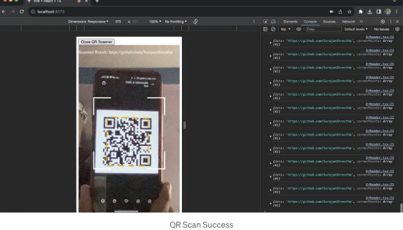
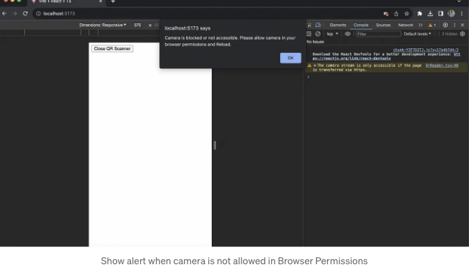

QR 코드 스캐너는 매우 인기가 있는데 React에서 어떻게 구현하는지 알아보겠습니다. 구현하는 것은 간단하지만 처음부터 직접 만들려면 하루 종일 걸릴 수 있어요.

다행히도, 여기 있으니 도와드릴 수 있죠 🙌.

문제 😵‍💫: React에 전용 QR 코드 스캐너 패키지가 많지만 안정적이지 않은 것들도 많고, 특정 브라우저에서 버그가 발생하는 것도 있으며, 사용성이 부족한 것도 있고, 특정 기능이 부족한 것도 있어요.

<!-- ui-log 수평형 -->
<ins class="adsbygoogle"
  style="display:block"
  data-ad-client="ca-pub-4877378276818686"
  data-ad-slot="9743150776"
  data-ad-format="auto"
  data-full-width-responsive="true"></ins>
<component is="script">
(adsbygoogle = window.adsbygoogle || []).push({});
</component>

해결 완료 ✅: JavaScript와 직접적으로 구현된 QR 코드 스캐너 패키지는 특정 JS 프레임워크에 특화된 패키지보다 더 나은 성능과 안정성을 보입니다.

## 사용한 패키지

저는 상당히 안정적이고 nimiq에서 후원하는 qr-scanner 패키지를 사용할 것입니다. (nimiq는 브라우저 기반의 블록체인 플랫폼이며, 이 패키지를 자신들의 애플리케이션에서도 사용하는 것 같습니다.)

## 코드 작성해보기

<!-- ui-log 수평형 -->
<ins class="adsbygoogle"
  style="display:block"
  data-ad-client="ca-pub-4877378276818686"
  data-ad-slot="9743150776"
  data-ad-format="auto"
  data-full-width-responsive="true"></ins>
<component is="script">
(adsbygoogle = window.adsbygoogle || []).push({});
</component>

a. 폴더 구조

나는 개발 환경을 설정하기 위해 vite를 사용하고 있어. 하지만 네가 선택한 것을 사용해도 돼, 심지어 create-react-app을 사용해도 😉.

```js
-node_modules 및 기타
-package.json
-src
  -assets
    -qr-frame.svg
  -components
    -QrReader.tsx
    -QrStyles.css
  -App.tsx
  -main.tsx(또는 create-react-app을 사용 중이라면 index.tsx)
  -App.css(이 파일은 비어 있어)
  -index.css(이 파일은 비어 있어)
```

b. 패키지 설치

<!-- ui-log 수평형 -->
<ins class="adsbygoogle"
  style="display:block"
  data-ad-client="ca-pub-4877378276818686"
  data-ad-slot="9743150776"
  data-ad-format="auto"
  data-full-width-responsive="true"></ins>
<component is="script">
(adsbygoogle = window.adsbygoogle || []).push({});
</component>

npm을 사용하는 경우:

```js
npm i qr-scanner
```

yarn을 사용하는 경우:

```js
yarn add qr-scanner
```

<!-- ui-log 수평형 -->
<ins class="adsbygoogle"
  style="display:block"
  data-ad-client="ca-pub-4877378276818686"
  data-ad-slot="9743150776"
  data-ad-format="auto"
  data-full-width-responsive="true"></ins>
<component is="script">
(adsbygoogle = window.adsbygoogle || []).push({});
</component>

c. 불필요한 CSS 정리하기

App.css와 index.css에서 모든 CSS를 삭제했어요. 이렇게 하면 깨끗한 시작점이 되고 서로 충돌하는 CSS 스타일을 방지할 수 있어요.

다음은 App.css와 index.css에서 스타일을 제거한 내용입니다👇:

```js
/* CSS 스타일 없음 */
```

<!-- ui-log 수평형 -->
<ins class="adsbygoogle"
  style="display:block"
  data-ad-client="ca-pub-4877378276818686"
  data-ad-slot="9743150776"
  data-ad-format="auto"
  data-full-width-responsive="true"></ins>
<component is="script">
(adsbygoogle = window.adsbygoogle || []).push({});
</component>

css 스타일을 단순화하기 위해 우리는 /components/QrStyles.css에 위치한 하나의 css 파일만 사용할 것입니다. 이 파일에는 QR 스캐너에 필요한 모든 css 스타일이 포함되어 있습니다👇:

```js
.qr-reader {
  width: 430px;
  height: 100vh;
  margin: 0 auto;
  position: relative;
}

.qr-reader video {
  width: 100%;
  height: 100%;
  object-fit: cover;
}

.qr-reader .qr-box {
  width: 100% !important;
  left: 0 !important;
}

.qr-reader .qr-frame {
  position: absolute;
  fill: none;
  left: 50%;
  top: 50%;
  transform: translateX(-50%) translateY(-50%);
}

/* 모바일 화면을 위한 미디어 쿼리 */
@media (max-width: 426px) {
  .qr-reader {
    width: 100%;
  }
}
```

d. 의존성 가져오기

다음 경로 /components/QrReader.tsx에 QrReader 컴포넌트를 만들고 qr-scanner, QrFrame 및 QrStyles.css를 가져 오겠습니다:

<!-- ui-log 수평형 -->
<ins class="adsbygoogle"
  style="display:block"
  data-ad-client="ca-pub-4877378276818686"
  data-ad-slot="9743150776"
  data-ad-format="auto"
  data-full-width-responsive="true"></ins>
<component is="script">
(adsbygoogle = window.adsbygoogle || []).push({});
</component>

```js
// 스타일
import "./QrStyles.css";

// Qr 스캐너
import QrScanner from "qr-scanner";
import QrFrame from "../assets/qr-frame.svg";

const QrReader = () => {

}

export default QrReader;
```

e. Qr 스캐너에서 필요한 JSX 요소 연결하기

주로 카메라가 렌더링되는 `video` 요소와 QrFrame.svg를 보여주기 위한 `img` 요소가 필요합니다.

useRef로 얻은 videoEl과 qrBoxEl을 각 요소에 연결할 것입니다.

<!-- ui-log 수평형 -->
<ins class="adsbygoogle"
  style="display:block"
  data-ad-client="ca-pub-4877378276818686"
  data-ad-slot="9743150776"
  data-ad-format="auto"
  data-full-width-responsive="true"></ins>
<component is="script">
(adsbygoogle = window.adsbygoogle || []).push({});
</component>

그 외에도 아래와 같이 정확한 순서로 정확한 CSS 클래스를 가진 여러 `div` 요소가 필요합니다👇:

```js
import { useEffect, useRef, useState } from "react";

// 스타일
import "./QrStyles.css";

// QR 스캐너
import QrScanner from "qr-scanner";
import QrFrame from "../assets/qr-frame.svg";

const QrReader = () => {
  // QR 상태
  const videoEl = useRef<HTMLVideoElement>(null);
  const qrBoxEl = useRef<HTMLDivElement>(null);

  return (
    <div className="qr-reader">
      {/* QR */}
      <video ref={videoEl}></video>
      <div ref={qrBoxEl} className="qr-box">
        
      </div>
    </div>
  );
}

export default QrReader;
```

f. QR 스캐너 초기화

QR 스캐너를 초기화하기 위해서는 useRef에서 스캐너 엘리먼트와 qrOn 상태 및 setQrOn 상태 핸들러가 필요합니다.

<!-- ui-log 수평형 -->
<ins class="adsbygoogle"
  style="display:block"
  data-ad-client="ca-pub-4877378276818686"
  data-ad-slot="9743150776"
  data-ad-format="auto"
  data-full-width-responsive="true"></ins>
<component is="script">
(adsbygoogle = window.adsbygoogle || []).push({});
</component>

우리는 useEffect에서 Qr 스캐너를 초기화할 것입니다. 이를 위해 qr-scanner 패키지에서 제공하는 생성자 함수를 사용할 것입니다. 즉, new QrScanner() 입니다.

new QrScanner()의 첫 번째 매개변수는 우리 카메라가 렌더링되는 videoEl?.current이고, 두 번째는 onScanSuccess(다음 섹션에서 설명하겠습니다), 세 번째는 onDecodeError, preferredCamera, highlightScanRegion, highlightCodeOutline, overlay와 같은 속성이 포함된 options 객체입니다. 각 옵션이 무엇을 하는지는 아래 코드 주석에 제공되어 있습니다👇.

scanner?.current promise 함수를 사용하여 Qr 스캐너를 시작합니다. 성공적으로 qr 스캐너를 시작하면 qrOn 상태를 true로 설정할 것이며(✅), 스캐너를 시작하는 데 문제가 발생하면 false로 설정할 것입니다(❌).

사용자가 다른 페이지로 이동하거나 QrReader 컴포넌트가 해제될 때(QrReader가 JavaScript의 DOM 트리에서 제거됨), Qr 스캐너를 중지할 것입니다. Qr 스캐너가 중지되면 디바이스 카메라 사용을 중단할 것입니다🎬. useEffect의 cleanup 함수 내에서 scanner?.current?.stop() 함수를 사용하여 이를 수행할 것입니다.

<!-- ui-log 수평형 -->
<ins class="adsbygoogle"
  style="display:block"
  data-ad-client="ca-pub-4877378276818686"
  data-ad-slot="9743150776"
  data-ad-format="auto"
  data-full-width-responsive="true"></ins>
<component is="script">
(adsbygoogle = window.adsbygoogle || []).push({});
</component>

```javascript
import { useEffect, useRef, useState } from "react";

// 스타일
import "./QrStyles.css";

// Qr Scanner
import QrScanner from "qr-scanner";
import QrFrame from "../assets/qr-frame.svg";

const QrReader = () => {
  // QR 상태
  const scanner = useRef<QrScanner>();
  const videoEl = useRef<HTMLVideoElement>(null);
  const qrBoxEl = useRef<HTMLDivElement>(null);
  const [qrOn, setQrOn] = useState<boolean>(true);

  useEffect(() => {
    if (videoEl?.current && !scanner.current) {
      // 👉 QR 스캐너 생성
      scanner.current = new QrScanner(videoEl?.current, onScanSuccess, {
        onDecodeError: onScanFail,
        // 📷 이것은 카메라 방향 모드입니다. 모바일 장치에서 "environment"는 후면 카메라이고 "user"는 전면 카메라를 의미합니다.
        preferredCamera: "environment",
        // 🖼 이는 사용자가 QrFrame.svg 사이에만 스캔할 수 있도록 "QrFrame.svg"를 위치시킬 수 있게 도와줍니다.
        highlightScanRegion: true,
        // 🔥 이 옵션은 우리가 스캔하는 qr 코드 주위에 노란색 (기본색) 외곽선을 만들어 줍니다. 이는 우리의 qr-scanner가 해당 qr 코드를 스캔하고 있다는 증거를 보여줍니다.
        highlightCodeOutline: true,
        // 📦 "highlightScanRegion" 옵션과 쌍을 이룰 사용자 정의 div입니다 👆. 이를 통해 스캔 영역을 완전히 제어할 수 있습니다.
        overlay: qrBoxEl?.current || undefined,
      });

      // 🚀 QR 스캐너 시작
      scanner?.current
        ?.start()
        .then(() => setQrOn(true))
        .catch((err) => {
          if (err) setQrOn(false);
        });
    }

    // 🧹 언마운트시 정리합니다.
    // 🚨 카메라가 닫히거나 UI에서 제거될 때 QR 스캐너를 렌더링 및 카메라 사용에서 제거합니다.
    return () => {
      if (!videoEl?.current) {
        scanner?.current?.stop();
      }
    };
  }, []);

  return (
    <div className="qr-reader">
      {/* QR */}
      <video ref={videoEl}></video>
      <div ref={qrBoxEl} className="qr-box">
        
      </div>
    </div>
  );
}

export default QrReader;
```

<!-- ui-log 수평형 -->
<ins class="adsbygoogle"
  style="display:block"
  data-ad-client="ca-pub-4877378276818686"
  data-ad-slot="9743150776"
  data-ad-format="auto"
  data-full-width-responsive="true"></ins>
<component is="script">
(adsbygoogle = window.adsbygoogle || []).push({});
</component>

실패 처리에 대해는 onScanFail 함수를 사용할 거에요. 여기서는 에러를 콘솔에 출력할 거랍니다 ❌. onScanFail 함수는 new Scanner() 생성자 함수 내부의 3번째 매개변수 객체의 1번 속성에 전달됩니다.

```js
import { useEffect, useRef, useState } from "react";

// 스타일
import "./QrStyles.css";

// QR 스캐너
import QrScanner from "qr-scanner";
import QrFrame from "../assets/qr-frame.svg";

const QrReader = () => {
  // QR 상태
  const scanner = useRef<QrScanner>();
  const videoEl = useRef<HTMLVideoElement>(null);
  const qrBoxEl = useRef<HTMLDivElement>(null);
  const [qrOn, setQrOn] = useState<boolean>(true);

  // 결과
  const [scannedResult, setScannedResult] = useState<string | undefined>("");

  // 성공
  const onScanSuccess = (result: QrScanner.ScanResult) => {
    // 🖨 "result"를 브라우저 콘솔에 출력해보세요.
    console.log(result);
    // ✅ 성공 처리
    // 😎 스캔된 결과물로 원하는 작업을 수행할 수 있어요.
    setScannedResult(result?.data);
  };

  // 실패
  const onScanFail = (err: string | Error) => {
    // 🖨 "err"를 브라우저 콘솔에 출력해보세요.
    console.log(err);
  };

  useEffect(() => {
    if (videoEl?.current && !scanner.current) {
      // 👉 QR 스캐너 인스턴스 생성
      scanner.current = new QrScanner(videoEl?.current, onScanSuccess, {
        onDecodeError: onScanFail,
        // 📷 이건 카메라 피싱 모드에요. 모바일 장치에서 "environment"는 후면 카메라를, "user"는 전면 카메라를 의미합니다.
        preferredCamera: "environment",
        // 🖼 이 옵션은 "QrFrame.svg"를 정확한 위치에 놓도록 도와줍니다. 유저가 QrFrame.svg 사이에만 스캔할 수 있도록 해줘요.
        highlightScanRegion: true,
        // 🔥 스캔한 QR 코드 주위에 노란색(기본 색상) 테두리를 만듭니다. 우리의 qr-scanner가 해당 QR 코드를 스캔 중이라는 증거를 보여줘요.
        highlightCodeOutline: true,
        // 📦 "highlightScanRegion" 옵션과 함께 사용할 커스텀 div. 스캔 영역에 완전한 제어권을 부여해줘요.
        overlay: qrBoxEl?.current || undefined,
      });

      // 🚀 QR 스캐너 시작
      scanner?.current
        ?.start()
        .then(() => setQrOn(true))
        .catch((err) => {
          if (err) setQrOn(false);
        });
    }

    // 🧹 언마운트 시 정리
    // 🚨 UI에서 사라지거나 사용 중지되면 QR 스캐너를 제거해요. 카메라 사용을 멈춥니다.
    return () => {
      if (!videoEl?.current) {
        scanner?.current?.stop();
      }
    };
  }, []);

  return (
    <div className="qr-reader">
      {/* QR */}
      <video ref={videoEl}></video>
      <div ref={qrBoxEl} className="qr-box">
        
      </div>

      {/* 스캔 성공 시 데이터 결과 표시 */}
      {scannedResult && (
        <p
          style={{
            position: "absolute",
            top: 0,
            left: 0,
            zIndex: 99999,
            color: "white",
          }}
        >
          스캔된 결과: {scannedResult}
        </p>
      )}
    </div>
  );
};

export default QrReader;
```

f. 전체 코드 👇
(그리고 브라우저 권한에서 카메라 사용이 허용되지 않았을 때 처리하는 방법)

만약 사용자가 브라우저에서 카메라 권한을 차단했다면, alert() 함수를 사용하여 JavaScript 경고를 표시할 거에요 😎.

<!-- ui-log 수평형 -->
<ins class="adsbygoogle"
  style="display:block"
  data-ad-client="ca-pub-4877378276818686"
  data-ad-slot="9743150776"
  data-ad-format="auto"
  data-full-width-responsive="true"></ins>
<component is="script">
(adsbygoogle = window.adsbygoogle || []).push({});
</component>

아래는 최종 코드입니다 👇:

```js
import { useEffect, useRef, useState } from "react";

// 스타일
import "./QrStyles.css";

// QR 스캐너
import QrScanner from "qr-scanner";
import QrFrame from "../assets/qr-frame.svg";

const QrReader = () => {
  // QR 상태
  const scanner = useRef<QrScanner>();
  const videoEl = useRef<HTMLVideoElement>(null);
  const qrBoxEl = useRef<HTMLDivElement>(null);
  const [qrOn, setQrOn] = useState<boolean>(true);

  // 결과
  const [scannedResult, setScannedResult] = useState<string | undefined>("");

  // 성공
  const onScanSuccess = (result: QrScanner.ScanResult) => {
    // 🖨 "result"를 브라우저 콘솔에 출력합니다.
    console.log(result);
    // ✅ 성공 처리
    // 😎 스캔된 결과물로 원하는 작업을 수행할 수 있습니다.
    setScannedResult(result?.data);
  };

  // 실패
  const onScanFail = (err: string | Error) => {
    // 🖨 "err"를 브라우저 콘솔에 출력합니다.
    console.log(err);
  };

  useEffect(() => {
    if (videoEl?.current && !scanner.current) {
      // 👉 QR 스캐너 인스턴스화
      scanner.current = new QrScanner(videoEl?.current, onScanSuccess, {
        onDecodeError: onScanFail,
        // 📷 카메라 방향 모드입니다. 모바일 장치에서 "environment"는 후면 카메라를 의미하고 "user"는 전면 카메라를 의미합니다.
        preferredCamera: "environment",
        // 🖼 "QrFrame.svg"를 정확히 위치시켜 사용자가 QrFrame.svg 사이에만 스캔할 수 있게 해줍니다.
        highlightScanRegion: true,
        // 🔥 스캔한 QR 코드 주변에 노란색 윤곽선(기본 색상)을 표시하여 qr-scanner가 해당 qr 코드를 스캔하고 있다는 증거를 보여줍니다.
        highlightCodeOutline: true,
        // 📦 "highlightScanRegion" 옵션과 함께 사용되는 사용자 정의 div입니다. 이를 통해 스캔 영역을 완전히 제어할 수 있습니다.
        overlay: qrBoxEl?.current || undefined,
      });

      // 🚀 QR 스캐너 시작
      scanner?.current
        ?.start()
        .then(() => setQrOn(true))
        .catch((err) => {
          if (err) setQrOn(false);
        });
    }

    // 🧹 언마운트 시 정리
    // 🚨 QR 스캐너가 닫히거나 UI에서 제거될 때 사용하여 QR 스캐너를 렌더링 및 카메라 사용에서 제거합니다.
    return () => {
      if (!videoEl?.current) {
        scanner?.current?.stop();
      }
    };
  }, []);

  // ❌ 브라우저 권한에서 "카메라"가 허용되지 않은 경우 경고 표시
  useEffect(() => {
    if (!qrOn)
      alert(
        "카메라가 차단되었거나 액세스할 수 없습니다. 브라우저 권한에서 카메라를 허용하고 새로 고침해주세요."
      );
  }, [qrOn]);

  return (
    <div className="qr-reader">
      {/* QR */}
      <video ref={videoEl}></video>
      <div ref={qrBoxEl} className="qr-box">
        
      </div>

      {/* 스캔 성공 시 데이터 결과 표시 */}
      {scannedResult && (
        <p
          style={{
            position: "absolute",
            top: 0,
            left: 0,
            zIndex: 99999,
            color: "white",
          }}
        >
          스캔 결과: {scannedResult}
        </p>
      )}
    </div>
  );
};

export default QrReader;
```

## 결과

QR 스캐너가 작동하는지 확인하기 위해 내 Github 프로필 링크를 추출할 수 있는 QR 코드를 사용했습니다 👇: https://github.com/SurajanShrestha

<!-- ui-log 수평형 -->
<ins class="adsbygoogle"
  style="display:block"
  data-ad-client="ca-pub-4877378276818686"
  data-ad-slot="9743150776"
  data-ad-format="auto"
  data-full-width-responsive="true"></ins>
<component is="script">
(adsbygoogle = window.adsbygoogle || []).push({});
</component>

a. 데스크톱/노트북 브라우저 💻

성공할 때 ✅:



브라우저 권한에서 카메라 사용이 허용되지 않을 때 ❌:

<!-- ui-log 수평형 -->
<ins class="adsbygoogle"
  style="display:block"
  data-ad-client="ca-pub-4877378276818686"
  data-ad-slot="9743150776"
  data-ad-format="auto"
  data-full-width-responsive="true"></ins>
<component is="script">
(adsbygoogle = window.adsbygoogle || []).push({});
</component>



b. 모바일 브라우저에서 📱


이 섹션을 읽고 계시다면, 저는 여러분께 제 글에 소중한 시간과 에너지를 할애해 주셔서 영원히 감사하다는 것을 알아주었으면 합니다. 만약 이 글이 도움이 되었다면, 감사표시를 자유롭게 해주세요 👏.

<!-- ui-log 수평형 -->
<ins class="adsbygoogle"
  style="display:block"
  data-ad-client="ca-pub-4877378276818686"
  data-ad-slot="9743150776"
  data-ad-format="auto"
  data-full-width-responsive="true"></ins>
<component is="script">
(adsbygoogle = window.adsbygoogle || []).push({});
</component>

다시 한 번 감사하고, 코딩을 계속해보세요 😎.