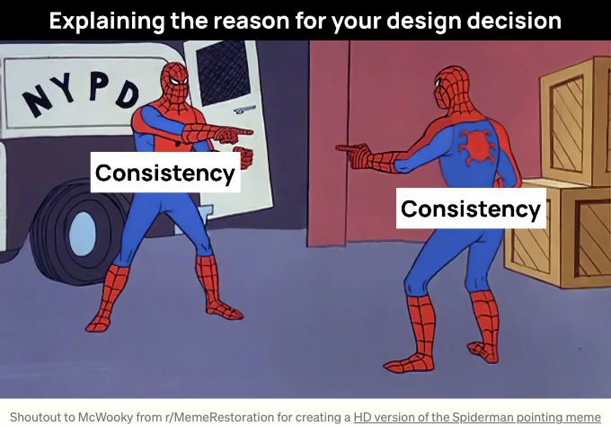
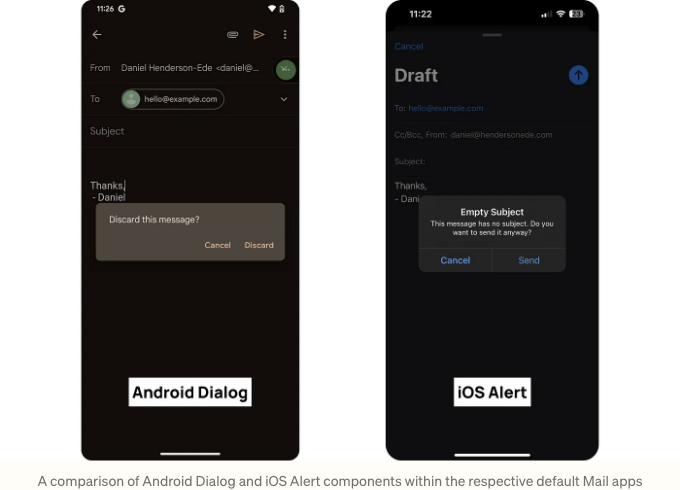
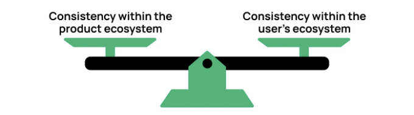
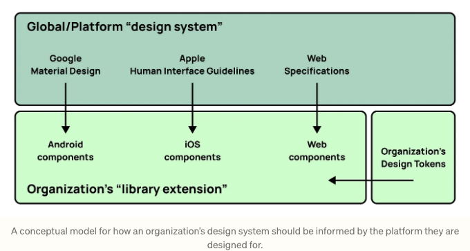
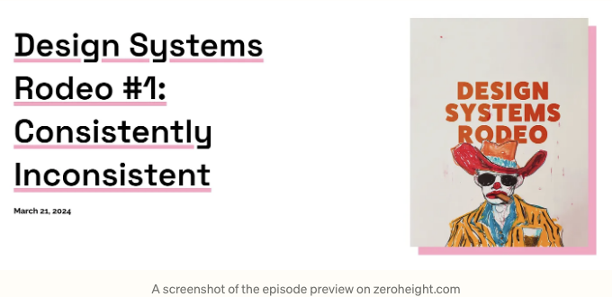

디자인 시스템의 주요 장점 중 하나는 디지털 제품 간의 일관성이며 또한 대부분의 정의에서 공통적인 주제입니다.

다시 한 번...

그리고 또 다시...

## 일관성이란 무엇인가요?

<!-- ui-log 수평형 -->
<ins class="adsbygoogle"
  style="display:block"
  data-ad-client="ca-pub-4877378276818686"
  data-ad-slot="9743150776"
  data-ad-format="auto"
  data-full-width-responsive="true"></ins>
<component is="script">
(adsbygoogle = window.adsbygoogle || []).push({});
</component>

일관성이라는 용어는 종종 디자인 시스템 및 사용자에게 미치는 영향에 대한 명확한 이해 없이 사용됩니다.

디자인 회의에서 개인들은 종종 일관성을 주장하기 위해 그 카드를 내민다. 그러나 그들은 완전히 다른 해결책을 제안합니다. 예를 들어:

사람 1: "iOS의 타이포그래피 스케일을 웹과 일치하게 만들어 일관성을 유지해야 합니다."

사람 2: "일치하게 만들기 위해 기본 iOS 타이포그래피 스케일을 사용해야 한다고 생각합니다."

<!-- ui-log 수평형 -->
<ins class="adsbygoogle"
  style="display:block"
  data-ad-client="ca-pub-4877378276818686"
  data-ad-slot="9743150776"
  data-ad-format="auto"
  data-full-width-responsive="true"></ins>
<component is="script">
(adsbygoogle = window.adsbygoogle || []).push({});
</component>

기본 용어에 대한 공유 정의가 없으면, 디자인 시스템 팀 및 사용자에게 혼란을 초래할 수 있습니다.

‘접근 가능성’이라는 용어를 생각해보세요. 이 용어는 WCAG 2.1 AA 준수를 의미하는지, 아니면 장애 사용자에 대한 알려진 장벽이 없는 상태를 의미하는지 명확하게 전달되는지 살펴보세요.

마찬가지로 ‘일관성’이라는 용어도 일관되게 이해되지 않습니다. 본 문서는 디자인 시스템 내에서 이러한 불일치를 탐구합니다.

<!-- ui-log 수평형 -->
<ins class="adsbygoogle"
  style="display:block"
  data-ad-client="ca-pub-4877378276818686"
  data-ad-slot="9743150776"
  data-ad-format="auto"
  data-full-width-responsive="true"></ins>
<component is="script">
(adsbygoogle = window.adsbygoogle || []).push({});
</component>

# 이미 정의되어 있나요?

디지턈 디자인 맥락에서 일관성에 대한 가장 초기의 정의 중 하나는 1994년 처음으로 작성된 Jakob Nielsen의 10가지 사용성 휴리스틱에 있습니다.

네 번째 원칙인 '일관성과 표준'은 다음과 같이 설명합니다:

잠시만요... 🤨 플랫폼 및 산업 규칙을 따라야 한다면, 왜 계속해서 각자의 규칙을 가진 새로운 디자인 시스템을 만들고 있는 걸까요?

<!-- ui-log 수평형 -->
<ins class="adsbygoogle"
  style="display:block"
  data-ad-client="ca-pub-4877378276818686"
  data-ad-slot="9743150776"
  data-ad-format="auto"
  data-full-width-responsive="true"></ins>
<component is="script">
(adsbygoogle = window.adsbygoogle || []).push({});
</component>

# 제품 생태계 내 일관성

성숙한 디자인 시스템은 제품 전체에서 일관성을 향상시키는 다양한 상호 연결된 부분들을 갖추고 있습니다. 코딩된 구성 요소, 디자인 라이브러리, 디자인 토큰, 문서화된 가이드 및 지원이 있습니다.

그 자체로는 일관성을 만들지 못하지만, 이 모든 것을 함께 사용하면 시각적, 행동적, 의미론적으로 최종 제품을 일관성 있게 맞출 수 있습니다. 이러한 유형의 일관성은 내부 일관성 또는 나의 경우 제품 생태계 내 일관성이라고도 알려져 있습니다.

이러한 것이 디자인 시스템 내에서 가장 흔한 일관성 정의로 보이며, 종종 존재하는 큰 장점 중 하나입니다. 모든 구성 요소가 갖춘 성숙한 디자인 시스템이 있다면, 이론적으로 연결된 디지털 제품들은 하나의 생태계처럼 느껴질 것입니다.

<!-- ui-log 수평형 -->
<ins class="adsbygoogle"
  style="display:block"
  data-ad-client="ca-pub-4877378276818686"
  data-ad-slot="9743150776"
  data-ad-format="auto"
  data-full-width-responsive="true"></ins>
<component is="script">
(adsbygoogle = window.adsbygoogle || []).push({});
</component>

# 사용자의 생태계 내 일관성

외부 일관성은 사용자의 생태계 내에서 일관성을 창조하는 것입니다. 사용자의 생태계란 무엇일까요?

사용자가 iOS 앱을 다운로드하면, 이미 다운로드한 다른 iOS 앱들과 유사하게 작동할 것을 기대합니다.

이것은 Apple이 자사 플랫폼을 위해 Human Interface Guidelines를 발행하고, Google도 Material Design을 개발하는 이유 중 하나입니다. 이것이 전 세계적인 디자인 시스템을 위한 Brad Frost의 촉구를 지지하는 이유이기도 합니다.

<!-- ui-log 수평형 -->
<ins class="adsbygoogle"
  style="display:block"
  data-ad-client="ca-pub-4877378276818686"
  data-ad-slot="9743150776"
  data-ad-format="auto"
  data-full-width-responsive="true"></ins>
<component is="script">
(adsbygoogle = window.adsbygoogle || []).push({});
</component>

# 일관성의 딜레마

디자인 시스템은 종종 제품 생태계 내에서 일관성을 만드는 데 중점을 둡니다. 이것은 완전히 이해할 만한 일입니다. 시스템에 대한 투자 요청 시 중요한 가치 추가 요소로서 소개되었을 가능성이 높기 때문입니다.

물론 이에 중점을 두는 것에는 문제가 없습니다. 이는 여러 이유로 중요합니다. 그러나 문제는 사용자의 생태계 내에서 일관성에 비해 중점이 불균형하게 맞추어지는 경우에 발생합니다 — 특히 아직 성숙 단계에 있는 시스템의 경우입니다.

<!-- ui-log 수평형 -->
<ins class="adsbygoogle"
  style="display:block"
  data-ad-client="ca-pub-4877378276818686"
  data-ad-slot="9743150776"
  data-ad-format="auto"
  data-full-width-responsive="true"></ins>
<component is="script">
(adsbygoogle = window.adsbygoogle || []).push({});
</component>

## 속도

시스템을 구축할 때 이 시스템이 제안한 가치를 제공할 수 있는 방법을 스테이크홀더들이 지켜보는 초기 기간이 종종 있습니다. 이들은 그 결과를 기다리기 싫어합니다.

버튼과 텍스트 필드 외에도 Android, iOS 및 웹에서 시각적으로 유사하고 기능적으로 유사한 구성 요소를 찾는 것은 드물지만, 속도를 내고자 할 때, 제품 생태계 내에서 일관성을 유지하는 것이 가장 어려운 도전 중 하나일 수 있습니다.

예를 들어, Android 대화상자와 iOS 경고 구성 요소를 살펴보겠습니다. 두 구성 요소 모두 사용자에게 "중요한 정보"를 제공함으로써 매우 유사한 기능을 제공하지만 시각적으로는 구별되어 있습니다.

<!-- ui-log 수평형 -->
<ins class="adsbygoogle"
  style="display:block"
  data-ad-client="ca-pub-4877378276818686"
  data-ad-slot="9743150776"
  data-ad-format="auto"
  data-full-width-responsive="true"></ins>
<component is="script">
(adsbygoogle = window.adsbygoogle || []).push({});
</component>

디자인 시스템 팀이 이미 익숙한 사용자 플랫폼에서 제공하는 재고 제어에 의존하는 경우, 개발 노력이 훨씬 더 적게 필요합니다(또는 전혀 필요하지 않을 수도 있습니다). 또한 구성 요소를 사용하는 엔지니어들이 익숙한 API를 사용할 수 있어 채택 장벽을 줄이며, 제품 팀에 빠르게 가치를 전달할 수 있습니다.

## 접근성

플랫폼의 재고 제어에 의존함으로써, 접근성 고려 사항의 수를 줄이고 장애인 고객들이 더 익숙한 경험을 제공할 수 있습니다. 일반적으로 재고 제어에는 다음과 같은 지원이 제공됩니다:

<!-- ui-log 수평형 -->
<ins class="adsbygoogle"
  style="display:block"
  data-ad-client="ca-pub-4877378276818686"
  data-ad-slot="9743150776"
  data-ad-format="auto"
  data-full-width-responsive="true"></ins>
<component is="script">
(adsbygoogle = window.adsbygoogle || []).push({});
</component>

- 동적 글꼴 크기 조정
- 증가한 대비
- 스위치를 위한 켜기/끄기 라벨
- 보조 기술을 위한 역할/특성

디자인 시스템 팀이 다른 플랫폼과 비슷하게 컨트롤을 사용자 정의하려고 할 때, 이러한 항목들은 종종 그 결정에 고려되지 않습니다. 고려되지 않기 때문에 기본 지원이 종종 스타일 재정의나 구성 요소의 재구축으로 인해 손실됩니다. 이러한 접근성 기능 중 많은 기능을 구성 요소에 다시 추가할 수 있지만, 장애인 고객에게 명확한 추가 가치를 제공해 주지는 않습니다.

## 유지보수성

시각적, 기능적 및 의미론적으로 일치하는 구성 요소를 만들려면 종종 마법이 일어나도록 뒷단에 몇 가지 해킹이 필요합니다. 그러나 네이티브 모바일 환경 내에서의 빠른 변화 속에서 제품 팀이 사용하는 버전과 프레임워크가 매우 단편화되어 있다면, 디자인 시스템의 신뢰성이 줄어들 수 있습니다.

<!-- ui-log 수평형 -->
<ins class="adsbygoogle"
  style="display:block"
  data-ad-client="ca-pub-4877378276818686"
  data-ad-slot="9743150776"
  data-ad-format="auto"
  data-full-width-responsive="true"></ins>
<component is="script">
(adsbygoogle = window.adsbygoogle || []).push({});
</component>

성숙한 디자인 시스템을 갖춘 제품은 고객이 여러 기기에서 동일한 서비스를 사용하는 것을 고려할 때, 제품 일관성을 높이는 것이 타당합니다. Spotify는 이러한 좋은 예시입니다. 안드로이드, iOS, 웹 앱 모두 매우 유사합니다.

거의 3년 전에, iOS용 Material Components가 유지보수 모드로 전환되었는데, UIKit 및 SwiftUI 내의 기능을 활용하도록 전환되었고, 필요 시에만 매우 사용자 정의된 컴포넌트를 생성합니다. 이는 성숙한 시스템에서도 일관성의 균형을 재설정하는 좋은 예시입니다.

# 플랫폼 중심 접근법

<!-- ui-log 수평형 -->
<ins class="adsbygoogle"
  style="display:block"
  data-ad-client="ca-pub-4877378276818686"
  data-ad-slot="9743150776"
  data-ad-format="auto"
  data-full-width-responsive="true"></ins>
<component is="script">
(adsbygoogle = window.adsbygoogle || []).push({});
</component>

저는 디자인 시스템에 대한 "플랫폼 우선" 접근 방식을 믿는 사람입니다.

디자인 시스템 관리자로서, 우리는 다른 이들이 우리의 디자인 시스템을 사용하는 방식과 같은 방식으로 우리 자신의 디자인 시스템을 만들어야 합니다.

- 플랫폼 시스템이 이미 제공하는 것들 중에서 당신의 시스템에서 재사용할 수 있는 것은 무엇인가요?
- 그 항목들을 활용하여 레시피를 만들거나 새로운 분자를 생성하여 당신의 시스템에 배포할 수 있을까요?
- 플랫폼 시스템이 어떤 맞춤화 능력을 제공하여 제품 생태계 내에서 더 많은 일관성을 만들 수 있나요?

<!-- ui-log 수평형 -->
<ins class="adsbygoogle"
  style="display:block"
  data-ad-client="ca-pub-4877378276818686"
  data-ad-slot="9743150776"
  data-ad-format="auto"
  data-full-width-responsive="true"></ins>
<component is="script">
(adsbygoogle = window.adsbygoogle || []).push({});
</component>

저는 디자인 시스템에 대한 더 지속 가능하고 확장 가능하며 접근성이 좋은 방법이라고 믿습니다. 비록 의견이 다르더라도, 여러분께 도전을 드리겠습니다. 여러분의 시스템에 대한 '일관성'을 정의해 보고, 앞으로 공유된 이해를 이끌어보세요.

여러분의 생각, 경험 및 피드백을 듣고 싶습니다.

3월 21일 목요일, 저는 Design Systems Rodeo (zeroheight.com)에서 이 주제에 대해 더 이야기할 예정입니다.

제가 Kevin Muldoon과 함께 이야기하는 '에피소드 1: 일관적인 불일치'를 듣기 위해 오셔서 함께 해 주시면 기쁠 것입니다.

<!-- ui-log 수평형 -->
<ins class="adsbygoogle"
  style="display:block"
  data-ad-client="ca-pub-4877378276818686"
  data-ad-slot="9743150776"
  data-ad-format="auto"
  data-full-width-responsive="true"></ins>
<component is="script">
(adsbygoogle = window.adsbygoogle || []).push({});
</component>

