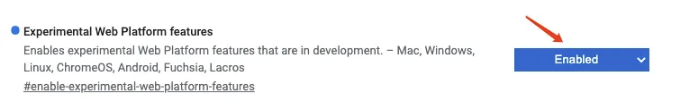

이것은 브라우저에 대한 흥미로운 기능입니다. 곧 CSS에서 중첩 구문을 사용할 수 있게 되어 더 아름답고 깔끔하며 유지보수가 쉬운 코드를 작성할 수 있게 될 겁니다.

# CSS 중첩이란?

프론트엔드 개발자로서, 당신은 분명히 이 CSS 코드에 익숙할 것입니다.

<!-- ui-log 수평형 -->
<ins class="adsbygoogle"
  style="display:block"
  data-ad-client="ca-pub-4877378276818686"
  data-ad-slot="9743150776"
  data-ad-format="auto"
  data-full-width-responsive="true"></ins>
<component is="script">
(adsbygoogle = window.adsbygoogle || []).push({});
</component>

```markdown
```js
<div class="box">
  <p>안녕 중간사이즈</p>
  <div>안녕 파트피쉬</div>
</div>
```

```js
.box{
  배경색: rgba(0, 0, 0, 0.3);
}
```

```js
.box p{
  색: 녹색;
}
.box div{
  색: 빨강;
}
```


```

<!-- ui-log 수평형 -->
<ins class="adsbygoogle"
  style="display:block"
  data-ad-client="ca-pub-4877378276818686"
  data-ad-slot="9743150776"
  data-ad-format="auto"
  data-full-width-responsive="true"></ins>
<component is="script">
(adsbygoogle = window.adsbygoogle || []).push({});
</component>

네, SCSS 또는 Less를 작성해야 된다면 더 쉽게할 수 있어요.

```scss
.box {
  background-color: rgba(0, 0, 0, 0.3);

  p {
    color: green;
  }

  div {
    color: red;
  }
}
```

CSS 중첩을 사용하면 모듈화되고 유지보수가 쉬운 CSS 코드를 작성할 수 있어요.

<!-- ui-log 수평형 -->
<ins class="adsbygoogle"
  style="display:block"
  data-ad-client="ca-pub-4877378276818686"
  data-ad-slot="9743150776"
  data-ad-format="auto"
  data-full-width-responsive="true"></ins>
<component is="script">
(adsbygoogle = window.adsbygoogle || []).push({});
</component>

# 2. CSS에서 선택자를 중첩하는 방법

한 번도 CSS에서 중첩 코드를 직접 작성할 수 있다고 생각하지 않았어요. 위 예제는 어떻게 작성되어야 할까요?

```js
.box{
  background-color: rgba(0, 0, 0, 0.1);

  & p{
    color: green;
  }
  & div{
    color: red;
  }
}
```

<!-- ui-log 수평형 -->
<ins class="adsbygoogle"
  style="display:block"
  data-ad-client="ca-pub-4877378276818686"
  data-ad-slot="9743150776"
  data-ad-format="auto"
  data-full-width-responsive="true"></ins>
<component is="script">
(adsbygoogle = window.adsbygoogle || []).push({});
</component>

네, 중첩을 구현하려면 &만 사용하면 됩니다!

## 3. 크롬 브라우저에서 CSS 중첩 기능을 경험하는 방법

CSS 중첩 기능은 아직 실험 단계에 있는 기능입니다. 위의 코드가 작동하도록 하려면 다음 두 단계를 거쳐야 합니다.

- 크롬 브라우저의 주소 창에 chrome://flags/를 입력합니다.
- 실험 중인 웹 플랫폼 기능을 찾아서 "Enabled"로 설정합니다.

<!-- ui-log 수평형 -->
<ins class="adsbygoogle"
  style="display:block"
  data-ad-client="ca-pub-4877378276818686"
  data-ad-slot="9743150776"
  data-ad-format="auto"
  data-full-width-responsive="true"></ins>
<component is="script">
(adsbygoogle = window.adsbygoogle || []).push({});
</component>

```markdown


# 간단한 영어로 🚀

In Plain English 커뮤니티에 참여해 주셔서 감사합니다! 떠나시기 전에:

- 작가를 칭찬하고 팔로우해주세요 ️👏️️
- 팔로우하기: X | LinkedIn | YouTube | Discord | Newsletter
- 다른 플랫폼 방문하기: Stackademic | CoFeed | Venture | Cubed
- PlainEnglish.io에서 더 많은 콘텐츠 확인하기
```