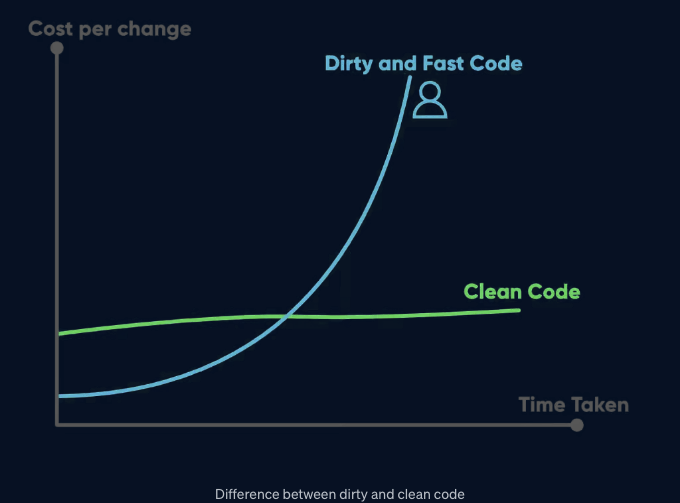
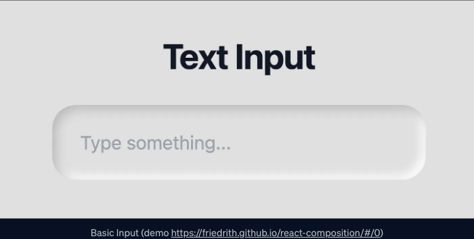
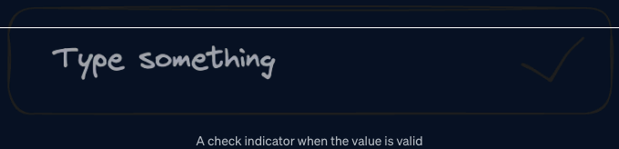

# 깨끗한 코드에 대한 짧은 메모

원하는 대로 코드를 작성하는 건 쉬워요. React에서도 예왽은 아닙니다. React, CSS, 그리고 HTML에 대해 조금 알게 되면 필요한 대부분의 기능을 바로 작성할 수 있어요.

하지만, 코드의 복잡성이 증가할수록지난 후에 팀의 속도가 줄어드는 경우가 많아요. 이것이 더러운 코드와 깨끗한 코드(그리고 나쁜 개발자와 좋은 개발자)를 구분하는 방법입니다.



<!-- ui-log 수평형 -->
<ins class="adsbygoogle"
  style="display:block"
  data-ad-client="ca-pub-4877378276818686"
  data-ad-slot="9743150776"
  data-ad-format="auto"
  data-full-width-responsive="true"></ins>
<component is="script">
(adsbygoogle = window.adsbygoogle || []).push({});
</component>

시간이 흐름에 따라 원활한 개발 속도를 유지하기 위해서는 코드를 3가지 중요한 측면을 통해 깔끔하게 유지하는 것이 중요합니다: 가독성, 확장성, 유지보수성.

이 용어들은 개발 커뮤니티에서 핫한 주제이지만 코드에서 이러한 개념들을 유지하는 방법을 알기가 종종 어렵습니다.

그래서 오늘은 실제 사례를 살펴보기로 했습니다. 저희는 React 컴포넌트에 새로운 기능을 구현해야 하는 경우 개발자가 겪게 되는 상황을 시뮬레이션하겠습니다. 자주 발생하는 나쁜 습관들을 발견하고 이를 피하는 해결책을 찾아보겠습니다.

# 옛날옛날 개발자가 되었던 어느 날...

<!-- ui-log 수평형 -->
<ins class="adsbygoogle"
  style="display:block"
  data-ad-client="ca-pub-4877378276818686"
  data-ad-slot="9743150776"
  data-ad-format="auto"
  data-full-width-responsive="true"></ins>
<component is="script">
(adsbygoogle = window.adsbygoogle || []).push({});
</component>

리액트 개발자로서, 매우 자주 이미 있는 Input 컴포넌트와 같은 컴포넌트가 있습니다:



```js
export interface InputProps {
  value: string | number
  onChange: 
    (value: string, event: React.SyntheticEvent) => void
}

function Input({ value, onChange }: InputProps) {
  return (
    <div className='input-container'>
      <input
        className='input'
        value={value}
        onChange={event => onChange(event.target.value, event)}
        placeholder='Type something...'
      />
    </div>
  )
}

export default function Example() {
  const [value, setValue] = useState('')
  return <Input value={value} onChange={setValue} />
}
```

삶은 아름답습니다 🏝️, 여러분의 컴포넌트는 기본적이고 안정적이며 일을 합니다.

<!-- ui-log 수평형 -->
<ins class="adsbygoogle"
  style="display:block"
  data-ad-client="ca-pub-4877378276818686"
  data-ad-slot="9743150776"
  data-ad-format="auto"
  data-full-width-responsive="true"></ins>
<component is="script">
(adsbygoogle = window.adsbygoogle || []).push({});
</component>

## 기능 n°1

하지만 제품 소유자가 입력 값의 값을 제거하는 선택적 "Clear" 버튼과 같은 첫 번째 기능을 추가하라고 요청합니다. 다음과 같은 모의도면이 있다면 운이 좋을 것입니다:


그래서 기능을 추가하려고 시작하면 가장 간단한 방법은 React 컴포넌트에 속성을 추가하는 것입니다:

<!-- ui-log 수평형 -->
<ins class="adsbygoogle"
  style="display:block"
  data-ad-client="ca-pub-4877378276818686"
  data-ad-slot="9743150776"
  data-ad-format="auto"
  data-full-width-responsive="true"></ins>
<component is="script">
(adsbygoogle = window.adsbygoogle || []).push({});
</component>

```js
export interface InputProps {
  value: string | number,
  onChange: (value: string, event?: React.SyntheticEvent) => void,
  clearable?: boolean
}

function Input({ value, onChange, clearable }: InputProps) {
  return (
    <div className='input-container'>
      <input
        className='input pr-20'
        value={value}
        onChange={event => onChange(event.target.value, event)}
        placeholder='내용을 입력해주세요...'
      />
      {clearable && value && (
        <div className='end-decorator'>
          <button className='button' onClick={() => onChange('')}>
            <XCircleIcon className='h-8 w-8' />
          </button>
        </div>
      )}
    </div>
  )
}

export default function Example() {
  const [value, setValue] = useState('')
  return <Input value={value} onChange={setValue} clearable />
}
```

이것은 작동하고 그리 나쁘지 않으며 여전히 다소 가독성이 좋습니다.

## 기능 n°2

그럼 다른 선택적인 기능이 있었던 것으로 Product Owner (항상 같은 분 😉)가 원하는 제안이 있습니다: 입력값이 일부 유효성 검사와 일치할 때 확인 표시기를 추가하는 것입니다. 다시 한 번 그는 매우 친절하게 목업을 제공해주었습니다:
```

<!-- ui-log 수평형 -->
<ins class="adsbygoogle"
  style="display:block"
  data-ad-client="ca-pub-4877378276818686"
  data-ad-slot="9743150776"
  data-ad-format="auto"
  data-full-width-responsive="true"></ins>
<component is="script">
(adsbygoogle = window.adsbygoogle || []).push({});
</component>

```markdown


뒷일로 돌아와서 컴포넌트에 한 가지 더 추가해보세요:

```js
export interface InputProps {
  value: string | number
  onChange: (value: string, event?: React.SyntheticEvent) => void
  clearable?: boolean
  validityRegex?: RegExp
}

function Input({ value, onChange, clearable, validityRegex }: InputProps) {
  return (
    <div className='input-container'>
      <input
        className='input'
        value={value}
        onChange={event => onChange(event.target.value, event)}
        placeholder='Type something...'
      />
      {clearable && value && (
        <div className='end-decorator'>
          <button className='button' onClick={() => onChange('')}>
            <XCircleIcon className='h-8 w-8' />
          </button>
        </div>
      )}
      {validityRegex.test(`${value}`) && (
        <div className='end-decorator'>
          <CheckIcon className='h-6 w-6 indicator' />
        </div>
      )}
    </div>
  )
}

export default function Example() {
  const [value, setValue] = useState('')
  return (
    <Input 
      value={value}
      onChange={setValue} 
      validityRegex={minLengthRegex}
    />
  )
}
```

## 지금 이 코드는 정말 복잡하네요
```

<!-- ui-log 수평형 -->
<ins class="adsbygoogle"
  style="display:block"
  data-ad-client="ca-pub-4877378276818686"
  data-ad-slot="9743150776"
  data-ad-format="auto"
  data-full-width-responsive="true"></ins>
<component is="script">
(adsbygoogle = window.adsbygoogle || []).push({});
</component>

자, 이제 코드를 분석해보는 시간을 가져봅시다:

- 코드가 읽기 어렵습니다: InputProps 인터페이스를 읽어도 2가지 속성이 상호 배타적인지 알 수 없습니다.
- 코드를 유지보수하기 어렵습니다: 2가지 기능의 코드가 컴포넌트에 섞여 있어서 (스파게티 코드) 디버깅과 리팩토링이 어려워집니다.
- 코드가 확장 가능하지 않습니다: 제품 소유자가 요청한 기능 수에 따라 컴포넌트가 선형적으로 증가할 것입니다. 3년 후를 상상해보세요...

현재는 잘 작동할지 모르지만, 오래 가는 설계가 아니며 새로운 기능을 통합하고 유지하는 속도가 시간이 지날수록 감소할 것입니다.

## 코드가 엉망일 때 어떻게 인식할까요?

<!-- ui-log 수평형 -->
<ins class="adsbygoogle"
  style="display:block"
  data-ad-client="ca-pub-4877378276818686"
  data-ad-slot="9743150776"
  data-ad-format="auto"
  data-full-width-responsive="true"></ins>
<component is="script">
(adsbygoogle = window.adsbygoogle || []).push({});
</component>

문제를 해결하기 전에 잘못되었는지 감지할 수 있는 능력을 갖추는 것이 중요합니다. 다음은 여러 지표입니다:

- 구성 요소에 3-5개 이상의 속성이 추가됨
- 일부 속성이 상호 배타적임
- boolean 타입의 속성을 추가해야 함(https://www.informit.com/articles/article.aspx?p=1392524)
- JSX에서 많은 조건부 렌더링이 필요함

위의 규칙은 고정된 것은 아니지만, 이러한 상황을 경험한다면 적어도 스스로에게 의문을 제기해야 합니다.

# 더 나은 방법은 무엇일까요?

<!-- ui-log 수평형 -->
<ins class="adsbygoogle"
  style="display:block"
  data-ad-client="ca-pub-4877378276818686"
  data-ad-slot="9743150776"
  data-ad-format="auto"
  data-full-width-responsive="true"></ins>
<component is="script">
(adsbygoogle = window.adsbygoogle || []).push({});
</component>

아래는 마크다운 형식으로 테이블을 변경한 코드입니다.

```
| Methods   | Description            |
|-----------|------------------------|
| Open      | Extension에 열려 있음  |
| Closed    | Modification에 닫혀 있음|
```

<!-- ui-log 수평형 -->
<ins class="adsbygoogle"
  style="display:block"
  data-ad-client="ca-pub-4877378276818686"
  data-ad-slot="9743150776"
  data-ad-format="auto"
  data-full-width-responsive="true"></ins>
<component is="script">
(adsbygoogle = window.adsbygoogle || []).push({});
</component>

## React에서 개방/폐쇄 원칙을 적용하는 방법은?

React 18에서 Composition은 컴포넌트를 확장하는 가장 일반적인 방법입니다. children 속성과 매우 인기가 있습니다.

```js
<Parent>
  <Children />
</Parent>
```

그러나 다른 모든 속성과도 작동합니다: 확장의 목표에 대한 자세한 내용을 제공하고 여러 확장 지점을 허용합니다.

<!-- ui-log 수평형 -->
<ins class="adsbygoogle"
  style="display:block"
  data-ad-client="ca-pub-4877378276818686"
  data-ad-slot="9743150776"
  data-ad-format="auto"
  data-full-width-responsive="true"></ins>
<component is="script">
(adsbygoogle = window.adsbygoogle || []).push({});
</component>

```markdown
```js
<Parent property1={ <Children1 />} property2={ <Children2 />} />
```

## Composition을 적용해보세요

첫 번째 요구 사항으로 돌아가서, 입력 부분의 오른쪽 부분을 endDecorator라는 새로운 속성을 사용하여 React Composition을 사용하여 분리하는 것이 쉬울 것입니다.

```js
export interface InputProps {
  value: string | number
  onChange: (value: string, event?: React.SyntheticEvent) => void
  endDecorator?: React.ReactNode
}

function Input({ value, onChange, endDecorator }: InputProps) {
  return (
    <div className='input-container'>
      <input
        className='input'
        value={value}
        onChange={event => onChange(event.target.value, event)}
        placeholder='무엇인가 입력해보세요...'
      />
      {endDecorator}
    </div>
  )
}

function ClearButton({ value, onChange }) {
  return (
    value && (
      <div className='end-decorator'>
        <button className='button' onClick={() => onChange('')}>
          <XCircleIcon className='h-8 w-8' />
        </button>
      </div>
    )
  )
}

export function Example1() {
  const [value, setValue] = useState('')

  return (
    <Input
      value={value}
      onChange={setValue}
      endDecorator={<ClearButton value={value} onChange={setValue} />}
    />
  )
}
```

<!-- ui-log 수평형 -->
<ins class="adsbygoogle"
  style="display:block"
  data-ad-client="ca-pub-4877378276818686"
  data-ad-slot="9743150776"
  data-ad-format="auto"
  data-full-width-responsive="true"></ins>
<component is="script">
(adsbygoogle = window.adsbygoogle || []).push({});
</component>

표 태그를 Markdown 형식으로 변경하세요.

<!-- ui-log 수평형 -->
<ins class="adsbygoogle"
  style="display:block"
  data-ad-client="ca-pub-4877378276818686"
  data-ad-slot="9743150776"
  data-ad-format="auto"
  data-full-width-responsive="true"></ins>
<component is="script">
(adsbygoogle = window.adsbygoogle || []).push({});
</component>

한번 더 코드를 분석해봐요.

- 코드의 가독성이 높아졌어요: 2가지 기능은 상호 배타적으로 설계되어 있어 입력이 무엇을 보여줄 수 있는지 더 잘 보여줘요.
- 코드의 유지보수성이 높아졌어요: 하나의 기능을 디버깅하고 싶을 때 두 가지 기능을 동시에 살펴볼 필요가 없어요. 디버깅이 더 쉽게 됐어요.
- 코드의 확장성이 높아졌어요: Input 컴포넌트를 거의 접하지 않아도 되고 각 새로운 기능을 위한 별도의 파일을 생성할 수 있어요.

# 결론

React로 6년 이상의 경험 후에 말씀 드리지만, 이 React Composition Pattern은 React의 난잡한 코드 중 60%를 정리할 수 있어요.

<!-- ui-log 수평형 -->
<ins class="adsbygoogle"
  style="display:block"
  data-ad-client="ca-pub-4877378276818686"
  data-ad-slot="9743150776"
  data-ad-format="auto"
  data-full-width-responsive="true"></ins>
<component is="script">
(adsbygoogle = window.adsbygoogle || []).push({});
</component>

React Composition 패턴은 일반적인 코드를 촉진하고 여러 구성 요소로 분리하도록 강요하여 거의 좋지 않은 코드를 만듭니다.

기본 속성에서 React Composition 패턴으로 전환해야 할 때를 찾는 것이 중요합니다. 따라서 주의를 기울이고 새로운 속성을 추가할 때 "이 속성이 더 일반적이어야 하는가?" 라는 질문을 스스로에게 물어보세요.

코드 및 데모가 있는 저장소를 여기에서 확인할 수 있습니다: https://github.com/friedrith/react-composition

하지만 아직 완벽하지 않습니다. 여전히 불편한 점이 몇 가지 보입니다. 이러한 기능 중 하나를 사용하여 Input을 인스턴스화하는 코드가 이제 더 길어졌습니다. 이 문제를 해결하기 위해 두 번째 기사를 작성했습니다: https://thibault-friedrich.medium.com/boost-react-composition-with-3-easy-to-use-patterns-codecraftsmanship-5-81e28f6fac53

<!-- ui-log 수평형 -->
<ins class="adsbygoogle"
  style="display:block"
  data-ad-client="ca-pub-4877378276818686"
  data-ad-slot="9743150776"
  data-ad-format="auto"
  data-full-width-responsive="true"></ins>
<component is="script">
(adsbygoogle = window.adsbygoogle || []).push({});
</component>

이 글이 마음에 드셨나요? 👏

안녕하세요! 저는 Thibault라고 합니다. 프런트엔드와 UI/UX 엔지니어로서 UI/UX, 코드 기술, 생산성, 과학 극적인 영역에 열정을 가지고 있습니다. 매달 새로운 기사를 업로드하고 있어요. 이런 주제에 관심이 있다면, 저의 미디엄(medium) 계정을 팔로우해주세요: https://medium.com/@thibault-friedrich.

