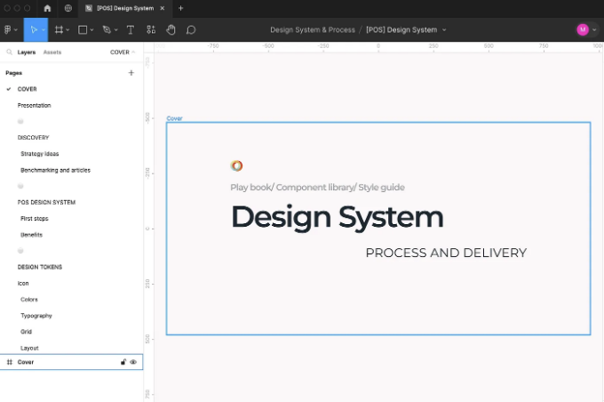

Connect&Go를 위한 디자인 시스템 구축 및 구현

## 회사 소개

Connect&Go는 주로 놀이 공원, 이벤트, 페스티벌 및 엔터테인먼트 장소 분야에서 기술 솔루션을 전문으로 하는 캐나다 회사입니다.

## 제품 소개

<!-- ui-log 수평형 -->
<ins class="adsbygoogle"
  style="display:block"
  data-ad-client="ca-pub-4877378276818686"
  data-ad-slot="9743150776"
  data-ad-format="auto"
  data-full-width-responsive="true"></ins>
<component is="script">
(adsbygoogle = window.adsbygoogle || []).push({});
</component>

회사의 주요 제품은 코넥트(Konnect)라고 하며, 놀이공원이 쉽게 자체 전자 상거래 웹 사이트를 만들 수 있는 화이트 레이블 플랫폼입니다.

## 문제의 맥락

기술 산업의 많은 제품들과 마찬가지로 코넥트는 개발자들에 의해 빠르게 개발되어 왔고, 프로젝트가 사람들의 실제 필요에 초점을 맞추는 사용자 중심의 접근이 거의 없었습니다.

그렇다고 해서, 많은 흐름에서 일관성이 부족했습니다. 언어는 전혀 사용자 친화적이지 않았고, 컴포넌트들은 90년대에 태어나고 자란 것처럼 보였습니다 (멋지고 그런지는 모르겠지만).

<!-- ui-log 수평형 -->
<ins class="adsbygoogle"
  style="display:block"
  data-ad-client="ca-pub-4877378276818686"
  data-ad-slot="9743150776"
  data-ad-format="auto"
  data-full-width-responsive="true"></ins>
<component is="script">
(adsbygoogle = window.adsbygoogle || []).push({});
</component>

우리 모두가 아름답게 꾸며진 요소들은 사용하기 쉬운 것으로 인식된다는 것을 알고 있습니다. 이 인지적 편향은 20세기 심리학자 에드워드 쏜다이크에 의해 소개된 "헬로 효과"라고 불립니다.

또한, 우리 사랑하는 돈 노먼은 디자인의 중요한 측면인 아름다움과 미적 감각이 사용자의 감정적인 반응과 결과적으로 제품에 대한 전반적인 만족도에 영향을 미친다고 인정합니다.

## 프로세스 부재와 업무 병목 현상

만약 인터페이스를 구축할 때 사용자의 존재를 무시하고 만든다면 사용자가 고통받을 것입니다. 이것은 사실입니다. 하지만 이러한 문제는 팀과 그들이 효과적으로 일하고 제품을 전달할 수 있는 방식에도 영향을 미칠 수 있습니다.

<!-- ui-log 수평형 -->
<ins class="adsbygoogle"
  style="display:block"
  data-ad-client="ca-pub-4877378276818686"
  data-ad-slot="9743150776"
  data-ad-format="auto"
  data-full-width-responsive="true"></ins>
<component is="script">
(adsbygoogle = window.adsbygoogle || []).push({});
</component>

조직화되지 않은 구성 요소가 없으면 새로운 화면 흐름을 구축할 때마다 인간 오류가 발생할 수 있습니다.

- 마지막으로 사용한 에러 메시지는 무엇입니까?
- 비활성 버튼의 헥스 코드는 무엇입니까?
- Font Awesome 5를 사용했나요, 아니면 6를 사용했나요?

제품을 만들 때 내린 모든 결정을 기억하는 것은 불가능하죠? 그럼 새로 온 동료는 어떨까요? 진실의 근원이 없으면 그들은 찾는 모든 것을 어떻게 찾을까요?

## 디자인 시스템 구축의 이유?

<!-- ui-log 수평형 -->
<ins class="adsbygoogle"
  style="display:block"
  data-ad-client="ca-pub-4877378276818686"
  data-ad-slot="9743150776"
  data-ad-format="auto"
  data-full-width-responsive="true"></ins>
<component is="script">
(adsbygoogle = window.adsbygoogle || []).push({});
</component>

회사를 위한 디자인 시스템을 구축한다는 것은 매우 꼼꼼하고 조직적인 방식으로 모든 구성 요소를 카탈로그화하는 것을 의미합니다. Figma 파일에 OCD가 들어간다고 해도 상관없어요!

중요한 것은 사용자들이 일관된 시각적 및 텍스트 패턴을 볼 수 있도록하여 흐름이 더 쉽고 즐겁게 이동할 수 있도록 하는 것입니다.

제품 팀은 또한 잘 알려진 진실의 원천을 가지는 것이 이득입니다. 이는 개발자들이 버튼을 한 번만 개발하고 나머지 시간에 재사용할 수 있게 되며, QA는 오류 메시지에서 무엇을 기대해야 하는지 정확히 알 게 되고, 디자이너는 필요한 모든 것을 손에 넣고 훨씬 빠르게 디자인하게 됩니다. 모두가 행복해집니다.

## 디자인 시스템 전문가의 역할

<!-- ui-log 수평형 -->
<ins class="adsbygoogle"
  style="display:block"
  data-ad-client="ca-pub-4877378276818686"
  data-ad-slot="9743150776"
  data-ad-format="auto"
  data-full-width-responsive="true"></ins>
<component is="script">
(adsbygoogle = window.adsbygoogle || []).push({});
</component>

제품의 모든 화면, 상호 작용 및 마이크로 상호 작용을 매핑하고 사용자의 실제 필요에 중점을 두는 구성 요소 라이브러리를 만들어 보세요.

사용자 및 고객 만족팀과 같은 중요 이해 관계자와 대화하는 것은 디자인 시스템 구축을 안내할 지식을 수집하는 데 정말 중요합니다.

우수 사례를 기준으로 하는 것은 동료 디자이너들이 아이디어, 프로세스 및 구성요소를 어떻게 구성하는지 배우는 멋진 방법입니다.

## 도구

<!-- ui-log 수평형 -->
<ins class="adsbygoogle"
  style="display:block"
  data-ad-client="ca-pub-4877378276818686"
  data-ad-slot="9743150776"
  data-ad-format="auto"
  data-full-width-responsive="true"></ins>
<component is="script">
(adsbygoogle = window.adsbygoogle || []).push({});
</component>

Figma. 간단하고 완벽해요.

## 계층 구조

내 안에 살고 있는 세심함을 풀어주고 이 파일을 체계적으로 정리하기 위해 마음을 쏟아주세요. 표지 페이지를 추가하여 프로젝트를 분류하는 것이 중요하며, 의사 결정 뒤에 숨은 전략과 연구에 대한 발표 자료를 준비할 수 있는 공간도 있어요.

## 표지

<!-- ui-log 수평형 -->
<ins class="adsbygoogle"
  style="display:block"
  data-ad-client="ca-pub-4877378276818686"
  data-ad-slot="9743150776"
  data-ad-format="auto"
  data-full-width-responsive="true"></ins>
<component is="script">
(adsbygoogle = window.adsbygoogle || []).push({});
</component>

## 컴포넌트

여기에서 일부 컴포넌트를 볼 수 있어요.

## 최종 제품

<!-- ui-log 수평형 -->
<ins class="adsbygoogle"
  style="display:block"
  data-ad-client="ca-pub-4877378276818686"
  data-ad-slot="9743150776"
  data-ad-format="auto"
  data-full-width-responsive="true"></ins>
<component is="script">
(adsbygoogle = window.adsbygoogle || []).push({});
</component>

죄송하지만 Design Systems에는 그러한 것이 없어요. 우리에게는 버전이 있고, 개발 팀과 명확한 커뮤니케이션을 유지하는 것이 매우 중요합니다. 그렇게 함으로써 항상 최신 업데이트에 대해 인식할 수 있게 해줍니다.

## 함께 하든 말든, 

## 읽어주셔서 감사합니다 ❤️