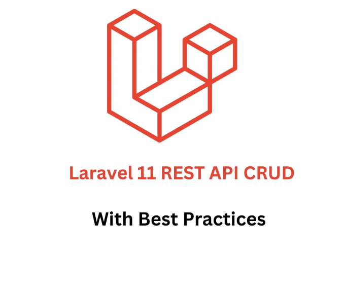
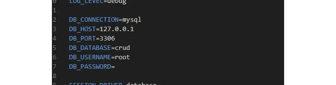

```markdown


라라벨 11에서 RESTful API CRUD 애플리케이션을 만드는 것은 라라벨 애플리케이션 설정, 라우트 정의, 유효성 검사, 모델, 리소스 정의, 컨트롤러 생성, Repository 디자인 패턴 구현 및 모델 작업을 포함합니다. 이를 달성하는 방법에 대한 단계별 가이드는 다음과 같습니다:

## 단계 1: 라라벨 설정

```js
composer create-project --prefer-dist laravel/laravel rest-api-crud
```

<!-- ui-log 수평형 -->
<ins class="adsbygoogle"
  style="display:block"
  data-ad-client="ca-pub-4877378276818686"
  data-ad-slot="9743150776"
  data-ad-format="auto"
  data-full-width-responsive="true"></ins>
<component is="script">
(adsbygoogle = window.adsbygoogle || []).push({});
</component>

## 단계 2: Mysql 데이터베이스 구성

Laravel 11의 기본 DB_CONNECTION은 sqlite입니다. 이를 DB_CONNECTION=mysql로 변경해야 env 파일에 있습니다.



## 단계 03: 마이그레이션과 함께 Product Model 생성

<!-- ui-log 수평형 -->
<ins class="adsbygoogle"
  style="display:block"
  data-ad-client="ca-pub-4877378276818686"
  data-ad-slot="9743150776"
  data-ad-format="auto"
  data-full-width-responsive="true"></ins>
<component is="script">
(adsbygoogle = window.adsbygoogle || []).push({});
</component>

```js
php artisan make:model Product -a
```

## 단계 04: 마이그레이션

database/migrations/YYYY_MM_DD_HHMMSS_create_products_table.php에서 다음과 일치하도록 up 함수를 업데이트하세요.

```js
 public function up(): void
    {
        Schema::create('products', function (Blueprint $table) {
            $table->id();
            $table->string('name');
            $table->string('details');
            $table->timestamps();
        });
    }
```

<!-- ui-log 수평형 -->
<ins class="adsbygoogle"
  style="display:block"
  data-ad-client="ca-pub-4877378276818686"
  data-ad-slot="9743150776"
  data-ad-format="auto"
  data-full-width-responsive="true"></ins>
<component is="script">
(adsbygoogle = window.adsbygoogle || []).push({});
</component>

## 단계 05: 제품 인터페이스 생성

제품 모델을 위한 저장소 인터페이스를 생성하세요. 이 분리는 더 깨끗하고 유지보수가 쉬운 코드를 작성할 수 있게 도와줍니다.

```js
php artisan make:interface /Interfaces/ProductRepositoryInterface
```

Interfaces 폴더 안에 ProductRepositoryInterface.php라는 새 파일을 생성하고 다음 코드를 추가하세요.```

<!-- ui-log 수평형 -->
<ins class="adsbygoogle"
  style="display:block"
  data-ad-client="ca-pub-4877378276818686"
  data-ad-slot="9743150776"
  data-ad-format="auto"
  data-full-width-responsive="true"></ins>
<component is="script">
(adsbygoogle = window.adsbygoogle || []).push({});
</component>

```js
<?php

namespace App\Interfaces;

interface ProductRepositoryInterface
{
    public function index();
    public function getById($id);
    public function store(array $data);
    public function update(array $data,$id);
    public function delete($id);
}
```

## Step 06: 제품 리포지토리 클래스 만들기

Product 모델을 위한 리포지토리 클래스를 만듭니다.

```js
php artisan make:class /Repositories/ProductRepository
```

<!-- ui-log 수평형 -->
<ins class="adsbygoogle"
  style="display:block"
  data-ad-client="ca-pub-4877378276818686"
  data-ad-slot="9743150776"
  data-ad-format="auto"
  data-full-width-responsive="true"></ins>
<component is="script">
(adsbygoogle = window.adsbygoogle || []).push({});
</component>

수업에서 ProductRepository.php라는 새 파일을 만들고 다음 코드를 추가하십시오.

```js
<?php

namespace App\Repository;
use App\Models\Product;
use App\Interfaces\ProductRepositoryInterface;
class ProductReposiotry implements ProductRepositoryInterface
{
    public function index(){
        return Product::all();
    }

    public function getById($id){
       return Product::findOrFail($id);
    }

    public function store(array $data){
       return Product::create($data);
    }

    public function update(array $data,$id){
       return Product::whereId($id)->update($data);
    }
    
    public function delete($id){
       Product::destroy($id);
    }
}
```

## 단계 07: 인터페이스와 구현체를 바인딩하기

해야 할 일은 ProductRepository를 ProductRepositoryInterface에 바인딩하는 것입니다. 이를 서비스 프로바이더를 통해 수행합니다. 다음 명령어를 사용하여 하나를 생성하십시오.

<!-- ui-log 수평형 -->
<ins class="adsbygoogle"
  style="display:block"
  data-ad-client="ca-pub-4877378276818686"
  data-ad-slot="9743150776"
  data-ad-format="auto"
  data-full-width-responsive="true"></ins>
<component is="script">
(adsbygoogle = window.adsbygoogle || []).push({});
</component>

```js
php artisan make:provider RepositoryServiceProvider
```

app/Providers/RepositoryServiceProvider.php 파일을 열고 register 함수를 아래와 일치하도록 업데이트하세요.

```js
<?php

namespace App\Providers;

use Illuminate\Support\ServiceProvider;
use App\Interfaces\ProductRepositoryInterface;
use App\Repository\ProductRepository;
class RepositoryServiceProvider extends ServiceProvider
{
    /**
     * 서비스 등록.
     */
    public function register(): void
    {
        $this->app->bind(ProductRepositoryInterface::class, ProductRepository::class);
    }

    /**
     * 서비스 부트스트랩.
     */
    public function boot(): void
    {
        //
    }
}
```

## 단계 08: 요청 유효성 검사```

<!-- ui-log 수평형 -->
<ins class="adsbygoogle"
  style="display:block"
  data-ad-client="ca-pub-4877378276818686"
  data-ad-slot="9743150776"
  data-ad-format="auto"
  data-full-width-responsive="true"></ins>
<component is="script">
(adsbygoogle = window.adsbygoogle || []).push({});
</component>

두 가지 요청 StoreProductRequest 및 UpdateProductRequest를 만든 후 다음 코드를 추가하세요.

```js
<?php

namespace App\Http\Requests;

use Illuminate\Foundation\Http\FormRequest;
use Illuminate\Http\Exceptions\HttpResponseException;
use Illuminate\Contracts\Validation\Validator;

class StoreProductRequest extends FormRequest
{
    /**
     * 사용자가 이 요청을 수행할 권한이 있는지 확인합니다.
     */
    public function authorize(): bool
    {
        return true;
    }

    /**
     * 요청에 적용되는 유효성 규칙을 가져옵니다.
     *
     * @return array<string, \Illuminate\Contracts\Validation\ValidationRule|array<mixed>|string>
     */
    public function rules(): array
    {
        return [
            'name' => 'required',
            'details' => 'required'
        ];
    }

    public function failedValidation(Validator $validator)
    {
        throw new HttpResponseException(response()->json([
            'success'   => false,
            'message'   => '유효성 검사 오류',
            'data'      => $validator->errors()
        ]));
    }
}
```

```js
<?php

namespace App\Http\Requests;

use Illuminate\Foundation\Http\FormRequest;
use Illuminate\Http\Exceptions\HttpResponseException;
use Illuminate\Contracts\Validation\Validator;

class UpdateProductRequest extends FormRequest
{
    /**
     * 사용자가 이 요청을 수행할 권한이 있는지 확인합니다.
     */
    public function authorize(): bool
    {
        return true;
    }

    /**
     * 요청에 적용되는 유효성 규칙을 가져옵니다.
     *
     * @return array<string, \Illuminate\Contracts\Validation\ValidationRule|array<mixed>|string>
     */
    public function rules(): array
    {
        return [
            'name' => 'required',
            'details' => 'required'
        ];
    }

    public function failedValidation(Validator $validator)
    {
        throw new HttpResponseException(response()->json([
            'success'   => false,
            'message'   => '유효성 검사 오류',
            'data'      => $validator->errors()
        ]));
    }
}
```

## 단계 09: 공통 ApiResponseClass 생성하기

<!-- ui-log 수평형 -->
<ins class="adsbygoogle"
  style="display:block"
  data-ad-client="ca-pub-4877378276818686"
  data-ad-slot="9743150776"
  data-ad-format="auto"
  data-full-width-responsive="true"></ins>
<component is="script">
(adsbygoogle = window.adsbygoogle || []).push({});
</component>

이 흔한 응답 클래스는 가장 좋은 실천 방법입니다. 왜냐하면 응답을 보낼 수 있는 'con' 함수를 사용할 수 있기 때문입니다. 다음 명령을 사용하여 하나를 생성하세요.

```js
php artisan make:class /Classes/ApiResponseClass
```

아래 코드를 추가하세요.

```js
<?php

namespace App\Classes;
use Illuminate\Support\Facades\DB;
use Illuminate\Http\Exceptions\HttpResponseException;
use Illuminate\Support\Facades\Log;
class ApiResponseClass
{
    public static function rollback($e, $message ="문제가 발생했습니다! 프로세스가 완료되지 않았습니다."){
        DB::rollBack();
        self::throw($e, $message);
    }

    public static function throw($e, $message ="문제가 발생했습니다! 프로세스가 완료되지 않았습니다."){
        Log::info($e);
        throw new HttpResponseException(response()->json(["message"=> $message], 500));
    }

    public static function sendResponse($result , $message ,$code=200){
        $response=[
            'success' => true,
            'data'    => $result
        ];
        if(!empty($message)){
            $response['message'] =$message;
        }
        return response()->json($response, $code);
    }

}
```

<!-- ui-log 수평형 -->
<ins class="adsbygoogle"
  style="display:block"
  data-ad-client="ca-pub-4877378276818686"
  data-ad-slot="9743150776"
  data-ad-format="auto"
  data-full-width-responsive="true"></ins>
<component is="script">
(adsbygoogle = window.adsbygoogle || []).push({});
</component>

## 단계 10: 제품 리소스 생성

다음 명령어를 사용하여 하나를 만드세요.

```js
php artisan make:resource ProductResource
```

그리고 다음 코드를 추가하세요.

<!-- ui-log 수평형 -->
<ins class="adsbygoogle"
  style="display:block"
  data-ad-client="ca-pub-4877378276818686"
  data-ad-slot="9743150776"
  data-ad-format="auto"
  data-full-width-responsive="true"></ins>
<component is="script">
(adsbygoogle = window.adsbygoogle || []).push({});
</component>

```javascript
<?php

namespace App\Http\Resources;

use Illuminate\Http\Request;
use Illuminate\Http\Resources\Json\JsonResource;

class ProductResource extends JsonResource
{
    /**
     * 리소스를 배열로 변환합니다.
     *
     * @return array<string, mixed>
     */
    public function toArray(Request $request): array
    {
        return [
            'id' =>$this->id,
            'name' => $this->name,
            'details' => $this->details
        ];
    }
}
```

## 단계 11: ProductController 클래스

저희가 준비한 저장소가 준비되었으니, 컨트롤러에 몇 줄 코드를 추가해봅시다. app/Http/Controllers/ProductController.php 파일을 열고 다음 코드와 일치하도록 업데이트해주세요.

```javascript
<?php

namespace App\Http\Controllers;

use App\Models\Product;
use App\Http\Requests\StoreProductRequest;
use App\Http\Requests\UpdateProductRequest;
use App\Interfaces\ProductRepositoryInterface;
use App\Classes\ResponseClass;
use App\Http\Resources\ProductResource;
use Illuminate\Support\Facades\DB;

class ProductController extends Controller
{
    
    private ProductRepositoryInterface $productRepositoryInterface;
    
    public function __construct(ProductRepositoryInterface $productRepositoryInterface)
    {
        $this->productRepositoryInterface = $productRepositoryInterface;
    }

    /**
     * 리소스 목록을 표시합니다.
     */
    public function index()
    {
        $data = $this->productRepositoryInterface->index();

        return ResponseClass::sendResponse(ProductResource::collection($data),'',200);
    }

    /**
     * 새로운 리소스를 만들기 위한 양식을 표시합니다.
     */
    public function create()
    {
        //
    }

    /**
     * 새로운 리소스를 저장소에 저장합니다.
     */
    public function store(StoreProductRequest $request)
    {
        $details =[
            'name' => $request->name,
            'details' => $request->details
        ];
        DB::beginTransaction();
        try{
             $product = $this->productRepositoryInterface->store($details);

             DB::commit();
             return ResponseClass::sendResponse(new ProductResource($product),'Product Create Successful',201);

        }catch(\Exception $ex){
            return ResponseClass::rollback($ex);
        }
    }

    /**
     * 특정 리소스를 표시합니다.
     */
    public function show($id)
    {
        $product = $this->productRepositoryInterface->getById($id);

        return ResponseClass::sendResponse(new ProductResource($product),'',200);
    }

    /**
     * 특정 리소스를 편집하기 위한 양식을 표시합니다.
     */
    public function edit(Product $product)
    {
        //
    }

    /**
     * 특정 리소스를 저장소에서 업데이트합니다.
     */
    public function update(UpdateProductRequest $request, $id)
    {
        $updateDetails =[
            'name' => $request->name,
            'details' => $request->details
        ];
        DB::beginTransaction();
        try{
             $product = $this->productRepositoryInterface->update($updateDetails,$id);

             DB::commit();
             return ResponseClass::sendResponse('Product Update Successful','',201);

        }catch(\Exception $ex){
            return ResponseClass::rollback($ex);
        }
    }

    /**
     * 특정 리소스를 저장소에서 삭제합니다.
     */
    public function destroy($id)
    {
         $this->productRepositoryInterface->delete($id);

        return ResponseClass::sendResponse('Product Delete Successful','',204);
    }
}
```

<!-- ui-log 수평형 -->
<ins class="adsbygoogle"
  style="display:block"
  data-ad-client="ca-pub-4877378276818686"
  data-ad-slot="9743150776"
  data-ad-format="auto"
  data-full-width-responsive="true"></ins>
<component is="script">
(adsbygoogle = window.adsbygoogle || []).push({});
</component>

## 단계 12: API 라우트

다음 명령을 실행하면 API 라우트 파일을 게시할 수 있습니다:

```js
php artisan install:api
```

컨트롤러에서 정의된 각 메서드를 특정 라우트에 매핑하려면 routes/api.php에 다음 코드를 추가하십시오.

<!-- ui-log 수평형 -->
<ins class="adsbygoogle"
  style="display:block"
  data-ad-client="ca-pub-4877378276818686"
  data-ad-slot="9743150776"
  data-ad-format="auto"
  data-full-width-responsive="true"></ins>
<component is="script">
(adsbygoogle = window.adsbygoogle || []).push({});
</component>

```js
<?php

use Illuminate\Http\Request;
use Illuminate\Support\Facades\Route;
use App\Http\Controllers\ProductController;
Route::get('/user', function (Request $request) {
    return $request->user();
})->middleware('auth:sanctum');


Route::apiResource('/products',ProductController::class);
```

프로젝트를 실행할 수 있습니다.

감사합니다..........