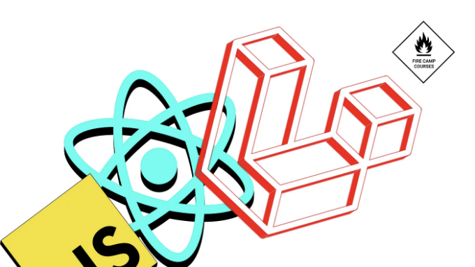
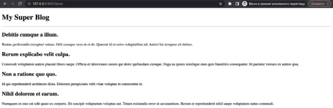
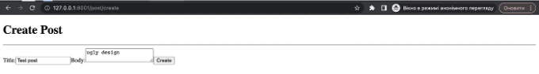

여러분 안녕하세요! 라라벨과 이너셔.js 그리고 리액트를 함께 사용하는 기능을 보여주는 가장 좋은 방법 중 하나는 짧은 기사에서 모두 보여주는 것입니다. 그래서, 이 기사의 주제는 여기에 대해입니다. 전통적으로, 새로운 라라벨 앱을 생성하고 여기에 필요한 모든 종속성을 설치하는 것으로 시작하겠습니다.

# 앱 생성

새로운 라라벨 앱을 생성하는 방법은 원하는대로 사용할 수 있습니다. 제 경우에는 다음과 같은 컴포저 명령어를 사용할 예정입니다:

<!-- ui-log 수평형 -->
<ins class="adsbygoogle"
  style="display:block"
  data-ad-client="ca-pub-4877378276818686"
  data-ad-slot="9743150776"
  data-ad-format="auto"
  data-full-width-responsive="true"></ins>
<component is="script">
(adsbygoogle = window.adsbygoogle || []).push({});
</component>

```js
$ composer create-project laravel/laravel laravel-react-crud
```

새 앱이 생성되면 할 일은 "resources/views/welcome.blade.php" 파일의 이름을 "app.blade.php"로 바꾸고 이 파일 안에 다음 코드를 넣는 것입니다:

```js
<!DOCTYPE html>
<html>
    <head>
        <meta charset="utf-8">
        <meta name="viewport" content="width=device-width, initial-scale=1">
        <title>Laravel</title>
        @viteReactRefresh 
        @vite(['resources/css/app.css', 'resources/js/app.jsx'])
        <!-- 이 글에서는 React 구성요소에 JSX 구문을 사용할 것입니다 -->
        @inertiaHead
    </head>
    <body>
        @inertia
    </body>
</html>
```

또한 Inertia.js의 주요 컴포저 패키지를 설치하는 것을 잊지 마세요.

<!-- ui-log 수평형 -->
<ins class="adsbygoogle"
  style="display:block"
  data-ad-client="ca-pub-4877378276818686"
  data-ad-slot="9743150776"
  data-ad-format="auto"
  data-full-width-responsive="true"></ins>
<component is="script">
(adsbygoogle = window.adsbygoogle || []).push({});
</component>

```js
$ composer require inertiajs/inertia-laravel
```

# 서버 셋업

지금은 Inertia.js의 서버 셋업을 하고 있기 때문에 앱에서 Inertia가 제대로 작동하려면 새로운 미들웨어를 생성해야 합니다. 새로운 미들웨어를 생성하려면 다음 명령을 사용해야 합니다:

```js
$ php artisan inertia:middleware
```

<!-- ui-log 수평형 -->
<ins class="adsbygoogle"
  style="display:block"
  data-ad-client="ca-pub-4877378276818686"
  data-ad-slot="9743150776"
  data-ad-format="auto"
  data-full-width-responsive="true"></ins>
<component is="script">
(adsbygoogle = window.adsbygoogle || []).push({});
</component>

그 명령 이후에, Kernel.php 파일을 열어서 웹 라우트 그룹으로 이동하고, 그 배열 안에 다음 코드 라인을 넣어주세요:

```js
<?php
# app/Http/Kernel.php
// ...
'web' => [
    // ...
    \App\Http\Middleware\HandleInertiaRequests::class,
],
// ...
```

좋아요, 서버 셋업은 끝났습니다, 이제 클라이언트 셋업을 시작하여 앱에서 React를 사용할 수 있게 해보겠습니다.

# 클라이언트 셋업

<!-- ui-log 수평형 -->
<ins class="adsbygoogle"
  style="display:block"
  data-ad-client="ca-pub-4877378276818686"
  data-ad-slot="9743150776"
  data-ad-format="auto"
  data-full-width-responsive="true"></ins>
<component is="script">
(adsbygoogle = window.adsbygoogle || []).push({});
</component>

먼저, NPM이나 Yarn을 사용하여 다음 종속성을 설치하십시오:

```js
$ npm install @inertiajs/inertia-react @inertiajs/react @vitejs/plugin-react react react-dom
```

모든 종속성이 설치되면 "vite.config.js" 파일을 열고 다음 코드를 해당 파일에 넣어 앱의 클라이언트 측을 위해 React를 구성하십시오:

```js
import { defineConfig } from 'vite';
import laravel from 'laravel-vite-plugin';
import react from '@vitejs/plugin-react';

export default defineConfig({
    plugins: [
        react(), // vite.js를 위해 설치한 React 플러그인
        laravel({
            input: ['resources/css/app.css', 'resources/js/app.jsx'],
            refresh: true,
        }),
    ],
});
```

<!-- ui-log 수평형 -->
<ins class="adsbygoogle"
  style="display:block"
  data-ad-client="ca-pub-4877378276818686"
  data-ad-slot="9743150776"
  data-ad-format="auto"
  data-full-width-responsive="true"></ins>
<component is="script">
(adsbygoogle = window.adsbygoogle || []).push({});
</component>

알겠어요. 이제 "resources/js" 폴더 안으로 들어가서 app.js 파일을 삭제하고 "app.jsx"라는 새 파일을 만들어주세요. 그리고 다음 코드를 넣어주세요:

```js
import React from 'react'
import { createRoot } from 'react-dom/client'
import { createInertiaApp } from '@inertiajs/inertia-react'
import { resolvePageComponent } from 'laravel-vite-plugin/inertia-helpers'

createInertiaApp({
    // 아래에서 볼 수 있듯이, resources/js/Pages 폴더에서 모든 React 컴포넌트를 가져올 것입니다.
    resolve: (name) => resolvePageComponent(`./Pages/${name}.jsx`, import.meta.glob('./Pages/**/*.jsx')),
    setup({ el, App, props }) {
        createRoot(el).render(<App {...props} />)
    },
})
```

우리는 방금 클라이언트 측 설치를 완료했습니다. 이제 앱의 백엔드 부분을 시작할 차례입니다.

# CRUD 백엔드 로직

<!-- ui-log 수평형 -->
<ins class="adsbygoogle"
  style="display:block"
  data-ad-client="ca-pub-4877378276818686"
  data-ad-slot="9743150776"
  data-ad-format="auto"
  data-full-width-responsive="true"></ins>
<component is="script">
(adsbygoogle = window.adsbygoogle || []).push({});
</component>

말씀드렸듯이, 이 튜토리얼에서는 간단한 CRUD를 만들고 있습니다. 따라서 포스트 리소스 로직을 갖춘 간단한 어플리케이션을 구축하려고 합니다. 이를 위해 팩토리와 마이그레이션이 적용된 "Post"라는 새 모델을 만들어봅시다:

```js
$ php artisan make:model Post -mf
```

좋아요, 이제 모델의 마이그레이션 파일을 열어서 posts 테이블 내부에 다음과 같은 열을 정의해봅시다:

```js
<?php

# database/migrations/2023_05_14_151218_create_posts_table.php
<?php

use Illuminate\Database\Migrations\Migration;
use Illuminate\Database\Schema\Blueprint;
use Illuminate\Support\Facades\Schema;

return new class extends Migration
{
    /**
     * Run the migrations.
     */
    public function up(): void
    {
        Schema::create('posts', function (Blueprint $table) {
            $table->id();
            $table->string('title');
            $table->text('body');
            $table->timestamps();
        });
    }

    /**
     * Reverse the migrations.
     */
    public function down(): void
    {
        Schema::dropIfExists('posts');
    }
};
```

<!-- ui-log 수평형 -->
<ins class="adsbygoogle"
  style="display:block"
  data-ad-client="ca-pub-4877378276818686"
  data-ad-slot="9743150776"
  data-ad-format="auto"
  data-full-width-responsive="true"></ins>
<component is="script">
(adsbygoogle = window.adsbygoogle || []).push({});
</component>

필요한 모든 필드를 입력했어요. 이제 마이그레이션을 실행해볼게요:

```js
$ php artisan migrate
```

다음 단계는 방금 생성한 모델을 위한 리소스 컨트롤러를 생성해야 해요:

```js
$ php artisan make:controller PostController --resource --model=Post
```

<!-- ui-log 수평형 -->
<ins class="adsbygoogle"
  style="display:block"
  data-ad-client="ca-pub-4877378276818686"
  data-ad-slot="9743150776"
  data-ad-format="auto"
  data-full-width-responsive="true"></ins>
<component is="script">
(adsbygoogle = window.adsbygoogle || []).push({});
</component>

좋아요, 이제 `Post` 팩토리를 열어서 시드로 생성할 예시 게시물에 대한 규칙을 설정해봅시다:

```js
<?php
# database/factories/PostFactory.php

namespace Database\Factories;

use Illuminate\Database\Eloquent\Factories\Factory;

/**
 * @extends \Illuminate\Database\Eloquent\Factories\Factory<\App\Models\Post>
 */
class PostFactory extends Factory
{
    /**
     * Define the model's default state.
     *
     * @return array<string, mixed>
     */
    public function definition(): array
    {
        return [
            'title' => fake()->text(30),
            'body' => fake()->text(200)
        ];
    }
}
```

이제 데이터베이스 시더를 열고, 예시 게시물 10개를 생성해봅시다:

```js
<?php

namespace Database\Seeders;

// use Illuminate\Database\Console\Seeds\WithoutModelEvents;
use Illuminate\Database\Seeder;
use App\Models\Post;

class DatabaseSeeder extends Seeder
{
    /**
     * Seed the application's database.
     */
    public function run(): void
    {
        Post::factory(10)->create();
    }
}
```

<!-- ui-log 수평형 -->
<ins class="adsbygoogle"
  style="display:block"
  data-ad-client="ca-pub-4877378276818686"
  data-ad-slot="9743150776"
  data-ad-format="auto"
  data-full-width-responsive="true"></ins>
<component is="script">
(adsbygoogle = window.adsbygoogle || []).push({});
</component>

그럼 이제 시더 플래그를 사용하여 모든 마이그레이션을 실행해 봅시다:

```js
$ php artisan migrate:fresh --seed
```

그래요, 그리고 이제 우리는 데이터베이스에 있는 모든 포스트들을 보여줄 새로운 리액트 컴포넌트를 만들어 봅시다:

```js
// resources/js/Pages 폴더 안에 새로운 컴포넌트를 생성합니다
// 파일 이름은 Index.jsx 로 지정합니다
export default function Index({ posts }) {
    return (
        <>
            <h1>나의 수퍼 블로그</h1>
            <hr/>
            { posts && posts.map((item) => (
                <div key={item.id}>
                    <h2>{item.title}</h2>
                    <p>{item.body}</p>
                </div>
            ))}
        </>
    )
}
```

<!-- ui-log 수평형 -->
<ins class="adsbygoogle"
  style="display:block"
  data-ad-client="ca-pub-4877378276818686"
  data-ad-slot="9743150776"
  data-ad-format="auto"
  data-full-width-responsive="true"></ins>
<component is="script">
(adsbygoogle = window.adsbygoogle || []).push({});
</component>

위에서 볼 수 있듯이, 이것은 정말 간단한 컴포넌트입니다. 이제 이미 만든 Post 컨트롤러 내에서 다음 코드로 이 컴포넌트를 렌더링할 시간입니다:

```js
<?php
// app\Http\Controllers\PostController.php
namespace App\Http\Controllers;

use App\Models\Post;
use Illuminate\Http\Request;
use Inertia\Inertia; // Inertia 클래스를 렌더링하기 위해 임포트

class PostController extends Controller
{
    /**
     * 리소스의 목록 표시
     */
    public function index()
    {
        // 데이터베이스에서 포스트를 가져와 컴포넌트에서 생성한 프롭에 제공합니다.
        return Inertia::render('Index', [
            'posts' => Post::all()
        ]);
    }

    // ...
}
```

마지막으로, 라우트 파일 내에 새로운 라우트를 추가합시다:

```js
<?php
// routes/web.php
use Illuminate\Support\Facades\Route;
use App\Http\Controllers\PostController;

/*
|--------------------------------------------------------------------------
| 웹 라우트
|--------------------------------------------------------------------------
|
| 여기에서 애플리케이션의 웹 라우트를 등록할 수 있습니다. 이 라우트들은 RouteServiceProvider에 로드되며
| 모두 "web" 미들웨어 그룹에 할당됩니다. 멋진 것을 만들어보세요!
|
*/

Route::get('/', function () {
    return view('welcome');
});

Route::resource('/post', PostController::class);
```

<!-- ui-log 수평형 -->
<ins class="adsbygoogle"
  style="display:block"
  data-ad-client="ca-pub-4877378276818686"
  data-ad-slot="9743150776"
  data-ad-format="auto"
  data-full-width-responsive="true"></ins>
<component is="script">
(adsbygoogle = window.adsbygoogle || []).push({});
</component>

로컬 서버 및 Vite.js 서버를 실행하는 것을 잊지 마세요:

```js
$ php artisan serve
$ npm run dev
```

브라우저에서 결과를 확인해 보세요:



<!-- ui-log 수평형 -->
<ins class="adsbygoogle"
  style="display:block"
  data-ad-client="ca-pub-4877378276818686"
  data-ad-slot="9743150776"
  data-ad-format="auto"
  data-full-width-responsive="true"></ins>
<component is="script">
(adsbygoogle = window.adsbygoogle || []).push({});
</component>

멋지네요! 이제 다음 주제로 넘어가서 폼을 처리해볼게요.

# React와 Inertia.js로 폼 다루기

이제 포스트 생성을 위한 새로운 컴포넌트를 만들 시간입니다:

```js
// resources/js/Pages/Create.jsx
import React, { useState } from 'react';
import { router } from '@inertiajs/react' // POST 요청을 만들기 위해 이 라우터를 가져와야 해요

export default function Create() {
    const [values, setValues] = useState({ // 폼 필드
        title: "",
        body: ""
    });

    // 아래 함수를 사용해서
    // 폼 입력에서 값을 가져올 거예요
    function handleChange(e) {
        const key = e.target.id;
        const value = e.target.value
        setValues(values => ({
            ...values,
            [key]: value,
        }))
    }

    // 이 함수는 우리 폼 데이터를
    // PostContoller의 store 함수로 보낼 거에요
    function handleSubmit(e) {
        e.preventDefault()
        router.post('/post', values)
    }

    return (
        <>
            <h1>포스트 만들기</h1>
            <hr/>
            <form onSubmit={handleSubmit}>
                {/* 여기서 input 필드를 만드는 방법에 주목하세요 */}
                <label htmlFor="title">제목:</label>
                <input id="title" value={values.title} onChange={handleChange} />

                <label htmlFor="body">내용:</label>
                <textarea id="body" value={values.body} onChange={handleChange}></textarea>
                <button type="submit">만들기</button>
            </form>
        </>
    )
}
```

<!-- ui-log 수평형 -->
<ins class="adsbygoogle"
  style="display:block"
  data-ad-client="ca-pub-4877378276818686"
  data-ad-slot="9743150776"
  data-ad-format="auto"
  data-full-width-responsive="true"></ins>
<component is="script">
(adsbygoogle = window.adsbygoogle || []).push({});
</component>

우리가 해야 할 다음 일은 포스트 컨트롤러에 함수를 생성하고 저장하는 코드를 작성하는 것입니다:

```js
<?php

namespace App\Http\Controllers;

use App\Models\Post;
use Illuminate\Http\Request;
use Inertia\Inertia;

class PostController extends Controller
{
    /**
     * 자료 목록을 표시합니다.
     */
    public function index()
    {
        return Inertia::render('Index', [
            'posts' => Post::all()
        ]);
    }

    /**
     * 새 자료를 생성하는 양식을 표시합니다.
     */
    public function create()
    {
        return Inertia::render('Create');
    }

    /**
     * 새로운 자료를 저장소에 저장합니다.
     */
    public function store(Request $request)
    {
        // 이 함수는 간단한 CRUD 예제이기 때문에 어떠한 유효성 검사도 하지 않습니다.
        Post::create([
            'title' => $request->title,
            'body' => $request->body
        ]);
    }
    
    // ...
}
```

또한, 새 포스트를 저장할 때 모든 변수를 채우기 위해 포스트 모델에 $guarded 변수를 추가하겠습니다:

```js
<?php
// app\Models\Post.php
namespace App\Models;

use Illuminate\Database\Eloquent\Factories\HasFactory;
use Illuminate\Database\Eloquent\Model;

class Post extends Model
{
    use HasFactory;

    protected $guarded = [];
}
```

<!-- ui-log 수평형 -->
<ins class="adsbygoogle"
  style="display:block"
  data-ad-client="ca-pub-4877378276818686"
  data-ad-slot="9743150776"
  data-ad-format="auto"
  data-full-width-responsive="true"></ins>
<component is="script">
(adsbygoogle = window.adsbygoogle || []).push({});
</component>

Boom! 한 번 테스트해 보자 🔥



제출 버튼을 클릭한 후 게시물 페이지로 돌아가서 만든 게시물을 보려면 아래로 스크롤하세요:


<!-- ui-log 수평형 -->
<ins class="adsbygoogle"
  style="display:block"
  data-ad-client="ca-pub-4877378276818686"
  data-ad-slot="9743150776"
  data-ad-format="auto"
  data-full-width-responsive="true"></ins>
<component is="script">
(adsbygoogle = window.adsbygoogle || []).push({});
</component>

만약 모든 것을 올바르게 했다면 — 당신은 당신의 게시물을 페이지 맨 끝에 볼 것입니다. 그러니 여기에서 양식을 처리하는 방법을 배우고, 우리 CRUD 예제를 마무리해야 합니다. 따라서 편집, 업데이트, 표시, 그리고 삭제 기능을 만들어 봅시다.

# 게시물 편집 및 업데이트

우선, Create.jsx 컴포넌트를 복사하여 Edit.jsx라는 새로운 컴포넌트를 만들어 봅시다:
```js
// resources/js/Pages/Edit.jsx
import React, { useState } from 'react';
import { router } from '@inertiajs/react'

export default function Edit({ post }) {
    const [values, setValues] = useState({ // Form fields
        title: post.title,
        body: post.title
    });

    function handleChange(e) {
        const key = e.target.id;
        const value = e.target.value
        setValues(values => ({
            ...values,
            [key]: value,
        }))
    }

    function handleSubmit(e) {
        e.preventDefault()
        router.put(`/post/${post.id}`, values)
    }

    return (
        <>
            <h1>Edit Post</h1>
            <hr/>
            <form onSubmit={handleSubmit}>
                <label htmlFor="title">Title:</label>
                <input id="title" value={values.title} onChange={handleChange} />

                <label htmlFor="body">Body:</label>
                <textarea id="body" value={values.body} onChange={handleChange}></textarea>
                <button type="submit">Update</button>
            </form>
        </>
    )
}
``` 

<!-- ui-log 수평형 -->
<ins class="adsbygoogle"
  style="display:block"
  data-ad-client="ca-pub-4877378276818686"
  data-ad-slot="9743150776"
  data-ad-format="auto"
  data-full-width-responsive="true"></ins>
<component is="script">
(adsbygoogle = window.adsbygoogle || []).push({});
</component>

이제 편집 페이지를 렌더링하고 게시물을 업데이트하는 코드를 작성하세요:

```js
<?php

namespace App\Http\Controllers;

use App\Models\Post;
use Illuminate\Http\Request;
use Inertia\Inertia;

class PostController extends Controller
{
    // ...

    /**
     * 특정 리소스를 편집하는 양식을 보여줍니다.
     */
    public function edit(Post $post)
    {
        return Inertia::render('Edit', [
            'post' => $post
        ]);
    }

    /**
     * 스토리지에 있는 특정 리소스를 업데이트합니다.
     */
    public function update(Request $request, Post $post)
    {
        $post->update([
            'title' => $request->title,
            'body' => $request->body
        ]);
    }
    
    // ...
}
```

테스트를 진행한 후, 쇼 컴포넌트에 대한 코드를 작성하세요 (특별한 것은 없습니다 — 단지 프롭에서 내용을 표시합니다):

```js
// resources/js/Pages/Show.jsx
export default function Show({ post }) {
    return (
        <>
            <h1>{post.title}</h1>
            <hr/>
            <p>{post.body}</p>
        </>
    )
}
```

<!-- ui-log 수평형 -->
<ins class="adsbygoogle"
  style="display:block"
  data-ad-client="ca-pub-4877378276818686"
  data-ad-slot="9743150776"
  data-ad-format="auto"
  data-full-width-responsive="true"></ins>
<component is="script">
(adsbygoogle = window.adsbygoogle || []).push({});
</component>

다음 코드를 사용하여 함수를 보여주세요(그리고 여기에는 특별한 것이 없습니다, 그냥 간단한 렌더링 호출입니다):

```js
namespace App\Http\Controllers;

use App\Models\Post;
use Illuminate\Http\Request;
use Inertia\Inertia;

class PostController extends Controller
{
    // ...
    
    /**
     * Display the specified resource.
     */
    public function show(Post $post)
    {
        return Inertia::render('Show', [
            'post' => $post
        ]);
    }
     
    // ...
}
```

검토하고 다음 함수인 게시물 삭제에 대한 마지막 기능으로 이동하겠습니다.

# 게시물 삭제 함수

<!-- ui-log 수평형 -->
<ins class="adsbygoogle"
  style="display:block"
  data-ad-client="ca-pub-4877378276818686"
  data-ad-slot="9743150776"
  data-ad-format="auto"
  data-full-width-responsive="true"></ins>
<component is="script">
(adsbygoogle = window.adsbygoogle || []).push({});
</component>

아무것도 특별한 것은 없을 거에요. 그냥 하나의 함수 호출이 있을 뿐입니다.

```js
<?php

namespace App\Http\Controllers;

use App\Models\Post;
use Illuminate\Http\Request;
use Inertia\Inertia;

class PostController extends Controller
{
    // ...

    /**
     * 저장소에서 지정된 리소스를 삭제합니다.
     */
    public function destroy(Post $post)
    {
        $post->delete();
    }
}
```

그리고 이 함수를 어디서 호출할 건가요? Index.jsx 컴포넌트에서, 이렇게 호출할 수 있다고 보여드릴게요:

```js
import { router } from '@inertiajs/react'

export default function Index({ posts }) {
    function deletePost( id ) {
        router.delete(`/post/${id}`);
    }

    return (
        <>
            <h1>나의 멋진 블로그</h1>
            <hr/>
            { posts && posts.map( (item) => (
                <div key={item.id}>
                    <h2>{item.title}</h2>
                    <p>{item.body}</p>
                    <button type="button" onClick={() => deletePost(item.id)}>삭제</button>
                </div>
            )) }
        </>
    )
}
```

<!-- ui-log 수평형 -->
<ins class="adsbygoogle"
  style="display:block"
  data-ad-client="ca-pub-4877378276818686"
  data-ad-slot="9743150776"
  data-ad-format="auto"
  data-full-width-responsive="true"></ins>
<component is="script">
(adsbygoogle = window.adsbygoogle || []).push({});
</component>

위의 코드를 실행해보시면 요청이 수행되고 게시물이 사라지는 것을 확인할 수 있습니다.

# 결론

앞서 말했듯이, 이 글에서는 React, Inertia, 그리고 Laravel을 사용한 매우 간단한 CRUD 예제를 만들어보겠습니다. React와 Inertia.js와 같은 주제는 Laravel 애플리케이션을 구축하려는 경우 개발 중에 사용할 수 있는 모든 기능과 기능을 보여주는 별도의 비디오가 필요합니다.

이번 튜토리얼은 여기서 마무리하겠습니다. 읽어주셔서 감사합니다 🤘🔥