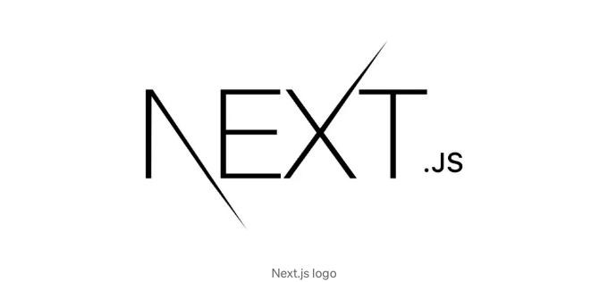
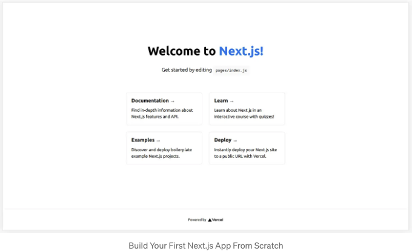
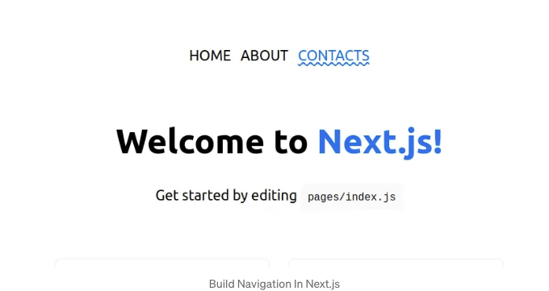
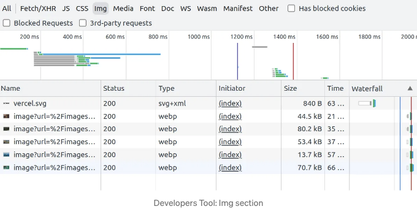
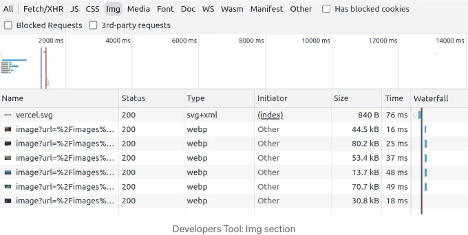
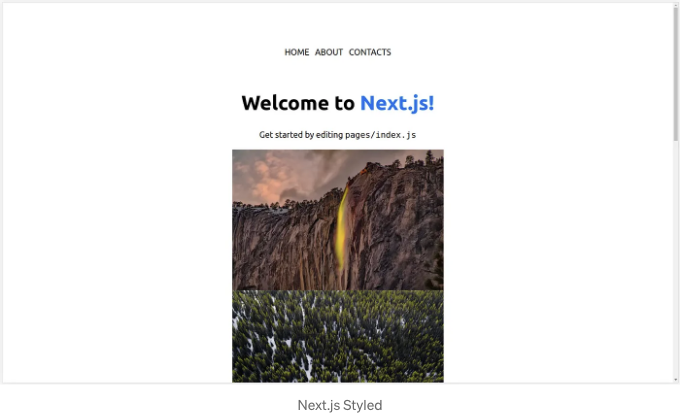
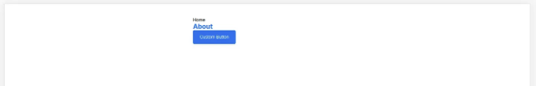

## NEXT.JS

이 게시물을 통해 Next.js 앱을 처음부터 만드는 데 도움을 받을 수 있지만, 이에 도전하기 전에 HTML, CSS, JavaScript, React 및 관련 웹 개발 개념에 대한 약간의 지식이 있어야 합니다.

- 두 번째 부분
- Next.js에서 날씨 앱 만들기
- 워크샵

# 워크샵

<!-- ui-log 수평형 -->
<ins class="adsbygoogle"
  style="display:block"
  data-ad-client="ca-pub-4877378276818686"
  data-ad-slot="9743150776"
  data-ad-format="auto"
  data-full-width-responsive="true"></ins>
<component is="script">
(adsbygoogle = window.adsbygoogle || []).push({});
</component>

무료 Next.js 워크샵에 참여하고 싶다면 계속 연락을 유지해요.

기억을 새롭게 하고 싶다면 JavaScript에서 React로 섹션을 확인하는 것이 좋아요.



이 시리즈의 게시물들은 간단한 블로그를 만들면서 Next.js의 기본을 소개해줘요.

<!-- ui-log 수평형 -->
<ins class="adsbygoogle"
  style="display:block"
  data-ad-client="ca-pub-4877378276818686"
  data-ad-slot="9743150776"
  data-ad-format="auto"
  data-full-width-responsive="true"></ins>
<component is="script">
(adsbygoogle = window.adsbygoogle || []).push({});
</component>

아래 주제를 다룰 예정입니다:

- 페이지 라우터와 링크 컴포넌트를 사용해 내비게이션을 구축하는 방법,
- 이미지 컴포넌트를 사용하는 방법과 그 이유,
- 글로벌 및 로컬 CSS,
- 사용자 정의 컴포넌트 작성,
- 데이터 가져오기 (SSG, SSR) 및 사전 렌더링

이 게시물은 시리즈 중 첫 번째로, 처음 네 가지 항목을 다룹니다.

저는 무료 Next.js 워크샵을 준비 중입니다. 관심 있으시면 언제든 참여해 주세요.

<!-- ui-log 수평형 -->
<ins class="adsbygoogle"
  style="display:block"
  data-ad-client="ca-pub-4877378276818686"
  data-ad-slot="9743150776"
  data-ad-format="auto"
  data-full-width-responsive="true"></ins>
<component is="script">
(adsbygoogle = window.adsbygoogle || []).push({});
</component>

# 설정

Node.js 16.8 이상이 설치되어 있는지 확인하세요. 터미널에서 `node -v`를 실행하여 설치 여부를 확인할 수 있습니다.

다음을 실행하세요

```js
npx create-next-app@latest blog --use-npm --example "https://github.com/vercel/next-learn/tree/master/basics/learn-starter"
```

<!-- ui-log 수평형 -->
<ins class="adsbygoogle"
  style="display:block"
  data-ad-client="ca-pub-4877378276818686"
  data-ad-slot="9743150776"
  data-ad-format="auto"
  data-full-width-responsive="true"></ins>
<component is="script">
(adsbygoogle = window.adsbygoogle || []).push({});
</component>

터미널에서.

이 스크립트는 Vercel에서 Next.js 블로그 템플릿을 설치할 것입니다. 설치에 필요한 모든 것을 수락하세요. 예를 들어 create-next-app@latest.

이 시점에서, 프로젝트 폴더로 이동하기 위해 cd blog를 사용하고 다음을 실행하세요.

```js
npm run dev
```

<!-- ui-log 수평형 -->
<ins class="adsbygoogle"
  style="display:block"
  data-ad-client="ca-pub-4877378276818686"
  data-ad-slot="9743150776"
  data-ad-format="auto"
  data-full-width-responsive="true"></ins>
<component is="script">
(adsbygoogle = window.adsbygoogle || []).push({});
</component>

브라우저에서 Next.js 앱을 시작하려면 다음의 단계를 따르세요. 템플릿 앱은 http://localhost:3000/에서 이용할 수 있으며 다음과 같이 보일 것입니다:



## 애플리케이션 구조

우리가 주로 다룰 코드는 pages/index.js 안에 있지만, 다른 폴더들이 무엇인지와 언제 사용해야 하는지도 알아볼 것입니다.

<!-- ui-log 수평형 -->
<ins class="adsbygoogle"
  style="display:block"
  data-ad-client="ca-pub-4877378276818686"
  data-ad-slot="9743150776"
  data-ad-format="auto"
  data-full-width-responsive="true"></ins>
<component is="script">
(adsbygoogle = window.adsbygoogle || []).push({});
</component>

아래에서는 애플리케이션 구조 및 각 최상위 폴더와 파일에 대한 간단한 설명을 확인할 수 있어요.

- .next 폴더는 Next.js 빌드 과정 중 자동으로 생성됩니다. Next.js 앱의 컴파일 및 최적화된 출력물을 담고 있으며, 앱을 올바르게 실행하기 위한 정보를 제외한 모든 정보가 들어 있어요.
- node_modules는 프로젝트가 의존하는 모든 외부 패키지와 라이브러리를 포함하고 있어요.
- pages에는 애플리케이션의 서로 다른 페이지나 경로를 나타내는 React 컴포넌트가 들어 있어요. 이 폴더의 각 파일은 고유한 URL에 해당하며, 그 다음 섹션에서 자세히 살펴볼 거에요.
- public에는 이미지, 폰트 및 다른 파일과 같이 어떤 처리 없이 제공되어야 하는 정적 자산이 들어 있어요.
- styles에는 CSS 또는 SCSS 파일들이 들어 있어요. 우리는 CSS 파일을 다른 곳에 저장하는 것이 좋은 경우가 있어요.

이 표준 구조는 앱에서 효율적인 유지 관리와 관심사 분리를 가능케 해 줍니다. 그대로 유지하는 것이 좋은 아이디어에요:)

<!-- ui-log 수평형 -->
<ins class="adsbygoogle"
  style="display:block"
  data-ad-client="ca-pub-4877378276818686"
  data-ad-slot="9743150776"
  data-ad-format="auto"
  data-full-width-responsive="true"></ins>
<component is="script">
(adsbygoogle = window.adsbygoogle || []).push({});
</component>

# 내비게이션

2023년 5월 4일부터 (Next.js 13.4) Next.js에는 두 가지 안정적인 라우터가 있습니다:

- 페이지 라우터
- 앱 라우터

이 글에서는 가장 일반적인 페이지 라우터를 사용합니다. 나중에 앱 라우터로 마이그레이션할 예정입니다.

<!-- ui-log 수평형 -->
<ins class="adsbygoogle"
  style="display:block"
  data-ad-client="ca-pub-4877378276818686"
  data-ad-slot="9743150776"
  data-ad-format="auto"
  data-full-width-responsive="true"></ins>
<component is="script">
(adsbygoogle = window.adsbygoogle || []).push({});
</component>

마침내, 다른 게시물에서 앞으로 인기가 많을 수 있는 App 라우터를 사용하여 다른 앱을 만들 것입니다.

어떻게 어떤 라우터를 사용하는지 알 수 있을까요?

- 지시 사항을 따라 Next.js 블로그 템플릿을 복제했다면 Pages 라우터를 사용 중입니다.
- 페이지 폴더만 있고 앱 폴더가 없다면 Pages 라우터를 사용 중입니다.
- 한편, 앱 폴더가 있는 경우 (페이지 폴더가 있는 경우나 없는 경우) App 라우터를 사용 중일 수 있습니다. 불행하게도, Pages 라우터에서 App 라우터로의 마이그레이션을 지원하기 위해, 동일한 앱에서 두 가지를 모두 사용할 수 있습니다.

이 게시물에서는 Pages 라우터를 사용합니다.

<!-- ui-log 수평형 -->
<ins class="adsbygoogle"
  style="display:block"
  data-ad-client="ca-pub-4877378276818686"
  data-ad-slot="9743150776"
  data-ad-format="auto"
  data-full-width-responsive="true"></ins>
<component is="script">
(adsbygoogle = window.adsbygoogle || []).push({});
</component>

## 페이지 라우터 및 네비게이션

Next.js에서 페이지는 pages 폴더의 파일에서 내보낸 React 구성 요소입니다.
이를 이해하는 것은 매우 중요합니다. 왜냐하면 각 페이지가 경로와 관련이 있기 때문입니다. 다시 말해, Next.js의 각 페이지는 사용자가 액세스할 수 있는 고유한 URL에 해당합니다.

예를 들어, pages 폴더에 두 개의 JavaScript 파일을 추가한다고 가정해 봅시다.

- pages/about.js는 About이라는 React 구성 요소를 내보냅니다.
- pages/contacts.js는 Contacts라는 React 구성 요소를 내보냅니다.

<!-- ui-log 수평형 -->
<ins class="adsbygoogle"
  style="display:block"
  data-ad-client="ca-pub-4877378276818686"
  data-ad-slot="9743150776"
  data-ad-format="auto"
  data-full-width-responsive="true"></ins>
<component is="script">
(adsbygoogle = window.adsbygoogle || []).push({});
</component>

기본 설정으로 Next.js는 /about 및 /contacts라는 두 개의 루트를 만들고 해당 루트에서 About 및 Contacts 컴포넌트가 렌더링됩니다.

## 페이지 추가

위에서 말한 대로, 나는 페이지 폴더 안에 다음과 같은 컴포넌트를 각각 About과 Contacts라는 이름으로 생성했습니다.

```js
// pages/about.js
export default function About() {
  return <h2>About</h2>
}
```

<!-- ui-log 수평형 -->
<ins class="adsbygoogle"
  style="display:block"
  data-ad-client="ca-pub-4877378276818686"
  data-ad-slot="9743150776"
  data-ad-format="auto"
  data-full-width-responsive="true"></ins>
<component is="script">
(adsbygoogle = window.adsbygoogle || []).push({});
</component>

```js
// pages/contacts.js
export default function Contacts() {
  return <h2>연락처</h2>
}
```

그게 다야! URL을 http://localhost:3000/about로 변경하면 왼쪽 상단에 "About" 텍스트가 있는 흰색 페이지가 나타납니다.

방금 파일 기반의 라우팅 시스템을 만들었습니다!

## 탐색 추가하기

<!-- ui-log 수평형 -->
<ins class="adsbygoogle"
  style="display:block"
  data-ad-client="ca-pub-4877378276818686"
  data-ad-slot="9743150776"
  data-ad-format="auto"
  data-full-width-responsive="true"></ins>
<component is="script">
(adsbygoogle = window.adsbygoogle || []).push({});
</component>

다음 단계는 사용자가 URL을 수동으로 변경하지 않고 다른 페이지로 이동할 수 있는 간단한 탐색 표시줄을 만드는 것입니다.

Next.js에서는 일반 `a` 태그 대신 `Link` 컴포넌트를 사용해야 합니다. 그러나 가장 중요한 속성들은 동일합니다.

문서에 따르면 "`Link`는 항로 간 사전로드 및 클라이언트 측 항로 간 탐색을 제공하기 위해 HTML `a` 요소를 확장하는 React 컴포넌트입니다. Next.js에서 항로 간 탐색의 주요 방법이 됩니다."

클라이언트 측 탐색은 페이지 이동이 JavaScript를 사용하여 발생하므로 브라우저가 수행하는 기본 탐색보다 빠릅니다.

<!-- ui-log 수평형 -->
<ins class="adsbygoogle"
  style="display:block"
  data-ad-client="ca-pub-4877378276818686"
  data-ad-slot="9743150776"
  data-ad-format="auto"
  data-full-width-responsive="true"></ins>
<component is="script">
(adsbygoogle = window.adsbygoogle || []).push({});
</component>

다음 예시에서 확인할 수 있듯이 Link 컴포넌트를 간단히 사용하며 href 속성에 올바른 경로를 할당합니다.

첫 번째 Link는 "home" 페이지로 이동하고(e.g. pages/index.js), 두 번째 Link는 About 페이지로 이동합니다(e.g. pages/about.js).

```js
<Link href="/">홈</Link>
<Link href="/about">소개</Link>
```

Link 컴포넌트는 전반적으로 여러 가지 이점을 제공합니다:

<!-- ui-log 수평형 -->
<ins class="adsbygoogle"
  style="display:block"
  data-ad-client="ca-pub-4877378276818686"
  data-ad-slot="9743150776"
  data-ad-format="auto"
  data-full-width-responsive="true"></ins>
<component is="script">
(adsbygoogle = window.adsbygoogle || []).push({});
</component>

- 사전 로드: Next.js는 사용자가 링크 구성 요소 위로 마우스를 올리거나 초점을 맞출 때 연결된 페이지를 자동으로 백그라운드에서 사전 로드합니다. 리소스가 미리로드되어 지연이 감소합니다.
- 클라이언트 측 내비게이션: 페이지 간 이동이 전체 페이지 새로 고침을 발생시키지 않습니다. 이는 빠른 내비게이션 및 페이지 간 부드러운 전환을 제공하여 사용자 경험을 향상시킵니다.
- SEO 최적화: 검색 엔진 크롤러가 Link 구성 요소를 사용하여 링크를 따라가므로 색인, 발견 및 SEO가 향상됩니다.

다시 예시로 돌아가 보겠습니다.

다음 코드로 기본 내비게이션 메뉴를 구현해 봅시다. index.js에 다음 코드를 작성하세요. 반드시 next/link에서 Link를 가져와야 합니다.

```js
// pages/index.js

...
import Link from 'next/link';

export default function Home() {
  return (
    <div className={styles.container}>
      <Head> ... </Head>

      <main>
        <div>
          <Link href="/">홈</Link>
          <Link href="/about">소개</Link>
          <Link href="/contacts">연락처</Link>
        </div>
        
        ...
  )
}
```

<!-- ui-log 수평형 -->
<ins class="adsbygoogle"
  style="display:block"
  data-ad-client="ca-pub-4877378276818686"
  data-ad-slot="9743150776"
  data-ad-format="auto"
  data-full-width-responsive="true"></ins>
<component is="script">
(adsbygoogle = window.adsbygoogle || []).push({});
</component>

약간의 스타일을 추가하면 다음과 같은 효과를 얻을 수 있습니다. 이 글에서는 나중에 CSS에 대해 더욱 추가할 예정입니다.



비슷한 방법으로, About 또는 Contacts에서 Home으로 이동하는 링크를 추가할 것입니다. (이 글의 index.js)

About (pages/about.js)에서는 코드가 다음과 같이 됩니다.

<!-- ui-log 수평형 -->
<ins class="adsbygoogle"
  style="display:block"
  data-ad-client="ca-pub-4877378276818686"
  data-ad-slot="9743150776"
  data-ad-format="auto"
  data-full-width-responsive="true"></ins>
<component is="script">
(adsbygoogle = window.adsbygoogle || []).push({});
</component>

```js
import Link from 'next/link';

export default function About() {
  return <>
    <Link href="/">홈</Link>
    <div>소개</div>
  </>
}
```

`Link` 컴포넌트를 사용하여 클라이언트 측 내비게이션을 할 때 페이지 전체를 새로 고침하지 않습니다. 그러나 Next.js 애플리케이션 외부의 외부 페이지로 링크해야 할 경우 문서에서 언급된대로 `a` 태그를 사용하면 됩니다.

연락처 페이지는 유사한 패턴을 따르며 여기에 표시되지 않습니다. 그러나 게시물 끝에 GitHub 리포지토리에 대한 링크를 찾을 수 있습니다.

언급할 두 가지 사항이 있습니다:```

<!-- ui-log 수평형 -->
<ins class="adsbygoogle"
  style="display:block"
  data-ad-client="ca-pub-4877378276818686"
  data-ad-slot="9743150776"
  data-ad-format="auto"
  data-full-width-responsive="true"></ins>
<component is="script">
(adsbygoogle = window.adsbygoogle || []).push({});
</component>

- 코드 분할: Next.js는 코드를 자동으로 분할하여 요청된 코드만 로드합니다. 이로 인해 앱에 많은 다른 페이지가 있더라도 랜딩 페이지가 빠르게 로드됩니다.
- 미리로딩: 프로덕션 환경(앱이 배포되어 사용자에게 제공 중인 경우)에서 Next.js는 자동으로 연결된 페이지의 코드를 백그라운드에서 미리로드합니다. 위 예시에서 Home 페이지(예: index.js)를 열 때 About와 Contacts가 백그라운드에서 로드됩니다.

간단한 블로그를 만들고자 하는 경우 다음 섹션을 건너뛰고 "Next.js에 이미지 추가하기"로 이동할 수 있습니다.

## 페이지 라우터 및 동적 라우팅에 대해 더 알아보기

많은 웹사이트와 블로그에서는 지금까지 생성한 간단한 라우팅 구조가 충분할 수 있습니다. 그러나 경우에 따라 동일한 페이지에서 다른 데이터를 표시하기 위해 더 세밀한 라우팅 시스템이 필요할 수 있습니다.

<!-- ui-log 수평형 -->
<ins class="adsbygoogle"
  style="display:block"
  data-ad-client="ca-pub-4877378276818686"
  data-ad-slot="9743150776"
  data-ad-format="auto"
  data-full-width-responsive="true"></ins>
<component is="script">
(adsbygoogle = window.adsbygoogle || []).push({});
</component>

여기 몇 가지 예시가 있어요:

- 같은 페이지에서 제품 1 또는 제품 2 등을 보여줄 수 있는 제품 페이지. URL은 /products/book12, /products/mouse452와 같습니다.
- 같은 페이지에서 사용자 1 또는 사용자 2 등을 보여줄 수 있는 사용자 페이지. URL은 /user/1, /user/2와 같습니다.

이러한 상황에서는 우리는 미리 알 수 없는 URL 세그먼트를 고려할 수 있도록 라우팅 시스템을 수정해야 합니다. 이는 사용자가 /user/2로 이동할 수도 있고 아닐 수도 있기 때문에 해당 세그먼트를 모르는 것이죠.

하지만 사용자가 /user/2로 이동한다면 사용자 2에 대한 데이터를 표시해야 하며 사용자 1이나 다른 사용자의 데이터를 표시해서는 안 됩니다. 따라서 URL의 마지막 세그먼트가 변경될 수 있고 미리 알 수 없습니다. 이를 동적 세그먼트라고 합니다.

<!-- ui-log 수평형 -->
<ins class="adsbygoogle"
  style="display:block"
  data-ad-client="ca-pub-4877378276818686"
  data-ad-slot="9743150776"
  data-ad-format="auto"
  data-full-width-responsive="true"></ins>
<component is="script">
(adsbygoogle = window.adsbygoogle || []).push({});
</component>

Next.js 규칙에 따르면 "다이나믹 세그먼트는 폴더 이름을 대괄호로 감싸서 생성할 수 있습니다: [폴더이름]. 예를 들어, [id] 또는 [slug]." 

따라서 Next.js에서 users/[userId].js라는 파일은 각 페이지마다 userId 매개변수가 다를 수 있는 동적 경로를 나타냅니다.

다이나믹 라우팅의 예시를 만들어보기 위해 pages/users/[userId].js를 생성해봅시다.

```js
import { useRouter } from 'next/router';

export default function Users() {
  const router = useRouter();
  const { userId } = router.query;

  return (
    <div>
      <h1>사용자 프로필</h1>
      <p>사용자 ID: {userId}</p>
    </div>
  );
};
```

<!-- ui-log 수평형 -->
<ins class="adsbygoogle"
  style="display:block"
  data-ad-client="ca-pub-4877378276818686"
  data-ad-slot="9743150776"
  data-ad-format="auto"
  data-full-width-responsive="true"></ins>
<component is="script">
(adsbygoogle = window.adsbygoogle || []).push({});
</component>

users/[userId].js 파일은 동적 경로를 나타내며 [userId] 부분은 변경될 수 있는 파라미터를 나타냅니다. 예를 들어 Dynamic Segment입니다. 다음 URL로 변경하면 다음 URL을 볼 수 있습니다:

- http://localhost:3000/users/1
- http://localhost:3000/users/kUrwwer34w
- http://localhost:3000/users/Hanna

Users 컴포넌트에서 다른 데이터가 표시됨을 알 수 있습니다.

컴포넌트 내에서 우리는 Next.js에서 useRouter를 가져와 router 객체에 액세스합니다. useRouter 훅을 사용하면 현재 경로 및 쿼리 매개변수에 대한 정보에 액세스할 수 있습니다.

<!-- ui-log 수평형 -->
<ins class="adsbygoogle"
  style="display:block"
  data-ad-client="ca-pub-4877378276818686"
  data-ad-slot="9743150776"
  data-ad-format="auto"
  data-full-width-responsive="true"></ins>
<component is="script">
(adsbygoogle = window.adsbygoogle || []).push({});
</component>

현재 경로의 쿼리 매개변수를 나타내는 router.query에서 userId 매개변수를 얻습니다. 그런 다음 userId 값을 사용하여 사용자 데이터를 가져오거나 해당 ID의 사용자에게 특정한 논리를 수행할 수 있습니다.

마지막으로, 검색된 userId를 포함한 사용자 프로필 정보를 표시하는 기본적인 UI를 렌더링합니다.

우리는 방금 Next.js에서 동적 경로를 만들었습니다. 사용자 ID는 URL에서 추출하여 동적 콘텐츠를 렌더링하는 데 사용할 수 있습니다.

# Next.js에 이미지 추가하기

<!-- ui-log 수평형 -->
<ins class="adsbygoogle"
  style="display:block"
  data-ad-client="ca-pub-4877378276818686"
  data-ad-slot="9743150776"
  data-ad-format="auto"
  data-full-width-responsive="true"></ins>
<component is="script">
(adsbygoogle = window.adsbygoogle || []).push({});
</component>

Next.js는 이미지(또는 다른 정적 자산)를 추가할 수 있는 public 폴더를 제공합니다. 이 패턴은 React에서도 동일합니다.

이 예에서 저는 public 폴더 내에 이미지 폴더를 만들었습니다. 여기에 여섯 개의 이미지를 추가하고, 다음과 같이 index.js에서 사용했습니다.

```js
<Image
  src="/images/eugene-z0j9Qf9jZ58-unsplash.jpg"
  height={400}
  width={600}
  alt="Unsplash의 Eugene에 의한 사진"
/>
```

주의하세요

<!-- ui-log 수평형 -->
<ins class="adsbygoogle"
  style="display:block"
  data-ad-client="ca-pub-4877378276818686"
  data-ad-slot="9743150776"
  data-ad-format="auto"
  data-full-width-responsive="true"></ins>
<component is="script">
(adsbygoogle = window.adsbygoogle || []).push({});
</component>

- `img` 태그 대신 `Image` 컴포넌트를 사용합니다. `img` 태그를 사용할 수도 있지만, Next.js는 앱에서 이미지를 최적화하기 위해 `Image` 컴포넌트를 사용하는 것을 권장합니다.
- 이미지의 소스는 `public` 폴더부터 시작하는 경로여야 합니다.
- 높이와 너비 속성은 소스 이미지와 동일한 비율을 유지해야 합니다.

반드시 `next/image`에서 `Image` 컴포넌트를 index.js 파일 상단에 가져와야 합니다.

```js
// pages/index.js

...
import Link from 'next/link';
import Image from 'next/image'
```

현재 애플리케이션은 이렇게 보입니다.

<!-- ui-log 수평형 -->
<ins class="adsbygoogle"
  style="display:block"
  data-ad-client="ca-pub-4877378276818686"
  data-ad-slot="9743150776"
  data-ad-format="auto"
  data-full-width-responsive="true"></ins>
<component is="script">
(adsbygoogle = window.adsbygoogle || []).push({});
</component>


이미지 컴포넌트를 사용하는 이미지는 기본적으로 lazy-loading됩니다. 이는 이미지가 뷰포트로 스크롤되는대로 로드되기 때문에 정말 멋진 기능입니다.

이미지가 lazy-loading되는 것을 확인하려면 개발자 도구를 열고 Img 섹션으로 이동하면 됩니다.



<!-- ui-log 수평형 -->
<ins class="adsbygoogle"
  style="display:block"
  data-ad-client="ca-pub-4877378276818686"
  data-ad-slot="9743150776"
  data-ad-format="auto"
  data-full-width-responsive="true"></ins>
<component is="script">
(adsbygoogle = window.adsbygoogle || []).push({});
</component>

이 경우에는 처음에 5개의 이미지만 로드됩니다. 아래로 스크롤하면 뷰포트에 진입하기 전에 여섯 번째 이미지가 자동으로 로드됩니다.



이로써 초반에 어플리케이션이 적은 데이터를로드하게 되며, 이는 Google 순위에 영향을주는 누적 레이아웃 시프트를 줄일 수 있습니다.

더 나아가 이미지 유형은 webp입니다. 브라우저가 지원하는 경우 WebP와 같은 현대적인 형식으로 이미지를 제공하기 위해 이미지 구성 요소를 사용하는 것이 좋습니다.

<!-- ui-log 수평형 -->
<ins class="adsbygoogle"
  style="display:block"
  data-ad-client="ca-pub-4877378276818686"
  data-ad-slot="9743150776"
  data-ad-format="auto"
  data-full-width-responsive="true"></ins>
<component is="script">
(adsbygoogle = window.adsbygoogle || []).push({});
</component>

Image 구성 요소를 사용하는 장점 중 몇 가지를 소개해드릴게요:

- 자동 이미지 최적화: 기기와 브라우저에 따라 가장 효율적인 형식과 크기로 이미지를 최적화합니다.
- 반응형 및 적응형 이미지: 서로 다른 화면 크기에 대해 다른 이미지 소스를 지정할 수 있어요.
- 내장된 지연 로딩: 이미지는 뷰포트에 들어올 때에만 로드됩니다.
- 접근성 및 SEO 친화적: alt 태그와 같은 접근성 속성을 자동으로 추가합니다. 이를 통해 검색 엔진 가시성이 향상되고 애플리케이션의 전반적인 접근성이 개선됩니다.

# CSS — Next.js에서 스타일링하기

이제 페이지 폴더 밖으로 나가서 styles 폴더 안으로 들어가보세요. 거기에는 두 개의 파일이 있을 거에요.

<!-- ui-log 수평형 -->
<ins class="adsbygoogle"
  style="display:block"
  data-ad-client="ca-pub-4877378276818686"
  data-ad-slot="9743150776"
  data-ad-format="auto"
  data-full-width-responsive="true"></ins>
<component is="script">
(adsbygoogle = window.adsbygoogle || []).push({});
</component>

- global.css
- Home.module.css

이것들은 각각 전역 스타일과 로컬 스타일을 가리킵니다.

## 전역 스타일

전역 CSS는 앱 내 모든 요소에 영향을 미칩니다. 이상적으로 보일 수 있지만, 전역 CSS는 CSS 번들의 크기를 키우고 애플리케이션이 성장함에 따라 스타일을 관리하기 어렵게 만듭니다.

<!-- ui-log 수평형 -->
<ins class="adsbygoogle"
  style="display:block"
  data-ad-client="ca-pub-4877378276818686"
  data-ad-slot="9743150776"
  data-ad-format="auto"
  data-full-width-responsive="true"></ins>
<component is="script">
(adsbygoogle = window.adsbygoogle || []).push({});
</component>

여기에 몇 가지만 추가하고 싶다고 했어요.

지금 'About'과 'Contacts'에서 사용 중인 모든 h2 태그에 스타일을 추가하려고 해요.

```js
/* styles/global.css */

...
h2 {
  color: #0070f3;
}
```

이 시점에서는 아무 일도 일어나지 않아요.

<!-- ui-log 수평형 -->
<ins class="adsbygoogle"
  style="display:block"
  data-ad-client="ca-pub-4877378276818686"
  data-ad-slot="9743150776"
  data-ad-format="auto"
  data-full-width-responsive="true"></ins>
<component is="script">
(adsbygoogle = window.adsbygoogle || []).push({});
</component>

당신의 애플리케이션의 모든 페이지를 감싸는 최상위 React 구성 요소에서 global.css를 prop으로 전달해야 하는 이유입니다.

상태 관리 솔루션에 익숙하다면 이것을 매우 유사하게 찾을 것입니다.

이 솔루션은 페이지 간 이동 시 상태를 유지하는 최상위 React 구성 요소를 활용합니다. 우리의 경우에는 Next.js 애플리케이션에 전역 스타일을 추가하는 데 사용할 것입니다.

global.css를 사용하려면 다음 내용을 포함하는 파일인 pages/_app.js를 생성하세요.

<!-- ui-log 수평형 -->
<ins class="adsbygoogle"
  style="display:block"
  data-ad-client="ca-pub-4877378276818686"
  data-ad-slot="9743150776"
  data-ad-format="auto"
  data-full-width-responsive="true"></ins>
<component is="script">
(adsbygoogle = window.adsbygoogle || []).push({});
</component>

```js
// pages/_app.js

import '../styles/global.css';

export default function App({ Component, pageProps }) {
  return <Component {...pageProps} />;
}
```

먼저 styles 디렉토리에서 global.css 파일을 가져옵니다. global.css에는 앱 전체에 적용될 CSS가 포함되어 있습니다.

두 번째 코드 조각은 Next.js 애플리케이션에서 주요 구성 요소가 될 default로 내보내는 App이라는 함수를 정의합니다. 다시 말하자면, App 구성 요소는 애플리케이션의 모든 페이지를 랩핑하는 최상위 React 구성 요소가 될 것입니다. 앞에서 말했듯이, 이는 페이지 간 이동 시 상태를 유지하는 데에도 사용할 수 있습니다.

App 구성 요소는 두 개의 props를 받습니다: Component와 pageProps.```

<!-- ui-log 수평형 -->
<ins class="adsbygoogle"
  style="display:block"
  data-ad-client="ca-pub-4877378276818686"
  data-ad-slot="9743150776"
  data-ad-format="auto"
  data-full-width-responsive="true"></ins>
<component is="script">
(adsbygoogle = window.adsbygoogle || []).push({});
</component>

- Component 프롭은 애플리케이션이 그 순간에 보여주는 페이지 컴포넌트를 나타냅니다. 이유로 대문자 "C"를 가지고 있습니다.
- pageProps 프롭은 서버 측 렌더링이나 정적 생성 중에 컴포넌트에 전달된 초기 프롭을 포함하는 객체입니다.

마지막으로, App 함수는 Component와  pageProps를 펼쳐서 반환합니다. 이렇게 하면 pageProps가 Component에 개별적인 프롭으로 사용할 수 있게 됩니다.

파일을 생성한 후 개발 서버를 다시 시작해주세요.

이 시점에서, About과 Contacts의 h2 태그에 전역 스타일이 적용되었음을 확인할 수 있어야 합니다.

<!-- ui-log 수평형 -->
<ins class="adsbygoogle"
  style="display:block"
  data-ad-client="ca-pub-4877378276818686"
  data-ad-slot="9743150776"
  data-ad-format="auto"
  data-full-width-responsive="true"></ins>
<component is="script">
(adsbygoogle = window.adsbygoogle || []).push({});
</component>

테이블 태그를 마크다운 형식으로 변경해주세요.

<!-- ui-log 수평형 -->
<ins class="adsbygoogle"
  style="display:block"
  data-ad-client="ca-pub-4877378276818686"
  data-ad-slot="9743150776"
  data-ad-format="auto"
  data-full-width-responsive="true"></ins>
<component is="script">
(adsbygoogle = window.adsbygoogle || []).push({});
</component>

```js
/* styles/Home.module.css */

...
.navContainer {
  display: flex;
  justify-content: space-around;
  width: 300px;
  padding: 0 1rem;
  margin: 3rem auto 6rem;
  font-size: 1.5rem;
}

.customLink {
  text-decoration: none;
  color: black;
  text-transform: uppercase;
  padding: 0 0.5rem;
}

.customLink:hover {
  cursor: pointer;
  color: #0070f3;
  text-decoration: #0070f3 wavy underline;
}
...
```

그런 다음 index.js에서 스타일을 import합니다.

```js
// pages/index.js

import Head from 'next/head';
import styles from '../styles/Home.module.css';
import Link from 'next/link';
import Image from 'next/image'

export default function Home() {
  return (
    <div className={styles.container}>
      <Head> ... </Head>

      <main>
        <div className={styles.navContainer}>
          <Link className={styles.customLink} href="/">Home</Link>
          <Link className={styles.customLink} href="/about">About</Link>
          <Link className={styles.customLink} href="/contacts">Contacts</Link>
        </div>
        <h1 className={styles.title}> ... </h1>
        ...
  )
}
```

이 스타일을 적용하면 앱이 아래 사진처럼 보입니다.```

<!-- ui-log 수평형 -->
<ins class="adsbygoogle"
  style="display:block"
  data-ad-client="ca-pub-4877378276818686"
  data-ad-slot="9743150776"
  data-ad-format="auto"
  data-full-width-responsive="true"></ins>
<component is="script">
(adsbygoogle = window.adsbygoogle || []).push({});
</component>

```markdown


비슷한 방식으로 React 컴포넌트를 만들고 CSS 모듈을 사용하여 다른 클래스나 스타일과 충돌하지 않도록 스타일을 지정할 수 있습니다.

예를 들어 사용자 지정 버튼을 만들어 봅시다.

## 커스텀 버튼 컴포넌트
```

<!-- ui-log 수평형 -->
<ins class="adsbygoogle"
  style="display:block"
  data-ad-client="ca-pub-4877378276818686"
  data-ad-slot="9743150776"
  data-ad-format="auto"
  data-full-width-responsive="true"></ins>
<component is="script">
(adsbygoogle = window.adsbygoogle || []).push({});
</component>

문서의 레이아웃 컴포넌트 예제를 따라하면, 먼저 components라는 최상위 디렉토리를 만듭니다.

components 안에는 Button 컴포넌트와 관련된 모든 파일을 포함할 Button 폴더를 만듭니다.

components/Button 안에 button.js라는 파일을 만들어 다음 내용을 추가합니다:

```js
// button.js

import styles from './button.module.css'

export const Button = ({ children }) => {
  return (
    <button className={styles.button}>
      <div className={styles.buttonContent}>{children}</div>
    </button>
  )
}
```

<!-- ui-log 수평형 -->
<ins class="adsbygoogle"
  style="display:block"
  data-ad-client="ca-pub-4877378276818686"
  data-ad-slot="9743150776"
  data-ad-format="auto"
  data-full-width-responsive="true"></ins>
<component is="script">
(adsbygoogle = window.adsbygoogle || []).push({});
</component>

그럼, CSS Modules를 사용하여 Button 컴포넌트에 몇 가지 스타일을 추가하여 React 컴포넌트에서 CSS 파일을 가져올 수 있습니다.

다음 내용을 포함하는 components/Button/button.module.css 라는 파일을 생성합니다:

```js
/* button.module.css */

.button {
  position: relative;
  cursor: pointer;
  background: var(--color);
  color: var(--bg-color);
  border: 1px solid transparent;
  box-shadow: 0 4px 4px 0 #00000010;
  padding: 12px 24px;
  line-height: 1.5em;
  border-radius: 5px;
  max-width: 100%;
  font-weight: 400;
  font-size: 1rem;
  display: flex;
  justify-content: center;
  align-items: center;
}

.buttonContent {
  text-overflow: ellipsis;
  white-space: nowrap;
  overflow: hidden;
  display: inline-block;
}

.button:hover,
.button:focus {
  border-color: var(--color);
  background-color: var(--bg-color);
  color: var(--color);
}

.button:active {
  background-color: var(--bg-color-1);
}
```

앱이 성장 중이고 페이지 및 컴포넌트 전반에 걸쳐 일관된 색상을 사용하고자 하기 때문에 주의하세요.

<!-- ui-log 수평형 -->
<ins class="adsbygoogle"
  style="display:block"
  data-ad-client="ca-pub-4877378276818686"
  data-ad-slot="9743150776"
  data-ad-format="auto"
  data-full-width-responsive="true"></ins>
<component is="script">
(adsbygoogle = window.adsbygoogle || []).push({});
</component>

```js
background: var(--color);
```

색상은 전역 CSS 파일인 global.css에서 선언되어 옵니다:

```js
/* styles/global.css */

...
:root {
  --bg-color: #fff;
  --bg-color-0: rgba(124, 120, 135, 0.15);
  --bg-color-1: rgb(243, 244, 247);

  --color: rgb(0, 112, 243);
  --color-1: rgb(35, 41, 49);
  --color-2: rgb(49, 52, 59);
}
```

About 페이지나 다른 곳에서 다음과 같이 버튼을 사용할 수 있습니다:

<!-- ui-log 수평형 -->
<ins class="adsbygoogle"
  style="display:block"
  data-ad-client="ca-pub-4877378276818686"
  data-ad-slot="9743150776"
  data-ad-format="auto"
  data-full-width-responsive="true"></ins>
<component is="script">
(adsbygoogle = window.adsbygoogle || []).push({});
</component>

```js
// pages/about.js

import Link from 'next/link';
import { Button } from '../components/Button/button';

export default function About() {
  return <div className='about'>
    <Link href="/">Home</Link>
    <h2>About</h2>
    <Button>Custom Button</Button>
  </div>
}
```

비슷하게, 문서는 함수 키워드를 사용하여 Layout 컴포넌트를 생성하고 내보냅니다.

Next.js에서 "레이아웃은 여러 페이지간에 공유되는 UI입니다. 탐색 시 레이아웃은 상태를 유지하고 상호작용하며 다시 렌더링되지 않습니다. 레이아웃은 중첩될 수도 있습니다."

나중에 이것이 더 명확해질 것입니다. 그러나 About 컴포넌트의 내용을 Layout으로 감싸 시작할 수 있습니다.```

<!-- ui-log 수평형 -->
<ins class="adsbygoogle"
  style="display:block"
  data-ad-client="ca-pub-4877378276818686"
  data-ad-slot="9743150776"
  data-ad-format="auto"
  data-full-width-responsive="true"></ins>
<component is="script">
(adsbygoogle = window.adsbygoogle || []).push({});
</component>



이전 내용은 GitHub에서 확인할 수 있습니다.

# 요약

이번 글에서는 템플릿을 기반으로 초기 Next.js 앱을 구축했습니다. 다룬 내용은 다음과 같습니다:

<!-- ui-log 수평형 -->
<ins class="adsbygoogle"
  style="display:block"
  data-ad-client="ca-pub-4877378276818686"
  data-ad-slot="9743150776"
  data-ad-format="auto"
  data-full-width-responsive="true"></ins>
<component is="script">
(adsbygoogle = window.adsbygoogle || []).push({});
</component>

- Next.js 폴더 구조
- 페이지 라우터와 링크 컴포넌트를 사용한 내비게이션
- URL의 다이나믹 세그먼트
- 이미지 최적화를 위한 이미지 컴포넌트
- 전역 및 로컬 CSS
- CSS 모듈을 사용한 사용자 정의 컴포넌트 작성

다음 글에서는 현재 애플리케이션에 데이터 가져오기와 사전 렌더링을 포함할 예정입니다.

아래 두 번째 부분을 참조하세요.