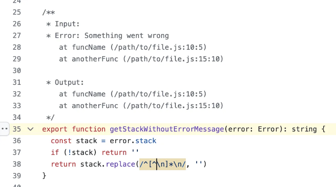

이 강의는 Nextjs 소스 코드에서 가져왔어요. 이 글에서는 정규 표현식이 무엇을 하는지 설명하는 예제와 함께 주석을 추가하는 것이 왜 유용한지 배우게 될 거에요.

## format-server-error.ts

저는 create-error-handler.tsx에서 import한 format-server-error.ts에서 이름이 `formatServerError(err)`인 함수를 발견했어요. Next.js에는 도우미 함수를 위한 lib 폴더가 있고, 이 함수들과 파일들은 전부 단일 책임 원칙을 따라요. 이 말은 파일이 문맥에 맞고 단 하나의 일만 하는 함수를 가지고 있는 것을 의미해요. 이렇게 하면 코드베이스가 모듈화되어 가독성이 높아져요.

## 정규 표현식을 설명하세요

<!-- ui-log 수평형 -->
<ins class="adsbygoogle"
  style="display:block"
  data-ad-client="ca-pub-4877378276818686"
  data-ad-slot="9743150776"
  data-ad-format="auto"
  data-full-width-responsive="true"></ins>
<component is="script">
(adsbygoogle = window.adsbygoogle || []).push({});
</component>

```markdown


`getStackWithoutErrorMessage` 함수는 이름이 길지만 메시지를 명확히 전달합니다. 이 함수는 하나의 일을 합니다. 하는 일을 설명하는 함수 이름을 작성하는 데 도움을 줍니다.

```js
/**
 * 입력:
 * Error: Something went wrong
    at funcName (/path/to/file.js:10:5)
    at anotherFunc (/path/to/file.js:15:10)
 
 * 출력:
    at funcName (/path/to/file.js:10:5)
    at anotherFunc (/path/to/file.js:15:10) 
 */
```

정규 표현식을 작성하는 것이 멋지지만 예시와 함께 하는 주석은 미래의 본인과 다른 개발자에게 그 정규 표현식이 무엇을 하는지 이해하는 데 도움이 됩니다.
```

<!-- ui-log 수평형 -->
<ins class="adsbygoogle"
  style="display:block"
  data-ad-client="ca-pub-4877378276818686"
  data-ad-slot="9743150776"
  data-ad-format="auto"
  data-full-width-responsive="true"></ins>
<component is="script">
(adsbygoogle = window.adsbygoogle || []).push({});
</component>

저는 chatGPT에게 정규 표현식 `/^[^\n]*\n/`을 설명해달라고 요청했어요.

정규 표현식 /^[^\n]*\n/을 다음과 같이 분해할 수 있어요:

- /: 정규 표현식의 구분자예요. 이것은 정규식 패턴의 시작과 끝을 표시해요.
- ^: 시작 앵커로, 이것은 표현식이 줄의 시작과 일치해야 한다는 의미예요.
- [^\n]*: 이것은 캐릭터 클래스로, 새 줄 문자(\n)를 제외한 모든 문자와 일치해요. * 수량자는 앞의 요소의 0회 이상 발생을 의미해요. 따라서 [^\n]*는 새 줄 문자가 아닌 0회 이상의 문자와 일치해요.
- \n: 이것은 새 줄 문자와 일치해요.

이를 모두 종합하면:

<!-- ui-log 수평형 -->
<ins class="adsbygoogle"
  style="display:block"
  data-ad-client="ca-pub-4877378276818686"
  data-ad-slot="9743150776"
  data-ad-format="auto"
  data-full-width-responsive="true"></ins>
<component is="script">
(adsbygoogle = window.adsbygoogle || []).push({});
</component>

- `/^[^\n]*\n/`은 패턴을 매치합니다. 이 패턴은 줄의 처음부터 시작하여 새 줄이 아닌 문자들이 0개 이상 나오며, 줄 바꿈 문자로 끝납니다. 이 패턴은 기본적으로 텍스트 한 줄 전체에 일치합니다.

# 결론

create-error-handler.tsx에서 가져온 format-server-error.ts에서 import된 `formatServerError(err)`라는 함수를 만났습니다. Next.js에는 도움 함수를 위한 lib 폴더가 있으며 이러한 함수와 파일들은 단일 책임 원칙을 따릅니다. 이것은 파일이 상황에 적합하고 하나의 일만 수행하는 함수가 있는 것을 의미합니다. 이렇게 함으로써 코드베이스가 모듈화되고 가독성이 좋아집니다.

이 글은 코드에서 정규 표현식을 사용할 때 예제에 주석을 달아야 하는 이유를 설명합니다. 미래의 당신과 이 코드를 다루는 다음 개발자가 감사해할 것입니다.