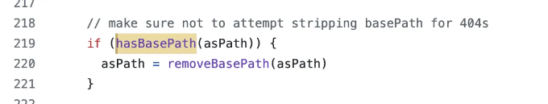
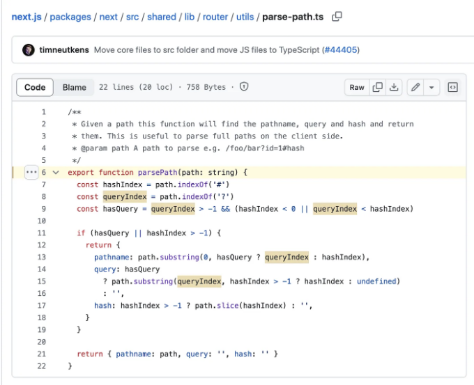

이 수업은 Next.js 소스 코드에서 가져왔어요. 이 글에서 당신은 얼마나 깊게 간단한 hasBasepath 유틸리티 함수를 위해 nested 되어 있는지 배울 거예요.

# hasBasepath

위 코드 스니펫은 next/src/client/index.ts 에서 가져온 것이에요. hasBasePath는 base-path.ts에서 import 되었어요.

<!-- ui-log 수평형 -->
<ins class="adsbygoogle"
  style="display:block"
  data-ad-client="ca-pub-4877378276818686"
  data-ad-slot="9743150776"
  data-ad-format="auto"
  data-full-width-responsive="true"></ins>
<component is="script">
(adsbygoogle = window.adsbygoogle || []).push({});
</component>

당신은 프론트엔드 개발자이에요. 위의 텍스트를 친근한 어조로 한국어로 번역해주세요.

<!-- ui-log 수평형 -->
<ins class="adsbygoogle"
  style="display:block"
  data-ad-client="ca-pub-4877378276818686"
  data-ad-slot="9743150776"
  data-ad-format="auto"
  data-full-width-responsive="true"></ins>
<component is="script">
(adsbygoogle = window.adsbygoogle || []).push({});
</component>

이것은 중첩된 import의 레벨 2입니다. 다시 말씀드리지만, "proximity" 파일에 `parsePath`를 그대로 넣었을 것입니다.

`parsePath`는 parse-path.ts에서 import됩니다.

이것은 레벨 3입니다. 휴우! 저는 이 정도까지 진행하지는 않았는데, 이 레벨에서는 클라이언트와 서버에서 사용되는 공유 폴더에서 import되는 것을 깨달았습니다. 함수 및 파일에 단일 책임 원칙(SRP; single responsibility principle)을 엄격히 따르면 부작용이 없는 함수를 사용하여 코드베이스 전체에 이러한 함수를 재사용할 수 있습니다.

<!-- ui-log 수평형 -->
<ins class="adsbygoogle"
  style="display:block"
  data-ad-client="ca-pub-4877378276818686"
  data-ad-slot="9743150776"
  data-ad-format="auto"
  data-full-width-responsive="true"></ins>
<component is="script">
(adsbygoogle = window.adsbygoogle || []).push({});
</component>

# 결론:

`hasBasePath`은 Next.js 소스 코드의 3단계 중첩된 가져오기에서 나오는 간단한 유틸리티 함수입니다. 저는 중첩된 가져오기의 두 번째 단계에서 멈추고 함수들을 "근접하게" 두었습니다. 단일 책임 원칙을 엄격히 준수할 수 있지만 할당할 수 있는 시간에도 달려 있습니다.