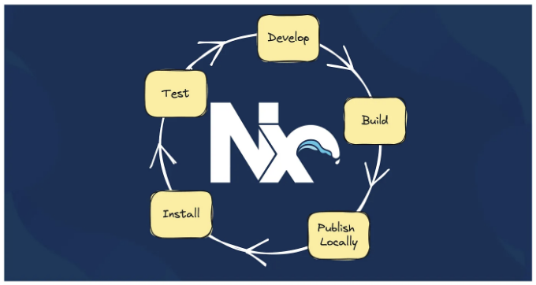
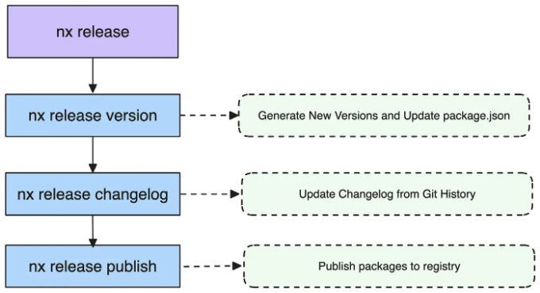

## 사용자 정의 스크립트 및 Verdaccio를 활용하여 Nx 환경에서 업무 자동화하기



Nx는 NPM 패키지를 효율적으로 개발하고 배포할 수 있는 모든 기능을 제공합니다. 지역 출판을 위한 Verdaccio와 혁신적인 Nx 릴리스 시스템을 포함한 구조화된 환경과 필수 도구를 제공합니다.

이전에 쓴 글인 🍒 Cherry-Picked Nx v18.1 Updates에서는 사용자 정의 publish.mjs가 이제 발행 가능 라이브러리를 관리하는 Nx Release로 대체된다는 것을 강조했습니다.

<!-- ui-log 수평형 -->
<ins class="adsbygoogle"
  style="display:block"
  data-ad-client="ca-pub-4877378276818686"
  data-ad-slot="9743150776"
  data-ad-format="auto"
  data-full-width-responsive="true"></ins>
<component is="script">
(adsbygoogle = window.adsbygoogle || []).push({});
</component>

Nx 릴리즈는 주로 세 가지 주요 단계를 이루고 있어요:



Nx 릴리즈에 익숙하지 않은 분들께 추천드리는 것은:

- Juri Strumpflohner의 글: 모노레포에서의 버전 관리 및 패키지 릴리스를 읽어보세요.
- Nx 문서를 확인하세요: 기능, 레시피 및 API

<!-- ui-log 수평형 -->
<ins class="adsbygoogle"
  style="display:block"
  data-ad-client="ca-pub-4877378276818686"
  data-ad-slot="9743150776"
  data-ad-format="auto"
  data-full-width-responsive="true"></ins>
<component is="script">
(adsbygoogle = window.adsbygoogle || []).push({});
</component>

그 짧은 기사에서는 지역 개발을 위해 새 시스템을 Verdaccio와 함께 활용하는 통찰을 공유하고자 했습니다.

# 실용적인 사용 사례

먼저 다음 명령을 사용하여 빈 Nx Workspace를 생성하세요:

```js
npx create-nx-workspace@latest myorg --preset empty --workspaceType integrated --nxCloud skip && cd myorg
```

<!-- ui-log 수평형 -->
<ins class="adsbygoogle"
  style="display:block"
  data-ad-client="ca-pub-4877378276818686"
  data-ad-slot="9743150776"
  data-ad-format="auto"
  data-full-width-responsive="true"></ins>
<component is="script">
(adsbygoogle = window.adsbygoogle || []).push({});
</component>

다음으로 @nx/js 플러그인 기능을 추가해주세요:

```js
nx add @nx/js
```

마지막으로 개발하고자 하는 공개 가능한 라이브러리를 생성해주세요:

```js
nx g @nx/js:lib my-lib --publishable --importPath=@myorg/my-lib
```

<!-- ui-log 수평형 -->
<ins class="adsbygoogle"
  style="display:block"
  data-ad-client="ca-pub-4877378276818686"
  data-ad-slot="9743150776"
  data-ad-format="auto"
  data-full-width-responsive="true"></ins>
<component is="script">
(adsbygoogle = window.adsbygoogle || []).push({});
</component>

# 무슨 일이 있었나요?

게시 가능한 라이브러리를 생성하면 Nx가 작업 공간을 게시 준비하기 위해 필요한 모든 도구를 설치하고 구성합니다.

## Verdaccio 설정

Nx는 @nx/js:setup-verdaccio를 사용하여 작업 공간에 Verdaccio를 자동으로 구성하며 다음 구성을 포함하는 루트 project.json이 결과로 생성됩니다:

<!-- ui-log 수평형 -->
<ins class="adsbygoogle"
  style="display:block"
  data-ad-client="ca-pub-4877378276818686"
  data-ad-slot="9743150776"
  data-ad-format="auto"
  data-full-width-responsive="true"></ins>
<component is="script">
(adsbygoogle = window.adsbygoogle || []).push({});
</component>

```js
{
  "name": "@my-org/source",
  "$schema": "node_modules/nx/schemas/project-schema.json",
  "targets": {
    "local-registry": {
      "executor": "@nx/js:verdaccio",
      "options": {
        "port": 4873,
        "config": ".verdaccio/config.yml",
        "storage": "tmp/local-registry/storage"
      }
    }
  }
}
```

이 구성은 로컬 Verdaccio 레지스트리가 지정된 스토리지 및 구성 경로를 사용하여 포트 4873에서 실행되도록 합니다. 다음 명령어를 사용하여 Verdaccio를 시작할 수 있습니다.

```js
nx run local-registry
```

## Nx 글로벌 구성

<!-- ui-log 수평형 -->
<ins class="adsbygoogle"
  style="display:block"
  data-ad-client="ca-pub-4877378276818686"
  data-ad-slot="9743150776"
  data-ad-format="auto"
  data-full-width-responsive="true"></ins>
<component is="script">
(adsbygoogle = window.adsbygoogle || []).push({});
</component>

Nx는 nx.json 파일에서 전역적으로 Nx 릴리스를 설정합니다:

```js
{
  "release": {
    "version": {
      "preVersionCommand": "npx nx run-many -t build"
    }
  }
}
```

preVersionCommand는 버전 업데이트 전에 빌드나 다른 작업이 완료되도록 보장합니다.

## 프로젝트 구성

<!-- ui-log 수평형 -->
<ins class="adsbygoogle"
  style="display:block"
  data-ad-client="ca-pub-4877378276818686"
  data-ad-slot="9743150776"
  data-ad-format="auto"
  data-full-width-responsive="true"></ins>
<component is="script">
(adsbygoogle = window.adsbygoogle || []).push({});
</component>

마지막으로, 라이브러리 프로젝트 구성에는 Nx 릴리스에 특화된 설정 및 릴리스를 실행하는 대상인 nx-release-publish가 포함될 것입니다:

```js
{
  "name": "my-lib",
  "targets": {
    "build": {...},
    "nx-release-publish": {
      "options": {
        "packageRoot": "dist/{projectRoot}"
      }
    }
  },
  "release": {
    "version": {
      "generatorOptions": {
        "packageRoot": "dist/{projectRoot}",
        "currentVersionResolver": "git-tag"
      }
    }
  }
}
```

이제 다음을 사용하여 라이브러리를 쉽게 발행할 수 있습니다:

```js
nx release
```

<!-- ui-log 수평형 -->
<ins class="adsbygoogle"
  style="display:block"
  data-ad-client="ca-pub-4877378276818686"
  data-ad-slot="9743150776"
  data-ad-format="auto"
  data-full-width-responsive="true"></ins>
<component is="script">
(adsbygoogle = window.adsbygoogle || []).push({});
</component>

# 로컬 개발 플로우

만약 여러분이 라이브러리를 로컬에서 다른 로컬 저장소에서 테스트하고 싶다면, 아래 단계를 따라야 합니다:

- Verdaccio 시작하기: nx run local-registry
- 라이브러리 빌드하기: nx.json 파일의 preVersionCommand를 사용하여 Nx Release에 의해 자동화됩니다.
- 출력물 버전 업데이트: Nx Release에 의해 @nx/js:release-version 생성기를 사용하여 자동화됩니다.
- Verdaccio에 라이브러리 발행하기: Nx Release에 의해 @nx/js:release-publish 및 생성된 목표 nx-release-publish를 사용하여 자동화됩니다.
- 라이브러리 설치하기: npm install @my-org/my-lib@latest

로컬에서 작업하는 일은 반복적이고 지루할 수 있습니다, 특히 매번 고유한 버전을 생성해야 하는 경우. 그렇지 않으면 Nx Release는 동일한 버전을 다시 발행하지 않습니다. 또한, 저는 발행취소 단계를 추가하지 않고 업무 흐름을 복잡하게 하는 것을 선호합니다.

<!-- ui-log 수평형 -->
<ins class="adsbygoogle"
  style="display:block"
  data-ad-client="ca-pub-4877378276818686"
  data-ad-slot="9743150776"
  data-ad-format="auto"
  data-full-width-responsive="true"></ins>
<component is="script">
(adsbygoogle = window.adsbygoogle || []).push({});
</component>

Nx 문서에서 특히 흥미로운 두 가지 예시가 강조되었습니다: Nx 릴리스를 위한 프로그래밍 API 사용과 로컬 레지스트리 업데이트. 이러한 예시는 표준 Nx 릴리스 프로세스를 향상시키기 위해 사용자 정의 스크립트를 작성하는 방법을 보여줍니다.

위에서 언급된 전체 프로세스를 다루기 위해, 제가 tools/scripts/publish-local.ts에 사용자 정의 스크립트를 구현하였습니다:

```js
// 루트 project.json에서 생성된 대상과 관련
const localRegistryTarget = '@myorg/source:local-registry';

// Verdaccio 프로세스를 중지하는 데 사용되는 콜백
let stopLocalRegistry = () => {};

(async () => {
  // 실행 옵션 가져오기
  const options = await yargs
    .version(false) // yargs에서 기본 버전 의미 사용 안 함
    .option('version', {
      description:
        '일반 커밋을 재정의하는 경우 사용할 명시적 버전 지정자',
      type: 'string',
      default: `0.0.0-local.${Date.now()}`, // 버전은 항상 고유할 것임
    })
    .option('targetPath', {
      description:
        '게시된 라이브러리를 설치할 리포지토리의 상대 경로',
      type: 'string',
      default: '',
    })
    .parseAsync();

  /**
   * 단계 1: Verdaccio 시작
   */
  stopLocalRegistry = await startLocalRegistry({
    localRegistryTarget,
    verbose: false,
  });

  /**
   * 단계 2: 라이브러리 빌드
   * 단계 3: 출력물 버전 업데이트
   */
  const { projectsVersionData } = await releaseVersion({
    specifier: options.version,
    stageChanges: false,
    gitCommit: false,
    gitTag: false,
    firstRelease: true,
    generatorOptionsOverrides: {
      skipLockFileUpdate: true,
    },
  });

  /**
   * 단계 4: Verdaccio에 라이브러리 게시
   */
  const publishStatus = await releasePublish({
    firstRelease: true,
  });

  /**
   * 단계 5: 라이브러리 설치
   */
  // 설치해야 하는 모든 게시된 Npm 패키지 얻기
  const packagesToInstall = Object.entries(projectsVersionData).map(
    ([projectName, { newVersion }]) => {
      const project = readCachedProjectGraph().nodes[projectName];

      const packageJson = JSON.parse(
        readFileSync(
          resolve(process.cwd(), project.data.root, `package.json`)
        ).toString()
      );

      return `${packageJson.name}@${newVersion}`;
    }
  );

  // 설치 명령 준비
  const targetPath = resolve(process.cwd(), options.targetPath);
  const installCommand = `${getInstallCommand(
    targetPath
  )} ${packagesToInstall.join(' ')} --registry=http://localhost:4873`;

  console.log(installCommand);

  // 대상 디렉토리로 이동하여 설치 명령 실행
  process.chdir(targetPath);
  execSync(installCommand);

  /**
   * 마지막: 설치가 완료되면 Verdaccio가 더 이상 필요하지 않음
   */
  stopLocalRegistry();

  process.exit(publishStatus);
})().catch((e) => {
  // 문제 발생 시 Verdaccio 중지
  console.error(e);
  stopLocalRegistry();
  process.exit(1);
});

// 대상 경로에서 사용할 설치 명령 정의
function getInstallCommand(targetPath: string): string {
  const siblingFiles = readdirSync(targetPath);

  if (siblingFiles.includes('yarn.lock')) {
    return 'yarn add';
  }
  if (siblingFiles.includes('package-lock.json')) {
    return 'npm install';
  }
  if (siblingFiles.includes('pnpm-lock.yaml')) {
    return 'pnpm add';
  }
  throw new Error(
    `타겟 리포지토리에 대한 패키지 관리자를 찾을 수 없음: ${targetPath}`
  );
}
```

이제 단순히 실행하여 로컬로 패키지를 게시할 수 있습니다:

<!-- ui-log 수평형 -->
<ins class="adsbygoogle"
  style="display:block"
  data-ad-client="ca-pub-4877378276818686"
  data-ad-slot="9743150776"
  data-ad-format="auto"
  data-full-width-responsive="true"></ins>
<component is="script">
(adsbygoogle = window.adsbygoogle || []).push({});
</component>

```js
npx ts-node ./tools/scripts/publish-local.ts --targetPath ../app-using-my-lib
```

# 마지막으로

로컬에서 게시할 수 있는 라이브러리를 테스트하고 싶을 때 언제나 어려운 일입니다. Nx는 이 과정을 지원하기 위해 필요한 모든 도구를 제공합니다.

그러나 이 도구를 수동으로 사용할지 아니면 사용자 지정 스크립트를 활용하여 자동화할지는 각자의 결정에 달려 있습니다.

<!-- ui-log 수평형 -->
<ins class="adsbygoogle"
  style="display:block"
  data-ad-client="ca-pub-4877378276818686"
  data-ad-slot="9743150776"
  data-ad-format="auto"
  data-full-width-responsive="true"></ins>
<component is="script">
(adsbygoogle = window.adsbygoogle || []).push({});
</component>

이 글에서 한 가지 방법을 제안하고 있지만, 여러분만의 방법을 만들어보시는 걸 강력히 권장합니다.

🚀 기대해주세요!

# 관련 정보