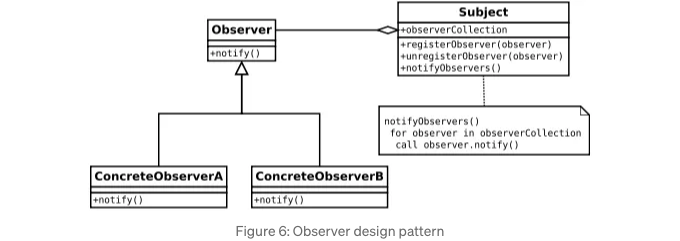

소프트웨어 엔지니어링 세계에서 아이디어를 실제 코드로 전환하는 것은 까다로울 수 있습니다.

여기에는 디자인 패턴이 등장합니다. 반복되는 디자인 문제를 우아하고 효율적으로 해결할 수 있도록 도와주는 검증된 청사진입니다.

핵심적으로 디자인 패턴은 소프트웨어를 디자인할 때 마주치는 일반적인 문제에 대한 준비된 솔루션과 같습니다. 이러한 솔루션은 단축키처럼 작용하여 전문가들이 오랜 시간 동안 개선해 온 검증된 전략을 활용하여 시간과 노력을 절약합니다.

<!-- ui-log 수평형 -->
<ins class="adsbygoogle"
  style="display:block"
  data-ad-client="ca-pub-4877378276818686"
  data-ad-slot="9743150776"
  data-ad-format="auto"
  data-full-width-responsive="true"></ins>
<component is="script">
(adsbygoogle = window.adsbygoogle || []).push({});
</component>

이 기사에서는 모든 개발자가 익숙해져야 할 가장 중요한 디자인 패턴 중 일부에 대해 깊이 파헤쳐 보겠습니다. 그들의 원칙을 알아보고, 왜 유용한지, 그리고 실제 프로젝트에서 어떻게 사용할 수 있는지 살펴볼 것입니다. 객체를 생성하는 데 어려움을 겪고 있다면, 클래스 간의 관계를 조직하는 데 어려움을 겪고 있다면, 또는 객체의 동작 방식을 관리하는 데 어려움을 겪고 있다면, 도움이 될 수 있는 디자인 패턴이 있습니다.

자, 시작해봅시다.

## 1. 싱글톤 패턴

싱글톤 패턴은 한 클래스에 하나의 인스턴스만 존재하도록 보장하고 해당 인스턴스에 대한 전역 액세스 지점을 제공하는 생성 패턴입니다. 더 간단히 말하면, 프로그램에서 특정 객체의 유일한 복사본이 하나만 있도록 보장하고 코드의 어디서든 해당 객체에 액세스할 수 있도록 하는 것과 같습니다.

<!-- ui-log 수평형 -->
<ins class="adsbygoogle"
  style="display:block"
  data-ad-client="ca-pub-4877378276818686"
  data-ad-slot="9743150776"
  data-ad-format="auto"
  data-full-width-responsive="true"></ins>
<component is="script">
(adsbygoogle = window.adsbygoogle || []).push({});
</component>


간단한 실세계 예시를 들어보겠습니다: 클립보드입니다. 컴퓨터에서 여러 애플리케이션이나 프로세스가 동시에 클립보드에 접근하려고 하는 상황을 상상해보세요. 각 애플리케이션이 복사 및 붙여넣기 작업을 관리하기 위해 자체 클립보드를 만든다면 데이터 충돌이 발생할 수 있습니다.

```js
public class Clipboard {

    private String value;

    public void copy(String value) {
        this.value = value;
    }

    public String paste() {
        return value;
    }
}
```

위의 예시에서는 값을 복사하고 붙여넣을 수 있는 Clipboard 클래스를 정의했습니다. 그러나 Clipboard의 여러 인스턴스를 만들 경우, 각 인스턴스는 자체 데이터를 가지게 됩니다.

<!-- ui-log 수평형 -->
<ins class="adsbygoogle"
  style="display:block"
  data-ad-client="ca-pub-4877378276818686"
  data-ad-slot="9743150776"
  data-ad-format="auto"
  data-full-width-responsive="true"></ins>
<component is="script">
(adsbygoogle = window.adsbygoogle || []).push({});
</component>

```js
public class Main {
    public static void main(String[] args) {

        Clipboard clipboard1 = Clipboard.getInstance();
        Clipboard clipboard2 = Clipboard.getInstance();

        clipboard1.copy("Java");
        clipboard2.copy("디자인 패턴");

        System.out.println(clipboard1.paste()); // 결과: Java
        System.out.println(clipboard2.paste()); // 결과: 디자인 패턴
    }
}
```

분명히 이것은 이상적이지 않아요. 두 클립보드 인스턴스가 동일한 값을 표시할 것으로 기대합니다. 여기서 싱글톤 패턴이 가치를 증명합니다.

```js
public class Clipboard {

    private String value;

    private static Clipboard clipboard = null;
  
    // 외부에서의 인스턴스화를 막기 위한 개인 생성자
    private Clipboard() {}

    // 싱글톤 인스턴스에 대한 액세스를 제공하는 메소드
    public static Clipboard getInstance() {
        if (clipboard == null) {
            clipboard = new Clipboard();
        }
        return clipboard;
    }

    public void copy(String value) {
        this.value = value;
    }

    public String paste() {
        return value;
    }
}
```

싱글톤 패턴을 구현함으로써 프로그램 실행 중에 Clipboard 클래스의 단일 인스턴스만 존재함을 보장합니다.```

<!-- ui-log 수평형 -->
<ins class="adsbygoogle"
  style="display:block"
  data-ad-client="ca-pub-4877378276818686"
  data-ad-slot="9743150776"
  data-ad-format="auto"
  data-full-width-responsive="true"></ins>
<component is="script">
(adsbygoogle = window.adsbygoogle || []).push({});
</component>

```java
public class Main {
    public static void main(String[] args) {
        
        // 싱글톤 인스턴스 가져오기
        Clipboard clipboard1 = Clipboard.getInstance();
        Clipboard clipboard2 = Clipboard.getInstance();

        clipboard1.copy("Java");
        clipboard2.copy("디자인 패턴");

        System.out.println(clipboard1.paste()); // 출력: 디자인 패턴
        System.out.println(clipboard2.paste()); // 출력: 디자인 패턴
    }
}
```

이제 clipboard1과 clipboard2는 Clipboard 클래스의 동일한 인스턴스를 참조하며 응용 프로그램 전체에서 일관성을 보장합니다.

## 2. 팩토리 디자인 패턴

팩토리 디자인 패턴은 생성 패턴으로, 슈퍼 클래스에서 객체를 생성하기 위한 인터페이스를 제공하지만 하위 클래스가 어떤 클래스를 인스턴스화할지 결정할 수 있도록 합니다. 다시 말해, 인스턴스화 로직을 자식 클래스에 위임하는 방법을 제공합니다.
```

<!-- ui-log 수평형 -->
<ins class="adsbygoogle"
  style="display:block"
  data-ad-client="ca-pub-4877378276818686"
  data-ad-slot="9743150776"
  data-ad-format="auto"
  data-full-width-responsive="true"></ins>
<component is="script">
(adsbygoogle = window.adsbygoogle || []).push({});
</component>

```markdown


간단한 콘솔 기반 계산기를 시뮬레이션하는 프로그램을 개발한다고 상상해봅시다. 덧셈, 뺄셈, 곱셈, 나눗셈 등과 같은 다양한 연산 유형이 있습니다. 각 연산에는 고유한 동작이 있습니다. 이제 고객의 선택에 기반하여 프로그램 내에서 이러한 연산 객체를 생성하려고 합니다.

도전 과제는 코드를 너무 복잡하거나 강하게 결합하지 않으면서 이러한 연산 객체를 생성하는 방법이 필요하다는 것입니다. 이는 코드가 특정 연산 클래스에 너무 의존하지 않도록 원합니다. 또한 나중에 새로운 유형의 연산을 추가하기 쉽도록 코드를 많이 수정하지 않고도 할 수 있길 원합니다.

Factory Design Pattern은 정확한 클래스를 지정하지 않고 객체를 생성하는 방법을 제공하여 이 문제를 해결하도록 도와줍니다. 대신, 생성 프로세스를 팩토리 클래스에 위임합니다.
```

<!-- ui-log 수평형 -->
<ins class="adsbygoogle"
  style="display:block"
  data-ad-client="ca-pub-4877378276818686"
  data-ad-slot="9743150776"
  data-ad-format="auto"
  data-full-width-responsive="true"></ins>
<component is="script">
(adsbygoogle = window.adsbygoogle || []).push({});
</component>

- 제품 인터페이스를 정의하십시오. (Operation).

```js
public interface Operation {
    double calculate(double number1, double number2);
}
```

2. 각 작업에 대한 구체적인 제품을 구현하십시오.

```js
// 덧셈에 대해
public class AddOperation implements Operation {
    @Override
    public double calculate(double number1, double number2) {
        return number1 + number2;
    }
}

// 뺄셈에 대해
public class SubOperation implements Operation {
    @Override
    public double calculate(double number1, double number2) {
        return number1 - number2;
    }
}

// 곱셈에 대해
public class MulOperation implements Operation {
    @Override
    public double calculate(double number1, double number2) {
        return number1 * number2;
    }
}

// 나눗셈에 대해
public class DivOperation implements Operation {
    @Override
    public double calculate(double number1, double number2) {
        if (number2 == 0)
            throw new ArithmeticException("0으로는 나눌 수 없습니다!");
        return number1 / number2;
    }
}

// 사용자가 작업에 대한 잘못된 선택을 입력하면 호출되는 예외 클래스
public class InvalidOperationException extends Exception {
    public InvalidOperationException(String message) {
        super(message);
    }
}
```

<!-- ui-log 수평형 -->
<ins class="adsbygoogle"
  style="display:block"
  data-ad-client="ca-pub-4877378276818686"
  data-ad-slot="9743150776"
  data-ad-format="auto"
  data-full-width-responsive="true"></ins>
<component is="script">
(adsbygoogle = window.adsbygoogle || []).push({});
</component>

3. 어떤 매개변수를 기반으로 객체를 만드는 메서드( getInstance)를 가진 팩토리 클래스(OperationFactory)를 생성하세요.

```java
public interface OperationFactory {
    Operation getInstance(int choice) throws InvalidOperation;
}

public class OperationFactoryImpl implements OperationFactory {
    @Override
    public Operation getInstance(int choice) throws InvalidOperationException {
        if(choice == 1)
            return new AddOperation();
        else if(choice == 2)
            return new SubOperation();
        else if(choice == 3)
            return new MulOperation();
        else if(choice == 4)
            return new DivOperation();
        throw new InvalidOperation("선택한 작업이 올바르지 않습니다!");
    }
}
```

4. 특정 클래스를 알지 못해도 팩토리를 사용하여 객체를 만드세요.

```java
public static void main(String[] args) {
    Scanner scan = new Scanner(System.in);
    Output output = new ConsoleOutput();

    try {
        
        System.out.println("\n1. 덧셈(+)\n2. 뺄셈(-)\n3. 곱셈(*)\n4. 나눗셈(/)");
         
        // 사용자로부터 선택 받기
        System.out.println("\n\n원하는 작업을 선택하세요 (1-4): ");
        int choice = scan.nextInt();

        // 사용자로부터 2개의 피연산자 받기
        System.out.println("첫 번째 피연산자를 입력하세요: ");
        double operand1 = scan.nextDouble();
        System.out.println("두 번째 피연산자를 입력하세요: ");
        double operand2 = scan.nextDouble();
        
        // 사용자 선택에 기반해 작업 인스턴스 생성
        OperationFactory operationFactory = new OperationFactoryImpl();
        Operation operation = operationFactory.getInstance(choice);
        
        // 결과 출력
        System.out.println("\n이 결과는 " + operation.calculate(operand1, operand2) + "입니다.");
    }
    catch (InputMismatchException e) {
        output.showMessage("유효하지 않은 입력 유형입니다!\n");
    }
    catch (InvalidOperation | ArithmeticException e) {
        output.showMessage(e.getMessage());
    }

    scan.close();
}
```

<!-- ui-log 수평형 -->
<ins class="adsbygoogle"
  style="display:block"
  data-ad-client="ca-pub-4877378276818686"
  data-ad-slot="9743150776"
  data-ad-format="auto"
  data-full-width-responsive="true"></ins>
<component is="script">
(adsbygoogle = window.adsbygoogle || []).push({});
</component>

여기 Main 클래스는 느슨한 결합을 통해 특정 구현 클래스를 알지 못하면서도 다양한 작업 객체를 만들기 위한 팩토리의 사용법을 보여줍니다. 팩토리 인터페이스와만 상호 작용합니다. 더 나아가, 기존의 클라이언트 코드를 변경하지 않고도 쉽게 새로운 유형의 작업을 추가할 수도 있습니다. 새로운 구상 제품을 만들고 필요한 경우 팩토리를 업데이트하기만 하면 됩니다.

# 3. 빌더 패턴

빌더 패턴은 단계적인 방식으로 객체의 여러 속성(또는 특성)을 설정할 수 있도록 하여 객체를 구성하는 방법을 제공합니다.

객체에 대해 일부 매개변수는 선택적일 수 있지만, 모든 매개변수를 보내야 하며 선택적 매개변수는 NULL로 보내야 하는 경우가 있습니다. 필수 매개변수가 포함된 생성자를 제공하고 선택적 매개변수를 설정하는 다른 setter 메서드를 제공함으로써 이 문제를 해결할 수 있습니다.

<!-- ui-log 수평형 -->
<ins class="adsbygoogle"
  style="display:block"
  data-ad-client="ca-pub-4877378276818686"
  data-ad-slot="9743150776"
  data-ad-format="auto"
  data-full-width-responsive="true"></ins>
<component is="script">
(adsbygoogle = window.adsbygoogle || []).push({});
</component>

이 패턴은 많은 선택적 매개변수나 구성을 가진 객체를 다룰 때 특히 유용합니다.

사용자 엔티티를 개발 중이라고 상상해보세요. 사용자에는 이름, 이메일, 전화번호, 도시 등과 같은 다양한 속성이 있습니다. 여기서 이름과 이메일은 필수 필드이며, 전화번호와 도시는 선택적입니다. 이제 각 사용자는 이러한 속성들의 다른 조합을 갖게 됩니다. 어떤 사람은 도시를 가지고 있을 수도 있고, 다른 사람은 가지고 있지 않을 수도 있습니다. 빌더 디자인 패턴을 사용하면 이러한 유연한 사용자를 단계적으로 생성할 수 있습니다.

```js
// Main product class
public class User {
    private String name; // 필수 필드
    private String email; // 필수 필드
    private String phone; // 선택적 필드
    private String city; // 선택적 필드

    public User(UserBuilder userBuilder) {
        this.name = userBuilder.getName();
        this.email = userBuilder.getEmail();
        this.phone = userBuilder.getPhone();
        this.city = userBuilder.getCity();
    }

    public static UserBuilder builder(String name, String email) {
        return new UserBuilder(name, email);
    }

    @Override
    public String toString() {
        return "User = " +
                "{ name: '" + name + '\'' +
                ", email: '" + email + '\'' +
                ", phone: '" + phone + '\'' +
                ", city: '" + city + '\'' +
                " }";
    }
    
    // 빌더 클래스
    public static class UserBuilder {
        private String name; // 필수 필드
        private String email; // 필수 필드
        private String phone = "unknown"; // 선택적 필드
        private String city = "unknown"; // 선택적 필드

        public UserBuilder(String name, String email) {
            this.name = name;
            this.email = email;
        }

        // 게터 메서드

        public UserBuilder name(String name) {
            this.name = name;
            return this;
        }

        public UserBuilder email(String email) {
            this.email = email;
            return this;
        }

        public UserBuilder phone(String phone) {
            this.phone = phone;
            return this;
        }

        public UserBuilder city(String city) {
            this.city = city;
            return this;
        }

        public User build() {
            return new User(this);
        }
    }

}
```

- UserBuilder 클래스: User 객체를 구성하는 데 책임이 있는 내부 빌더 클래스입니다. 다양한 속성 (이름, 이메일, 전화번호, 도시)의 존재 여부를 나타내는 필드를 가지고 있습니다. 이 클래스는 각 속성에 대한 setter 메서드를 제공하며, 이 메서드들은 빌더 자체를 반환합니다 (name(), phone(), city(), email()). 이를 통해 메소드 체이닝을 가능하게 합니다.
- User 클래스: 빌더 패턴을 사용하여 구성하려는 제품을 나타내는 클래스입니다. 사용자의 속성 (이름, 이메일, 전화번호, 도시)을 나타내는 private 필드를 가지고 있습니다. User의 생성자는 UserBuilder 객체를 사용하여 필드를 초기화하며, 빌더의 설정에 따라 필드를 설정합니다. 새 UserBuilder 인스턴스를 반환하는 static builder() 메서드를 제공하여 새 빌더를 쉽게 만들 수 있습니다.

<!-- ui-log 수평형 -->
<ins class="adsbygoogle"
  style="display:block"
  data-ad-client="ca-pub-4877378276818686"
  data-ad-slot="9743150776"
  data-ad-format="auto"
  data-full-width-responsive="true"></ins>
<component is="script">
(adsbygoogle = window.adsbygoogle || []).push({});
</component>

이 코드를 사용하여 선택적 속성이 있는 사용자를 생성하는 방법의 예제를 살펴보겠습니다:

```js
public class Main {
    public static void main(String[] args) {

        User user1 = User
                .builder("John", "john@abc@gmail.com")
                .build();

        System.out.println(user1); // User = { name: 'John', email: 'john@abc@gmail.com', phone: 'unknown', city: 'unknown' }

        User user2 = User
                .builder("Mary", "mary@abc@gmail.com")
                .city("Colombo")
                .build();

        System.out.println(user2); // User = { name: 'Mary', email: 'mary@abc@gmail.com', phone: 'unknown', city: 'Colombo' }
    }

}
```

이것이 빌더 패턴입니다. 이 패턴은 선택적 매개변수가 많은 복잡한 객체가 있는 경우 유용합니다. 코드를 깔끔하고 이해하기 쉽게 유지하는 데 도움이 됩니다. 동일한 빌더로 다양한 객체 변형을 만들 수 있으며 필요한대로 매개변수를 조정할 수 있습니다.

# 4. 어댑터 패턴

<!-- ui-log 수평형 -->
<ins class="adsbygoogle"
  style="display:block"
  data-ad-client="ca-pub-4877378276818686"
  data-ad-slot="9743150776"
  data-ad-format="auto"
  data-full-width-responsive="true"></ins>
<component is="script">
(adsbygoogle = window.adsbygoogle || []).push({});
</component>

어댑터 패턴은 서로 호환되지 않는 인터페이스를 가진 객체들이 함께 작동할 수 있도록 해주는 구조적 디자인 패턴입니다. 이는 두 개의 호환되지 않는 인터페이스 사이에 다리 역할을 합니다.

두 클래스 또는 구성 요소가 비슷한 작업을 수행하지만 메소드 이름, 매개변수 유형 또는 구조가 다른 상황을 상상해보세요. 어댑터 패턴은 이러한 호환되지 않는 인터페이스를 클라이언트가 기대하는 인터페이스로 변환하는 래퍼(어댑터)를 제공하여 함께 작동할 수 있도록 합니다.

- Target은 클라이언트가 기대하는 인터페이스입니다.
- Adaptee는 적응되어야 하는 클래스입니다.
- Adapter는 Target 인터페이스를 구현하고 Adaptee 클래스를 래핑하는 클래스입니다.
- Client 클래스는 어댑터를 사용하여 Target 인터페이스를 통해 Adaptee와 상호 작용하는 클래스입니다.


<!-- ui-log 수평형 -->
<ins class="adsbygoogle"
  style="display:block"
  data-ad-client="ca-pub-4877378276818686"
  data-ad-slot="9743150776"
  data-ad-format="auto"
  data-full-width-responsive="true"></ins>
<component is="script">
(adsbygoogle = window.adsbygoogle || []).push({});
</component>

```js
// 대상 인터페이스
interface CellPhone {
    void call();
}

// 적응할 대상 클래스
class FriendCellPhone {
    public void ring() {
        System.out.println("벨 울림");
    }
}

// 대상 인터페이스를 구현하는 어댑터 클래스
class CellPhoneAdapter implements CellPhone {
    private FriendCellPhone friendCellPhone;

    public CellPhoneAdapter(FriendCellPhone friendCellPhone) {
        this.friendCellPhone = friendCellPhone;
    }

    @Override
    public void call() {
        friendCellPhone.ring();
    }
}

// 클라이언트 클래스
public class AdapterMain {
    public static void main(String[] args) {
        // 어댑터를 사용하여 적응할 대상을 대상 인터페이스로 동작시킵니다
        FriendCellPhone adaptee = new FriendCellPhone();
        CellPhone adapter = new CellPhoneAdapter(adaptee);
        adapter.call();
    }
}
```

이 예시에서:

- CellPhone은 클라이언트 코드에서 기대하는 대상 인터페이스이며, 이에 대한 구현이 없습니다.
- FriendCellPhone은 적응하고자 하는 클래스(Adaptee)로, CellPhone 인터페이스의 새로운 구현 대신 ring 메서드를 가지고 있습니다.
- CellPhoneAdapter는 CellPhone 인터페이스를 구현하는 어댑터 클래스로, FriendCellPhone의 인스턴스를 래핑합니다. 어댑터의 call 메서드는 FriendCellPhone 클래스의 ring 메서드로 호출을 위임합니다.
- AdapterMain 클래스는 어댑터 패턴의 사용법을 보여주는 클라이언트 역할을 합니다.

어댑터 패턴을 사용하는 이유는 무엇일까요?```

<!-- ui-log 수평형 -->
<ins class="adsbygoogle"
  style="display:block"
  data-ad-client="ca-pub-4877378276818686"
  data-ad-slot="9743150776"
  data-ad-format="auto"
  data-full-width-responsive="true"></ins>
<component is="script">
(adsbygoogle = window.adsbygoogle || []).push({});
</component>

- Adaptee는 직접 수정할 수 없는 제삼자 라이브러리나 레거시 코드베이스의 클래스일 수 있습니다. 어댑터를 사용하여 클라이언트가 기대하는 인터페이스와 일치하도록 조정할 수 있으며, 원본 코드를 수정하지 않고도 이를 달성할 수 있습니다.
- 클라이언트는 Adaptee로부터 특정 기능만 필요로 할 수 있습니다. 어댑터를 사용하여 필요한 기능만 노출하는 맞춤형 인터페이스를 제공할 수 있으며, Adaptee의 전체 인터페이스를 노출하는 것보다 더 나은 방법입니다.
- Target 인터페이스의 인스턴스를 직접 생성하여 유사한 기능을 달성할 수 있을 것으로 보일 수 있지만, 기존 코드나 제삼자 라이브러리와 작업할 때, 어댑터를 사용하는 것은 코드 재사용성, 유지 보수성 및 유연성 면에서 이점을 제공합니다.

# 5. 데코레이터 패턴

데코레이터 패턴은 객체 지향 프로그래밍에서 개별 객체에 정적 또는 동적으로 동작을 추가할 수 있게 하는 디자인 패턴입니다. 이 패턴에서는 공통 기능을 정의하는 기본 클래스(또는 인터페이스)와 추가 동작을 추가하는 하나 이상의 데코레이터 클래스가 있습니다. 이러한 데코레이터 클래스는 원본 객체를 래핑하여 모듈식 및 유연한 방식으로 그 동작을 확장합니다.

<!-- ui-log 수평형 -->
<ins class="adsbygoogle"
  style="display:block"
  data-ad-client="ca-pub-4877378276818686"
  data-ad-slot="9743150776"
  data-ad-format="auto"
  data-full-width-responsive="true"></ins>
<component is="script">
(adsbygoogle = window.adsbygoogle || []).push({});
</component>


상상해보세요. 사용자가 다양한 장식으로 모양을 만들고 사용자 정의하는 그림 애플리케이션을 만들라는 과제를 맡았다고 상상해보세요. 기존 코드를 수정하지 않고도 추가 기능을 위한 새로운 장식을 쉽게 추가할 수 있어야 합니다.

데코레이터 패턴을 사용하여 이를 어떻게 구현할 수 있는지 살펴보겠습니다.

```js
// Shape Interface
interface Shape {
    void draw();
    String getName();
}

// Concrete Shape: Circle
class Circle implements Shape {
    private String name;

    public Circle(String name) {
        this.name = name;
    }

    public String getName() {
        return name;
    }

    @Override
    public void draw() {
        System.out.println("Drawing circle, " + getName() + ".");
    }
}
```

<!-- ui-log 수평형 -->
<ins class="adsbygoogle"
  style="display:block"
  data-ad-client="ca-pub-4877378276818686"
  data-ad-slot="9743150776"
  data-ad-format="auto"
  data-full-width-responsive="true"></ins>
<component is="script">
(adsbygoogle = window.adsbygoogle || []).push({});
</component>

- 모양 인터페이스: 모든 모양이 지원해야 하는 기본 작업을 정의합니다. 이 경우에는 모양을 그리는 draw() 메서드와 모양의 이름을 반환하는 getName()이 포함됩니다.
- 원 클래스: Shape 인터페이스를 구현하며 구체적인 모양(이 경우에는 원)을 나타냅니다. 이름 속성을 갖고 원을 그리는 draw() 메서드를 구현합니다.

```js
// 추상 데코레이터 클래스
abstract class ShapeDecorator implements Shape {
    private Shape decoratedShape;

    public ShapeDecorator(Shape decoratedShape) {
        this.decoratedShape = decoratedShape;
    }

    @Override
    public void draw() {
        decoratedShape.draw();
    }

    @Override
    public String getName() {
        return decoratedShape.getName();
    }
}
```

- ShapeDecorator 추상 클래스: Shape 인터페이스를 구현하는 추상 클래스입니다. Shape 객체(장식된 모양)에 대한 참조를 포함하고 draw() 메서드를 이 객체로 위임합니다.

```js
// 구체적 데코레이터: BorderDecorator
class BorderDecorator extends ShapeDecorator {
    private String color;
    private int widthInPxs;

    public BorderDecorator(Shape decoratedShape, String color, int widthInPxs) {
        super(decoratedShape);
        this.color = color;
        this.widthInPxs = widthInPxs;
    }

    @Override
    public void draw() {
        super.draw();
        System.out.println("Adding " + widthInPxs + "px, " + color + " color border to " + getName() + ".");
    }
}

// 구체적 데코레이터: ColorDecorator
class ColorDecorator extends ShapeDecorator {
    private String color;

    public ColorDecorator(Shape decoratedShape, String color) {
        super(decoratedShape);
        this.color = color;
    }

    @Override
    public void draw() {
        super.draw();
        System.out.println("Filling with " + color + " color to " + getName() + ".");
    }
}
```

<!-- ui-log 수평형 -->
<ins class="adsbygoogle"
  style="display:block"
  data-ad-client="ca-pub-4877378276818686"
  data-ad-slot="9743150776"
  data-ad-format="auto"
  data-full-width-responsive="true"></ins>
<component is="script">
(adsbygoogle = window.adsbygoogle || []).push({});
</component>

- BorderDecorator 및 ColorDecorator 클래스: ShapeDecorator를 확장한 구체적인 데코레이터 클래스입니다. 이들은 경계선과 색상과 같은 추가 기능을 데코레이트된 도형에 추가합니다. 데코레이터된 도형의 draw() 메서드를 오버라이드하여 특정 기능을 추가하고 데코레이트된 도형의 draw() 메서드를 호출합니다.

```js
// Main Class
public class DecoratorMain {
    public static void main(String[] args) {
        // 원을 생성합니다
        Shape circle1 = new Circle("circle1");

        // 원에 테두리를 장식합니다
        Shape circle1WithBorder = new BorderDecorator(circle1, "red", 2);

        // 원에 색상을 장식합니다
        Shape circle1WithBorderAndColor = new ColorDecorator(circle1WithBorder, "blue");

        // 장식된 원을 그립니다
        circle1WithBorderAndColor.draw();

        // 출력
        // 원을 그립니다, circle1.
        // circle1에 2px 빨간색 테두리를 추가합니다.
        // circle1에 파란색으로 채웁니다.
    }
}
```

- DecoratorMain 클래스: 데코레이터 패턴이 표시되는 main() 메서드를 포함합니다. 원을 만들고 테두리로 장식한 다음 색상으로 더 장식합니다. 마지막으로 draw() 메서드를 호출하여 장식된 도형을 시각화합니다.

이제 Decorator Pattern을 구현함으로써, 그림 그리기 응용 프로그램은 원 뿐만 아니라 사각형, 삼각형 등의 다양한 기하학적 모양을 장식할 수 있는 놀라운 능력을 갖추게 되었습니다. 또한, 이 패턴의 확장성을 통해 투명도, 다양한 테두리 스타일(실선, 점선)과 같은 기능을 제공하는 추가적인 데코레이터를 원할 때마다 원활하게 통합할 수 있습니다. 이 동적인 기능 향상 능력은 도형의 핵심 구조를 변경하지 않고 코드 재사용성, 유연성 및 확장 가능성을 촉진하는 이 패턴의 능력을 강조합니다.

<!-- ui-log 수평형 -->
<ins class="adsbygoogle"
  style="display:block"
  data-ad-client="ca-pub-4877378276818686"
  data-ad-slot="9743150776"
  data-ad-format="auto"
  data-full-width-responsive="true"></ins>
<component is="script">
(adsbygoogle = window.adsbygoogle || []).push({});
</component>

# 6. Observer 패턴

옵저버 패턴은 객체지향 프로그래밍에서 자주 사용되는 행동 디자인 패턴으로, 객체 간의 일대다 종속성을 설정하는 데에 사용됩니다. 이 패턴에서는 하나의 객체(주체 또는 observable이라고 함)가 종속 객체(옵저버)의 목록을 유지하고, 상태 변경이 있을 때 그들에게 알리는데, 일반적으로 그들의 메서드 중 하나를 호출하여 알립니다.

다음은 이 작동 방식입니다:

- 주체(Subject): 이는 상태를 보유하고 옵저버 목록을 관리하는 객체입니다. 옵저버를 첨부, 분리, 알릴 수 있는 메서드를 제공합니다.
- 옵저버(Observer): 상태 변경을 통지하기 위해 주체가 호출하는 메서드를 정의하는 인터페이스입니다. 일반적으로 옵저버가 이 인터페이스를 구현합니다.
- 구체적인 주체(Concrete Subject): 주체 인터페이스의 구체적인 구현입니다. 상태를 유지하고 상태가 변경될 때 옵저버에게 알림을 보냅니다.
- 구체적인 옵저버(Concrete Observer): 옵저버 인터페이스의 구체적인 구현입니다. 주체에 자체를 등록하여 알림을 받고, 상태 변경에 대응하기 위해 업데이트 메서드를 구현합니다.

<!-- ui-log 수평형 -->
<ins class="adsbygoogle"
  style="display:block"
  data-ad-client="ca-pub-4877378276818686"
  data-ad-slot="9743150776"
  data-ad-format="auto"
  data-full-width-responsive="true"></ins>
<component is="script">
(adsbygoogle = window.adsbygoogle || []).push({});
</component>

```md


유튜브 채널 구독자 시나리오에서 유튜브 채널은 주체이고, 구독자는 관찰자입니다. 유튜브 채널에서 이벤트가 발생하면 모든 구독자에게 새로운 비디오에 대해 알림을 보내어 시청하도록 합니다.

이 예제를 코드로 구현해봅시다.

```js
public enum EventType {
    NEW_VIDEO,
    LIVE_STREAM
}

public class YoutubeEvent {
    private EventType eventType;
    private String topic;

    public YoutubeEvent(EventType eventType, String topic) {
        this.eventType = eventType;
        this.topic = topic;
    }

    // getters ans setters

    @Override
    public String toString() {
        return eventType.name() + " on " +  topic;
    }
}
```

<!-- ui-log 수평형 -->
<ins class="adsbygoogle"
  style="display:block"
  data-ad-client="ca-pub-4877378276818686"
  data-ad-slot="9743150776"
  data-ad-format="auto"
  data-full-width-responsive="true"></ins>
<component is="script">
(adsbygoogle = window.adsbygoogle || []).push({});
</component>

- EventType: EventType enum은 발생할 수 있는 이벤트 유형을 정의합니다. NEW_VIDEO, LIVE_STREAM 등이 있습니다.
- Event: YoutubeEvent 클래스는 시스템에서 발생하는 이벤트를 나타냅니다. 이벤트의 유형과 주제와 같은 정보를 포함하고 있습니다.

```js
public interface Subject {

    void addSubscriber(Observer observer);
    void removeSubscriber(Observer observer);
    void notifyAllSubscribers(YoutubeEvent event);

}

public interface Observer {
    void notifyMe(String youtubeChannelName, YoutubeEvent event);
}
```

- Subject: Subject 인터페이스는 구독자를 관리하는 메서드(addSubscriber 및 removeSubscriber)와 이벤트 발생 시 알림(notifyAllSubscribers)을 위해 선언됩니다.
- Observer: Observer 인터페이스는 subjects가 상태 변경을 알리기 위해 호출하는 메서드(notifyMe)를 선언합니다.

```js
package observer;

import java.util.ArrayList;
import java.util.List;

public class YoutubeChannel implements Subject{

    private String name;
    private List<Observer> subscribers = new ArrayList<>();

    public YoutubeChannel(String name) {
        this.name = name;
    }

    public String getName() {
        return name;
    }

    @Override
    public void addSubscriber(Observer observer) {
        subscribers.add(observer);
    }

    @Override
    public void removeSubscriber(Observer observer) {
        subscribers.remove(observer);
    }

    @Override
    public void notifyAllSubscribers(YoutubeEvent event) {
        for(Observer observer: subscribers) {
            observer.notifyMe(getName(), event);
        }
    }
}
```

<!-- ui-log 수평형 -->
<ins class="adsbygoogle"
  style="display:block"
  data-ad-client="ca-pub-4877378276818686"
  data-ad-slot="9743150776"
  data-ad-format="auto"
  data-full-width-responsive="true"></ins>
<component is="script">
(adsbygoogle = window.adsbygoogle || []).push({});
</component>

- 구체적인 주제: YoutubeChannel 클래스는 Subject 인터페이스를 구현합니다. 구독자 목록을 유지하고 새 이벤트가 발생할 때 알림을 받습니다.

```java
package observer;

public class YoutubeSubscriber implements Observer{
    private String name;

    public YoutubeSubscriber(String name) {
        this.name = name;
    }

    public String getName() {
        return name;
    }

    public void setName(String name) {
        this.name = name;
    }

    @Override
    public void notifyMe(String youtubeChannelName, YoutubeEvent event) {
        System.out.println("Dear " + getName() + ", Notification from " + youtubeChannelName + ": " + event);
    }
}
```

- 구체적인 옵저버: YoutubeSubscriber 클래스는 Observer 인터페이스를 구현합니다. 주제로부터 알림을 받았을 때 수행할 동작을 정의합니다.

```java
public class ObserverMain {
    public static void main(String[] args) throws InterruptedException {
        YoutubeChannel myChannel = new YoutubeChannel("MyChannel");

        Observer john = new YoutubeSubscriber("John");
        Observer bob = new YoutubeSubscriber("Bob");
        Observer tom = new YoutubeSubscriber("Tom");

        myChannel.addSubscriber(john);
        myChannel.addSubscriber(bob);
        myChannel.addSubscriber(tom);

        myChannel.notifyAllSubscribers(new YoutubeEvent(EventType.NEW_VIDEO, "Design patterns"));
        myChannel.removeSubscriber(tom);
        System.out.println();
        Thread.sleep(5000);
        myChannel.notifyAllSubscribers(new YoutubeEvent(EventType.LIVE_STREAM, "JAVA for beginners"));

    }
}
```

<!-- ui-log 수평형 -->
<ins class="adsbygoogle"
  style="display:block"
  data-ad-client="ca-pub-4877378276818686"
  data-ad-slot="9743150776"
  data-ad-format="auto"
  data-full-width-responsive="true"></ins>
<component is="script">
(adsbygoogle = window.adsbygoogle || []).push({});
</component>

- Main Class: ObserverMain 클래스에는 구현을 테스트하는 main 메서드가 포함되어 있습니다. 여기서는 YoutubeChannel 인스턴스를 생성하고 구독자를 추가하여 새 비디오 이벤트를 통지하며, 그 중 하나의 구독자를 제거한 후 다시 라이브 스트림 이벤트를 통지합니다.

```js
// output
친애하는 존, MyChannel로부터 알림: Design patterns에 대한 NEW_VIDEO
친애하는 밥, MyChannel로부터 알림: Design patterns에 대한 NEW_VIDEO
친애하는 톰, MyChannel로부터 알림: Design patterns에 대한 NEW_VIDEO

친애하는 존, MyChannel로부터 알림: 초보자를 위한 JAVA LIVE_STREAM
친애하는 밥, MyChannel로부터 알림: 초보자를 위한 JAVA LIVE_STREAM
```

Observer 디자인 패턴을 사용하면 YouTube 채널이 비디오를 업로드할 때 모든 구독자에게 쉽게 알릴 수 있습니다. 이는 채널과 구독자를 강하게 결합하지 않고 더 유연하고 유지보수가 용이한 설계를 촉진합니다.

요약하면, 디자인 패턴은 반복적인 설계 문제에 대한 검증된 솔루션을 제공하고 코드의 재사용성, 유지보수성 및 확장성을 촉진하는 Java 개발자에게 필수적인 도구입니다. 이러한 패턴을 효과적으로 이해하고 구현함으로써 개발자는 견고하고 유연하며 쉽게 유지보수 가능한 소프트웨어 솔루션을 만들 수 있습니다. 디자인 패턴을 숙달하는 데는 실습과 경험이 필요하지만, 소프트웨어 개발에 제공하는 혜택은 값진 것입니다. 소규모 프로젝트나 대규모 기업 애플리케이션을 작업 중이더라도, 디자인 패턴을 활용하면 더 깔끔하고 효율적인 코드를 작성하고 궁극적으로 보다 능숙한 Java 개발자가 될 수 있습니다.

<!-- ui-log 수평형 -->
<ins class="adsbygoogle"
  style="display:block"
  data-ad-client="ca-pub-4877378276818686"
  data-ad-slot="9743150776"
  data-ad-format="auto"
  data-full-width-responsive="true"></ins>
<component is="script">
(adsbygoogle = window.adsbygoogle || []).push({});
</component>

여러분, 이 기사를 다 읽어주셔서 감사합니다! 이 기사에서 유용한 정보를 찾아보시고 주제에 대한 가치 있는 통찰을 얻었기를 바랍니다. 디자인 패턴이 무엇인지부터 실제 디자인 패턴 예시를 탐색하는 과정까지 많은 주제를 다뤘습니다.

이 곳에서 다룬 디자인 패턴 외에도 다른 유익한 자바 프로그래밍 주제에 대해 써 온 내 다른 기사를 살펴보시기를 권합니다. 코드 성능 최적화에 관심이 있다면 다른 기사들도 확인해보세요.

- 자바로 설명하는 객체 지향 프로그래밍
- 자바로 설명하는 SOLID 원칙

제 기사들이 유용했다면 즐겨 찾아주시고 친구나 동료들과 공유해 주시면 감사하겠습니다.

<!-- ui-log 수평형 -->
<ins class="adsbygoogle"
  style="display:block"
  data-ad-client="ca-pub-4877378276818686"
  data-ad-slot="9743150776"
  data-ad-format="auto"
  data-full-width-responsive="true"></ins>
<component is="script">
(adsbygoogle = window.adsbygoogle || []).push({});
</component>

자바로 계속 배우고 탐험하며 멋진 것들을 만들어 보세요!

코딩 즐겁게 하세요!

-다르시 바라수브라마니암-