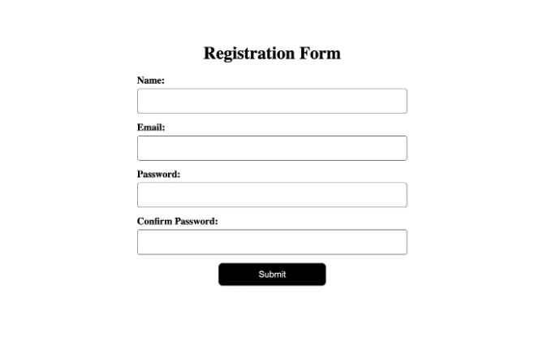

# 소개

폼 유효성 검사는 견고하고 사용자 친화적인 웹 애플리케이션을 개발하는 중요한 부분입니다. React에서 개발자들은 종종 강력한 서드 파티 라이브러리에 의존하여 유효성 검사를 간소화하고 일관된 사용자 경험을 제공합니다. Formik과 Yup은 두 가지 인기 있는 라이브러리로, React에서 폼 유효성 검사에 우아하고 효율적인 솔루션을 제공하기 위해 완벽하게 작동합니다. 이 포괄적인 가이드에서는 Formik과 Yup을 사용하여 폼 유효성 검사를 구현하는 과정을 탐구하고 TypeScript의 추가적인 이점을 활용하는 방법을 살펴보겠습니다.

## 왜 또 다른 라이브러리가 필요한 걸까요?

<!-- ui-log 수평형 -->
<ins class="adsbygoogle"
  style="display:block"
  data-ad-client="ca-pub-4877378276818686"
  data-ad-slot="9743150776"
  data-ad-format="auto"
  data-full-width-responsive="true"></ins>
<component is="script">
(adsbygoogle = window.adsbygoogle || []).push({});
</component>

이렇게 마음을 비우고 즐거운 웃음으로 새로운 내용을 만나보시는 건 어떨까요? 이 표를 마크다운 형식으로 변경해드리겠습니다:


|선택 1|선택 2|선택 3|
|---|---|---|
|내용 1|내용 2|내용 3|

요렇게 말씀해주셨네요! 그렇게 마음을 비우고 불필요한 스트레스로 고생할 필요는 없어요. 직접 작성해야하는 추가적인 로직보다는 Formik와 Yup 같은 타사 라이브러리를 활용하는 걸 고려해보세요. 이 라이브러리를 사용하면 많은 시간과 노력을 절약할 수 있어요. 직접 검증 로직을 작성하는 대신 Formik와 Yup을 사용하는 이유를 여기서 한 번 살펴보세요.

<!-- ui-log 수평형 -->
<ins class="adsbygoogle"
  style="display:block"
  data-ad-client="ca-pub-4877378276818686"
  data-ad-slot="9743150776"
  data-ad-format="auto"
  data-full-width-responsive="true"></ins>
<component is="script">
(adsbygoogle = window.adsbygoogle || []).push({});
</component>

- 간편함과 편리함: Formik 및 Yup은 React에서 양식 유효성 검사를 처리하는 간단하고 선언적인 방법을 제공합니다. 이들은 보일러플레이트 코드의 많은 부분을 추상화하고 양식 상태 관리, 유효성 검사 처리, 그리고 유효성 오류 표시를 위한 간단한 API를 제공합니다. 이는 복잡한 유효성 검사 로직을 처음부터 작성하는 수고를 덜고 코드를 보다 유지보수 가능하고 가독성 있게 만들어줄 수 있습니다.
- 유효성 스키마 정의: 특히 Yup은 강력한 유효성 스키마 정의 구문을 제공합니다. 이를 통해 문자열, 숫자, 날짜, 그리고 객체 유효성과 같이 복잡한 유효성 규칙을 쉽게 정의할 수 있습니다. Yup은 필수 필드, 최소/최대 길이, 패턴 일치 등 다양한 내장 유효성 검사 방법을 제공합니다. 이를 통해 모든 유효성 로직을 수동으로 작성할 필요가 없어지며 코드가 보다 간결해집니다.
- 내장 오류 처리: Formik은 Yup과 원활하게 통합되어 자동 오류 처리 및 양식에서의 유효성 오류 표시가 가능해집니다. Formik을 사용하면 각 필드의 오류 메시지에 쉽게 액세스해서 사용자에게 표시할 수 있습니다. 그는 백그라운드에서 유효성 검사 로직을 처리하고 양식 오류를 처리하는데 깔끔한 API를 제공합니다.
- 양식 상태 관리: Formik은 필드 값, 터치된 상태, 수정된 상태, 양식 제출, 양식 초기화를 포함하여 양식 상태 관리를 담당합니다. 양식 상태에 액세스하고 조작하는 데 사용되는 훅과 유틸리티를 제공하여 전반적인 양식 관리 프로세스를 간소화합니다. 이는 여러 필드와 유효성 요구사항을 가진 복잡한 양식을 다룰 때 특히 유용합니다.
- 커뮤니티 지원과 생태계: Formik 및 Yup은 React 커뮤니티에서 널리 사용되는 라이브러리입니다. 이 라이브러리들은 많은 사용자 기반을 갖고 있기 때문에 사용 시 포함된 문서, 자습서, 커뮤니티 지원을 찾을 수 있습니다. 게다가 Formik은 양식 개발 경험을 향상시키기 위한 확장 기능, 플러그인, 통합의 강력한 생태계를 갖추고 있습니다.

고유한 양식 유효성 검사 로직을 직접 작성하는 것은 가능하지만, Formik 및 Yup의 기능을 활용하면 시간을 절약하고 코드 유지보수성을 개선하며 견고하고 사용자 친화적인 양식 유효성 검사 솔루션을 제공할 수 있습니다. 이 라이브러리들은 복잡한 유효성 시나리오를 처리하기 위해 철저히 테스트되고 최적화되어 있어서 애플리케이션의 핵심 기능에 집중할 수 있게 해줍니다.

데모에서는 유효성 검사와 기본 CSS 스타일링이 적용된 기본 등록 양식을 구성할 것입니다(아래 이미지 참조).



<!-- ui-log 수평형 -->
<ins class="adsbygoogle"
  style="display:block"
  data-ad-client="ca-pub-4877378276818686"
  data-ad-slot="9743150776"
  data-ad-format="auto"
  data-full-width-responsive="true"></ins>
<component is="script">
(adsbygoogle = window.adsbygoogle || []).push({});
</component>

시간을 낭비하지 않고, 바로 작업을 시작해 봅시다.

## 전제 조건

구현에 들어가기 전에, 모든 것이 올바르게 설정되어 있는지 확인해 봅시다. 이 튜토리얼을 따라가기 위해 아래 사항이 필요합니다:

- React와 TypeScript의 기본 지식.
- TypeScript를 지원하는 작동하는 React 프로젝트.
- 필요한 종속성을 설치.

<!-- ui-log 수평형 -->
<ins class="adsbygoogle"
  style="display:block"
  data-ad-client="ca-pub-4877378276818686"
  data-ad-slot="9743150776"
  data-ad-format="auto"
  data-full-width-responsive="true"></ins>
<component is="script">
(adsbygoogle = window.adsbygoogle || []).push({});
</component>

- React: ^16.8.0 이상
- Formik: ^2.2.0 이상
- Yup: ^0.32.1 이상

## 프로젝트 설정하기

먼저, 새로운 리액트 프로젝트를 생성하고 필요한 종속성을 설치해 보겠습니다. 터미널을 열고 다음 명령을 실행하세요:

```js
npx create-react-app form-validation-demo --template typescript
cd form-validation-demo
npm install formik yup
```

<!-- ui-log 수평형 -->
<ins class="adsbygoogle"
  style="display:block"
  data-ad-client="ca-pub-4877378276818686"
  data-ad-slot="9743150776"
  data-ad-format="auto"
  data-full-width-responsive="true"></ins>
<component is="script">
(adsbygoogle = window.adsbygoogle || []).push({});
</component>

이 코드는 TypeScript 지원이 포함된 새로운 React 프로젝트를 만들고 Formik 및 Yup 라이브러리를 설치할 것입니다.

## Form 구성 요소 만들기

이 섹션에서는 폼 입력 및 유효성 검사를 처리하는 폼 구성 요소를 만들 것입니다. src 폴더에 Form.tsx라는 새 파일을 만들고 다음 코드를 추가하세요:

```js
import React from 'react';

interface FormValues {
  name: string;
  email: string;
  password: string;
  confirmPassword: string;
}

const Form: React.FC = () => {
  const initialValues: FormValues = {
    name: '',
    email: '',
    password: '',
    confirmPassword: '',
  };

  return (
    <div>
      <h1>폼 유효성 검사 예제</h1>
        <form>
          {/* 폼 필드 */}
        </form>
    </div>
  );
};

export default Form;
```

<!-- ui-log 수평형 -->
<ins class="adsbygoogle"
  style="display:block"
  data-ad-client="ca-pub-4877378276818686"
  data-ad-slot="9743150776"
  data-ad-format="auto"
  data-full-width-responsive="true"></ins>
<component is="script">
(adsbygoogle = window.adsbygoogle || []).push({});
</component>

## Yup을 사용하여 유효성 검사 스키마 정의하기

이 섹션에서는 Yup을 사용하여 양식의 유효성 검사 스키마를 정의할 것입니다. Yup은 다양한 폼 필드에 대한 유효성 검사 규칙을 정의하기 위한 강력하고 표현력 있는 API를 제공합니다.

유효성 검사 스키마를 정의하려면 Form.tsx 파일의 상단에 필요한 종속성을 가져와야합니다:

```js
import { Formik, Field, ErrorMessage, FormikValues, FormikHelpers } from 'formik';
import * as Yup from 'yup';
```

<!-- ui-log 수평형 -->
<ins class="adsbygoogle"
  style="display:block"
  data-ad-client="ca-pub-4877378276818686"
  data-ad-slot="9743150776"
  data-ad-format="auto"
  data-full-width-responsive="true"></ins>
<component is="script">
(adsbygoogle = window.adsbygoogle || []).push({});
</component>

다음으로 Form 컴포넌트 내에서 Yup의 object().shape() 메서드를 사용하여 유효성 검사 스키마를 정의하세요:

```js
const validationSchema = Yup.object().shape({
  name: Yup.string().required('이름을 입력해주세요'),
  email: Yup.string().email('유효하지 않은 이메일 주소입니다').required('이메일을 입력해주세요'),
  password: Yup.string()
    .min(6, '비밀번호는 최소 6자 이상이어야 합니다')
    .required('비밀번호를 입력해주세요'),
  confirmPassword: Yup.string()
    .oneOf([Yup.ref('password')], '비밀번호가 일치해야 합니다')
    .required('비밀번호 확인을 입력해주세요'),
});
```

여기서 각 폼 필드에 대한 유효성 검사 규칙을 정의합니다. 예를 들어, 이름 필드는 필수이며, 이메일 필드는 유효한 이메일 주소여야 하며, 비밀번호 필드는 최소 6자여야 하며, confirmPassword 필드는 비밀번호 필드와 일치해야 합니다.

Form 컴포넌트 내에서 Formik 컴포넌트로 폼을 감싸세요:

<!-- ui-log 수평형 -->
<ins class="adsbygoogle"
  style="display:block"
  data-ad-client="ca-pub-4877378276818686"
  data-ad-slot="9743150776"
  data-ad-format="auto"
  data-full-width-responsive="true"></ins>
<component is="script">
(adsbygoogle = window.adsbygoogle || []).push({});
</component>

```js
return (
  <div>
    <h1>양식 유효성 검사 예제</h1>
    <Formik
      initialValues={initialValues}
      validationSchema={validationSchema}
      onSubmit={handleSubmit}
    >
      <form>
        {/* 양식 필드 */}
      </form>
    </Formik>
  </div>
);
```

여기서는 initialValues, validationSchema 및 onSubmit 핸들러를 Formik 컴포넌트에 전달합니다. initialValues는 양식 필드의 초기 상태를 정의하고, validationSchema는 유효성 검사 규칙을 지정하며, onSubmit 핸들러는 양식을 제출할 때 호출됩니다.

## 유효성 검사 오류 표시

이 섹션에서는 각 필드에 대해 유효성 검사 오류를 표시하여 양식을 개선할 것입니다.

<!-- ui-log 수평형 -->
<ins class="adsbygoogle"
  style="display:block"
  data-ad-client="ca-pub-4877378276818686"
  data-ad-slot="9743150776"
  data-ad-format="auto"
  data-full-width-responsive="true"></ins>
<component is="script">
(adsbygoogle = window.adsbygoogle || []).push({});
</component>

폼 요소 안에 다음 코드를 추가하세요:

```js
  <label htmlFor="name">
     이름:
    <Field type="text" name="name" />
    <ErrorMessage name="name" component="div" className="error" />
  </label>
```

여기서는 Field 컴포넌트를 사용하여 입력 필드를 렌더링하고 초기 값에서 해당 이름 필드에 바인딩합니다. ErrorMessage 컴포넌트는 지정된 필드의 유효성 검사 오류 메시지를 표시합니다.

오류 메시지를 스타일링하려면 src 폴더에 Form.css라는 새 파일을 만들고 다음 CSS 코드를 추가하세요.

<!-- ui-log 수평형 -->
<ins class="adsbygoogle"
  style="display:block"
  data-ad-client="ca-pub-4877378276818686"
  data-ad-slot="9743150776"
  data-ad-format="auto"
  data-full-width-responsive="true"></ins>
<component is="script">
(adsbygoogle = window.adsbygoogle || []).push({});
</component>

```js
.input-err {
 border: 1px solid red;
}

.error {
  color: red;
  font-size: 0.8rem;
  margin-top: 0.2rem;
}
```

입력이 잘못됐을 때 input 상자에 빨간 테두리가 추가된 input-err 클래스와 오류 메시지를 표시하기 위한 error 클래스입니다.

마지막으로, CSS 파일을 Form.tsx 파일에 import하세요:

```js
import './Form.css';
```

<!-- ui-log 수평형 -->
<ins class="adsbygoogle"
  style="display:block"
  data-ad-client="ca-pub-4877378276818686"
  data-ad-slot="9743150776"
  data-ad-format="auto"
  data-full-width-responsive="true"></ins>
<component is="script">
(adsbygoogle = window.adsbygoogle || []).push({});
</component>

## 양식 제출 처리

양식이 유효성 검사되고 제출 버튼이 클릭되면, 양식 제출을 처리해야 합니다. Formik은 제출 핸들러를 제공하는데, 이 핸들러는 양식 값 및 Formik 도우미를 받아 성공적인 양식 제출 후에 작업을 수행합니다.

Form 컴포넌트에서 양식 제출을 처리하기 위해 handleSubmit 함수를 정의하세요:

```js
const handleSubmit = (
  values: FormikValues,
  { setSubmitting }: FormikHelpers<FormValues>
) => {
  setTimeout(() => {
    console.log(values);
    setSubmitting(false);
  }, 500);
};
```

<!-- ui-log 수평형 -->
<ins class="adsbygoogle"
  style="display:block"
  data-ad-client="ca-pub-4877378276818686"
  data-ad-slot="9743150776"
  data-ad-format="auto"
  data-full-width-responsive="true"></ins>
<component is="script">
(adsbygoogle = window.adsbygoogle || []).push({});
</component>

이 예시에서 handleSubmit 함수는 500ms의 짧은 지연 후에 양식 값들을 콘솔에 기록합니다. setSubmitting 함수는 양식 제출이 완료되었음을 나타내고 추가 상호작용을 위해 양식을 활성화하는 데 사용됩니다.

아래는 우리 양식 유효성 검사의 데모 비디오입니다.

## 일부 고급 유효성 검사 기술

Yup은 기본 유효성 검사 규칙 외에도 양식 유효성 검사 프로세스에 통합할 수 있는 다양한 고급 유효성 검사 기술을 제공합니다. 조건부 유효성 검사, 배열 유효성 검사, 여러 유효성 검사 규칙 조합 등이 일반적으로 사용되는 기술입니다.

<!-- ui-log 수평형 -->
<ins class="adsbygoogle"
  style="display:block"
  data-ad-client="ca-pub-4877378276818686"
  data-ad-slot="9743150776"
  data-ad-format="auto"
  data-full-width-responsive="true"></ins>
<component is="script">
(adsbygoogle = window.adsbygoogle || []).push({});
</component>

조건부 유효성 검사를 구현하려면 Yup의 when 메서드를 사용할 수 있습니다. 이 메서드를 사용하여 다른 필드의 값에 따라 유효성 규칙을 정의할 수 있습니다. 예를 들어, 사용자가 특정 옵션을 선택한 경우에만 필수로 입력해야 하는 newsletter라는 필드가 있다고 가정해 봅시다. 다음과 같이 이 규칙을 정의할 수 있습니다:

```js
validationSchema = Yup.object().shape({
  // 다른 필드 유효성 검사...
  newsletter: Yup.boolean().when('subscribe', {
    is: true,
    then: Yup.boolean().oneOf([true], '뉴스레터를 구독해야 합니다'),
  }),
});
```

이 예제에서 newsletter 필드는 subscribe 필드가 true로 설정된 경우에만 필수로 입력해야 합니다.

사용자 정의 유효성 함수

<!-- ui-log 수평형 -->
<ins class="adsbygoogle"
  style="display:block"
  data-ad-client="ca-pub-4877378276818686"
  data-ad-slot="9743150776"
  data-ad-format="auto"
  data-full-width-responsive="true"></ins>
<component is="script">
(adsbygoogle = window.adsbygoogle || []).push({});
</component>

Yup에는 다양한 내장 유효성 검사 방법이 함께 제공되지만 때로는 사용자 정의 유효성 검사 로직을 구현해야 할 때가 있을 수 있어요. 복잡한 유효성 검사 요구 사항을 처리하기 위해 Yup은 사용자 정의 유효성 함수를 정의할 수 있도록 해줍니다.

사용자 정의 유효성 함수를 구현하려면 Yup이 제공하는 test 메서드를 사용할 수 있어요. 이 메서드는 문자열 식별자와 유효성 검사를 수행하는 콜백 함수를 인수로 받아요. 예를 들어, 나이 필드가 18세부터 65세 사이의 값만 허용해야 한다고 가정해봅시다. 다음과 같이 사용자 정의 유효성 규칙을 정의할 수 있어요:

```js
validationSchema = Yup.object().shape({
  // 다른 필드 유효성 검사...
  age: Yup.number().test('age', '유효하지 않은 나이', (value) => {
    return value >= 18 && value <= 65;
  }),
});
```

이 예제에서 사용자 정의 유효성 함수는 나이 필드 값이 18세부터 65세 사이에 있는지 확인합니다.

<!-- ui-log 수평형 -->
<ins class="adsbygoogle"
  style="display:block"
  data-ad-client="ca-pub-4877378276818686"
  data-ad-slot="9743150776"
  data-ad-format="auto"
  data-full-width-responsive="true"></ins>
<component is="script">
(adsbygoogle = window.adsbygoogle || []).push({});
</component>

비동기 유효성 검사

어떤 경우에는 서버 엔드포인트에 대한 유효성을 검증하거나 복잡한 비동기 작업을 수행해야 할 수도 있습니다. Yup을 사용하면 테스트 메소드를 사용하여 비동기 콜백 함수를 이용해 비동기 유효성을 처리할 수 있습니다.

비동기 유효성 검사를 구현하려면 비동기 콜백 함수를 정의하고 유효성 결과를 처리하기 위해 resolve 및 reject 매개변수를 사용할 수 있습니다. 예를 들어, 서버에 비동기적인 유효성 검사 호출이 필요하고 username 필드가 고유해야 하는 경우를 가정해보겠습니다. 다음과 같이 비동기 유효성 규칙을 정의할 수 있습니다:

```js
validationSchema = Yup.object().shape({
  // 다른 필드 유효성 검사...
  username: Yup.string().test('username', '이름은 이미 사용 중입니다', async (value) => {
    return await isUsernameAvailable(value);
  }),
});
```

<!-- ui-log 수평형 -->
<ins class="adsbygoogle"
  style="display:block"
  data-ad-client="ca-pub-4877378276818686"
  data-ad-slot="9743150776"
  data-ad-format="auto"
  data-full-width-responsive="true"></ins>
<component is="script">
(adsbygoogle = window.adsbygoogle || []).push({});
</component>

이 예제에서는 isUsernameAvailable 함수가 사용 가능한 사용자 이름을 확인하는 비동기 함수입니다. 사용자 정의 유효성 검사 함수는 비동기 호출을 기다리고 결과에 따라 true 또는 false를 반환합니다.

제출 버튼 비활성화

일부 경우에는 모든 폼 필드가 유효할 때까지 제출 버튼을 비활성화하려고 할 수 있습니다. Formik은 폼 제출 중에 제출 버튼을 비활성화하는 데 사용할 수 있는 isSubmitting 속성을 제공합니다.

모든 폼 필드가 유효할 때까지 제출 버튼을 비활성화하려면 Formik 구성 요소에 isSubmitting 속성을 추가하고 버튼을 조건부로 비활성화하는 데 사용할 수 있습니다:

<!-- ui-log 수평형 -->
<ins class="adsbygoogle"
  style="display:block"
  data-ad-client="ca-pub-4877378276818686"
  data-ad-slot="9743150776"
  data-ad-format="auto"
  data-full-width-responsive="true"></ins>
<component is="script">
(adsbygoogle = window.adsbygoogle || []).push({});
</component>

```js
<Formik
  initialValues={initialValues}
  validationSchema={validationSchema}
  onSubmit={handleSubmit}
>
  {({ isSubmitting, handleSubmit }) => (
    <form onSubmit={handleSubmit}>
      {/* Form fields */}
      <button type="submit" disabled={isSubmitting}>제출</button>
    </form>
  )}
</Formik>
```

이 예제에서는 폼이 제출 중일 때(submit 중일 때) 제출 버튼이 비활성화되어( isSubmitting이 true일 때) 여러 번 폼을 제출하지 않도록 보장합니다.

여기에 전체 코드가 있습니다.

```js
import React from 'react';
import { Formik, Field, ErrorMessage, FormikValues, FormikHelpers } from 'formik';
import * as Yup from 'yup';
import './Form.css';

interface FormValues {
 name: string;
 email: string;
 password: string;
 confirmPassword: string;
}

const validationSchema = Yup.object().shape({
 name: Yup.string()
 .min(2, '이름은 최소 2자여야 합니다')
 .max(100, '이름은 100자를 넘을 수 없습니다')
 .required('이름은 필수 항목입니다'),
 email: Yup.string().email('유효하지 않은 이메일입니다').required('이메일은 필수 항목입니다'),
 password: Yup.string()
  .min(6, '비밀번호는 최소 6자 이상이어야 합니다')
  .required('비밀번호는 필수 항목입니다'),
 confirmPassword: Yup.string()
  .oneOf([Yup.ref('password')], '비밀번호가 일치해야 합니다')
  .required('비밀번호 확인은 필수 항목입니다'),
});

const Form: React.FC = () => {
 const initialValues: FormValues = {
  name: '',
  email: '',
  password: '',
  confirmPassword: '',
 };

 const handleSubmit = (values: FormikValues,
  { setSubmitting }: FormikHelpers<FormValues>) => {
  setTimeout(() => {
   console.log(values);
   setSubmitting(false);
  }, 500);
 }

 return (
  <div className='main'>
   <h1>등록 양식</h1>
   <Formik
    initialValues={initialValues}
    validationSchema={validationSchema}
    onSubmit={handleSubmit}
   >
    {({ isSubmitting, errors, handleSubmit }) => (
     <form onSubmit={handleSubmit}>

      <label htmlFor="name">
       이름:
       <Field name="name" type="text" className={errors.name ? 'error' : ''}/>
       <ErrorMessage className='error' name="name" component="div" />

      </label>
      <label htmlFor="email">
       이메일:
       <Field name="email" type="email" className={errors.email ? 'error' : ''}/>
       <ErrorMessage className='error' name="email" component="div" />
      </label>

      <label htmlFor="password">
       비밀번호:
       <Field name="password" type="password" className={errors.password ? 'error' : ''}/>
       <ErrorMessage className='error' name="password" component="div" />
      </label>

      <label htmlFor="confirmPassword">
       비밀번호 확인:
       <Field name="confirmPassword" type="password" className={errors.confirmPassword ? 'error' : ''}/>
       <ErrorMessage className='error' name="confirmPassword" component="div" />
      </label>
      <button type="submit" disabled={isSubmitting}>
       제출
      </button>
     </form>
    )}
   </Formik>
  </div>
 );
};

export default Form;
```

<!-- ui-log 수평형 -->
<ins class="adsbygoogle"
  style="display:block"
  data-ad-client="ca-pub-4877378276818686"
  data-ad-slot="9743150776"
  data-ad-format="auto"
  data-full-width-responsive="true"></ins>
<component is="script">
(adsbygoogle = window.adsbygoogle || []).push({});
</component>

만약 Formik 컴포넌트를 사용하지 않고 Yup을 사용하여 React에서 양식 유효성을 구현하고 싶다면, 위에서 구현한 것처럼 양식을 Formik으로 감싸지 않고도 직접 Yup 유효성 스키마를 사용하고 React의 내장 양식 처리 및 상태 관리 기능을 사용할 수 있습니다.

이에 대한 React 및 useFormik 후크를 사용하여 Yup으로 양식 유효성을 구현하는 방법을 보여주는 코드 스니펫이 있습니다:

```js
import React, { useState } from 'react';
import { useFormik } from 'formik';
import * as Yup from 'yup';

interface FormValues {
  name: string;
  email: string;
  password: string;
  confirmPassword: string;
}

const Form: React.FC = () => {
  const [submitting, setSubmitting] = useState(false);

  const validationSchema = Yup.object().shape({
    name: Yup.string()
      .min(2, '이름은 최소 2자 이상이어야 합니다')
      .max(100, '이름은 100자를 넘을 수 없습니다')
      .required('이름은 필수 입력 항목입니다'),
    email: Yup.string().email('잘못된 이메일 형식입니다').required('이메일은 필수 입력 항목입니다'),
    password: Yup.string()
      .min(6, '비밀번호는 최소 6자 이상이어야 합니다')
      .required('비밀번호는 필수 입력 항목입니다'),
    confirmPassword: Yup.string()
      .oneOf([Yup.ref('password')], '비밀번호가 일치해야 합니다')
      .required('비밀번호 확인은 필수 입력 항목입니다'),
  });

  const handleSubmit = async (values: FormValues) => {
    try {
      setSubmitting(true);
      // 여기서 양식 제출 로직 수행
      console.log(values);
      // 성공적으로 제출한 후 submitting을 false로 설정
      setSubmitting(false);
    } catch (error) {
      // 양식 제출 오류 처리
      console.error(error);
      setSubmitting(false);
    }
  };

  const formik = useFormik({
    initialValues: {
      name: '',
      email: '',
      password: '',
      confirmPassword: '',
    },
    validationSchema,
    onSubmit: handleSubmit,
  });

  return (
    <div>
      <h1>회원가입 양식</h1>
      <form onSubmit={formik.handleSubmit}>
        <div>
          <label htmlFor="name">이름</label>
          <input
            type="text"
            id="name"
            name="name"
            value={formik.values.name}
            onChange={formik.handleChange}
          />
          {formik.touched.name && formik.errors.name && (
            <div className="error">{formik.errors.name}</div>
          )}
        </div>

        <div>
          <label htmlFor="email">이메일</label>
          <input
            type="email"
            id="email"
            name="email"
            value={formik.values.email}
            onChange={formik.handleChange}
          />
          {formik.touched.email && formik.errors.email && (
            <div className="error">{formik.errors.email}</div>
          )}
        </div>

        <div>
          <label htmlFor="password">비밀번호</label>
          <input
            type="password"
            id="password"
            name="password"
            value={formik.values.password}
            onChange={formik.handleChange}
          />
          {formik.touched.password && formik.errors.password && (
            <div className="error">{formik.errors.password}</div>
          )}
        </div>

        <div>
          <label htmlFor="confirmPassword">비밀번호 확인</label>
          <input
            type="password"
            id="confirmPassword"
            name="confirmPassword"
            value={formik.values.confirmPassword}
            onChange={formik.handleChange}
          />
          {formik.touched.confirmPassword && formik.errors.confirmPassword && (
            <div className="error">{formik.errors.confirmPassword}</div>
          )}
        </div>

        <button type="submit" disabled={submitting}>
          제출
        </button>
      </form>
    </div>
  );
};

export default Form;
```

이 코드 예제에서는 useFormik 후크를 사용하여 Formik을 통해 양식 상태 관리 및 유효성 검사를 처리합니다. Yup을 사용하여 유효성 스키마를 정의하고 onSubmit 함수를 사용하여 양식 제출을 처리합니다. 양식 입력란은 value 및 onChange 속성을 사용하여 제어되며, formik touched 및 errors 속성에 따라 유효성 오류가 표시됩니다.

<!-- ui-log 수평형 -->
<ins class="adsbygoogle"
  style="display:block"
  data-ad-client="ca-pub-4877378276818686"
  data-ad-slot="9743150776"
  data-ad-format="auto"
  data-full-width-responsive="true"></ins>
<component is="script">
(adsbygoogle = window.adsbygoogle || []).push({});
</component>

이 방식을 사용하면 Formik 컴포넌트에 의존하지 않고 요구 사항에 맞게 양식 유효성 검사와 제출을 처리할 수 있는 유연성이 생깁니다.

# 결론

이 포괄적인 가이드에서는 TypeScript의 강력함을 활용하여 React에서 Formik 및 Yup을 사용하여 양식 유효성 검사를 구현하는 방법을 살펴보았습니다. 프로젝트 설정, 양식 컴포넌트 생성, Yup을 사용한 유효성 스키마 정의, Formik 및 Yup 통합, 유효성 오류 표시, 고급 유효성 검사 기법 구현 등을 다루었습니다.

Formik과 Yup의 기능을 결합하여 심층적이고 사용자 친화적인 양식을 만들어 매끄럽고 사용하기 쉬운 유효성 검사 경험을 제공할 수 있습니다. 특정 양식 요구 사항에 맞게 유효성 검사 규칙을 사용자 정의하고 조건부 유효성 검사, 사용자 정의 유효성 함수, 비동기 유효성 검사, 제출 버튼 비활성화 등과 같은 고급 기법을 활용하는 것을 기억해 주세요.

<!-- ui-log 수평형 -->
<ins class="adsbygoogle"
  style="display:block"
  data-ad-client="ca-pub-4877378276818686"
  data-ad-slot="9743150776"
  data-ad-format="auto"
  data-full-width-responsive="true"></ins>
<component is="script">
(adsbygoogle = window.adsbygoogle || []).push({});
</component>

이 안내서에서 얻은 지식을 통해 React 애플리케이션에서 양식 유효성 검사 도전을 잘 다룰 수 있을 겁니다. TypeScript로 Formik과 Yup을 사용한 양식 유효성 검사는 개발 워크플로우를 향상시키는데 도움이 되며, 양식을 견고하고 안전하며 사용자 친화적으로 유지할 수 있게 해줍니다.

아래 제 블로그 글에서 React Hook Form과 Zod를 사용한 양식 유효성 검사에 대해 알아볼 수 있습니다.

자, 이제 자신감을 갖고 멋진 양식을 만들어보세요!

데모의 GitHub 저장소는 여기에서 확인할 수 있습니다. 전체 코드와 CSS 스타일링을 모두 볼 수 있습니다.

<!-- ui-log 수평형 -->
<ins class="adsbygoogle"
  style="display:block"
  data-ad-client="ca-pub-4877378276818686"
  data-ad-slot="9743150776"
  data-ad-format="auto"
  data-full-width-responsive="true"></ins>
<component is="script">
(adsbygoogle = window.adsbygoogle || []).push({});
</component>

테이블 태그를 마크다운 형식으로 변경해주세요.