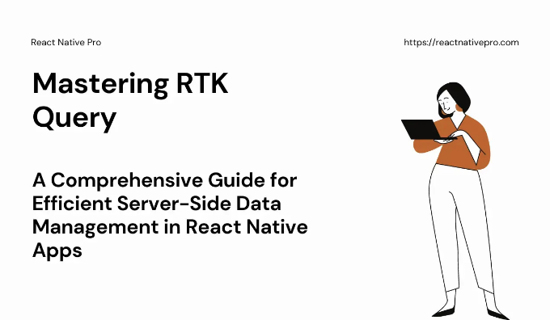
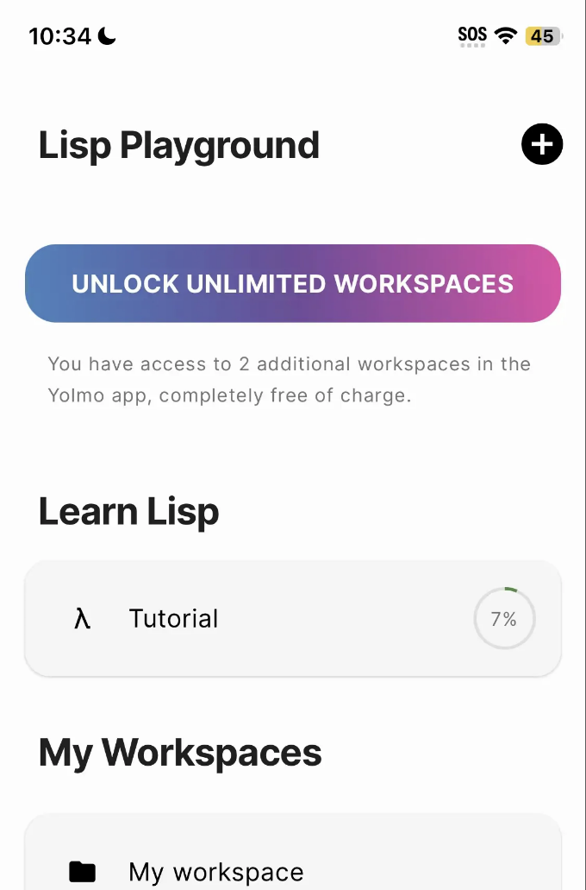

Redux 애플리케이션에서 서버 측 데이터를 효과적으로 처리하려는 개발자들에게는 Redux Toolkit의 RTK Query에 대해 잘 알고 있는 것이 중요합니다. RTK Query는 데이터 가져오기, 캐싱 및 상태 관리 과정을 간단하게 만들어 더 나은 성능의 응용 프로그램을 제공합니다. 이 안내서는 RTK Query의 기초를 다루면서 낙관적 업데이트 및 페이징과 같은 더 복잡한 기능에 대한 통찰을 제공하여 현실 세계의 예제를 사용합니다.

# RTK Query 소개

Redux Toolkit의 주요 구성 요소인 RTK Query는 Redux 애플리케이션에서 서버 측 데이터를 처리하는 것을 훨씬 간단하게 만듭니다. 데이터 관리의 세부 사항을 처리하며 개발자가 응용 프로그램의 기능에 집중할 수 있도록 합니다. RTK Query는 데이터 가져오기와 상태 업데이트를 더욱 간단하게 만드는 일련의 유틸리티 및 기능을 제공하여 보일러 플레이트 코드를 줄입니다.

<!-- ui-log 수평형 -->
<ins class="adsbygoogle"
  style="display:block"
  data-ad-client="ca-pub-4877378276818686"
  data-ad-slot="9743150776"
  data-ad-format="auto"
  data-full-width-responsive="true"></ins>
<component is="script">
(adsbygoogle = window.adsbygoogle || []).push({});
</component>

# RTK Query의 주요 기능들

- 자동 캐싱: RTK Query는 가져온 데이터를 직접 메모리에 저장하여 불필요한 네트워크 요청을 줄이고 애플리케이션 성능을 향상시킵니다.
- 폴링: 일정 간격으로 데이터를 반복적으로 가져와서 업데이트하는 자동 폴링 기능이 포함되어 있습니다.
- 데이터 가져오기와 업데이트: RTK Query는 데이터를 가져오는 방법을 간단하게 만들어주며, 업데이트나 데이터 삽입에 대한 변경을 매끄럽게 지원합니다.
- 태그 기반 무효화: 캐시 무효화를 위해 태그 기반 시스템을 사용하여 관련 데이터가 변경될 때 캐시가 효과적으로 업데이트되도록 합니다.

# Redux 스토어 설정하기

RTK Query로 여정을 시작하려면 초기 단계로 Redux 스토어를 설정해야 합니다. Redux 애플리케이션의 핵심이자 앱의 완전한 상태를 담고 있는 Redux 스토어를 설정합니다. 프로젝트에 Redux Toolkit이 아직 포함되어 있지 않다면, 다음 간단한 npm 명령어로 포함시켜보세요:

<!-- ui-log 수평형 -->
<ins class="adsbygoogle"
  style="display:block"
  data-ad-client="ca-pub-4877378276818686"
  data-ad-slot="9743150776"
  data-ad-format="auto"
  data-full-width-responsive="true"></ins>
<component is="script">
(adsbygoogle = window.adsbygoogle || []).push({});
</component>

```js
npm install @reduxjs/toolkit
```

다음 작업은 Redux 스토어를 생성하는 것입니다. Redux Toolkit에는 configureStore라는 편리한 함수가 함께 제공됩니다. 이 함수는 스토어 생성 프로세스를 간소화하고 Redux Thunk를 포함한 여러 가지 미들웨어 향상 기능을 자동으로 포함합니다. 기본 설정을 살펴보겠습니다:

```js
import { configureStore } from '@reduxjs/toolkit';

const store = configureStore({
  reducer: {
    // 여기에 여러분의 리듀서를 넣어주세요
  },
});
```

configureStore 함수를 사용할 때 리듀서 필드가 포함된 객체를 입력해야 합니다. 이 리듀서 필드는 객체 자체이며 응용 프로그램에 필요한 다양한 리덕싱 함수를 포함해야 합니다.```

<!-- ui-log 수평형 -->
<ins class="adsbygoogle"
  style="display:block"
  data-ad-client="ca-pub-4877378276818686"
  data-ad-slot="9743150776"
  data-ad-format="auto"
  data-full-width-responsive="true"></ins>
<component is="script">
(adsbygoogle = window.adsbygoogle || []).push({});
</component>

이 단계를 완료하면 Redux 저장소가 작동 준비가 된 상태입니다. 다음으로 해야 할 일은 이 저장소를 응용 프로그램에 통합하는 것입니다. 이를 달성하는 방법은 Redux Provider 컴포넌트를 사용하는 것입니다.

```js
import { Provider } from 'react-redux';

<Provider store={store}>
  {/* 여기에 앱을 넣으세요 */}
</Provider>
```

이러한 구성이 완료되면, 응용 프로그램은 Redux와 RTK Query를 활용할 수 있는 상태가 됩니다. 기억해야 할 점은 저장소를 응용 프로그램의 가장 상위 수준에 위치시키는 것이 중요하다는 것입니다. 이렇게 함으로써 필요한 경우 모든 구성 요소가 Redux 상태에 액세스할 수 있는 능력을 갖추게 됩니다.

# 슬라이스란 무엇인가요?

<!-- ui-log 수평형 -->
<ins class="adsbygoogle"
  style="display:block"
  data-ad-client="ca-pub-4877378276818686"
  data-ad-slot="9743150776"
  data-ad-format="auto"
  data-full-width-responsive="true"></ins>
<component is="script">
(adsbygoogle = window.adsbygoogle || []).push({});
</component>

Redux Toolkit에서는 전역 상태가 여러 "slice"로 나뉩니다. 각 "slice"는 특정 응용 프로그램 도메인이나 관련 상태 그룹을 나타냅니다. 이 분할은 Redux 상태를 관리하기 쉽게 만들어줍니다. 왜냐하면 상태 변경이 전체 상태가 아닌 각 slice 단위로 관리되기 때문이죠.

RTK Query로 API slice를 만들려면 createApi 메서드를 사용해야 합니다. 이를 위해 API의 기본 URL과 엔드포인트를 설정해야 합니다.

# 사용자 API Slice 생성 예시

```js
// src/services/userApi.ts
import { createApi, fetchBaseQuery } from '@reduxjs/toolkit/query/react';

export const userApi = createApi({
  reducerPath: 'userApi',
  baseQuery: fetchBaseQuery({ baseUrl: '/api/' }),
  endpoints: (builder) => ({
    getUserMeta: builder.query({
      query: (userId) => `users/${userId}`,
    }),
    updateUser: builder.mutation({
      query: (user) => ({
        url: `users/${user.id}`,
        method: 'PUT',
        body: user,
      }),
    }),
  }),
});
```

<!-- ui-log 수평형 -->
<ins class="adsbygoogle"
  style="display:block"
  data-ad-client="ca-pub-4877378276818686"
  data-ad-slot="9743150776"
  data-ad-format="auto"
  data-full-width-responsive="true"></ins>
<component is="script">
(adsbygoogle = window.adsbygoogle || []).push({});
</component>

이 설정에서는 사용자 메타데이터를 가져오는 getUserMeta 및 사용자 정보를 업데이트하는 updateUser 두 가지 엔드포인트를 정의합니다. RTK Query는 이러한 엔드포인트에 대한 훅을 자동으로 생성하며, 이를 컴포넌트에서 사용할 수 있습니다.

# Redux 스토어 구성에 리듀서 추가하기

Redux 스토어 구성에 userApi 리듀서를 추가하는 것이 매우 중요합니다. 이렇게 함으로써 Redux 스토어가 userApi 슬라이스와 관련된 상태 변경을 처리할 수 있습니다. 이렇게 하면 userApi 슬라이스의 리듀서가 디스패치된 액션을 처리하고 필요에 따라 상태를 업데이트할 수 있습니다. 따라서 사용자 API와 관련된 데이터가 변경될 때(예: 사용자 데이터를 가져오거나 사용자 정보를 업데이트할 때) 이러한 변경 사항이 Redux 스토어에 반영됩니다. 이를 통해 Redux 스토어의 상태가 일관되고 최신 상태로 유지되어 앱의 원활한 작동과 성능에 중요한 역할을 합니다.

Redux 스토어에 슬라이스를 통합하려면 다음 단계를 따라야 합니다:

<!-- ui-log 수평형 -->
<ins class="adsbygoogle"
  style="display:block"
  data-ad-client="ca-pub-4877378276818686"
  data-ad-slot="9743150776"
  data-ad-format="auto"
  data-full-width-responsive="true"></ins>
<component is="script">
(adsbygoogle = window.adsbygoogle || []).push({});
</component>

- 만든 API slice를 가져와주세요. 이 경우에는 userApi입니다.
- 다음으로, slice를 스토어 구성에 통합해야 합니다. 이는 configureStore 함수 내에서 reducer 객체에 새 필드를 추가하는 것을 포함합니다. 필드 키는 API slice를 생성할 때 지정한 reducerPath와 일치해야 합니다. 값은 API slice에서 내보낸 reducer여야 합니다. 예를 들어, 다음과 같이 보일 것입니다: [userApi.reducerPath]: userApi.reducer.
- 마지막으로 API slice의 미들웨어를 스토어에 연결해야 합니다. 이는 getDefaultMiddleware 함수를 호출하여 수행하며, 스토어에 있는 기본 미들웨어의 배열을 생성합니다. 그런 다음 API slice의 미들웨어와 연결합니다: getDefaultMiddleware().concat(userApi.middleware).

```js
export const store = configureStore({
  reducer: {
    [userApi.reducerPath]: userApi.reducer,
  },
  middleware: (getDefaultMiddleware) =>
    getDefaultMiddleware().concat(userApi.middleware),
});
```

# API Endpoints 사용하기

RTK Query는 React hook을 생성하여 컴포넌트에서 API Endpoints와 상호 작용할 수 있습니다.

<!-- ui-log 수평형 -->
<ins class="adsbygoogle"
  style="display:block"
  data-ad-client="ca-pub-4877378276818686"
  data-ad-slot="9743150776"
  data-ad-format="auto"
  data-full-width-responsive="true"></ins>
<component is="script">
(adsbygoogle = window.adsbygoogle || []).push({});
</component>

# 컴포넌트에서 생성된 후크 사용하기

```js
import React from 'react';
import { useGetUserMetaQuery, useUpdateUserMutation } from 'src/services/userApi';

const UserProfile = ({ userId }) => {
  const { data, isLoading, error } = useGetUserMetaQuery(userId);
  const [updateUser, { isLoading: isUpdating }] = useUpdateUserMutation();

  if (isLoading) return <View>Loading...</View>;
  if (error) return <View>Error: {error.message}</View>;

  return (
    <View>
      <Title>{data?.name}</Title>
      <Button onClick={() => updateUser({ id: userId, name: '새 이름' })}>
        이름 업데이트
      </Button>
    </View>
  );
};
```

이 예시는 useGetUserMetaQuery로 사용자 데이터를 가져오고 useUpdateUserMutation으로 업데이트하는 방법을 보여줍니다. RTK Query가 비동기 논리, 로딩 상태 및 오류 처리를 처리하여 상태를 관리하기 쉽게 해줍니다.

# 고급 기능 및 모범 사례

<!-- ui-log 수평형 -->
<ins class="adsbygoogle"
  style="display:block"
  data-ad-client="ca-pub-4877378276818686"
  data-ad-slot="9743150776"
  data-ad-format="auto"
  data-full-width-responsive="true"></ins>
<component is="script">
(adsbygoogle = window.adsbygoogle || []).push({});
</component>

RTK Query는 응담속도와 효율성을 크게 향상시킬 수 있는 다양한 기능을 제공합니다.

- 낙관적 업데이트: 이 기능을 사용하면 UI가 변경 사항을 즉시 반영하여 마치 변경이 성공적으로 이루어진 것처럼 보이며, 오류가 발생한 경우에만 되돌립니다. 또한 RTK Query는
- 페이지네이션을 가능하게 합니다. 이 기술은 대량 데이터를 처리하는 기법으로, 데이터를 작은 조각으로 가져와 표시함으로써 로딩 속도를 향상시키고 초기 데이터 크기를 줄입니다.

# 낙관적 업데이트

낙관적 업데이트는 UI가 서버 응답을 기다리지 않고 요청된 작업(예: 뮤테이션)이 성공적으로 이루어진 것처럼 즉시 업데이트되는 전략입니다. 이 접근 방식은 사용자에게 즉각적인 피드백을 제공하여 응답성을 향상시킨다. 작업이 실패하면 변경 사항이 롤백됩니다.

<!-- ui-log 수평형 -->
<ins class="adsbygoogle"
  style="display:block"
  data-ad-client="ca-pub-4877378276818686"
  data-ad-slot="9743150776"
  data-ad-format="auto"
  data-full-width-responsive="true"></ins>
<component is="script">
(adsbygoogle = window.adsbygoogle || []).push({});
</component>

# 낙관적 업데이트 구현하기

RTK Query는 뮤테이션 내에서 발생하는 onQueryStarted 라이프사이클 이벤트를 통해 낙관적 업데이트를 지원합니다. 사용자 이름을 업데이트할 때 낙관적 업데이트를 구현하는 방법은 다음과 같습니다:

```js
import { userApi } from './[your-api-slice]';

export const optimisticUpdateUser = userApi.useUpdateUserMutation({
  onQueryStarted: async (updatedUser, { dispatch, queryFulfilled }) => {
    // 뮤테이션이 완료되기 전에 UI를 낙관적으로 업데이트합니다
    const patchResult = dispatch(
      userApi.util.updateQueryData('getUserMeta', updatedUser.id, (draft) => {
        // 업데이트가 성공할 것으로 가정하고 필요에 따라 로컬 캐시 수정
        draft.name = updatedUser.name;
      })
    );

    try {
      // 뮤테이션 완료 대기
      await queryFulfilled;
    } catch {
      // 뮤테이션이 실패하면 낙관적 업데이트를 되돌립니다
      patchResult.undo();
    }
  },
});
```

이 코드는 사용자 이름을 UI에서 낙관적으로 업데이트하고, 업데이트 작업이 실패한 경우 변경 사항을 롤백하는 방법을 보여줍니다. 핵심 단계는 다음과 같습니다:

<!-- ui-log 수평형 -->
<ins class="adsbygoogle"
  style="display:block"
  data-ad-client="ca-pub-4877378276818686"
  data-ad-slot="9743150776"
  data-ad-format="auto"
  data-full-width-responsive="true"></ins>
<component is="script">
(adsbygoogle = window.adsbygoogle || []).push({});
</component>

- 변이가 완료되기 전에 지역 캐시를 낙관적으로 업데이트하세요.
- 변이가 해결될 때까지 기다리세요.
- 변이가 실패하면 낙관적 업데이트를 되돌리세요.

## 분할 페이지

페이지네이션은 데이터를 분산 페이지로 나누는 과정으로, 대규모 데이터 세트를 효율적으로 관리하는 데 필수적입니다. RTK Query는 데이터를 청크 단위로 로드하여 성능을 크게 향상시킬 수 있는 페이지네이션 전략을 구현하는 데 도움이 되는 도구를 제공합니다.

## 페이지네이션 구현

<!-- ui-log 수평형 -->
<ins class="adsbygoogle"
  style="display:block"
  data-ad-client="ca-pub-4877378276818686"
  data-ad-slot="9743150776"
  data-ad-format="auto"
  data-full-width-responsive="true"></ins>
<component is="script">
(adsbygoogle = window.adsbygoogle || []).push({});
</component>

RTK Query를 사용하여 페이지네이션을 설정하려면 페이지 번호와 페이지 크기와 같은 페이지네이션 매개변수를 사용하는 엔드포인트를 생성하세요. 아래는 게시물을 검색하는 페이지네이션 엔드포인트를 만드는 간단한 방법입니다:

```js
export const apiSlice = createApi({
  reducerPath: 'api',
  baseQuery: fetchBaseQuery({ baseUrl: '/api' }),
  endpoints: (builder) => ({
    getPosts: builder.query({
      query: ({ page, limit }) => `posts?page=${page}&limit=${limit}`,
      // 페이지 정보를 포함하도록 응답 변환
      transformResponse: (response, meta, arg) => ({
        posts: response,
        page: arg.page,
        limit: arg.limit,
      }),
    }),
  }),
});
```

그리고 이 페이지네이션 쿼리를 컴포넌트에서 사용하는 방법 및 페이지 간 이동을 위한 버튼과 함께는 다음과 같습니다:

```js
const Workspaces = () => {
  const [page, setPage] = useState(1);
  const { data, error, isLoading } = apiSlice.useGetWorkspacesQuery({ page, limit: 10 });

  if (isLoading) return <View>Loading...</View>;
  if (error) return <View>Error occurred</View>;

  return (
    <View>
      {data.posts.map(post => <WorkspaceRecord key={post.id} {...post} />)}
      <Button onClick={() => setPage(prev => prev - 1)}>이전</Button>
      <Button onClick={() => setPage(prev => prev + 1)}>다음</Button>
    </View>
  );
};
```

<!-- ui-log 수평형 -->
<ins class="adsbygoogle"
  style="display:block"
  data-ad-client="ca-pub-4877378276818686"
  data-ad-slot="9743150776"
  data-ad-format="auto"
  data-full-width-responsive="true"></ins>
<component is="script">
(adsbygoogle = window.adsbygoogle || []).push({});
</component>

이 컴포넌트는 페이지네이션 컨트롤을 포함한 포스트 목록을 표시하여 사용자가 데이터 페이지를 효율적으로 탐색할 수 있도록 합니다. 페이지네이션된 쿼리는 제공된 페이지 번호와 페이지 크기를 기반으로 데이터를 청크 단위로 가져와서 로드 시간을 개선하고 초기 페이로드 크기를 줄입니다.

# 사례 연구: Yolmo 앱에서 워크스페이스 생성 및 표시



이 실용적인 예시는 실제 맥락인 Yolmo 앱에서의 워크스페이스 생성 및 표시에서 RTK Query가 어떻게 작동하는지를 보여줍니다. 새 워크스페이스가 생성된 후 부드러운 UI 업데이트에 사용되는 RTK Query의 태그 무효화 기능의 유틸리티를 강조합니다.

<!-- ui-log 수평형 -->
<ins class="adsbygoogle"
  style="display:block"
  data-ad-client="ca-pub-4877378276818686"
  data-ad-slot="9743150776"
  data-ad-format="auto"
  data-full-width-responsive="true"></ins>
<component is="script">
(adsbygoogle = window.adsbygoogle || []).push({});
</component>

# 사례 연구 개요

이 프로세스에는 몇 가지 주요 단계가 있습니다:

- 초기 상태: 응용 프로그램은 작업 공간 목록이 비어있는 상태에서 시작됩니다.
- 생성 화면으로 이동: 사용자는 플러스 버튼을 사용하여 "작업 공간 시작" 화면으로 이동합니다.
- 작업 공간 생성: 필요한 세부 정보를 입력한 후, 변이 요청을 통해 작업 공간이 생성됩니다.
- RTK Query 태그 무효화 활용: 태그 무효화를 사용하여 캐시된 작업 공간 데이터를 오래된 것으로 표시하여 최신 목록을 새로 가져오도록 유도합니다.
- 업데이트된 목록 표시: 사용자는 이후에 새로 생성된 작업 공간이 기존 항목들과 함께 표시되는 목록 화면으로 리디렉션됩니다.

# RTK Query로 구현하기

<!-- ui-log 수평형 -->
<ins class="adsbygoogle"
  style="display:block"
  data-ad-client="ca-pub-4877378276818686"
  data-ad-slot="9743150776"
  data-ad-format="auto"
  data-full-width-responsive="true"></ins>
<component is="script">
(adsbygoogle = window.adsbygoogle || []).push({});
</component>

이 기능을 달성하기 위해 RTK Query의 createApi를 사용하여 작업 영역을 가져오고 만드는 데 사용되는 엔드포인트를 정의하며, 캐시 무효화를 효율적으로 관리하기 위해 태그를 활용합니다:

```js
import { createApi, fetchBaseQuery } from '@reduxjs/toolkit/query/react';

export const workspaceApi = createApi({
  reducerPath: 'workspaceApi',
  baseQuery: fetchBaseQuery({ baseUrl: '/api' }),
  tagTypes: ['Workspace'],
  endpoints: (builder) => ({
    getWorkspaces: builder.query({
      query: () => 'workspaces',
      providesTags: (result = [], error, arg) =>
        result ?
          [...result.map(({ id }) => ({ type: 'Workspace', id })), 'Workspace'] :
          ['Workspace'],
    }),
    createWorkspace: builder.mutation({
      query: (workspace) => ({
        url: 'workspaces',
        method: 'POST',
        body: workspace,
      }),
      invalidatesTags: ['Workspace'],
    }),
  }),
});
```

# 데모 시청

영상을 통해 학습하는 것을 선호하는 사용자를 위해 데모 영상이 제공됩니다. 이 비디오는 Yolmo 앱에서 작업 영역을 생성하는 과정을 안내합니다. RTK Query가 데이터 가져오기, 캐싱 및 업데이트를 관리하는 실제 사용 사례를 명확히 보여줍니다.

<!-- ui-log 수평형 -->
<ins class="adsbygoogle"
  style="display:block"
  data-ad-client="ca-pub-4877378276818686"
  data-ad-slot="9743150776"
  data-ad-format="auto"
  data-full-width-responsive="true"></ins>
<component is="script">
(adsbygoogle = window.adsbygoogle || []).push({});
</component>

# 결론

RTK Query는 Redux Toolkit의 일부로, 응용 프로그램에서 서버 측 데이터 처리를 간단하게 해주는 실용적인 도구입니다. 낙관적 업데이트와 페이지네이션과 같은 유익한 기능을 제공하여 신속한 피드백과 효율적인 데이터로드를 지원하여 사용자 경험을 향상시킵니다. 또한 RTK Query는 불필요한 코드를 최소화하고 캐싱을 자동화하여 현대적인 웹 응용 프로그램 개발에 매우 유용한 도구입니다.