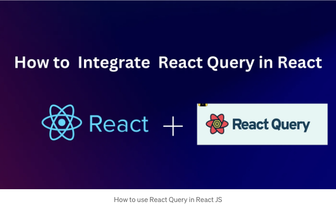
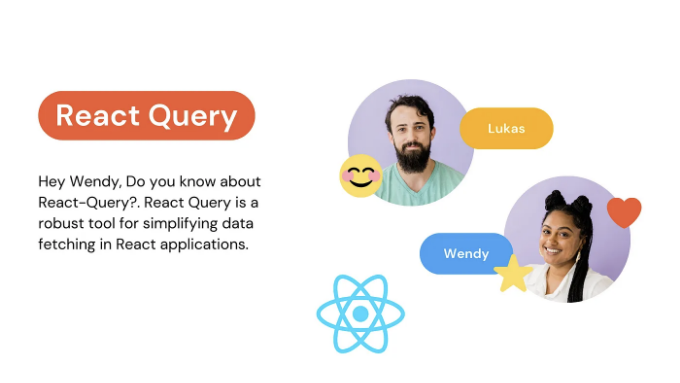

서버에서 정보를 어떻게 가져오는지 궁금한 적이 있나요? 웹 애플리케이션을 만드는 중요한 부분이죠. 일반적으로, 개발자들은 데이터를 가져오기 위해 'fetch'나 'axios'와 같은 도구를 사용합니다. 하지만 더 간단하고 효율적인 방법이 있다면 어떨까요? 그 방법이 바로 React Query입니다! React 프로젝트에서 데이터를 처리하는데 있어서 슈퍼파워를 가진 것과 같죠. 이 블로그에서 React Query가 왜 멋진지 그리고 데이터 작업 시 어떻게 삶을 더 쉽게 만들 수 있는지 살펴볼 거예요. 준비하세요! React 앱을 더욱 강력하고 사용자 친화적으로 만들 준비가 돼야 해요!

자세한 정보는 제 개인 웹사이트에서 웹 개발에 관한 더 깊은 내용을 확인해보세요:

## React 프로젝트에서 React Query 설정하기 ⚙️

<!-- ui-log 수평형 -->
<ins class="adsbygoogle"
  style="display:block"
  data-ad-client="ca-pub-4877378276818686"
  data-ad-slot="9743150776"
  data-ad-format="auto"
  data-full-width-responsive="true"></ins>
<component is="script">
(adsbygoogle = window.adsbygoogle || []).push({});
</component>

## 단계 1: React Query 설치하기

코드 작업에 들어가기 전에, 프로젝트에 React Query를 추가하는 것이 첫 번째 단계입니다. 터미널을 열고 다음 중 하나의 명령을 실행해주세요:

npm을 사용하는 경우:

```js
npm install react-query
```

<!-- ui-log 수평형 -->
<ins class="adsbygoogle"
  style="display:block"
  data-ad-client="ca-pub-4877378276818686"
  data-ad-slot="9743150776"
  data-ad-format="auto"
  data-full-width-responsive="true"></ins>
<component is="script">
(adsbygoogle = window.adsbygoogle || []).push({});
</component>

이렇게 하시면 됩니다:

```js
yarn add react-query
```

이 명령은 React Query를 설치하고 프로젝트의 종속성에 추가하여 사용할 준비를 합니다.

## 단계 2: 기본 구성 💡

<!-- ui-log 수평형 -->
<ins class="adsbygoogle"
  style="display:block"
  data-ad-client="ca-pub-4877378276818686"
  data-ad-slot="9743150776"
  data-ad-format="auto"
  data-full-width-responsive="true"></ins>
<component is="script">
(adsbygoogle = window.adsbygoogle || []).push({});
</component>

React Query를 설치했다면, 다음 단계는 React 애플리케이션에서 React Query를 구성하는 것입니다. React Query에는 QueryClient와 QueryClientProvider가 포함되어 있어서 React Query 환경을 초기화하고 제공하는 데 중요합니다.

다음은 이를 설정하는 간단한 방법입니다:

- React Query에서 QueryClient 및 QueryClientProvider를 가져옵니다:

```js
import { QueryClient, QueryClientProvider } from 'react-query';
```

<!-- ui-log 수평형 -->
<ins class="adsbygoogle"
  style="display:block"
  data-ad-client="ca-pub-4877378276818686"
  data-ad-slot="9743150776"
  data-ad-format="auto"
  data-full-width-responsive="true"></ins>
<component is="script">
(adsbygoogle = window.adsbygoogle || []).push({});
</component>

2. QueryClient의 새 인스턴스를 만듭니다:

```js
const queryClient = new QueryClient();
```

3. 애플리케이션의 루트 컴포넌트를 QueryClientProvider로 감싸고 queryClient 인스턴스를 속성(prop)으로 전달하세요. App 컴포넌트는 다음과 같이 보입니다:

```js
import React from 'react';
import { QueryClient, QueryClientProvider } from 'react-query';
import Dashboard from './Dashboard'; // 대시보드(Dashboard)가 프로젝트에 있는 컴포넌트라고 가정합니다

// 클라이언트 생성
const queryClient = new QueryClient();

function App() {
  return (
    <QueryClientProvider client={queryClient}>
      <div className="App">
        {/* 대시보드(Dashboard) 컴포넌트는 애플리케이션에 포함되어 있습니다 */}
        <Dashboard />
      </div>
    </QueryClientProvider>
  );
}

export default App;
```

<!-- ui-log 수평형 -->
<ins class="adsbygoogle"
  style="display:block"
  data-ad-client="ca-pub-4877378276818686"
  data-ad-slot="9743150776"
  data-ad-format="auto"
  data-full-width-responsive="true"></ins>
<component is="script">
(adsbygoogle = window.adsbygoogle || []).push({});
</component>

이 설정은 React Query를 React 애플리케이션에 효과적으로 통합하여 프로젝트 전체에서 해당 기능을 사용할 수 있게 합니다.



## React Query를 사용하여 데이터 가져오기 📡

React Query는 주로 서버로부터 데이터를 가져오는 읽기 작업에 주로 초점을 맞춘 React 애플리케이션에서 데이터 가져오기를 간소화하는 강력한 도구입니다. 이 섹션에서는 효율적인 데이터 가져오기를 위해 React Query의 useQuery 훅을 사용하는 과정을 안내합니다.

<!-- ui-log 수평형 -->
<ins class="adsbygoogle"
  style="display:block"
  data-ad-client="ca-pub-4877378276818686"
  data-ad-slot="9743150776"
  data-ad-format="auto"
  data-full-width-responsive="true"></ins>
<component is="script">
(adsbygoogle = window.adsbygoogle || []).push({});
</component>

useQuery 이해하기

useQuery는 React Query에서 서버 데이터를 가져오고 캐싱 및 업데이트하는 핵심 훅입니다. 이는 API에서 데이터를 가져오는 복잡한 프로세스를 추상화하고 단순화합니다.

먼저, React Query에서 useQuery를 import하세요:

```js
import { useQuery } from 'react-query';
```

<!-- ui-log 수평형 -->
<ins class="adsbygoogle"
  style="display:block"
  data-ad-client="ca-pub-4877378276818686"
  data-ad-slot="9743150776"
  data-ad-format="auto"
  data-full-width-responsive="true"></ins>
<component is="script">
(adsbygoogle = window.adsbygoogle || []).push({});
</component>

그럼, 데이터를 가져오는 기능을 만들어보세요. 예를 들어, JSON API에서 데이터를 가져오는 방법입니다:

```js
// JSONPlaceholder API에서 게시물을 가져오는 기능
const fetchPosts = async () => {
  const response = await fetch('https://jsonplaceholder.typicode.com/posts');
  return response.json();
};
```

이제 컴포넌트에서 useQuery 훅을 사용하여 fetchData 함수를 호출하세요. 완성된 코드는 다음과 같이 보일 것입니다:

```js
// Dashboard.js
import React from 'react';
import { useQuery } from 'react-query';

// JSONPlaceholder API에서 게시물을 가져오는 기능
const fetchPosts = async () => {
  const response = await fetch('https://jsonplaceholder.typicode.com/posts');
  return response.json();
};

// useQuery를 사용하여 데이터를 가져오는 React 컴포넌트
function Dashboard() {
  const { data: posts, isLoading, error } = useQuery('posts', fetchPosts);

  if (isLoading) return <div>Loading...</div>;
  if (error) return <div>에러 발생: {error.message}</div>;

  return (
    <div>
      {posts && posts.map(post => (
        <div key={post.id}>
          <h3>{post.title}</h3>
          <p>{post.body}</p>
        </div>
      ))}
    </div>
  );
}

export default Dashboard;
```

<!-- ui-log 수평형 -->
<ins class="adsbygoogle"
  style="display:block"
  data-ad-client="ca-pub-4877378276818686"
  data-ad-slot="9743150776"
  data-ad-format="auto"
  data-full-width-responsive="true"></ins>
<component is="script">
(adsbygoogle = window.adsbygoogle || []).push({});
</component>

리액트 쿼리의 useQuery 훅은 첫 번째 매개변수로 고유 식별자 (`posts`)와 두 번째로 데이터 가져오는 함수(fetchPosts)를 사용합니다. 이 훅은 데이터(posts), 로딩 상태(isLoading), 그리고 에러 상세(error)를 포함한 객체를 반환합니다.

useQuery를 활용하면 리액트 애플리케이션에서 데이터 가져오는 프로세스를 향상시켜 보다 효율적이고 사용자 친화적으로 만들 수 있습니다. 이 접근 방식은 비동기 데이터 작업을 처리를 간소화해주어 개발자가 더 많이 풍부한 사용자 인터페이스를 구축하는 데 집중할 수 있게 해줍니다.

기본 설정 외에도, 리액트 쿼리는 데이터 가져오는 프로세스를 향상시키는 강력한 구성을 제공합니다. 여기에는 몇 가지 예시가 있습니다:

## 1. Polling Data with React Query 🔄

<!-- ui-log 수평형 -->
<ins class="adsbygoogle"
  style="display:block"
  data-ad-client="ca-pub-4877378276818686"
  data-ad-slot="9743150776"
  data-ad-format="auto"
  data-full-width-responsive="true"></ins>
<component is="script">
(adsbygoogle = window.adsbygoogle || []).push({});
</component>

폴링은 응용 프로그램이 지정된 간격으로 자동으로 새 데이터를 가져오는 기술입니다. React Query는 pollInterval 옵션을 사용하여 이를 쉽게 구현할 수 있게 해줍니다.

```js
import React from 'react';
import { useQuery } from 'react-query';

const fetchPosts = async () => {
  const response = await fetch('https://jsonplaceholder.typicode.com/posts');
  return response.json();
};

function PollingExample() {
  const { data: posts, isLoading, error } = useQuery('posts', fetchPosts, {
    pollInterval: 5000, // 5초마다 데이터 가져오기
  });

  if (isLoading) return <div>Loading...</div>;
  if (error) return <div>오류가 발생했습니다: {error.message}</div>;

  return (
    <div>
      {posts && posts.map(post => (
        <div key={post.id}>
          <h3>{post.title}</h3>
          <p>{post.body}</p>
        </div>
      ))}
    </div>
  );
}

export default PollingExample;
```

이 예제에서는 pollInterval이 5000밀리초(5초)로 설정되어 있으므로 구성 요소는 해당 간격으로 서버에서 자동으로 데이터를 다시 가져옵니다.

## 2. 조건부 데이터 가져오기 - React Query 🎯

<!-- ui-log 수평형 -->
<ins class="adsbygoogle"
  style="display:block"
  data-ad-client="ca-pub-4877378276818686"
  data-ad-slot="9743150776"
  data-ad-format="auto"
  data-full-width-responsive="true"></ins>
<component is="script">
(adsbygoogle = window.adsbygoogle || []).push({});
</component>

가끔은 사용자 행동과 같은 특정 기준에 따라 데이터를 조건부로 가져오고 싶을 수 있습니다. enabled 옵션을 사용하면 쿼리가 언제 데이터를 가져와야 하는지 제어할 수 있습니다.

```js
import React, { useState } from 'react';
import { useQuery } from 'react-query';

const fetchUserData = async (userId) => {
  const response = await fetch(`https://jsonplaceholder.typicode.com/users/${userId}`);
  return response.json();
};

function ConditionalFetchingExample() {
  const [userId, setUserId] = useState(1);

  const { data: user, isLoading, error } = useQuery(['user', userId], () => fetchUserData(userId), {
    enabled: userId !== null, // userId가 null이 아닐 때만 데이터를 가져옴
  });

  if (isLoading) return <div>Loading...</div>;
  if (error) return <div>An error has occurred: {error.message}</div>;

  return (
    <div>
      <h2>User Details</h2>
      <p>Name: {user.name}</p>
      <p>Email: {user.email}</p>

      <button onClick={() => setUserId(userId + 1)}>
        Load Next User
      </button>
    </div>
  );
}

export default ConditionalFetchingExample;
```

이 예제에서 enabled 옵션은 userId가 null이 아닐 때에만 쿼리가 실행되도록 보장하여 데이터 가져오기가 발생하는 시점을 제어할 수 있습니다.

## React Query에서 변경사항(생성, 업데이트, 삭제) 🔄

<!-- ui-log 수평형 -->
<ins class="adsbygoogle"
  style="display:block"
  data-ad-client="ca-pub-4877378276818686"
  data-ad-slot="9743150776"
  data-ad-format="auto"
  data-full-width-responsive="true"></ins>
<component is="script">
(adsbygoogle = window.adsbygoogle || []).push({});
</component>

React Query에서 useQuery는 데이터를 가져오는 데 훌륭하며, useMutation은 생성, 업데이트 또는 삭제하는 데 사용하는 후크입니다. 즉, 서버의 데이터를 수정하는 모든 작업에 해당합니다. useQuery와 useMutation 간의 구분은 React Query의 설계에서 중요하며, 데이터 관리에서 "읽기" (쿼리)와 "쓰기" (뮤테이션) 사이의 전형적인 구분을 반영합니다.

useQuery와의 차이점:

- useQuery는 데이터를 가져와 자동으로 캐싱하는 데 사용되지만, useMutation은 데이터 변경(생성, 업데이트, 삭제)을 위해 specifically 설계되었습니다.
- useMutation은 부수효과를 보다 더 제어할 수 있으며, 성공 및 에러 시나리오를 보다 명시적으로 처리할 수 있습니다.

JSONPlaceholder API를 사용하여 useMutation 구현하기:

<!-- ui-log 수평형 -->
<ins class="adsbygoogle"
  style="display:block"
  data-ad-client="ca-pub-4877378276818686"
  data-ad-slot="9743150776"
  data-ad-format="auto"
  data-full-width-responsive="true"></ins>
<component is="script">
(adsbygoogle = window.adsbygoogle || []).push({});
</component>

간단한 예제를 만들어서 useMutation을 사용하여 JSONPlaceholder API에 데이터를 게시해 봅시다.

- 변이 함수 설정:

```js
import { useMutation } from 'react-query';

const createPost = async (postData) => {
  const response = await fetch('https://jsonplaceholder.typicode.com/posts', {
    method: 'POST',
    headers: {
      'Content-type': 'application/json; charset=UTF-8',
    },
    body: JSON.stringify(postData),
  });
  return response.json();
};
```

React 컴포넌트에서 useMutation 사용하기:

<!-- ui-log 수평형 -->
<ins class="adsbygoogle"
  style="display:block"
  data-ad-client="ca-pub-4877378276818686"
  data-ad-slot="9743150776"
  data-ad-format="auto"
  data-full-width-responsive="true"></ins>
<component is="script">
(adsbygoogle = window.adsbygoogle || []).push({});
</component>

```js
function NewPostForm() {
  const { mutate, isLoading, error } = useMutation(createPost, {
    onSuccess: () => {
      // 게시물 생성 성공 후 수행할 작업
      console.log('게시물이 성공적으로 생성되었습니다');
    },
    onError: (error) => {
      // 에러 처리
      console.error('게시물 생성 중 에러 발생:', error);
    },
  });

  const handleSubmit = (event) => {
    event.preventDefault();
    const newPost = { title: '내 새 게시물', body: '이것은 게시물 내용입니다.', userId: 1 };
    mutate(newPost);
  };

  return (
    <div>
      {error && <p>게시물 생성 중 에러 발생</p>}
      {isLoading ? (
        <p>제출 중...</p>
      ) : (
        <form onSubmit={handleSubmit}>
          {/* 여기에 폼 요소 */}
          <button type="submit">게시물 생성</button>
        </form>
      )}
    </div>
  );
}
```

React Query를 사용하면 React 애플리케이션에서 데이터 수정을 효율적으로 다룰 수 있는 체계적이고 효율적인 접근 방법을 제공하여 개발자 경험과 애플리케이션의 전반적인 기능을 향상시킵니다.

기본 설정 외에도 React Query는 데이터 검색 프로세스를 강화하기 위한 강력한 구성을 제공합니다. 이러한 고급 기능을 탐색하기 전에 왜 이러한 기능들이 앱 성능 최적화에 중요한지 알아보겠습니다.

참고: React Query의 고급 기능은 기능적인 측면 뿐만 아니라 애플리케이션을 더 빠르고 반응성이 높은 것으로 만드는 데 중요한 역할을 합니다. 캐싱, 재시도 로직 및 프리패칭은 성능 증대제 같은 역할을 하며 데이터 검색 및 업데이트를 효율적으로 관리하여 앱이 사용자에게 원활한 경험을 제공하도록합니다.

<!-- ui-log 수평형 -->
<ins class="adsbygoogle"
  style="display:block"
  data-ad-client="ca-pub-4877378276818686"
  data-ad-slot="9743150776"
  data-ad-format="auto"
  data-full-width-responsive="true"></ins>
<component is="script">
(adsbygoogle = window.adsbygoogle || []).push({});
</component>

## 🔥React Query의 고급 기능: 캐싱, 재시도, 그리고 프리패칭

React Query는 여러 가지 고급 기능을 제공하는데, 이 기능들은 애플리케이션의 성능과 사용자 경험을 크게 향상시킬 수 있습니다. 캐싱, 재시도 메커니즘, 그리고 프리패칭에 대해 관련 코드 스니펫과 함께 알아봅시다.

## React Query를 활용한 캐싱 🌐

캐싱은 React Query의 주요 기능 중 하나입니다. 이는 쿼리 결과를 자동으로 캐시하여 불필요한 네트워크 요청의 수를 줄입니다.

<!-- ui-log 수평형 -->
<ins class="adsbygoogle"
  style="display:block"
  data-ad-client="ca-pub-4877378276818686"
  data-ad-slot="9743150776"
  data-ad-format="auto"
  data-full-width-responsive="true"></ins>
<component is="script">
(adsbygoogle = window.adsbygoogle || []).push({});
</component>

```js
const { data } = useQuery('todos', fetchTodos, {
  staleTime: 5 * 60 * 1000, // 5 분
  cacheTime: 30 * 60 * 1000, // 30 분
});
```

이 예시에서, staleTime은 가져온 데이터가 얼마나 신선한 것으로 간주되는지를 결정하고, cacheTime은 사용되고 있지 않다면 캐시된 데이터를 얼마나 오래 유지해야 하는지를 결정합니다.

## React Query에서 재시도 로직 📚

React Query를 사용하면 쿼리에 대한 재시도 로직을 구현할 수 있어요. 이는 가끔 발생하는 네트워크 문제를 처리하는 데 특히 유용합니다.```

<!-- ui-log 수평형 -->
<ins class="adsbygoogle"
  style="display:block"
  data-ad-client="ca-pub-4877378276818686"
  data-ad-slot="9743150776"
  data-ad-format="auto"
  data-full-width-responsive="true"></ins>
<component is="script">
(adsbygoogle = window.adsbygoogle || []).push({});
</component>

```js
const { 데이터 } = useQuery('todos', fetchTodos, {
  retry: 3, // 재시도 횟수
  retryDelay: attemptIndex => Math.min(1000 * 2 ** attemptIndex, 30000), // 지수 백오프
});
```

이 구성은 각 시도 사이에 증가하는 지연 시간으로 최대 3회까지 쿼리를 다시 시도합니다.

## React Query로 데이터 미리 가져오기 🌱

미리 가져오기를 통해 필요한 시점보다 데이터를 로드하여 미래의 네비게이션 및 상호작용이 더 빠르게 느껴지도록 사용자 경험을 향상시킬 수 있습니다.

<!-- ui-log 수평형 -->
<ins class="adsbygoogle"
  style="display:block"
  data-ad-client="ca-pub-4877378276818686"
  data-ad-slot="9743150776"
  data-ad-format="auto"
  data-full-width-responsive="true"></ins>
<component is="script">
(adsbygoogle = window.adsbygoogle || []).push({});
</component>

```js
const queryClient = useQueryClient();

// 컴포넌트가 마운트될 때 todos를 미리 가져오도록 prefetchQuery를 사용합니다.
useEffect(() => {
  queryClient.prefetchQuery('todos', fetchTodos);
}, [queryClient]);

// 이후 todos를 표시해야 할 때
const { data: todos } = useQuery('todos', fetchTodos);
```

이 코드에서 prefetchQuery는 컴포넌트가 마운트될 때 todos를 미리 가져오기 위해 사용됩니다. 따라서 사용자가 todos를 확인해야 할 때 이미 로드되어 있어 즉시 표시할 수 있습니다.

## 결론 📑

요약하면, React Query는 React 애플리케이션에서 데이터 작업을 효율적으로 처리하는 강력한 도구로 나타납니다. 자동 캐싱, 백그라운드 업데이트, 내장형 로딩 및 오류 처리와 같은 기능을 통해 UI 개발에 우선적으로 주의를 기울일 수 있도록 돕습니다. 데이터를 가져오기 위해 useQuery를 사용하고 수정을 위해 useMutation을 사용하는 구조화된 사용법은 캐싱과 재시도 메커니즘과 같은 고급 기능과 결합하여 성능을 최적화합니다. 초보자든 숙련된 개발자든 React Query는 빠르고 효율적이며 견고한 애플리케이션을 육성하는 필수적인 요소로 입증됩니다. 

<!-- ui-log 수평형 -->
<ins class="adsbygoogle"
  style="display:block"
  data-ad-client="ca-pub-4877378276818686"
  data-ad-slot="9743150776"
  data-ad-format="auto"
  data-full-width-responsive="true"></ins>
<component is="script">
(adsbygoogle = window.adsbygoogle || []).push({});
</component>

React Query를 프로젝트에서 계속 탐구하고 구현하면, 현대적이고 데이터 중심의 웹 애플리케이션을 만드는 데 필수적인 역할을 발견할 것입니다. 추가 학습을 위해 React Query 문서는 깊이 있는 가이드와 API 참조를 제공하는 훌륭한 자원입니다.

코딩 즐기세요! ❤️

이 기사를 즐겼다면, 웹 개발에 대한 더 심도 있는 토론과 통찰력을 얻기 위해 제 개인 블로그 Program With Jayanth를 방문해보세요.

# Stackademic

<!-- ui-log 수평형 -->
<ins class="adsbygoogle"
  style="display:block"
  data-ad-client="ca-pub-4877378276818686"
  data-ad-slot="9743150776"
  data-ad-format="auto"
  data-full-width-responsive="true"></ins>
<component is="script">
(adsbygoogle = window.adsbygoogle || []).push({});
</component>

이 글을 끝까지 읽어 주셔서 감사합니다. 떠나시기 전에:

- 작가를 응원하고 팔로우해 주시면 감사하겠습니다! 👏
- Twitter(X), LinkedIn, YouTube에서 저희를 팔로우해 주세요.
- Stackademic.com을 방문하여 전 세계적으로 무료 프로그래밍 교육을 더 democretize하는 방법에 대해 더 알아보세요.