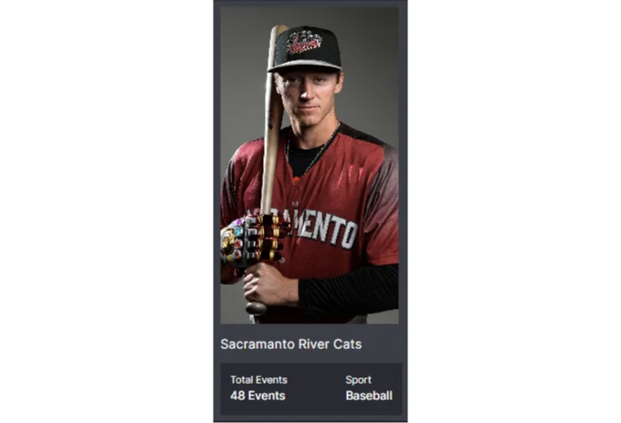

리액트를 배우기 시작한지 어느 정도 시간이 지났죠. 정말 흥미로운 여정이에요. 대부분의 개발자들처럼, 매 단계마다 리액트의 능력에 더욱 빠져들고 있다는 것을 인정해요.

백엔드 개발에서 시작해서, 노력하며 프론트엔드 기술로 나아가는 과정에서 특히 리액트에 집중하며 계속해서 학습 중이에요.

초보자로서, 재사용 가능한 컴포넌트가 정확히 무엇인지 이해하는 것이 종종 헷갈릴 수 있는데, 리액트에서의 컴포넌트 재사용성은 그 중에서도 가장 사랑받고 인기 있는 측면 중 하나에요.

아래 코드 스니펫을 살펴보면, Component 폴더에 깔끔하게 구성된 Card 컴포넌트를 확인할 수 있고, 이를 Homepage에서 재사용하는 방법을 보실 수 있어요:

<!-- ui-log 수평형 -->
<ins class="adsbygoogle"
  style="display:block"
  data-ad-client="ca-pub-4877378276818686"
  data-ad-slot="9743150776"
  data-ad-format="auto"
  data-full-width-responsive="true"></ins>
<component is="script">
(adsbygoogle = window.adsbygoogle || []).push({});
</component>

위의 내용은 카드 컴포넌트를 재사용하는 것처럼 보일 수 있어요, 그렇죠?

하지만,

재사용성의 진정한 가치는 웹사이트의 여러 부분에서 달라진 맥락에 맞게 컴포넌트를 유연하게 사용하여 필요에 따라 변화하는 기능과 디자인에 매끄럽게 적응하는 것에 있어요.

<!-- ui-log 수평형 -->
<ins class="adsbygoogle"
  style="display:block"
  data-ad-client="ca-pub-4877378276818686"
  data-ad-slot="9743150776"
  data-ad-format="auto"
  data-full-width-responsive="true"></ins>
<component is="script">
(adsbygoogle = window.adsbygoogle || []).push({});
</component>

# 재사용성 예제 #1

아래 예시를 살펴보세요. 한 가지 Card 구성 요소를 사용하여 서로 다른 스타일과 동적 데이터를 가진 세 가지 유형의 카드를 렌더링할 수 있는 실용적인 예제를 보여줍니다:

- 이벤트 카드



<!-- ui-log 수평형 -->
<ins class="adsbygoogle"
  style="display:block"
  data-ad-client="ca-pub-4877378276818686"
  data-ad-slot="9743150776"
  data-ad-format="auto"
  data-full-width-responsive="true"></ins>
<component is="script">
(adsbygoogle = window.adsbygoogle || []).push({});
</component>

- 광고 카드


- 컬렉션 카드


<!-- ui-log 수평형 -->
<ins class="adsbygoogle"
  style="display:block"
  data-ad-client="ca-pub-4877378276818686"
  data-ad-slot="9743150776"
  data-ad-format="auto"
  data-full-width-responsive="true"></ins>
<component is="script">
(adsbygoogle = window.adsbygoogle || []).push({});
</component>

- 모든 세 가지 버전의 단일 카드 구성 요소를 확인해보세요

여기가 마법이죠: 단일 카드 구성 요소와 적절한 변형 처리로 위의 세 가지 다양한 유형의 카드를 쉽게 렌더링할 수 있어요:

```js
<Card variant="event" data={eventsData} />
<Card variant="advertisement" data={advertisementData} />
<Card variant="collection" data={collectionData} />
```

인상적이죠, 그렇죠?

<!-- ui-log 수평형 -->
<ins class="adsbygoogle"
  style="display:block"
  data-ad-client="ca-pub-4877378276818686"
  data-ad-slot="9743150776"
  data-ad-format="auto"
  data-full-width-responsive="true"></ins>
<component is="script">
(adsbygoogle = window.adsbygoogle || []).push({});
</component>

이 접근 방식을 통해 우리는 변형별로 구성 요소를 확장하여 코드베이스를 중복으로 채우지 않고도 확장성을 가질 수 있게 되었습니다.

# 재사용 예시 #2

이제, 저는 또 다른 예시로 들어가보겠습니다. 여기서는 두 가지 목적으로 사용되는 프로필 카드 컴포넌트를 사용합니다: 사용자 프로필을 팀에 추가하거나 팀에서 제거하는 것.

두 가지 변형 모두 동일한 사용자 정보를 공유하지만 기능과 버튼 작업에서 차이가 있습니다.

<!-- ui-log 수평형 -->
<ins class="adsbygoogle"
  style="display:block"
  data-ad-client="ca-pub-4877378276818686"
  data-ad-slot="9743150776"
  data-ad-format="auto"
  data-full-width-responsive="true"></ins>
<component is="script">
(adsbygoogle = window.adsbygoogle || []).push({});
</component>

- 팀에 회원을 추가하는 프로필 카드:


- 팀에서 회원을 삭제하는 프로필 카드:


<!-- ui-log 수평형 -->
<ins class="adsbygoogle"
  style="display:block"
  data-ad-client="ca-pub-4877378276818686"
  data-ad-slot="9743150776"
  data-ad-format="auto"
  data-full-width-responsive="true"></ins>
<component is="script">
(adsbygoogle = window.adsbygoogle || []).push({});
</component>

다양한 기능의 차이점에도 불구하고, 코드에서 이러한 변형을 매끄럽게 사용할 수 있습니다:

```js
<ProfileCard variant="addToTeam" data={userData} />
<ProfileCard variant="removeFromTeam" data={userData} />
```

# 예제에 대한 이야기를 충분히 했으니, 이러한 재사용성을 두 가지 간단한 단계로 어떻게 달성할 수 있는지 빠르게 이해해 봅시다:

## 단계 1: 변형 식별을 위해 프롭스 보내기:

<!-- ui-log 수평형 -->
<ins class="adsbygoogle"
  style="display:block"
  data-ad-client="ca-pub-4877378276818686"
  data-ad-slot="9743150776"
  data-ad-format="auto"
  data-full-width-responsive="true"></ins>
<component is="script">
(adsbygoogle = window.adsbygoogle || []).push({});
</component>

프롭(prop)은 컴포넌트의 다양한 변형을 결정하는 데 중요한 역할을 합니다. "addToTeam" 또는 "removeFromTeam"과 같은 변형별 프롭(prop)을 전달하여 컴포넌트가 해당대로 렌더링되도록 신호를 보냅니다.

아래는 컴포넌트로 프롭(prop)를 보내는 예시입니다(변형과 사용자 데이터로 구성됨):

```js
import React from "react";
import ProfileCard from "./ProfileCard"; // 컴포넌트가 별도 파일에 있는 것으로 가정합니다

function UserProfile() {
  const userData = {
    name: "John Doe",
    email: "johndoe@example.com",
    // 다른 사용자 데이터
  };

  return (
    <div className="user-profile">
      <h1>User Profile</h1>
      {/* 변형과 userData 프롭(prop) 보내기 */}
      <ProfileCard variant="addToTeam" data={userData} />
      <ProfileCard variant="removeFromTeam" data={userData} />
    </div>
  );
}

export default UserProfile;
```

## 단계 2: 프롭(prop)을 기반으로 조건부 렌더링 구현하기

<!-- ui-log 수평형 -->
<ins class="adsbygoogle"
  style="display:block"
  data-ad-client="ca-pub-4877378276818686"
  data-ad-slot="9743150776"
  data-ad-format="auto"
  data-full-width-responsive="true"></ins>
<component is="script">
(adsbygoogle = window.adsbygoogle || []).push({});
</component>

조건부 렌더링은 매우 강력한 기능 중 하나로, 제공된 프롭스(이 경우에는 variant)에 기반하여 컴포넌트를 조건부로 렌더링할 수 있게 해줍니다.

아래는 이 기능을 보여주는 간단한 코드 스니펫입니다:

```js
import React from "react";

function ProfileCard({ variant, data }) {
  const addToTeam = () => {
    // 팀에 사용자 추가하는 로직을 추가하세요
  };

  const removeFromTeam = () => {
    // 팀에서 사용자 제거하는 로직을 추가하세요
  };

  return (
    <div className="profile-card">
      <h2>{data.name}</h2>
      <p>{data.email}</p>
<!-- 삼항 연산자를 사용하여 조건부 렌더링하기 -->
      {variant === 'addToTeam' ? (
        <button onClick={addToTeam}>Add to Team</button>
      ) : (
        <button onClick={removeFromTeam}>Remove from Team</button>
      )}
    </div>
  );
}

export default ProfileCard;
```

예제에서 보이듯이, 우리는 variant 타입과 데이터를 프롭스로 보내고, 삼항 연산자를 기반으로 조건부 렌더링을 구현했습니다. 삼항 연산자 {조건 ? (참 값) : (거짓 값)}은 React에서 콘텐츠를 조건부로 렌더링하는 일반적인 방법 중 하나이며, 특히 간단한 조건에 유용합니다.

<!-- ui-log 수평형 -->
<ins class="adsbygoogle"
  style="display:block"
  data-ad-client="ca-pub-4877378276818686"
  data-ad-slot="9743150776"
  data-ad-format="auto"
  data-full-width-responsive="true"></ins>
<component is="script">
(adsbygoogle = window.adsbygoogle || []).push({});
</component>

# 삼항 연산자 이외에도 React에서 조건부 렌더링을 위한 여러 가지 옵션이 제공됩니다:

## if문 사용하기

JSX는 if문을 직접 지원하지는 않지만, 컴포넌트의 JavaScript 부분 내에서 사용할 수 있습니다. 예를 들어:

```js
function UserProfile({ variant, data }) {
  if (variant === "addToTeam") {
    return <ProfileCardAdd data={data} />;
  } else if (variant === "removeFromTeam") {
    return <ProfileCardRemove data={data} />;
  } else {
    return <div>변형이 지정되지 않았습니다.</div>;
  }
}
```

<!-- ui-log 수평형 -->
<ins class="adsbygoogle"
  style="display:block"
  data-ad-client="ca-pub-4877378276818686"
  data-ad-slot="9743150776"
  data-ad-format="auto"
  data-full-width-responsive="true"></ins>
<component is="script">
(adsbygoogle = window.adsbygoogle || []).push({});
</component>

## switch 문 사용하기

if 문과 유사하게, switch 문을 사용하여 더 복잡한 조건부 렌더링을 할 수 있습니다:

```js
function UserProfile({ variant, data }) {
  switch (variant) {
    case "addToTeam":
      return <ProfileCardAdd data={data} />;
    case "removeFromTeam":
      return <ProfileCardRemove data={data} />;
    default:
      return <div>No variant specified</div>;
  }
}
``` 

## 논리 && 연산자 사용하기

<!-- ui-log 수평형 -->
<ins class="adsbygoogle"
  style="display:block"
  data-ad-client="ca-pub-4877378276818686"
  data-ad-slot="9743150776"
  data-ad-format="auto"
  data-full-width-responsive="true"></ins>
<component is="script">
(adsbygoogle = window.adsbygoogle || []).push({});
</component>

논리 'AND' (&&) 연산자를 사용하여 부울 조건에 따라 내용을 조건부로 렌더링할 수 있어요:

```js
function UserProfile({ isLoggedIn }) {
  return (
    <div>
      {isLoggedIn && <p>Welcome, User!</p>}
      {!isLoggedIn && <p>Please log in.</p>}
    </div>
  );
}
```

## 단락 평가 사용하기

논리 'AND' 연산자와 비슷하게, 조건부 렌더링을 위해 단락 평가를 사용할 수 있어요.

<!-- ui-log 수평형 -->
<ins class="adsbygoogle"
  style="display:block"
  data-ad-client="ca-pub-4877378276818686"
  data-ad-slot="9743150776"
  data-ad-format="auto"
  data-full-width-responsive="true"></ins>
<component is="script">
(adsbygoogle = window.adsbygoogle || []).push({});
</component>

```js
function UserProfile({ isLoading }) {
  return (
    <div>
      {isLoading || <p>Loading...</p>}
      {!isLoading && <UserProfileContent />}
    </div>
  );
}
```

## 함수를 사용하여 조건부 렌더링하기

조건에 따라 JSX를 반환하는 별도의 함수를 생성하고 해당 함수를 컴포넌트의 render 메서드 내에서 호출할 수 있습니다. 이는 복잡한 렌더링 로직에 유용할 수 있습니다.

```js
function renderContent(variant, data) {
  if (variant === "addToTeam") {
    return <ProfileCardAdd data={data} />;
  } else if (variant === "removeFromTeam") {
    return <ProfileCardRemove data={data} />;
  } else {
    return <div>No variant specified</div>;
  }
}

function UserProfile({ variant, data }) {
  return <div>{renderContent(variant, data)}</div>;
}
```

<!-- ui-log 수평형 -->
<ins class="adsbygoogle"
  style="display:block"
  data-ad-client="ca-pub-4877378276818686"
  data-ad-slot="9743150776"
  data-ad-format="auto"
  data-full-width-responsive="true"></ins>
<component is="script">
(adsbygoogle = window.adsbygoogle || []).push({});
</component>

## 고차 컴포넌트(HOC) 사용하기

특정 조건에 따라 다른 컴포넌트를 조건부로 렌더링하는 고차 컴포넌트를 만들 수 있습니다. HOC는 컴포넌트를 가져와 추가적인 속성이나 기능을 포함한 새로운 컴포넌트를 반환하는 함수입니다.

```js
function withVariant(Component) {
  return function UserProfile({ variant, data }) {
    if (variant === "addToTeam") {
      return <Component variant="addToTeam" data={data} />;
    } else if (variant === "removeFromTeam") {
      return <Component variant="removeFromTeam" data={data} />;
    } else {
      return <div>표시할 변형이 없습니다</div>;
    }
  };
}

const UserProfileWithVariant = withVariant(ProfileCard);

// 사용 방법
<UserProfileWithVariant variant="addToTeam" data={userData} />;
```

위에서는 리액트에서 조건부 렌더링을 다루는 더 많은 유연성과 옵션을 제공하는 방법을 소개했습니다. 이를 통해 우리는 특정 사용 사례와 코딩 스타일 선호도에 가장 잘 맞는 접근 방식을 선택할 수 있습니다.

<!-- ui-log 수평형 -->
<ins class="adsbygoogle"
  style="display:block"
  data-ad-client="ca-pub-4877378276818686"
  data-ad-slot="9743150776"
  data-ad-format="auto"
  data-full-width-responsive="true"></ins>
<component is="script">
(adsbygoogle = window.adsbygoogle || []).push({});
</component>

각 조건부 렌더링 접근 방식마다 장단점이 있으니, 스스로 어떤 것이 가장 적합한지 판단하는 것이 중요합니다.

이 간단한 단계를 따라가고 React의 강력한 기능을 활용하면 구성요소 재사용성을 높여 새로운 높이로 이끌 수 있어 코드베이스가 확장 가능하고 유지보수가 쉬워집니다.