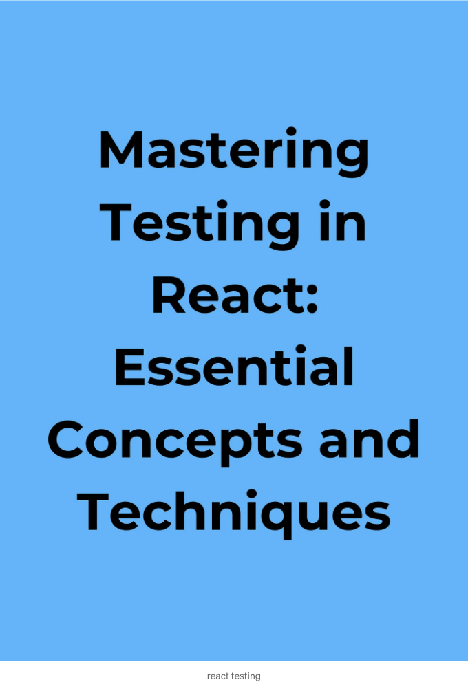

# React에서 테스팅 가이드: — 테스팅 도우미

당신의 React 앱이 완벽하게 작동하는지 확인해 봅시다! 테스팅은 우리가 그레믈린(버그)을 일찍 발견할 수 있게 도와줍니다. 오늘은 React 컴포넌트를 테스팅하는 것을 간편하게 만드는 두 가지 도우미를 만나봅시다.

# 완벽한 주방 만들기 (아무것도 태우지 않고!)

<!-- ui-log 수평형 -->
<ins class="adsbygoogle"
  style="display:block"
  data-ad-client="ca-pub-4877378276818686"
  data-ad-slot="9743150776"
  data-ad-format="auto"
  data-full-width-responsive="true"></ins>
<component is="script">
(adsbygoogle = window.adsbygoogle || []).push({});
</component>

당신이 꿈꾸던 주방을 만들어보세요 — 모든 것이 원활하게 작동하고 맛있는 요리를 할 수 있는 곳. 완벽한 케이크를 굽는 것처럼 멋진 부엌을 만들려면 모든 것이 잘 작동하는지 확인하기 위해 약간의 테스트가 필요합니다.

이 시리즈에서는 React 주방을 "테스트"하여 요소(캐비닛, 가전제품 등)이 요리(코딩)를 시작하기 전에 완벽하게 작동하는지 확인하는 방법을 배워보겠습니다! 나중에 끔찍한 놀람을 피하기 위해 모든 것을 확인하기 위해 특별한 도구를 사용할 것입니다.

## React 앱을 테스트하는 이유

테스트는 당신의 코드를 건강하게 유지합니다. 여기에 그 이유가 있습니다:

<!-- ui-log 수평형 -->
<ins class="adsbygoogle"
  style="display:block"
  data-ad-client="ca-pub-4877378276818686"
  data-ad-slot="9743150776"
  data-ad-format="auto"
  data-full-width-responsive="true"></ins>
<component is="script">
(adsbygoogle = window.adsbygoogle || []).push({});
</component>

- 수리하기 쉬움: 문제를 일찍 발견하는 것이 기다려서 모든 것이 망가지기를 기다리는 것보다 쉽습니다.
- 자신감 상승: 테스트에서 코드가 작동한다는 것을 보여주어 마음에 안심감을 줍니다.
- 깔끔한 코드: 테스트 작성은 잘 구성된, 재사용 가능한 코드를 유도합니다.

## 테스팅 도우미

두 가지 멋진 도우미를 사용할 것입니다:

- Jest: Jest를 테스트하는 놀이터로 상상해보세요. 코드가 계획대로 작동하는지 확인할 수 있도록 명령을 작성할 수 있습니다.
- React Testing Library: 이 도우미는 사용자처럼 작동하여 React 컴포넌트에서 버튼을 클릭하고 양식을 채우는 역할을 합니다.

<!-- ui-log 수평형 -->
<ins class="adsbygoogle"
  style="display:block"
  data-ad-client="ca-pub-4877378276818686"
  data-ad-slot="9743150776"
  data-ad-format="auto"
  data-full-width-responsive="true"></ins>
<component is="script">
(adsbygoogle = window.adsbygoogle || []).push({});
</component>

곧 다가올 주제!

다음 주제에서는 이러한 도우미들을 사용하여 간단한 버튼 컴포넌트에 대한 첫 번째 테스트를 작성할 것입니다. 버튼이 제대로 작동하고 클릭할 때 올바른 메시지가 표시되는지 확인하는 방법을 살펴볼 것입니다. 기대해주세요!

## 활동: 버튼 테스트해 보기!

오늘은 테스트 도구를 설정하고 React 컴포넌트에 대한 첫 번째 테스트를 작성함으로써 손을 더럽힐 것입니다. 두 개의 라이브러리를 사용할 예정입니다:

<!-- ui-log 수평형 -->
<ins class="adsbygoogle"
  style="display:block"
  data-ad-client="ca-pub-4877378276818686"
  data-ad-slot="9743150776"
  data-ad-format="auto"
  data-full-width-responsive="true"></ins>
<component is="script">
(adsbygoogle = window.adsbygoogle || []).push({});
</component>

- Jest:
- React Testing Library:

여기에서 우리가 할 일은:

- Button 컴포넌트 만들기: "Click Me!"라고 쓰인 버튼과 같은 간단한 React 컴포넌트를 만들 것입니다.
- 테스트 작성: Jest를 사용하여 우리 버튼이 제대로 작동하는 지 확인하는 테스트를 작성할 것입니다. 이 테스트는 다음을 수행할 것입니다:

  - 버튼 컴포넌트를 렌더링합니다.
  - React Testing Library를 사용하여 버튼을 클릭하는 시뮬레이션을 수행합니다.
  - 버튼이 예상대로 작동하는 지 확인합니다 (예를 들어 색상이 변경되거나 메시지가 표시되는 지 확인).

<!-- ui-log 수평형 -->
<ins class="adsbygoogle"
  style="display:block"
  data-ad-client="ca-pub-4877378276818686"
  data-ad-slot="9743150776"
  data-ad-format="auto"
  data-full-width-responsive="true"></ins>
<component is="script">
(adsbygoogle = window.adsbygoogle || []).push({});
</component>

1. 환경 설정:

내 컴퓨터에 Node.js와 npm(또는 yarn)이 설치되어 있는지 확인해주세요. 이 도구들은 JavaScript 프로젝트를 관리하는 데 필수적입니다.

2. React 프로젝트 생성:

우리는 create-react-app을 사용하여 빠르게 새로운 React 프로젝트를 설정할 것입니다. 터미널을 열고 다음 명령어를 실행해주세요:

<!-- ui-log 수평형 -->
<ins class="adsbygoogle"
  style="display:block"
  data-ad-client="ca-pub-4877378276818686"
  data-ad-slot="9743150776"
  data-ad-format="auto"
  data-full-width-responsive="true"></ins>
<component is="script">
(adsbygoogle = window.adsbygoogle || []).push({});
</component>

```js
npx create-react-app my-test-app
```

이 명령은 기본적인 React 프로젝트 구조를 갖춘 my-test-app라는 새 디렉토리를 생성합니다.

3. Jest 및 React Testing Library 설치하기:

터미널을 사용하여 프로젝트 디렉토리로 이동하세요.

<!-- ui-log 수평형 -->
<ins class="adsbygoogle"
  style="display:block"
  data-ad-client="ca-pub-4877378276818686"
  data-ad-slot="9743150776"
  data-ad-format="auto"
  data-full-width-responsive="true"></ins>
<component is="script">
(adsbygoogle = window.adsbygoogle || []).push({});
</component>

```js
cd my-test-app
```

이제 npm 또는 yarn을 사용하여 Jest 및 React Testing Library를 설치하세요:

```js
npm install --save-dev jest @testing-library/react @testing-library/jest-dom
```

만약 yarn을 사용한다면 npm install을 yarn add로 바꿔주세요.

<!-- ui-log 수평형 -->
<ins class="adsbygoogle"
  style="display:block"
  data-ad-client="ca-pub-4877378276818686"
  data-ad-slot="9743150776"
  data-ad-format="auto"
  data-full-width-responsive="true"></ins>
<component is="script">
(adsbygoogle = window.adsbygoogle || []).push({});
</component>

4. 버튼 컴포넌트 생성하기:

src 디렉토리 내에서 Button.js라는 새 파일을 생성하세요. 다음 코드를 추가하여 간단한 버튼 컴포넌트를 만들어보세요:

```js
import React from 'react';

function Button() {
  return (
    <button type="button">Click Me!</button>
  );
}

export default Button;
```

이 코드는 "Click Me!" 텍스트가 있는 버튼을 렌더링하는 Button 컴포넌트를 정의합니다.

<!-- ui-log 수평형 -->
<ins class="adsbygoogle"
  style="display:block"
  data-ad-client="ca-pub-4877378276818686"
  data-ad-slot="9743150776"
  data-ad-format="auto"
  data-full-width-responsive="true"></ins>
<component is="script">
(adsbygoogle = window.adsbygoogle || []).push({});
</component>

5. 테스트 작성:

src 디렉토리 안에 Button.test.js라는 새 파일을 생성하세요. Jest와 React Testing Library를 사용하여 Button 컴포넌트에 대해 테스트를 작성하기 위해 다음 코드를 추가하세요:

```js
import React from 'react';
import { render, fireEvent } from '@testing-library/react';
import Button from './Button'; // Button 컴포넌트를 불러옵니다.

test('Button 컴포넌트가 "Click Me!" 텍스트를 렌더링해야 합니다', () => {
  // Button 컴포넌트 렌더링
  const { getByText } = render(<Button />);

  // "Click Me!" 텍스트가 포함된 버튼 요소 찾기
  const button = getByText(/Click Me!/i); // 대소문자를 구분하지 않는 정규 표현식 사용

  // 버튼이 문서에 있어야 함
  expect(button).toBeInTheDocument();
});

test('버튼을 클릭하면 색상이 변경되어야 합니다', () => {
  // Button 컴포넌트 렌더링
  const { getByText } = render(<Button />);

  // "Click Me!" 텍스트가 포함된 버튼 요소 찾기
  const button = getByText(/Click Me!/i);

  // 버튼을 클릭하는 시뮬레이션
  fireEvent.click(button);

  // 여기서 버튼 색상이 클릭 후 변경되었는지 확인하는 단언을 추가해야 합니다.
  // 이는 Button 컴포넌트에서 클릭 기능을 구현한 방식에 따라 달라집니다.
  // 예를 들어, 클릭 후 버튼에 추가된 특정 CSS 클래스를 확인할 수 있습니다.
});
```

## 테스트 설명:

<!-- ui-log 수평형 -->
<ins class="adsbygoogle"
  style="display:block"
  data-ad-client="ca-pub-4877378276818686"
  data-ad-slot="9743150776"
  data-ad-format="auto"
  data-full-width-responsive="true"></ins>
<component is="script">
(adsbygoogle = window.adsbygoogle || []).push({});
</component>

- 첫 번째 테스트는 React Testing Library의 getByText를 사용하여 버튼이 “Click Me!” 텍스트를 렌더링하는지를 확인합니다. 대소문자를 무시하는 정규 표현식 (/Click Me!/i)을 사용합니다.
- 두 번째 테스트는 fireEvent.click을 사용하여 버튼을 클릭하는 작업을 시뮬레이션합니다. 클릭 후 버튼이 예상대로 작동하는지 확인하기 위해 직접 어서션을 추가해야 합니다 (예: 색상이 변경되는지 확인).

## 테스트 실행 방법:

터미널에서 다음 명령을 실행하여 테스트를 실행합니다:

```js
npm test
```

<!-- ui-log 수평형 -->
<ins class="adsbygoogle"
  style="display:block"
  data-ad-client="ca-pub-4877378276818686"
  data-ad-slot="9743150776"
  data-ad-format="auto"
  data-full-width-responsive="true"></ins>
<component is="script">
(adsbygoogle = window.adsbygoogle || []).push({});
</component>

(야악시에 사용 중이라면 npm test를 yarn test로 바꿔 주세요)

당신이 작성한 테스트를 실행하고 결과를 표시할 거에요.

기억하세요: 이건 기본 예시에요. 당신의 버튼 컴포넌트의 특정 기능에 따라 테스트와 어설션을 맞춤화할 수 있어요.

## React Testing Library: 우리의 슈퍼파워

<!-- ui-log 수평형 -->
<ins class="adsbygoogle"
  style="display:block"
  data-ad-client="ca-pub-4877378276818686"
  data-ad-slot="9743150776"
  data-ad-format="auto"
  data-full-width-responsive="true"></ins>
<component is="script">
(adsbygoogle = window.adsbygoogle || []).push({});
</component>

테스트를 작성하기 전에, React Testing Library가 무엇을 할 수 있는지 알아보죠:

- 주방을 렌더링하기(Component 렌더링): render 함수를 사용하여 테스트 환경에서 컴포넌트를 보여줄 수 있습니다.
- 재료를 찾기(Element 찾기): getByTestId, getByText 등의 도구를 사용하여 컴포넌트 내에서 특정 부분을 찾을 수 있습니다. 마치 식료품 창고에서 재료를 찾는 것과 같습니다.
- 요리 시뮬레이션(사용자 상호작용): 버튼을 클릭하거나 양식을 작성하는 등의 컴포넌트 사용을 가정하여 반응을 테스트할 수 있습니다.
- 맛 확인(단언문): 컴포넌트가 기대한 대로 작동하는지 확인하는 확인문을 작성하여, 맛있는 결과(동작하는 코드)를 보장할 수 있습니다!

## 유닛 테스트 작성하기

이제, 유닛 테스트를 작성해봅시다! 우리가 배울 것은:

<!-- ui-log 수평형 -->
<ins class="adsbygoogle"
  style="display:block"
  data-ad-client="ca-pub-4877378276818686"
  data-ad-slot="9743150776"
  data-ad-format="auto"
  data-full-width-responsive="true"></ins>
<component is="script">
(adsbygoogle = window.adsbygoogle || []).push({});
</component>

- 유닛 테스트란: 우리는 각 구성요소가 올바르게 작동하는지 확인하는 데 유니테스트가 어떻게 도움이 되는지 이해할 것입니다. 마치 레시피 전에 개별 재료를 테스트하는 것처럼요.
- Jest로 테스트 작성하기: 강력한 테스트 프레임워크인 Jest를 사용하여 테스트를 작성할 겁니다.
- 기본 사항 테스팅: 올바르게 구성요소가 렌더링되는지 확인하거나, 구성요소에 전달된 데이터(속성)를 확인하거나, 사용자 상호작용을 모방하는 등 단순한 테스트에 대해 다룰 겁니다.
- Jest Matchers: Jest의 "matchers(매처)"를 사용하여 버튼을 클릭할 때 색상이 변경되는지 확인하는 등 컴포넌트가 예상대로 동작하는지 확인하는 방법을 배울 겁니다.

## 활동: 이제 부엌을 테스트할 시간이에요! (30분)

소매를 걷어 올리는 준비를 해보세요!

- 요리사(강사)를 따라가보세요: 우리는 React 컴포넌트에 대한 간단한 유닛 테스트를 Jest를 사용해 작성하는 과정을 안내해드릴 거예요.
- 테스트 구조와 Matchers: 테스트를 어떻게 구조화하고 적절한 Jest matchers를 선택하여 단언을 하는 방법에 대해 배우게 될 거에요.
- 연습이 완벽을 이룹니다: 우리는 컴포넌트 내에서 다양한 시나리오와 경계상황에 대해 테스트를 작성하고 다양한 요리 기술을 테스트하는 것과 같이 연습할 겁니다.

<!-- ui-log 수평형 -->
<ins class="adsbygoogle"
  style="display:block"
  data-ad-client="ca-pub-4877378276818686"
  data-ad-slot="9743150776"
  data-ad-format="auto"
  data-full-width-responsive="true"></ins>
<component is="script">
(adsbygoogle = window.adsbygoogle || []).push({});
</component>

재료 (라이브러리):

- React: 당신의 React 애플리케이션의 기반.
- Jest: 테스트를 작성, 실행 및 관리하기 위한 강력한 테스트 프레임워크.
- React Testing Library: 사용자 상호작용을 모방하고 React 구성 요소 내에서 요소를 찾도록 도와주는 믿음직한 부엌 도우미.

단계 (테스트 작성):

- 테스트 환경 설정하기:

<!-- ui-log 수평형 -->
<ins class="adsbygoogle"
  style="display:block"
  data-ad-client="ca-pub-4877378276818686"
  data-ad-slot="9743150776"
  data-ad-format="auto"
  data-full-width-responsive="true"></ins>
<component is="script">
(adsbygoogle = window.adsbygoogle || []).push({});
</component>

- 필요한 라이브러리 가져오기: React from react, render, screen from @testing-library/react, act from react-dom/test-utils (비동기 업데이트 시뮬레이션용), OmeletteFormFields(컴포넌트 경로), 그리고 필요에 따라 useOmeletteForm(커스텀 훅 사용 시).
- 테스트를 위해 초기 폼 데이터를 제어하기 위해 useOmeletteForm 훅을 목업화합니다(해당하는 경우):

```js
jest.mock('./useOmeletteForm'); // 본인의 훅 경로로 변경
```

주방(컴포넌트) 렌더링:

- @testing-library/react의 render를 사용하여 OmeletteFormFields 컴포넌트 렌더링하기:

<!-- ui-log 수평형 -->
<ins class="adsbygoogle"
  style="display:block"
  data-ad-client="ca-pub-4877378276818686"
  data-ad-slot="9743150776"
  data-ad-format="auto"
  data-full-width-responsive="true"></ins>
<component is="script">
(adsbygoogle = window.adsbygoogle || []).push({});
</component>

```js
await act(async () => {
  render(<OmeletteFormFields />);
});
```

- act 함수는 렌더링 중 발생하는 비동기 업데이트를 적절하게 처리합니다 (예: 상태 업데이트).

재료(요소) 찾기:

- 렌더링된 컴포넌트 내에서 특정 요소를 찾기 위해 @testing-library/react의 screen을 활용하세요: 

<!-- ui-log 수평형 -->
<ins class="adsbygoogle"
  style="display:block"
  data-ad-client="ca-pub-4877378276818686"
  data-ad-slot="9743150776"
  data-ad-format="auto"
  data-full-width-responsive="true"></ins>
<component is="script">
(adsbygoogle = window.adsbygoogle || []).push({});
</component>

```js
const nameInput = screen.getByLabelText(/이름:/i);
const emailInput = screen.getByLabelText(/이메일:/i);
const omeletteTypeSelect = screen.getByLabelText(/오믈렛 종류:/i);
const additionalIngredientsInput = screen.getByLabelText(/추가 재료:/i);
```

- getByLabelText를 사용하면 연관된 레이블 텍스트를 기반으로 요소를 신뢰할 수 있는 방법으로 찾을 수 있어서, ID가 변경되더라도 테스트가 쉽게 깨지지 않게 됩니다.

## 요리 시뮬레이션 (사용자 상호작용) (선택사항):

- useOmeletteForm 코드에서 다루지 않았지만, @testing-library/react의 fireEvent.change와 같은 함수를 사용하여 사용자 상호작용(입력, 옵션 선택)을 시뮬레이션할 수 있습니다. 이를 통해 양식 업데이트를 테스트할 수 있습니다.

<!-- ui-log 수평형 -->
<ins class="adsbygoogle"
  style="display:block"
  data-ad-client="ca-pub-4877378276818686"
  data-ad-slot="9743150776"
  data-ad-format="auto"
  data-full-width-responsive="true"></ins>
<component is="script">
(adsbygoogle = window.adsbygoogle || []).push({});
</component>

```js
fireEvent.change(nameInput, { target: { value: 'Jane Doe' } }); // 이름 변경 시뮬레이션
expect(nameInput.value).toBe('Jane Doe'); // 업데이트된 값 확인
```

확인 (어설션):

- Jest의 expect 어설션을 사용하여 컴포넌트의 상태와 렌더링된 출력을 확인합니다:

```js
expect(nameInput.value).toBe('John Doe'); // 초기 이름 확인
expect(emailInput.value).toBe('johndoe@example.com'); // 초기 이메일 확인
expect(omeletteTypeSelect.value).toBe('Vegetarian'); // 초기 오믈렛 유형 확인
expect(additionalIngredientsInput.value).toBe('Onions, Peppers'); // 초기 재료 확인
```

<!-- ui-log 수평형 -->
<ins class="adsbygoogle"
  style="display:block"
  data-ad-client="ca-pub-4877378276818686"
  data-ad-slot="9743150776"
  data-ad-format="auto"
  data-full-width-responsive="true"></ins>
<component is="script">
(adsbygoogle = window.adsbygoogle || []).push({});
</component>

## 예제 테스트 코드:

```js
// OmeletteFormFields.test.js

import React from 'react';
import { render, screen } from '@testing-library/react';
import { act } from 'react-dom/test-utils';
import OmeletteFormFields from './OmeletteFormFields'; // 여러분의 컴포넌트 경로로 대체해주세요
import { useOmeletteForm } from './useOmeletteForm'; // 필요하다면 여러분의 훅 경로로 대체해주세요

jest.mock('./useOmeletteForm'); // useOmeletteForm 훅을 목업합니다 (필요한 경우)

test('OmeletteFormFields가 올바르게 렌더링되고 폼 데이터를 반영합니다', async () => {
  const mockUseOmeletteForm = jest.fn();
  mockUseOmeletteForm.mockReturnValue({
    formData: {
      name: 'John Doe',
      email: 'johndoe@example.com',
```

## 실전 챌린지:

이제 여러분이 주방장이 되는 차례입니다! 이미 존재하는 React 컴포넌트에 대한 유닛 테스트를 작성해보세요. 이 실습을 통해 여러분의 이해를 공고히 하고 실제 상황에 대한 테스트 작성 방법을 보여줄 겁니다.

<!-- ui-log 수평형 -->
<ins class="adsbygoogle"
  style="display:block"
  data-ad-client="ca-pub-4877378276818686"
  data-ad-slot="9743150776"
  data-ad-format="auto"
  data-full-width-responsive="true"></ins>
<component is="script">
(adsbygoogle = window.adsbygoogle || []).push({});
</component>

## Redux 테스팅: 요리 탐구

주방에서 신선한 재료를 보증하는 것처럼, Redux 애플리케이션의 핵심 구성 요소인 액션, 리듀서 및 미들웨어를 테스트하는 것은 건강하고 신뢰할 수 있는 상태 관리 시스템을 유지하는 데 중요합니다. 이 안내서는 Jest를 사용하여 이러한 요소들의 유닛 테스트에 대해 탐구하며, 스토어 모의 및 비동기 액션 처리 전략도 소개합니다.

## Redux 액션 테스팅:

- 액션이란 무엇인가요? 액션은 애플리케이션에서 발생한 일을 설명하는 일반 JavaScript 객체입니다. type 속성 (필수)과 선택적인 payload 속성을 갖습니다.
- 왜 액션을 테스트해야 하나요? 액션 생성자는 일관된 액션 생성을 보장하며, 테스트를 통해 그들의 정확성을 확인합니다.

<!-- ui-log 수평형 -->
<ins class="adsbygoogle"
  style="display:block"
  data-ad-client="ca-pub-4877378276818686"
  data-ad-slot="9743150776"
  data-ad-format="auto"
  data-full-width-responsive="true"></ins>
<component is="script">
(adsbygoogle = window.adsbygoogle || []).push({});
</component>

## 예시 액션 테스트:

```js
// actions.test.js
import { fetchKitchenItemsRequest, fetchKitchenItemsSuccess, fetchKitchenItemsFailure } from './actions';

describe('Redux Actions', () => {
  it('FETCH_KITCHEN_ITEMS_REQUEST 액션을 생성합니다', () => {
    const expectedAction = {
      type: 'FETCH_KITCHEN_ITEMS_REQUEST',
    };

    expect(fetchKitchenItemsRequest()).toEqual(expectedAction);
  });

  it('페이로드를 포함한 FETCH_KITCHEN_ITEMS_SUCCESS 액션을 생성합니다', () => {
    const data = { items: ['frying pan', 'knife'] };
    const expectedAction = {
      type: 'FETCH_KITCHEN_ITEMS_SUCCESS',
      payload: data,
    };

    expect(fetchKitchenItemsSuccess(data)).toEqual(expectedAction);
  });

  it('에러를 포함한 FETCH_KITCHEN_ITEMS_FAILURE 액션을 생성합니다', () => {
    const error = new Error('Network error');
    const expectedAction = {
      type: 'FETCH_KITCHEN_ITEMS_FAILURE',
      error: error.message,
    };

    expect(fetchKitchenItemsFailure(error)).toEqual(expectedAction);
  });
});
```

## Redux 리듀서 테스트하기:

- 리듀서란 무엇인가요? 리듀서는 현재 상태와 액션 객체를 가져와 액션 유형에 따라 새로운 상태를 반환하는 순수 함수입니다.
- 왜 리듀서를 테스트해야 하나요? 리듀서를 테스트하면 상태 갱신을 격리하고 액션을 올바르게 처리하는지 확인할 수 있습니다.

<!-- ui-log 수평형 -->
<ins class="adsbygoogle"
  style="display:block"
  data-ad-client="ca-pub-4877378276818686"
  data-ad-slot="9743150776"
  data-ad-format="auto"
  data-full-width-responsive="true"></ins>
<component is="script">
(adsbygoogle = window.adsbygoogle || []).push({});
</component>

## 예제 리듀서 테스트:

```js
// kitchenReducer.test.js
import kitchenReducer from './reducers';
import { fetchKitchenItemsRequest, fetchKitchenItemsSuccess, fetchKitchenItemsFailure } from './actions';

describe('kitchenReducer', () => {
  it('초기 상태를 반환합니다', () => {
    expect(kitchenReducer(undefined, {})).toEqual({
      loading: false,
      error: null,
      items: [],
    });
  });

  it('FETCH_KITCHEN_ITEMS_REQUEST를 처리합니다', () => {
    const initialState = {
      loading: false,
      error: null,
      items: [],
    };
    const action = fetchKitchenItemsRequest();
    const expectedState = {
      loading: true,
      error: null,
      items: [],
    };

    expect(kitchenReducer(initialState, action)).toEqual(expectedState);
  });

  // 다른 액션 유형에 대한 유사한 테스트
});
```

## 테스트를 위한 Redux Store 모킹:

- 액션과 리듀서를 격리하여 테스트하려면 Redux 스토어를 모킹합니다. Jest의 jest.fn() 모킹 함수는 이를 위한 유용한 도구입니다.
- 모킹된 스토어를 사용하여 액션이 디스패치되는 것을 확인하고, 리듀서가 예상 상태를 반환하는지 확인할 수 있습니다.

<!-- ui-log 수평형 -->
<ins class="adsbygoogle"
  style="display:block"
  data-ad-client="ca-pub-4877378276818686"
  data-ad-slot="9743150776"
  data-ad-format="auto"
  data-full-width-responsive="true"></ins>
<component is="script">
(adsbygoogle = window.adsbygoogle || []).push({});
</component>

## 비동기 작업 및 미들웨어 테스트:

- 비동기 작업: 이러한 작업에는 API에서 데이터를 가져오는 등의 부수 효과가 포함됩니다.
- 미들웨어: 미들웨어 함수는 전송된 액션을 가로채고 비동기 작업을 수행하거나 부가 작용을 처리할 수 있습니다.
- 테스트 전략:
  - fetch 함수를 모의로 바꿔(또는 API 호출에 대한 해당 함수를 사용) 응답이나 오류를 제어합니다.
  - jest.fn()을 사용하여 미들웨어 동작을 모의화하고 해당 동작이 액션 및 스토어와 상호작용하는지 확인합니다.

예: fetchKitchenItems 테스트 (간소화):

```js
// actions.test.js 
import { fetchKitchenItems } from './actions';

jest.mock('fetch'); // 제어된 응답을 위해 fetch 모의화

test('fetchKitchenItems가 성공적으로 fetch하는 경우 성공 액션을 전달함', async () => {
  const dispatch = jest.fn();
  const data = { items: ['프라이팬', '칼'] };
  fetch.mockResolvedValueOnce(new Response(JSON.stringify(data))); // 성공 응답을 모의화

  await fetchKitchenItems()(dispatch);

  expect(dispatch).toHaveBeenCalledTimes(2); // 2개의 액션이 전달되었음을 기대
  expect(dispatch).toHaveBeenNthCalledWith(1, { type: 'FETCH_KITCHEN_ITEMS_REQUEST' }); // 첫 번째 액션: 요청
  expect(dispatch).toHaveBeenNthCalledWith(2, { type: 'FETCH_KITCHEN_ITEMS_SUCCESS', payload: data }); // 두 번째 액션: 데이터를 포함한 성공
});
```

<!-- ui-log 수평형 -->
<ins class="adsbygoogle"
  style="display:block"
  data-ad-client="ca-pub-4877378276818686"
  data-ad-slot="9743150776"
  data-ad-format="auto"
  data-full-width-responsive="true"></ins>
<component is="script">
(adsbygoogle = window.adsbygoogle || []).push({});
</component>

설명:

- Fetch 모의: 테스트 중에 fetch 함수의 동작을 제어하기 위해 jest.mock(`fetch`)를 사용합니다.
- 테스트 설정: jest.fn()을 사용하여 모의 디스패치 함수를 정의하고 주방 아이템을 위한 샘플 데이터를 생성합니다.
- 성공 응답 모의: fetch를 모의하여 원하는 데이터가 포함된 성공적인 응답 객체를 반환합니다. mockResolvedValueOnce는 이 테스트를 위해 모의가 한 번만 완료되도록 합니다.
- fetchKitchenItems 호출: 모의 디스패치 함수를 사용하여 fetchKitchenItems 함수를 호출합니다. 비동기적이므로 완료될 때까지 await을 사용하여 기다립니다.
- 어서션:

- fetchKitchenItems가 두 번 (toHaveBeenCalledTimes(2)) 호출되었음을 단언합니다. 왜냐하면 fetchKitchenItems는 두 개의 액션 (요청 및 성공)을 디스패치합니다.
- toHaveBeenNthCalledWith를 사용하여 각 호출에 대해 특정 액션이 디스패치되었는지 확인합니다. 첫 번째 호출(toHaveBeenNthCalledWith(1))은 FETCH_KITCHEN_ITEMS_REQUEST 액션이어야 하고, 두 번째 호출(toHaveBeenNthCalledWith(2))은 FETCH_KITCHEN_ITEMS_SUCCESS 액션이며 예상 페이로드 (데이터)를 포함해야 합니다.

이 테스트는 API 호출이 데이터를 성공적으로 검색할 때 fetchKitchenItems가 올바른 액션 (요청 및 성공)을 디스패치하는지 확인합니다. 에러 처리 또는 미들웨어가 액션과 상호작용하는 방식을 테스트하는 등의 다양한 시나리오를 커버하는 유사한 테스트를 작성할 수 있습니다.

<!-- ui-log 수평형 -->
<ins class="adsbygoogle"
  style="display:block"
  data-ad-client="ca-pub-4877378276818686"
  data-ad-slot="9743150776"
  data-ad-format="auto"
  data-full-width-responsive="true"></ins>
<component is="script">
(adsbygoogle = window.adsbygoogle || []).push({});
</component>

## 디버깅 및 그 역할 정의

- 디버깅: 소프트웨어 애플리케이션에서 문제를 식별하고 해결하는 과정. 코드 동작을 분석하고 오류를 정확히 찾아내어 해결책을 구현하는 것을 포함합니다.
- 역할: 원활한 애플리케이션 기능 보장, 코드 품질 향상, 성능 최적화를 달성합니다.

## React 애플리케이션을 위한 일반적인 디버깅 기술

- 브라우저 개발자 도구:

<!-- ui-log 수평형 -->
<ins class="adsbygoogle"
  style="display:block"
  data-ad-client="ca-pub-4877378276818686"
  data-ad-slot="9743150776"
  data-ad-format="auto"
  data-full-width-responsive="true"></ins>
<component is="script">
(adsbygoogle = window.adsbygoogle || []).push({});
</component>

- 콘솔: 로그 메시지를 기록하고 변수를 검사하며 표현식을 평가하여 깊이 있는 검사를 수행합니다.
- 네트워크: 네트워크 요청 및 응답을 분석하고 API 호출 문제를 식별합니다.
- 요소: DOM 구조를 검사하고 시각적 불일치를 식별하며 렌더링 문제를 해결합니다.

2. 로깅: 코드 전체에 console.log 문을 전략적으로 추가하여 변수 값, 함수 실행 흐름 및 컴포넌트 수명 주기를 추적합니다.

3. 중단점 및 IDE 디버거:

- 중단점: 개발 중에 특정한 줄에서 코드 실행을 일시 중지하며 IDE의 디버거(예: Visual Studio Code에서 중단점 설정)를 사용하여 단계별 디버깅을 수행할 수 있습니다.

<!-- ui-log 수평형 -->
<ins class="adsbygoogle"
  style="display:block"
  data-ad-client="ca-pub-4877378276818686"
  data-ad-slot="9743150776"
  data-ad-format="auto"
  data-full-width-responsive="true"></ins>
<component is="script">
(adsbygoogle = window.adsbygoogle || []).push({});
</component>

4. 리액트 개발도구:

- 컴포넌트의 시각적 구조를 제공하고 상태를 검사하며, 프롭 드릴링 시각화와 같은 기능을 제공하는 브라우저 확장 프로그램입니다.
- 컴포넌트의 상태, 프로퍼티 및 렌더링 문제를 검사합니다.

## Redux 상태 관리 디버깅

- Redux 개발도구 확장 기능:

<!-- ui-log 수평형 -->
<ins class="adsbygoogle"
  style="display:block"
  data-ad-client="ca-pub-4877378276818686"
  data-ad-slot="9743150776"
  data-ad-format="auto"
  data-full-width-responsive="true"></ins>
<component is="script">
(adsbygoogle = window.adsbygoogle || []).push({});
</component>

- 애플리케이션 내에서 상태 변경과 발송된 작업을 시각화해 보세요.
- 상태 변이를 디버깅하고 리듀서 또는 미들웨어에서 발생할 수 있는 문제를 식별하세요.

## 요약: React에서 자신감을 키우는 방법

이번 주에는 React 개발에서 테스트와 디버깅의 필수 기술을 정복하기 위한 여정에 돌입했습니다. 다음을 탐험했습니다:

- 테스트 기본: 코드 품질 보증, 에러 미리 발견, 신뢰할 수 있는 응용프로그램 유지를 위한 테스트의 중요성.
- Jest 및 React Testing Library를 사용한 단위 테스트: 컴포넌트를 격리하고 그 동작을 확인하는 강력한 도구.
- Redux 테스트: 액션, 리듀서, 미들웨어 테스트를 통해 예측 가능한 상태 관리를 보장하는 전략.
- 디버깅 기술: 브라우저 개발자 도구, React DevTools 및 console.log 문에서 문제를 식별하고 효과적으로 수정하는 방법을 활용.
- 실제 시나리오: 이러한 기술을 실습하여 오픈 소스 프로젝트 및 클라이언트 상호작용 시뮬레이션 디버깅에 적용합니다.

<!-- ui-log 수평형 -->
<ins class="adsbygoogle"
  style="display:block"
  data-ad-client="ca-pub-4877378276818686"
  data-ad-slot="9743150776"
  data-ad-format="auto"
  data-full-width-responsive="true"></ins>
<component is="script">
(adsbygoogle = window.adsbygoogle || []).push({});
</component>

## 왜 테스트와 디버깅이 중요한가요?

- **신뢰성과 안정성**: 철저한 테스트를 통해 코드의 기능에 대한 신뢰를 쌓고, 향후 개발 과정에서의 회귀를 방지할 수 있습니다.
- **조기 버그 감지**: 개발 주기 초기에 오류를 발견하면, 제품 환경에서 문제를 해결하는 것에 비해 시간과 노력을 절약할 수 있습니다.
- **유지보수성**: 테스트가 잘 된 코드는 시간이 지남에 따라 이해하기 쉽고 유지, 확장하기 용이합니다.
- **디버깅 효율**: 디버깅 기술에 익숙해지면 문제를 신속히 파악하여 개발 워크플로우를 원할히 진행할 수 있습니다.

## 평가: 기술 강화하기

좀 더 깊이있는 이해를 공고히하기 위해서

<!-- ui-log 수평형 -->
<ins class="adsbygoogle"
  style="display:block"
  data-ad-client="ca-pub-4877378276818686"
  data-ad-slot="9743150776"
  data-ad-format="auto"
  data-full-width-responsive="true"></ins>
<component is="script">
(adsbygoogle = window.adsbygoogle || []).push({});
</component>

## 퀴즈: 테스트 개념(15분)

이 퀴즈는 테스트 라이브러리, 개념 및 최상의 실천 방법에 대한 지식을 테스트할 것입니다. 다음과 같은 주제를 다룹니다:

- 서로 다른 테스트 라이브러리의 목적을 식별하기 (예: Jest, React Testing Library).
- 유닛 테스트, 통합 테스트와 같은 서로 다른 유형의 테스트 이해하기.
- 효과적인 테스트 작성을 위한 최상의 실천 방법 인식하기.

## React 테스팅 및 디버깅 기술을 테스트하고 싶나요?

<!-- ui-log 수평형 -->
<ins class="adsbygoogle"
  style="display:block"
  data-ad-client="ca-pub-4877378276818686"
  data-ad-slot="9743150776"
  data-ad-format="auto"
  data-full-width-responsive="true"></ins>
<component is="script">
(adsbygoogle = window.adsbygoogle || []).push({});
</component>

Quizizz 페이지에 재미있는 퀴즈를 만들어서 이 개념을 얼마나 잘 이해하고 있는지 확인해볼 수 있도록 했어요. 자신을 도전하고 지식을 확고히 하는 좋은 방법이에요.

## 퀴즈를 풀 준비가 되셨나요?

그냥 Quizizz로 가서 "React Testing & Debugging Concepts"라는 퀴즈를 찾아보세요. [참여 코드 삽입] (해당 시)를 사용할 수도 있어요.

시작할 준비가 되셨나요? 여기 시작 링크가 있어요:

<!-- ui-log 수평형 -->
<ins class="adsbygoogle"
  style="display:block"
  data-ad-client="ca-pub-4877378276818686"
  data-ad-slot="9743150776"
  data-ad-format="auto"
  data-full-width-responsive="true"></ins>
<component is="script">
(adsbygoogle = window.adsbygoogle || []).push({});
</component>

Quizizz: [https://quizizz.com/embed/quiz/660c3afa822a4338718b888c](https://quizizz.com/embed/quiz/660c3afa822a4338718b888c)

친애하는 독자 여러분, 📚

제 글을 읽어 주셔서 감사합니다! 여러분의 지원은 저에게 큰 힘이 됩니다. 💖

# Stackademic 🎓

<!-- ui-log 수평형 -->
<ins class="adsbygoogle"
  style="display:block"
  data-ad-client="ca-pub-4877378276818686"
  data-ad-slot="9743150776"
  data-ad-format="auto"
  data-full-width-responsive="true"></ins>
<component is="script">
(adsbygoogle = window.adsbygoogle || []).push({});
</component>

테이블 태그를 Markdown 형식으로 변경해주세요.