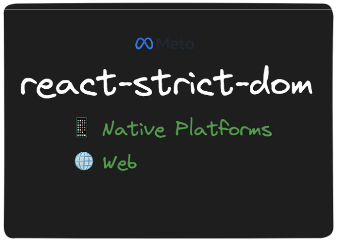
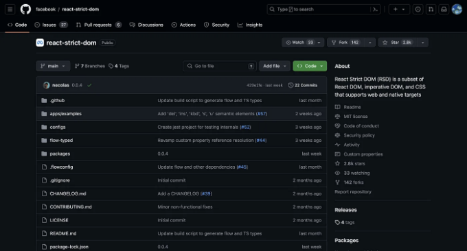
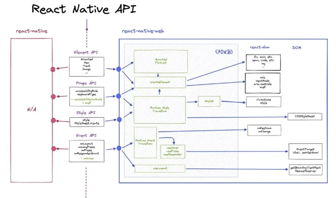
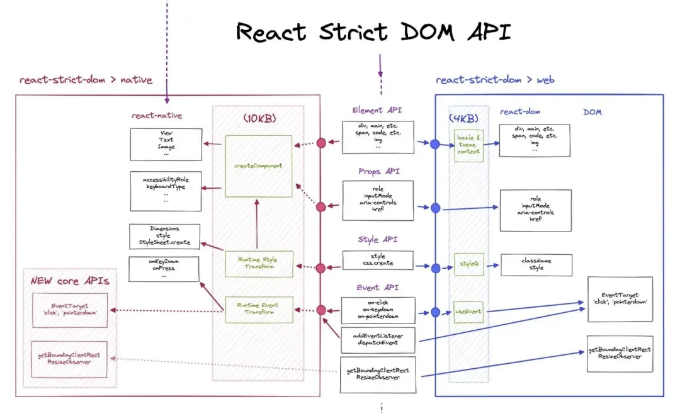
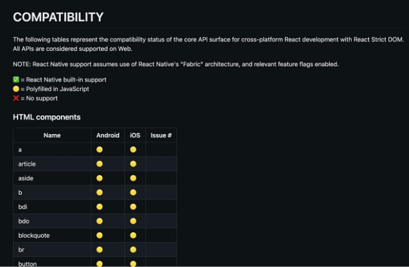
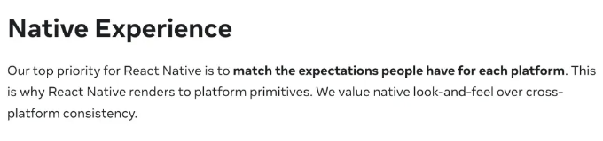
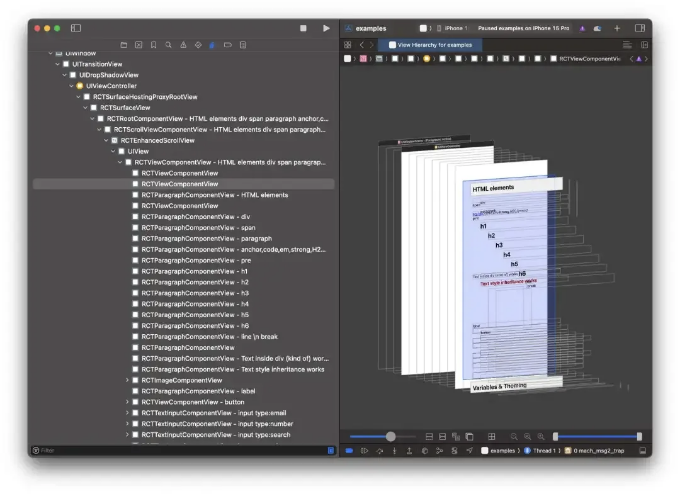
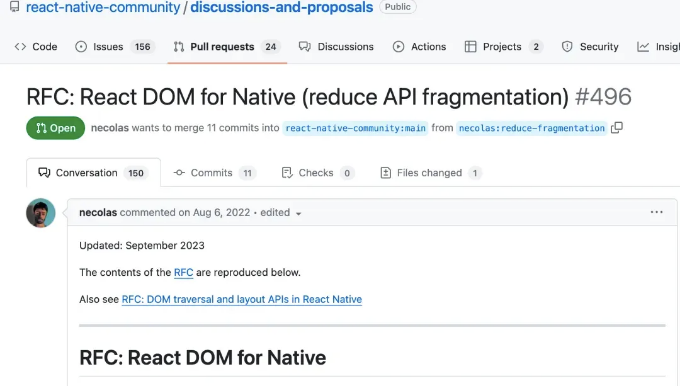

🚀 최근 Meta가 새로운 혁신적인 라이브러리인 react-strict-dom을 공개했어요! 이 라이브러리는 일반적인 웹 컴포넌트의 개발을 향상시키고 표준화하는 데 중점을 두었어요.



📱 React Native에서는 UI 컴포넌트가 웹 개발에 사용되는 것과 다릅니다. 웹 개발자들에게는 React Native의 기본 UI 컴포넌트로의 전환이 처음에는 익숙하지 않고 활용하기 어려울 수 있어요.

<!-- ui-log 수평형 -->
<ins class="adsbygoogle"
  style="display:block"
  data-ad-client="ca-pub-4877378276818686"
  data-ad-slot="9743150776"
  data-ad-format="auto"
  data-full-width-responsive="true"></ins>
<component is="script">
(adsbygoogle = window.adsbygoogle || []).push({});
</component>

```js
import { View, Text } from "react-native";
 
const App = () => {
  return (
    <View>
      <Text>Hello World!</Text>
    </View>
  );
};
```

🔌 더욱이, 이것은 React Native가 웹 기반 UI 라이브러리를 활용하는 능력을 제한합니다. 웹에서 React Native로 컴포넌트를 이주하는 과정은 상당한 시간이 소요되며 귀찮은 프로세스임이 입증되었습니다.

# react-native-web

몇 년 전, 트위터의 점진적 웹 앱을 개발하던 동안, Nicolas Gallagher은 React Native for Web (RNW)를 소개했습니다. 이 혁신은 React Native 코드를 react-dom과 호환되는 코드로 번역하여, React Native 컴포넌트를 웹 플랫폼에서 렌더링할 수 있게 했습니다.
```

<!-- ui-log 수평형 -->
<ins class="adsbygoogle"
  style="display:block"
  data-ad-client="ca-pub-4877378276818686"
  data-ad-slot="9743150776"
  data-ad-format="auto"
  data-full-width-responsive="true"></ins>
<component is="script">
(adsbygoogle = window.adsbygoogle || []).push({});
</component>



하지만, 이 접근 방식에는 몇 가지 단점이 있습니다:

- 📦 대량 및 분산된 API를 도입하여 React Native에서 비표준 구현이 필요함 (예: 이벤트).
- 🚫 라이브러리 자체가 비대하여 현대 웹 애플리케이션에 적합하지 않다.

# react-strict-dom의 메서드는 무엇인가요?

<!-- ui-log 수평형 -->
<ins class="adsbygoogle"
  style="display:block"
  data-ad-client="ca-pub-4877378276818686"
  data-ad-slot="9743150776"
  data-ad-format="auto"
  data-full-width-responsive="true"></ins>
<component is="script">
(adsbygoogle = window.adsbygoogle || []).push({});
</component>

🔄 리액트-스트릭트-돔은 리액트 네이티브와는 반대 전략을 채택하여 웹용으로 Web API를 활용하여 컴포넌트 렌더링을 합니다. 두 가지 경량 폴리필을 통합하여 API를 리액트 네이티브 및 리액트 돔 코드로 변환합니다. 아래 아키텍처 다이어그램은 그 기능을 자세히 설명해줍니다:



현재 네이티브 플랫폼에 모든 API가 내장되어 있는 것은 아니지만, 개발자들은 호환성을 확보하기 위해 노력하고 있습니다.

현재 호환성 진행 상황을 보여주는 테이블은 다음 링크에서 확인할 수 있습니다: [https://github.com/facebook/react-strict-dom/blob/main/packages/react-strict-dom/COMPATIBILITY.md](https://github.com/facebook/react-strict-dom/blob/main/packages/react-strict-dom/COMPATIBILITY.md)

<!-- ui-log 수평형 -->
<ins class="adsbygoogle"
  style="display:block"
  data-ad-client="ca-pub-4877378276818686"
  data-ad-slot="9743150776"
  data-ad-format="auto"
  data-full-width-responsive="true"></ins>
<component is="script">
(adsbygoogle = window.adsbygoogle || []).push({});
</component>



# react-strict-dom을 사용하여 컴포넌트 만들기

🎨 Meta에서 개발한 첨단 스타일링 솔루션인 react-strict-dom은 StyleX에 의해 제공되며 이미 facebook.com에서 프로덕션에 배포되었습니다. 애플리케이션을 구축하는 데 필요한 모든 모듈은 html 아래에서 찾을 수 있습니다. 다음은 RSD를 사용하여 UI를 구축하는 예시입니다:

```js
import React from "react";
import { css, html } from "react-strict-dom";

// apps/examples/src/App.js의 일부분
export default function App() {
  return (
    <html.div style={styles.div}>
      <html.div data-testid="testid">div</html.div>
      <html.span>span</html.span>
      <html.p>paragraph</html.p>

      <html.div />

      <html.span>
        <html.a href="https://google.com">anchor</html.a>,
        <html.code>code</html.code>,
        <html.em>em</html.em>,
        <html.strong>strong</html.strong>,
        <html.span>
          H<html.sub>2</html.sub>0
        </html.span>
        ,
        <html.span>
          E=mc<html.sup>2</html.sup>
        </html.span>
      </html.span>
    </html.div>
  );
}

// 내부에서 `stylex`를 호출하여 사용
const styles = css.create({
  div: {
    paddingBottom: 50,
    paddingTop: 50,
    backgroundColor: "white",
  },
});
```

<!-- ui-log 수평형 -->
<ins class="adsbygoogle"
  style="display:block"
  data-ad-client="ca-pub-4877378276818686"
  data-ad-slot="9743150776"
  data-ad-format="auto"
  data-full-width-responsive="true"></ins>
<component is="script">
(adsbygoogle = window.adsbygoogle || []).push({});
</component>

react-strict-dom을 활용하여 Web 및 Native 플랫폼에 대한 유니버설 어플리케이션을 구축하는 데 웹 API를 활용합니다.

# <html.div>이 네이티브 컴포넌트인가요?

네, 그렇습니다! react-strict-dom은 각 플랫폼에 대한 공통 API를 네이티브 코드로 번역하는 역할을 합니다.

React Native 원칙라는 블로그 게시물에 그가 쓴 내용을 한 줄 번역하면:

<!-- ui-log 수평형 -->
<ins class="adsbygoogle"
  style="display:block"
  data-ad-client="ca-pub-4877378276818686"
  data-ad-slot="9743150776"
  data-ad-format="auto"
  data-full-width-responsive="true"></ins>
<component is="script">
(adsbygoogle = window.adsbygoogle || []).push({});
</component>

```markdown


📱 React Native에서의 목표는 완전히 네이티브 애플리케이션을 개발하는 것입니다. 이 새로운 접근 방식을 채택함으로써 WebView나 다른 대안에 의존하지 않고 완전히 네이티브한 앱을 만들어 이 목표를 달성할 수 있습니다. 이를 확인하는 가장 쉬운 방법은 저장소에서 샘플 앱을 실행하고 Xcode의 뷰 계층 구조 도구를 활용하여 구성 요소를 검사하는 것입니다.



Nicolas의 RFC: RFC: React DOM for Native(https://github.com/react-native-community/discussions-and-proposals/pull/496)는 솔루션의 원칙을 자세히 소개합니다. 관심이 있으시면 깊이 읽어보실 수 있습니다.
```

<!-- ui-log 수평형 -->
<ins class="adsbygoogle"
  style="display:block"
  data-ad-client="ca-pub-4877378276818686"
  data-ad-slot="9743150776"
  data-ad-format="auto"
  data-full-width-responsive="true"></ins>
<component is="script">
(adsbygoogle = window.adsbygoogle || []).push({});
</component>



🚀 React-strict-dom은 Meta의 개발 과정을 가속화하여 팀이 더 빨리 기능을 구현하고 더 적은 엔지니어를 필요로 하며 여러 플랫폼에 배포할 수 있게 해줍니다. 이는 Meta의 첫 번째 크로스 플랫폼 솔루션으로, 웹 및 React Native 환경 모두에 직접적으로 맞춰져 있습니다! 🌐📱