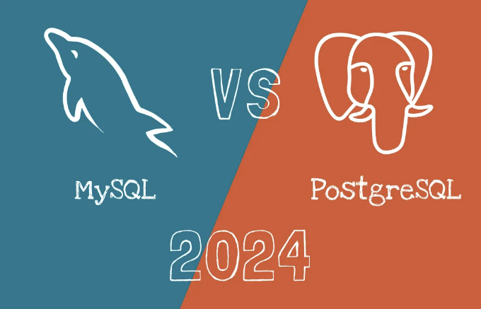
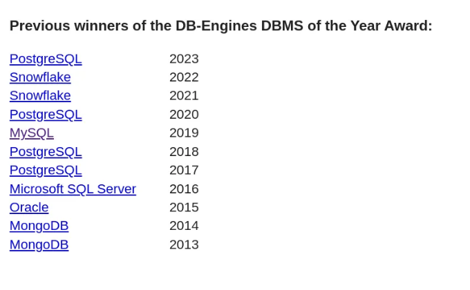
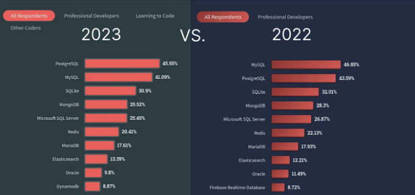

PostgreSQL와 MySQL의 성장은 클라우드 채택으로 인해 가속화되었습니다. PostgreSQL이 2023년에 우세하며 MySQL은 학습자들에게 여전히 매력적입니다. 2024년에는 PostgreSQL이 샤딩, 논리 복제를 개선하고 MySQL은 가용성, 보안, 분석에 초점을 맞출 예정입니다.

PostgreSQL과 MySQL의 인기 급증은 주요 클라우드 제공업체들이 이를 채택함에 크게 기인합니다. 아마존 웹 서비스, 마이크로소프트 애저, 구글 클라우드가 이제 관리형 PostgreSQL 및 MySQL 서비스를 제공하여 데이터베이스 배포와 관리를 간편화하고 있습니다. AWS는 2021년에 Amazon Aurora PostgreSQL 호환 서비스의 신속한 성장을 강조했습니다.

오라클에 의한 MySQL 인수는 2010년 오픈 소스 데이터베이스 사용자들 사이에서 MySQL의 미래에 대한 우려를 유발했습니다. 오라클이 상용 이익을 MySQL의 오픈 소스 정신보다 우선시할 것이라는 우려가 많았습니다. 이 불확실성으로 일부 사용자들은 특히 강력한 기능과 오픈 소스 커뮤니티 지원으로 유명한 PostgreSQL과 같은 대안 옵션을 탐색하기도 했습니다.

<!-- ui-log 수평형 -->
<ins class="adsbygoogle"
  style="display:block"
  data-ad-client="ca-pub-4877378276818686"
  data-ad-slot="9743150776"
  data-ad-format="auto"
  data-full-width-responsive="true"></ins>
<component is="script">
(adsbygoogle = window.adsbygoogle || []).push({});
</component>

# DB-Engines 수상자들

PostgreSQL은 DB-Engines에서 인정받은 2023년 데이터베이스 관리 시스템(Database Management System)으로 선정되었습니다. PostgreSQL은 지난 십 년 동안 DB-Engines DBMS of the Year Award를 가장 많이 수상한 우수성과 데이터베이스 커뮤니티에서의 인기를 입증했습니다.

작년에 나온 PostgreSQL과 MySQL 비교 지침인 2023년 MySQL vs PostgreSQL에서는 이 두 인기있는 관계형 데이터베이스 관리 시스템(RDBMS) 간의 기본적인 유사성, 성능, 유연성, 규모 및 사용 편의성에 대해 분석했습니다.

<!-- ui-log 수평형 -->
<ins class="adsbygoogle"
  style="display:block"
  data-ad-client="ca-pub-4877378276818686"
  data-ad-slot="9743150776"
  data-ad-format="auto"
  data-full-width-responsive="true"></ins>
<component is="script">
(adsbygoogle = window.adsbygoogle || []).push({});
</component>

MySQL와 PostgreSQL을 비교한 테이블은 db-engines.com에서 확인할 수 있어요.

# 스택 오버플로우의 주요 조사 결과

인기 변화: 2022 대 2023: 2023년 PostgreSQL이 MySQL을 앞서며, 프로 개발자들 사이에서 선호도 변화를 시사하고 있어요.

전반적으로 선호도: PostgreSQL이 이제는 프로 개발자들에게 가장 인기 있는 선택지로 떠오르며, 개발자 커뮤니티에서 인기를 얻고 있어요.

<!-- ui-log 수평형 -->
<ins class="adsbygoogle"
  style="display:block"
  data-ad-client="ca-pub-4877378276818686"
  data-ad-slot="9743150776"
  data-ad-format="auto"
  data-full-width-responsive="true"></ins>
<component is="script">
(adsbygoogle = window.adsbygoogle || []).push({});
</component>

러닝 개발자들: 프로 개발자들 사이에서 PostgreSQL이 우세를 보이는 반면, 학습 단계에 있는 사람들은 여전히 MySQL을 선호하며, 45%가 PostgreSQL 대비 MySQL을 사용하고 있습니다.

스택 오버플로 서베이 2022

스택 오버플로 서베이 2023

<!-- ui-log 수평형 -->
<ins class="adsbygoogle"
  style="display:block"
  data-ad-client="ca-pub-4877378276818686"
  data-ad-slot="9743150776"
  data-ad-format="auto"
  data-full-width-responsive="true"></ins>
<component is="script">
(adsbygoogle = window.adsbygoogle || []).push({});
</component>

# Hacker News 토론.

2023년에 MySQL과 PostgreSQL 중 어떤 것을 선택해야 하는지에 대한 Hacker News(Y Combinator) 토론을 요약했습니다. 다섯 가지 주요 포인트가 포함되어 있어요:

- 라이센스: MySQL Community Edition은 GPL에 따라 라이선스가 부여되며 PostgreSQL은 PostgreSQL 라이센스에 따라 릴리스됩니다. 이는 BSD 또는 MIT와 유사한 무료 오픈 소스 라이센스에요.
- 성능: 대부분의 워크로드에서 Postgres와 MySQL의 성능은 비교 가능하며 최대로 30%의 차이가 있어요. MySQL은 극도로 쓰기 집중적인 워크로드에 대해 Postgres에 비해 우위를 가지는 반면, PostgreSQL은 거대한 데이터 집합, 복잡한 쿼리 및 읽기-쓰기 작업을 처리할 때 더 빠릅니다.
- 기능 및 데이터 타입: PostgreSQL은 내장 데이터 유형과 높은 SQL 표준 준수에 대한 좀 더 포괄적인 세트를 제공해요. MySQL에 비해 더 많은 기능, 데이터 유형의 유연성, 확장성, 동시성 및 데이터 무결성을 제공해요. 한편, MySQL은 더 제한적인 데이터 유형 세트를 가지고 있지만 지리 정보 시스템(GIS) 데이터에 대한 공간 확장 기능을 제공합니다.
- 커뮤니티 지원: MySQL은 더 많은 사용자와 커뮤니티를 자랑하며 PostgreSQL보다 더 쉽게 지원과 답변을 찾을 수 있어요.
- 사용 사례: MySQL은 읽기 및 쓰기와 같은 간단한 작업에 가장 적합하며, 간단한 데이터 거래만 필요한 웹 기반 프로젝트에 좋은 선택입니다. 반면, PostgreSQL은 대규모 및 복잡한 쿼리를 실행하고 데이터를 저장 및 분석하는 시스템에 적합해요.

# Reddit 쓰레드.

<!-- ui-log 수평형 -->
<ins class="adsbygoogle"
  style="display:block"
  data-ad-client="ca-pub-4877378276818686"
  data-ad-slot="9743150776"
  data-ad-format="auto"
  data-full-width-responsive="true"></ins>
<component is="script">
(adsbygoogle = window.adsbygoogle || []).push({});
</component>

여기 Reddit 스레드에서 요약된 게시물의 키포인트 몇 가지가 더 있어요: “MySQL을 Postgres보다 선택한 이유는 무엇인가요?”:

- MySQL은 PostgreSQL보다 상업적 지원을 받을 수 있고 인기가 높다는 것이 장점으로 부각되었습니다.
- MySQL은 가장 인기 있는 SQL 데이터베이스이지만, Postgres는 더 많은 기능과 SQL 표준에 대한 더 나은 지원을 갖추고 있습니다.
- Postgres의 한 기능은 데이터베이스 마이그레이션을 트랜잭션으로 래핑할 수 있다는 것입니다. 따라서 마이그레이션 중 한 쿼리가 실패하면 전체 마이그레이션이 실패합니다.
- Postgres는 벤치마킹에서 더 빠르며 SQL 표준에 대한 더 나은 지원을 제공합니다.
- MySQL은 많은 리눅스 배포판에서 공식 지원되지 않으며, 일부 문서는 MariaDB가 MySQL의 권장 대체품이라고 제안합니다. 그러나 완전한 대체품은 아닙니다.
- 2023년 Postgres와 MySQL 사이의 완전한 비교 결과, Postgres에는 더 많은 기능과 더 활발한 커뮤니티 및 생태계가 있고, MySQL은 더 쉬운 학습 경사와 더 많은 사용자 기반을 가지고 있습니다.

# 2024년을 위한 PostgreSQL 전망:

<!-- ui-log 수평형 -->
<ins class="adsbygoogle"
  style="display:block"
  data-ad-client="ca-pub-4877378276818686"
  data-ad-slot="9743150776"
  data-ad-format="auto"
  data-full-width-responsive="true"></ins>
<component is="script">
(adsbygoogle = window.adsbygoogle || []).push({});
</component>

- 향상된 샤딩: PostgreSQL은 샤딩 기능을 계속 향상시켜 샤딩 설정을 더 쉽게 구현하고 관리할 수 있게 될 것으로 예상됩니다.
- 논리 복제: 논리 복제 능력을 확대하여 데이터베이스 워크로드를 설계하는 데 더 많은 유연성을 제공하는 것이 주요 관심사가 될 것으로 예상됩니다.
- 성능 향상: Postgres의 성능은 SIMD(Single Instruction, Multiple Data)를 사용한 CPU 가속화 및 대량 로딩 개선을 통해 더욱 향상될 것입니다.
- 직접 I/O 지원: PostgreSQL은 운영 체제를 우회하는 직접 I/O 지원을 탐구할 수 있으며, 이로 인해 상당한 속도 향상이 가능할 수 있습니다.

# 2024년 MySQL 전망:

- 고가용성 및 보안: 개발 노력은 현대 애플리케이션의 진화하는 요구 사항에 대응하기 위해 고가용성, 보안 및 성능을 개선하는 데 우선 순위가 높을 것으로 예상됩니다.
- 성능 최적화: MySQL은 특정 사용 사례의 성능을 최적화하고 변화하는 워크로드를 관리하기 위한 기능을 도입할 수 있습니다.
- 분석 및 머신러닝 지원: 분석, 머신러닝 및 고성능 데이터 처리 지원 분야에서 계속 발전할 것으로 기대됩니다.
- 혁신과 LTS 릴리스: MySQL의 버전 관리 모델이 혁신과 장기 지원(LTS) 릴리스로 전환되어 최신 기능과 개선 사항에 액세스할 수 있게 됩니다.

# 자주 묻는 질문: PostgreSQL 대 MySQL.

<!-- ui-log 수평형 -->
<ins class="adsbygoogle"
  style="display:block"
  data-ad-client="ca-pub-4877378276818686"
  data-ad-slot="9743150776"
  data-ad-format="auto"
  data-full-width-responsive="true"></ins>
<component is="script">
(adsbygoogle = window.adsbygoogle || []).push({});
</component>

**Q: PostgreSQL와 MySQL 간의 주요 차이점은 무엇인가요?**

A: PostgreSQL은 MySQL 대비 내장 데이터 유형의 세트가 더 확장되어 있으며 높은 SQL 표준 준수, 더 많은 기능, 데이터 유형에 대한 유연성, 확장성, 병행성 및 데이터 무결성을 제공합니다. 반면 MySQL은 더 제한적인 데이터 유형 세트를 제공하지만 지리 정보 시스템 (GIS) 데이터에 대한 공간 확장을 제공합니다.

**Q: Stack Overflow 설문 조사 2022 및 2023에서 얻은 주요 통찰은 무엇인가요?**

A: 2023년에는 PostgreSQL이 전문 개발자들 사이에서 MySQL을 넘어서 인기를 얻었습니다. PostgreSQL은 이제 전문 개발자들의 최상위 선택이며, 학습 단계의 사용자들은 여전히 MySQL을 선호합니다.

<!-- ui-log 수평형 -->
<ins class="adsbygoogle"
  style="display:block"
  data-ad-client="ca-pub-4877378276818686"
  data-ad-slot="9743150776"
  data-ad-format="auto"
  data-full-width-responsive="true"></ins>
<component is="script">
(adsbygoogle = window.adsbygoogle || []).push({});
</component>

**Q: MySQL 대신 PostgreSQL을 사용하는 장점은 무엇인가요?**

A: PostgreSQL은 MySQL 대비 더 많은 기능, SQL 표준에 대한 더 나은 지원, 번창하는 커뮤니티 및 에코시스템을 가지고 있습니다. 특정 벤치마킹에서 더 빠르며 복잡한 트랜잭션 및 쿼리에 대한 더 나은 지원도 제공합니다.

<!-- ui-log 수평형 -->
<ins class="adsbygoogle"
  style="display:block"
  data-ad-client="ca-pub-4877378276818686"
  data-ad-slot="9743150776"
  data-ad-format="auto"
  data-full-width-responsive="true"></ins>
<component is="script">
(adsbygoogle = window.adsbygoogle || []).push({});
</component>

질문: 대용량 데이터에 가장 적합한 데이터베이스는 무엇인가요?

답변: 일반적으로 대용량 데이터를 처리하는 데는 PostgreSQL이 우수하다고 여겨지며 이는 견고한 확장성, 고급 인덱싱 기술 및 최적화된 쿼리 처리 능력 때문입니다. 그러나 MySQL도 대용량 데이터를 효과적으로 관리하며 특히 주로 읽기 중심의 작업 부하가 있는 시나리오에서 잘 작동합니다.

Q: PostgreSQL와 MySQL 중 어느 것이 더 나은가요?

답변: PostgreSQL과 MySQL 중 어느 것을 선택할지는 요구 사항과 사용 사례에 달려 있습니다. PostgreSQL은 데이터 무결성, 고급 기능 및 확장성에서 뛰어나며 복잡한 시나리오에 적합합니다. 반면 MySQL은 읽기 중심의 작업에 있어 간결함과 효율성으로 인해 선호되곤 합니다.

<!-- ui-log 수평형 -->
<ins class="adsbygoogle"
  style="display:block"
  data-ad-client="ca-pub-4877378276818686"
  data-ad-slot="9743150776"
  data-ad-format="auto"
  data-full-width-responsive="true"></ins>
<component is="script">
(adsbygoogle = window.adsbygoogle || []).push({});
</component>

질문: PostgreSQL가 MySQL보다 더 쉽습니까?

답변: PostgreSQL과 MySQL 사이의 사용 편의성은 주관적이며 SQL 및 RDBMS에 대한 경험에 따라 다릅니다. 일부 사용자들은 더 직관적인 디자인으로 MySQL을 더 쉽게 찾을 수 있지만, 다른 사람들은 SQL 표준을 엄격히 준수하는 PostgreSQL을 선호할 수 있습니다. 두 데이터베이스 모두 학습 과정에서 도움이 필요한 강력한 커뮤니티 지원을 제공합니다.

질문: PostgreSQL이나 MySQL 중 어떤 것을 배워야 할까요?

답변: PostgreSQL이나 MySQL을 배울 결정은 개별적인 요구사항에 따라 다릅니다. MySQL은 간단함을 위한 좋은 선택지이며, PostgreSQL은 고급 기능, 데이터 무결성 및 확장성이 필요한 경우에 이상적입니다. 두 데이터베이스 모두 널리 사용되기 때문에 프로젝트 요구에 맞추어 선택해야 합니다.

<!-- ui-log 수평형 -->
<ins class="adsbygoogle"
  style="display:block"
  data-ad-client="ca-pub-4877378276818686"
  data-ad-slot="9743150776"
  data-ad-format="auto"
  data-full-width-responsive="true"></ins>
<component is="script">
(adsbygoogle = window.adsbygoogle || []).push({});
</component>

Q: 2024년 PostgreSQL과 MySQL에 대한 전망은 어떻습니까?

A: PostgreSQL은 샤딩, 논리적 복제 및 성능 향상 등 기타 기능을 강화하는 데 주안점을 두는 것으로 예상됩니다. MySQL은 고가용성, 보안 및 성능을 더욱 향상시키는 데 초점을 맞출 것으로 예상되며, 분석, 머신러닝 및 고성능 데이터 처리 지원을 계속 발전시킬 수도 있습니다.

DBConvert은 강력한 크로스 데이터베이스 이전 및 동기화 도구를 제공하여 여러 데이터베이스 간의 데이터 전송을 원활하게 지원합니다.

- MySQL과 PostgreSQL 간의 데이터베이스 이전을 위한 세심한 전문 도구인 dbconvert 또는 dbsync 같은 전용 도구를 선택할 수 있습니다. 또는 다목적 DBConvert Studio를 활용하여 완벽한 전환을 보장받을 수 있습니다.
- DBConvert Streams는 동질 및 이질적 데이터베이스 변환 및 실시간 CDC (Change Data Capture) 복제를 용이하게 하는 혁신적인 분산 플랫폼을 제공합니다. 이 플랫폼은 복잡한 데이터 이전 프로세스를 간소화하고 다양한 데이터베이스 환경 간 실시간 데이터 복제를 제공합니다.

<!-- ui-log 수평형 -->
<ins class="adsbygoogle"
  style="display:block"
  data-ad-client="ca-pub-4877378276818686"
  data-ad-slot="9743150776"
  data-ad-format="auto"
  data-full-width-responsive="true"></ins>
<component is="script">
(adsbygoogle = window.adsbygoogle || []).push({});
</component>

2024년 1월 29일에 https://dbconvert.com에서 처음 게시되었습니다.