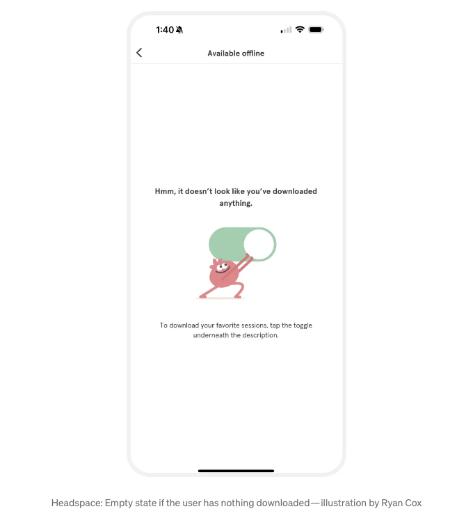
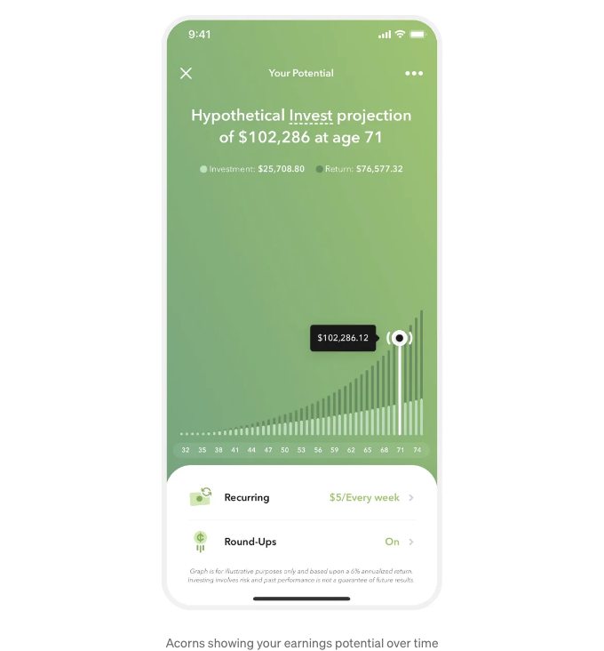
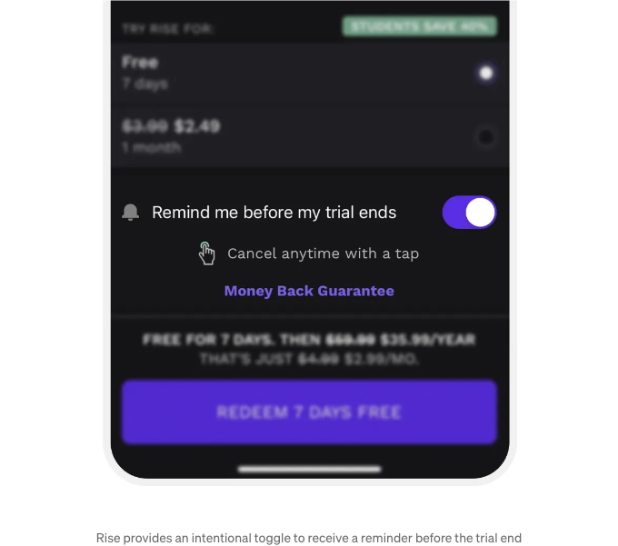

# 1) 사용자를 기쁘게 만들어보세요

## 기쁨의 순간을 만들어보세요:

작은 기쁨이 전체적인 인상을 크게 형성할 수 있습니다. 이러한 작은 순간들의 가치는 유틸리티에 있는 것이 아니라 재미있거나 기분을 좋게 만들거나 영감의 원천이 될 수 있는 능력에 있습니다.

그래서 여러분이 사용자의 감정을 자극할 수 있는 방법을 고려해 보세요 — 단순히 순간을 즐겁게 만들거나 주목할 만한 순간을 만드는 것을 목표로 하여요.

<!-- ui-log 수평형 -->
<ins class="adsbygoogle"
  style="display:block"
  data-ad-client="ca-pub-4877378276818686"
  data-ad-slot="9743150776"
  data-ad-format="auto"
  data-full-width-responsive="true"></ins>
<component is="script">
(adsbygoogle = window.adsbygoogle || []).push({});
</component>

주요 장점:

- 참여: 긍정적인 피드백 루프가 반복 사용을 격려합니다.
- 공유: 즐거운 경험은 더 많은 사람에게 공유될 가능성이 높아져 자연스럽게 확장됩니다. 입소문이 최고의 마케팅입니다.
- 행복: 전반적인 사용자 만족도를 향상시키고 제품과의 감정적 연결을 강화합니다.

이 개념은 저가 Headspace의 빈 상태를 작업하던 중에 나왔어요. 제 목표는 그게 즐거우면서도 교육적이었으면 좋겠다고요.

<!-- ui-log 수평형 -->
<ins class="adsbygoogle"
  style="display:block"
  data-ad-client="ca-pub-4877378276818686"
  data-ad-slot="9743150776"
  data-ad-format="auto"
  data-full-width-responsive="true"></ins>
<component is="script">
(adsbygoogle = window.adsbygoogle || []).push({});
</component>

이것을 강조하는 것은 디자인의 즐거움이 항상 화려한 컨페티 애니메이션만 있는 것은 아니라는 것을 보여주기 위해서입니다. 짜증나는 빈 상태에서 웃음을 짓게 만드는 순간으로의 작은 변화는 딱 적당한 양의 즐거움을 일으킬 수 있어요. 

단순함이 일합니다.

**2) 노력이 보이도록**

**노동의 환상 — 인식된 노력 = 가치**

<!-- ui-log 수평형 -->
<ins class="adsbygoogle"
  style="display:block"
  data-ad-client="ca-pub-4877378276818686"
  data-ad-slot="9743150776"
  data-ad-format="auto"
  data-full-width-responsive="true"></ins>
<component is="script">
(adsbygoogle = window.adsbygoogle || []).push({});
</component>

서비스 뒤에 있는 노력을 보여주어 지갑된 가치를 향상시켜보세요. 제품과 서비스에 투입된 노력을 인식할 때, 우리는 더 호의적으로 받아들이는 경향이 있습니다.

주요 이점:

- 전환율: 노력을 보여줌으로써 전환율이 향상됩니다.
- 신뢰: 노력이 노출되는 서비스는 사용자가 가치를 두며 신뢰할 가능성이 높습니다.

<!-- ui-log 수평형 -->
<ins class="adsbygoogle"
  style="display:block"
  data-ad-client="ca-pub-4877378276818686"
  data-ad-slot="9743150776"
  data-ad-format="auto"
  data-full-width-responsive="true"></ins>
<component is="script">
(adsbygoogle = window.adsbygoogle || []).push({});
</component>

Ledger에서는 우리 제휴 업체 견적을 사용자들에게 표시하기 전에 로더를 추가했어요. 실제로, 이 견적은 밀리초 안에 계산돼요.

왜냐하면?

견적 화면에서 가치의 인식을 높이기 위해서에요. Ledger가 나에게 "최상의 견적"을 찾고 있다는 것을 읽는 것은, 나에게 특별한 무언가가 나를 위해 준비되고 있으며, 그 뒤에서 많은 작업이 이루어지고 있다는 느낌을 주죠. 사실, 정말로 그렇지요.

다음에 Kayak이나 Skyscanner와 같은 항공 비교 사이트를 사용할 때, 그들의 인위적인 대기 화면에 주목해 보세요.

<!-- ui-log 수평형 -->
<ins class="adsbygoogle"
  style="display:block"
  data-ad-client="ca-pub-4877378276818686"
  data-ad-slot="9743150776"
  data-ad-format="auto"
  data-full-width-responsive="true"></ins>
<component is="script">
(adsbygoogle = window.adsbygoogle || []).push({});
</component>

# 3) 얼굴 활용

## 인간적 연결의 힘:

주의를 끌고 감정을 일으키기 위해 인간 얼굴을 활용하세요.

- 방향성: 사용자의 주의를 끌기 위해 CTA 또는 중요 콘텐츠를 향한 얼굴을 활용하세요. 이것은 작동하며 시간을 들여 증명되었습니다. 출처
- 진정한 것을 유지하세요: 실제 얼굴의 진정한, 공감할 수 있는 사진을 사용하세요. Midjourney는 거의 그곳에 왔지만, 주의해서 실제로 진짜 같게 만들어보세요. 여기에 몇 가지 아름다운 예시가 있지만 아직 실제로 얼마나 실감이 나는지는 잘 모르겠어요... 판단은 당신에게 달려있습니다.
- 감정을 고려하세요: 우리는 무의식적으로 다른 사람을 따라합니다. 사용자에게 일깨워주고자 하는 감정을 전달하는 얼굴을 선택하세요.

<!-- ui-log 수평형 -->
<ins class="adsbygoogle"
  style="display:block"
  data-ad-client="ca-pub-4877378276818686"
  data-ad-slot="9743150776"
  data-ad-format="auto"
  data-full-width-responsive="true"></ins>
<component is="script">
(adsbygoogle = window.adsbygoogle || []).push({});
</component>

주요 혜택:

- 참여: 얼굴은 개인적인 연결을 만듭니다.
- 신뢰: 진정한 시각 자료는 신뢰를 증진시키고 제품에 생동감을 불어넣습니다.

Feals와 협업해서 랜딩 페이지의 전자상거래 전환율을 높이기 위해 가장 효율적인 주요 CTA 클릭률을 증가시킬 수 있는 주요 이미지를 선택하기 위해 히트맵 테스트를 실시했습니다.

지시적 시선 이미지가 명확한 우승자로 나타났으며, 단순한 시각적 단서로 시청자 주의를 이끄는 것의 강력한 영향을 보여주었습니다.

<!-- ui-log 수평형 -->
<ins class="adsbygoogle"
  style="display:block"
  data-ad-client="ca-pub-4877378276818686"
  data-ad-slot="9743150776"
  data-ad-format="auto"
  data-full-width-responsive="true"></ins>
<component is="script">
(adsbygoogle = window.adsbygoogle || []).push({});
</component>

이 통찰력은 사진 촬영을 위한 창의적인 팀의 전략에도 영향을 미쳤어요. 목적을 갖고 사진을 촬영하여 주목을 끄는 시각 자료 라이브러리를 구축할 수 있었어요.

## 4) 희소성 활용

### 한정된 가용성이 행동을 유도합니다:

희소성을 활용하여 즉각적인 행동을 촉구하고 긴급성을 조성하세요.

<!-- ui-log 수평형 -->
<ins class="adsbygoogle"
  style="display:block"
  data-ad-client="ca-pub-4877378276818686"
  data-ad-slot="9743150776"
  data-ad-format="auto"
  data-full-width-responsive="true"></ins>
<component is="script">
(adsbygoogle = window.adsbygoogle || []).push({});
</component>

잘못된 희소성:
"한정 시간" 제안을 볼 때, 종종 실제로 한정되지 않은 제안과 카운트다운이 함께 표시되는 것이 너무 흔합니다. 이렇게 하지 마세요. 사용자가 나중에 동일한 "긴급" 거래를 알아차릴 때 신뢰를 떨어뜨리고 게으르게 여겨질 수 있습니다.
귀하께서는 제품의 진실성을 유지하고 장기적 신뢰를 흔들지 않도록 희소성 효과를 윤리적으로 활용하는 방법을 고려하십시오. 상기 예시에서 airbnb가 희소성에 접근한 방식을 좋아합니다. 이 방식은 숙박을 예약하도록 충동을 주면서 동시에 보석을 예약한 결정을 인정해줍니다.💎

주요 이점:

- 변환율: 희소성은 사용자가 빠르게 대응할 필요성을 느끼므로 변환이율이 높아집니다.
- 인식된 가치: 희소성은 제안을 더 독점적이거나 특별하게 느끼게 만들 수 있습니다. 우리는 보통 얻을 수 없는 것을 원하게 됩니다.

<!-- ui-log 수평형 -->
<ins class="adsbygoogle"
  style="display:block"
  data-ad-client="ca-pub-4877378276818686"
  data-ad-slot="9743150776"
  data-ad-format="auto"
  data-full-width-responsive="true"></ins>
<component is="script">
(adsbygoogle = window.adsbygoogle || []).push({});
</component>

# 5) 개인화를 장려하세요

## 기부 효과 = 자신이 노력한 것을 더 가치 있게 여기는 현상:

이것은 일명 이케아 효과로 알려져 있으며, 우리가 직접 만든 것에 더 중요성을 둔다는 의미입니다.

개인화는 모든 습관 형성 제품의 핵심입니다. 우리는 자신의 취향에 맞게 맞춰진 물건들을 사랑합니다. 개인화된 제품은 감정적으로 다가가며 기억에 오래 남습니다.

<!-- ui-log 수평형 -->
<ins class="adsbygoogle"
  style="display:block"
  data-ad-client="ca-pub-4877378276818686"
  data-ad-slot="9743150776"
  data-ad-format="auto"
  data-full-width-responsive="true"></ins>
<component is="script">
(adsbygoogle = window.adsbygoogle || []).push({});
</component>

사람들이 자신만의 경험을 개인화할 수 있도록 허용하고 장려합니다. 이는 그들의 소유감과 지각된 가치를 향상시킬 것입니다.

사용자가 처음부터 너무 많은 입력으로 과부하를 받지 않도록 올바른 균형을 찾는 데 주의를 기울이세요. 최고의 제품 팀은 점진적인 개인화를 채택하여 사용자가 제품을 시간이 지남에 따라 자신에게 맞게 조정할 수 있도록 섬세하게 안내합니다.

주요 이점:

- 유지율: 사람들이 무언가에 소유감을 느끼거나 경험을 개인화하는 데 투자한 것 같다면 이탈할 가능성이 줄어듭니다.
- 참여: 소유권은 더 자주 사용하고 오래 사용하게끔 이끕니다, 총 참여율을 높입니다.
- 공유: 제품에 대한 소유감과 애정을 느끼는 사용자들은 그 제품에 대해 알고 있는 모든 사람들에게 이야기할 확률이 높아집니다. 이는 인간의 본성입니다.

<!-- ui-log 수평형 -->
<ins class="adsbygoogle"
  style="display:block"
  data-ad-client="ca-pub-4877378276818686"
  data-ad-slot="9743150776"
  data-ad-format="auto"
  data-full-width-responsive="true"></ins>
<component is="script">
(adsbygoogle = window.adsbygoogle || []).push({});
</component>

Headspace에서 커뮤니티 기능을 개발하면서 기억에 남는 순간은 아바타 생성기였어요. 이것을 통해 자신만의 캐릭터를 맞춤 설정할 수 있었죠. 우리의 커뮤니티 기능에 참여율을 높이는 것이 목표였고, 사람들이 자신의 실천뿐만 아니라 캐릭터에도 감정적인 연결을 형성하길 원했어요.

# 6) 더 많은 것을 이루기 위해 작은 일부터 시작하세요

## 입구로서의 효과:

첫 번째로 작은 요청에 동의하는 사람들은 나중에 큰 요청에 동의할 가능성이 더 높아집니다.

<!-- ui-log 수평형 -->
<ins class="adsbygoogle"
  style="display:block"
  data-ad-client="ca-pub-4877378276818686"
  data-ad-slot="9743150776"
  data-ad-format="auto"
  data-full-width-responsive="true"></ins>
<component is="script">
(adsbygoogle = window.adsbygoogle || []).push({});
</component>

프린드먼과 프레이저는 이 아이디어를 고안한 사람들로, 이를 통해 상대방이 강제로 느끼지 않고 동의하는 부드러운 방법이라고 말했습니다.

이것을 조작에 사용해서는 안 됩니다. 이는 이미 원하는 결과를 표현한 행동이나 변화를 격려하기 위해 사용되어야 합니다.

그래서 긍정적인 변화를 약속하는 제품의 맥락에서는 다음과 같이 접근해야 합니다:

- 작게 시작하기: 노력이 많이 필요하지 않은 쉬운 작업부터 시작합니다.
- 수준을 높이기: 처음 몇 가지 쉬운 것을 한 후 점점 어려운 작업으로 전환합니다.
- 격려하기: 사용자를 동기 부여하기 위해 작은 작업에 대한 빠른 긍정적인 피드백이나 보상을 제공합니다.
- 일관성 유지하기: 사용자가 계속해서 하도록 격려하기 위해 이미 한 일을 상기시킵니다. 애플 피트니스는 항상 이런 식으로합니다: "거의 다 왔어요! 여전히 링을 닫을 수 있습니다."
- 성공 스토리 보여주기: 제품을 사용하는 다른 사람들이 작게 시작해서 시간이 지남에 따라 목표를 달성한 방식을 공유하여 영감을 주고 안내합니다.

<!-- ui-log 수평형 -->
<ins class="adsbygoogle"
  style="display:block"
  data-ad-client="ca-pub-4877378276818686"
  data-ad-slot="9743150776"
  data-ad-format="auto"
  data-full-width-responsive="true"></ins>
<component is="script">
(adsbygoogle = window.adsbygoogle || []).push({});
</component>

주요 혜택:

- 참여: 초기 작은 약속은 제품에 대한 추가 투자 가능성을 높입니다.
- 신뢰: 작은 요청부터 시작하여 신뢰를 쌓고 큰 약속에 대한 두려움을 줄입니다.
- 가치: 제품에 시간과 노력을 투자하는 사용자들은 더 큰 가치를 느끼기 쉽습니다.

Fabulous 앱에서 온보딩 중에는 당신의 이름이 적힌 약속이 보입니다. 화면에 손가락을 올려 약속을 “서명”하세요.

<!-- ui-log 수평형 -->
<ins class="adsbygoogle"
  style="display:block"
  data-ad-client="ca-pub-4877378276818686"
  data-ad-slot="9743150776"
  data-ad-format="auto"
  data-full-width-responsive="true"></ins>
<component is="script">
(adsbygoogle = window.adsbygoogle || []).push({});
</component>

작은 손가락 한 번 누르는 것조차도 당신이 앱을 시도하고 목표를 이행하게 될 가능성을 높일 수 있어요.

작은 걸음이 큰 결과로 이어질 수 있어요.

## 7) 손실 회피 활용

### 우리는 무의식적으로 손실을 피하려 합니다:

<!-- ui-log 수평형 -->
<ins class="adsbygoogle"
  style="display:block"
  data-ad-client="ca-pub-4877378276818686"
  data-ad-slot="9743150776"
  data-ad-format="auto"
  data-full-width-responsive="true"></ins>
<component is="script">
(adsbygoogle = window.adsbygoogle || []).push({});
</component>

손해 회피는 손실의 두려움이 이득에 대한 기쁨을 앞선다는 인지적 편향입니다. 이 원칙은 우리 심리에 깊게 뿌리를 둔 것입니다. 우리는 손실을 본능적으로 피하는 경향이 있습니다. 이에 대한 심리를 더 자세히 알아보세요.

손실을 경험하는 것은 이기는 것보다 2배로 영향력이 큽니다. 다시 말해, 100달러를 잃는 것이 100달러를 얻는 것보다 더 "아픈" 경험일 것입니다.

손해 회피를 효과적으로 활용하는 방법은 다음과 같습니다:

잠재적인 손실을 강조: 사용자가 행동을 계속할 경우 무엇을 잃게 될지를 암시적으로 강조하는 것부터 시작하세요. 이겻은 두려움을 조장하는 것이 아니라 오히려 건네진 것의 가치를 강조하는 것입니다.

<!-- ui-log 수평형 -->
<ins class="adsbygoogle"
  style="display:block"
  data-ad-client="ca-pub-4877378276818686"
  data-ad-slot="9743150776"
  data-ad-format="auto"
  data-full-width-responsive="true"></ins>
<component is="script">
(adsbygoogle = window.adsbygoogle || []).push({});
</component>

안내를 제공하세요: 사용자가 손실로 이어질 수 있는 조치를 취할 때 즉각적인 확인 또는 확정을 제공하여, 결정을 강화하고 불안을 줄입니다. 예를 들어 사용자가 설정을 변경하고 뒤로 가기 버튼을 탭하면, 변경이 저장되었다고 알리는 성공 토스트를 표시하세요. 즉객적인 피드백은 제품과 사용자의 선택에 대한 자신감을 키우는 데 도움이 됩니다.

사용자의 약속을 상기시키세요: 이것은 쉽게 할 수 있으며, 지속적인 참여를 촉진하고 격려합니다. 예를들어, 피트니스 앱의 경우, 누군가가 운동을 마치면, 그들의 진전을 요약한 메시지와 함께 “잘 했어요! 이번 주에 5번의 운동을 완료했습니다. 목표를 이어가세요!”와 같은 메시지를 표시하세요.

성공 스토리를 소개하세요: 우리의 본질적으로 원하는 것은 종종 변화입니다. 사회적 입증을 사용하여 다른 사람들이 손실을 경험하지 않고 자신을 성공적으로 변화시킨 사례를 공유하세요. 예를 들어, 언어 학습 앱의 경우, 사용자들이 프로그램을 고수함으로써 누리게 된 혜택과 피해를 강조하는 사용자 스토리를 강조하세요: “포기하려다가 마침내 스페인어로 자신있게 대화할 수 있게 되었어요. 정말이지 관계에 새로운 활력을 주었어요!”

<!-- ui-log 수평형 -->
<ins class="adsbygoogle"
  style="display:block"
  data-ad-client="ca-pub-4877378276818686"
  data-ad-slot="9743150776"
  data-ad-format="auto"
  data-full-width-responsive="true"></ins>
<component is="script">
(adsbygoogle = window.adsbygoogle || []).push({});
</component>

주요 혜택:

- 이탈률: 사람들이 도중에 안심을 받으면 덜 포기할 가능성이 높습니다.
- 전환이: 사람들은 큰 헌신을 망설이기 일 수 있습니다. 그것이 무료 평가판이 잘 작동하는 이유입니다. 망설임과 손실의 두려움을 제거하기 때문입니다.
- 신뢰: 제품에 대해 투명하게 의사소통하는 제품을 신뢰할 것입니다.

## 보너스 팁: 선택 토글

<!-- ui-log 수평형 -->
<ins class="adsbygoogle"
  style="display:block"
  data-ad-client="ca-pub-4877378276818686"
  data-ad-slot="9743150776"
  data-ad-format="auto"
  data-full-width-responsive="true"></ins>
<component is="script">
(adsbygoogle = window.adsbygoogle || []).push({});
</component>

Rise는 사용자가 알림을 선택할 수 있는 방식을 채택하여 다른 접근 방식을 취합니다. 이 맞춤 접근 방식은 신중한 선택을 포함하기 때문에 더 큰 안도감을 제공할 수 있습니다. 사용자에게 귀찮은 푸시 알림을 켜도록 유도하는 완벽한 순간일 수도 있습니다.

# 최종 생각

사용성 이면에, 공감대를 형성하는 제품을 구축하는 비결은 사람들이 생각하고 행동하는 방식을 깊이 이해하는 데 있습니다.

전환, 이탈, 신뢰, 참여와 같은 혜택을 강조하는 이유는 성공적인 디지털 제품의 근간이기 때문입니다. 이러한 언어를 사용하여 신경설계 원리를 뒷받침하면 중요한 결과에 영향을 줄 수 있습니다. 이것은 당신을 더 날렵한 디자이너로 만들어 주고 회사의 목표와 일치하는 디자인을 지지하는 설득력 있는 대변자로 만들어 줍니다.

<!-- ui-log 수평형 -->
<ins class="adsbygoogle"
  style="display:block"
  data-ad-client="ca-pub-4877378276818686"
  data-ad-slot="9743150776"
  data-ad-format="auto"
  data-full-width-responsive="true"></ins>
<component is="script">
(adsbygoogle = window.adsbygoogle || []).push({});
</component>

내기 디자인을 배달하기 위한 청사진인 키 메트릭스를 잊지 마세요.

내재적 동기에 호소하는 것이 제가 제품 디자이너로 일하는 이유에요. 디자인, 심리학, 비즈니스의 실용적인 조합이기 때문이죠.

당신의 신경 단편:

- 사용자를 기쁘게 하세요: 상호작용을 기억에 남도록 만드세요.
- 노력을 보이세요: 작업 뒤의 수고를 보여주세요.
- 얼굴을 사용하세요: 인간적인 수준에서 연결하세요.
- 희소성을 활용하세요: 열망의 힘을 이용하세요.
- 개인화를 장려하세요: 모든 경험을 독특하게 만드세요.
- 더 많은 것을 이루기 위해 작게 시작하세요: 단계별로 위대함을 구축하세요.
- 결과에 대해 명확해지세요: 투명성으로 결정을 안내하세요.