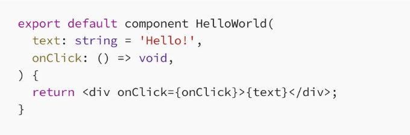

## Flow를 사용하여 더 안전하고 간결한 React 작성하기



매일 Meta의 주요 코드베이스에 수천 명의 엔지니어가 React 코드를 기여하고 있습니다. Flow 팀의 역할 중 일부는 디자인 시스템 React 전문가부터 C++ 엔지니어로서 백엔드 서비스를 지원하기 위한 일회성 내부 페이지를 만드는 데 참여하는 데 있습니다. 작년 동안, 우리는 React 코드를 더 높은 품질로 작성하는 데 필요한 새로운 언어 기능을 여러 개 구축했으며, 디자인 시스템 소유자가 디자인 제약 조건을 유형 시스템 자체에서 표현할 수 있도록 강력한 새로운 도구를 구축했습니다.

Flow는 Component Syntax를 소개하여 React 구성 요소 및 훅과 같은 React 기본 기능에 대한 지원을 첫째 등급으로 추가했다고 발표했습니다. 이러한 기능은 많은 React 규칙에 대한 개선된 사용성, 표현력 및 정적 강제 적용을 제공합니다.

<!-- ui-log 수평형 -->
<ins class="adsbygoogle"
  style="display:block"
  data-ad-client="ca-pub-4877378276818686"
  data-ad-slot="9743150776"
  data-ad-format="auto"
  data-full-width-responsive="true"></ins>
<component is="script">
(adsbygoogle = window.adsbygoogle || []).push({});
</component>

우리는 이미 Meta의 모든 코드베이스에서 Component Syntax를 채택했는데, 결과가 놀라울 정도로 대단해요! 컴포넌트 작성을 위한 보일러플레이트가 대대적으로 줄었고, 수천 건의 React 규칙 위반을 적발했으며, 디자인 시스템이 스타일 규칙을 유형 시스템에 체계화했어요. 무엇보다 중요한 건, 엔지니어들이 새로운 기능을 사랑한다는 거에요. 우리는 이러한 기능을 폭넓은 커뮤니티와 공유할 때가 기대돼요.

이미 React를 사용 중이라면 Flow 프로젝트에서 이러한 새로운 기능을 활성화하려면 Flow v0.233.0 이상으로 업그레이드하면 돼요.

React를 사용하는 데는 이러한 것이 필수인 건 아니지만, 이미 Flow를 사용 중이라면 이러한 기능이 흥미로울지도 몰라요.

## 컴포넌트 구문 기능

<!-- ui-log 수평형 -->
<ins class="adsbygoogle"
  style="display:block"
  data-ad-client="ca-pub-4877378276818686"
  data-ad-slot="9743150776"
  data-ad-format="auto"
  data-full-width-responsive="true"></ins>
<component is="script">
(adsbygoogle = window.adsbygoogle || []).push({});
</component>

구성 요소 구문은 여러 가지 새로운 기능을 소개합니다:

- 새로운 구성 요소 선언. 구성 요소를 정의하기 위한 전용 구문으로, 사용하기 편리하고 보일러플레이트 코드를 줄이며 많은 React 규칙을 강제로 적용하여 더 큰 안정성을 제공합니다.
- 새로운 훅 선언. 훅을 정의하기 위한 전용 구문으로, 훅 규칙을 강제로 적용하여 추가적인 안정성을 제공합니다.
- 정적으로 시행되는 렌더 유형별 디자인 시스템 규칙. 우리는 렌더 유형을 도입했는데, 이는 스타일 제약 사항을 유형을 통해 간단히 표현할 수 있는 디자인 시스템을 위한 강력한 도구입니다.

## 구성 요소 구문 안내

오늘의 코드 😴

<!-- ui-log 수평형 -->
<ins class="adsbygoogle"
  style="display:block"
  data-ad-client="ca-pub-4877378276818686"
  data-ad-slot="9743150776"
  data-ad-format="auto"
  data-full-width-responsive="true"></ins>
<component is="script">
(adsbygoogle = window.adsbygoogle || []).push({});
</component>

```js
유형 Props = $ReadOnly<{
  text?: string,
  onClick: () => void,
}>;

export default function HelloWorld({
  text = 'Hello!',
  onClick,
}: Props): React.MixedElement {
  return <div onClick={onClick}>{text}</div>;
}
```

구성 요소 구문 🔥

```js
export default component HelloWorld(
  text: string = 'Hello!',
  onClick: () => void,
) {
  return <div onClick={onClick}>{text}</div>;
}
```

# 기본 사항
```  

<!-- ui-log 수평형 -->
<ins class="adsbygoogle"
  style="display:block"
  data-ad-client="ca-pub-4877378276818686"
  data-ad-slot="9743150776"
  data-ad-format="auto"
  data-full-width-responsive="true"></ins>
<component is="script">
(adsbygoogle = window.adsbygoogle || []).push({});
</component>

보시는 대로, 컴포넌트는 함수와 매우 유사하지만 몇 가지 차이가 있습니다:

- function 키워드를 component로 대체합니다.
- 개별 params 대신 props 객체를 사용하며, 인라인으로 기본값을 지정하는 것이 지원됩니다. 
- 이는 객체 비구조화를 사용할 때 필요한 중복을 제거하고 $ReadOnly`{…}`와 같은 수정자가 필요하지 않게 합니다.
- 렌더링 유형을 사용하지 않는 한 반환 유형이 필요하지 않습니다. Flow는 반환된 값이 항상 React.Node의 하위 유형임을 강제합니다.

# 전체 호환성

컴포넌트는 기능적인 대응물을 완전히 대체하도록 설계되었습니다. 이를 달성하기 위해, 모든 prop 유형을 지원하는 추가 기능 몇 가지를 추가했으며, 나머지 매개변수와 유효하지 않은 JavaScript 식별자를 사용하는 props(data-`attr`과 같이)를 포함합니다.

<!-- ui-log 수평형 -->
<ins class="adsbygoogle"
  style="display:block"
  data-ad-client="ca-pub-4877378276818686"
  data-ad-slot="9743150776"
  data-ad-format="auto"
  data-full-width-responsive="true"></ins>
<component is="script">
(adsbygoogle = window.adsbygoogle || []).push({});
</component>

```js
export default component HelloWorld(
  'data-testid' as testid: string, // [1]
  ...otherProps: OtherProps // [2]
) {
  return <div data-testid={testid} {...otherProps} /></div>;
}
```

- 문자열 props은 허용되지만 as를 사용하여 이름을 바꿔야 합니다.
- 나머지 매개변수를 사용하여 props 객체를 만드는 것도 지원됩니다.

# 향상된 안전성

명확한 문법적 이점을 넘어, 컴포넌트 구문은 Flow가 코드를 더 잘 이해하고 React의 최상의 관행을 강제로 시키며 흔한 함정을 피하도록 돕는 새로운 기능들을 소개합니다. 다음 섹션에서는 이러한 기능 중 일부를 다룰 예정입니다.```

<!-- ui-log 수평형 -->
<ins class="adsbygoogle"
  style="display:block"
  data-ad-client="ca-pub-4877378276818686"
  data-ad-slot="9743150776"
  data-ad-format="auto"
  data-full-width-responsive="true"></ins>
<component is="script">
(adsbygoogle = window.adsbygoogle || []).push({});
</component>

# 프롭스가 깊게 읽기 전용인지 확인하기

React의 기본 규칙 중 하나는 컴포넌트의 프롭스를 변경해서는 안 된다는 것입니다. 과거에는 $ReadOnly로 프롭 타입을 래핑하는 일반적인 방법으로 이 동작이 일부 강제되었습니다. 컴포넌트 구문을 사용하면 렌더링 중에 프롭스가 변경되지 않도록 모두 확인됩니다. 이는 $ReadOnly를 더 이상 추가할 필요가 없다는 것을 의미하며(나머지 프롭도 포함), 속성이 쓰기로부터 깊게 보호되도록하는 추가적인 Flow 커버리지도 제공합니다.

```js
type Item = { 
  itemName: string,
};
type OtherProps = {
  userId: number,
};

component UserItem(userItem: Item, ...props: OtherProps) {
  props.userId = 0; // 오류: react-rule-unsafe-mutation
  userItem.itemName = "Cool New Laptop";  // 오류: react-rule-unsafe-mutation

  const copiedObj = {...userItem};
  copiedObj.arr[0] = 3; // 오류: 복사된 객체를 통해 오류를 잡을 수 있음
}
```

위의 마지막 오류는 특히 우리가 발견한 것 중에 흥미로웠습니다! React의 규칙을 명확히 이해하고 객체를 직접 수정하는 대신 복사해서 사용한 경우도 본 적이 많았는데, 여전히 복사가 아닌 별칭된 값들을 잘못으로 수정하는 경우가 많았습니다. 무결성은 경험 많은 개발자에게도 어렵습니다.

<!-- ui-log 수평형 -->
<ins class="adsbygoogle"
  style="display:block"
  data-ad-client="ca-pub-4877378276818686"
  data-ad-slot="9743150776"
  data-ad-format="auto"
  data-full-width-responsive="true"></ins>
<component is="script">
(adsbygoogle = window.adsbygoogle || []).push({});
</component>

이 기능은 이전에 보편적이었던 보일러플레이트 필요성을 없애면서 일반적인 버그 클래스를 방지하는 데 도움이 됩니다. 그러나 이 기능에는 제한이 있습니다. 현재 Flow는 컴포넌트나 훅(props의 변경을 감지하는 것만 가능하며, 메서드 호출이 변이를 일으키지 않는다고 낙관적으로 가정합니다).

# Ref를 사용하여 최상의 관행 강제화

컴포넌트 본문에서 우리가 강제하는 또 다른 패턴은 렌더 중에 ref가 읽기 또는 쓰기되지 않도록 하는 것입니다. 이것은 의도치 않은 동작으로 이어질 수 있는 또 다른 일반적인 함정입니다. 자세한 내용은 React 문서를 확인해보세요. 다음은 이것이 어떻게 작동하는지 예시입니다:

```js
component MyComponent() {
  const renderCount = useRef<number>(0);
  renderCount.current += 1; // 에러
  return <div>{renderCount.current}</div> // 에러
}
```

<!-- ui-log 수평형 -->
<ins class="adsbygoogle"
  style="display:block"
  data-ad-client="ca-pub-4877378276818686"
  data-ad-slot="9743150776"
  data-ad-format="auto"
  data-full-width-responsive="true"></ins>
<component is="script">
(adsbygoogle = window.adsbygoogle || []).push({});
</component>

refs를 컴포넌트에서 안전하게 사용하려면 이벤트 핸들러나 효과에서 refs를 읽거나 쓸 수 있습니다:

```js
component MyComponent() {
  const renderCount = useRef<number>(0);
  const [count, setCount] = useState(0);
  useEffect(() => {
    renderCount.current += 1; // 됨
    setCount(renderCount.current); // 됨
  }, [renderCount]);
  return <div>{count}</div>
}
```

이러한 기능을 통해 프로그래머와 리뷰어들은 버그 없는 코드를 작성하는 대신에 비즈니스 로직에 집중할 수 있게 됩니다. Flow가 세부 사항 정리를 처리하도록 하고, 여러분은 영향에 집중하세요.

# 훅 구문

<!-- ui-log 수평형 -->
<ins class="adsbygoogle"
  style="display:block"
  data-ad-client="ca-pub-4877378276818686"
  data-ad-slot="9743150776"
  data-ad-format="auto"
  data-full-width-responsive="true"></ins>
<component is="script">
(adsbygoogle = window.adsbygoogle || []).push({});
</component>

훅은 React에서 또 다른 기본 추상화 방식이며, 개선된 유형 검사 유효성 검사를 통해 혜택을 받을 수 있습니다. 우리는 사용자 정의 훅을 선언할 때 함수 대신 사용할 수 있는 hook 키워드를 도입했습니다. 이를 통해 플로우가 훅이 React 프로그래밍 모델을 준수하는지 강제할 수 있습니다:

- 훅은 모든 렌더링에서 동일한 순서로 호출되어야 합니다 (즉, 훅은 조건부로 호출되어서는 안됨).
- 훅은 ref.current를 읽지 않거나 전달된 매개변수를 수정하지 않는 등 구성 요소 본문과 동일한 제한 내에서 작동해야 합니다.
- 호출할 때, 훅은 useFoo 네이밍 규칙을 준수해야 합니다. 예를 들어, use_foo()나 myHook()은 플로우 오류를 발생시킬 것입니다.
- 위와 반대로, 컴포넌트나 다른 훅 내에서 사용되는 비훅 함수는 useFoo 패턴과 일치하는 이름을 가져서는 안 됩니다.

이러한 규칙 중 많은 것들이 React의 ESLint 플러그인에 의해 이미 강제되고 있지만, 컴포넌트 섹션에서 논의된 유효성 검사도 훅에 적용됩니다.

아래 예제에서 보듯이, 훅 구문을 채택하기 위해 필요한 유일한 변경은 함수를 hook으로 대체하는 것뿐입니다.

<!-- ui-log 수평형 -->
<ins class="adsbygoogle"
  style="display:block"
  data-ad-client="ca-pub-4877378276818686"
  data-ad-slot="9743150776"
  data-ad-format="auto"
  data-full-width-responsive="true"></ins>
<component is="script">
(adsbygoogle = window.adsbygoogle || []).push({});
</component>

코드 오늘도 😴

```js
function useOnlineStatus(initial: boolean): boolean {
  const [isOnline, setIsOnline] = useState(initial);
  useEffect(() => {
    // ...
  }, []);
  return isOnline;
}
```

훅 구문 🔥

```js
훅 useOnlineStatus(initial: boolean): boolean {
  const [isOnline, setIsOnline] = useState(initial);
  useEffect(() => {
    // ...
  }, []);
  return isOnline;
}
```

<!-- ui-log 수평형 -->
<ins class="adsbygoogle"
  style="display:block"
  data-ad-client="ca-pub-4877378276818686"
  data-ad-slot="9743150776"
  data-ad-format="auto"
  data-full-width-responsive="true"></ins>
<component is="script">
(adsbygoogle = window.adsbygoogle || []).push({});
</component>

Hooks(훅) 문서를 확인해 보세요.

# 렌더 타입

렌더 타입은 컴포넌트가 어떻게 조합되어야 하는지 정의하는 직관적인 방법을 제공하는 강력한 새로운 기능입니다. 우리는 렌더 타입을 디자인함으로써 컴포넌트 라이브러리와 작업하는 것을 더 안전하고 쉽게 만들었습니다. 렌더 타입의 핵심은 컴포넌트가 최종적으로 렌더링해야 하는 것을 지정하는 데 사용할 수 있는 새로운 렌더 타입 주석으로 구성되어 있습니다. 아래는 예시입니다:

```js
// 컴포넌트 라이브러리
export component Header() { ... }

export component Layout(
  header: renders Header,  // 라이브러리 컴포넌트는 어떤 props가 렌더링되어야 하는지 지정할 수 있습니다
) { ... }


// 제품 코드
component MyHeader() renders Header { // 컴포넌트는 최종적으로 무엇을 렌더링할지 설명할 수 있습니다
  // ...
  return <Header />;
}

export component MyLayout() {
  // OK! MyHeader는 Header를 렌더링합니다
  return <Layout header={<MyHeader />} />; 
}
```

<!-- ui-log 수평형 -->
<ins class="adsbygoogle"
  style="display:block"
  data-ad-client="ca-pub-4877378276818686"
  data-ad-slot="9743150776"
  data-ad-format="auto"
  data-full-width-responsive="true"></ins>
<component is="script">
(adsbygoogle = window.adsbygoogle || []).push({});
</component>

Meta에서 React 코드를 작성해야 하는 모든 사람이 프런트엔드 전문가는 아닙니다. 디자인 시스템을 사용하면 경험이 비교적 적은 사람들도 아름다운 일관된 UI를 만들 수 있어요. 렌더 타입을 사용하면 디자인 시스템 소유자들이 디자인 규칙을 유형 시스템에 코딩하여, UX나 UI 디자인에 대해 많은 지식이 없어도 아래쪽 사용자들이 더 즐거운 경험을 만들 수 있도록 돕습니다.

렌더 타입을 사용하면 다음과 같은 것도 할 수 있어요:
- 선택적 렌더링 묘사 또는 renders?와 renders* 변형을 사용하여 항목 목록 렌더링.
- 컴포넌트 이름을 사용하여 쉽게 컴포넌트 유형을 참조할 수 있어요. 예를 들어, Header는 React.Element`typeof Header`와 동일합니다.

렌더 타입에 대한 자세한 내용은 렌더 타입 문서를 확인해보세요.

<!-- ui-log 수평형 -->
<ins class="adsbygoogle"
  style="display:block"
  data-ad-client="ca-pub-4877378276818686"
  data-ad-slot="9743150776"
  data-ad-format="auto"
  data-full-width-responsive="true"></ins>
<component is="script">
(adsbygoogle = window.adsbygoogle || []).push({});
</component>

# 한번 해보세요

구성 구문이 실제로 어떻게 작동하는지 보거나 직접 시도해 보려면 GitHub의 예제 앱을 확인해보세요.

# 결론

구성 구문은 React UI를 구축하는 혁신적인 접근 방식을 소개하여 향상된 유형 안전성, 가독성 및 개발자 효율성을 제공합니다. 이는 구성 요소를 위한 보일러플레이트를 줄이고 React 최상의 실천 방법을 강요하며, 개발자가 일반적인 디자인 시스템 패턴을 안전하게 표현할 수 있도록 합니다.

<!-- ui-log 수평형 -->
<ins class="adsbygoogle"
  style="display:block"
  data-ad-client="ca-pub-4877378276818686"
  data-ad-slot="9743150776"
  data-ad-format="auto"
  data-full-width-responsive="true"></ins>
<component is="script">
(adsbygoogle = window.adsbygoogle || []).push({});
</component>

저희는 리액트 팀과 함께 구성 요소 구문을 디자인했고, 이미 Meta의 코드베이스 전반에 사용 중입니다. 앞으로도 리액트에 대한 Flow의 이해를 확장하고, 리액트와 작업할 때 안전성과 표현력을 향상시키는 것을 계획하고 있습니다.

—

Alex Taylor와 Jordan Brown이 작성함