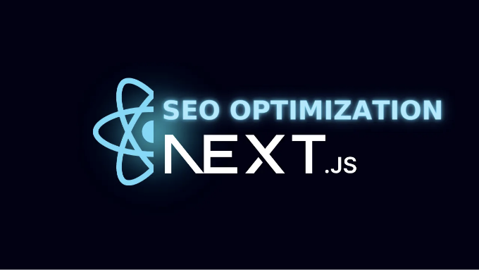

요즘 디지털 환경에서 검색 엔진 최적화(SEO)는 웹 사이트로의 유기적인 트래픽을 촉진하는 데 중요한 역할을 합니다. 강력한 React 프레임워크인 Next.js는 개발자들에게 성능이 우수하고 SEO 친화적인 웹 애플리케이션을 구축할 수 있는 견고한 기반을 제공합니다. 이 블로그 포스트에서는 Next.js에서 SEO를 최적화하기 위한 고급 기술을 탐색하여 검색 엔진 가시성을 향상시키고 더 많은 유기적인 트래픽을 유도하는 방법을 살펴보겠습니다.

## 목차:

- SEO 기본 개념 이해
- Next.js와 SEO: 우수한 조합
- Next.js에서 고려해야 할 주요 SEO 요소
1. 메타 태그 및 제목 최적화
2. 구조화된 데이터 마크업
3. URL 구조 및 정규 URL
4. 사이트맵 생성
5. 반응형 및 모바일 친화적 디자인
- Next.js에서의 고급 SEO 기술
1. 동적 메타 태그 및 제목
2. SEO를 위한 서버 측 렌더링 (SSR)
3. 개방 그래프 및 트위터 카드 구현
4. SEO를 위한 페이지네이션 처리
5. 이미지 최적화하기
- SEO 성능 모니터링 및 분석
1. Google Analytics 통합
2. 통찰력을 위한 검색 콘솔 활용
3. SERP 순위 및 클릭률 모니터링
- Next.js를 위한 기술적 SEO 고려 사항
1. 리디렉션의 올바른 처리
2. 중복 내용 및 정규화 관리
3. 페이지네이션 및 rel="next/prev" 구현
4. 404 오류 및 사용자 정의 오류 페이지 관리
- 성능 최적화와 SEO
1. 빠른 페이지 로드 시간
2. 지연 로딩과 코드 분할
3. HTML 및 CSS 최적화
- SEO 최상의 실천 방법에 대한 최신 업데이트 유지
1. 알고리즘 업데이트 따라가기
2. 링크 빌딩 및 콘텐츠 마케팅 참여
3. 사용자 경험 (UX) 신호 향상

<!-- ui-log 수평형 -->
<ins class="adsbygoogle"
  style="display:block"
  data-ad-client="ca-pub-4877378276818686"
  data-ad-slot="9743150776"
  data-ad-format="auto"
  data-full-width-responsive="true"></ins>
<component is="script">
(adsbygoogle = window.adsbygoogle || []).push({});
</component>

## Zegocloud을 소개합니다

ZEGOCLOUD는 개발자에게 API 및 SDK 세트를 제공하여 비디오 통화 애플리케이션을 쉽게 구축할 수 있는 클라우드 기반 비디오 통화 플랫폼입니다.

10분 이내에 Zegocloud를 사용하여 비디오 통화 앱을 만드는 방법에 대한 멋진 기사를 읽어보세요.

# SEO 기본 원리 이해:

<!-- ui-log 수평형 -->
<ins class="adsbygoogle"
  style="display:block"
  data-ad-client="ca-pub-4877378276818686"
  data-ad-slot="9743150776"
  data-ad-format="auto"
  data-full-width-responsive="true"></ins>
<component is="script">
(adsbygoogle = window.adsbygoogle || []).push({});
</component>

Next.js 특유의 기술에 깊게 파고들기 전에 몇 가지 중요한 SEO 원칙을 빠르게 살펴보겠습니다. 메타 태그, 구조화된 데이터 마크업, URL 구조 및 사이트맵은 검색 엔진이 웹 페이지를 이해하고 순위를 매기는 데 중요한 요소입니다.

# Next.js와 SEO: 완벽한 조합:

Next.js는 서버 사이드 렌더링(SSR) 기능을 제공하여 검색 엔진에 완전히 렌더링된 HTML 콘텐츠를 제공하므로 SEO 친화적인 애플리케이션을 구축하는 우수한 선택입니다. 게다가 Next.js에는 자동 코드 분할 및 프리패칭과 같은 내장된 최적화 기능이 포함되어 있어 SEO 성능 향상에 기여합니다.

# Next.js에서 고려해야 할 주요 SEO 요소:

<!-- ui-log 수평형 -->
<ins class="adsbygoogle"
  style="display:block"
  data-ad-client="ca-pub-4877378276818686"
  data-ad-slot="9743150776"
  data-ad-format="auto"
  data-full-width-responsive="true"></ins>
<component is="script">
(adsbygoogle = window.adsbygoogle || []).push({});
</component>

SEO를 최적화하려면 특정 고려 사항에 대해 자세히 살펴보겠습니다:

## 1. 메타 태그 및 제목 최적화:

Next.js는 각 페이지의 메타 태그 및 제목을 동적으로 생성할 수 있습니다. `next/head` 컴포넌트를 활용하여 이러한 태그를 페이지 내용에 따라 동적으로 사용자 정의할 수 있습니다. 동적 메타 태그와 제목을 설정하는 예시는 다음과 같습니다:

```js
import Head from "next/head";
function MyPage() {
  return (
    <>
      <Head>
        <title>내 페이지 | Next.js SEO</title>
        <meta
          name="description"
          content="이것은 내 페이지에 대한 메타 설명입니다."
        />
        {/* 추가 메타 태그 */}
      </Head>
      {/* 페이지 내용 */}
    </>
  );
}
```

<!-- ui-log 수평형 -->
<ins class="adsbygoogle"
  style="display:block"
  data-ad-client="ca-pub-4877378276818686"
  data-ad-slot="9743150776"
  data-ad-format="auto"
  data-full-width-responsive="true"></ins>
<component is="script">
(adsbygoogle = window.adsbygoogle || []).push({});
</component>

## 2. 구조화된 데이터 마크업:

구조화된 데이터를 사용하면 검색 엔진이 콘텐츠의 문맥을 이해하는 데 도움이 됩니다. Next.js를 사용하면 next-seo 패키지를 이용하여 구조화된 데이터를 추가할 수 있습니다. Next.js 문서의 next-seo를 활용한 구조화된 데이터 섹션을 참고해주세요.

## 3. URL 구조 및 카노니컬 URL:

Next.js는 페이지 구조를 기반으로 기본적으로 깔끔한 URL을 생성합니다. 더 나아가 관련 키워드를 포함하여 URL을 사용자 정의하여 최적화할 수 있습니다. 또한 중복 콘텐츠 문제를 피하기 위해 카노니컬 URL을 설정해야 합니다. Next.js 문서의 동적 경로 섹션을 참고하여 URL을 효과적으로 구성하는 데 도움을 받을 수 있습니다.

<!-- ui-log 수평형 -->
<ins class="adsbygoogle"
  style="display:block"
  data-ad-client="ca-pub-4877378276818686"
  data-ad-slot="9743150776"
  data-ad-format="auto"
  data-full-width-responsive="true"></ins>
<component is="script">
(adsbygoogle = window.adsbygoogle || []).push({});
</component>

## 4. 사이트맵 생성:

사이트맵은 검색 엔진이 웹 페이지를 더 효율적으로 발견하고 색인할 수 있도록 돕습니다. Next.js는 sitemap 패키지를 사용하여 사이트맵을 생성하는 방법을 제공합니다. 자세한 지침은 Next.js 문서의 사이트맵 생성 부분을 확인해보세요.

## 5. 반응형 및 모바일 친화적 디자인:

반응형 및 모바일 친화적 디자인은 SEO에 중요합니다. Next.js는 리액트 프레임워크이므로 Tailwind CSS와 같은 CSS 프레임워크를 사용하여 반응형 레이아웃을 구축하거나 CSS 미디어 쿼리를 사용한 반응형 디자인 원칙을 적극 권장합니다.

<!-- ui-log 수평형 -->
<ins class="adsbygoogle"
  style="display:block"
  data-ad-client="ca-pub-4877378276818686"
  data-ad-slot="9743150776"
  data-ad-format="auto"
  data-full-width-responsive="true"></ins>
<component is="script">
(adsbygoogle = window.adsbygoogle || []).push({});
</component>

# Next.js에서 고급 SEO 기술:

이제 Next.js에서 SEO를 더 최적화하기 위한 고급 기술을 살펴보겠습니다:

## 1. 동적 메타 태그와 제목:

Next.js를 사용하면 각 페이지의 내용에 따라 메타 태그와 제목을 동적으로 생성할 수 있습니다. 서버 측 데이터 가져오기를 활용하고 필요한 정보를 `next/head` 구성 요소에 전달할 수 있습니다. 예시:

<!-- ui-log 수평형 -->
<ins class="adsbygoogle"
  style="display:block"
  data-ad-client="ca-pub-4877378276818686"
  data-ad-slot="9743150776"
  data-ad-format="auto"
  data-full-width-responsive="true"></ins>
<component is="script">
(adsbygoogle = window.adsbygoogle || []).push({});
</component>

```js
import Head from "next/head";
function Article({ article }) {
  return (
    <>
       
      <Head>
         <title>{article.title} | Next.js SEO</title>
         <meta name="description" content={article.excerpt} /> 
        {/* 추가 메타태그 */}
         
      </Head>
       {/* 기사 내용 */} 
    </>
  );
}
export async function getServerSideProps(context) {
  // 컨텍스트에 기반한 기사 데이터 가져오기
  const article = await fetchArticle(context.params.slug);
  return {
    props: { article },
  };
}
```

## 2. SEO를 위한 서버사이드 렌더링 (SSR):

Next.js의 서버사이드 렌더링 (SSR) 기능을 사용하면 검색 엔진에 완전히 렌더링된 HTML 콘텐츠를 제공하여 SEO 가시성을 향상시킬 수 있습니다. getServerSideProps 함수를 사용하여 서버사이드 렌더링 프로세스 중에 데이터를 가져와 페이지에 props로 전달할 수 있습니다. 이를 통해 검색 엔진이 페이지의 완전한 콘텐츠를 볼 수 있습니다. 다음은 예시입니다:

```js
export async function getServerSideProps(context) {
  // 외부 API에서 데이터 가져오기
  const res = await fetch("https://api.example.com/data");
  const data = await res.json();
  return {
    props: { data },
  };
}
```

<!-- ui-log 수평형 -->
<ins class="adsbygoogle"
  style="display:block"
  data-ad-client="ca-pub-4877378276818686"
  data-ad-slot="9743150776"
  data-ad-format="auto"
  data-full-width-responsive="true"></ins>
<component is="script">
(adsbygoogle = window.adsbygoogle || []).push({});
</component>

## 3. 오픈 그래프와 트위터 카드 구현하기:

오픈 그래프와 트위터 카드는 소셜 미디어 플랫폼에서 웹 페이지가 공유될 때 표시되는 방식을 개선합니다. Next.js는 next-seo 패키지를 사용하여 이러한 기능을 쉽게 구성할 수 있습니다. 자세한 지침은 Next.js 문서의 오픈 그래프와 트위터 카드 섹션을 참고해 주세요.

## 4. SEO를 위한 페이지네이션 처리:

응용 프로그램이 페이지네이션을 구현하는 경우, SEO를 위해 올바르게 처리하는 것이 중요합니다. Next.js는 next/link 컴포넌트와 rel="next/prev" 속성을 사용하여 페이지네이션을 지원합니다. 자세한 정보는 Next.js 문서의 페이지네이션 섹션을 참고해 주세요.

<!-- ui-log 수평형 -->
<ins class="adsbygoogle"
  style="display:block"
  data-ad-client="ca-pub-4877378276818686"
  data-ad-slot="9743150776"
  data-ad-format="auto"
  data-full-width-responsive="true"></ins>
<component is="script">
(adsbygoogle = window.adsbygoogle || []).push({});
</component>

## 5. 검색 엔진을 위한 이미지 최적화:

이미지는 SEO에 상당한 영향을 미칠 수 있습니다. Next.js는 내장된 이미지 최적화 기능을 제공합니다. alt 텍스트, 크기, 파일 크기 등의 속성을 지정하여 이미지를 최적화할 수 있습니다. 자세한 지침은 Next.js 문서의 이미지 최적화 부분을 확인해보세요.

# SEO 성능 모니터링 및 분석:

Next.js 애플리케이션의 SEO 성능을 모니터링하고 분석하기 위해 다양한 도구와 기술을 활용할 수 있습니다:

<!-- ui-log 수평형 -->
<ins class="adsbygoogle"
  style="display:block"
  data-ad-client="ca-pub-4877378276818686"
  data-ad-slot="9743150776"
  data-ad-format="auto"
  data-full-width-responsive="true"></ins>
<component is="script">
(adsbygoogle = window.adsbygoogle || []).push({});
</component>

## 1. Google Analytics 통합:

Google Analytics를 Next.js 애플리케이션에 통합하여 트래픽, 사용자 동작 및 전환율을 추적하고 분석하세요. Next.js 문서에서 Google Analytics를 통합하는 가이드를 제공합니다.

## 2. 인사이트를 위한 Google Search Console 활용:

Google Search Console은 웹사이트의 유기적인 성능에 대한 소중한 통찰을 제공합니다. 검색 쿼리, 클릭 수 및 크롤 오류를 포함합니다. Next.js 웹사이트를 Google Search Console로 확인하고 SEO 개선을 위해 데이터를 활용하세요.

<!-- ui-log 수평형 -->
<ins class="adsbygoogle"
  style="display:block"
  data-ad-client="ca-pub-4877378276818686"
  data-ad-slot="9743150776"
  data-ad-format="auto"
  data-full-width-responsive="true"></ins>
<component is="script">
(adsbygoogle = window.adsbygoogle || []).push({});
</component>

## 3. SERP 랭킹 및 클릭 수 (CTR) 모니터링:

SEMrush, Ahrefs 또는 Moz와 같은 SEO 도구를 사용하여 검색 엔진 결과 페이지 (SERP)에서 당신의 웹 사이트의 순위를 추적하고 클릭 수 (CTR)를 모니터링하세요. 이러한 지표를 분석하면 최적화할 수 있는 영역을 식별할 수 있습니다.

# Next.js를 위한 기술적 SEO 고려사항:

Next.js 애플리케이션에서 기술적 SEO 최상의 실천 방법을 보장하려면 다음을 고려하십시오:

<!-- ui-log 수평형 -->
<ins class="adsbygoogle"
  style="display:block"
  data-ad-client="ca-pub-4877378276818686"
  data-ad-slot="9743150776"
  data-ad-format="auto"
  data-full-width-responsive="true"></ins>
<component is="script">
(adsbygoogle = window.adsbygoogle || []).push({});
</component>

## 1. 리디렉션을 적절하게 처리하기:

301 (영구 이동) 및 302 (일시적 이동)과 같은 적절한 리디렉션을 구현하여 깨진 링크를 피하고 링크 균형을 유지하세요. Next.js에서는 서버 측 로직이나 next-routes와 같은 프레임워크를 사용하여 리디렉션을 처리할 수 있습니다.

## 2. 중복 콘텐츠 관리 및 카노니컬화:

중복 콘텐츠는 SEO 순위에 해를 끼칠 수 있습니다. Next.js 애플리케이션에 카노니컬 태그를 구현하여 중복 콘텐츠가 있을 때 웹 페이지의 우선 버전을 지정하세요.

<!-- ui-log 수평형 -->
<ins class="adsbygoogle"
  style="display:block"
  data-ad-client="ca-pub-4877378276818686"
  data-ad-slot="9743150776"
  data-ad-format="auto"
  data-full-width-responsive="true"></ins>
<component is="script">
(adsbygoogle = window.adsbygoogle || []).push({});
</component>

## 3. 페이징 및 rel="next/prev" 구현:

페이징된 콘텐츠에는 rel="next/prev" 속성을 사용하여 페이지 간의 관계를 검색 엔진에 신호로 보내야 합니다. 이는 검색 엔진이 페이징 구조를 이해하는 데 도움이 됩니다.

## 4. 404 오류 처리 및 사용자 정의 오류 페이지 관리:

사용자 및 검색 엔진에 유용한 정보를 제공하는 사용자 정의 오류 페이지를 만들어 404 오류를 적절히 처리하십시오. Next.js를 사용하면 pages/404.js 파일을 생성하여 사용자 정의 404 오류 페이지를 만들 수 있습니다.

<!-- ui-log 수평형 -->
<ins class="adsbygoogle"
  style="display:block"
  data-ad-client="ca-pub-4877378276818686"
  data-ad-slot="9743150776"
  data-ad-format="auto"
  data-full-width-responsive="true"></ins>
<component is="script">
(adsbygoogle = window.adsbygoogle || []).push({});
</component>

# 성능 최적화 및 SEO:

Next.js 애플리케이션의 성능을 최적화하면 SEO에 직접적인 영향을 줄 수 있습니다. 고려해야 할 몇 가지 기술은 다음과 같습니다:

## 1. 빠른 페이지 로드 시간:

Next.js의 내장 최적화를 활용하여 페이지 로드 시간을 개선하세요. 자동 코드 분할과 사전로드(prefetching)와 같은 기능을 사용하세요. 또한 자산 크기를 최적화하고, 브라우저 캐싱을 활용하며, CDNs를 사용하여 콘텐츠를 효율적으로 제공하세요.

<!-- ui-log 수평형 -->
<ins class="adsbygoogle"
  style="display:block"
  data-ad-client="ca-pub-4877378276818686"
  data-ad-slot="9743150776"
  data-ad-format="auto"
  data-full-width-responsive="true"></ins>
<component is="script">
(adsbygoogle = window.adsbygoogle || []).push({});
</component>

## 2. Lazy Loading and Code Splitting:

Next.js 애플리케이션을 lazy load하고 코드를 분할하여 필요한 컴포넌트와 에셋만 필요할 때 로드하세요. 이렇게 하면 초기 로드 시간이 줄어들고 사용자 경험이 향상됩니다.

## 3. HTML 및 CSS 최적화:

HTML 및 CSS 파일을 최소화하여 크기를 줄입니다. 불필요한 코드, 주석 및 공백을 제거하여 로딩 시간을 최적화하세요. 추가로, Tailwind CSS와 같은 CSS 프레임워크를 활용하여 CSS 전달을 최적화할 수 있습니다.

<!-- ui-log 수평형 -->
<ins class="adsbygoogle"
  style="display:block"
  data-ad-client="ca-pub-4877378276818686"
  data-ad-slot="9743150776"
  data-ad-format="auto"
  data-full-width-responsive="true"></ins>
<component is="script">
(adsbygoogle = window.adsbygoogle || []).push({});
</component>

# SEO 베스트 프랙티스를 유지하는 방법:

지속적인 SEO 성공을 위해 최신 SEO 베스트 프랙티스를 따라가세요:

## 1. 알고리즘 업데이트를 계속해서 따라가기:

Google의 핵심 업데이트와 같은 주요 검색 엔진 알고리즘 업데이트에 대해 알아두고, 이에 맞춰 SEO 전략을 개선하세요. 신뢰할 만한 SEO 자료, 업계 블로그, 그리고 공식 검색 엔진 웹마스터 지침을 따르세요.

<!-- ui-log 수평형 -->
<ins class="adsbygoogle"
  style="display:block"
  data-ad-client="ca-pub-4877378276818686"
  data-ad-slot="9743150776"
  data-ad-format="auto"
  data-full-width-responsive="true"></ins>
<component is="script">
(adsbygoogle = window.adsbygoogle || []).push({});
</component>

## 2. 링크 빌딩 및 콘텐츠 마케팅에 참여하기:

콘텐츠 마케팅, 게스트 블로깅 및 인플루언서 협업을 통해 Next.js 애플리케이션에 고품질 백링크를 구축하세요. 신뢰할만한 소스로부터의 고품질 백링크는 검색 엔진 가시성을 크게 향상시킬 수 있습니다.

## 3. 사용자 경험 (UX) 신호 향상:

Next.js 애플리케이션에서 사용자 경험을 개선하는 데 초점을 맞추세요. 사이트 속도, 모바일 친화성, 직관적인 탐색 및 매력적인 콘텐츠와 같은 요소들은 모두 긍정적인 UX 신호에 기여하여 SEO 성능을 높일 수 있습니다.

<!-- ui-log 수평형 -->
<ins class="adsbygoogle"
  style="display:block"
  data-ad-client="ca-pub-4877378276818686"
  data-ad-slot="9743150776"
  data-ad-format="auto"
  data-full-width-responsive="true"></ins>
<component is="script">
(adsbygoogle = window.adsbygoogle || []).push({});
</component>

# 결론:

Next.js에서 SEO를 최적화하려면 기술적 구현, 콘텐츠 최적화 및 지속적인 모니터링의 조합이 필요합니다. 동적 메타 태그, SSR, 구조화된 데이터 마크업 및 성능 최적화와 같은 고급 기술을 활용하여 Next.js 애플리케이션의 검색 엔진 가시성을 크게 향상시키고 유기적 트래픽을 더 많이 유치할 수 있습니다.

검색 엔진 알고리즘이나 모범 사례가 발전함에 따라 정기적으로 SEO 전략을 검토하고 업데이트하는 것을 기억해주세요. 최신 정보를 파악하고 고급 기술을 구현하며 지속적으로 성능을 모니터링함으로써 Next.js 애플리케이션의 강력한 SEO 존재감을 유지하고 지속 가능한 유기적 트래픽을 확보할 수 있습니다.

또한 다음 프로젝트를 위해 ZEGOCLOUD 서비스를 확인하는 것을 잊지 마세요!

<!-- ui-log 수평형 -->
<ins class="adsbygoogle"
  style="display:block"
  data-ad-client="ca-pub-4877378276818686"
  data-ad-slot="9743150776"
  data-ad-format="auto"
  data-full-width-responsive="true"></ins>
<component is="script">
(adsbygoogle = window.adsbygoogle || []).push({});
</component>

ZEGOCLOUD은 비디오 통화를 원활하게 하는 클라우드 네이티브 솔루션입니다. 개발자들에게 포괄적인 API 및 SDK 스위트에 액세스를 부여하여 ZEGOCLOUD가 제공하는 기능을 활용해 자체 비디오 통화 애플리케이션을 손쉽게 구축할 수 있습니다.

또한 ZEGOCLOUD의 능력을 활용하여 10분 미만의 시간 내에 비디오 통화 앱을 빠르게 생성하는 프로세스를 설명하는 유익한 기사를 확인할 수 있습니다.

게시물 이외에도 ZEGOCLOUD를 활용한 비디오 콜 및 음성 통화 서비스가 제공되는 WhatsApp 클론을 만드는 자세한 10시간 이상의 안내가 포함된 내 YouTube 비디오도 확인할 수 있어요.