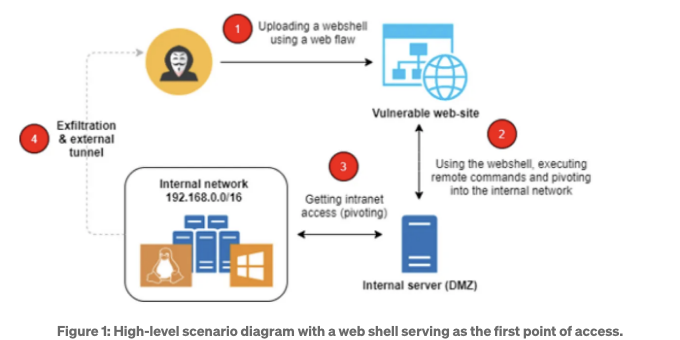
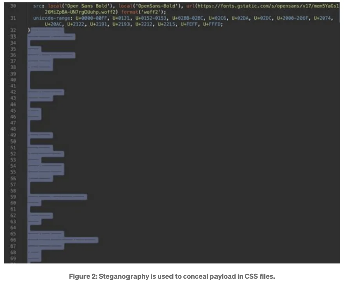
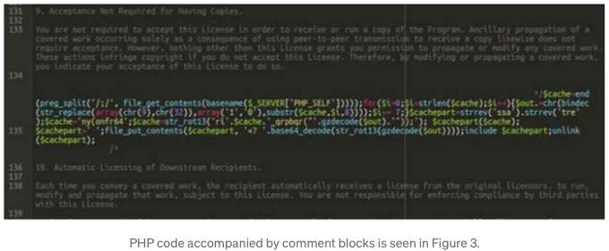
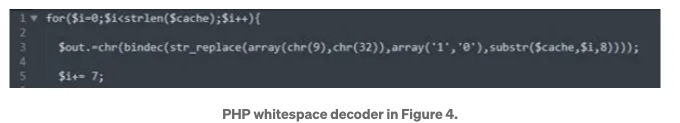
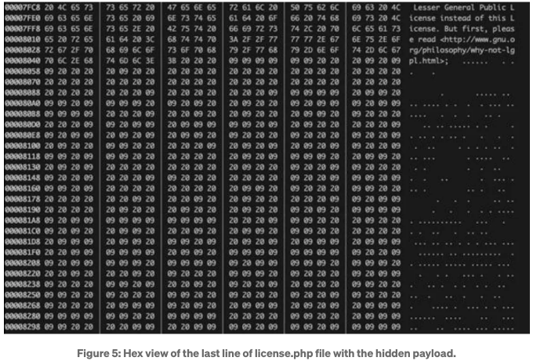
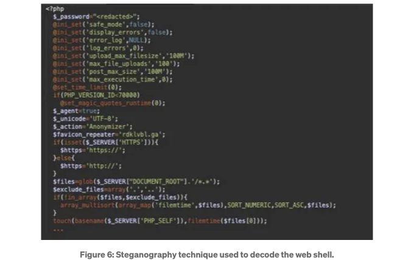

PHP Obfuscator은 PHP 스크립트의 소스 코드를 어렵게 읽을 수 있도록 만들어 사람들이 그 의미를 이해하기 어렵게 만드는 온라인 프로그램입니다.

PHP 스크립트를 공개할 때, 우리는 종종 다른 사람들이 스크립트의 목적을 빠르게 파악하거나 코드를 자신의 스크립트에 사용하기 어렵게 하는 것을 원합니다.

PHP Obfuscator는 변수, 인터페이스, 클래스 및 함수의 이름을 무작위한 글자와 숫자로 변경하여 이를 수행합니다. 소스 코드에서 주석, 빈 줄 및 공백이 제거됩니다. 또한 문자열은 인코딩될 수 있으며 이는 "here docs" 블록을 제외한 스크립트 출력에 대한 직접적인 변경을 방지하는 데 도움이 될 수 있습니다.

PHP 서버는 다른 소프트웨어가 서버에 설치되지 않은 상태에서도 스크립트를 실행할 수 있어야 하므로 PHP Obfuscator는 소스 코드를 완전히 난독화할 수 없습니다.

<!-- ui-log 수평형 -->
<ins class="adsbygoogle"
  style="display:block"
  data-ad-client="ca-pub-4877378276818686"
  data-ad-slot="9743150776"
  data-ad-format="auto"
  data-full-width-responsive="true"></ins>
<component is="script">
(adsbygoogle = window.adsbygoogle || []).push({});
</component>

https://www.gaijin.at/en/tools/php-obfuscato

도둑들이 서버 측과 통신하고 원격으로 명령을 보내는 악성 진입 지점인 웹 셸이라는 것이 있습니다. 이러한 웹 기반 셸과 같은 인터페이스는 최근 몇 년간 진화하여 더 은밀해져 내부 보안 조치를 우회할 수 있게 되었습니다.

그들의 길을 피하기.
이 백도어의 목적은 웹 사이트나 시스템에 대한 추가 액세스를 제공하는 것입니다. 악성 코드가 대상 시스템에서 실행될 때, "문을 열 수 있는" 능력이 생기며 공격자가 액세스하고 표준 인증 절차를 초과할 수 있게 해줍니다.

<!-- ui-log 수평형 -->
<ins class="adsbygoogle"
  style="display:block"
  data-ad-client="ca-pub-4877378276818686"
  data-ad-slot="9743150776"
  data-ad-format="auto"
  data-full-width-responsive="true"></ins>
<component is="script">
(adsbygoogle = window.adsbygoogle || []).push({});
</component>

PHP 웹 쉘을 검토해 보도록 하겠습니다. 해당 웹 쉘은 스테가노그래피를 사용하여 페이로드를 감지하기 어렵고 오랜 기간 동안 지속되게 만듭니다. 사용될 수 있는 다른 종류의 웹 쉘도 있지만, 모두 목표 시스템의 특성에 따라 다릅니다.

위에서 볼 수 있듯이, 도둑들은 잘 알려진 취약점을 이용하여 악성 코드를 원격 웹 서버에 업로드하여 코드 실행을 얻었습니다. 그 이후로, 내부 네트워크로 진입하여 내부 문을 열고 내부 자산을 노출시킬 수 있습니다. 서버 파일 시스템에서 읽고 쓰기, 데이터 업로드 및 다운로드도 가능합니다.

스테가노그래피를 이용하여 후면 입구를 숨기는 것이죠.

<!-- ui-log 수평형 -->
<ins class="adsbygoogle"
  style="display:block"
  data-ad-client="ca-pub-4877378276818686"
  data-ad-slot="9743150776"
  data-ad-format="auto"
  data-full-width-responsive="true"></ins>
<component is="script">
(adsbygoogle = window.adsbygoogle || []).push({});
</component>

2021년 2월에 Sucuri Team 연구원들이 CSS 파일을 이용하는 PHP 웹 쉘 유형을 발견했습니다. 그들은 보이지 않는 탭 (0x09), 공백 (0x20), 줄 바꿈 (0x0A) 문자를 결합한 56,964개의 seemingly empty lines를 발견했습니다.

해당 라인들은 이진 형식으로 변환되어 실행될 수 있는 JavaScript 코드 구성 요소를 형성합니다.

조사 과정에서, license.php라는 파일이 연구원의 주의를 끈 이유는 그의 분석 중 발견된 이상한 코드 블록 때문입니다. 상세히 말하자면, 라이선스 텍스트가 여러 줄의 PHP 주석 안에 배치되어 있습니다. 그럼에도 불구하고 134번째 줄에서 PHP 코드와 주석 사이에 간격이 있습니다.

<!-- ui-log 수평형 -->
<ins class="adsbygoogle"
  style="display:block"
  data-ad-client="ca-pub-4877378276818686"
  data-ad-slot="9743150776"
  data-ad-format="auto"
  data-full-width-responsive="true"></ins>
<component is="script">
(adsbygoogle = window.adsbygoogle || []).push({});
</component>

연구원의 조사 중에 발견된 특이한 코드 조각은 조사 도중에 license.php라는 파일에 주목하게 했습니다. 라이선스 용어는 여러 줄의 PHP 주석 안에 구체적으로 삽입되어 있습니다. 그러나 134번째 줄에서 PHP 코드 주석 사이에 공백이 있습니다.

이는 범죄자들이 포착을 회피하기 위해 사용하는 새로운 방법은 아닙니다. PHP 코드는 위험할지라도 코드를 실행하거나 웹 셸 페이로드를 제공하는 것을 목적으로하지는 않습니다.

공백 디코더

<!-- ui-log 수평형 -->
<ins class="adsbygoogle"
  style="display:block"
  data-ad-client="ca-pub-4877378276818686"
  data-ad-slot="9743150776"
  data-ad-format="auto"
  data-full-width-responsive="true"></ins>
<component is="script">
(adsbygoogle = window.adsbygoogle || []).push({});
</component>

아래 표시된 코드의 작은 부분을 분리하여 이 코드가 어떻게 작동하는지 더 잘 이해하기로 했습니다.

간단히 말하자면, 이 코드는 파일을 여덟 글자씩 읽어서 탭( ASCII 코드 9)과 공백(ASCII 코드 32)을 0으로 변경합니다. 이 결과를 chr() 메서드를 사용하여 10진 정수와 문자로 변환합니다. 이 방법을 사용하면 모든 공백 옥텟이 볼 수 있는 문자열로 변환됩니다. 마지막 페이로드가 실행되고 "base64_decode(str_rot13(gzdecode(...)" 함수를 사용하여 전체 디코드가 수행됩니다.

다른 방법은 " "(공백 하나만 있는 파일명)으로 백업 파일을 만들어 실행하는 것입니다. 이 방법 또한 원래의 PHP 로더 코드에 포함되어 있습니다. 이 방법을 사용하면 파일명을 덜 감지 가능하고 파일 목록에서 덜 주목할 수 있게 만듭니다. 실행이 끝나면 파일이 삭제됩니다.

<!-- ui-log 수평형 -->
<ins class="adsbygoogle"
  style="display:block"
  data-ad-client="ca-pub-4877378276818686"
  data-ad-slot="9743150776"
  data-ad-format="auto"
  data-full-width-responsive="true"></ins>
<component is="script">
(adsbygoogle = window.adsbygoogle || []).push({});
</component>

라이센스.php 파일 끝에 있는 마지막 payload 또는 공백은 Figure 4에서 볼 수 있습니다.

전체 페이로드는 이전에 설명한대로 스크립트를 실행한 후 볼 수 있으며, 이 과정에서 공백이 실행 가능한 PHP 코드인 PHP 웹 쉘로 변환되었습니다.

<!-- ui-log 수평형 -->
<ins class="adsbygoogle"
  style="display:block"
  data-ad-client="ca-pub-4877378276818686"
  data-ad-slot="9743150776"
  data-ad-format="auto"
  data-full-width-responsive="true"></ins>
<component is="script">
(adsbygoogle = window.adsbygoogle || []).push({});
</component>

여기서 조금의 스테가노그래피를 사용하여, 웹 셸이 서버 측에서 실행되어 해커가 원격 서버에 액세스하고 임의의 명령을 실행하며 권한을 높이는 등의 작업을 수행할 수 있게 됩니다.

여백 난독화 처리

코드는 종종 난독화된 방법을 사용하여 숨겨지며, 이는 분석과 감지를 더 어렵게 만들 수 있습니다. 많이 사용되는 난독화 기술이 존재하며, 도둑들은 장기적인 페이로드로 검출을 회피하기 위한 신기한 방법을 항상 찾고 있습니다. 스테가노그래피를 사용하여, 범죄자들은

악의적인 코드를 인간 검사에서도 숨길 수 있습니다. 왜냐하면, 대상 파일이 표준 텍스트 편집기에서 열릴 때, 악성 코드는 공백 몇 줄뿐인 것으로 나타납니다.

<!-- ui-log 수평형 -->
<ins class="adsbygoogle"
  style="display:block"
  data-ad-client="ca-pub-4877378276818686"
  data-ad-slot="9743150776"
  data-ad-format="auto"
  data-full-width-responsive="true"></ins>
<component is="script">
(adsbygoogle = window.adsbygoogle || []).push({});
</component>

따라서 이러한 유형의 공격을 막기 위해 몇 가지 조치를 취할 수 있습니다:
- 플러그인 및 웹 서버 취약점에 대한 신속한 수정
- 제3자 취약점을 피하기 위해 더 적은 플러그인 사용

- 네트워크 분할은 측면 이동을 막습니다
- 파일 무결성 모니터링
- 악성 코드 스캔 및 엔드포인트 보안 소프트웨어
- 서버 구성 검토 및 강화

PHP 백도어를 합법적인 코드 래퍼를 사용하여 난독화하기(quttera.com)

PHP 팁 | 해킹트릭스 | 해킹트릭스

<!-- ui-log 수평형 -->
<ins class="adsbygoogle"
  style="display:block"
  data-ad-client="ca-pub-4877378276818686"
  data-ad-slot="9743150776"
  data-ad-format="auto"
  data-full-width-responsive="true"></ins>
<component is="script">
(adsbygoogle = window.adsbygoogle || []).push({});
</component>

PHP로 암호화된 파일을 해독하는 방법 | Acro Commerce