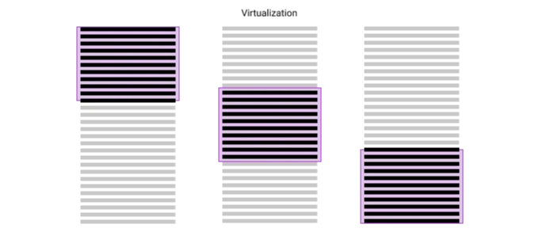

주로 두 가지의 목적은 더 많은 콘텐츠를 로드하는 것입니다.

웹 페이지에 제품 목록이나 소셜 미디어 피드 등 대량의 데이터를 효과적으로 관리하기 위해서는 두 가지 일반적인 접근 방식이 있습니다. 페이지네이션과 가상화인데, 이 둘은 데이터 처리 방식과 사용자 경험(UX)에서 차이가 있습니다.

# 페이지네이션

<!-- ui-log 수평형 -->
<ins class="adsbygoogle"
  style="display:block"
  data-ad-client="ca-pub-4877378276818686"
  data-ad-slot="9743150776"
  data-ad-format="auto"
  data-full-width-responsive="true"></ins>
<component is="script">
(adsbygoogle = window.adsbygoogle || []).push({});
</component>

페이지네이션은 데이터를 더 작고 관리하기 쉬운 청크로 나눕니다. 사용자는 이 "페이지"를 버튼이나 숫자를 통해 탐색하며, 일반적으로 각 페이지에서 일정 수의 항목을 볼 수 있습니다. 다양한 페이지네이션 스타일은 다음과 같습니다:

- Pages: 페이지당 일정 수의 항목을 표시하며, 사용자는 탐색을 위해 "다음" 또는 "이전"을 클릭해야 합니다.
- Infinite Scroll: 사용자가 스크롤을 하면 콘텐츠가 자동으로 로드되어 끝이 없는 목록처럼 보입니다.
- Load More Button: 사용자가 추가 데이터를 가져오기 위해 버튼을 클릭하면, 새로운 콘텐츠를 로드하는데 더 많은 제어를 제공합니다.

페이지네이션의 단점: DOM 과부하

페이지네이션의 일반적인 문제는 새 데이터를 기존 목록에 추가할 때, DOM 노드(웹 페이지의 요소)의 수가 증가한다는 것입니다. 이는 브라우저가 성장하는 요소 수를 관리하기 어려워하여 느린 스크롤링과 응답성과 같은 성능 문제를 일으킬 수 있습니다.

<!-- ui-log 수평형 -->
<ins class="adsbygoogle"
  style="display:block"
  data-ad-client="ca-pub-4877378276818686"
  data-ad-slot="9743150776"
  data-ad-format="auto"
  data-full-width-responsive="true"></ins>
<component is="script">
(adsbygoogle = window.adsbygoogle || []).push({});
</component>

# 가상화

가상화는 다른 방식으로 이 문제를 해결합니다:

- 스마트 렌더링: 뷰포트(사용자가 화면에서 볼 수 있는 영역)에 현재 표시되는 항목에 대한 DOM 노드만 생성하므로 다운로드된 데이터양과 관계없이 뷰포트에 보이는 항목에만 노드를 생성합니다.
- 노드 재활용: 사용자가 스크롤하면, 가상 목록은 새롭게 표시되는 항목을 위해 기존 DOM 노드를 재사용하여 DOM 조작을 최소화합니다.

<!-- ui-log 수평형 -->
<ins class="adsbygoogle"
  style="display:block"
  data-ad-client="ca-pub-4877378276818686"
  data-ad-slot="9743150776"
  data-ad-format="auto"
  data-full-width-responsive="true"></ins>
<component is="script">
(adsbygoogle = window.adsbygoogle || []).push({});
</component>

DOM 크기를 작게 유지하여 매우 큰 데이터 세트에 대해 원활한 스크롤 성능을 보장합니다.

가상화를 위해 react-window 라이브러리를 사용할 수 있습니다. 이 라이브러리는 Brian Vaughn이 리라이트한 react-virtualized 라이브러리입니다.