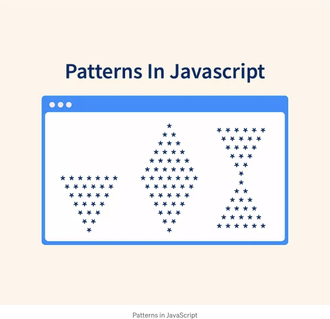

# 👉 개요

패턴은 자체를 반복하는 일련의 시퀀스입니다. JavaScript에서의 패턴은 루프와 중첩된 루프에 대한 이해를 높이기 위해 필수적입니다.

JavaScript에서 패턴을 연습하는 프로그래머들은 그렇지 않은 다른 프로그래머들보다 프로그램의 흐름을 더 빨리 생각하곤 합니다.

<!-- ui-log 수평형 -->
<ins class="adsbygoogle"
  style="display:block"
  data-ad-client="ca-pub-4877378276818686"
  data-ad-slot="9743150776"
  data-ad-format="auto"
  data-full-width-responsive="true"></ins>
<component is="script">
(adsbygoogle = window.adsbygoogle || []).push({});
</component>

# 👉 소개

패턴은 자신을 반복하는 일련의 시퀀스입니다. 패턴은 JavaScript 기초를 배울 때 가장 흔히 실습되는 프로그램입니다. 패턴은 논리적 사고를 향상시키며 연습을 통해 프로그램의 실행 흐름(특히 루프)을 빠르게 이해하는 데 도움을 줍니다.

패턴은 쉽고 시간 낭비일 거라고 생각하여 이 단계를 건너뛰는 사람들이 많지만, 패턴은 문제 해결에 대해 더 빠르게 생각하고 해결책에 도달할 수 있도록 큰 도움이 될 수 있습니다.

# 👉 왜 패턴을 사용해야 하나요?

<!-- ui-log 수평형 -->
<ins class="adsbygoogle"
  style="display:block"
  data-ad-client="ca-pub-4877378276818686"
  data-ad-slot="9743150776"
  data-ad-format="auto"
  data-full-width-responsive="true"></ins>
<component is="script">
(adsbygoogle = window.adsbygoogle || []).push({});
</component>

대부분의 경우 JavaScript를 사용하여 애플리케이션을 개발할 때 패턴을 직접 사용하지는 않습니다. 그래도 JavaScript의 고급 주제로 넘어가기 전에 패턴을 연습하는 것이 좋습니다. 이렇게하면 기본 프로그래머가 프로그램의 흐름과 루프 작동 방식에 대해 충분히 알고 있게 되어 JavaScript의 더 높은 개념으로 넘어가기 전에 도움이 됩니다.

JavaScript에서 패턴을 잘 다루는 것은 문제 해결 능력과 논리적 사고력을 향상시키는 데 도움이 됩니다.

# 👉 JavaScript의 패턴

숫자, 별그리기, 문자 패턴의 다양한 (19) 예제를 살펴보고 깊이에 대해 이해해 봅시다.

<!-- ui-log 수평형 -->
<ins class="adsbygoogle"
  style="display:block"
  data-ad-client="ca-pub-4877378276818686"
  data-ad-slot="9743150776"
  data-ad-format="auto"
  data-full-width-responsive="true"></ins>
<component is="script">
(adsbygoogle = window.adsbygoogle || []).push({});
</component>

- 내부 루프와 외부 루프가 있습니다.
- 대부분의 경우 외부 루프는 행의 개수를 결정합니다.
- 내부 루프는 행 번호를 활용하여 패턴을 점진적으로 형성합니다(대부분의 경우).

참고: 이는 매우 기본적인 구조이며, 보다 복잡한 패턴을 형성하기 위해 더 확장될 수 있습니다.

일련의 숫자가 배열되어 패턴이나 특정 모양(피라미드, 삼각형 등)을 형성할 때, 숫자 패턴이 형성됩니다. 루프 및 중첩 루프를 잘 다루기 위해 숫자 패턴을 연습해야 합니다.

숫자 패턴을 깊이 이해하기 위해 몇 가지 예제를 살펴보겠습니다.

<!-- ui-log 수평형 -->
<ins class="adsbygoogle"
  style="display:block"
  data-ad-client="ca-pub-4877378276818686"
  data-ad-slot="9743150776"
  data-ad-format="auto"
  data-full-width-responsive="true"></ins>
<component is="script">
(adsbygoogle = window.adsbygoogle || []).push({});
</component>

1
삼각형 패턴 — I

```js
1
1 2
1 2 3
1 2 3 4
1 2 3 4 5
```

접근 방식:

- 행 번호만큼 루프를 실행해야 합니다. 여기 예시에서는 5행에 대해 루프를 실행해야 합니다. 이것이 외부 루프를 형성합니다.
- 각 행에서 n개의 숫자를 출력하는 루프를 실행해야 합니다. 여기서 n은 행 번호입니다. 이것이 내부 루프를 형성합니다.
- 위 예시에서 5행이 있습니다. 5행의 경우, 1부터 5까지의 외부 루프가 필요합니다 (즉, 행 수).
- 각 행에 대해 num = 1부터 num = n까지 숫자를 출력해야 합니다.
- 예시: 5행의 경우, n = 5입니다. 내부 루프는 num = 1부터 num = 5까지 실행됩니다. 그래서 5행은 다음과 같습니다: 1 2 3 4 5

<!-- ui-log 수평형 -->
<ins class="adsbygoogle"
  style="display:block"
  data-ad-client="ca-pub-4877378276818686"
  data-ad-slot="9743150776"
  data-ad-format="auto"
  data-full-width-responsive="true"></ins>
<component is="script">
(adsbygoogle = window.adsbygoogle || []).push({});
</component>

코드:

```js
let rows = 5;

// pattern 변수에 최종 패턴을 문자열 형식으로 저장
let pattern = "";

// 바깥쪽 루프는 `rows` 번만큼 실행됨
for (let n = 1; n <= rows; n++) {
   // 안쪽 루프는 n만큼 실행됨
   for (let num = 1; num <= n; num++) {
      pattern += num;
   }

   // 각 라인의 내용 뒤에 새 줄 문자를 추가
   pattern += "\n";
}
console.log(pattern);
```

코드 설명:

- 라인 : 1
행의 수를 정의합니다. 만약 패턴이 10개 행을 가지고 있길 원한다면, rows의 값을 10으로 변경하면 됩니다. 아래와 같은 출력을 얻을 수 있습니다:

<!-- ui-log 수평형 -->
<ins class="adsbygoogle"
  style="display:block"
  data-ad-client="ca-pub-4877378276818686"
  data-ad-slot="9743150776"
  data-ad-format="auto"
  data-full-width-responsive="true"></ins>
<component is="script">
(adsbygoogle = window.adsbygoogle || []).push({});
</component>

```js
1
12
123
1234
12345
123456
1234567
12345678
123456789
12345678910
```

- Line : 4
초기에 우리의 패턴은 빈 문자열입니다. 이 문자열에 숫자를 추가하여 중첩된 루프 내부에서 최종 숫자 패턴을 형성합니다.
- Line : 7–15
바깥쪽 루프가 여기에 있습니다. 이것은 n = 1부터 n = 행 수까지 실행됩니다.
- Line : 9–11
안쪽 루프가 여기에 포함됩니다. 각 행마다 1부터 해당 행 번호까지 숫자가 인쇄됩니다.
- Line: 16
마지막으로 구성된 패턴이 콘솔에 인쇄됩니다.

2
삼각형 패턴 — II

```js
1
2 2
3 3 3
4 4 4 4
5 5 5 5 5
```

<!-- ui-log 수평형 -->
<ins class="adsbygoogle"
  style="display:block"
  data-ad-client="ca-pub-4877378276818686"
  data-ad-slot="9743150776"
  data-ad-format="auto"
  data-full-width-responsive="true"></ins>
<component is="script">
(adsbygoogle = window.adsbygoogle || []).push({});
</component>

접근 방법:

- 행 번호만큼의 루프를 실행해야 함을 알 수 있습니다. 이 예제에서는 5개의 행에 대해 루프를 실행해야 합니다. 이것이 외부 룹을 형성합니다.
- 각 행에 n개의 숫자를 출력하는 루프를 실행해야 합니다. 여기서 n은 행 번호입니다. 이것이 내부 루프를 형성합니다.
- 위의 예에서, 5개의 행이 있습니다. 5개의 행에 대해, n = 1에서 n = 5(즉, 행 수)까지 외부 루프가 필요합니다. 각 행에 대해 행 번호 n번만큼 출력해야 하며, 여기서 n은 행 번호입니다.
- 예시: 5번째 행의 경우, n = 5입니다. 내부 루프는 num = 1에서 num = 5까지 실행되며 행 번호(즉, 5)를 출력합니다. 5번째 행은 다음과 같습니다: 5 5 5 5 5.

코드:

```js
let rows = 5;

// pattern 변수는 최종 패턴을 문자열 형식으로 저장합니다.
let pattern = "";

// 외부 루프는 'rows' 횟수만큼 실행됩니다.
for (let n = 1; n <= rows; n++) {
   for (let num = 1; num <= n; num++) {
      pattern += n;
   }

   // 각 라인 내용 뒤에 개행 문자를 추가합니다.
   pattern += "\n";
}
console.log(pattern);
```

<!-- ui-log 수평형 -->
<ins class="adsbygoogle"
  style="display:block"
  data-ad-client="ca-pub-4877378276818686"
  data-ad-slot="9743150776"
  data-ad-format="auto"
  data-full-width-responsive="true"></ins>
<component is="script">
(adsbygoogle = window.adsbygoogle || []).push({});
</component>

3
삼각형 패턴 — III

```js
1
2 3
4 5 6
7 8 9 10
```

접근 방법:

- 우리는 행 번호 만큼 반복할 필요가 있다는 것을 볼 수 있습니다. 여기 예제에서는 4개의 행에 대해 반복해야 합니다. 이것이 외부 루프를 형성합니다.
- 우리는 각 행에서 n개의 숫자를 출력할 때마다 숫자 n을 출력하기 위해 루프를 돌아야 합니다. 이것이 내부 루프를 형성합니다.
- 위의 예에서 5개의 행이 있습니다. 5개의 행에 대해서는 n = 1부터 n = 5로 (즉, 행의 수) 이동하는 외부 루프가 필요합니다. 각 행마다 시리즈의 다음 n개의 숫자를 출력해야 합니다.
- 무슨 시리즈를 따르고 있나요? 첫 n개의 숫자 시리즈이며, 처음에 변수를 선언하고 계속 증가시킵니다.
- 예 : 4행의 경우, n = 4입니다. 내부 루프는 num = 1부터 num = 4까지 이동합니다. 시리즈의 다음 4개의 숫자를 출력해야 합니다. 3번째 행에서 마지막으로 출력된 숫자는 6이었습니다. 따라서 5번째 행은: 7 8 9 10입니다.

<!-- ui-log 수평형 -->
<ins class="adsbygoogle"
  style="display:block"
  data-ad-client="ca-pub-4877378276818686"
  data-ad-slot="9743150776"
  data-ad-format="auto"
  data-full-width-responsive="true"></ins>
<component is="script">
(adsbygoogle = window.adsbygoogle || []).push({});
</component>

코드:

```js
let rows = 4;

// 변수에는 패턴의 다음 요소가 들어 있습니다.
let variable = 1;

// 패턴 변수에는 최종 패턴이 문자열 형식으로 포함됩니다.
let pattern = "";

// 외부 루프는 `rows` 횟수만큼 실행됩니다.
for (let n = 1; n <= rows; n++) {
   for (let num = 1; num <= n; num++) {
      pattern += variable+" ";
      variable++;
   }
   pattern += "\n";
}
console.log(pattern);
```

4
역삼각형 — I

```js
12345
1234
123
12
1
```

<!-- ui-log 수평형 -->
<ins class="adsbygoogle"
  style="display:block"
  data-ad-client="ca-pub-4877378276818686"
  data-ad-slot="9743150776"
  data-ad-format="auto"
  data-full-width-responsive="true"></ins>
<component is="script">
(adsbygoogle = window.adsbygoogle || []).push({});
</component>

접근 방법:

- 우리는 행 번호만큼 반복해야 한다는 것을 알 수 있습니다. 여기 예제에서는 5개의 행에 대해 반복해야 합니다. 이것이 외부 루프를 형성합니다.
- 각 행에서는 행 번호인 n을 사용하여 6-n 개의 숫자를 출력하는 루프를 실행해야 합니다. 이것이 내부 루프를 형성합니다.
- 위 예제에서는 5개의 행이 있습니다. 5개의 행에 대해서는 n = 1부터 n = 5(행 수)인 외부 룹이 필요합니다. 각 행에 대해 순서대로 6-n 개의 숫자를 출력해야 합니다.
- 예: 3번째 행의 경우, n = 3입니다. 내부 루프는 num = 1부터 num = 6-3 = 3까지 진행됩니다. (6-n) 즉 (6-3) 3개의 숫자를 순서대로 출력해야 합니다. 따라서 3번째 행은 다음과 같습니다: 1 2 3.

코드:

```js
let rows = 5;

// pattern 변수는 최종 패턴을 문자열 형식으로 저장합니다.
let pattern = "";

// 외부 룹은 `rows` 번 반복됩니다.
for (let n = 1; n <= rows; n++) {
   for (let num = 1; num <= 6 - n; num++) {
      pattern += num;
   }
   pattern += "\n";
}
console.log(pattern);
```

<!-- ui-log 수평형 -->
<ins class="adsbygoogle"
  style="display:block"
  data-ad-client="ca-pub-4877378276818686"
  data-ad-slot="9743150776"
  data-ad-format="auto"
  data-full-width-responsive="true"></ins>
<component is="script">
(adsbygoogle = window.adsbygoogle || []).push({});
</component>

5
번호 피라미드 패턴 — I

```js
    1
   123
  12345
 1234567
123456789
```

접근 방법:

- 우리는 n 번의 행을 위해 루프를 실행해야 한다는 것을 알 수 있습니다. 여기 예시에서는 5행의 루프를 실행해야 합니다. 이것이 외부 루프를 형성합니다.
- 각 행에서는 각 행 번호인 n에 대해 2∗n−1 개의 숫자를 출력해야 합니다. 이것이 내부 루프를 형성합니다.
- 각 행에는 2 부분이 있습니다:
(i). 시작하는 공백.
(ii). 순서대로 숫자들.
만약 n이 행 번호이고, row가 전체 행 수인 경우, 공백: 각 행의 공백 수: (row−n)(row−n), 숫자: 1부터 (2∗n−1)(2∗n−1)까지.
- 위 예시에서 5개의 행이 있습니다. 5행을 위해, n = 1부터 n = 5(즉, 행 수)까지 실행되는 외부 루프가 필요합니다. 각 행마다 공백과 숫자를 출력해야 합니다.
- 예시: 3번째 행의 경우, n = 3입니다. 내부 루프는 num = 1부터 num = 3까지 실행됩니다. 우리는 (n−row)(n−row) 즉, (5−3)(5−3) = 22개의 공백, 그리고 11부터 2∗3−1인 55까지의 숫자를 출력해야 합니다. 따라서, 우리의 3번째 행은 다음과 같습니다: __12345. {여기서 공백은 _로 표시됩니다}

<!-- ui-log 수평형 -->
<ins class="adsbygoogle"
  style="display:block"
  data-ad-client="ca-pub-4877378276818686"
  data-ad-slot="9743150776"
  data-ad-format="auto"
  data-full-width-responsive="true"></ins>
<component is="script">
(adsbygoogle = window.adsbygoogle || []).push({});
</component>

```js
let rows = 5;

// pattern 변수는 최종 패턴을 문자열 형식으로 저장합니다.
let pattern = "";

// 외부 루프는 `rows`번 실행됩니다.
for (let n = 1; n <= rows; n++) {
   // 내부 루프 - I -> 공백 생성
   for (let space = 1; space <= rows - n; space++) {
      pattern += " ";
   }

   // 내부 루프 - II -> 숫자 생성
   for (let num = 1; num <= 2 * n - 1; num++) {
      pattern += num;
   }

   pattern += "\n";
}
console.log(pattern);
```

6
숫자 피라미드 패턴 — II

```js
  1
 234
56789
```

<!-- ui-log 수평형 -->
<ins class="adsbygoogle"
  style="display:block"
  data-ad-client="ca-pub-4877378276818686"
  data-ad-slot="9743150776"
  data-ad-format="auto"
  data-full-width-responsive="true"></ins>
<component is="script">
(adsbygoogle = window.adsbygoogle || []).push({});
</component>

- 우리는 특정 횟수만큼 루프를 실행해야 한다는 것을 알 수 있습니다. 이 예시에서는 3개의 행에 대해 루프를 실행해야 합니다. 이것이 외부 루프를 형성합니다.
- 각 행마다 n개의 숫자를 출력하기 위해 루프를 실행해야 합니다. 여기서 n은 행 번호입니다. 이것이 내부 루프를 형성합니다.
- 위 예시에서는 3개의 행이 있습니다. 3개의 행에 대해 외부 루프가 n = 1부터 n = 3까지 실행되어야 합니다 (즉, 행 수). 각 행마다 시리즈의 다음 n개 숫자를 출력해야 합니다.
- 어떤 시리즈가 따르는 것일까요? 첫 번째 n개의 숫자들의 시리즈입니다. 시작할 때 변수를 선언하고 계속 증가시킵니다.
- 각 행에는 2가지 구성요소가 있습니다:
(i). 시작하는 공백.
(ii). 순서대로 숫자들.
만약 n이 행 번호이고, rows가 전체 행 수인 경우, 공백 : 각 행의 공백 수 : (rows−n)(rows−n) 개 숫자 : 각 행의 숫자 수 : (2∗n−1)(2∗n−1).
- 예시: 2번째 행의 경우, n = 2입니다. 내부 루프는 space = 1부터 space =3−2=1=3−2=1까지, 그리고 num = 1부터 num = 2∗2−1=32∗2−1=3까지 실행됩니다. 이 시리즈의 다음 3개 숫자를 출력해야 합니다. 첫 번째 행에서 마지막으로 출력된 숫자는 1이었습니다. 따라서 5번째 행은 다음과 같습니다: 2 3 4.

코드:

```js
let rows = 3;
let variable = 1;
let pattern = "";

// 외부 루프는 'rows' 번만큼 실행됨
for (let n = 1; n <= rows; n++) {
   // 내부 루프 - I -> 공백을 위해
   for (let space = 1; space <= rows - n; space++) {
      pattern += " ";
   }

   // 내부 루프 - II -> 숫자들의 시리즈용
   for (let num = 1; num <= 2 * n - 1; num++) {
      pattern += variable;
      variable++;
   }

   pattern += "\n";
}
console.log(pattern);
```

별(*)의 시리즈가 특정 모양이나 패턴 (피라미드, 삼각형 등)을 만들기 위해 배열되면, 별 패턴이 형성됩니다. 루프와 중첩 루프에 능숙해지기 위해 별 패턴을 연습해보세요.

<!-- ui-log 수평형 -->
<ins class="adsbygoogle"
  style="display:block"
  data-ad-client="ca-pub-4877378276818686"
  data-ad-slot="9743150776"
  data-ad-format="auto"
  data-full-width-responsive="true"></ins>
<component is="script">
(adsbygoogle = window.adsbygoogle || []).push({});
</component>

우리는 별 패턴을 깊이있게 이해하기 위해 몇 가지 예를 살펴볼 거에요.

1
사각형 별 패턴 - I

```js
*****
*****
*****
*****
*****
```

접근 방법:

<!-- ui-log 수평형 -->
<ins class="adsbygoogle"
  style="display:block"
  data-ad-client="ca-pub-4877378276818686"
  data-ad-slot="9743150776"
  data-ad-format="auto"
  data-full-width-responsive="true"></ins>
<component is="script">
(adsbygoogle = window.adsbygoogle || []).push({});
</component>

- 우리는 행 번호만큼 반복해야한다는 것을 알 수 있어요. 예시에서는 5개의 행에 대해 루프를 실행해야 합니다. 이것이 외부 룹을 형성합니다.
- 각 행에 5개의 별을 출력하기 위해 룹을 실행해야 합니다. 이것이 내부 룹을 형성합니다.

코드:

```js
let rows = 5;

// pattern 변수는 최종 패턴을 문자열 형식으로 저장합니다.
let pattern = "";

// 외부 룹이 `rows` 번 만큼 실행됩니다.
for (let n = 1; n <= rows; n++) {
   // 별을 출력하기 위한 내부 룹
   for (let num = 1; num <= 5; num++) {
      pattern += "*";
   }
   pattern += "\n";
}
console.log(pattern);
```

2
빈 사각형 별 패턴

<!-- ui-log 수평형 -->
<ins class="adsbygoogle"
  style="display:block"
  data-ad-client="ca-pub-4877378276818686"
  data-ad-slot="9743150776"
  data-ad-format="auto"
  data-full-width-responsive="true"></ins>
<component is="script">
(adsbygoogle = window.adsbygoogle || []).push({});
</component>

```js
*****
*   *
*   *
*   *
*****
```

접근 방법:

- 우리는 행 수만큼 루프를 실행해야 한다. 여기 예제에서는 5개의 행에 대해 루프를 실행해야 한다. 이것이 외부 루프를 형성한다.
- 각 행에서는 시작 별표와 끝 별표를 인쇄하기 위해 루프를 실행해야 한다 (행 번호가 0이 아니거나 마지막 행이 아닌 경우에만 해당). 이것이 내부 루프를 형성한다.

코드:

<!-- ui-log 수평형 -->
<ins class="adsbygoogle"
  style="display:block"
  data-ad-client="ca-pub-4877378276818686"
  data-ad-slot="9743150776"
  data-ad-format="auto"
  data-full-width-responsive="true"></ins>
<component is="script">
(adsbygoogle = window.adsbygoogle || []).push({});
</component>

```js
let rows = 5;

// pattern 변수에 최종으로 저장될 패턴을 문자열 형태로 저장합니다.
let pattern = "";

// 외부 루프는 'rows'번만큼 실행됩니다.
for (let n = 1; n <= rows; n++) {
   for (let num = 1; num <= 5; num++) {
      // 경계 위치일 경우 별표만 출력합니다.
      if (n == 1 || n == rows) pattern += "*";
      else {
         if (num == 1 || num == 5) {
            pattern += "*";
         } else {
            pattern += " ";
         }
      }
   }
   pattern += "\n";
}
console.log(pattern);
```

3
직각 삼각형 패턴

```js
    *
   **
  ***
 ****
*****
```

접근 방식:

<!-- ui-log 수평형 -->
<ins class="adsbygoogle"
  style="display:block"
  data-ad-client="ca-pub-4877378276818686"
  data-ad-slot="9743150776"
  data-ad-format="auto"
  data-full-width-responsive="true"></ins>
<component is="script">
(adsbygoogle = window.adsbygoogle || []).push({});
</component>

- 우리는 행 번호만큼 루프를 실행해야 한다는 것을 알 수 있습니다. 이 예제에서는 5행에 대한 루프를 실행해야 합니다. 이것이 외부 루프를 형성합니다.
- 각 행마다 n 개의 별을 출력하는 루프를 실행해야 합니다. 여기서 n은 행 번호입니다. 이것이 내부 루프를 형성합니다.
- 각 행에는 2가지 구성 요소가 있습니다:
(i). 시작하는 공백.
(ii). 별.
만약 n이 행 번호이고, rows가 전체 행 수라면, 공백: 각 행의 공백 수 (rows-n)(rows-n) 별: 1부터 n까지
- 위 예제에서 우리는 5개의 행이 있습니다. 5개의 행에 대해, n = 1에서 n = 5(즉, 행 수)까지 이동하는 외부 루프가 필요합니다. 각 행마다 공백과 별을 출력해야 합니다.
- 예시: 3번째 행의 경우, n = 3입니다. 내부 루프는 num = 1부터 num = 3까지 실행됩니다. (n-행)(n-행) 즉 (5-3)=2(5-3)=2 공백 뒤에 3개의 별을 출력해야 합니다. 따라서, 3번째 행은 다음과 같습니다: __***. {여기서 공백은 _로 표시됨}

코드:

```js
let rows = 5;

// 패턴 변수는 최종 패턴을 문자열 형식으로 저장합니다
let pattern = "";

// 외부 루프는 `rows` 횟수 만큼 실행됩니다.
for (let n = 1; n <= rows; n++) {
   // 내부 루프 - I -> 공백 출력
   for (let space = 1; space <= rows - n; space++) {
      pattern += " ";
   }

   // 내부 루프 - II -> 별 출력
   for (let num = 1; num <= n; num++) {
      pattern += "*";
   }
   pattern += "\n";
}
console.log(pattern);
```

4
왼쪽 삼각형 패턴

<!-- ui-log 수평형 -->
<ins class="adsbygoogle"
  style="display:block"
  data-ad-client="ca-pub-4877378276818686"
  data-ad-slot="9743150776"
  data-ad-format="auto"
  data-full-width-responsive="true"></ins>
<component is="script">
(adsbygoogle = window.adsbygoogle || []).push({});
</component>

```js
*
**
***
****
*****
```

접근 방법:

- 우리는 행 수만큼 루프를 돌려야 한다는 것을 알 수 있습니다. 여기 예시에서는 5개의 행에 대해 루프를 돌려야 합니다. 이것이 외부 루프를 구성합니다.
- 각 행에서는 각 행의 번호인 n까지의 별을 출력하기 위해 루프를 돌려야 합니다. 이것이 내부 루프를 구성합니다.
- 위의 예시에서 우리는 5개의 행이 있습니다. 5개의 행에 대해서는 n = 1부터 n = 5(즉, 행 수)까지 외부 루프가 필요합니다. 각 행마다 n개의 별을 출력해야 합니다.
- 예제: 3번째 행의 경우, n = 3입니다. 내부 루프는 num = 1부터 num = 3까지입니다. 3개의 별을 출력해야 합니다. 그래서 3번째 행은 다음과 같이 됩니다: ***.

코드:

<!-- ui-log 수평형 -->
<ins class="adsbygoogle"
  style="display:block"
  data-ad-client="ca-pub-4877378276818686"
  data-ad-slot="9743150776"
  data-ad-format="auto"
  data-full-width-responsive="true"></ins>
<component is="script">
(adsbygoogle = window.adsbygoogle || []).push({});
</component>

```js
let rows = 5;

// pattern 변수는 최종 패턴을 문자열 형식으로 저장합니다.
let pattern = "";

// 외부 루프는 `rows` 번만큼 실행됩니다.
for (let n = 1; n <= rows; n++) {
   // 각 행마다 n 번만큼 별표를 출력합니다.
   for (let num = 1; num <= n; num++) {
      pattern += "*";
   }
   pattern += "\n";
}
console.log(pattern);
```

5
삼각형 모양 패턴

```js
    *
   ***
  *****
 *******
*********
```

방법:

<!-- ui-log 수평형 -->
<ins class="adsbygoogle"
  style="display:block"
  data-ad-client="ca-pub-4877378276818686"
  data-ad-slot="9743150776"
  data-ad-format="auto"
  data-full-width-responsive="true"></ins>
<component is="script">
(adsbygoogle = window.adsbygoogle || []).push({});
</component>

- 우리는 행 번호만큼 루프를 실행해야 함을 알 수 있습니다. 예제에서는 5개의 행에 대해 루프를 실행해야 합니다. 이는 외부 룹을 형성합니다.
- 각 행에서는 n개의 별을 출력하기 위해 루프를 실행해야 합니다. 여기서 n은 행 번호입니다. 이는 내부 루프를 형성합니다.
- 각 행에는 2가지 구성 요소가 있습니다:
(i). 시작하는 공백.
(ii). 순서대로 나열된 숫자들.
만약 n이 행 번호이고, row가 전체 행 수인 경우, 공백: 각 행의 공백 수 : (row−n)(row−n) 별: 각 행의 별 수 : (2∗n−1)(2∗n−1)
- 위의 예제에서는 5개의 행이 있습니다. 5개의 행에 대해, n = 1부터 n = 5(즉, 행 수)까지 진행하는 외부 룹이 필요합니다. 각 행마다 공백과 별을 출력해야 합니다.
- 예: 3번째 행의 경우, n = 3입니다. 내부 루프는 num = 1부터 num = 3까지 실행됩니다. (n−row)(n−row) 즉 (5−3)=2(5−3)=2 개의 공백 다음에 (2∗n−1)=6−1=5(2∗n−1)=6−1=5 개의 별을 출력해야 합니다. 그래서, 우리의 3번째 행은 다음과 같이 됩니다: __*****. {여기서 공백은 _로 표시됩니다}

코드:

```js
let rows = 5;

// pattern 변수는 최종 패턴을 문자열 형식으로 저장합니다.
let pattern = "";

// 외부 루프는 `rows` 번 만큼 실행됩니다.
for (let n = 1; n <= rows; n++) {
   // 내부 루프 - I -> 공백을 출력합니다.
   for (let space = 1; space <= rows - n; space++) {
      pattern += " ";
   }

   // 내부 루프 - II -> 별을 출력합니다.
   for (let num = 1; num <= 2 * n - 1; num++) {
      pattern += "*";
   }
   pattern += "\n";
}
console.log(pattern);
```

숫자와 별을 함께 사용한 몇 가지 삼각형 패턴을 살펴봅시다.

<!-- ui-log 수평형 -->
<ins class="adsbygoogle"
  style="display:block"
  data-ad-client="ca-pub-4877378276818686"
  data-ad-slot="9743150776"
  data-ad-format="auto"
  data-full-width-responsive="true"></ins>
<component is="script">
(adsbygoogle = window.adsbygoogle || []).push({});
</component>

1
역 삼각형 — I

```js
54321
5432
543
54
5
```

방법 :

- 우리는 행 번호에 따라 루프를 실행해야 합니다. 여기 예제에서는 5개의 행에 대한 루프를 실행해야 합니다. 이것이 외부 루프를 형성합니다.
- 각 행마다, n이 행 번호인 경우 6-n 숫자를 출력해야 합니다. 이것이 내부 루프를 형성합니다.
- 위 예에서는 5개의 행이 있습니다. 5개의 행에 대해, n = 1부터 n = 5(즉, 행 수)까지 외부 루프가 필요합니다. 각 행마다 n 번의 숫자를 출력해야 하며, 이때 5(행 수)부터 감소합니다.
- 예시 : 3번째 행의 경우, n = 3입니다. 내부 루프는 num = 5부터 num = 3까지 실행됩니다. 5에서 시작하여 내려가며 n, 즉 3개의 숫자를 출력해야 합니다. 따라서 3번째 행은 다음과 같습니다: 5 4 3.

<!-- ui-log 수평형 -->
<ins class="adsbygoogle"
  style="display:block"
  data-ad-client="ca-pub-4877378276818686"
  data-ad-slot="9743150776"
  data-ad-format="auto"
  data-full-width-responsive="true"></ins>
<component is="script">
(adsbygoogle = window.adsbygoogle || []).push({});
</component>

아래는 Markdown 형식으로 표로 변경되어 있습니다.

```js
let rows = 5;

// pattern 변수는 최종 패턴을 문자열 형식으로 저장합니다.
let pattern = "";

// 바깥쪽 루프는 'rows' 번 만큼 실행됩니다.
for (let n = 1; n <= rows; n++) {
   for (let num = rows; num >= n; num--) {
      pattern += num;
   }
   pattern += "\n";
}
console.log(pattern);
```

### Reverse Triangle — II

```js
54321
4321
321
21
1
```

<!-- ui-log 수평형 -->
<ins class="adsbygoogle"
  style="display:block"
  data-ad-client="ca-pub-4877378276818686"
  data-ad-slot="9743150776"
  data-ad-format="auto"
  data-full-width-responsive="true"></ins>
<component is="script">
(adsbygoogle = window.adsbygoogle || []).push({});
</component>

접근 방법:

- 행 번호에 대해 루프를 실행해야 함을 알 수 있습니다. 여기 예시에서는 5개의 행에 대해 루프를 실행해야 합니다. 이것이 외부 루프를 형성합니다.
- 각 행에서는 행 번호인 n에 따라 6-n 개수를 출력하기 위해 루프를 실행해야 합니다. 이것이 내부 루프를 형성합니다.
- 위 예시에서 5개의 행이 있습니다. 5개의 행에 대해, n = 1부터 n = 5(즉, 행 수)까지 외부 루프가 필요합니다. 각 행에 대해 역순으로 6-n 개의 숫자를 출력해야 합니다.
- 예: 3번째 행의 경우, n = 3입니다. 내부 루프는 num = 6-3=3부터 num = 1까지 실행됩니다. (6-n) 숫자를 역순으로 출력해야 합니다. 따라서, 3번째 행은 다음과 같습니다: 3 2 1.

코드:

```js
let rows = 5;

// pattern 변수는 최종 패턴을 문자열 형식으로 저장합니다
let pattern = "";

// 외부 루프는 'rows' 횟수만큼 실행됩니다
for (let n = 1; n <= rows; n++) {
   // 6-n을 출력합니다
   for (let num = 6 - n; num >= 1; num--) {
      pattern += num;
   }
   pattern += "\n";
}
console.log(pattern);
```

<!-- ui-log 수평형 -->
<ins class="adsbygoogle"
  style="display:block"
  data-ad-client="ca-pub-4877378276818686"
  data-ad-slot="9743150776"
  data-ad-format="auto"
  data-full-width-responsive="true"></ins>
<component is="script">
(adsbygoogle = window.adsbygoogle || []).push({});
</component>

3
빈 삼각형 별 패턴

```js
*
**
* *
*  *
*   *
******
```

방법:

- 우리는 행의 수만큼 루프를 실행해야 한다는 것을 알 수 있습니다. 여기 예시에서는 5개의 행에 대해 루프를 실행해야 합니다. 이것이 외부 루프를 형성합니다.
- 각 행에서는 행 번호인 n개의 별표를 인쇄하기 위해 루프를 실행해야 합니다. 이것이 내부 루프를 형성합니다.
- 위 예에서는 5개의 행이 있습니다. 5개의 행에 대해, 행 번호의 no of rows에 해당하는 n = 1부터 n = 5까지 외부 루프가 필요합니다. 각 행에 대해 경계 별표를 출력해야 합니다.
- 현재 위치가 내부 루프의 경계 위치인지 확인해야 합니다. 별표를 추가해야 할 경우 그리고 아닌 경우에는 공백을 추가해야 합니다.
- 예시: 3번째 행의 경우, n = 3입니다. 내부 루프는 num = 1부터 num = 3까지 실행됩니다. 경계 별표를 출력해야 합니다. 그래서 우리의 3번째 행은 다음과 같습니다: *_*. (여기서 공백은 _로 표시됩니다).

<!-- ui-log 수평형 -->
<ins class="adsbygoogle"
  style="display:block"
  data-ad-client="ca-pub-4877378276818686"
  data-ad-slot="9743150776"
  data-ad-format="auto"
  data-full-width-responsive="true"></ins>
<component is="script">
(adsbygoogle = window.adsbygoogle || []).push({});
</component>

코드:

```js
let rows = 5;

// 패턴 변수는 최종 패턴을 문자열 형식으로 저장합니다
let pattern = "";

// 바깥쪽 루프는 `rows` 번만큼 실행됩니다
for (let n = 1; n <= rows; n++) {
   for (let num = 1; num <= n; num++) {
      // 가장자리 별표만 출력
      if (num === 1 || num === n || n === rows) pattern += "*";
      else {
         pattern += " ";
      }
   }
   pattern += "\n";
}
console.log(pattern);
```

#### 4
역삼각형 모양의 별 패턴

```js
*****
****
***
**
*
```

<!-- ui-log 수평형 -->
<ins class="adsbygoogle"
  style="display:block"
  data-ad-client="ca-pub-4877378276818686"
  data-ad-slot="9743150776"
  data-ad-format="auto"
  data-full-width-responsive="true"></ins>
<component is="script">
(adsbygoogle = window.adsbygoogle || []).push({});
</component>

접근 방식:

- 우리는 행 번호에 대한 루프를 실행해야 함을 알 수 있습니다. 여기 예제에서는 5줄에 대한 루프를 실행해야 합니다. 이것이 외부 루프를 형성합니다.
- 각 행마다, 행 번호인 n개의 별표를 출력하는 루프를 실행해야 합니다. 이것이 내부 루프를 형성합니다.
- 위 예제에서는 5개의 행이 있습니다. 5개의 행에 대해, n = 1부터 n = 5까지(즉 행 수)이 실행되는 외부 루프가 필요합니다. 각 행에 대해, 6-n개의 별표를 출력해야 합니다.
- 예시: 3번째 행의 경우, n = 5입니다. 내부 루프는 num = 1부터 num = 6−5=1=6−5=1까지 실행됩니다. 3개의 별표를 출력해야 합니다. 따라서, 우리의 3번째 행은 다음과 같습니다: *.

소스 코드:

```js
let rows = 5;

// pattern 변수는 최종 패턴을 문자열 형식으로 담습니다
let pattern = "";

// 외부 루프는 `rows` 번만큼 실행됩니다
for (let n = 1; n <= rows; n++) {
   for (let num = 1; num <= 6 - n; num++) {
      pattern += "*";
   }
   pattern += "\n";
}
console.log(pattern);
``` 

<!-- ui-log 수평형 -->
<ins class="adsbygoogle"
  style="display:block"
  data-ad-client="ca-pub-4877378276818686"
  data-ad-slot="9743150776"
  data-ad-format="auto"
  data-full-width-responsive="true"></ins>
<component is="script">
(adsbygoogle = window.adsbygoogle || []).push({});
</component>

문자 패턴은 위에서 논의했던 패턴과 동일하며, 별이나 숫자를 사용하는 대신 다양한 모양의 패턴을 형성하기 위해 문자를 사용합니다.

자바스크립트에서 문자 패턴을 연습하기 위한 몇 가지 예제를 살펴봅시다.

1
삼각형 패턴

```js
A
AA
AAA
AAAA
AAAAA
```

<!-- ui-log 수평형 -->
<ins class="adsbygoogle"
  style="display:block"
  data-ad-client="ca-pub-4877378276818686"
  data-ad-slot="9743150776"
  data-ad-format="auto"
  data-full-width-responsive="true"></ins>
<component is="script">
(adsbygoogle = window.adsbygoogle || []).push({});
</component>

접근 방식 :

- 우리는 행의 수만큼 루프를 실행해야 한다는 것을 알 수 있습니다. 여기 예시에서는 5개의 행에 대해 루프를 실행해야 합니다. 이것이 외부 루프를 형성합니다.
- 각 행마다, n이라는 숫자만큼 문자를 출력하는 루프를 실행해야 합니다. 이것이 내부 루프를 형성합니다.
- 위 예시에서는 5개의 행이 있습니다. 5개의 행에 대해, 1부터 5까지 (즉, 행의 수) 가는 외부 루프가 필요합니다. 각 행마다, num = 1부터 num = n까지 문자를 출력해야 합니다.
- 예시 : 5번째 행에 대해, n = 5입니다. 내부 루프는 num = 1부터 num = 5까지 실행됩니다. 따라서 5번째 행은 : AAAAA가 됩니다.

코드:

```js
let rows = 5;
let char = "A";

// pattern 변수는 최종 패턴을 문자열 형식으로 저장합니다.
let pattern = "";

// 바깥쪽 루프는 `rows` 만큼 실행됩니다.
for (let n = 1; n <= rows; n++) {
   // 각 행마다 n번만큼 문자를 출력합니다.
   for (let num = 1; num <= n; num++) {
      pattern += char;
   }
   pattern += "\n";
}
console.log(pattern);
```

<!-- ui-log 수평형 -->
<ins class="adsbygoogle"
  style="display:block"
  data-ad-client="ca-pub-4877378276818686"
  data-ad-slot="9743150776"
  data-ad-format="auto"
  data-full-width-responsive="true"></ins>
<component is="script">
(adsbygoogle = window.adsbygoogle || []).push({});
</component>

2
역삼각형

```js
AAAAA
AAAA
AAA
AA
A
```

접근 방식:

- 우리는 줄 번호만큼 루프를 실행해야 한다는 것을 알 수 있습니다. 여기 예제에서는 5개의 행에 대해 루프를 실행해야 합니다. 이것이 외부 루프를 형성합니다.
- 각 행에서는 n이라는 행 번호에 따라 6-n 문자를 출력하는 루프를 실행해야 합니다. 이것이 내부 루프를 형성합니다.
- 위의 예제에서 5개의 행이 있습니다. 5개의 행에 대해, n=1부터 n=5(즉, 행 수)인 외부 루프가 필요합니다. 각 행에 대해 6−n 문자를 출력해야 합니다.
- 예: 3번째 행의 경우, n=3입니다. 내부 루프는 num=1부터 num=6-3=3까지 이동합니다. (6−n) 즉 (6−3) 3개의 문자를 출력해야 합니다. 따라서, 3번째 행은 다음과 같습니다: AAA.

<!-- ui-log 수평형 -->
<ins class="adsbygoogle"
  style="display:block"
  data-ad-client="ca-pub-4877378276818686"
  data-ad-slot="9743150776"
  data-ad-format="auto"
  data-full-width-responsive="true"></ins>
<component is="script">
(adsbygoogle = window.adsbygoogle || []).push({});
</component>

코드:

```js
let rows = 5;

// pattern 변수는 최종 패턴을 문자열 형식으로 저장합니다.
let pattern = "";
let char = "A";

// 외부 루프는 `rows` 횟수만큼 반복됩니다.
for (let n = 1; n <= rows; n++) {
   for (let num = 1; num <= 6 - n; num++) {
      pattern += char;
   }
   pattern += "\n";
}
console.log(pattern);
```

3
역 삼각형 피라미드 — I

```js
$
$$
$$$
$$$$
%%%%%
%%%%
%%%
%%
%
```

<!-- ui-log 수평형 -->
<ins class="adsbygoogle"
  style="display:block"
  data-ad-client="ca-pub-4877378276818686"
  data-ad-slot="9743150776"
  data-ad-format="auto"
  data-full-width-responsive="true"></ins>
<component is="script">
(adsbygoogle = window.adsbygoogle || []).push({});
</component>

접근 방식:

두 가지 다른 경우가 결합되어이 패턴을 형성합니다. 따라서 상삼각형에는 하나, 역삼각형에는 둘의 루프를 사용해야합니다.

첫 번째 삼각형의 경우:

- 행 번호 만큼 루프를 실행해야 함을 알 수 있습니다. 여기 예제에서는 5개의 행에 대해 루프를 실행해야합니다. 이것이 외부 루프를 형성합니다.
- 각 행에서 n 문자를 인쇄하려면 행 번호가되는 n에 대해 루프를 실행해야합니다. 이것이 내부 루프를 형성합니다.
- 위 예에서 4개의 행이 있습니다. 4개의 행에 대해, n = 1부터 n = 4까지 (즉, 행 수)인 외부 루프가 필요합니다. 각 행에 대해 num = 1에서 num = n까지 문자를 인쇄해야합니다.
- 예: 4번째 행의 경우, n = 4입니다. 내부 루프는 num = 1에서 num = 4까지 실행됩니다. 4번째 행은 $$$$이 됩니다.

<!-- ui-log 수평형 -->
<ins class="adsbygoogle"
  style="display:block"
  data-ad-client="ca-pub-4877378276818686"
  data-ad-slot="9743150776"
  data-ad-format="auto"
  data-full-width-responsive="true"></ins>
<component is="script">
(adsbygoogle = window.adsbygoogle || []).push({});
</component>

두 번째 반대로 된 삼각형을 위해:

- 우리는 행 번호만큼 루프를 실행해야 함을 알 수 있습니다. 여기 예에서는 5개의 행에 대해 루프를 실행해야 합니다. 이것이 외부 루프를 형성합니다.
- 각 행에서는 n이라는 행 번호를 이용하여 6-n 문자를 인쇄하기 위해 루프를 실행해야 합니다. 이것이 내부 루프를 형성합니다.
- 위의 예에서는 5개의 행이 있습니다. 5개의 행에 대해 n=1에서 n=5(즉, 행 수)인 외부 루프가 필요합니다. 각 행에 대해 6−n 문자를 인쇄해야 합니다.
- 예: 3번째 행의 경우, n=3입니다. 내부 루프는 num=1에서 num=6−3=3까지 실행됩니다. (6−n) 즉, (6−3)(6−3) 3개의 문자를 인쇄해야 합니다. 따라서, 3번째 행은 %%%이 됩니다.

코드:

```js
let rows = 5;
let char1 = "$";
let char2 = "%";

// pattern 변수는 최종 패턴을 문자열 형식으로 저장합니다
let pattern = "";

// 외부 루프 - I -> 'rows-1' 번 반복됩니다
// 문자 삼각형을 형성합니다
for (let n = 1; n <= rows - 1; n++) {
   for (let num = 1; num <= n; num++) {
      pattern += char1;
   }
   pattern += "\n";
}

// 외부 루프 - II -> 'rows' 번 반복됩니다
// 반대로 된 문자 삼각형을 형성합니다
for (let n = 1; n <= rows; n++) {
   for (let num = 1; num <= 6 - n; num++) {
      pattern += char2;
   }
   pattern += "\n";
}

console.log(pattern);
```

<!-- ui-log 수평형 -->
<ins class="adsbygoogle"
  style="display:block"
  data-ad-client="ca-pub-4877378276818686"
  data-ad-slot="9743150776"
  data-ad-format="auto"
  data-full-width-responsive="true"></ins>
<component is="script">
(adsbygoogle = window.adsbygoogle || []).push({});
</component>

4
역 삼각형 피라미드 — II

```js
AAAAA
AAAA
AAA
AA
A

B
BB
BBB
BBBB
BBBBB
```

방법 :

두 가지 다른 경우가 이 패턴을 형성하기 위해 결합됩니다. 따라서 우리는 상단 삼각형을 위한 하나, 역 삼각형을 위한 두 번째 루프를 사용해야 합니다.

<!-- ui-log 수평형 -->
<ins class="adsbygoogle"
  style="display:block"
  data-ad-client="ca-pub-4877378276818686"
  data-ad-slot="9743150776"
  data-ad-format="auto"
  data-full-width-responsive="true"></ins>
<component is="script">
(adsbygoogle = window.adsbygoogle || []).push({});
</component>

첫 번째 삼각형에 대해:

- 우리는 행의 번호만큼 루프를 실행해야한다는 것을 알 수 있습니다. 여기 예시에서는 5개의 행에 대해 루프를 실행해야 합니다. 이것이 외부 루프를 형성합니다.
- 각 행에서는 n을 행 번호로 사용하여 6-n 문자를 출력하기 위해 루프를 실행해야 합니다. 이것이 내부 루프를 형성합니다.
- 위 예시에서는 5개의 행이 있습니다. 5개의 행에 대해, 외부 루프가 필요한데 이는 n = 1에서 n = 5 (즉, 행의 수)까지 이동해야합니다. 각 행에 대해 6-n개의 문자를 출력해야합니다.
- 예시 : 3번째 행의 경우, n = 3. 내부 루프는 num = 1에서 num = 6-3=3까지 이동합니다. (6-n) 3개의 문자를 출력해야 합니다. 그래서 우리의 3번째 행은: AAA가 됩니다.

두 번째 역삼각형에 대해:

- 우리는 행의 번호만큼 루프를 실행해야한다는 것을 알 수 있습니다. 여기 예시에서는 5개의 행에 대해 루프를 실행해야 합니다. 이것이 외부 루프를 형성합니다.
- 각 행에서는 n을 행 번호로 사용하여 n 문자를 출력하기 위해 루프를 실행해야 합니다. 이것이 내부 루프를 형성합니다.
- 위 예시에서는 5개의 행이 있습니다. 5개의 행에 대해, 외부 루프가 필요한데 이는 n = 1에서 n = 5 (즉, 행의 수)까지 이동해야합니다. 각 행에 대해 num = 1에서 num = n까지 문자를 출력해야합니다.
- 예시: 4번째 행의 경우, n = 4. 내부 루프는 num = 1에서 num = 4까지 이동합니다. 4번째 행은: AAAA가 됩니다.

<!-- ui-log 수평형 -->
<ins class="adsbygoogle"
  style="display:block"
  data-ad-client="ca-pub-4877378276818686"
  data-ad-slot="9743150776"
  data-ad-format="auto"
  data-full-width-responsive="true"></ins>
<component is="script">
(adsbygoogle = window.adsbygoogle || []).push({});
</component>

```js
let rows = 5;
let char1 = "A";
let char2 = "B";

// pattern 변수는 최종 패턴을 문자열 형식으로 저장합니다.
let pattern = "";

// 바깥쪽 루프 - I -> 'rows' 횟수만큼 실행됩니다.
// 'A'로 문자 역삼각형을 형성합니다.
for (let n = 1; n <= rows; n++) {
   for (let num = 1; num <= 6 - n; num++) {
      pattern += char1;
   }
   pattern += "\n";
}
pattern += "\n";

// 바깥쪽 루프 - II -> 'rows' 횟수만큼 실행됩니다.
// 'B'로 문자 삼각형을 형성합니다.
for (let n = 1; n <= rows; n++) {
   for (let num = 1; num <= n; num++) {
      pattern += char2;
   }
   pattern += "\n";
}

console.log(pattern);
```

# 👉 결론

일반적인 단계를 따라가면 쉽게 최종 패턴을 얻을 수 있어요.

<!-- ui-log 수평형 -->
<ins class="adsbygoogle"
  style="display:block"
  data-ad-client="ca-pub-4877378276818686"
  data-ad-slot="9743150776"
  data-ad-format="auto"
  data-full-width-responsive="true"></ins>
<component is="script">
(adsbygoogle = window.adsbygoogle || []).push({});
</component>

- 첫 번째 단계는 행의 수를 확인하는 것입니다. 이것이 바깥쪽 루프를 형성할 것입니다.
- 다음 단계는 각 행에 숫자/별/문자가 어떻게 배열되어 있는지에 대한 공통 패턴을 찾는 것입니다. 이것이 안쪽 루프를 형성할 것입니다.
- 경우에 따라 두 개 이상의 패턴이 결합되어 하나의 패턴을 형성할 수도 있습니다.
- 시리즈를 표시하는 패턴의 경우, 시리즈를 초기화하고 패턴에 따라 숫자를 증가/감소시켜야 합니다.