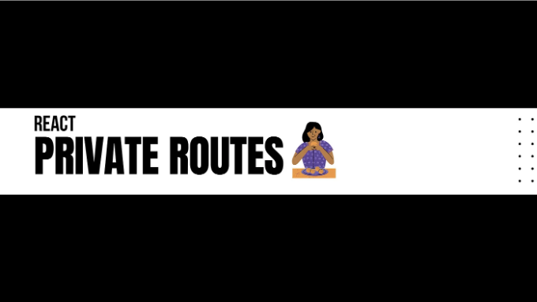

리액트에서는 프라이빗 루트(private routes)를 사용하여 애플리케이션의 특정 부분에 대한 액세스를 제어합니다. 일반적으로 사용자가 인증되었는지 또는 특정 권한을 가지고 있는지에 따라 특정 루트(route)나 구성 요소(components)에 대한 액세스를 제한하려고 합니다. 프라이빗 루트를 구현하려면 라우터 라이브러리(예: 리액트 라우터)를 사용하여 루트 처리를 조합하고, 인증 상태에 따라 조건부 렌더링을 할 수 있습니다.

다음은 React Router를 사용하여 프라이빗 루트를 구현하는 예시입니다.

## 프라이빗 루트 컴포넌트 생성하기


<!-- ui-log 수평형 -->
<ins class="adsbygoogle"
  style="display:block"
  data-ad-client="ca-pub-4877378276818686"
  data-ad-slot="9743150776"
  data-ad-format="auto"
  data-full-width-responsive="true"></ins>
<component is="script">
(adsbygoogle = window.adsbygoogle || []).push({});
</component>

프라이빗 라우트를 렌더링하는 논리를 처리하는 PrivateRoute 컴포넌트를 생성해보세요.

```js
import { Navigate } from "react-router-dom";

const PrivateRoute = ({ component: Component, ...rest }) => {
 
  const [isAuthenticated, setIsAuthenticated] = useState(false);

  // 여기에 인증 로직을 추가하세요...

  return isAuthenticated ? <Component {...rest} /> : <Navigate to="/login" />;
};
export default PrivateRoute;
```

이 컴포넌트는 component 속성과 다른 속성을 함께 받습니다. 사용자가 인증되었는지 확인하고, 인증되었을 경우 제공된 컴포넌트를 렌더링하며, 그렇지 않으면 로그인 페이지로 리다이렉트합니다.

## 라우팅 구현하기

<!-- ui-log 수평형 -->
<ins class="adsbygoogle"
  style="display:block"
  data-ad-client="ca-pub-4877378276818686"
  data-ad-slot="9743150776"
  data-ad-format="auto"
  data-full-width-responsive="true"></ins>
<component is="script">
(adsbygoogle = window.adsbygoogle || []).push({});
</component>

이제 라우팅 설정 내에서 PrivateRoute 컴포넌트를 사용하세요.

```js
import React from "react";
import ReactDOM from "react-dom/client";
import "./index.css";
import App from "./App";
import PrivateRoute from "./components/auth/PrivateRoute";
import PageNotFound from "./components/PagenotFound/PageNotFound";
import {
  createBrowserRouter,
  createRoutesFromElements,
  Route,
  RouterProvider,
} from "react-router-dom";
import Home from "./components/Home/Home";

const router = createBrowserRouter(
  createRoutesFromElements(
    <Route path="/" element={<App />}>
      <Route path="/" element={<Home />} />
      {/* Private route 구현 */}
      <Route path="user" element={<PrivateRoute Component={User} />} />
      <Route path="*" element={<PageNotFound />} />
    </Route>
  )
);

const root = ReactDOM.createRoot(document.getElementById("root"));
```

이 예제에서는 /user 경로에 대한 private route가 사용되었습니다. 이는 인증된 상태인지 여부를 확인하여 사용자 컴포넌트를 렌더링할지 또는 로그인 페이지로 리디렉션할지를 결정합니다.

기억하세요, isAuthenticated 상태는 백엔드 API, 토큰 또는 기타 인증 메커니즘을 통해 관리되어야 합니다.

<!-- ui-log 수평형 -->
<ins class="adsbygoogle"
  style="display:block"
  data-ad-client="ca-pub-4877378276818686"
  data-ad-slot="9743150776"
  data-ad-format="auto"
  data-full-width-responsive="true"></ins>
<component is="script">
(adsbygoogle = window.adsbygoogle || []).push({});
</component>

이 블로그 포스트가 도움이 되었다면 추가 질문이나 알고 싶은 주제가 있다면 언제든 연락해 주세요.

즐거운 코딩하시고 더 많은 유익한 콘텐츠 기대해 주세요!!!