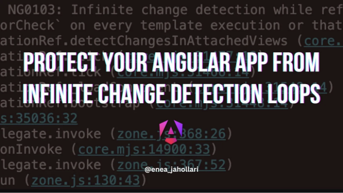
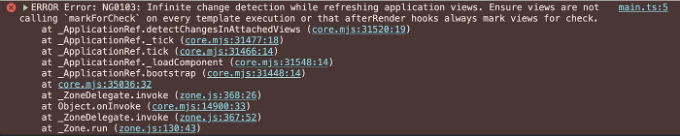

요새 Angular에서는 신호를 소개했는데, 이것은 놀랍게도 강력하며 Angular 애플리케이션을 작성하는 방법을 크게 단순화합니다.

Angular에서 신호를 사용할 때, 신호가 변경될 때마다 Angular이 뷰를 항상 업데이트하도록 보장해준다는 점을 알고 있습니다.

```js
@Component({
  template: `
    <div>{ count() }</div>
    <button (click)="increment()">Increment</button>
  `
})
export class AppComponent {
  count = signal(0);

  increment() {
    this.count.update(x => x + 1);
  }
}
```

<!-- ui-log 수평형 -->
<ins class="adsbygoogle"
  style="display:block"
  data-ad-client="ca-pub-4877378276818686"
  data-ad-slot="9743150776"
  data-ad-format="auto"
  data-full-width-responsive="true"></ins>
<component is="script">
(adsbygoogle = window.adsbygoogle || []).push({});
</component>

Angular이 도입한 또 다른 기능은 afterRender 라이프사이클 후크입니다. 이 후크는 Angular이 뷰를 렌더링한 후에 호출됩니다. 이는 뷰가 업데이트된 후에 수행해야 할 작업을 수행하기에 좋은 위치입니다.

```js
@Component()
export class AppComponent {
  count = signal(0);
  
  constructor() {
    afterRender(() => {
      console.log('뷰가 업데이트되었습니다');
    });
  }
}
```

만약 afterRender 후크에서 뷰를 업데이트해야 하는 경우, 그리고 그것이 신호를 업데이트하는 작업이라면 (이는 컴포넌트의 템플릿에서 호출될 수 있습니다), 신호를 결정적이지 않은 방식으로 업데이트하지 않도록 주의해야합니다.

```js
@Component({
  template: `
    <div>{ count() }</div>
  `
})
export class AppComponent {
  count = signal(0);
  
  constructor() {
    afterRender(() => {
      // 이 코드는 무한 변경 검출 루프를 발생시킵니다
      this.count.update(x => x + 1);
    });
  }
}
```

<!-- ui-log 수평형 -->
<ins class="adsbygoogle"
  style="display:block"
  data-ad-client="ca-pub-4877378276818686"
  data-ad-slot="9743150776"
  data-ad-format="auto"
  data-full-width-responsive="true"></ins>
<component is="script">
(adsbygoogle = window.adsbygoogle || []).push({});
</component>



만약 afterRender 후크에서 시그널을 업데이트한다면, 확실한 방식으로 업데이트해야 합니다. 즉, 뷰가 업데이트될 때 시그널의 값이 변경되지 않도록 업데이트해야 합니다.

```js
@Component({
  template: `
    <div>{ count() }</div>
  `
})
export class AppComponent {
  count = signal(0);
  
  constructor() {
    afterRender(() => {
      // 이렇게 하면 무한 변경 감지 루프가 발생하지 않습니다.
      this.count.set(/* 새 값 */); 
    });
  }
}
```

이 간단한 규칙을 따르면 Angular 앱을 무한 변경 감지 루프로부터 보호할 수 있습니다.