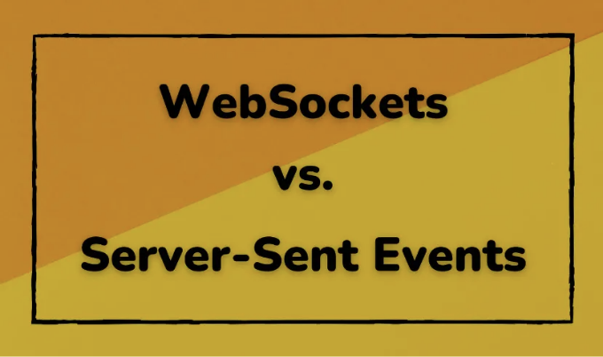

데이터를 푸시하는 경우, 사람들은 먼저 WebSocket을 떠올릴 수 있습니다.

실제로 WebSocket은 양방향 통신을 가능하게 하며 서버에서 브라우저로 메시지를 자연스럽게 푸시할 수 있습니다.

그러나 단방향 메시지 푸시만 필요한 경우에는 HTTP도 Server-Sent Events를 통해 이 기능을 제공합니다.

<!-- ui-log 수평형 -->
<ins class="adsbygoogle"
  style="display:block"
  data-ad-client="ca-pub-4877378276818686"
  data-ad-slot="9743150776"
  data-ad-format="auto"
  data-full-width-responsive="true"></ins>
<component is="script">
(adsbygoogle = window.adsbygoogle || []).push({});
</component>

웹소켓의 통신 과정은 다음과 같습니다:

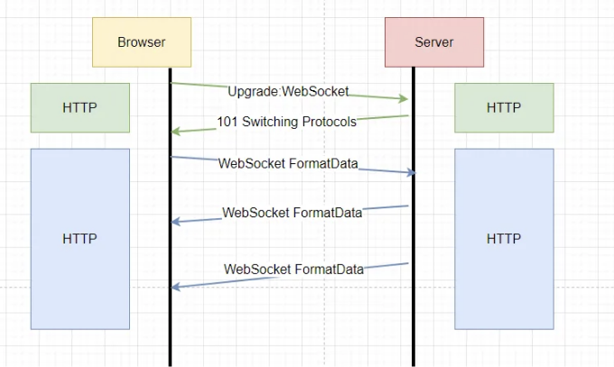

우선 HTTP를 통해 프로토콜을 전환합니다. 서버가 상태 코드 101을 반환하면 프로토콜 전환이 성공적입니다.

이후, 웹소켓 형식의 데이터 통신이 시작되며 한 쪽은 언제든지 다른 쪽으로 메시지를 푸시할 수 있습니다.

<!-- ui-log 수평형 -->
<ins class="adsbygoogle"
  style="display:block"
  data-ad-client="ca-pub-4877378276818686"
  data-ad-slot="9743150776"
  data-ad-format="auto"
  data-full-width-responsive="true"></ins>
<component is="script">
(adsbygoogle = window.adsbygoogle || []).push({});
</component>

HTTP에서 Server-Sent 이벤트에 대해 설명드리겠습니다:

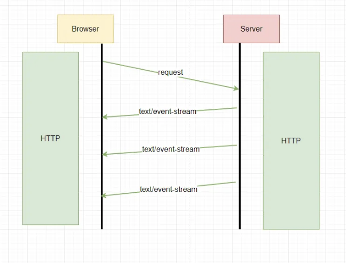

서버에서 반환된 Content-Type은 text/event-stream이며, 여러 번 콘텐츠를 반환할 수 있는 스트림입니다.

Server-sent 이벤트는 언제든지 데이터를 이 타입의 메시지로 전송합니다.

<!-- ui-log 수평형 -->
<ins class="adsbygoogle"
  style="display:block"
  data-ad-client="ca-pub-4877378276818686"
  data-ad-slot="9743150776"
  data-ad-format="auto"
  data-full-width-responsive="true"></ins>
<component is="script">
(adsbygoogle = window.adsbygoogle || []).push({});
</component>

SSE에 대해 처음 들어보신 분도 있겠지만, 이를 기반으로 한 애플리케이션을 사용해 본 적이 있을 거에요.

예를 들어, 사용하시는 CICD 플랫폼은 실시간으로 로그를 출력합니다.

그렇다면 빌드 로그를 실시간으로 어떻게 전송할까요?

데이터를 조각조각 전송해야 하는데, 일반적으로 SSE가 이런 방식으로 데이터를 푸시하는 데 사용됩니다.

<!-- ui-log 수평형 -->
<ins class="adsbygoogle"
  style="display:block"
  data-ad-client="ca-pub-4877378276818686"
  data-ad-slot="9743150776"
  data-ad-format="auto"
  data-full-width-responsive="true"></ins>
<component is="script">
(adsbygoogle = window.adsbygoogle || []).push({});
</component>

다른 예로 ChatGPT가 있습니다. 질문에 답변할 때 한꺼번에 모든 답변을 제공하지 않고, 대신 부분적으로 점진적으로 로드합니다.

이것 또한 SSE에 기반을 두고 있습니다.

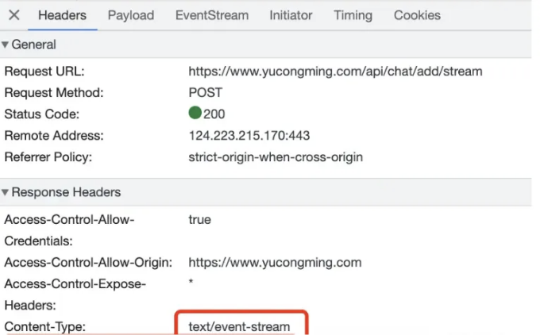

이제 SSE가 무엇이며 어떻게 적용되는지 알았으니, 직접 구현해 봅시다.

<!-- ui-log 수평형 -->
<ins class="adsbygoogle"
  style="display:block"
  data-ad-client="ca-pub-4877378276818686"
  data-ad-slot="9743150776"
  data-ad-format="auto"
  data-full-width-responsive="true"></ins>
<component is="script">
(adsbygoogle = window.adsbygoogle || []).push({});
</component>

이중 프로젝트를 만들어보세요.

```js
npx nest new sse-test
```

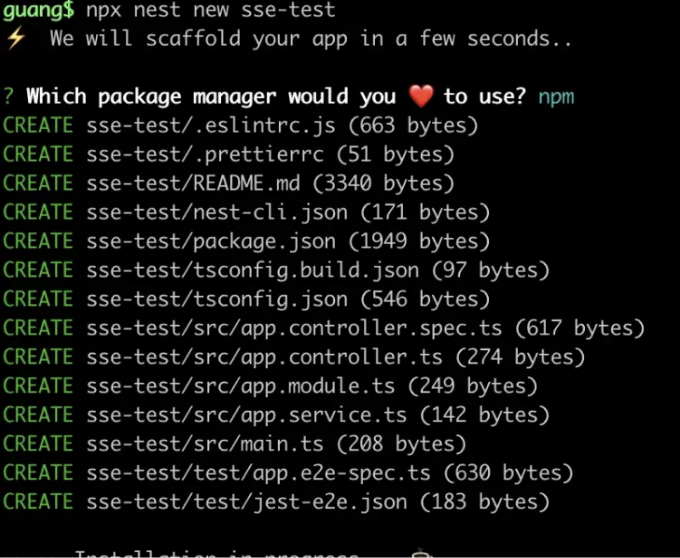

실행해보세요:

<!-- ui-log 수평형 -->
<ins class="adsbygoogle"
  style="display:block"
  data-ad-client="ca-pub-4877378276818686"
  data-ad-slot="9743150776"
  data-ad-format="auto"
  data-full-width-responsive="true"></ins>
<component is="script">
(adsbygoogle = window.adsbygoogle || []).push({});
</component>

```
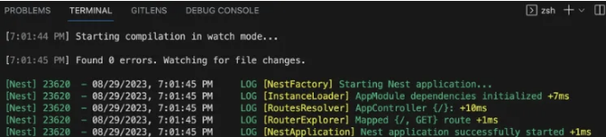

로컬호스트(http://localhost:3000)를 방문하면 서버가 성공적으로 실행 중임을 나타내는 "Hello World"가 표시됩니다.

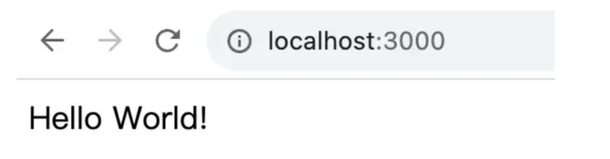

그런 다음 AppController에 스트림 인터페이스를 추가하세요.
```

<!-- ui-log 수평형 -->
<ins class="adsbygoogle"
  style="display:block"
  data-ad-client="ca-pub-4877378276818686"
  data-ad-slot="9743150776"
  data-ad-format="auto"
  data-full-width-responsive="true"></ins>
<component is="script">
(adsbygoogle = window.adsbygoogle || []).push({});
</component>

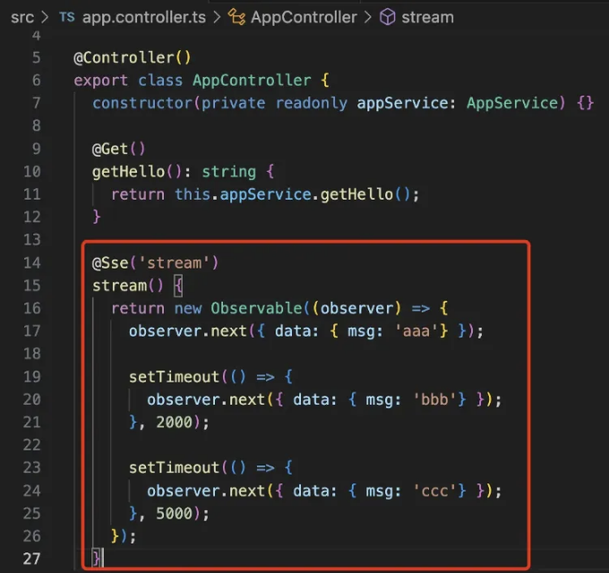

여기서는 @Get, @Post 등의 데코레이터로 식별되지 않지만 @Sse 데코레이터는 이것이 이벤트 스트림 유형의 인터페이스임을 나타냅니다.

```js
@Sse('stream')
stream() {
    return new Observable((observer) => {
      observer.next({ data: { msg: 'aaa'} });

      setTimeout(() => {
        observer.next({ data: { msg: 'bbb'} });
      }, 2000);

      setTimeout(() => {
        observer.next({ data: { msg: 'ccc'} });
      }, 5000);
    });
}
```

반환된 것은 Observable 객체이며, 내부적으로 observer.next를 사용하여 메시지를 반환합니다. 어떤 JSON 데이터도 반환할 수 있습니다. 먼저 aaa를 반환하고, 2초 후에는 bbb를 반환하고, 5초 후에는 ccc를 반환합니다. 그런 다음 Frontend 페이지를 만듭시다: React 프로젝트를 만듭니다.

<!-- ui-log 수평형 -->
<ins class="adsbygoogle"
  style="display:block"
  data-ad-client="ca-pub-4877378276818686"
  data-ad-slot="9743150776"
  data-ad-format="auto"
  data-full-width-responsive="true"></ins>
<component is="script">
(adsbygoogle = window.adsbygoogle || []).push({});
</component>

```bash
npx create-react-app --template=typescript sse-test-frontend
```

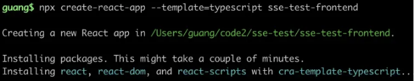

App.tsx에 다음 코드를 작성해주세요:

```js
import { useEffect } from 'react';

function App() {

  useEffect(() => {
    const eventSource = new EventSource('http://localhost:3000/stream');
    eventSource.onmessage = ({ data }) => {
      console.log('새 메시지', JSON.parse(data));
    };
  }, []);

  return (
    <div>안녕하세요</div>
  );
}

export default App;
```

<!-- ui-log 수평형 -->
<ins class="adsbygoogle"
  style="display:block"
  data-ad-client="ca-pub-4877378276818686"
  data-ad-slot="9743150776"
  data-ad-format="auto"
  data-full-width-responsive="true"></ins>
<component is="script">
(adsbygoogle = window.adsbygoogle || []).push({});
</component>

이 EventSource는 SSE 인터페이스에서 응닑을 얻는 데 사용되는 브라우저 기본 API입니다. 각 메시지를 콜백 함수 onmessage로 전달합니다.

우리는 Nest 서비스에서 교차 출처 지원을 활성화합니다.

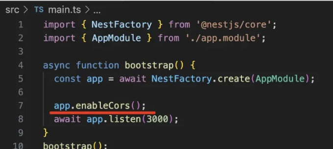

그런 다음 React 프로젝트의 index.tsx 파일에서 이 코드 라인을 삭제하세요. 이는 추가적인 렌더링을 발생시킬 수 있습니다:

<!-- ui-log 수평형 -->
<ins class="adsbygoogle"
  style="display:block"
  data-ad-client="ca-pub-4877378276818686"
  data-ad-slot="9743150776"
  data-ad-format="auto"
  data-full-width-responsive="true"></ins>
<component is="script">
(adsbygoogle = window.adsbygoogle || []).push({});
</component>

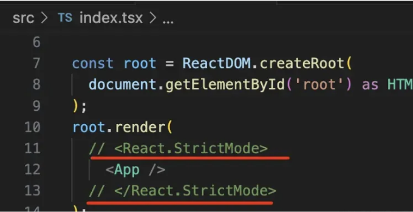

npm run start를 실행하세요.

포트 3000이 이미 사용 중이므로, 3001에서 실행될 것입니다:

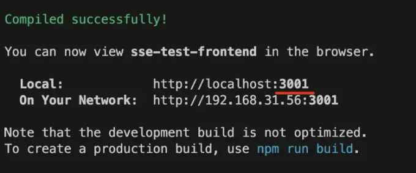

<!-- ui-log 수평형 -->
<ins class="adsbygoogle"
  style="display:block"
  data-ad-client="ca-pub-4877378276818686"
  data-ad-slot="9743150776"
  data-ad-format="auto"
  data-full-width-responsive="true"></ins>
<component is="script">
(adsbygoogle = window.adsbygoogle || []).push({});
</component>

브라우저에 접근해주세요:

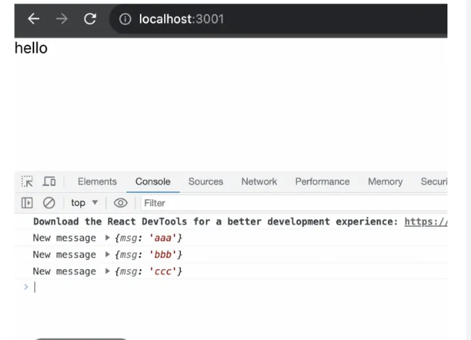

응답을 보셨나요?

이것이 Server-Sent Events(서버 보낸 이벤트) 입니다.

<!-- ui-log 수평형 -->
<ins class="adsbygoogle"
  style="display:block"
  data-ad-client="ca-pub-4877378276818686"
  data-ad-slot="9743150776"
  data-ad-format="auto"
  data-full-width-responsive="true"></ins>
<component is="script">
(adsbygoogle = window.adsbygoogle || []).push({});
</component>

개발 도구에서 응답의 Content-Type이 text/event-stream으로 설정되어 있음을 확인할 수 있어요.

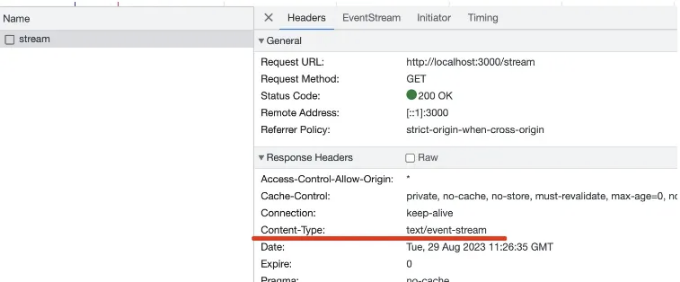

그리고 EventStream에서는 수신된 각 메시지를 확인할 수 있어요.

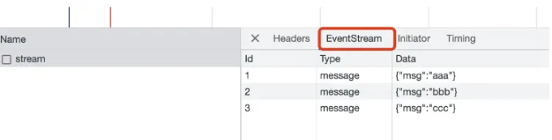

<!-- ui-log 수평형 -->
<ins class="adsbygoogle"
  style="display:block"
  data-ad-client="ca-pub-4877378276818686"
  data-ad-slot="9743150776"
  data-ad-format="auto"
  data-full-width-responsive="true"></ins>
<component is="script">
(adsbygoogle = window.adsbygoogle || []).push({});
</component>

서버는 언제든지 웹페이지로 메시지를 푸시할 수 있습니다.

호환성은 어떤가요?

MDN에서 확인할 수 있습니다.

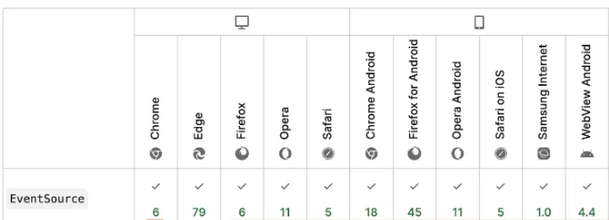

<!-- ui-log 수평형 -->
<ins class="adsbygoogle"
  style="display:block"
  data-ad-client="ca-pub-4877378276818686"
  data-ad-slot="9743150776"
  data-ad-format="auto"
  data-full-width-responsive="true"></ins>
<component is="script">
(adsbygoogle = window.adsbygoogle || []).push({});
</component>

IE나 Edge를 제외하고 다른 브라우저와의 호환성 문제가 없습니다.

일반적으로 안전하게 사용할 수 있습니다.

어디에 사용할 수 있나요?

서버 전송 이벤트(Server-Sent Events)는 서버 쪽 푸시만 필요한 시나리오에 특히 적합합니다.

<!-- ui-log 수평형 -->
<ins class="adsbygoogle"
  style="display:block"
  data-ad-client="ca-pub-4877378276818686"
  data-ad-slot="9743150776"
  data-ad-format="auto"
  data-full-width-responsive="true"></ins>
<component is="script">
(adsbygoogle = window.adsbygoogle || []).push({});
</component>

예를 들어, 로그의 실시간 푸시가 있습니다.

테스트해 봅시다:

"tail -f" 명령어를 사용하면 파일의 최신 내용을 실시간으로 볼 수 있습니다.

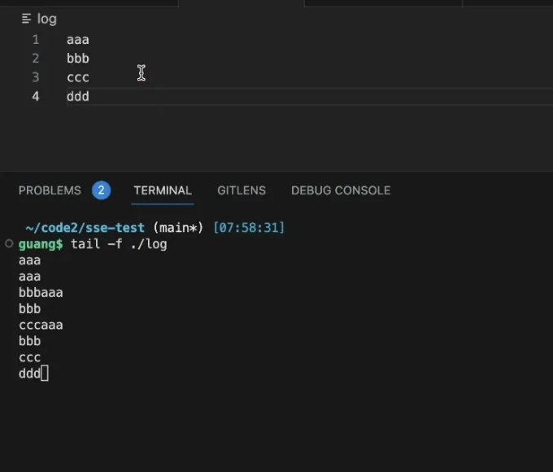

<!-- ui-log 수평형 -->
<ins class="adsbygoogle"
  style="display:block"
  data-ad-client="ca-pub-4877378276818686"
  data-ad-slot="9743150776"
  data-ad-format="auto"
  data-full-width-responsive="true"></ins>
<component is="script">
(adsbygoogle = window.adsbygoogle || []).push({});
</component>

우리는 child_process 모듈의 exec 함수를 사용하여 이 명령을 실행하고, 그 결과물을 stdout 출력을 듣습니다.

```js
const { exec } = require("child_process");

const childProcess = exec('tail -f ./log');

childProcess.stdout.on('data', (msg) => {
    console.log(msg);
});
```

Node로 실행하세요.

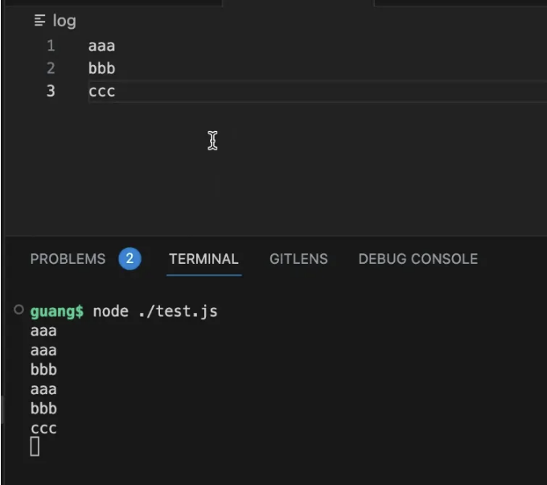

<!-- ui-log 수평형 -->
<ins class="adsbygoogle"
  style="display:block"
  data-ad-client="ca-pub-4877378276818686"
  data-ad-slot="9743150776"
  data-ad-format="auto"
  data-full-width-responsive="true"></ins>
<component is="script">
(adsbygoogle = window.adsbygoogle || []).push({});
</component>

다음으로 SSE 인터페이스를 추가해주세요.

```js
@Sse('stream2')
stream2() {
  const childProcess = exec('tail -f ./log');

  return new Observable((observer) => {
    childProcess.stdout.on('data', (msg) => {
      observer.next({ data: { msg: msg.toString() } });
    })
  });
}
```

새 데이터를 감지한 후 브라우저로 반환합니다.

브라우저는 다음과 같이 새 인터페이스에 연결합니다:

<!-- ui-log 수평형 -->
<ins class="adsbygoogle"
  style="display:block"
  data-ad-client="ca-pub-4877378276818686"
  data-ad-slot="9743150776"
  data-ad-format="auto"
  data-full-width-responsive="true"></ins>
<component is="script">
(adsbygoogle = window.adsbygoogle || []).push({});
</component>

아래는 테스트 내용입니다:

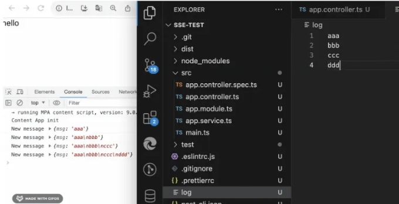

브라우저가 실시간 로그를 수신한 것을 확인할 수 있습니다.

<!-- ui-log 수평형 -->
<ins class="adsbygoogle"
  style="display:block"
  data-ad-client="ca-pub-4877378276818686"
  data-ad-slot="9743150776"
  data-ad-format="auto"
  data-full-width-responsive="true"></ins>
<component is="script">
(adsbygoogle = window.adsbygoogle || []).push({});
</component>

많은 빌드 로그들이 SSE를 통해 실시간으로 전송됩니다.

로그와 비슷한 것들은 그냥 텍스트일 뿐이지만, 만약 이진 데이터라면 어떨까요?

Node.js에서는 바이너리 데이터를 버퍼를 사용해서 저장합니다.

```js
const { readFileSync } = require("fs");

const buffer = readFileSync('./package.json');

console.log(buffer);
```

<!-- ui-log 수평형 -->
<ins class="adsbygoogle"
  style="display:block"
  data-ad-client="ca-pub-4877378276818686"
  data-ad-slot="9743150776"
  data-ad-format="auto"
  data-full-width-responsive="true"></ins>
<component is="script">
(adsbygoogle = window.adsbygoogle || []).push({});
</component>

이 테이블 태그를 마크다운 형식으로 변경하세요.

<!-- ui-log 수평형 -->
<ins class="adsbygoogle"
  style="display:block"
  data-ad-client="ca-pub-4877378276818686"
  data-ad-slot="9743150776"
  data-ad-format="auto"
  data-full-width-responsive="true"></ins>
<component is="script">
(adsbygoogle = window.adsbygoogle || []).push({});
</component>

여기 한번 시도해보세요:

```js
@Sse('stream3')
stream3() {
    return new Observable((observer) => {
        const json = readFileSync('./package.json').toJSON();
        observer.next({ data: { msg: json });
    });
}
```

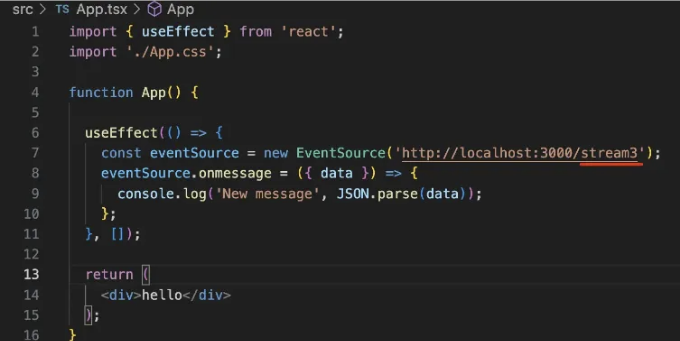

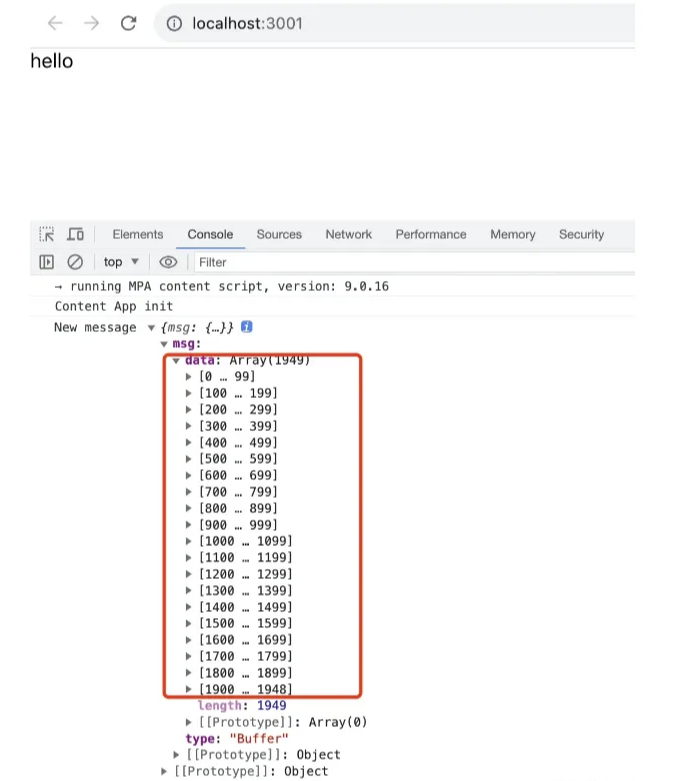

<!-- ui-log 수평형 -->
<ins class="adsbygoogle"
  style="display:block"
  data-ad-client="ca-pub-4877378276818686"
  data-ad-slot="9743150776"
  data-ad-format="auto"
  data-full-width-responsive="true"></ins>
<component is="script">
(adsbygoogle = window.adsbygoogle || []).push({});
</component>

그렇습니다. 

다른 말로 말하면, SSE를 기반으로 하면 텍스트를 밀어 넣을 수 있는 것 뿐만 아니라 어떤 이진 데이터든 밀어 넣을 수 있습니다.

## 요약

WebSocket이나 HTTP의 Server-Sent Events (SSE)를 사용하여 실시간 데이터를 서버에서 푸시할 수 있습니다.

<!-- ui-log 수평형 -->
<ins class="adsbygoogle"
  style="display:block"
  data-ad-client="ca-pub-4877378276818686"
  data-ad-slot="9743150776"
  data-ad-format="auto"
  data-full-width-responsive="true"></ins>
<component is="script">
(adsbygoogle = window.adsbygoogle || []).push({});
</component>

Content-Type을 text/event-stream으로 설정한 헤더를 반환함으로써 HTTP 응답에서 메시지를 스트리밍을 통해 여러 번 보낼 수 있습니다.

전송된 내용은 JSON 형식으로 전송되며 텍스트 또는 바이너리 내용을 전송하는 데 사용할 수 있습니다.

저희는 Nest를 사용하여 SSE 인터페이스를 구현했습니다. 메소드는 @Sse 장식자를 사용하고 Observable 개체를 반환합니다. observer.next를 사용하여 언제든지 데이터를 반환할 수 있습니다.

프론트 엔드에서 EventSource의 onmessage를 사용하여 메시지를 수신합니다.

<!-- ui-log 수평형 -->
<ins class="adsbygoogle"
  style="display:block"
  data-ad-client="ca-pub-4877378276818686"
  data-ad-slot="9743150776"
  data-ad-format="auto"
  data-full-width-responsive="true"></ins>
<component is="script">
(adsbygoogle = window.adsbygoogle || []).push({});
</component>

이 API는 IE를 제외하고 안전하게 사용할 수 있는 높은 호환성을 가지고 있어요.

내부 메시징, 빌드 로그의 실시간 표시, chatgpt 메시지 응답과 같이 다양한 용도로 활용할 수 있어요.

메시지 푸시가 필요한 시나리오를 직면할 때는 WebSocket 대신 Server-Sent Events를 고려해 보세요.