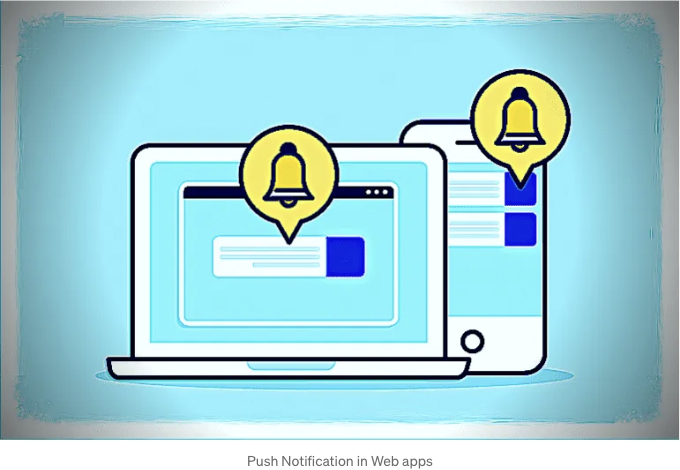

푸시 알림은 앱 사용자들과 소통하는 좋은 방법입니다. 클라이언트가 활성화되어 있지 않을 때에도 서버가 클라이언트에게 푸시 알림을 보낼 수 있습니다.

그렇다면, 리액트와 넥스트.js 앱에서 노드.js를 사용하여 푸시 알림을 구현하는 방법에 대해 알아봅시다.

# 웹 앱에서 푸시 알림이 작동하는 방식은?

<!-- ui-log 수평형 -->
<ins class="adsbygoogle"
  style="display:block"
  data-ad-client="ca-pub-4877378276818686"
  data-ad-slot="9743150776"
  data-ad-format="auto"
  data-full-width-responsive="true"></ins>
<component is="script">
(adsbygoogle = window.adsbygoogle || []).push({});
</component>

웹 앱의 푸시 알림은 브라우저 API, 서비스 워커, 그리고 푸시 메시지를 전송할 수 있는 서버의 조합이 필요합니다.

브라우저가 오프라인 상태인 경우 메시지는 브라우저가 온라인 상태가 될 때까지 대기 상태가 됩니다. 사용자는 웹사이트로부터 이러한 푸시 알림을 수신하도록 선택할 수 있습니다. 구독자들은 이후 휴대폰 및 데스크톱 브라우저에서 알림을 받게 됩니다. 이것이 바로 웹 푸시 알림이 브라우저 알림이라고도 불리는 이유입니다.

# 서비스 워커란 무엇인가요?

서비스 워커는 웹 페이지와 별도로 백그라운드에서 실행되는 스크립트입니다. 백그라운드 동기화, 푸시 알림, 캐싱과 같은 기능을 가능하게 합니다.

<!-- ui-log 수평형 -->
<ins class="adsbygoogle"
  style="display:block"
  data-ad-client="ca-pub-4877378276818686"
  data-ad-slot="9743150776"
  data-ad-format="auto"
  data-full-width-responsive="true"></ins>
<component is="script">
(adsbygoogle = window.adsbygoogle || []).push({});
</component>

서비스 워커는 푸시 알림을 받아서 사용자에게 보여주는 역할을 하는데, 그만큼 중요한 요소입니다.

서비스 워커를 등록하려면 Next.js나 React 앱의 퍼블릭 폴더에 sw.js 파일을 만들어야 합니다.

```js
// public/sw.js

self.addEventListener("push", (event) => {
  const data = event.data.json();
  const title = data.title;
  const body = data.body;
  const icon = data.icon;
  const url = data.data.url;

  const notificationOptions = {
    body: body,
    tag: "unique-tag", // 고유한 태그를 사용하여 중복 알림 방지
    icon: icon,
    data: {
      url: url, // 사용자를 원하는 페이지로 리디렉션할 URL로 대체
    },
  };

  self.registration.showNotification(title, notificationOptions);
});
```

서비스 워커에 푸시 이벤트 리스너를 구현했습니다. 이벤트는 서버에서 클라이언트로 푸시 알림을 보낼 때 발생합니다.

<!-- ui-log 수평형 -->
<ins class="adsbygoogle"
  style="display:block"
  data-ad-client="ca-pub-4877378276818686"
  data-ad-slot="9743150776"
  data-ad-format="auto"
  data-full-width-responsive="true"></ins>
<component is="script">
(adsbygoogle = window.adsbygoogle || []).push({});
</component>

# React 및 Next.js에서 서비스 워커 등록하기

우리 React 및 Next.js 앱에 서비스 워커를 등록해야 합니다. useEffect 훅을 사용하여 서비스 워커를 등록할 것입니다.

```js
// app/page.js -> Next.js
// src/index.js -> React

useEffect(() => {
  if ("serviceWorker" in navigator) {
    navigator.serviceWorker
      .register("/sw.js")
      .then((registration) => {
        console.log("등록 성공");
      })
      .catch((error) => {
        console.log("서비스 워커 등록 실패");
      });
  }
}, []);
```

우리는 useEffect 훅에서 서비스 워커를 등록하고 있습니다. navigator 객체에서 serviceWorker의 가용성을 확인하고 있습니다. 가용하다면 서비스 워커를 등록하고 있습니다.

<!-- ui-log 수평형 -->
<ins class="adsbygoogle"
  style="display:block"
  data-ad-client="ca-pub-4877378276818686"
  data-ad-slot="9743150776"
  data-ad-format="auto"
  data-full-width-responsive="true"></ins>
<component is="script">
(adsbygoogle = window.adsbygoogle || []).push({});
</component>

# 서버에서 푸시 알림 보내기

우리는 Node.js 서버에서 푸시 알림을 보내기 위해 web-push 라이브러리를 사용할 것입니다.

web-push를 사용하여 푸시 알림을 보내려면 VAPID 키페어를 생성해야 합니다. web-push 라이브러리를 사용하여 VAPID 키페어를 생성할 수 있습니다.

```js
npm install web-push -g

web-push generate-vapid-keys
```

<!-- ui-log 수평형 -->
<ins class="adsbygoogle"
  style="display:block"
  data-ad-client="ca-pub-4877378276818686"
  data-ad-slot="9743150776"
  data-ad-format="auto"
  data-full-width-responsive="true"></ins>
<component is="script">
(adsbygoogle = window.adsbygoogle || []).push({});
</component>

퍼블릭과 프라이빗 키를 받게 됩니다. 우리는 이 키들을 환경 변수에 저장할 수 있어요.

```js
// server.js

import express from "express";
import webpush from "web-push";
import dotenv from "dotenv";
dotenv.config();

const app = express();

const vapidKeys = {
  publicKey: process.env.VAPID_PUBLIC_KEY,
  privateKey: process.env.VAPID_PRIVATE_KEY,
};


webpush.setVapidDetails(
  "test@gmail.com",
  vapidKeys.publicKey,
  vapidKeys.privateKey
)

let subscriptions = [];

app.post("/subscribe", (req, res) => {
  const subscription = req.body;
  subscriptions.push(subscription);

  res.status(201).json({status: "success"});
});

app.post("/send-notification", (req, res) => {
  const notificationPayload = {
      title: "New Notification",
      body: "This is a new notification",
      icon: "https://some-image-url.jpg",
      data: {
        url: "https://example.com",
      },
  };

  Promise.all(
    subscriptions.map((subscription) =>
      webpush.sendNotification(subscription, JSON.stringify(notificationPayload))
    )
  )
    .then(() => res.status(200).json({ message: "Notification sent successfully." }))
    .catch((err) => {
      console.error("Error sending notification");
      res.sendStatus(500);
    });
});

app.listen(4000, () => {
  console.log("Server started on port 4000");
});
```

Express.js를 사용하여 서버를 설정했어요. /subscribe와 /send-notification 두 개의 라우트를 만들었어요.

/subscribe 라우트에서는 구독 객체를 subscriptions 배열에 저장합니다. 이 배열을 사용하여 구독자에게 푸시 알림을 보낼 거예요. 구독 객체를 데이터베이스에 저장할 수도 있어요.

<!-- ui-log 수평형 -->
<ins class="adsbygoogle"
  style="display:block"
  data-ad-client="ca-pub-4877378276818686"
  data-ad-slot="9743150776"
  data-ad-format="auto"
  data-full-width-responsive="true"></ins>
<component is="script">
(adsbygoogle = window.adsbygoogle || []).push({});
</component>

/send-notification 루트에서는 모든 구독자에게 푸시 알림을 보내고 있습니다. 푸시 알림을 보내기 위해 webpush.sendNotification 메서드를 사용하고 있습니다.

우리는 Promise.all 메서드를 사용하여 모든 구독자에게 푸시 알림을 보내고 있습니다. 특정 사용자에게 푸시 알림을 보내려면 구독 배열을 필터링하여 보낼 수 있습니다.

# 푸시 알림 구독

푸시 알림을 받으려면 푸시 알림에 가입해야 합니다. serviceWorker 객체를 사용하여 푸시 알림을 받기 위해 가입할 것입니다.

<!-- ui-log 수평형 -->
<ins class="adsbygoogle"
  style="display:block"
  data-ad-client="ca-pub-4877378276818686"
  data-ad-slot="9743150776"
  data-ad-format="auto"
  data-full-width-responsive="true"></ins>
<component is="script">
(adsbygoogle = window.adsbygoogle || []).push({});
</component>

```js
// app/page.js -> Next.js
// src/index.js -> React

// useEffect 훅을 수정하여 푸시 알림을 구독하도록 변경했습니다.

useEffect(() => {
  if ("serviceWorker" in navigator) {
    const handleServiceWorker = async () => {
      const register = await navigator.serviceWorker.register("/sw.js");

      const subscription = await register.pushManager.subscribe({
        userVisibleOnly: true,
        applicationServerKey: "VAPID_PUBLIC_KEY",
      });

      const res = await fetch("http://localhost:4000/subscribe", {
        method: "POST",
        body: JSON.stringify(subscription),
        headers: {
          "content-type": "application/json",
        },
      });

      const data = await data.json();
      console.log(data);
    };
    handleServiceWorker();
  }
}, []);
```

useEffect 훅을 사용하여 푸시 알림을 구독하고 있어요. pushManager.subscribe 메서드를 사용해서 푸시 알림에 구독하고 있어요. 사용자가 푸시 알림을 구독하면 구독 객체를 서버로 보내고 있어요.

# 서버에서 푸시 알림 전송하기

```js
// server.js 실행

node server.js
```

<!-- ui-log 수평형 -->
<ins class="adsbygoogle"
  style="display:block"
  data-ad-client="ca-pub-4877378276818686"
  data-ad-slot="9743150776"
  data-ad-format="auto"
  data-full-width-responsive="true"></ins>
<component is="script">
(adsbygoogle = window.adsbygoogle || []).push({});
</component>

이제 Postman을 열고 http://localhost:4000/send-notification 경로로 POST 요청을 보내세요. 그러면 브라우저에서 푸시 알림을 받을 수 있습니다.

# 결론

이 글에서는 React와 Next.js 앱에서 Node.js를 사용하여 푸시 알림을 구현하는 방법을 배웠습니다. 우리는 기본 푸시 알림 시스템을 구현했습니다. 이 시스템을 확장하여 특정 사용자나 그룹에게 푸시 알림을 보낼 수 있습니다.

여기까지 입니다. 유용하게 활용하셨기를 바랍니다. 질문이나 피드백이 있으시면 제게 트위터에서 공유해주세요.