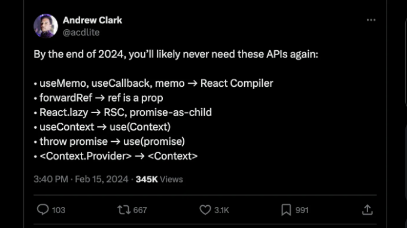

ReactJS는 현대 프런트엔드 개발의 중심에 서 있으며 강력한 UI 기능으로 칭송받고 있어요. React에 대한 제 관심 중요한 이유 중 하나는 그 발전을 이끄는 전문 팀과 뜨거운 커뮤니티가 지지하는 것이죠.

커뮤니티가 새로운 기능과 향상된 기능에 대한 요구를 제기하면 React 팀이 주의 깊게 대응해요. React의 미래는 '더 적게 쓰고 더 많이 하기'라는 말을 통해 간결하고 혁신적인 것을 약속해요. 이 기사에서는 React 19의 최신 기능을 소개하며 그 발전을 탐험하고 변화하는 풍경을 따라가도록 하겠어요. 기억하세요, React 19는 계속 진행 중이에요. 최신 업데이트를 확인하려면 깃허브의 공식 안내서를 참고하고 팀의 소식을 SNS로 팔로우하세요.



## React v19 탐험: 포괄적인 개요

<!-- ui-log 수평형 -->
<ins class="adsbygoogle"
  style="display:block"
  data-ad-client="ca-pub-4877378276818686"
  data-ad-slot="9743150776"
  data-ad-format="auto"
  data-full-width-responsive="true"></ins>
<component is="script">
(adsbygoogle = window.adsbygoogle || []).push({});
</component>

1- 소개:

- React v19의 개요 및 중요성에 대한 설명.

2- React v19의 새로운 기능
최신 추가 사항 설명:

- React 컴파일러
- 서버 컴포넌트
- 액션
- 웹 컴포넌트
- 문서 메타데이터
- 자산 로딩
- 새로운 React Hooks 소개
- use() Hook
- useFormStatus() Hook
- useFormState() Hook
- useOptimistic() Hook

<!-- ui-log 수평형 -->
<ins class="adsbygoogle"
  style="display:block"
  data-ad-client="ca-pub-4877378276818686"
  data-ad-slot="9743150776"
  data-ad-format="auto"
  data-full-width-responsive="true"></ins>
<component is="script">
(adsbygoogle = window.adsbygoogle || []).push({});
</component>

요약:

- 논의된 주요 포인트 재요약

🤖 React 컴파일러: React는 최신 컴파일러를 통합하는 과정에 있습니다. 이미 Instagram에서 활용되고 있는 이 기술은 React의 성능과 개발 경험을 혁신할 것으로 예상되며, 곧 향후 버전에서 공개될 예정입니다.

🔥 서버 컴포넌트: 수 년간의 세심한 개발 노력 끝에 React는 서버 컴포넌트의 혁신적인 개념을 소개합니다. 이제 Next.js와 원활하게 통합된 이 기능은 서버 측 렌더링 능력을 뛰어나게 강화시켜주며, 웹 애플리케이션 개발에서 새로운 가능성을 열어줍니다.

<!-- ui-log 수평형 -->
<ins class="adsbygoogle"
  style="display:block"
  data-ad-client="ca-pub-4877378276818686"
  data-ad-slot="9743150776"
  data-ad-format="auto"
  data-full-width-responsive="true"></ins>
<component is="script">
(adsbygoogle = window.adsbygoogle || []).push({});
</component>

💪 동작: DOM 상호 작용에서 패러다임 전환이 대표되는 동작은 DOM 요소와의 상호 작용 방식을 혁신할 것으로 예상됩니다. 이 혁신적인 기능은 사용자 경험을 개선하고 간소화할 것으로 약속되어, 동적 웹 애플리케이션 개발에 새로운 길을 열어줄 것입니다.

🌇 문서 메타데이터: 곧 예정된 개선으로, 개발자들이 프로젝트 코드 구현을 간소화하여 커뮤니티 내의 오래된 요구 사항을 해결하는 효율성을 높일 수 있습니다.

💼 자산 로딩: 자산이 배경에서 로드됨으로써 응용 프로그램 로드 시간과 사용자 경험을 향상시키는 최적화 효과에 대비하세요. 이는 웹 성능의 새로운 시대를 열며 새로운 가능성을 제시할 것입니다.

⚙️ 웹 구성 요소: React 코드가 웹 구성요소와 원활하게 통합되어 놀라운 가능성의 세계를 열며, 전례없는 다재다능성과 상호운용성을 약속하는 흥미로운 발전이 등장하고 있습니다.

<!-- ui-log 수평형 -->
<ins class="adsbygoogle"
  style="display:block"
  data-ad-client="ca-pub-4877378276818686"
  data-ad-slot="9743150776"
  data-ad-format="auto"
  data-full-width-responsive="true"></ins>
<component is="script">
(adsbygoogle = window.adsbygoogle || []).push({});
</component>

🪝 향상된 훅: 첨단 훅이 우리의 코딩 여정을 재정의할 것으로 예상됩니다. 벌써 흥분이 가득한 새로운 훅은 우리의 개발 경험을 한 단계 높여주며 혁신과 효율성을 높이는 것을 약속합니다.

React 19은 React 내의 지속적인 과도한 다시 렌더링 문제를 해결하기 위해 떠나가고 있습니다. 개발자들에게는 이 문제에 대처하는 것이 꾸준한 노력이 되어왔고 소중한 시간을 희생하며 종종 성능 병목 현상을 일으키게 되곤 했습니다.

다시 렌더링을 최소화하기 위해 코드를 식별하고 최적화하는 고된 과제는 계속 된 고난이었습니다. 그러나 React 19의 등장으로 구제가 코앞에 닥쳤습니다. 자동 다시 렌더링 관리를 통해 이 프레임워크는 개발자들이 이 부담을 덜어 주며 보다 간편하고 효율적인 개발 프로세스를 육성합니다.

과거에는 useMemo(), useCallback(), memo 등과 같은 기술을 활용하여 다시 렌더링 문제를 완화했습니다. 그러나 React 19의 등장으로 이러한 수동 개입 방법들이 쓸모 없어질 것으로 예상됩니다.

<!-- ui-log 수평형 -->
<ins class="adsbygoogle"
  style="display:block"
  data-ad-client="ca-pub-4877378276818686"
  data-ad-slot="9743150776"
  data-ad-format="auto"
  data-full-width-responsive="true"></ins>
<component is="script">
(adsbygoogle = window.adsbygoogle || []).push({});
</component>

프레임워크의 고급 기능은 코드를 자동으로 식별하고 메모이제이션하여 수동 최적화가 필요 없게 합니다. 이 간소화된 방식은 개발을 단순화할 뿐만 아니라 더 깨끗하고 효율적인 코드를 유도하여 React 진화의 중요한 발전을 나타냅니다.

## 1. 🤖 🤖 React 컴파일러 🤖 🤖

현재 React는 상태 변경 시 자동 다시 렌더링을 수행하지 않습니다. 이러한 다시 렌더링을 최적화하기 위해 개발자들은 보통 useMemo(), useCallback(), memo API의 수동 활용에 의존합니다. React 팀은 이 접근 방식을 "합리적인 수동 적용"이라고 설명했습니다. 그들의 전체적인 비전은 이러한 다시 렌더링을 관리하는 책임을 React 자체에 위임하는 것이었습니다.

수동 최적화의 번거로움을 인식하고 커뮤니티 피드백을 경청한 React 팀은 이 문제에 대처하기 위한 미션을 시작했습니다. 자동으로 다시 렌더링을 관리하기 위한 혁신적인 해결책인 "React 컴파일러"를 소개합니다. React는 이제 상태를 언제 어떻게 변경하고 UI를 동적으로 새로 고칠지 결정하는 책임을 맡게 됩니다.

<!-- ui-log 수평형 -->
<ins class="adsbygoogle"
  style="display:block"
  data-ad-client="ca-pub-4877378276818686"
  data-ad-slot="9743150776"
  data-ad-format="auto"
  data-full-width-responsive="true"></ins>
<component is="script">
(adsbygoogle = window.adsbygoogle || []).push({});
</component>

이 엄청난 변화는 useMemo(), useCallback(), memo와 같은 기술의 수동 개입 필요성을 없애주었습니다. React 컴파일러가 개발자를 이끄는 동안, 개발자들은 로직과 UI 구성 요소를 만드는 데 집중할 수 있으며, React가 다시 렌더링을 효과적이고 원활하게 처리할 것이라고 확신할 수 있습니다.

이 기능은 React의 다가오는 버전에서 공개될 예정이지만, 아래 리소스에서 컴파일러에 대해 더 알아볼 수 있습니다:

- 👉 React 컴파일러 비디오
- 👉 React 컴파일러 팟캐스트 에피소드

결과적으로 React는 최적화할 구성 요소와 언제, 그리고 무엇을 다시 렌더링할지 결정합니다.

<!-- ui-log 수평형 -->
<ins class="adsbygoogle"
  style="display:block"
  data-ad-client="ca-pub-4877378276818686"
  data-ad-slot="9743150776"
  data-ad-format="auto"
  data-full-width-responsive="true"></ins>
<component is="script">
(adsbygoogle = window.adsbygoogle || []).push({});
</component>

React를 좋아하는 점 중 하나는 React 팀이 새로운 주요 변경 사항을 외부에 도입하기 전에 먼저 그들의 제품에 이러한 새로운 기능을 사용한다는 것입니다 😍. 현재 React 컴파일러는 Instagram을 서비스 중인 동안 사용되고 있어요.

## 2. 🔥 서버 컴포넌트 🔥

아직 서버 컴포넌트에 익숙하지 않다면, React와 Next.js에서 가장 흥미로운 진보 중 하나를 놓치고 있을 수 있습니다.

기존에는 React 컴포넌트가 주로 클라이언트 측에서 작동했습니다. 그러나 React는 혁신적인 개념을 소개하고 있어요: 서버 측 컴포넌트 실행.

<!-- ui-log 수평형 -->
<ins class="adsbygoogle"
  style="display:block"
  data-ad-client="ca-pub-4877378276818686"
  data-ad-slot="9743150776"
  data-ad-format="auto"
  data-full-width-responsive="true"></ins>
<component is="script">
(adsbygoogle = window.adsbygoogle || []).push({});
</component>

서버 구성 요소라는 개념은 수년 동안 유행을 타고 있었는데, Next.js가 실제 구현에서 선두를 담당하고 있습니다. Next.js 13가 출시되면서 모든 구성 요소는 기본적으로 서버 측 실행으로 설정됩니다. 구성 요소에 대해 클라이언트 측 실행을 트리거하려면 "use client" 지시어를 사용해야 합니다.

React 19에서 서버 구성 요소를 직접 프레임워크에 통합하는 것은 다양한 이점을 가져옵니다:

- SEO 향상: 서버 렌더링된 구성 요소로, React 19는 검색 엔진 최적화 작업을 강화하여 웹 크롤러에 쉽게 액세스할 수 있는 콘텐츠를 제공함으로써 발견성을 향상시킵니다.
- 성능 향상: 서버 구성 요소를 활용하면 초기 페이지 로드를 가속화시키고 전반적인 성능을 높일 수 있어, 특히 속도가 핵심인 콘텐츠 풍부한 애플리케이션에 매우 유익합니다.
- 간소화된 서버 측 실행: React 19의 서버 구성요소는 API 호출과 같은 프로세스를 간소화하여 원활하고 효율적인 작동을 보장하며, 궁극적으로 사용자 경험을 향상시킵니다.

이러한 이점들은 현대 웹 개발에서 서버 구성 요소의 혁신적 잠재력을 강조합니다.

<!-- ui-log 수평형 -->
<ins class="adsbygoogle"
  style="display:block"
  data-ad-client="ca-pub-4877378276818686"
  data-ad-slot="9743150776"
  data-ad-format="auto"
  data-full-width-responsive="true"></ins>
<component is="script">
(adsbygoogle = window.adsbygoogle || []).push({});
</component>

기본적으로 React의 모든 구성 요소는 클라이언트 측에서 작동합니다. 그러나 구성 요소 코드의 초기 라인으로 'use server'를 도입하면 그것을 "서버 구성 요소"로 변환할 수 있습니다. 이를 통해 해당 구성 요소의 실행이 서버 측으로 전용되어 클라이언트 측 처리를 완전히 우회합니다.

다음은 React에서 서버 구성 요소를 구현하는 예시입니다:

```js
// React 서버 구성 요소의 예시

use server; // 이 구성 요소를 서버 구성 요소로 만듭니다
function ServerComponent() {
 return (
 <div>
   {/* 서버 렌더링된 내용 */}
 <h1>이 내용은 서버 측에서 렌더링됩니다.</h1>
 </div>
 );
}
```

이 간단한 추가로 React 19는 개발자들이 서버 구성 요소의 잠재력을 활용하고, 효율적인 서버 측 렌더링을 실현하며 성능을 최적화할 수 있게 합니다.

<!-- ui-log 수평형 -->
<ins class="adsbygoogle"
  style="display:block"
  data-ad-client="ca-pub-4877378276818686"
  data-ad-slot="9743150776"
  data-ad-format="auto"
  data-full-width-responsive="true"></ins>
<component is="script">
(adsbygoogle = window.adsbygoogle || []).push({});
</component>

서버 구성 요소를 어떻게 사용할 수 있을까요?

우리는 동일한 프로젝트의 React 구성 요소에서 requestUsername을 가져올 수 있습니다. React 구성 요소에서 서버 구성 요소를 가져온 후에는 "Actions"(곧 배우게 될 것입니다)를 사용하여 특정 작업을 수행할 수 있습니다.

```js
'use server';

export default async function requestUsername(formData) {
  const username = formData.get('username');
  if (canRequest(username)) {
    // ...
    return 'successful';
  }
  return 'failed';
}
```

Actions 섹션에서는 서버 구성 요소를 사용하는 방법에 대해 더 자세히 배우게 됩니다.

<!-- ui-log 수평형 -->
<ins class="adsbygoogle"
  style="display:block"
  data-ad-client="ca-pub-4877378276818686"
  data-ad-slot="9743150776"
  data-ad-format="auto"
  data-full-width-responsive="true"></ins>
<component is="script">
(adsbygoogle = window.adsbygoogle || []).push({});
</component>

현재 Next.js는 서버 측 컴포넌트를 지원합니다. Next에서 서버 컴포넌트에 대해 더 많은 정보를 확인할 수 있어요. React 19에서는 서버 컴포넌트 지원이 React에서 바로 사용 가능할 거에요.

# 3. 💪 액션들 💪

19 버전에서 또 하나의 흥미로운 추가 기능은 액션들인데요, 폼 처리 방식을 혁신할 것으로 예상돼요.

액션들로 개발자들은 HTML `form/` 태그와 바로 통합할 수 있는 능력을 얻게 됩니다. 이는 전통적인 onSubmit 이벤트를 액션으로 대체하여 HTML 폼 속성으로 작동한다는 것을 의미합니다. 이 간소화된 방식은 폼 처리를 크게 단순화시키고 개발 경험을 더 직관적이고 효율적으로 제공할 것으로 약속돼요.

<!-- ui-log 수평형 -->
<ins class="adsbygoogle"
  style="display:block"
  data-ad-client="ca-pub-4877378276818686"
  data-ad-slot="9743150776"
  data-ad-format="auto"
  data-full-width-responsive="true"></ins>
<component is="script">
(adsbygoogle = window.adsbygoogle || []).push({});
</component>

# 작업 전 조치:
  
제공된 코드 스니펫에서는 onSubmit React 이벤트를 활용하여 양식 제출 시 검색 메소드를 실행합니다. 그러나 현재 검색 메소드는 클라이언트 측에서만 작동한다는 점을 강조해야 합니다. React 이벤트를 이용하여 양식 제출을 처리하므로 서버 측에서 검색 메소드를 실행할 수 없습니다.

```js
<form onSubmit={search}>
  <input name="query" />
  <button type="submit">검색</button>
</form>
```

# 작업 후 조치:

<!-- ui-log 수평형 -->
<ins class="adsbygoogle"
  style="display:block"
  data-ad-client="ca-pub-4877378276818686"
  data-ad-slot="9743150776"
  data-ad-format="auto"
  data-full-width-responsive="true"></ins>
<component is="script">
(adsbygoogle = window.adsbygoogle || []).push({});
</component>

서버 컴포넌트의 등장으로 액션은 이제 서버 측에서 실행할 수 있습니다. JSX에서는 onSubmit 이벤트에 의존하는 대신 `form/` 요소 내부에서 action 속성을 사용할 수 있습니다. 이 속성의 값은 클라이언트 또는 서버 측에서 데이터를 제출하는 데 사용될 메서드가 될 수 있습니다.

액션은 동기적 및 비동기적 작업을 모두 용이하게 처리하여 데이터 제출 및 상태 업데이트를 간편화합니다. 전반적인 목표는 양식 처리 및 데이터 관리 프로세스를 간소화하는 것입니다.

이 개념을 실용적으로 구현하는 예제를 알아보겠습니다:

```js
"use server"

const submitData = async (userData) => {
    const newUser = {
        username: userData.get('username'),
        email: userData.get('email')
    }
    console.log(newUser)
}
```

<!-- ui-log 수평형 -->
<ins class="adsbygoogle"
  style="display:block"
  data-ad-client="ca-pub-4877378276818686"
  data-ad-slot="9743150776"
  data-ad-format="auto"
  data-full-width-responsive="true"></ins>
<component is="script">
(adsbygoogle = window.adsbygoogle || []).push({});
</component>

```js
const Form = () => {
    return <form action={submitData}>
        <div>
            <label>Name</label>
            <input type="text" name='username'/>
        </div>
        <div>
            <label>Name</label>
            <input type="text" name="email" />
        </div>
        <button type='submit'>Submit</button>
    </form>
}

export default Form;
```

위 코드 스니펫에서 submitData 함수는 서버 구성 요소 내에서 작동합니다. 한편, form 구성 요소는 클라이언트 측에서 작동하며 동작하는데 submitData를 action으로 사용합니다. 특히, submitData 액션은 서버에서 실행됩니다.

클라이언트(form)와 서버(submitData) 구성 요소 간의 이 원활한 통신은 action 속성을 통해서만 가능합니다. 이 속성을 활용하여 개발자는 다른 계층에 위치한 구성 요소 간의 상호 작용을 조율할 수 있으며, 효율적인 데이터 제출과 처리를 보장할 수 있습니다.

향상된 후크 섹션에서는 양식과 작업하는 방법을 향상시키는 세 가지 새로운 후크를 배울 수 있습니다.
```

<!-- ui-log 수평형 -->
<ins class="adsbygoogle"
  style="display:block"
  data-ad-client="ca-pub-4877378276818686"
  data-ad-slot="9743150776"
  data-ad-format="auto"
  data-full-width-responsive="true"></ins>
<component is="script">
(adsbygoogle = window.adsbygoogle || []).push({});
</component>

# 4. ⚙⚙️ 웹 구성 요소 ⚙️⚙

다섯 년 전 웹 개발의 세계에 발을 디뎌서부터 웹 구성 요소가 저를 매혹시켰어요. 이에 익숙하지 않은 분들을 위해 개략적인 개요를 제공해 드리겠습니다:

웹 구성 요소는 네이티브 HTML, CSS 및 JavaScript를 활용하여 사용자 정의 구성 요소를 개발할 수 있는 기술을 제공합니다. 이를 웹 애플리케이션에 매끄럽게 통합하여 일반 HTML 태그의 동작을 모방하여 매우 유연한 도구상자를 제공합니다.

현재 React 내에서 웹 구성 요소를 임베드하는 것에는 도전적인 면이 있습니다. 일반적으로, 개발자는 웹 구성 요소를 React 구성 요소로 변환하거나 추가 패키지를 설치하고 보조 코드를 작성해야 하는 프로세스로 인해 당혹스러울 수 있습니다.

<!-- ui-log 수평형 -->
<ins class="adsbygoogle"
  style="display:block"
  data-ad-client="ca-pub-4877378276818686"
  data-ad-slot="9743150776"
  data-ad-format="auto"
  data-full-width-responsive="true"></ins>
<component is="script">
(adsbygoogle = window.adsbygoogle || []).push({});
</component>

행태 묶음을 변경하여 Markdown 형식으로 문서 메타데이터를 정리해보겠습니다.

## Document Metadata

<!-- ui-log 수평형 -->
<ins class="adsbygoogle"
  style="display:block"
  data-ad-client="ca-pub-4877378276818686"
  data-ad-slot="9743150776"
  data-ad-format="auto"
  data-full-width-responsive="true"></ins>
<component is="script">
(adsbygoogle = window.adsbygoogle || []).push({});
</component>

리액트의 세계에서 싱글 페이지 애플리케이션이 주를 이루는데, SEO 최적화와 접근성을 위한 "제목", "메타 태그", 그리고 "설명"과 같은 중요한 요소를 유지하는 것은 한 가지 도전이 됩니다. 다양한 경로를 횡단하며 이러한 요소들을 관리하는 것은 정밀한 주의를 요구합니다.

현재 개발자들은 주로 커스텀 코드를 사용하거나 react-helmet과 같은 패키지를 활용하여 경로 변경을 관리하고 메타데이터를 동적으로 업데이트합니다. 그러나 이 접근 방식은 피곤하고 SEO에 중요한 메타 태그와 같은 요소를 다룰 때 특히 에러가 발생할 수 있습니다.

# Before:

```js
import React, { useEffect } from 'react';

const HeadDocument = ({ title }) => {
  useEffect(() => {
    document.title = title;

    const metaDescriptionTag = document.querySelector('meta[name="description"]');
    if (metaDescriptionTag) {
      metaDescriptionTag.setAttribute('content', 'New description');
    }
  }, [title]);

  return null;
};

export default HeadDocument;
```

<!-- ui-log 수평형 -->
<ins class="adsbygoogle"
  style="display:block"
  data-ad-client="ca-pub-4877378276818686"
  data-ad-slot="9743150776"
  data-ad-format="auto"
  data-full-width-responsive="true"></ins>
<component is="script">
(adsbygoogle = window.adsbygoogle || []).push({});
</component>

제공된 코드에서 HeadDocument 컴포넌트는 props에 기반하여 제목과 메타 태그를 동적으로 업데이트하는 역할을 맡습니다. useEffect 훅을 활용하여 이러한 업데이트는 컴포넌트 렌더링 시 발생합니다. 그러나 컴포넌트 내에서 타이틀과 메타 태그를 조작하기 위해 JavaScript를 사용하는 것은 효과적이지만 가장 우아한 해결책은 아닐 수 있습니다.

컴포넌트가 경로 변경 시 업데이트되므로 이 접근 방식은 코드 중복성을 야기하고 코드 가독성을 떨어뜨릴 수 있습니다. 이를 해결하기 위해 React 컨텍스트나 고차 컴포넌트를 활용하여 경로 간 메타데이터 관리를 중앙 집중화하고 최적화하는 대안 전략을 고려해보세요. 또한, SEO 관련 작업을 처리하는 데 특화된 서드파티 라이브러리를 탐색함으로써 더 견고하고 유지보수가 쉬운 솔루션을 제공받을 수 있습니다.

# 변경 후:

React19을 사용하면 React 컴포넌트에서 직접 제목과 메타 태그를 사용할 수 있습니다.

<!-- ui-log 수평형 -->
<ins class="adsbygoogle"
  style="display:block"
  data-ad-client="ca-pub-4877378276818686"
  data-ad-slot="9743150776"
  data-ad-format="auto"
  data-full-width-responsive="true"></ins>
<component is="script">
(adsbygoogle = window.adsbygoogle || []).push({});
</component>

```js
const HomePage = () => {
  return (
    <>
      <title>Freecodecamp</title>
      <meta name="description" content="Freecode camp blogs" />
      // 페이지 콘텐츠
    </>
  );
}
```

이전에 React에서는 불가능했습니다. 유일한 방법은 react-helmet과 같은 패키지를 사용하는 것이었습니다.

👉 링크, 메타, 스크립트, 스타일 및 제목에 대해 더 읽어보세요.

# 6. 자산 로딩
```

<!-- ui-log 수평형 -->
<ins class="adsbygoogle"
  style="display:block"
  data-ad-client="ca-pub-4877378276818686"
  data-ad-slot="9743150776"
  data-ad-format="auto"
  data-full-width-responsive="true"></ins>
<component is="script">
(adsbygoogle = window.adsbygoogle || []).push({});
</component>

리액트에서 이미지와 기타 자산을 최적화하여 로딩 경험과 성능을 향상시키는 것은 실수 없이 유저 경험을 제공하기 위해 매우 중요합니다.

일반적으로 브라우저는 뷰를 먼저 렌더링한 다음 스타일시트, 폰트, 이미지 등을 불러와 화면에 표시합니다. 이로 인해 초기에 스타일이 적용되지 않은 컨텐츠가 보이거나 깜빡거리는 현상이 발생할 수 있습니다.

이를 해결하기 위해 개발자들은 종종 콘텐츠가 모두 로딩된 후에만 화면에 표시하는데 사용되는 사용자 정의 코드를 활용합니다.

그러나 리액트 19에서는 사용자가 현재 페이지를 탐색하는 동안 이미지 및 기타 파일을 백그라운드에서 로딩하여 페이지 로드 시간을 단축하고 대기 시간을 줄이는 유용한 기능이 도입되었습니다.

<!-- ui-log 수평형 -->
<ins class="adsbygoogle"
  style="display:block"
  data-ad-client="ca-pub-4877378276818686"
  data-ad-slot="9743150776"
  data-ad-format="auto"
  data-full-width-responsive="true"></ins>
<component is="script">
(adsbygoogle = window.adsbygoogle || []).push({});
</component>

또한 React는 스크립트, 스타일시트 및 글꼴을 포함한 자산 로딩을 위한 라이프사이클 Suspense를 도입했습니다. 이 기능을 통해 React는 콘텐츠 준비 여부를 판단하여 스타일이 적용되지 않은 깜박임을 효과적으로 제거하고 더 부드러운 사용자 경험을 보장할 수 있습니다.

preload 및 preinit와 같은 새로운 Resource Loading API가 도입되어 자원이 언제로 로드 및 초기화되어야 하는지에 대한 더 큰 제어력을 제공합니다.

백그라운드에서 자산을 비동기적으로로드할 수 있게 함으로써, React 19는 대기 시간을 최소화하고 사용자가 콘텐츠와의 상호작용을 중단하지 않도록 보장합니다. 이 최적화는 React 애플리케이션의 성능을 향상시키는데 그치지 않고 사용자에게 더 즐거운 브라우징 경험을 제공합니다.

# 7. 🪝 새로운 React Hooks 🪝

<!-- ui-log 수평형 -->
<ins class="adsbygoogle"
  style="display:block"
  data-ad-client="ca-pub-4877378276818686"
  data-ad-slot="9743150776"
  data-ad-format="auto"
  data-full-width-responsive="true"></ins>
<component is="script">
(adsbygoogle = window.adsbygoogle || []).push({});
</component>

리액트 후크는 확실히 라이브러리의 사랑받는 중심 요소가 되었고, 우아함과 효율성으로 개발자들에게 널리 받아들여졌습니다. React의 내장 후크를 활용하거나 사용자 정의 후크를 작성하든, 후크는 React 생태계 내에서 중요한 프로그래밍 패턴으로 발전해왔습니다.

React 19의 곧 도래하는 출시에 따라 useMemo, forwardRef, useEffect 및 useContext와 같은 익숙한 후크 사용에 대한 중요한 변화가 예고되고 있습니다. 이러한 변경 사항은 주로 새로운 혁신적인 후크인 'use'의 도입에서 비롯됩니다.

이 새로운 후크의 도입은 React 애플리케이션 내에서 상태 관리, 부작용 및 컨텍스트 처리에 대한 접근 방식을 혁신할 것으로 약속되어 있습니다. 우리는 열정적으로 React 19의 공개를 기다리며, 'use' 후크가 React 개발 워크플로에 가져다 줄 혁명적인 영향에 대한 기대가 높습니다.

# 🥁 useMemo():

<!-- ui-log 수평형 -->
<ins class="adsbygoogle"
  style="display:block"
  data-ad-client="ca-pub-4877378276818686"
  data-ad-slot="9743150776"
  data-ad-format="auto"
  data-full-width-responsive="true"></ins>
<component is="script">
(adsbygoogle = window.adsbygoogle || []).push({});
</component>

리액트 19 이후에는 리액트 컴파일러 자체가 자동으로 메모이제이션을 처리하기 때문에 useMemo() 훅을 사용할 필요가 없게 됩니다.

## 변경 전:

```js
import React, { useState, useMemo } from 'react';

function ExampleComponent() {
  const [inputValue, setInputValue] = useState('');

  // 입력 값이 비어 있는지 확인 결과를 메모이제이션
  const isInputEmpty = useMemo(() => {
    console.log('Checking if input is empty...');
    return inputValue.trim() === '';
  }, [inputValue]);

  return (
    <div>
      <input
        type="text"
        value={inputValue}
        onChange={(e) => setInputValue(e.target.value)}
        placeholder="뭔가를 입력해 보세요..."
      />
      <p>{isInputEmpty ? '입력값이 비어 있습니다' : '입력값이 비어 있지 않습니다'}</p>
    </div>
  );
}

export default ExampleComponent;
```

## 변경 후:

<!-- ui-log 수평형 -->
<ins class="adsbygoogle"
  style="display:block"
  data-ad-client="ca-pub-4877378276818686"
  data-ad-slot="9743150776"
  data-ad-format="auto"
  data-full-width-responsive="true"></ins>
<component is="script">
(adsbygoogle = window.adsbygoogle || []).push({});
</component>

아래 예제에서 볼 수 있듯이 React19 이후에는 값을 메모해줄 필요가 없습니다 — React19이 내부에서 자체적으로 처리할 것입니다. 코드가 훨씬 깔끔해졌네요:

```js
import React, { useState, useMemo } from 'react';

function ExampleComponent() {
  const [inputValue, setInputValue] = useState('');

  const isInputEmpty = () => {
    console.log('Checking if input is empty...');
    return inputValue.trim() === '';
  });

  return (
    <div>
      <input
        type="text"
        value={inputValue}
        onChange={(e) => setInputValue(e.target.value)}
        placeholder="Type something..."
      />
      <p>{isInputEmpty ? 'Input is empty' : 'Input is not empty'}</p>
    </div>
  );
}

export default ExampleComponent;
```

# 🥁 forwardRef()

ref는 이제 forwardRef() 훅을 사용하는 대신에 프롭스로 전달됩니다. 이것으로 코드가 더 간단해집니다. 따라서 React19 이후에는 forwardRef()를 사용할 필요가 없어요.

<!-- ui-log 수평형 -->
<ins class="adsbygoogle"
  style="display:block"
  data-ad-client="ca-pub-4877378276818686"
  data-ad-slot="9743150776"
  data-ad-format="auto"
  data-full-width-responsive="true"></ins>
<component is="script">
(adsbygoogle = window.adsbygoogle || []).push({});
</component>

## 이전:

React 19 이전에 forwardRef()를 사용하는 예시입니다:

```js
import React, { forwardRef } from 'react';

const ExampleButton = forwardRef((props, ref) => (
  <button ref={ref}>
    {props.children}
  </button>
));
```

<!-- ui-log 수평형 -->
<ins class="adsbygoogle"
  style="display:block"
  data-ad-client="ca-pub-4877378276818686"
  data-ad-slot="9743150776"
  data-ad-format="auto"
  data-full-width-responsive="true"></ins>
<component is="script">
(adsbygoogle = window.adsbygoogle || []).push({});
</component>

프롭으로 ref를 전달할 수 있습니다. 더 이상 forwardRef()가 필요하지 않습니다.

```js
import React from 'react';

const ExampleButton = ({ ref, children }) => (
  <button ref={ref}>
    {children}
  </button>
);
```

# 새로운 use() 훅

React19에서는 use()라는 새로운 훅을 소개합니다. 이 훅은 promise, 비동기 코드, 그리고 컨텍스트를 사용하는 방법을 간단하게 만들어 줄 것입니다.

<!-- ui-log 수평형 -->
<ins class="adsbygoogle"
  style="display:block"
  data-ad-client="ca-pub-4877378276818686"
  data-ad-slot="9743150776"
  data-ad-format="auto"
  data-full-width-responsive="true"></ins>
<component is="script">
(adsbygoogle = window.adsbygoogle || []).push({});
</component>

여기가 풀요한 문법입니다:

```js
const value = use(resource);
```

아래 코드는 use 훅을 사용하여 fetch 요청을 하는 방법의 예시입니다:

```js
import { use } from "react";

const fetchUsers = async () => {
    const res = await fetch('https://jsonplaceholder.typicode.com/users');
    return res.json();
  };
  
const UsersItems = () => {
    const users = use(fetchUsers());
  
    return (
      <ul>
        {users.map((user) => (
          <div key={user.id} className='bg-blue-50 shadow-md p-4 my-6 rounded-lg'>
            <h2 className='text-xl font-bold'>{user.name}</h2>
            <p>{user.email}</p>
          </div>
        ))}
      </ul>
    );
  };
export default UsersItems;
```

<!-- ui-log 수평형 -->
<ins class="adsbygoogle"
  style="display:block"
  data-ad-client="ca-pub-4877378276818686"
  data-ad-slot="9743150776"
  data-ad-format="auto"
  data-full-width-responsive="true"></ins>
<component is="script">
(adsbygoogle = window.adsbygoogle || []).push({});
</component>

코드를 이해해 봅시다:

- fetchUsers 함수는 GET 요청을 담당합니다.
- useEffect 또는 useState 훅을 사용하는 대신에 use 훅을 사용하여 fetchUsers를 실행합니다.
- useState 훅의 반환값은 GET 요청 (users)에 대한 응답인 users입니다.
- 반환 블록에서는 users를 사용하여 맵을 사용하여 목록을 생성합니다.

React 19에서는 전역 상태를 관리하기 위해 Context API를 사용하는 것이 더 쉬워졌습니다. useContext()를 작성하는 대신 use(context)를 사용할 것입니다. 이 변경으로 문법이 간단해지고 React 애플리케이션에서 Context를 다루는 것이 더 직관적해졌습니다.

```js
import { createContext, useState, use } from 'react';

const ThemeContext = createContext();

const ThemeProvider = ({ children }) => {
  const [theme, setTheme] = useState('light');

  const toggleTheme = () => {
    setTheme((prevTheme) => (prevTheme === 'light' ? 'dark' : 'light'));
  };

  return (
    <ThemeContext.Provider value={ theme, toggleTheme }>
      {children}
    </ThemeContext.Provider>
  );
};

const Card = () => {
  // use Hook()
  const { theme, toggleTheme } = use(ThemeContext);

  return (
    <div
      className={`p-4 rounded-md ${
        theme === 'light' ? 'bg-white' : 'bg-gray-800'
      }`}
    >
      <h1
        className={`my-4 text-xl ${
          theme === 'light' ? 'text-gray-800' : 'text-white'
        }`}
      >
        Theme Card
      </h1>
      <p className={theme === 'light' ? 'text-gray-800' : 'text-white'}>
       Hello!! use() hook
      </p>
      <button
        onClick={toggleTheme}
        className='bg-blue-500 hover:bg-blue-600 text-white rounded-md mt-4 p-4'
      >
        {theme === 'light' ? 'Switch to Dark Mode' : 'Switch to Light Mode'}
      </button>
    </div>
  );
};

const Theme = () => {
  return (
    <ThemeProvider>
      <Card />
    </ThemeProvider>
  );
};

export default Theme
```

<!-- ui-log 수평형 -->
<ins class="adsbygoogle"
  style="display:block"
  data-ad-client="ca-pub-4877378276818686"
  data-ad-slot="9743150776"
  data-ad-format="auto"
  data-full-width-responsive="true"></ins>
<component is="script">
(adsbygoogle = window.adsbygoogle || []).push({});
</component>

위 내용을 한글로 번역해 드리겠습니다:

코드를 이해해 봅시다:

- ThemeProvider는 제공된 컨텍스트를 담당합니다.
- card는 컨텍스트를 사용할 컴포넌트입니다. 이를 위해 새로운 훅을 사용하여 컨텍스트를 사용할 것입니다. 나머지 부분은 이전 React19와 동일합니다.

React19에서는 폼 상태와 데이터를 처리하는 새로운 훅이 있습니다. 이를 통해 폼 작업이 더 부드럽고 쉬워집니다. 이러한 훅을 액션(새로운 React19 기능)과 결합하면 폼 작업과 데이터 처리가 더 쉬워집니다.

# useFormStatus() 훅

<!-- ui-log 수평형 -->
<ins class="adsbygoogle"
  style="display:block"
  data-ad-client="ca-pub-4877378276818686"
  data-ad-slot="9743150776"
  data-ad-format="auto"
  data-full-width-responsive="true"></ins>
<component is="script">
(adsbygoogle = window.adsbygoogle || []).push({});
</component>

React19에서 제공하는 이 새로운 훅은 만드는 폼에 대해 더 많은 제어를 할 수 있게 도와줄 거예요. 마지막 폼 제출에 대한 상태 정보를 제공해줄 거에요.

다음은 구문입니다:

```js
const { pending, data, method, action } = useFormStatus();
```

또는 간단한 버전:

<!-- ui-log 수평형 -->
<ins class="adsbygoogle"
  style="display:block"
  data-ad-client="ca-pub-4877378276818686"
  data-ad-slot="9743150776"
  data-ad-format="auto"
  data-full-width-responsive="true"></ins>
<component is="script">
(adsbygoogle = window.adsbygoogle || []).push({});
</component>

```js
const { status } = useFormStatus()
```

여기서 무슨 일이 일어나고 있는지 살펴보겠습니다:

- pending: 폼이 보류 상태인 경우 true가 되고, 그렇지 않으면 false가 됩니다.
- data: FormData 인터페이스를 구현한 객체로, 부모 `form`이 제출하는 데이터를 포함합니다.
- method: HTTP 메서드 — GET 또는 POST. 기본적으로 GET입니다.
- action: 함수 참조입니다.

이 훅은 사용자가 제출하고 있는 데이터와 보류 상태를 표시하는 데 사용될 것입니다.```

<!-- ui-log 수평형 -->
<ins class="adsbygoogle"
  style="display:block"
  data-ad-client="ca-pub-4877378276818686"
  data-ad-slot="9743150776"
  data-ad-format="auto"
  data-full-width-responsive="true"></ins>
<component is="script">
(adsbygoogle = window.adsbygoogle || []).push({});
</component>

여기 코드 예제가 있어요:

```js
import { useFormStatus } from "react-dom";

function Submit() {
  const status = useFormStatus();
  return <button disabled={status.pending}>{status.pending ? '제출 중...' : '제출'}</button>;
}

const formAction = async () => {
  // 2초의 지연을 시뮬레이션합니다
  await new Promise((resolve) => setTimeout(resolve, 3000));
}

const FormStatus = () => {
  return (
    <form action={formAction}>
      <Submit />
    </form>
  );
};

export default FormStatus;
```

위 코드에서 무슨 일이 벌어지는지 이해해 봅시다:

- Submit은 폼을 제출하는 form 액션인 메서드입니다. 이 메서드는 useFormStatus에서 상태를 확인해줘서 status.pending이 true인지 false인지 알려줍니다.
- status.pending을 기반으로 UI에 메시지를 표시할 수 있습니다.
- formAction은 폼 제출을 지연시키기 위한 faker 메서드입니다.

<!-- ui-log 수평형 -->
<ins class="adsbygoogle"
  style="display:block"
  data-ad-client="ca-pub-4877378276818686"
  data-ad-slot="9743150776"
  data-ad-format="auto"
  data-full-width-responsive="true"></ins>
<component is="script">
(adsbygoogle = window.adsbygoogle || []).push({});
</component>

위의 코드에서, 양식을 제출하면 useFormStatus 후크에서 pending 상태를 받게 됩니다. pending이 true인 동안 UI에 "제출 중..."이라는 텍스트가 표시됩니다. pending이 false가 되면 "제출됨"으로 텍스트가 변경됩니다.

이 후크는 강력하며 양식 제출의 상태(pending 여부)를 알고 데이터를 그에 맞게 표시하고 싶을 때 도움이 될 것입니다.

# useFormState() 후크

React19의 또 다른 새로운 후크인 useFormState를 사용할 수 있습니다. 이 후크는 양식 제출 결과를 기반으로 state를 업데이트할 수 있게 해줍니다.

<!-- ui-log 수평형 -->
<ins class="adsbygoogle"
  style="display:block"
  data-ad-client="ca-pub-4877378276818686"
  data-ad-slot="9743150776"
  data-ad-format="auto"
  data-full-width-responsive="true"></ins>
<component is="script">
(adsbygoogle = window.adsbygoogle || []).push({});
</component>

다음은 문법입니다:

```js
const [state, formAction] = useFormState(fn, initialState, permalink?);
```

- fn: 폼을 제출하거나 버튼을 눌렀을 때 호출될 함수입니다.
- initialState: 상태의 초기값으로 설정할 값입니다. 직렬화 가능한 값이어야 합니다. 이 인수는 처음 호출된 작업 이후에는 무시됩니다.
- permalink: 이 인수는 선택 사항입니다. URL 또는 페이지 링크로, fn은 서버에서 실행될 경우 페이지가 permalink로 리디렉션됩니다.

이 훅은 반환합니다:

<!-- ui-log 수평형 -->
<ins class="adsbygoogle"
  style="display:block"
  data-ad-client="ca-pub-4877378276818686"
  data-ad-slot="9743150776"
  data-ad-format="auto"
  data-full-width-responsive="true"></ins>
<component is="script">
(adsbygoogle = window.adsbygoogle || []).push({});
</component>

- 상태: 초기 상태는 initialState로 전달한 값이 될 것입니다.
- formAction: form 액션에 전달될 액션입니다. 이것의 반환값은 상태에서 사용할 수 있습니다.

다음은 작동 방식을 보여주는 예시입니다:

```js
import { useFormState} from 'react-dom';
```

```js
const FormState = () => {
    const submitForm = (prevState, queryData) => {
        const name =  queryData.get("username");
        console.log(prevState); // 이전 form 상태
        if(name === 'john'){
            return {
                success: true,
                text: "Welcome"
            }
        }
        else{
            return {
                success: false,
                text: "Error"
            }
        }
    }
    const [ message, formAction ] = useFormState(submitForm, null)
    return <form action={formAction}>
        <label>이름</label>
        <input type="text" name="username" />
        <button>제출</button>
        {message && <h1>{message.text}</h1>}
    </form>
}
export default FormState;
```

<!-- ui-log 수평형 -->
<ins class="adsbygoogle"
  style="display:block"
  data-ad-client="ca-pub-4877378276818686"
  data-ad-slot="9743150776"
  data-ad-format="auto"
  data-full-width-responsive="true"></ins>
<component is="script">
(adsbygoogle = window.adsbygoogle || []).push({});
</component>

위 코드에서 무슨 일이 일어나고 있는지 이해해 봅시다:

- submitForm은 폼 제출을 처리하는 메서드입니다. 이것이 Action입니다 (Action은 새로운 React19 기능을 기억하세요).
- submitForm 내부에서는 폼의 값을 확인합니다. 그런 다음 성공적인지 오류가 있는지에 따라 특정 값을 반환하고 메시지를 표시합니다. 위 코드 예시에서는 "John" 이외의 값이 있으면 오류를 반환합니다.
- 또한 폼의 이전 상태를 확인할 수도 있습니다. 초기 상태는 null이며 그 후에는 폼의 이전 상태를 반환할 것입니다.

이 예제를 실행하면 이름이 John이면 "환영합니다" 메시지가 표시되고, 그렇지 않으면 "오류"가 반환됩니다.

# useOptimistic() 훅

<!-- ui-log 수평형 -->
<ins class="adsbygoogle"
  style="display:block"
  data-ad-client="ca-pub-4877378276818686"
  data-ad-slot="9743150776"
  data-ad-format="auto"
  data-full-width-responsive="true"></ins>
<component is="script">
(adsbygoogle = window.adsbygoogle || []).push({});
</component>

useOptimistic은 React 문서에 따르면 비동기 작업이 진행 중일 때 다른 상태를 표시할 수 있게 해주는 React Hook입니다.

이 Hook을 사용하면 사용자 경험을 향상시키고 더 빠른 응답을 얻을 수 있습니다. 이는 서버와 상호 작용해야 하는 애플리케이션에 유용할 것입니다.

다음은 useOptimistic 훅의 구문입니다:

```js
const [ optimisticMessage, addOptimisticMessage] = useOptimistic(state, updatefn)
```

<!-- ui-log 수평형 -->
<ins class="adsbygoogle"
  style="display:block"
  data-ad-client="ca-pub-4877378276818686"
  data-ad-slot="9743150776"
  data-ad-format="auto"
  data-full-width-responsive="true"></ins>
<component is="script">
(adsbygoogle = window.adsbygoogle || []).push({});
</component>

예를 들어, 응답이 오는 동안 사용자에게 즉각적인 응답을 제공하기 위해 "상태"를 표시할 수 있습니다. 실제 응답이 서버로부터 돌아오면 "낙관적" 상태가 그것으로 대체됩니다.

useOptimistic 훅은 요청이 성공할 것으로 가정하여 즉시 UI를 업데이트합니다. 이름이 "낙관적"인 이유는 사용자가 특정 작업의 낙관적(성공) 결과를 보게 될 것이지만 실제로 작업이 완료되기까지 시간이 걸린다는 것입니다.

이제 useOptimistic 훅을 구현하는 방법을 살펴보겠습니다. 아래 코드는 버튼을 클릭할 때 낙관적인 상태를 보여주며(`form input` 전송 중...) 응답이 도착할 때까지 계속 유지합니다.

```js
import { useOptimistic, useState } from "react";

const Optimistic = () => {
  const [messages, setMessages] = useState([
    { text: "안녕하세요, 초기 메시지입니다!", sending: false, key: 1 },
  ]);
  const [optimisticMessages, addOptimisticMessage] = useOptimistic(
    messages,
    (state, newMessage) => [
      ...state,
      {
        text: newMessage,
        sending: true,
      },
    ]
  );

  async function sendFormData(formData) {
    const sentMessage = await fakeDelayAction(formData.get("message"));
    setMessages((messages) => [...messages, { text: sentMessage }]);
  }

  async function fakeDelayAction(message) {
    await new Promise((res) => setTimeout(res, 1000));
    return message;
  }

  const submitData = async (userData) => {
    addOptimisticMessage(userData.get("username"));

    await sendFormData(userData);
  };

  return (
    <>
      {optimisticMessages.map((message, index) => (
        <div key={index}>
          {message.text}
          {!!message.sending && <small> (전송 중...)</small>}
        </div>
      ))}
      <form onSubmit={submitData}>
        <h1>OptimisticState Hook</h1>
        <div>
          <label>사용자명</label>
          <input type="text" name="username" />
        </div>
        <button type="submit">제출하기</button>
      </form>
    </>
  );
};

export default Optimistic;
```

<!-- ui-log 수평형 -->
<ins class="adsbygoogle"
  style="display:block"
  data-ad-client="ca-pub-4877378276818686"
  data-ad-slot="9743150776"
  data-ad-format="auto"
  data-full-width-responsive="true"></ins>
<component is="script">
(adsbygoogle = window.adsbygoogle || []).push({});
</component>

- fakeDelayAction은 submit 이벤트를 지연시키기 위한 가짜 메소드입니다. 이는 낙관적인 상태를 보여주기 위한 것입니다.
- submitData는 액션입니다. 이 메소드는 폼 제출을 담당합니다. 이것 또한 비동기일 수 있습니다.
- sendFormData는 폼을 fakeDelayAction에 보내는 역할을 합니다.
- 기본 상태를 설정합니다. 메시지는 useOptimistic()에서 입력으로 사용되며, 낙관적 메시지로 반환됩니다.

```jsx
const [messages, setMessages] = useState([{ text: "안녕, 처음이야!", sending: false, key: 1 },]);
```

이제 더 자세히 알아보겠습니다:

submitData 내부에서 addOptimisticMessage를 사용합니다. 이는 폼 데이터를 추가하여 낙관적 메시지에서 이용 가능하도록합니다. 이를 사용하여 UI에서 메시지를 표시할 것입니다.
여기서 우리가 배운 3 가지 폼 훅에 대한 요약은 다음과 같습니다:

<!-- ui-log 수평형 -->
<ins class="adsbygoogle"
  style="display:block"
  data-ad-client="ca-pub-4877378276818686"
  data-ad-slot="9743150776"
  data-ad-format="auto"
  data-full-width-responsive="true"></ins>
<component is="script">
(adsbygoogle = window.adsbygoogle || []).push({});
</component>

```js
{optimisticMessages.map((message, index) => (
        <div key={index}>
          {message.text}
          {!!message.sending && <small> (전송 중...)</small>}
        </div>
      ))}
```

우리가 배운 3가지 폼 후크에 대한 요약은 다음과 같습니다:


# 지금 React 19를 사용할 수 있나요 ❓

<!-- ui-log 수평형 -->
<ins class="adsbygoogle"
  style="display:block"
  data-ad-client="ca-pub-4877378276818686"
  data-ad-slot="9743150776"
  data-ad-format="auto"
  data-full-width-responsive="true"></ins>
<component is="script">
(adsbygoogle = window.adsbygoogle || []).push({});
</component>

지금까지 소개된 모든 기능은 캐너리 릴리스에서 사용할 수 있습니다. 자세한 정보는 여기에서 확인할 수 있어요. React 팀의 제안에 따라서 현재로서는 이것들을 고객/사용자를 대상으로 한 앱에 사용하지 마세요. 자신이 배우거나 즐기기 위해서 자유롭게 사용해보세요.

React19의 릴리스 일정이 궁금하다면, 업데이트를 위해 캐너리 릴리스를 팔로우해주세요.

업데이트를 받으려면, 아래 플랫폼에서 React 팀을 팔로우해주세요. 최신 소식과 발표사항을 확인하려면 이 채널들을 주시해주세요.

- 공식 웹사이트
- 팀
- GitHub
- 캐너리 릴리스

<!-- ui-log 수평형 -->
<ins class="adsbygoogle"
  style="display:block"
  data-ad-client="ca-pub-4877378276818686"
  data-ad-slot="9743150776"
  data-ad-format="auto"
  data-full-width-responsive="true"></ins>
<component is="script">
(adsbygoogle = window.adsbygoogle || []).push({});
</component>

# 개요

이 글에서 많은 내용을 다뤘습니다. React v19에 적용될 흥미로운 변경 사항을 간단히 살펴보겠습니다:

- 🤖 미래 버전의 React에서 새로운 React 컴파일러가 도입될 예정입니다.
- 🙌🏽 이제 자동 다시 렌더링, 메모이제이션, 상태 및 UI 최적화를 사용할 수 있게 되었습니다.
- 🔮 use()와 같은 새로운 훅이 추가되어 프로미스 및 비동기 코드를 간소화하는 데 도움이 될 것입니다.
- ⚙️ 이제 React에서 서버 측 컴포넌트 지원이 가능해졌습니다.
- 📝 액션, useFormStatus(), useStatusForm(), useOptimistic()를 사용하여 더 나은 폼 처리가 가능해졌습니다.
- 🖼 React는 suspense를 활용하여 자산 로딩을 최적화하여 성능을 향상시킵니다.
- 🔗 React에서 웹 구성 요소 통합이 가능해졌습니다.

```js
💬 소통합시다! 💬
저는 네트워킹 기회, 협업, 기술 커뮤니티 내에서 지식 공유에 열려 있습니다.
흥미로운 프로젝트나 산업 트렌드에 대해 논의하거나 JavaScript 개발에서 지원이 필요한 경우
언제든지 연락해주세요.

📧 이메일: fakhry.messaoudi@gmail.com
🌐 포트폴리오: https://fakhreddine-messaoudi.netlify.app
🔗 링크드인: https://www.linkedin.com/in/97fakhreddine
🔗 깃허브: https://github.com/97Fakhreddine
```  

<!-- ui-log 수평형 -->
<ins class="adsbygoogle"
  style="display:block"
  data-ad-client="ca-pub-4877378276818686"
  data-ad-slot="9743150776"
  data-ad-format="auto"
  data-full-width-responsive="true"></ins>
<component is="script">
(adsbygoogle = window.adsbygoogle || []).push({});
</component>

# Stackademic 🎓

끝까지 읽어주셔서 감사합니다. 떠나시기 전에:

- 작가를 클릭하고 팔로우해주세요! 👏
- 팔로우하기: X | LinkedIn | YouTube | Discord
- 다른 플랫폼 방문하기: In Plain English | CoFeed | Venture | Cubed
- 더 많은 콘텐츠는 Stackademic.com에서 확인하세요