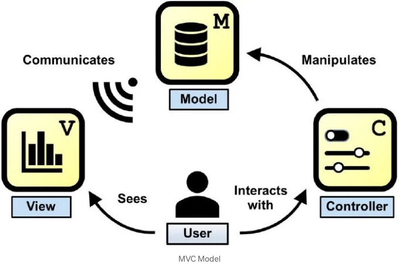

프론트엔드 개발 영역에서는 건강하고 확장 가능한 애플리케이션을 구축하기 위해 아키텍처 패턴을 이해하는 것이 중요합니다. React 아키텍처를 전통적인 Model-View-Controller (MVC) 패턴과 비교하고 React의 단방향 데이터 흐름이 빛나는 이유에 대해 알아봅시다:

## MVC (Model-View-Controller).

MVC는 애플리케이션을 세 가지 서로 연결된 구성 요소로 나누는 널리 사용되는 아키텍처 패턴입니다:

<!-- ui-log 수평형 -->
<ins class="adsbygoogle"
  style="display:block"
  data-ad-client="ca-pub-4877378276818686"
  data-ad-slot="9743150776"
  data-ad-format="auto"
  data-full-width-responsive="true"></ins>
<component is="script">
(adsbygoogle = window.adsbygoogle || []).push({});
</component>

- 모델: 어플리케이션의 데이터 및 비즈니스 로직을 나타냅니다.
- 뷰: 사용자 인터페이스를 표시하고 사용자와 상호 작용합니다.
- 컨트롤러: 모델과 뷰 사이의 중재자 역할을 하며, 사용자 입력을 처리하고 모델이나 뷰를 업데이트합니다.

MVC는 수십 년 동안 프런트엔드 개발의 기본 요소였지만 몇 가지 제한 사항이 있습니다. 예를 들면:

- 복잡한 데이터 흐름: 애플리케이션이 복잡해질수록 컴포넌트 간의 데이터 흐름 및 상태 동기화를 관리하는 것이 어려워질 수 있습니다.
- 양방향 데이터 바인딩: MVC의 양방향 데이터 바인딩은 예측할 수 없는 동작을 유발하고 디버깅 및 상태 변경 추적을 어렵게 만들 수 있습니다.
- 스파게티 코드: 대규모 애플리케이션에서 MVC 구성 요소의 상호 연결된 성격은 뒤얽혀 유지하기 어렵고 유지보수가 어렵게 만들 수 있습니다.

<!-- ui-log 수평형 -->
<ins class="adsbygoogle"
  style="display:block"
  data-ad-client="ca-pub-4877378276818686"
  data-ad-slot="9743150776"
  data-ad-format="auto"
  data-full-width-responsive="true"></ins>
<component is="script">
(adsbygoogle = window.adsbygoogle || []).push({});
</component>

## 리액트 아키텍처: 단방향 데이터 흐름.

리액트는 구성 요소 중심 아키텍처와 단방향 데이터 흐름 패턴을 통해 다른 접근 방식을 취하며, MVC보다 여러 이점을 제공합니다.

- 구성 요소 중심: 리액트는 UI를 재사용 가능한 구성 요소로 분해하며, 각 구성 요소가 자체 상태와 렌더링 로직을 담당합니다. 이 모듈식 접근 방식은 코드 재사용성을 촉진하고 유지 보수를 간소화합니다.
- 가상 DOM: 리액트의 가상 DOM은 변경된 구성 요소만 효율적으로 업데이트하여 DOM 조작을 최소화하고 성능을 향상시킵니다.
- 단방향 데이터 흐름: 리액트는 상위 컴포넌트에서 하위 컴포넌트로 데이터가 props를 통해 아래로 흐르는 단방향 데이터 흐름을 강제합니다. 이 데이터의 한 방향 흐름은 응용 프로그램 상태를 예측 가능하게 만들고 이해하기 쉽게 합니다.
- 불변 데이터: 리액트는 변경할 수 없는 데이터 구조와 순수 함수의 사용을 장려하여 예상치 못한 부작용을 방지하고 상태 관리를 간소화합니다.

<!-- ui-log 수평형 -->
<ins class="adsbygoogle"
  style="display:block"
  data-ad-client="ca-pub-4877378276818686"
  data-ad-slot="9743150776"
  data-ad-format="auto"
  data-full-width-responsive="true"></ins>
<component is="script">
(adsbygoogle = window.adsbygoogle || []).push({});
</component>

단방향 데이터 흐름과 컴포넌트 기반 아키텍처를 포용함으로써 React는 전통적인 MVC 패턴과 비교하여 더 확장 가능하고 유지보수하기 쉬운 해결책을 제공합니다. React를 사용하면 데이터 흐름이 예측 가능하고 코드 기반이 모듈화되어 유지하기 쉬운 것을 알고 복잡한 사용자 인터페이스를 자신 있게 구축할 수 있습니다.

## 요약:

React 아키텍처와 전통적인 MVC 패턴의 비교에서 React의 단방향 데이터 흐름이 두드러집니다. MVC는 복잡한 데이터 흐름과 양방향 바인딩에 의존하는 반면, React의 컴포넌트 기반 접근 방식과 가상 DOM은 개발 프로세스를 효율적으로 만들어줍니다. React를 통해 데이터가 단방향으로 흘러가면 상태 관리가 간단해지고 코드 재사용성을 촉진할 수 있습니다. React 아키텍처를 포용함으로써, 예측 가능한 데이터 흐름과 모듈화된 코드 기반 덕분에 개발자는 신뢰를 가지고 확장 가능한 애플리케이션을 구축할 수 있습니다.

MVC에 비해 React의 아키텍처에 어떤 의견이 있으신가요?

<!-- ui-log 수평형 -->
<ins class="adsbygoogle"
  style="display:block"
  data-ad-client="ca-pub-4877378276818686"
  data-ad-slot="9743150776"
  data-ad-format="auto"
  data-full-width-responsive="true"></ins>
<component is="script">
(adsbygoogle = window.adsbygoogle || []).push({});
</component>

#리액트 #MVC #아키텍처 #프론트엔드개발 #단방향데이터흐름

만약 이 글이 유용했다면 친근하게 클랩(clap)을 주시면 감사하겠습니다.