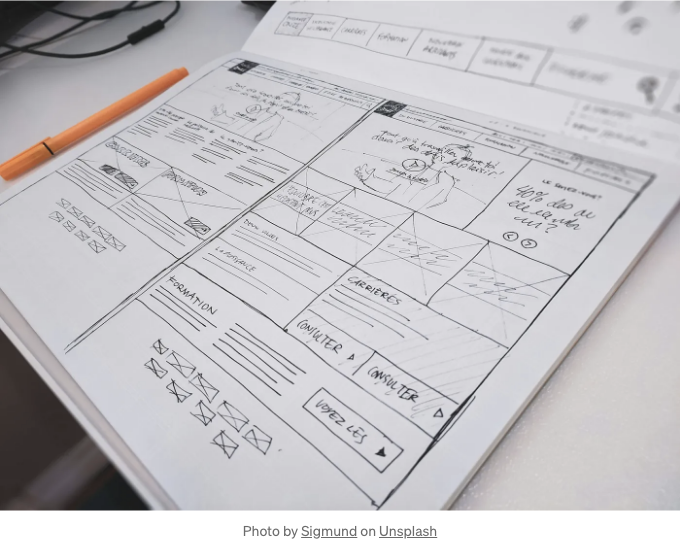

## 애플리케이션 전체에서 일관된 사용자 경험 제공



React의 레이아웃 구성요소 패턴은 개발자가 애플리케이션의 구조와 레이아웃을 구성하는 데 도움이 되는 디자인 패턴입니다. 이러한 구성요소는 주로 어떻게 보이고 페이지 상에 어디에 배치되는지에 관심이 있으며 작동 방식과는 관련이 없습니다.

레이아웃 구성요소 패턴의 주요 아이디어는 구성요소가 표시되는 위치를 인식하면 안 되며, 레이아웃 구성요소 패턴은 해당 구성요소를 표시하는 데만 관심을 가져야 한다는 것입니다.

<!-- ui-log 수평형 -->
<ins class="adsbygoogle"
  style="display:block"
  data-ad-client="ca-pub-4877378276818686"
  data-ad-slot="9743150776"
  data-ad-format="auto"
  data-full-width-responsive="true"></ins>
<component is="script">
(adsbygoogle = window.adsbygoogle || []).push({});
</component>

리액트 개발에서는 네비게이션 바나 푸터와 같은 유사한 콘텐츠나 컴포넌트를 여러 페이지에서 공유하는 것이 일반적입니다. 각 페이지마다 이러한 컴포넌트를 가져와 렌더링하는 대신, 레이아웃 컴포넌트 패턴을 활용하여 이 프로세스를 간소화할 수 있습니다. 레이아웃 컴포넌트는 사실상 애플리케이션의 레이아웃을 정의하는 방법으로, 코드를 한 번 작성하고 애플리케이션 전체에서 재사용할 수 있도록 해줍니다. 이는 그리드 시스템이나 플렉스 박스 모델을 기반으로 한 레이아웃을 구현하는 데 특히 유용할 수 있습니다.

여러 페이지에서 Header와 Footer를 공유하는 레이아웃 컴포넌트의 기본 예제를 살펴봅시다.

먼저, Header와 Footer를 포함하고 자식 컴포넌트를 렌더링하는 Layout 컴포넌트를 정의해야합니다:

```js
import React from 'react';
import Header from './Header';
import Footer from './Footer';

const Layout = ({ children }) => {
  return (
    <>
      <Header />
      {children}
      <Footer />
    </>
  );
}

export default Layout;
```

<!-- ui-log 수평형 -->
<ins class="adsbygoogle"
  style="display:block"
  data-ad-client="ca-pub-4877378276818686"
  data-ad-slot="9743150776"
  data-ad-format="auto"
  data-full-width-responsive="true"></ins>
<component is="script">
(adsbygoogle = window.adsbygoogle || []).push({});
</component>

이 예에서 {children}은 React에서 특별한 속성(prop)으로, 다른 컴포넌트로 데이터를 전달할 수 있게 해줍니다. 여기에서 정의된 Layout 컴포넌트는 항상 Header와 Footer를 렌더링하고, 그리고 전달된 자식 컴포넌트들을 렌더링합니다.

다음으로, 이 Layout 컴포넌트를 메인 애플리케이션이나 개별 페이지에서 사용할 수 있습니다:

```js
import React from 'react';
import Layout from './Layout';

const HomePage = () => {
  return (
    <Layout>
      <h1>홈페이지에 오신 것을 환영합니다!</h1>
      <p>이것은 홈페이지에 특화된 내용입니다.</p>
    </Layout>
  );
}

export default HomePage;
```

HomePage 컴포넌트에서는 Layout 컴포넌트를 사용하여 홈페이지를 위한 특정 내용을 감싸고 있습니다. 이는 Header와 Footer가 Layout 컴포넌트를 사용하는 모든 페이지에서 공유되어, 여러 페이지에 걸쳐 일반적으로 사용되는 섹션을 재사용할 수 있도록 해줍니다.

<!-- ui-log 수평형 -->
<ins class="adsbygoogle"
  style="display:block"
  data-ad-client="ca-pub-4877378276818686"
  data-ad-slot="9743150776"
  data-ad-format="auto"
  data-full-width-responsive="true"></ins>
<component is="script">
(adsbygoogle = window.adsbygoogle || []).push({});
</component>

# 결론

React에서 레이아웃 컴포넌트 패턴을 사용하면 더 유지보수 가능하고 확장 가능하며 깔끔한 코드베이스를 구축할 수 있습니다. 또한 응용 프로그램 전체에서 일관된 사용자 경험을 제공할 수 있습니다.

읽어 주셔서 감사합니다. 의견이나 제안사항이 있으시면 아래에 댓글을 남겨 주세요.

트위터, 깃허브, 링크드인에서 저를 팔로우하실 수 있습니다.

<!-- ui-log 수평형 -->
<ins class="adsbygoogle"
  style="display:block"
  data-ad-client="ca-pub-4877378276818686"
  data-ad-slot="9743150776"
  data-ad-format="auto"
  data-full-width-responsive="true"></ins>
<component is="script">
(adsbygoogle = window.adsbygoogle || []).push({});
</component>

표를 마크다운 형식으로 변경하세요.