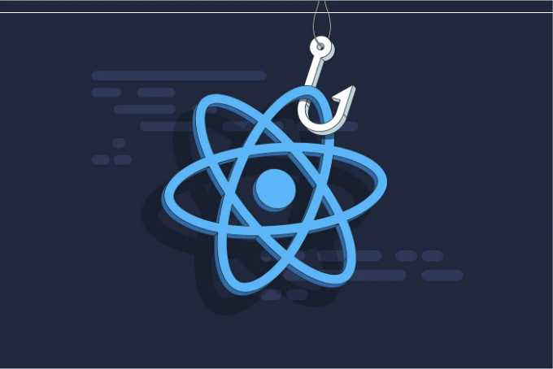

소개



React 개발 영역에서 16.8 버전부터 도입된 훅은 중요한 이정표가 되었습니다. 이러한 훅은 개발자들이 함수형 컴포넌트 내에서 상태 및 다른 React 기능을 제어할 수 있는 패러다임 전환을 제공합니다. 이 문서는 훅의 세계에 관해 깊이 파헤치며, React 개발을 간소화하는 데 그들의 능력을 소개합니다.

훅 이해하기:

<!-- ui-log 수평형 -->
<ins class="adsbygoogle"
  style="display:block"
  data-ad-client="ca-pub-4877378276818686"
  data-ad-slot="9743150776"
  data-ad-format="auto"
  data-full-width-responsive="true"></ins>
<component is="script">
(adsbygoogle = window.adsbygoogle || []).push({});
</component>

훅은 React 애플리케이션에서 상태(state)와 사이드 이펙트(side effects)를 관리하기 위한 새로운 접근법을 제공합니다. 몇 가지 주요 개념을 알아보겠습니다:

1. useState 훅:

- useState 훅은 함수형 컴포넌트에서 로컬 상태를 관리할 수 있게 해줍니다.
- 이 훅은 상태 값을 반환하고 이를 업데이트하는 함수를 제공하는데, 이는 클래스 컴포넌트의 this.setState와 유사합니다.

```js
import React, { useState } from 'react';

function Counter() {
  const [count, setCount] = useState(0);

  return (
    <div>
      <p>You clicked {count} times</p>
      <button onClick={() => setCount(count + 1)}>
        Click me
      </button>
    </div>
  );
}
```

<!-- ui-log 수평형 -->
<ins class="adsbygoogle"
  style="display:block"
  data-ad-client="ca-pub-4877378276818686"
  data-ad-slot="9743150776"
  data-ad-format="auto"
  data-full-width-responsive="true"></ins>
<component is="script">
(adsbygoogle = window.adsbygoogle || []).push({});
</component>

2. useEffect 훅:

- useEffect 훅은 함수형 컴포넌트에서 부작용을 수행할 수 있게 합니다.
- 렌더링 후에 실행되며, componentDidMount, componentDidUpdate, 그리고 componentWillUnmount와 같은 라이프사이클 메서드를 대체합니다.

```js
import React, { useState, useEffect } from 'react';

function Timer() {
  const [seconds, setSeconds] = useState(0);

  useEffect(() => {
    const interval = setInterval(() => {
      setSeconds(seconds + 1);
    }, 1000);
    return () => clearInterval(interval);
  }, [seconds]);

  return <p>Seconds: {seconds}</p>;
}
```

3. 커스텀 훅:

<!-- ui-log 수평형 -->
<ins class="adsbygoogle"
  style="display:block"
  data-ad-client="ca-pub-4877378276818686"
  data-ad-slot="9743150776"
  data-ad-format="auto"
  data-full-width-responsive="true"></ins>
<component is="script">
(adsbygoogle = window.adsbygoogle || []).push({});
</component>

- 커스텀 후크를 사용하면 개발자가 컴포넌트 간에 상태를 재사용할 수 있어요.
- 이들은 use로 시작하는 일반적인 JavaScript 함수들이에요.

```js
import { useState } from 'react';

function useFormInput(initialValue) {
  const [value, setValue] = useState(initialValue);
  const handleChange = (e) => setValue(e.target.value);
  return {
    value,
    onChange: handleChange
  };
}


function MyForm() {
  const username = useFormInput('');
  const password = useFormInput('');

  return (
    <form>
      <input type="text" {...username} />
      <input type="password" {...password} />
    </form>
  );
}
```

## 후크의 장점:

- 간소화된 로직: 후크를 사용하면 로직을 재사용 가능한 함수로 캡슐화하여 코드를 깔끔하고 가독성 있는 형태로 만들 수 있어요.
- 향상된 코드 재사용성: 커스텀 후크를 통해 고차 컴포넌트나 렌더 프롭 없이도 컴포넌트 간에 로직을 공유할 수 있어요.
- 향상된 성능: 후크를 사용하면 메모이제이션 기술을 활용하여 컴포넌트를 최적화하고 불필요한 다시 렌더링을 피할 수 있어요.

<!-- ui-log 수평형 -->
<ins class="adsbygoogle"
  style="display:block"
  data-ad-client="ca-pub-4877378276818686"
  data-ad-slot="9743150776"
  data-ad-format="auto"
  data-full-width-responsive="true"></ins>
<component is="script">
(adsbygoogle = window.adsbygoogle || []).push({});
</component>

## 결론:

훅스는 함수형 컴포넌트에서 상태와 사이드 이펙트를 관리하는 더 간단하고 직관적인 방법을 제공하여 React 개발을 혁신했습니다. 훅스를 사용하면 코드 재사용성이 증가하고 컴포넌트 캡슐화가 개선되며, 궁극적으로 개발자 경험이 향상됩니다.

훅스를 효과적으로 활용함으로써, 개발자들은 유지보수 가능하고 확장 가능한 React 애플리케이션을 더 쉽게 구축할 수 있습니다.