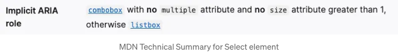
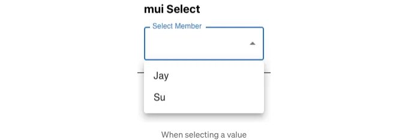
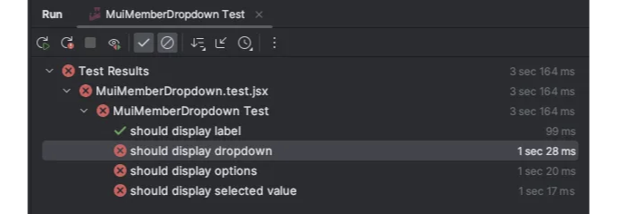

# 배경

제가 디자이너와 협업을 할 수 있다는 것은 얼마나 운이 좋은 일인지 표현하고 싶습니다. Tanzu Labs에서는 제품 매니저, 제품 디자이너 및 엔지니어를 포함한 "균형있는" 팀에서 일합니다. 따라서 사용자 경험이나 각 UI 구성 요소가 어떻게 보이는지에 대해 너무 걱정할 필요가 없습니다. 이상한 부분이 있으면 피드백을 공유할 수 있지만, 디자이너는 시각적으로 매력적인 디자인을 만들기 위해 최선을 다합니다.

그러나 최근 제품 디자이너 없이 프로젝트에 참여하게 되었습니다. 처음에는 디자인 접근 방식과 각 구성 요소의 외관을 결정하는 방법에 대해 몇 가지 우려가 있었습니다.

# Material UI 소개

<!-- ui-log 수평형 -->
<ins class="adsbygoogle"
  style="display:block"
  data-ad-client="ca-pub-4877378276818686"
  data-ad-slot="9743150776"
  data-ad-format="auto"
  data-full-width-responsive="true"></ins>
<component is="script">
(adsbygoogle = window.adsbygoogle || []).push({});
</component>

며칠 전에 Material UI에 대해 들었지만 실제 프로젝트에서 사용한 적은 없어서 아쉬웠어요. 시각적 디자인이 좋아서 제품에 적합한 구성 요소를 제공하는 것이 좋았어요. 다음으로 고민한 것은 Material UI와 함께 작업할 때 테스트를 작성할 수 있는지였죠.

이 기사에서는 지난 프로젝트에서 가장 많이 사용한 Material UI 구성 요소 중 일부를 살펴보겠습니다. 각 구성 요소에 대해 Material UI와 함께 또는 Material UI 없이 테스트 코드를 작성하는 방법을 살펴보고 테스트 코드에 필요한 수정 사항을 확인해보겠습니다.

# Material UI 설정하기

React 프로젝트에 새로운 종속성을 추가하세요. 설치에 대한 자세한 내용은 여기 공식 문서에서 찾을 수 있습니다.

<!-- ui-log 수평형 -->
<ins class="adsbygoogle"
  style="display:block"
  data-ad-client="ca-pub-4877378276818686"
  data-ad-slot="9743150776"
  data-ad-format="auto"
  data-full-width-responsive="true"></ins>
<component is="script">
(adsbygoogle = window.adsbygoogle || []).push({});
</component>

```js
npm install @mui/material @emotion/react @emotion/styled
```

프로젝트에서 가장 많이 사용한 몇 가지 구성 요소로 넘어가 보겠습니다.

# 구성 요소

# 1. TextField
```

<!-- ui-log 수평형 -->
<ins class="adsbygoogle"
  style="display:block"
  data-ad-client="ca-pub-4877378276818686"
  data-ad-slot="9743150776"
  data-ad-format="auto"
  data-full-width-responsive="true"></ins>
<component is="script">
(adsbygoogle = window.adsbygoogle || []).push({});
</component>

## 구현 (기본)

간단한 텍스트 입력란과 레이블을 가진 것을 상상해봅시다.

```js
const TextInput = () => {
  const [value, setValue] = useState("");

  return (
    <div>
      <h3>Default</h3>
      <label htmlFor="name-input">Name</label>
      <input
        data-testid="name-input"
        id="name-input"
        type="text"
        placeholder="이름을 입력하세요"
        value={value}
        onChange={(event) => {
          setValue(event.target.value);
        }}
      />
    </div>
  );
};

export default TextInput;
```

이 컴포넌트는 다음과 같이 보입니다:

<!-- ui-log 수평형 -->
<ins class="adsbygoogle"
  style="display:block"
  data-ad-client="ca-pub-4877378276818686"
  data-ad-slot="9743150776"
  data-ad-format="auto"
  data-full-width-responsive="true"></ins>
<component is="script">
(adsbygoogle = window.adsbygoogle || []).push({});
</component>


## 테스트 (기본)

이 컴포넌트는 다양한 방법으로 테스트할 수 있어요. 원하는 요소를 어떻게 쿼리할지에 대한 선호도가 다를 수 있으니, 마음에 드는 방법을 자유롭게 사용하세요.

```js
import { render, screen } from "@testing-library/react";
import TextInput from "./TextInput";
import userEvent from "@testing-library/user-event";

describe("TextInput Tests", () => {
  it("플레이스홀더 텍스트 사용 테스트", async () => {
    render(<TextInput />);

    const input = await screen.findByPlaceholderText("이름을 입력하세요");
    await userEvent.type(input, "제이");
    expect(input).toHaveValue("제이");
  });

  it("라벨 사용 테스트", async () => {
    render(<TextInput />);

    const input = await screen.findByLabelText("이름");
    await userEvent.type(input, "제이");
    expect(input).toHaveValue("제이");
  });

  it("테스트 ID 사용 테스트", async () => {
    render(<TextInput />);

    const input = await screen.findByTestId("name-input");
    await userEvent.type(input, "제이");
    expect(input).toHaveValue("제이");
  });
});
```

<!-- ui-log 수평형 -->
<ins class="adsbygoogle"
  style="display:block"
  data-ad-client="ca-pub-4877378276818686"
  data-ad-slot="9743150776"
  data-ad-format="auto"
  data-full-width-responsive="true"></ins>
<component is="script">
(adsbygoogle = window.adsbygoogle || []).push({});
</component>

## 구현 (Material UI와 함께)

자, 이제 Material UI TextField를 사용하여 변환해 봅시다. 구현 측면에서 몇 가지 차이점이 있습니다. 라벨은 TextField 컴포넌트 내부의 속성 중 하나입니다. 그 외에도 data-testid를 사용하여 테스트를 작성하려면 inputProps 속성으로 전달해야 합니다.

```js
import { TextField } from "@mui/material";
import { useState } from "react";

const MuiTextInput = () => {
  const [value, setValue] = useState("");

  return (
    <div>
      <h3>mui TextField</h3>
      <TextField
        inputProps={{ "data-testid": "name-input" }}
        label="Name"
        variant="outlined"
        placeholder="이름을 입력하세요"
        value={value}
        onChange={(event) => {
          setValue(event.target.value);
        }}
      />
    </div>
  );
};

export default MuiTextInput;
```


<!-- ui-log 수평형 -->
<ins class="adsbygoogle"
  style="display:block"
  data-ad-client="ca-pub-4877378276818686"
  data-ad-slot="9743150776"
  data-ad-format="auto"
  data-full-width-responsive="true"></ins>
<component is="script">
(adsbygoogle = window.adsbygoogle || []).push({});
</component>


## Material UI를 사용하여 테스트하기

테스트 코드에서는 아무것도 변경되지 않습니다. 참고용으로 전체 테스트 코드가 여기 있습니다.

```js
import { render, screen } from "@testing-library/react";
import userEvent from "@testing-library/user-event";
import MuiTextInput from "./MuiTextInput";

describe("TextInput 테스트", () => {
  it("플레이스홀더 텍스트 사용 테스트", async () => {
    render(<MuiTextInput />);

    const input = await screen.findByPlaceholderText("이름을 입력하세요");
    await userEvent.type(input, "제이");
    expect(input).toHaveValue("제이");
  });

  it("라벨 사용 테스트", async () => {
    render(<MuiTextInput />);

    const input = await screen.findByLabelText("이름");
    await userEvent.type(input, "제이");
    expect(input).toHaveValue("제이");
  });

  it("테스트 ID 사용 테스트", async () => {
    render(<MuiTextInput />);

    const input = await screen.findByTestId("name-input");
    await userEvent.type(input, "제이");
    expect(input).toHaveValue("제이");
  });
});
```

<!-- ui-log 수평형 -->
<ins class="adsbygoogle"
  style="display:block"
  data-ad-client="ca-pub-4877378276818686"
  data-ad-slot="9743150776"
  data-ad-format="auto"
  data-full-width-responsive="true"></ins>
<component is="script">
(adsbygoogle = window.adsbygoogle || []).push({});
</component>

# 2. TextField을 Textarea로 사용하기

## 구현 방법

일반적으로 텍스트 입력에는 `input /`이 사용되고 여러 줄 입력에는 `textarea /`가 사용됩니다. 다행히, TextField 컴포넌트는 아주 적은 노력으로 textarea로 변환할 수 있습니다. 또한, 테스트 코드를 수정할 필요가 없습니다.

필요한 유일한 변경 사항은 multiline prop을 추가하는 것입니다. textarea가 기본적으로 더 많은 공간을 차지하도록 하려면 minRows를 추가할 수 있습니다.

<!-- ui-log 수평형 -->
<ins class="adsbygoogle"
  style="display:block"
  data-ad-client="ca-pub-4877378276818686"
  data-ad-slot="9743150776"
  data-ad-format="auto"
  data-full-width-responsive="true"></ins>
<component is="script">
(adsbygoogle = window.adsbygoogle || []).push({});
</component>

```js
import { TextField } from "@mui/material";
import { useState } from "react";

const MuiTextArea = () => {
  const [value, setValue] = useState("");

  return (
    <div>
      <h3>mui TextField을 텍스트 영역으로 사용하기</h3>
      <TextField
        multiline={true}
        minRows={3}
        inputProps={ { "data-testid": "name-input" } }
        label="이름"
        variant="outlined"
        placeholder="이름을 입력해주세요"
        value={value}
        onChange={(event) => {
          setValue(event.target.value);
        }}
      />
    </div>
  );
};

export default MuiTextArea;
```

Label과 placeholder 텍스트의 동작 방식은 TextField와 동일합니다.


```

<!-- ui-log 수평형 -->
<ins class="adsbygoogle"
  style="display:block"
  data-ad-client="ca-pub-4877378276818686"
  data-ad-slot="9743150776"
  data-ad-format="auto"
  data-full-width-responsive="true"></ins>
<component is="script">
(adsbygoogle = window.adsbygoogle || []).push({});
</component>

## 테스트

텍스트 필드 테스트 코드와 차이가 없어요. 참고용으로, 테스트 코드는 아래와 같아요:

```js
import { render, screen } from "@testing-library/react";
import userEvent from "@testing-library/user-event";
import MuiTextArea from "./MuiTextArea";

describe("텍스트영역 테스트", () => {
  it("플레이스홀더 텍스트 사용 테스트", async () => {
    render(<MuiTextArea />);

    const input = await screen.findByPlaceholderText("이름을 입력해주세요");
    await userEvent.type(input, "제이");
    expect(input).toHaveValue("제이");
  });

  it("라벨 사용 테스트", async () => {
    render(<MuiTextArea />);

    const input = await screen.findByLabelText("이름");
    await userEvent.type(input, "제이");
    expect(input).toHaveValue("제이");
  });

  it("테스트 ID 사용 테스트", async () => {
    render(<MuiTextArea />);

    const input = await screen.findByTestId("name-input");
    await userEvent.type(input, "제이");
    expect(input).toHaveValue("제이");
  });
});
```

### 3. 입력 레이블이 있는 선택하기

<!-- ui-log 수평형 -->
<ins class="adsbygoogle"
  style="display:block"
  data-ad-client="ca-pub-4877378276818686"
  data-ad-slot="9743150776"
  data-ad-format="auto"
  data-full-width-responsive="true"></ins>
<component is="script">
(adsbygoogle = window.adsbygoogle || []).push({});
</component>

## 구현 (기본)

멤버의 드롭다운 목록을 만들어 보겠습니다. 선택된 멤버의 id를 얻고 싶다고 가정합니다.

```js
import { useState } from "react";

const MemberDropdown = () => {
  const members = [
    { id: 1, name: "Jay" },
    { id: 2, name: "Su" },
  ];

  const [name, setName] = useState("");

  return (
    <div>
      <h3>Default</h3>
      <label htmlFor="name-select">멤버 선택</label>
      <select
        id="name-select"
        value={name}
        onChange={(e) => {
          setName(e.target.value);
        }
      >
        <option value=""></option>
        {members.map((m) => (
          <option key={m.id} value={m.id}>
            {m.name}
          </option>
        ))}
      </select>
    </div>
  );
};

export default MemberDropdown;
```

이 컴포넌트는 다음과 같이 보입니다:


<!-- ui-log 수평형 -->
<ins class="adsbygoogle"
  style="display:block"
  data-ad-client="ca-pub-4877378276818686"
  data-ad-slot="9743150776"
  data-ad-format="auto"
  data-full-width-responsive="true"></ins>
<component is="script">
(adsbygoogle = window.adsbygoogle || []).push({});
</component>


ARIA 역할을 사용하여 테스트를 작성할 수 있습니다. MDN에서 `select /`가 combobox이고, 이 경우 `option /`은 option 역할을 갖는다고 언급합니다.



<!-- ui-log 수평형 -->
<ins class="adsbygoogle"
  style="display:block"
  data-ad-client="ca-pub-4877378276818686"
  data-ad-slot="9743150776"
  data-ad-format="auto"
  data-full-width-responsive="true"></ins>
<component is="script">
(adsbygoogle = window.adsbygoogle || []).push({});
</component>

## 테스트 (기본)

테스트 코드를 살펴봅시다.

```js
import { render, screen } from "@testing-library/react";
import MemberDropdown from "./MemberDropdown";
import userEvent from "@testing-library/user-event";

describe("MemberDropdown Test", () => {
  it("라벨을 표시해야 합니다", async () => {
    render(<MemberDropdown />);

    expect(await screen.findByLabelText("Select Member")).toBeInTheDocument();
  });

  it("드롭다운을 표시해야 합니다", async () => {
    render(<MemberDropdown />);

    expect(await screen.findByRole("combobox")).toBeInTheDocument();
  });

  it("옵션들을 표시해야 합니다", async () => {
    render(<MemberDropdown />);

    expect(await screen.findByRole("option", { name: "" })).toBeInTheDocument();
    expect(screen.getByRole("option", { name: "Jay" })).toBeInTheDocument();
    expect(screen.getByRole("option", { name: "Su" })).toBeInTheDocument();
  });

  it("선택된 값을 표시해야 합니다", async () => {
    render(<MemberDropdown />);

    const dropdown = await screen.findByRole("combobox");
    expect(dropdown).toHaveValue("");
    await userEvent.selectOptions(dropdown, "Jay");
    expect(dropdown).toHaveValue("1");
  });
});
```

## 구현 (Material UI와 함께)

<!-- ui-log 수평형 -->
<ins class="adsbygoogle"
  style="display:block"
  data-ad-client="ca-pub-4877378276818686"
  data-ad-slot="9743150776"
  data-ad-format="auto"
  data-full-width-responsive="true"></ins>
<component is="script">
(adsbygoogle = window.adsbygoogle || []).push({});
</component>

Let’s convert to Material UI by using InputLabel and Select components.

```js
import { FormControl, InputLabel, MenuItem, Select } from "@mui/material";
import { useState } from "react";

const MuiMemberDropdown = () => {
  const members = [
    { id: 1, name: "Jay" },
    { id: 2, name: "Su" },
  ];

  const [name, setName] = useState("");

  return (
    <div>
      <h3>mui Select</h3>
      <FormControl
        fullWidth={true}
        sx={{
          width: "200px",
        }}
      >
        <InputLabel id="name-select-label">Select Member</InputLabel>
        <Select
          data-testid="name-select"
          labelId="name-select-label"
          id="name-select"
          label="Select Member"
          value={name}
          onChange={(e) => {
            setName(e.target.value);
          }}
        >
          {members.map((m) => {
            return (
              <MenuItem key={m.id} value={m.id}>
                {m.name}
              </MenuItem>
            );
          })}
        </Select>
      </FormControl>
    </div>
  );
};

export default MuiMemberDropdown;
```

The result of this looks like this when rendered:


<!-- ui-log 수평형 -->
<ins class="adsbygoogle"
  style="display:block"
  data-ad-client="ca-pub-4877378276818686"
  data-ad-slot="9743150776"
  data-ad-format="auto"
  data-full-width-responsive="true"></ins>
<component is="script">
(adsbygoogle = window.adsbygoogle || []).push({});
</component>



## 테스트 (Material UI와 함께)

이전에 실행했던 같은 테스트 코드를 실행하면 기본적으로 모든 테스트가 실패합니다...



<!-- ui-log 수평형 -->
<ins class="adsbygoogle"
  style="display:block"
  data-ad-client="ca-pub-4877378276818686"
  data-ad-slot="9743150776"
  data-ad-format="auto"
  data-full-width-responsive="true"></ins>
<component is="script">
(adsbygoogle = window.adsbygoogle || []).push({});
</component>

우리는 비슷한 동작을 테스트하기 위해 테스트 코드를 수정해야 합니다. 테이블 태그를 Markdown 형식으로 변경해 봅시다.

이미지를 확인해보세요. 콤보박스 역할은 더 이상 적용되지 않습니다. 흥미롭게도 드롭다운은 버튼 역할을 가지고 있습니다.

또한, 테스트 코드에서는 테스트 ID가 사용되었습니다. 이것은 선호되는 해결책은 아닐 수 있지만, 한 페이지에 여러 드롭다운이 포함될 수 있는 경우를 대비해 사용됩니다. 그럼에도 특정 드롭다운을 선택하는 데 테스트 ID를 사용할 수 있습니다. 특정 드롭다운을 타겟팅하는 더 나은 방법이 있는지 궁금합니다. 이에 대한 답을 알고 계신다면 알려주세요.

```js
import { render, screen, within } from "@testing-library/react";
import userEvent from "@testing-library/user-event";
import MuiMemberDropdown from "./MuiMemberDropdown";

describe("MuiMemberDropdown 테스트", () => {
  it("레이블이 표시되어야 합니다", async () => {
    render(<MuiMemberDropdown />);

    expect(await screen.findByLabelText("Select Member")).toBeInTheDocument();
  });

  it("드롭다운이 표시되어야 합니다", async () => {
    render(<MuiMemberDropdown />);

    expect(
      within(await screen.findByTestId("name-select")).getByRole("button"),
    ).toBeInTheDocument();
  });

  it("옵션이 표시되어야 합니다", async () => {
    render(<MuiMemberDropdown />);

    const dropdown = within(await screen.findByTestId("name-select")).getByRole(
      "button",
    );
    await userEvent.click(dropdown);
    expect(
      await screen.findByRole("option", { name: "Jay" }),
    ).toBeInTheDocument();
    expect(screen.getByRole("option", { name: "Su" })).toBeInTheDocument();
  });

  it("선택한 값을 표시해야 합니다", async () => {
    render(<MuiMemberDropdown />);

    const dropdown = within(await screen.findByTestId("name-select")).getByRole(
      "button",
    );
    await userEvent.click(dropdown);
    await userEvent.click(await screen.findByRole("option", { name: "Jay" }));
    expect(screen.getByText("Jay")).toBeInTheDocument();
  });
});
```

<!-- ui-log 수평형 -->
<ins class="adsbygoogle"
  style="display:block"
  data-ad-client="ca-pub-4877378276818686"
  data-ad-slot="9743150776"
  data-ad-format="auto"
  data-full-width-responsive="true"></ins>
<component is="script">
(adsbygoogle = window.adsbygoogle || []).push({});
</component>

## 4. 버튼

## 구현 (기본)

버튼은 Material UI를 적용할 때 가장 쉬운 요소 중 하나입니다. 간단한 버튼부터 시작해봅시다.

```js
const SimpleButton = ({ onClick }) => {
  return <button onClick={onClick}>여기를 클릭해주세요</button>;
};

export default SimpleButton;
```

<!-- ui-log 수평형 -->
<ins class="adsbygoogle"
  style="display:block"
  data-ad-client="ca-pub-4877378276818686"
  data-ad-slot="9743150776"
  data-ad-format="auto"
  data-full-width-responsive="true"></ins>
<component is="script">
(adsbygoogle = window.adsbygoogle || []).push({});
</component>

```markdown


## 테스트 (기본)

ARIA 역할을 다시 사용하여 테스트 코드는 매우 간단합니다.

```js
import { render, screen, waitFor } from "@testing-library/react";
import SimpleButton from "./SimpleButton";
import userEvent from "@testing-library/user-event";

describe("SimpleButton Tests", () => {
  it("버튼과 텍스트가 표시되어야 합니다", async () => {
    render(<SimpleButton />);

    expect(
      await screen.findByRole("button", { name: "Click Here" }),
    ).toBeInTheDocument();
  });

  it("버튼을 클릭할 때 클릭 핸들러 함수가 실행되어야 합니다", async () => {
    const mockOnClickHandler = jest.fn();
    render(<SimpleButton onClick={mockOnClickHandler} />);

    const button = await screen.findByRole("button", { name: "Click Here" });
    await userEvent.click(button);
    await waitFor(() => {
      expect(mockOnClickHandler).toHaveBeenCalled();
    });
    // 버튼 클릭 후 화면에 무언가가 발생하는 지 확인하는 것이 더 나은 테스트입니다
  });
});
```
```  

<!-- ui-log 수평형 -->
<ins class="adsbygoogle"
  style="display:block"
  data-ad-client="ca-pub-4877378276818686"
  data-ad-slot="9743150776"
  data-ad-format="auto"
  data-full-width-responsive="true"></ins>
<component is="script">
(adsbygoogle = window.adsbygoogle || []).push({});
</component>

## 구현 (Material UI로)

Material UI 버튼으로 변환해 봅시다.

```js
import { Button } from "@mui/material";

const MuiSimpleButton = ({ onClick }) => {
  return (
    <Button variant="outlined" color="success" onClick={onClick}>
      Click Here
    </Button>
  );
};

export default MuiSimpleButton;
```

위와 같이 보입니다.

<!-- ui-log 수평형 -->
<ins class="adsbygoogle"
  style="display:block"
  data-ad-client="ca-pub-4877378276818686"
  data-ad-slot="9743150776"
  data-ad-format="auto"
  data-full-width-responsive="true"></ins>
<component is="script">
(adsbygoogle = window.adsbygoogle || []).push({});
</component>


## 테스트 (Material UI 사용 시)

이전과 동일한 테스트 코드를 사용할 수 있습니다. 각 테스트에서 렌더링되는 컴포넌트만 변경하면 됩니다. 참고용으로 여기에 테스트 코드를 제공합니다.

```js
import { render, screen, waitFor } from "@testing-library/react";
import userEvent from "@testing-library/user-event";
import MuiSimpleButton from "./MuiSimpleButton";

describe("MuiSimpleButton 테스트", () => {
  it("텍스트가 있는 버튼을 표시해야 합니다", async () => {
    render(<MuiSimpleButton />);

    expect(
      await screen.findByRole("button", { name: "Click Here" }),
    ).toBeInTheDocument();
  });

  it("버튼을 클릭하면 클릭 핸들러 함수가 실행되어야 합니다", async () => {
    const mockOnClickHandler = jest.fn();
    render(<MuiSimpleButton onClick={mockOnClickHandler} />);

    const button = await screen.findByRole("button", { name: "Click Here" });
    await userEvent.click(button);
    await waitFor(() => {
      expect(mockOnClickHandler).toHaveBeenCalled();
    });
    // 버튼 클릭 후 화면에서 어떤 일이 발생하는지 확인하는 더 좋은 테스트입니다
  });
});
```

<!-- ui-log 수평형 -->
<ins class="adsbygoogle"
  style="display:block"
  data-ad-client="ca-pub-4877378276818686"
  data-ad-slot="9743150776"
  data-ad-format="auto"
  data-full-width-responsive="true"></ins>
<component is="script">
(adsbygoogle = window.adsbygoogle || []).push({});
</component>

# 5. 스낵바 및 알림

## 구현

스낵바는 응용 프로그램 사용 중 사용자를 방해하지 않고 피드백을 제공하는 데 사용할 수 있습니다. 이 섹션에서는 테스트 작성 방법에 대해 다루겠습니다. 저는 구현할 스낵바는 사용자에게 텍스트를 표시하고 5초 후 자동으로 숨깁니다.

```js
import { useState } from "react";
import { Button, Snackbar } from "@mui/material";

const MuiSnackbar = () => {
  const [showSnackbar, setShowSnackbar] = useState(false);

  const handleShowSnackbar = () => {
    setShowSnackbar(true);
  };

  const handleCloseSnackbar = () => {
    setShowSnackbar(false);
  };

  return (
    <div>
      <Button variant="outlined" onClick={handleShowSnackbar}>
        스낵바 표시
      </Button>
      {showSnackbar && (
        <Snackbar
          open={showSnackbar}
          anchorOrigin={{ vertical: "top", horizontal: "center" }}
          autoHideDuration={5000}
          onClose={handleCloseSnackbar}
          message="안녕하세요"
        />
      )}
    </div>
  );
};

export default MuiSnackbar;
```

<!-- ui-log 수평형 -->
<ins class="adsbygoogle"
  style="display:block"
  data-ad-client="ca-pub-4877378276818686"
  data-ad-slot="9743150776"
  data-ad-format="auto"
  data-full-width-responsive="true"></ins>
<component is="script">
(adsbygoogle = window.adsbygoogle || []).push({});
</component>

"Show Snackbar" 버튼을 클릭하면 스낵바가 표시되고 잠시 후에 숨겨집니다.


## 테스트

이를 테스트하는 방법을 살펴보겠습니다. 스낵바에는 경고를 나타내는 ARIA 역할이 있습니다. Jest 가짜 타이머를 사용하여 스낵바의 자동 숨김 기능을 테스트하는 방법을 확인하세요."

<!-- ui-log 수평형 -->
<ins class="adsbygoogle"
  style="display:block"
  data-ad-client="ca-pub-4877378276818686"
  data-ad-slot="9743150776"
  data-ad-format="auto"
  data-full-width-responsive="true"></ins>
<component is="script">
(adsbygoogle = window.adsbygoogle || []).push({});
</component>

```js
import { act, render, screen, within } from "@testing-library/react";
import MuiSnackbar from "./MuiSnackbar";
import userEvent from "@testing-library/user-event";

describe("MuiSnackbar Tests", () => {
  afterEach(() => {
    jest.useRealTimers();
  });

  it("should render snackbar when button is clicked", async () => {
    render(<MuiSnackbar />);

    const button = await screen.findByRole("button", { name: "Show Snackbar" });
    await userEvent.click(button);

    const snackbar = within(await screen.findByRole("alert"));
    expect(snackbar.getByText("Hello there")).toBeInTheDocument();
  });

  it("should auto hide snackbar after 5s", async () => {
    jest.useFakeTimers();
    const user = userEvent.setup({ advanceTimers: jest.advanceTimersByTime });

    render(<MuiSnackbar />);
    const button = await screen.findByRole("button", { name: "Show Snackbar" });
    await user.click(button);
    expect(await screen.findByRole("alert")).toBeInTheDocument();
    act(() => {
      jest.advanceTimersByTime(5000);
    });

    expect(screen.queryByRole("alert")).not.toBeInTheDocument();
  });
});
```

Snackbar 컴포넌트는 Alert 컴포넌트와 함께 사용할 때 추가로 사용자 정의할 수 있습니다. 더 많은 정보는 다음 링크를 참조하세요.

# 6. Dialogs

## Implementation
```

<!-- ui-log 수평형 -->
<ins class="adsbygoogle"
  style="display:block"
  data-ad-client="ca-pub-4877378276818686"
  data-ad-slot="9743150776"
  data-ad-format="auto"
  data-full-width-responsive="true"></ins>
<component is="script">
(adsbygoogle = window.adsbygoogle || []).push({});
</component>

다음은 대화 상자(Dialogs)입니다. 버튼을 클릭하면 모달(modal)이 열리는 대화 상자를 만들어 봅시다. 대화 상자를 위해 테스트 코드 작성 방법에 대해 설명할 거에요. 다행히도, 대화 상자를 직접 구현한다면 테스트 코드도 매우 유사할 거에요.

여기에 데모가 있어요:


<!-- ui-log 수평형 -->
<ins class="adsbygoogle"
  style="display:block"
  data-ad-client="ca-pub-4877378276818686"
  data-ad-slot="9743150776"
  data-ad-format="auto"
  data-full-width-responsive="true"></ins>
<component is="script">
(adsbygoogle = window.adsbygoogle || []).push({});
</component>

## 테스트

우선, 대화 상자는 대화 상자의 ARIA 역할에 따라 화면에서 조회할 수 있습니다. 즉, 모달의 모든 내용을 쉽게 확인할 수 있습니다.

```js
import { render, screen, within } from "@testing-library/react";
import MuiModal from "./MuiModal";
import userEvent from "@testing-library/user-event";

describe("MuiModal Tests", () => {
  it("버튼을 클릭하면 대화 상자를 렌더링해야 합니다", async () => {
    render(<MuiModal />);

    const button = await screen.findByRole("button", { name: "Show Modal" });
    await userEvent.click(button);

    const modal = within(await screen.findByRole("dialog"));
    expect(modal.getByText("Welcome")).toBeInTheDocument();
    expect(modal.getByText("Hi there")).toBeInTheDocument();
    expect(modal.getByRole("button", { name: "Close" })).toBeInTheDocument();
  });

  it("닫기 버튼을 클릭하면 모달을 닫아야 합니다", async () => {
    render(<MuiModal />);

    const button = await screen.findByRole("button", { name: "Show Modal" });
    await userEvent.click(button);
    const modal = within(await screen.findByRole("dialog"));
    expect(modal.getByText("Welcome")).toBeInTheDocument();
    expect(modal.getByText("Hi there")).toBeInTheDocument();
    const closeButton = modal.getByRole("button", { name: "Close" });
    await userEvent.click(closeButton);

    expect(screen.queryByRole("dialog")).not.toBeInTheDocument();
  });
});
```

# 7. 페이지네이션

<!-- ui-log 수평형 -->
<ins class="adsbygoogle"
  style="display:block"
  data-ad-client="ca-pub-4877378276818686"
  data-ad-slot="9743150776"
  data-ad-format="auto"
  data-full-width-responsive="true"></ins>
<component is="script">
(adsbygoogle = window.adsbygoogle || []).push({});
</component>

## 구현

마지막으로 돌아오는 것은 데이터 목록을 통해 탐색할 수 있게 해주는 페이지네이션 컴포넌트입니다.

백엔드에서 데이터를 가져와 테이블을 렌더링하는 컴포넌트를 만들어봅시다.

```js
import { useCallback, useEffect, useState } from "react";
import {
  Pagination,
  Table,
  TableBody,
  TableCell,
  TableContainer,
  TableHead,
  TableRow,
} from "@mui/material";
import { fetchFromBackend } from "../membersApi";

const MuiTable = () => {
  const [members, setMembers] = useState([]);
  const [total, setTotal] = useState(0);
  const [page, setPage] = useState(0);
  const limit = 3;

  const fetchMembers = useCallback(
    async (page, limit) => {
      const result = await fetchFromBackend(page, limit);
      setMembers(result.content);
      setTotal(result.totalElements);
    },
    [page, limit],
  );

  useEffect(() => {
    fetchMembers(page, limit);
  }, [page, limit]);

  return (
    <div>
      <TableContainer>
        <Table>
          <TableHead>
            <TableRow>
              <TableCell>Id</TableCell>
              <TableCell>Name</TableCell>
            </TableRow>
          </TableHead>
          <TableBody>
            {members.map((m) => (
              <TableRow key={m.id}>
                <TableCell>{m.id}</TableCell>
                <TableCell>{m.name}</TableCell>
              </TableRow>
            ))}
          </TableBody>
        </Table>
      </TableContainer>

      <Pagination
        count={Math.ceil(total / limit)}
        onChange={(event, value) => {
          setPage(value - 1);
        }
        variant="outlined"
        shape="rounded"
        boundaryCount={2}
        siblingCount={2}
        showFirstButton={true}
        showLastButton={true}
        sx={
          marginTop: "12px",
          display: "flex",
          justifyContent: "center",
        }
      />
    </div>
  );
};

export default MuiTable;
```

<!-- ui-log 수평형 -->
<ins class="adsbygoogle"
  style="display:block"
  data-ad-client="ca-pub-4877378276818686"
  data-ad-slot="9743150776"
  data-ad-format="auto"
  data-full-width-responsive="true"></ins>
<component is="script">
(adsbygoogle = window.adsbygoogle || []).push({});
</component>

여기에 데모가 있어요:


## 테스트

페이지네이션 컴포넌트는 탐색을 위한 ARIA 역할을 가지고 있어요. 그래서 역할은 페이지네이션 컴포넌트를 쿼리하는 데 사용될 수 있어요. 페이지 간 이동하는 테스트 코드는 조금 까다로웠는데, 페이지네이션 컴포넌트의 각 페이지는 Go to page n이라는 ARIA 레이블이 있는 버튼이기 때문이에요. 실제로 동작하는 것을 보겠습니다.

<!-- ui-log 수평형 -->
<ins class="adsbygoogle"
  style="display:block"
  data-ad-client="ca-pub-4877378276818686"
  data-ad-slot="9743150776"
  data-ad-format="auto"
  data-full-width-responsive="true"></ins>
<component is="script">
(adsbygoogle = window.adsbygoogle || []).push({});
</component>

```js
import { render, screen, waitFor } from "@testing-library/react";
import MuiTable from "./MuiTable";
import * as membersApi from "../membersApi";
import userEvent from "@testing-library/user-event";

jest.mock("../membersApi");

describe("MuiTable Tests", () => {
  it("페이지네이션 제어가 표시되어야 합니다", async () => {
    membersApi.fetchFromBackend.mockResolvedValue({
      totalElements: 0,
      content: [],
    });

    render(<MuiTable />);

    expect(await screen.findByRole("navigation")).toBeInTheDocument();
  });

  it("다음 3명과 이전 3명 회원을 로드해야 합니다", async () => {
    membersApi.fetchFromBackend.mockResolvedValue({
      totalElements: 10,
      content: [],
    });

    render(<MuiTable />);
    await waitFor(() => {
      expect(membersApi.fetchFromBackend).toHaveBeenNthCalledWith(1, 0, 3);
    });

    const secondPage = await screen.findByRole("button", {
      name: "Go to page 2",
    });
    await userEvent.click(secondPage);
    await waitFor(() => {
      expect(membersApi.fetchFromBackend).toHaveBeenNthCalledWith(2, 1, 3);
    });

    const firstPage = await screen.findByRole("button", {
      name: "Go to page 1",
    });
    await userEvent.click(firstPage);
    await waitFor(() => {
      expect(membersApi.fetchFromBackend).toHaveBeenNthCalledWith(3, 0, 3);
    });
  });
});
```

# 결론

Material UI를 사용하여 팀은 단기 프로젝트를 성공적으로 고객에게 제공했습니다. 생산 준비가 완료된 시각적 컴포넌트 덕분에 우리는 구현과 테스팅에 집중할 수 있었습니다. 제품 디자이너의 부재에도 불구하고 고객들은 전체적으로 디자인에 만족을 표현했고, 우리 팀은 많은 테스트를 수행하면서도 인상적인 속도를 유지했습니다. 대략 한 달 반 동안, 우리는 프론트엔드와 백엔드 각각 약 250개의 테스트를 작성했습니다. 일부 컴포넌트의 테스트 프로세스를 파악하는 데 시간이 걸렸습니다. 이 문서가 소프트웨어 프로젝트의 품질을 향상시키는 데 도움이 되기를 바랍니다. 행운을 빕니다!

전체 소스는 https://github.com/jskim1991/react-material-ui-test에서 찾을 수 있습니다.
```