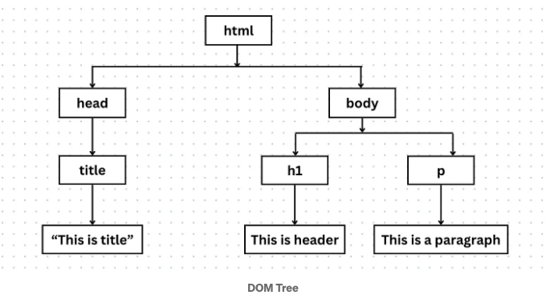
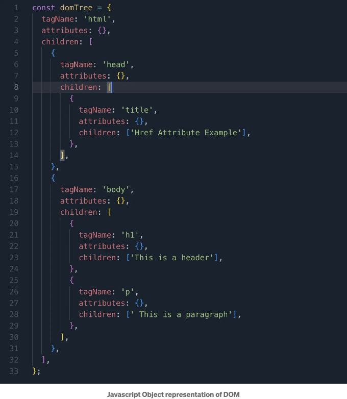

DOM(문서 객체 모델)은 JavaScript가 웹 페이지의 요소들과 상호 작용하고 조작할 수 있도록 하는 HTML 구조의 표현입니다. 각 HTML 요소는 DOM 트리 내에서 노드이며, HTML 코드에서의 중첩에 따라 부모-자식 관계가 형성됩니다. 다음 예시를 살펴보세요:

```js
<html>
  <head>
    <title>제목입니다</title>
  </head>
  <body>
    <h1>헤더입니다</h1>
    <p>문단입니다</p>
  </body>
</html>
```

이 HTML 코드에 대한 DOM 트리는 다음과 같이 보입니다.



<!-- ui-log 수평형 -->
<ins class="adsbygoogle"
  style="display:block"
  data-ad-client="ca-pub-4877378276818686"
  data-ad-slot="9743150776"
  data-ad-format="auto"
  data-full-width-responsive="true"></ins>
<component is="script">
(adsbygoogle = window.adsbygoogle || []).push({});
</component>

웹 브라우저는 DOM 트리를 활용하여 HTML 문서를 표현하고 조작합니다. 이를 통해 브라우저 디스플레이 내 요소들을 쉽게 식별하고 배치할 수 있습니다.

그러나 DOM 요소를 수정하거나 변경하는 것은 자원을 많이 소비하고 시간이 오래 걸리는 작업입니다. DOM 요소가 변경되면 브라우저는 요소의 크기와 위치를 다시 계산하고 화면을 다시 그려야 합니다.

여기서 가상 DOM이 등장합니다. 변경 사항에 대한 DOM을 업데이트하는 효율적인 대안으로 작용하여 필요한 시간을 크게 단축시켜줍니다. 그래서 React는 Virtual DOM을 사용합니다.

# Virtual DOM

<!-- ui-log 수평형 -->
<ins class="adsbygoogle"
  style="display:block"
  data-ad-client="ca-pub-4877378276818686"
  data-ad-slot="9743150776"
  data-ad-format="auto"
  data-full-width-responsive="true"></ins>
<component is="script">
(adsbygoogle = window.adsbygoogle || []).push({});
</component>

가상 DOM은 실제 DOM의 JavaScript 객체 표현입니다. 위의 HTML 코드 조각을 고려해보세요. 아래에는 해당하는 JavaScript 객체 표현이 있습니다.



React는 HTML의 JavaScript 객체를 생성합니다. 정확히 말하면 JSX(HTML의 문법적 설탕이라고도 할 수 있음)를 React.createElement를 사용하여 생성합니다.

가상 DOM을 업데이트하는 것은 실제 DOM을 업데이트하는 것보다 훨씬 빠르고 효율적입니다. 가상 DOM을 업데이트하는 것은 웹 브라우저 처리 작업(페인팅 및 영역 재보정과 같은)이 필요하지 않기 때문입니다. 이것은 JavaScript 객체를 직접 업데이트하는 것을 포함합니다.

<!-- ui-log 수평형 -->
<ins class="adsbygoogle"
  style="display:block"
  data-ad-client="ca-pub-4877378276818686"
  data-ad-slot="9743150776"
  data-ad-format="auto"
  data-full-width-responsive="true"></ins>
<component is="script">
(adsbygoogle = window.adsbygoogle || []).push({});
</component>

리액트는 조화(reconciliation)를 통해 DOM 업데이트 과정을 더욱 향상시키고 간소화합니다.

## 조화 (Reconciliation)

조화는 리액트의 주요 기능 중 하나로, 필요한 변경 사항만을 반영하여 효율적으로 DOM을 업데이트합니다. 복잡한 과정이지만, 다음은 조화가 따르는 기본 단계입니다.

조화 과정은 다음과 같은 주요 단계를 포함합니다:

<!-- ui-log 수평형 -->
<ins class="adsbygoogle"
  style="display:block"
  data-ad-client="ca-pub-4877378276818686"
  data-ad-slot="9743150776"
  data-ad-format="auto"
  data-full-width-responsive="true"></ins>
<component is="script">
(adsbygoogle = window.adsbygoogle || []).push({});
</component>

- React는 실제 DOM의 가벼운 복사본인 가상 DOM을 생성합니다.
- 컴포넌트 상태나 속성이 변경될 때마다 React는 새로운 가상 DOM을 생성합니다.
- React는 새로운 가상 DOM과 이전 가상 DOM 간의 변경 사항을 비교하고 분석하는 차별화 알고리즘을 사용합니다.
- 위 단계는 실제 DOM에서 다시 렌더링이 필요한 컴포넌트를 결정하는 데 도움이 됩니다.
- 마지막으로 실제 DOM에 변경 사항이 적용됩니다.

차별화 알고리즘을 통해 실제 DOM에 필요한 최소한의 변경만이 발생합니다.

여러 상태 변경이 발생하더라도 조정 과정 덕분에 실제 DOM은 한 번만 업데이트되어 효율적인 렌더링과 부드러운 사용자 경험을 보장합니다.

위 단계를 통해 조정 과정에 대한 명확한 이해와 React 앱이 더 빠르게 실행되는 방법에 대해 이해하고, 차별화 알고리즘을 더 깊이 이해해 보겠습니다.

<!-- ui-log 수평형 -->
<ins class="adsbygoogle"
  style="display:block"
  data-ad-client="ca-pub-4877378276818686"
  data-ad-slot="9743150776"
  data-ad-format="auto"
  data-full-width-responsive="true"></ins>
<component is="script">
(adsbygoogle = window.adsbygoogle || []).push({});
</component>

# Diffing 알고리즘

Diffing 알고리즘은 조화 과정의 중심 역할을 하는데, 효율성과 속도에 기여합니다. 이 알고리즘은 매우 복잡하지만 다음 주요 포인트에 초점을 맞춥니다.

## 1. 서로 다른 유형의 요소들

가상 DOM 트리의 루트 요소가 서로 다른 유형일 때, React의 Diffing 알고리즘은 전체 이전 DOM 트리를 폐기하고 처음부터 새로운 DOM을 구성합니다. 다음 예를 살펴보세요:

<!-- ui-log 수평형 -->
<ins class="adsbygoogle"
  style="display:block"
  data-ad-client="ca-pub-4877378276818686"
  data-ad-slot="9743150776"
  data-ad-format="auto"
  data-full-width-responsive="true"></ins>
<component is="script">
(adsbygoogle = window.adsbygoogle || []).push({});
</component>

```js
원본 DOM:

<div>
   <Counter/>
</div>

업데이트된 DOM:

<span>
   <Counter/>
</span>
```

이 예시에서 루트 노드는 `div`에서 `span`으로 변환됩니다. 루트 노드의 유형이 변경되었기 때문에 diffing 알고리즘은 이전 DOM 트리 전체를 제거하고 처음부터 다시 구축합니다. 이 과정은 `Counter` 컴포넌트의 상태를 언마운트하고 제거하고 이후 다시 구성하는 작업을 포함합니다.

이 행동은 서로 다른 유형의 요소가 서로 다른 가상 DOM 구조를 생성할 것으로 가정하고 있습니다. 따라서 루트 요소의 유형이 변경되면 diffing 알고리즘은 전체 하위 트리가 교체되었을 것으로 가정하며 완전히 다시 구축해야 한다고 판단합니다. 이러한 접근 방식은 DOM이 응용 프로그램 상태와 동기화되어 일관된 신뢰할 수 있는 사용자 경험을 제공하도록 보장합니다.

## 2. 동일 유형의 DOM 요소

<!-- ui-log 수평형 -->
<ins class="adsbygoogle"
  style="display:block"
  data-ad-client="ca-pub-4877378276818686"
  data-ad-slot="9743150776"
  data-ad-format="auto"
  data-full-width-responsive="true"></ins>
<component is="script">
(adsbygoogle = window.adsbygoogle || []).push({});
</component>

동일한 유형의 두 개의 React DOM 요소를 비교할 때 React는 속성을 살피고 동일한 기본 DOM 노드를 유지하며 변경된 속성만을 업데이트합니다. 다음 예시를 살펴보세요:

```js
초기 DOM:
<div className="before" title="stuff" />

업데이트된 DOM:
<div className="after" title="stuff" />
```

기본 `div` 요소가 동일한 채로 유지되므로 React는 존재하는 DOM 요소의 className 속성을 효과적으로 업데이트하여 그 기본 구조를 보존합니다.

## 3. 동일 유형의 컴포넌트 요소

<!-- ui-log 수평형 -->
<ins class="adsbygoogle"
  style="display:block"
  data-ad-client="ca-pub-4877378276818686"
  data-ad-slot="9743150776"
  data-ad-format="auto"
  data-full-width-responsive="true"></ins>
<component is="script">
(adsbygoogle = window.adsbygoogle || []).push({});
</component>

같은 유형의 구성 요소 요소를 비교할 때 디프 알고리즘은 구성 요소의 기본 DOM 노드가 렌더링 간에 유지됨을 이용합니다.
이는 React가 구성 요소를 위해 전체 DOM 하위 트리를 다시 생성할 필요가 없다는 것을 의미합니다. 대신 기존 구성 요소 인스턴스의 속성 및 상태를 업데이트하는 데 집중할 수 있습니다. 조금 복잡하게 들릴 수 있지만 다음 예를 고려해 보세요:

```js
<Counter count={0}>
  <button onClick={() => setCount(count + 1)}>+</button>
  <button onClick={() => setCount(count - 1)}>-</button>
  <span>{count}</span>
</Counter>
```

Counter라는 React 구성 요소가 있다고 가정해봅시다. 이 구성 요소는 카운터 값을 표시하고 증가 및 감소 버튼을 제공합니다.

이제 사용자가 증가 버튼을 클릭하여 카운터 값을 1로 업데이트한다고 상상해보세요. React의 디프 알고리즘은 이전 및 새 가상 DOM 트리를 비교할 것입니다. 루트 요소(Counter)가 동일한 유형이기 때문에 디프 알고리즘은 기존 컴포넌트 인스턴스의 속성 및 상태를 업데이트하는 데 집중하며 새로운 DOM 요소를 처음부터 만들지 않을 것입니다.

<!-- ui-log 수평형 -->
<ins class="adsbygoogle"
  style="display:block"
  data-ad-client="ca-pub-4877378276818686"
  data-ad-slot="9743150776"
  data-ad-format="auto"
  data-full-width-responsive="true"></ins>
<component is="script">
(adsbygoogle = window.adsbygoogle || []).push({});
</component>

## 4. 자식 요소 반복

기본적으로 DOM 노드의 자식에 대해 재귀적으로 호출할 때, React는 단순히 두 목록의 자식을 동시에 순회하고 차이가 있을 때 변형을 생성합니다. 다음 예시를 살펴보세요.

```js
원본 DOM:

<ul>
  <li>첫 번째</li>
  <li>두 번째</li>
</ul>

업데이트된 DOM:

<ul>
  <li>첫 번째</li>
  <li>두 번째</li>
  <li>세 번째</li>
</ul>
```

이 예시에서 원본 DOM에는 `ul` 목록 내에 두 요소가 포함되어 있습니다. 그러나 업데이트된 DOM에는 `li`세 번째`/li`라는 새 요소가 목록 끝에 추가되었습니다. 차이 비교 알고리즘은 트리 구조를 간단히 비교하여 새 요소를 식별하고 DOM에 원활하게 추가합니다. 이 과정은 명확하고 직관적입니다.

<!-- ui-log 수평형 -->
<ins class="adsbygoogle"
  style="display:block"
  data-ad-client="ca-pub-4877378276818686"
  data-ad-slot="9743150776"
  data-ad-format="auto"
  data-full-width-responsive="true"></ins>
<component is="script">
(adsbygoogle = window.adsbygoogle || []).push({});
</component>

하지만 이 예제를 살펴보고 주의깊게 관찰해보세요.

```js
원본 DOM:

- first
- second

업데이트된 DOM:

- zero
- first
- second
```

이 예제에서 원본 DOM은 `ul` 목록에 두 개의 요소가 포함되어 있습니다. 그러나 업데이트된 DOM에서는 새로운 요소가 목록의 첫 번째 위치에 추가되었습니다. 결과적으로 diffing 알고리즘은 목록의 첫 번째 요소인 `li`first`/li`와 `li`zero`/li`를 비교합니다.

그들이 서로 다르기 때문에 알고리즘은 요소를 재구성합니다. 두 번째 요소를 비교할 때도 `li`second`/li`와 `li`first`/li`를 다시 재구성합니다. 이 접근 방식은 전체 목록이 재구성되어 비효율적인 프로세스가 됩니다.

<!-- ui-log 수평형 -->
<ins class="adsbygoogle"
  style="display:block"
  data-ad-client="ca-pub-4877378276818686"
  data-ad-slot="9743150776"
  data-ad-format="auto"
  data-full-width-responsive="true"></ins>
<component is="script">
(adsbygoogle = window.adsbygoogle || []).push({});
</component>

이 문제를 해결하기 위해 React에서는 키를 도입했습니다.

```js
기존 DOM:

<ul>
  <li key="first">first</li>
  <li key="second">second</li>
</ul>

업데이트된 DOM:

<ul>
  <li key="zero">zero</li>
  <li key="first">first</li>
  <li key="second">second</li>
</ul>
```

Diffing 알고리즘은 이제 키를 지능적으로 비교하고 키가 수정된 요소만 선택적으로 업데이트할 수 있습니다. 이로써 DOM의 업데이트가 더 효율적으로 이루어지며 렌더링 프로세스가 최적화됩니다.

React가 항목에 키 제공을 요구하는 경고가 표시되는 이유입니다.

<!-- ui-log 수평형 -->
<ins class="adsbygoogle"
  style="display:block"
  data-ad-client="ca-pub-4877378276818686"
  data-ad-slot="9743150776"
  data-ad-format="auto"
  data-full-width-responsive="true"></ins>
<component is="script">
(adsbygoogle = window.adsbygoogle || []).push({});
</component>

# 재조정 알고리즘 유형

이 블로그에서는 이에 대한 포괄적인 개요만 다룰 것입니다:

## 1. 스택 재조정 알고리즘:

React 16 이전에는 차이 비교 알고리즘이 Virtual DOM과 실제 DOM 사이의 변경 사항을 식별하는 것을 담당했으며, 스택 재조정 알고리즘이 이러한 변경 사항을 DOM에 적용하는 역할을 수행했습니다. 이는 수행해야 하는 각 변경이 스택에 푸시되고 동기적으로 실행되었다는 것을 의미합니다.

<!-- ui-log 수평형 -->
<ins class="adsbygoogle"
  style="display:block"
  data-ad-client="ca-pub-4877378276818686"
  data-ad-slot="9743150776"
  data-ad-format="auto"
  data-full-width-responsive="true"></ins>
<component is="script">
(adsbygoogle = window.adsbygoogle || []).push({});
</component>

스택 기반 접근 방식의 여러 도전 과제는 다음과 같습니다:
1. 스택 조정 알고리즘은 한 번에 업데이트를 하나씩 처리할 수밖에 없어, 동시에 여러 상태 변경이 발생할 때 지연이 발생합니다.

2. 또한, A → B → C와 같은 순서에서 상태 A에서 C로 전환할 때, 이상적인 시나리오는 최종 상태 C를 화면에 바로 표시하는 것입니다. 그러나 스택 기반 알고리즘에서는 A와 C 사이에 중간 상태 B가 보이게 됩니다. 이는 비효율성을 도입할 뿐만 아니라 화면에서 전환이 보입니다.

3. 또한, 이러한 업데이트가 이루어지는 동안 UI가 무응답 상태가 됩니다.

4. 또한, 애니메이션의 경우에도 성능에 영향을 미쳤습니다.

<!-- ui-log 수평형 -->
<ins class="adsbygoogle"
  style="display:block"
  data-ad-client="ca-pub-4877378276818686"
  data-ad-slot="9743150776"
  data-ad-format="auto"
  data-full-width-responsive="true"></ins>
<component is="script">
(adsbygoogle = window.adsbygoogle || []).push({});
</component>

## 2. Fiber 조정 알고리즘:

스택 기반 조정의 한계를 해결하기 위해 React 16부터 Fiber 조정 알고리즘이 도입되었습니다. 이는 더 효율적이고 유연한 방식으로 DOM을 업데이트하는 것을 가능하게 합니다.

스택 기반 접근법 대비 다양한 개선 사항은 다음과 같습니다:
1. Fiber는 동시에 여러 업데이트를 처리할 수 있어, 여러 상태 변경이 발생할 때에도 UI가 반응성을 유지할 수 있습니다.

2. Fiber는 레인 기반 스케줄링을 사용하여 업데이트의 긴급성에 따라 업데이트를 우선순위를 정하므로, 중요한 업데이트는 즉시 처리되고 필수적이지 않은 업데이트는 이후에 처리될 수 있도록 합니다.

<!-- ui-log 수평형 -->
<ins class="adsbygoogle"
  style="display:block"
  data-ad-client="ca-pub-4877378276818686"
  data-ad-slot="9743150776"
  data-ad-format="auto"
  data-full-width-responsive="true"></ins>
<component is="script">
(adsbygoogle = window.adsbygoogle || []).push({});
</component>

3. 피버는 해야 할 업데이트를 작은 조각으로 나눕니다. 이를 통해 알고리즘이 사용자 상호 작용이나 애니메이션 렌더링과 같은 다른 작업과 교차하여 실행되도록 할 수 있습니다. 이로써 업데이트가 적용되는 동안에도 UI가 반응성을 유지할 수 있습니다.

React가 어떻게 작동하는지에 대한 개요였습니다. 이 주제를 이해하는 데 도움이 되었으면 좋겠습니다. 의문이나 제안이 있으면 언제든지 댓글을 달아주세요.